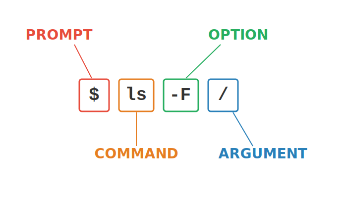
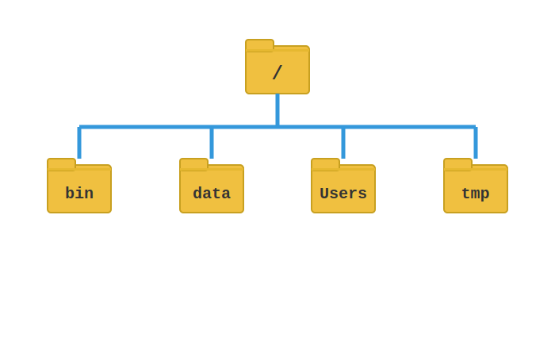
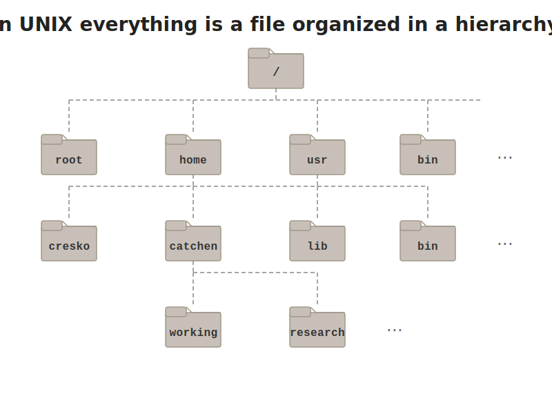
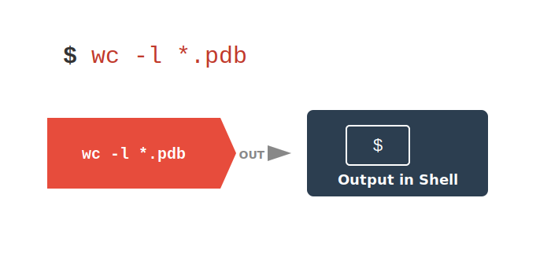

```{r}
#| label: setup
#| include: false

library(tidyverse)
library(knitr)

theme_set(theme_minimal(base_size = 14))
set.seed(2026)
```

# Appendix B: Unix & the Command Line {background-color="#2c3e50"}

## Overview

::: {.callout-tip title="Pre-requisite Material"}
This appendix covers the Unix command line --- the foundational interface for scientific computing. You will learn shell navigation, file operations, reading and writing files, I/O redirection, pipes, and how to work with large data files. See also Week 1 of the main lectures for an introduction to these concepts.
:::

# Accessing the Shell {background-color="#2c3e50"}

## What is Unix? {.smaller}

::: incremental
-   A scripting language developed in 1969, released in 1973
-   Serves as the base language for many programs and computers
-   Runs both locally on your computer and on large clusters like Talapas
-   Linux is an open-source version of the same language
:::

## What is a Shell?

-   The 'shell' is a program that runs UNIX and takes in commands and gives them to the operating system
-   **`Bash`** acts as the shell in Macs, Linux, and now Windows
-   You can access the shell via a **`terminal window`**

## Accessing the Shell --- Mac and Linux {.smaller}

-   Mac users: open the "Terminal" app, or use another app like 'iTerm2'
-   Linux users: open one of several "Terminal" apps

::: {.callout-caution title="Windows users have a little more work to do"}
See the next slides for Windows Subsystem for Linux (WSL) installation
:::

## Accessing the Shell --- Windows {.smaller}

-   Guide: `https://ubuntu.com/tutorials/install-ubuntu-on-wsl2-on-windows-10`
-   Run Windows PowerShell as administrator
-   Install WSL2 by typing `wsl --install`
-   Restart your computer
-   Search for and install Ubuntu from Microsoft store app
-   ***OR*** type `wsl --install -d ubuntu` on PowerShell to do both at once

## Setting Up WSL {.smaller}

-   Open Ubuntu and set up a username and password
-   Does not have to match your login info for Windows
-   Run `sudo apt update` then `sudo apt upgrade` to ensure everything is up to date
-   Will need to create folders and files within your Ubuntu folder on your computer

## Recipes for a Shell Command {.smaller}

-   **Prompt**: notation used to indicate your computer is ready to accept a new command
-   **Command**: the building blocks of programming, tell computer to do a specific task
-   **Options**: change the behavior of a command
-   **Argument**: what the command should operate on

{fig-align="center" width="90%"}

# Navigating the File System {background-color="#2c3e50"}

## How is a Computer Organized? {.smaller}

-   System of directories (folders) and files
-   `/` = the root directory, which holds all other directories
-   Most of your files will be located under `/Users` in a directory of your username
-   The `~` is shorthand for your home folder
-   Navigation in the shell consists of jumping up and down between directories
-   The "path" refers to the location a file is in (e.g., `/Users/wcresko/Documents`)

{fig-align="center" width="80%"}

## The Unix File Hierarchy

{fig-align="center" width="90%"}

## Relative vs. Absolute Paths {.smaller}

::: panel-tabset
### Concept

-   **Absolute path**: Full path from root `/` (e.g., `/Users/wcresko/Documents`)
-   **Relative path**: Path from current location (e.g., `../Documents`)
-   `.` refers to the current directory
-   `..` refers to the parent directory

### Examples

``` bash
# Absolute path
cd /Users/wcresko/Documents

# Relative paths
cd ..           # Go up one directory
cd ./data       # Go into data directory (same as cd data)
cd ../scripts   # Go up one, then into scripts
cd ~            # Go to home directory
cd -            # Go to previous directory
```
:::

## Common Navigation Commands {.smaller}

::: panel-tabset
### Commands

::: incremental
-   **`pwd`** = "print working directory" --- shows where you are
-   **`ls`** = "list" --- list all directories and files in current position
    -   `ls -F` = denote which results are directories, files, etc.
    -   `ls -l` = "long format" --- lists total file sizes
    -   `ls -r` = "reverse" --- lists the results in reverse order
    -   `ls -S` = "size" --- sort results by size
    -   `ls -t` = "time" --- sort results by time created
-   **`cd`** = "change directory"
    -   `cd ..` = go up one directory
    -   `cd -` = go to last directory
    -   `cd ~` = go to home directory
:::

### Practice

Try navigating around your computer using `cd` and `ls`:

``` bash
# Where am I?
pwd

# What's in my home directory?
cd ~
ls -la

# Move into Documents
cd Documents
ls

# Go back up
cd ..
pwd
```
:::

# Working with Files {background-color="#2c3e50"}

## File Operations {.smaller}

::: panel-tabset
### Commands

::: incremental
-   Make new folders: `mkdir`
-   Make new files: `nano`, `touch`
-   Rename files: `mv`
-   Move files: `mv`
-   Copy files: `cp`
-   Delete files: `rm`
-   Delete directories: `rmdir`
-   Examining file length: `wc`
-   Reading files: `cat`
-   Looking at beginning or end: `head` or `tail`
:::

### Important Notes

-   The shell trusts you
    -   It will delete files you say to delete
    -   It will override files if you name 2 things the same
-   Naming conventions
    -   Avoid spaces
    -   Don't start with a `–`
    -   Stick to letters, numbers, `.`, `-`, and `_`
-   Use appropriate file extensions in file names
    -   Some software expect files with certain extensions (`.fasta`, `.txt`, etc.)
:::

## Practice: File Operations {.smaller}

::: {.callout-tip title="Hands-On Exercise"}
1.  Make a new directory called whatever you'd like
2.  Add a file named `Practice.txt` to the directory and add some text
3.  Read the contents of the file and get its length
4.  Rename the file to `Super_practice.txt`
5.  Move the file to a new folder named `Testing`
6.  Make a copy named `Super_practice_copy.txt`
7.  Delete the original `Super_practice.txt`
:::

# Reading Files in Unix {background-color="#2c3e50"}

## Commands for Reading Files {.smaller}

::: panel-tabset
### Overview

-   **`cat`** = concatenate and display files (good for small files)
-   **`less`** = view file page by page (`space` forward, `b` back, `q` quit, `/pattern` search)
-   **`more`** = similar to `less` but simpler
-   **`head`** = display first 10 lines (default); `head -n 20 file.txt` for first 20
-   **`tail`** = display last 10 lines (default); `tail -f file.txt` follows a growing file

### Examples

``` bash
# View entire small file
cat small_file.txt

# Page through a large file
less large_file.txt

# First and last lines
head -n 5 data.txt
tail -n 5 data.txt

# Follow a log file in real time
tail -f logfile.txt
```
:::

## Input Redirection {.smaller}

::: panel-tabset
### Concept

-   **`<`** = redirect input from a file (`command < input.txt`)
-   **`<<`** = here document (multi-line input)
-   Example uses:
    -   `wc -l < data.txt` counts lines in data.txt
    -   `sort < names.txt` sorts contents of names.txt
    -   Many commands can read from files directly OR from `stdin`

### Examples

``` bash
# Count lines using redirection
wc -l < data.txt

# Sort file contents
sort < names.txt

# Word count
wc -w < report.txt
```
:::

# Writing Files in Unix {background-color="#2c3e50"}

## Output Redirection {.smaller}

::: panel-tabset
### Operators

-   **`>`** = redirect output to a file (overwrites!)
-   **`>>`** = append output to a file
-   **`2>`** = redirect error messages
-   **`&>`** = redirect both output and errors

### Examples

``` bash
# Save file listing to a file (overwrites)
ls -l > filelist.txt

# Append to existing file
echo "new line" >> existing.txt

# Capture errors separately
command 2> errors.txt

# Capture everything
command &> all_output.txt
```
:::

## Unix Three Standard Streams {.smaller}

::: panel-tabset
### Concept

-   **stdin (0)** = Standard Input (default: keyboard)
-   **stdout (1)** = Standard Output (default: terminal screen)
-   **stderr (2)** = Standard Error (default: terminal screen)

### Diagram

``` text
         ┌──────────────┐
stdin ───>│              │───> stdout
    (0)  │   Program    │      (1)
         │              │───> stderr
         └──────────────┘      (2)
```

-   File descriptor numbers: 0, 1, 2
-   Can redirect each stream independently
-   Programs don't know if streams are redirected
-   This abstraction is key to Unix philosophy

### Redirection

``` bash
# Redirect stdout to file (equivalent ways)
ls -l > files.txt
ls -l 1> files.txt

# Redirect stderr to file
ls /nonexistent 2> errors.txt

# Redirect both to same file
ls -l /nonexistent &> all_output.txt
```
:::

# Unix Pipes {background-color="#2c3e50"}

## What are Pipes? {.smaller}

::: panel-tabset
### Concept

-   **`|`** = the pipe operator
    -   Takes output from one command as input to another
    -   Chains commands together
    -   No intermediate files needed!
-   Basic syntax: `command1 | command2 | command3`
-   Power of Unix philosophy:
    -   Small tools that do one thing well
    -   Combine them to do complex tasks

### Visual

{fig-align="center" width="90%"}
:::

## Common Pipe Patterns {.smaller}

::: panel-tabset
### Basic Patterns

-   **Counting patterns:** `grep "pattern" file.txt | wc -l`
-   **Sorting and uniqueness:** `cat file.txt | sort | uniq`
-   **Finding top/bottom items:** `sort data.txt | head -5`
-   **Filtering and processing:** `ls -l | grep ".txt" | awk '{print $5, $9}'`

### Advanced Patterns

``` bash
# Extract column 2, count unique values, sort by frequency
cat data.csv | cut -d',' -f2 | sort | uniq -c | sort -rn

# Find all txt files and sort by line count
find . -name "*.txt" | xargs wc -l | sort -n

# Watch log file for errors in real-time
tail -f logfile.txt | grep ERROR
```

### Full Pipeline

``` bash
# Read a file, process it, save results, and display
cat data.txt | \
  grep -v "^#" | \       # Remove comment lines
  cut -f1,3 | \          # Extract columns 1 and 3
  sort -k2 -n | \        # Sort by column 2 numerically
  tee results.txt | \    # Save to file AND pass along
  head -10               # Show top 10
```
:::

## Bioinformatics Pipeline Example {.smaller}

::: panel-tabset
### Pipeline

``` bash
# FASTQ processing pipeline with error handling
zcat reads.fastq.gz 2> unzip_errors.log |
fastqc stdin 2> qc_errors.log |
trimmomatic 2> trim_errors.log |
bowtie2 -x genome - 2> alignment_stats.txt |
samtools sort 2> sort_errors.log |
samtools index - 2> index_errors.log

# Check all error logs at once
cat *_errors.log | grep -E "ERROR|WARNING"
```

### Tips

-   Test pipes step by step --- build complex pipes incrementally
-   Check output at each stage
-   Use `less` for large files instead of `cat`
-   Remember: `>` overwrites, `>>` appends
-   Filter early in the pipeline to reduce data passed between commands
-   Save intermediate results when debugging complex pipes
:::

## Practice Exercise: Files and Pipes {.smaller}

::: {.callout-tip title="Hands-On Exercise"}
1.  Create a file with a list of numbers (one per line)
2.  Use pipes to sort them numerically
3.  Save the sorted list to a new file using redirection
4.  Use `tee` to display and save the top 5 numbers
5.  Count how many unique numbers you have using pipes
6.  Append the count to your results file
:::

# Working with Large Genomic Data Files {background-color="#2c3e50"}

## Human Chromosome Data {.smaller}

-   Genomic data files can be massive (human genome \~6 billion base pairs)
-   FASTA format is standard for sequence data
-   Perfect use case for Unix pipes and redirection
-   Let's work with human genome assembly version 38 (\~3.1 GB)

## Downloading Genomic Data {.smaller}

::: panel-tabset
### wget

``` bash
# Using wget to download human genome
wget https://ftp.ncbi.nlm.nih.gov/genomes/all/GCF/000/001/405/\
GCF_000001405.40_GRCh38.p14/GCF_000001405.40_GRCh38.p14_genomic.fna.gz
```

### curl

``` bash
# Using curl and save with specific name
curl -o human_genome.fa.gz https://ftp.ncbi.nlm.nih.gov/genomes/all/GCF/000/001/405/\
GCF_000001405.40_GRCh38.p14/GCF_000001405.40_GRCh38.p14_genomic.fna.gz
```

### Notes

-   `wget` and `curl` are both tools for downloading files
-   The backslash (`\`) allows long URLs to span multiple lines
-   `.gz` extension means the file is compressed
:::

## Examining Large Files Efficiently {.smaller}

::: panel-tabset
### Commands

``` bash
# Decompress and look at first 10 lines
gunzip -c human_genome.fa.gz | head -10

# Check file size before and after decompression
ls -lh human_genome.fa.gz
gunzip human_genome.fa.gz
ls -lh human_genome.fa

# Count sequences in FASTA file (lines starting with >)
grep "^>" human_genome.fa | wc -l

# View sequence headers only
grep "^>" human_genome.fa | less
```

### Key Rule

::: {.callout-important title="Don't use cat on huge files!"}
Use `head`, `tail`, `less`, or streaming tools instead. Loading a 3 GB file into memory with `cat` will slow down or crash your session.
:::
:::

## Processing FASTA Files with Pipes {.smaller}

::: panel-tabset
### Extract and Count

``` bash
# Extract just the sequence (no headers) and count bases
grep -v "^>" human_genome.fa | tr -d '\n' | wc -c

# Count each type of nucleotide
grep -v "^>" human_genome.fa | \
  tr -d '\n' | \
  fold -w1 | \
  sort | \
  uniq -c
```

### Stream Processing

``` bash
# Download, decompress, and process in one pipeline
curl -s https://url/to/genome.fa.gz | \
  gunzip -c | \
  grep -v "^>" | \
  tr -d '\n' | \
  cut -c1-1000000 > first_megabase.txt
```
:::

## Working with Compressed Files {.smaller}

::: panel-tabset
### View without Extracting

``` bash
# View compressed files without extracting
zcat file.gz | head
zless file.gz
zgrep "pattern" file.gz
```

### Compress/Decompress

``` bash
# Compress and decompress
gzip file.txt          # Creates file.txt.gz
gunzip file.txt.gz     # Restores file.txt
gzip -k file.txt       # Keep original file

# Concatenate compressed files
zcat file1.gz file2.gz | gzip > combined.gz
```
:::

## Key Takeaways {.smaller}

::: {.callout-note title="Unix Best Practices for Large Data"}
-   Real bioinformatics often involves gigabytes of data --- these Unix tools scale beautifully
-   **Never load entire genome files into memory** --- use streaming
-   **Combine tools** --- each does one thing well
-   **Test on subsets first** --- extract small portions for development
-   **Document your pipelines** --- save commands in scripts
-   **Use compression** --- work with `.gz` files directly when possible
-   **Think in streams** --- data flows through pipes without intermediate files
:::

## Where Do You Get Help?

-   Manual pages!
    -   The shell has manuals for all basic commands
    -   Type `man [command_name]` to access the manual for a specific command
    -   Type `q` to exit
-   Also... the internet!
-   Also... Generative AI (ChatGPT, Claude, etc.)
