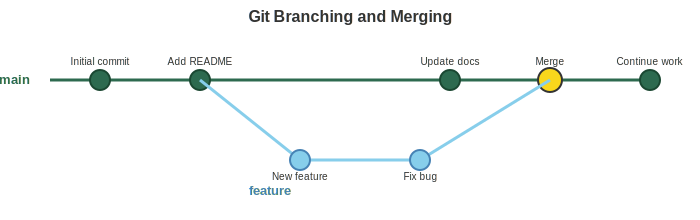

```{r}
#| label: setup
#| include: false

library(tidyverse)
library(knitr)

theme_set(theme_minimal(base_size = 14))
set.seed(2026)
```

# Appendix E: Git, GitHub & Version Control {background-color="#2c3e50"}

## Overview

::: {.callout-tip title="Pre-requisite Material"}
This appendix introduces Git and GitHub --- essential tools for version control and collaboration in scientific computing. You will learn how to track changes in your code, collaborate with others, and host your work online. These skills are critical for reproducible research.
:::

# What is Version Control? {background-color="#2c3e50"}

## Git and GitHub {.smaller}

### What is Git?

-   **Git** is a distributed version control system
-   Tracks changes in your code over time
-   Allows collaboration with others
-   Maintains complete history of all changes

### What is GitHub?

-   **GitHub** is a web-based hosting service for Git repositories
-   Provides cloud storage for your code
-   Enables collaboration features
-   Hosts documentation and websites (GitHub Pages)
-   Free for public repositories

## Git Workflow Concept {.smaller}

{fig-align="center" width="100%"}

<!--
DUPLICATE SLIDE - Original Mermaid (remove when SVG is finalized)

## Git Workflow Concept (Mermaid Original) {.smaller}

```{mermaid}
%%| fig-width: 10
%%| fig-height: 6
%%{init: {'theme': 'base', 'themeVariables': {'fontSize': '18px', 'fontFamily': 'arial', 'primaryTextColor': '#000000'}}}%%
flowchart LR
    A[Working Directory] --> GA([git add])
    GA --> B[Staging Area]
    B --> GC([git commit])
    GC --> C[Local Repository]
    C --> GP([git push])
    GP --> D[Remote Repository]
    D --> GPL([git pull])
    GPL --> A

    style A fill:#f9d71c,stroke:#333,stroke-width:2px,color:#000000
    style B fill:#87ceeb,stroke:#333,stroke-width:2px,color:#000000
    style C fill:#98fb98,stroke:#333,stroke-width:2px,color:#000000
    style D fill:#ffa07a,stroke:#333,stroke-width:2px,color:#000000
    style GA fill:#ffffff,stroke:#333,stroke-width:2px,color:#000000
    style GC fill:#ffffff,stroke:#333,stroke-width:2px,color:#000000
    style GP fill:#ffffff,stroke:#333,stroke-width:2px,color:#000000
    style GPL fill:#ffffff,stroke:#333,stroke-width:2px,color:#000000
```
-->

::: incremental
-   **Track Changes**: Every modification is recorded
-   **Collaboration**: Multiple people can work simultaneously
-   **Backup**: Your code is safe in multiple places
-   **Experimentation**: Try new things without breaking working code
:::

# Setting Up Git {background-color="#2c3e50"}

## Install and Configure Git {.smaller}

::: panel-tabset
### Install

``` bash
# Check if Git is installed
git --version

# macOS (with Homebrew)
brew install git

# Ubuntu/Debian
sudo apt-get install git

# Windows: Download from git-scm.com
```

### Configure

``` bash
# Set your name and email
git config --global user.name "Your Name"
git config --global user.email "your.email@example.com"

# Check your settings
git config --list
```

### Interpretation

-   Git must be installed before you can use it
-   Your name and email are attached to every commit you make
-   Use your university email for academic work
-   These settings only need to be configured once per machine
:::

# GitHub {background-color="#2c3e50"}

## GitHub for Scientific Collaboration {.smaller}

### Perfect for Research Projects:

-   **Reproducibility**: Complete history of analysis development
-   **Collaboration**: Work with colleagues worldwide
-   **Documentation**: README files, wikis, and GitHub Pages
-   **Issues**: Track bugs, ideas, and to-dos
-   **Releases**: Tag specific versions for publications
-   **DOI Integration**: Link with Zenodo for citations

## Creating a GitHub Account {.smaller}

### Steps to Get Started:

1.  Go to [github.com](https://github.com)
2.  Click "Sign up"
3.  Choose a username (professional, memorable)
4.  Add your university email
5.  Verify your account
6.  Consider GitHub Student Developer Pack:
    -   Free GitHub Pro while you're a student
    -   Access to development tools
    -   Apply at [education.github.com](https://education.github.com)

## Resources and Help {.smaller}

### Learning Resources:

-   **GitHub Docs**: `https://docs.github.com`
-   **Pro Git Book**: `https://git-scm.com/book` (free online)
-   **GitHub Learning Lab**: `https://github.com/apps/github-learning-lab`
-   **Quarto + GitHub Pages**: `https://quarto.org/docs/publishing/github-pages.html`

# Basic Git Commands {background-color="#2c3e50"}

## Initialize a Repository {.smaller}

::: panel-tabset
### Create New

``` bash
# Create a new repository
mkdir my_project
cd my_project
git init
```

### Clone Existing

``` bash
# Clone an existing repository from GitHub
git clone https://github.com/username/repository.git
```

### Interpretation

-   `git init` creates a new Git repository in the current directory
-   `git clone` downloads an existing repository from GitHub
-   Cloning creates a local copy with the complete history
-   Only do `git init` once per project
:::

## Track Changes {.smaller}

::: panel-tabset
### Commands

``` bash
# Check status --- what has changed?
git status

# Add files to staging area
git add filename.txt        # Add specific file
git add .                   # Add all changes

# Commit changes (save a snapshot)
git commit -m "Descriptive message about changes"
```

### Interpretation

-   `git status` shows you what files have been modified, added, or deleted
-   `git add` stages changes --- prepares them to be committed
-   `git commit` creates a permanent snapshot with a descriptive message
-   Think of staging as selecting which photos to put in an album, and committing as actually printing the album
:::

## Working with Remotes {.smaller}

::: panel-tabset
### Commands

``` bash
# Add a remote repository
git remote add origin https://github.com/username/repo.git

# View remotes
git remote -v

# Push changes to GitHub
git push origin main

# Pull changes from GitHub
git pull origin main

# Fetch without merging
git fetch origin
```

### Interpretation

-   **origin** is the conventional name for your primary remote (GitHub)
-   `push` sends your local commits to GitHub
-   `pull` downloads and merges remote changes to your local copy
-   `fetch` downloads changes but doesn't merge (safer for inspection)
-   Always `pull` before you start working to get the latest changes
:::

## Branching and Merging {.smaller}

::: panel-tabset
### Visual

{fig-align="center" width="100%"}

<!--
DUPLICATE SLIDE - Original Mermaid (remove when SVG is finalized)

```{mermaid}
%%| fig-width: 10
%%| fig-height: 6
%%{init: {'theme': 'base', 'themeVariables': {'fontSize': '16px', 'fontFamily': 'arial'}}}%%
gitGraph
    commit id: "Initial commit"
    commit id: "Add README"
    branch feature
    checkout feature
    commit id: "New feature"
    commit id: "Fix bug"
    checkout main
    commit id: "Update docs"
    merge feature
    commit id: "Continue work"
```
-->

### Commands

``` bash
# Create and switch to new branch
git checkout -b feature-branch

# Switch branches
git checkout main

# Merge branch into current branch
git merge feature-branch

# Delete branch after merging
git branch -d feature-branch
```

### Interpretation

-   Branches allow you to work on features independently
-   The `main` branch should always contain working code
-   Create feature branches for new work, then merge when ready
-   This protects your main code from incomplete changes
:::

## Common Git Workflow {.smaller}

::: panel-tabset
### Daily Cycle

``` bash
# 1. Start your day - update your local copy
git pull origin main

# 2. Create a feature branch
git checkout -b new-feature

# 3. Make changes and commit regularly
git add .
git commit -m "Add new analysis function"

# 4. Push your branch
git push origin new-feature

# 5. Create pull request on GitHub (via website)
```

### Best Practices

**Commit Messages:**

-   Be descriptive and concise
-   Use present tense: "Add feature" not "Added feature"
-   Reference issues: "Fix bug #123"

**Repository Organization:**

```
project/
├── README.md          # Project description
├── data/              # Raw data (consider .gitignore)
├── analysis/          # Analysis scripts
├── results/           # Output files
└── docs/              # Documentation
```
:::

## Viewing Commit History {.smaller}

::: panel-tabset
### Commands

``` bash
# View commit history
git log

# Prettier one-line format
git log --oneline

# With graph visualization
git log --graph --oneline --all

# Show changes in commits
git log -p

# Show last n commits
git log -3
```

### Interpretation

-   `git log` shows the complete history of commits
-   Each commit has a unique hash, author, date, and message
-   `--oneline` gives a compact view for quick scanning
-   `--graph` shows branch structure visually in the terminal
:::

## .gitignore File {.smaller}

::: panel-tabset
### Purpose

Exclude files from version control:

``` bash
# Create .gitignore file
touch .gitignore
```

### Common Patterns

``` bash
# Data files (too large for Git)
*.fastq
*.fasta
*.bam
*.vcf
data/raw/*

# R files
.Rhistory
.RData
.Rproj.user

# Output files
results/temp/*
*.log

# System files
.DS_Store
```

### Interpretation

-   `.gitignore` tells Git which files to never track
-   Put large data files, temporary files, and system files here
-   This keeps your repository clean and small
-   Sensitive files (passwords, API keys) should always be in `.gitignore`
:::

# GitHub Pages {background-color="#2c3e50"}

## Host Your Research Website for Free {.smaller}

{fig-align="center" width="100%"}

<!--
DUPLICATE SLIDE - Original Mermaid (remove when SVG is finalized)

## Host Your Research Website for Free (Mermaid Original) {.smaller}

```{mermaid}
%%| fig-width: 10
%%| fig-height: 5
%%{init: {'theme': 'base', 'themeVariables': {'fontSize': '18px', 'fontFamily': 'arial', 'primaryTextColor': '#000000'}}}%%
flowchart LR
    A[Quarto Documents] --> R([Render])
    R --> B[HTML Files]
    B --> GP([git push])
    GP --> C[GitHub Repository]
    C --> AU([Automatic])
    AU --> D[GitHub Pages Website]
    D --> E[yourname.github.io/project]

    style A fill:#e3f2fd,stroke:#333,stroke-width:2px,color:#000000
    style B fill:#ffffff,stroke:#333,stroke-width:2px,color:#000000
    style C fill:#ffffff,stroke:#333,stroke-width:2px,color:#000000
    style D fill:#ffffff,stroke:#333,stroke-width:2px,color:#000000
    style E fill:#c8e6c9,stroke:#333,stroke-width:2px,color:#000000
    style R fill:#ffffff,stroke:#333,stroke-width:2px,color:#000000
    style GP fill:#ffffff,stroke:#333,stroke-width:2px,color:#000000
    style AU fill:#ffffff,stroke:#333,stroke-width:2px,color:#000000
```
-->

### Setup Steps:

1.  Create repository
2.  Clone to your local computer
3.  Make changes in RStudio
4.  Add and Commit your changes
5.  Push your changes and files to the remote repository
6.  Enable Pages in repository settings
7.  Your site is live at `https://username.github.io/repo_name`

## GitHub Pages Configuration {.smaller}

::: panel-tabset
### Repository Settings

1.  Go to Settings → Pages
2.  Source: Deploy from a branch
3.  Branch: main (or gh-pages)
4.  Folder: `/docs` (preferable) or `/` (root)

### Quarto Configuration

``` yaml
# In _quarto.yml
project:
  type: website
  output-dir: docs
```

### Interpretation

-   GitHub Pages serves static HTML files from your repository
-   The `/docs` folder is the cleanest approach for Quarto projects
-   Quarto renders your `.qmd` files to HTML, which GitHub Pages serves
-   Any time you push changes, the website updates automatically
:::
