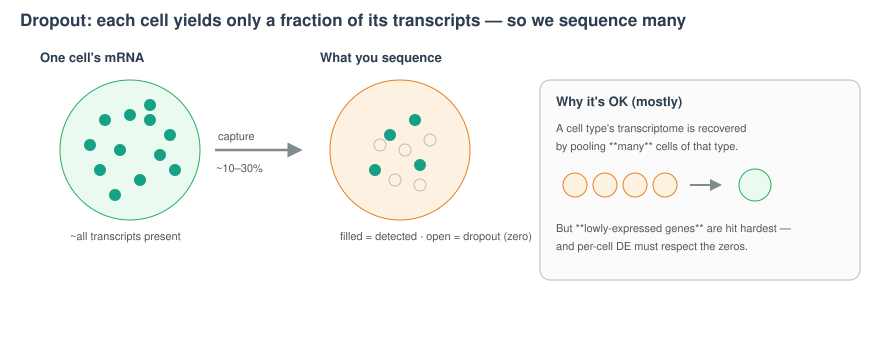
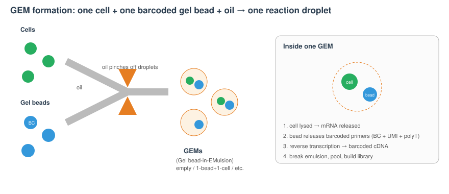

# DupLec 00 — alternatives to choose from {background-color="#2c3e50"}

## What this deck is

This is a **holding deck**, not part of the workshop. It collects the **alternative / duplicate figure renderings** that were pulled out of [Lecture 00](Lecture_00_Bulk_vs_scRNAseq.html) so the main deck stays tight (~15–20 min).

-   Each slide below is an **alternative version** of a figure that already appears in the live Lecture 00.
-   Under each one, *"Live deck uses:"* names the figure currently shown in Lecture 00 for that concept, so you can compare and pick.
-   This file is **not linked from the Materials page**. To swap an alternative into the live deck, move the slide back into `Lecture_00_Bulk_vs_scRNAseq.qmd`.

## Bulk vs. single-cell — the picture (alt 1)

*Live deck uses:* `images/lec01_bulk_vs_sc_concept.svg`

{fig-align="center" width="92%"}

## Bulk vs. single-cell — the picture (alt 2)

*Live deck uses:* `images/lec01_bulk_vs_sc_concept.svg`

{fig-align="center" width="92%"}

## Bulk vs. single-cell — the picture (alt 3)

*Live deck uses:* `images/lec01_bulk_vs_sc_concept.svg`

{fig-align="center" width="92%"}

## Dropout — alternative schematic

*Live deck uses:* the simulated "Sparsity, in numbers" R panel.

{fig-align="center" width="94%"}

::: callout-note
**Alternative to the sparsity panel.** Original figure: **Yu *et al.* 2020** (review; on Hope Healey's Lecture 1, slides ~28–36).
:::

## 3′ UTR annotation — alternative schematic

*Live deck uses:* the text slide "A polyA-capture catch: 3′ UTR annotation" (no figure).

{fig-align="center" width="96%"}

::: callout-note
**Visual for the 3′ UTR caveat.** Original concept figure: **Healey *et al.* 2022** (on Hope Healey's Lecture 1, slides ~25–26).
:::

## Chromium library prep — the full cycle (alt)

*Live deck uses:* `images/lec01_use_chromium_library_prep.svg`

{fig-align="center" width="92%"}

## GEM formation — alternative schematic

*Live deck uses:* `images/lec01_use_chromium_library_prep.svg`

{fig-align="center" width="96%"}

::: callout-note
**Alternative to the library-prep slide.** Original figures: **10x Genomics** Chromium Single Cell documentation — [10xgenomics.com/support/single-cell-gene-expression](https://www.10xgenomics.com/support/single-cell-gene-expression) (on Hope Healey's Lecture 1, slides ~17–22).
:::

## 10x read structure — alternative schematic

*Live deck uses:* `images/lec01_droplet_barcoding.svg`

{fig-align="center" width="96%"}

::: callout-note
**Alternative to the barcodes + UMIs slide.** Original figure: **10x Genomics** 3′ reagent kit documentation — [10xgenomics.com/support/single-cell-gene-expression](https://www.10xgenomics.com/support/single-cell-gene-expression) (on Hope Healey's Lecture 1, slide ~23).
:::

## UMIs in detail — amplification, sequencing, dedup (alt)

*Live deck uses:* `images/lec01_use_umi_deduplication.svg`

{fig-align="center" width="92%"}

## Raw data processing — BCL → count matrix (alt)

*Live deck uses:* `images/lec01_use_raw_data_processing.svg`

{fig-align="center" width="92%"}

## Pipelines side-by-side (alt)

*Live deck uses:* `images/lec01_data_processing_pipelines.svg`

{fig-align="center" width="92%"}

## Cell Ranger pipeline — alternative schematic

*Live deck uses:* the text slide "Under the hood: what Cell Ranger actually does" (no figure).

{fig-align="center" width="98%"}

::: callout-note
**Visual for the "under the hood" slide.** Original figures: **10x Genomics** Cell Ranger algorithms overview — [10xgenomics.com/support/software/cell-ranger/latest/algorithms-overview](https://www.10xgenomics.com/support/software/cell-ranger/latest/algorithms-overview) (on Hope Healey's Lecture 1, slides ~54–69).
:::
