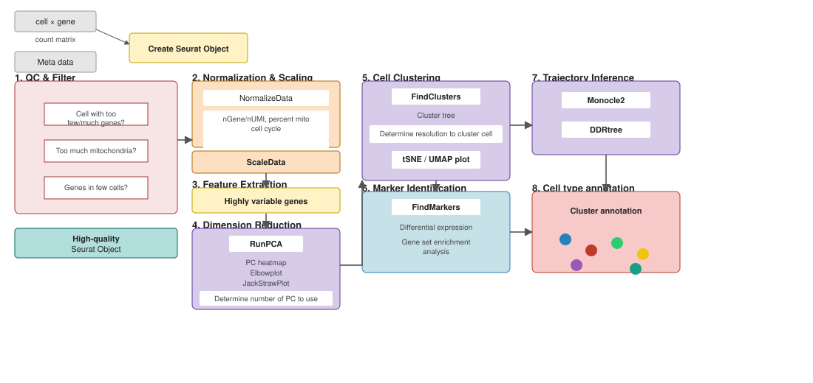
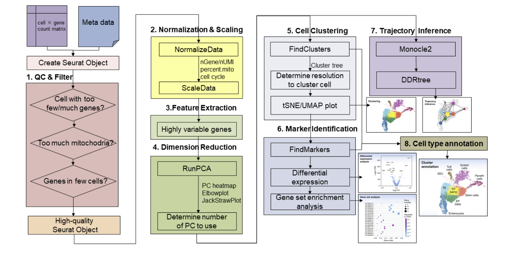
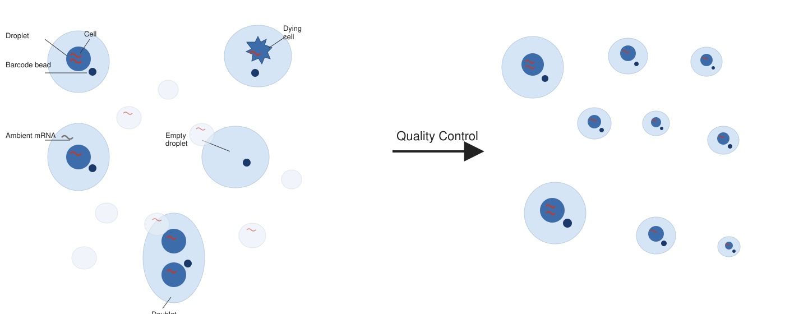
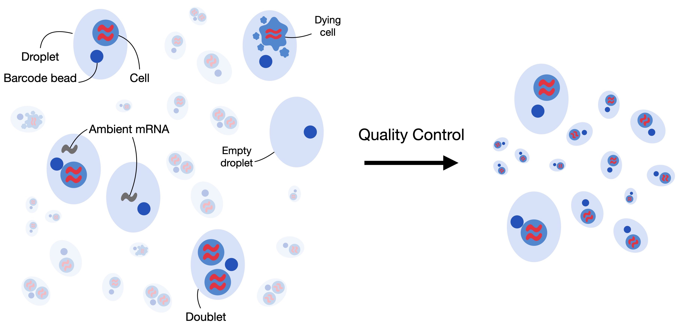
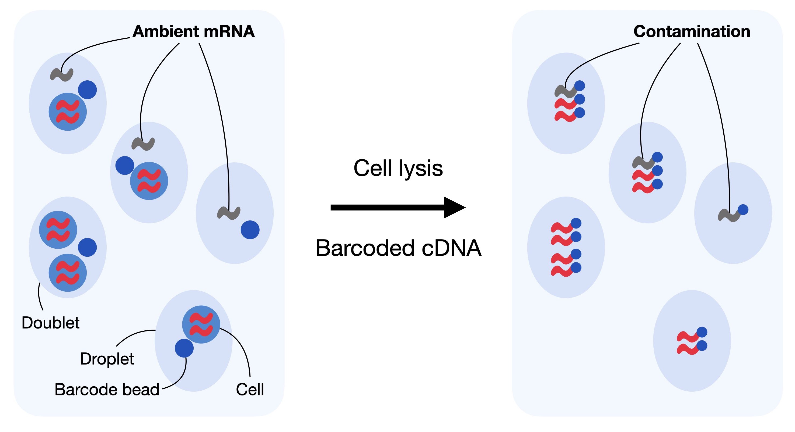
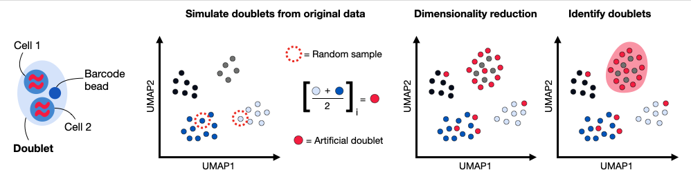

# DupLec 01 — alternatives to choose from {background-color="#2c3e50"}

## What this deck is

This is a **holding deck**, not part of the workshop. It collects the **alternative / duplicate figure renderings** that were pulled out of [Lecture 01 — Pre-processing](Lecture_01_Preprocessing.html) so the main deck stays tight (~15–20 min).

-   Each slide below is an **alternative version** of a figure that already appears in the live Lecture 01.
-   Under each one, *"Live deck uses:"* names the figure currently shown in Lecture 01 for that concept.
-   This file is **not linked from the Materials page**. To swap one in, move the slide back into `Lecture_01_Preprocessing.qmd`.

## The Seurat workflow in eight steps (alt 1)

*Live deck uses:* `images/lec01_seurat_8step_workflow.svg`

{fig-align="center" width="92%"}

## The Seurat workflow in eight steps (alt 2)

*Live deck uses:* `images/lec01_seurat_8step_workflow.svg`

{fig-align="center" width="92%"}

## Three core metrics (alt 1)

*Live deck uses:* `images/lec01_qc_metrics.svg`

{fig-align="center" width="92%"}

## Three core metrics (alt 2)

*Live deck uses:* `images/lec01_qc_metrics.svg`

{fig-align="center" width="92%"}

## Droplets can also be empty — or contaminated (alt)

*Live deck uses:* `images/lec01_ambient_rna.svg`

{fig-align="center" width="92%"}

## Doublets in one slide (alt)

*Live deck uses:* `images/lec01_doublet_detection.svg`

{fig-align="center" width="92%"}
