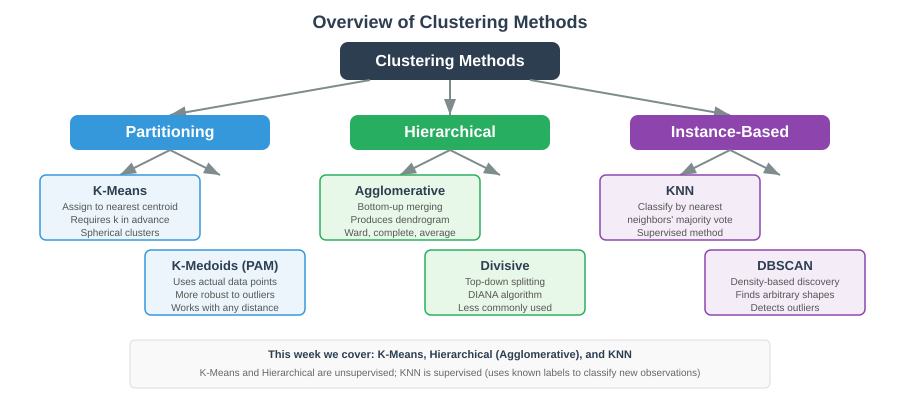
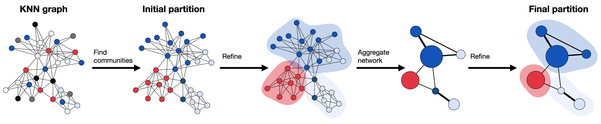
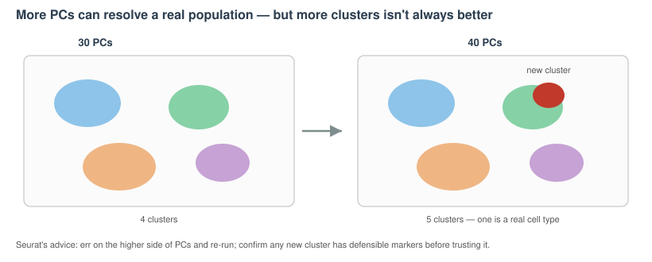
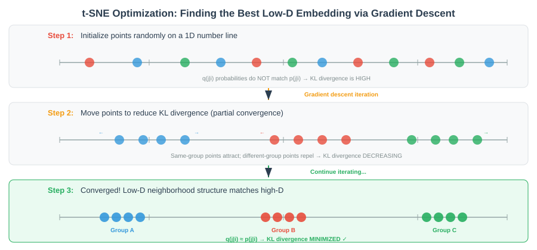

# DupLec 02 — alternatives to choose from {background-color="#2c3e50"}

## What this deck is

This is a **holding deck**, not part of the workshop. It collects the **alternative / duplicate figure renderings** that were pulled out of [Lecture 02 — Dim Reduction & Clustering](Lecture_02_DimReduction_Clustering.html) so the main deck stays tight (~15–20 min).

-   Each slide below is an **alternative version** of a figure that already appears in the live Lecture 02.
-   Under each one, *"Live deck uses:"* names the figure currently shown in Lecture 02 for that concept.
-   This file is **not linked from the Materials page**. To swap one in, move the slide back into `Lecture_02_DimReduction_Clustering.qmd`.

## Dimensionality reduction — the intuition (alt)

*Live deck uses:* `images/lec01_use_dimensionality_reduction.svg`

{fig-align="center" width="92%"}

## Graph-based clustering — step by step (alt 1)

*Live deck uses:* `images/lec01_use_leiden_clustering.svg`

{fig-align="center" width="92%"}

## Graph-based clustering — step by step (alt 2)

*Live deck uses:* `images/lec01_use_leiden_clustering.svg`

{fig-align="center" width="92%"}

## How many PCs? 30 vs 40 — alternative schematic

*Live deck uses:* the "Choosing a resolution" / scree-plot slides (no separate figure).

{fig-align="center" width="92%"}

::: callout-note
**Companion to "Choosing a resolution".** Original figure: **Filippov *et al.* 2024** (on Hope Healey's Lecture 2, slide ~35).
:::

## t-SNE: model neighbours as probabilities (alt)

*Live deck uses:* `images/week_10_S43_kl_divergence_distances.svg`

{fig-align="center" width="92%"}
