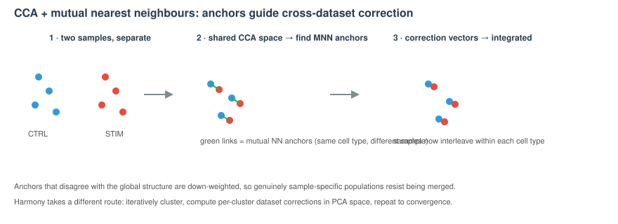

# DupLec 05 — alternatives to choose from {background-color="#2c3e50"}

## What this deck is

This is a **holding deck**, not part of the workshop. It collects the **alternative / duplicate figure renderings** that were pulled out of [Lecture 05 — Integration](Lecture_05_Integration.html) so the main deck stays tight (~15–20 min).

-   Each slide below is an **alternative version** of a figure that already appears in the live Lecture 05.
-   Under each one, *"Live deck uses:"* names the figure currently shown in Lecture 05 for that concept.
-   This file is **not linked from the Materials page**. To swap one in, move the slide back into `Lecture_05_Integration.qmd`.

## When to integrate (alt)

*Live deck uses:* `images/lec01_batch_integration.svg`

{fig-align="center" width="92%"}

## Integration strategies — visual guide (alt 1)

*Live deck uses:* `images/lec01_use_integration_overview.svg`

{fig-align="center" width="92%"}

## Integration strategies — visual guide (alt 2)

*Live deck uses:* `images/lec01_use_integration_overview.svg`

{fig-align="center" width="92%"}

## CCA + MNN anchors — alternative schematic

*Live deck uses:* `images/lec02_seurat_anchor_integration.svg`

{fig-align="center" width="96%"}

::: callout-note
**Alternative to the anchors slide.** Original figure: **Stuart, Butler *et al.* 2019**, *Cell* — [doi.org/10.1016/j.cell.2019.05.031](https://doi.org/10.1016/j.cell.2019.05.031) (on Hope Healey's Lecture 2, slide ~25).
:::
