```{r}
#| label: setup
#| include: false

library(tidyverse)
library(knitr)
library(gridExtra)
theme_set(theme_minimal(base_size = 14))
set.seed(2026)
```

# Lecture 00: Bulk vs. Single-Cell RNA-seq {background-color="#2c3e50"}

## Where this lecture fits

-   **You are here:** Lecture 00 — *the why and how of scRNA-seq data*
-   The numbered lectures from here on each pair with a tutorial of the same number:
    -   Lec 01 ↔ Tutorial 01 — QC & Preprocessing
    -   Lec 02 ↔ Tutorial 02 — Dim Reduction & Clustering
    -   Lec 03 ↔ Tutorial 03 — Markers & Manual Annotation
    -   Lec 04 ↔ Tutorial 04 — Reference-based Annotation
    -   Lec 05 ↔ Tutorial 05 — Multi-Sample Integration
    -   Lec 06 ↔ Tutorial 06 — DESeq2: Bulk Primer + Pseudobulk DE
    -   Lec 07 ↔ Tutorial 07 — Functional Analysis
    -   Lec 08 ↔ Tutorial 08 — Differential Abundance
    -   Lec 09 ↔ Tutorial 09 — scATAC-seq
    -   Lec 10 ↔ Tutorial 10 — WGCNA
    -   Lec 11 ↔ Tutorial 11 — Spatial Transcriptomics
    -   Lec 12 ↔ Tutorial 12 — Trajectory & Cell–Cell Communication
    -   Lec 13 ↔ Tutorial 13 — FAIR metadata & data sharing
-   **Companion tutorial:** [Tutorial 01 — QC & Preprocessing](../Exercise_Folder/Tutorial_01_QC_Preprocessing.html)

## Goals of this lecture

::: incremental
-   Understand what **bulk RNA-seq** measures vs. what **single-cell RNA-seq (scRNA-seq)** measures
-   See how a 10x Chromium-style experiment generates the data
-   Trace **reads → count matrix** end to end
-   Meet the data structure (cell × gene matrix) every downstream step assumes
:::

::: callout-note
**Theme for the workshop:** what is the same vs. what is new when we measure expression per cell instead of per tissue. Almost every step you already know from bulk RNA-seq has a single-cell analogue — but the analogues have new failure modes.
:::

# Part 1 — Why single-cell? {background-color="#2c3e50"}

## Bulk RNA-seq measures the *average*

-   mRNA from many cells is pooled, reverse-transcribed, sequenced
-   You get **one expression profile per sample** (typically \~20,000 genes × N samples)
-   Excellent for: comparing tissues / treatments / genotypes in **well-controlled designs with biological replicates**

::: callout-tip
Bulk is cheap, mature, and statistically well-understood. If your question is "does gene X change with treatment, averaged over the tissue?" — bulk is still the right tool.
:::

## What bulk cannot tell you

::: incremental
-   How many **[cell types](../Resources_Folder/Glossary.html#c)** are in the tissue, and in what proportions
-   Whether a gene is "up" because it changed within a cell type, or because the cell-type **composition** shifted
-   Rare populations, transitional states, developmental trajectories
-   Cell–cell communication in situ
:::

## Bulk vs. single-cell — the picture

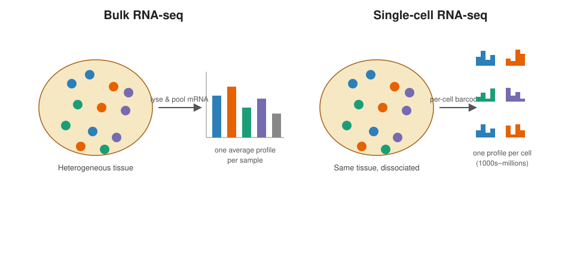{fig-align="center" width="92%"}

-   Bulk: one profile per sample
-   Single-cell: one profile per cell — heterogeneity becomes *visible*

## Bulk vs. single-cell — the picture (dup1)

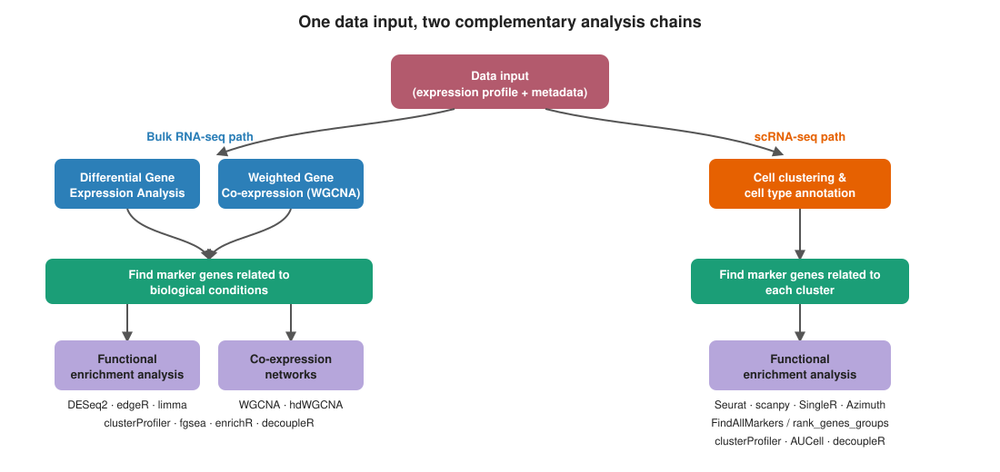{fig-align="center" width="92%"}

## Bulk vs. single-cell — the picture (dup2)

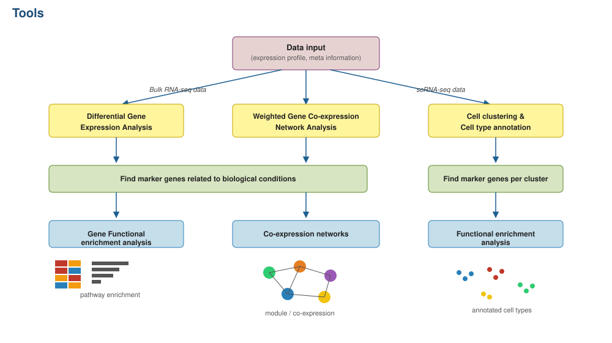{fig-align="center" width="92%"}

## Bulk vs. single-cell — the picture (dup3)

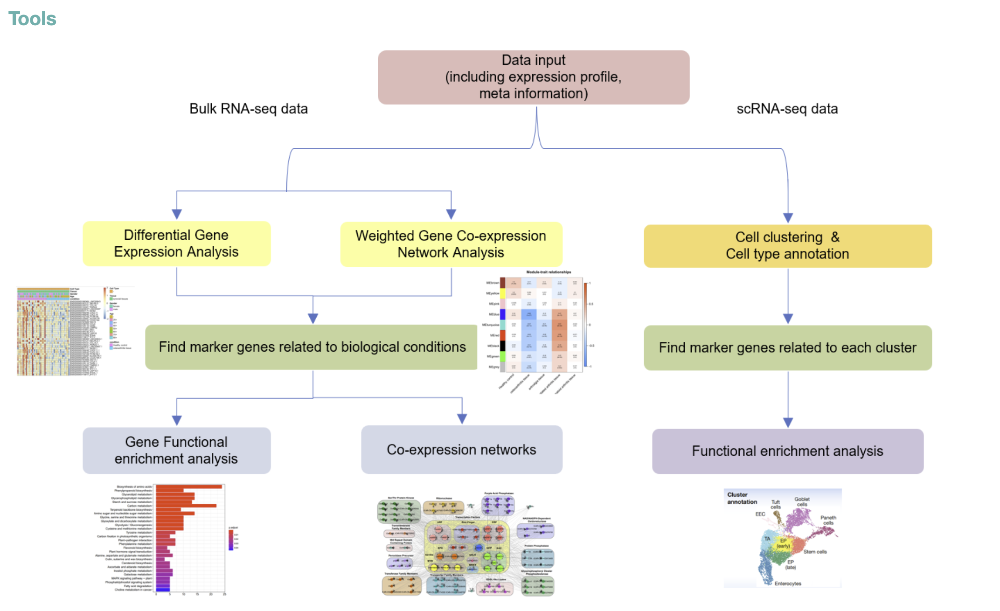{fig-align="center" width="92%"}

## What carries over from bulk

::: incremental
-   Same core measurement: **count of reads / UMIs per gene**
-   Same statistical concerns: normalization, **[batch effects](../Resources_Folder/Glossary.html#b)**, multiple testing, replication
-   Many downstream questions (DE, enrichment, co-expression) are the **same questions at a new resolution** — and reuse bulk tools (DESeq2, limma, WGCNA) after **pseudobulk aggregation** (Lecture 06)
:::

## What is genuinely new

::: incremental
-   **[Sparsity](../Resources_Folder/Glossary.html#s)**: \~90–95% zeros in typical droplet data — partly real biology, partly technical **[dropout](../Resources_Folder/Glossary.html#d)**
-   **Cells are not replicates**: cells from one subject are not statistically independent — using `n = cells` is the most common mistake in the field
-   **Cell type is a latent variable** you have to recover from the data
-   **Integration** across samples is a first-class problem, not an afterthought
:::

::: callout-warning
The single biggest analytical pitfall in scRNA-seq is treating cells as biological replicates. We come back to this in Lecture 06 (pseudobulk DE).
:::

## Sparsity, in numbers

```{r}
#| label: sparsity-illustration
#| echo: false
#| fig-width: 10
#| fig-height: 4

set.seed(2026)
# Three regimes: bulk (dense), Smart-seq (intermediate), 10x v3 (sparse)
make_panel <- function(p_zero, label) {
  m <- matrix(rbinom(40 * 60, 1, prob = 1 - p_zero), nrow = 40, ncol = 60)
  m[m == 1] <- rpois(sum(m == 1), 4)
  expand.grid(gene = seq_len(40), cell = seq_len(60)) |>
    mutate(count = as.vector(m),
           panel = paste0(label, "\n(", round(p_zero * 100), "% zeros)"))
}

dat <- bind_rows(
  make_panel(0.05, "Bulk RNA-seq"),
  make_panel(0.55, "Smart-seq2"),
  make_panel(0.92, "10x 3' v3 droplet")
)

dat$panel <- factor(dat$panel, levels = unique(dat$panel))

ggplot(dat, aes(cell, gene, fill = count)) +
  geom_tile() +
  scale_fill_gradient(low = "white", high = "#2c3e50", name = "count") +
  facet_wrap(~ panel, nrow = 1) +
  labs(x = "Cells (or samples)", y = "Genes",
       title = "What 'sparse' looks like — same panel size, three measurement regimes") +
  theme_minimal(base_size = 12) +
  theme(axis.text = element_blank(), axis.ticks = element_blank(),
        strip.text = element_text(face = "bold"),
        panel.grid = element_blank())
```

-   **Bulk:** every gene is detected in every sample (\~5% zeros; mostly truly off genes)
-   **Smart-seq2** (full-length plate-based): \~50–60% zeros — moderate dropout but rich per-cell signal
-   **10x 3' v3** droplet: \~90–95% zeros — most (cell, gene) pairs are zero because shallow capture + 3'-only chemistry samples a fraction of the transcriptome
-   The implication for analysis: every step has to handle counts that are *mostly* zero. That's why we have specialized normalisation (`SCTransform`), HVG selection, and graph-based clustering instead of the bulk RNA-seq toolkit.

# Part 2 — How the data are generated {background-color="#2c3e50"}

## Major scRNA-seq technologies

| Category | Examples | Strengths | Trade-offs |
|----|----|----|----|
| **Plate-based, full-length** | Smart-seq2/3 | Full transcript coverage, isoforms, high sensitivity | Low throughput, more expensive per cell |
| **Droplet-based, 3'/5'** | 10x Genomics Chromium, Drop-seq, inDrops | High throughput (1k–100k+ cells) | 3' or 5' only, shallower per cell |
| **Combinatorial barcoding** | Parse Evercode, SPLiT-seq | No specialized instrument, fixable samples | Protocol complexity |
| **Nuclei (snRNA-seq)** | 10x Nuclei | Works on frozen / difficult tissues | Fewer transcripts, no cytoplasmic RNA |

::: callout-note
**10x Chromium 3'** is the workshop default — the assay used by both the workshop dataset (20k NSCLC DTC) and Patel's [YouTube tutorials](https://github.com/kpatel427/YouTubeTutorials). Most conceptual ideas generalize.
:::

## Two ways into the Chromium: polyA vs. probe

Even within 10x, there are **two capture chemistries**, and the choice constrains what you can study:

| | **3′ / 5′ gene expression** | **Flex (probe capture)** |
|----|----|----|
| How RNA is captured | polyA tail → reverse transcription | hybridization probes against a fixed gene panel (microarray-like) |
| Sample state | fresh / cryopreserved (live) cells or nuclei | **fixed** cells/nuclei, incl. FFPE |
| Species | **any** species with a transcriptome | **human & mouse only** (probe panels) |
| Best for | non-model systems, novel/unannotated genes | banked clinical/fixed material, high multiplexing |

::: callout-warning
**Probe panels can't see what they don't target.** Flex only quantifies the genes on the panel, and panels exist only for human and mouse — so for **non-model organisms the polyA chemistry is effectively the only option** (and it carries the 3′-annotation caveat on the next slide).
:::

## A polyA-capture catch: 3′ UTR annotation

-   3′ polyA capture means reads pile up at the **3′ end / 3′ UTR** of each transcript, not evenly across the gene body.
-   Counting therefore depends on **accurate 3′ UTR annotation**. If a gene's 3′ UTR is missing or truncated in the reference, its reads land in "intergenic" space and the gene is **under-counted or invisible**.
-   This is a **major problem in non-model systems** (3′ UTRs are often poorly annotated) and can still bite for specific genes of interest in model organisms.
-   **Fixes:** improve/extend 3′ UTR annotations — e.g. with long-read **Iso-Seq** data — before quantifying, and sanity-check that your key markers' 3′ ends are actually annotated.

::: callout-note
Probe/Flex chemistry sidesteps this (it targets defined gene models), but only exists for human and mouse — so for non-model organisms the annotation step is part of the experiment.
:::

## Cells vs. nuclei, and multi-omic readouts

-   **Cells** capture mature cytoplasmic mRNA — needed for cell-surface protein readouts; richer transcript counts.
-   **Nuclei (snRNA-seq)** work on frozen / hard-to-dissociate tissue and large/fragile cell types, and are **required for snATAC** — but yield fewer transcripts and little cytoplasmic RNA.
-   On the Chromium, the same partitioning chemistry can add **other modalities to the same cells**:
    -   **ATAC** (open chromatin) — alone or jointly with RNA (**Multiome**, one nucleus → RNA + ATAC)
    -   **Cell-surface protein** (CITE-seq / antibody-derived tags)
    -   **Immune repertoire** (5′ V(D)J — paired TCR/BCR)
    -   **CRISPR perturbations** (guide capture / Perturb-seq)
-   **Sample multiplexing** (CellPlex / hashing, or natural-genotype demultiplexing) pools several samples in one run to cut per-sample cost and share a doublet/batch structure.

## Beyond 10x: combinatorial-barcoding platforms

Droplet microfluidics is not the only way to barcode single cells. **Combinatorial split-pool barcoding** (Rosenberg *et al.* 2018, SPLiT-seq; commercialized as **Parse Biosciences Evercode**) labels cells by **repeated rounds of split → barcode → pool** instead of one-cell-one-droplet:

-   **No specialized instrument** — runs on plates with standard lab equipment.
-   Works on **fixed cells *and* nuclei**, which simplifies sample logistics (fix now, sequence later).
-   **Scales by adding barcode rounds/plates** — kits span ~10k cells / a handful of samples up to millions of cells / hundreds of samples.
-   Trade-offs: **more hands-on bench labor**, needs **more input cells**, and (currently) **no ATAC kit** (immune and CRISPR kits exist).

::: callout-note
Other instrument-light approaches exist too — e.g. **Fluent BioSciences PIP-seq** (particle-templated emulsification, Clark *et al.* 2023) makes droplets without a microfluidic controller.
:::

## 10x Chromium vs. Parse Evercode — at a glance

| | **10x Chromium** | **Parse Evercode** |
|----|----|----|
| Principle | droplet microfluidics (GEMs) | combinatorial split-pool barcoding |
| Instrument | dedicated controller | none (plates) |
| Input | fresh/cryo cells or nuclei; live preferred (polyA) | fixed cells **or** nuclei |
| Scaling | per-channel; multiplex to lower cost | add barcode rounds → up to millions of cells / hundreds of samples |
| Multi-omics | RNA, ATAC, protein, V(D)J, CRISPR | RNA, immune, CRISPR (no ATAC) |
| Cost / labor | higher reagent cost, less bench labor | cheaper reagents, more bench labor |

::: callout-tip
**There is no single "best" platform** — match it to the question: instrument-free + fixable + many samples → Parse; multi-omics (esp. ATAC/protein) or a turnkey instrument → 10x; non-model species → polyA chemistry either way.
:::

## Platform choice changes results, not just cost

-   **Cost is real and shapes design.** A single library prep at a core can run ~$120 for bulk RNA-seq vs. ~$2,000+ for a 10x lane (example UO pricing) — which is why scRNA-seq experiments often have **few biological replicates**.
    -   ~2 biological replicates can suffice for a **descriptive atlas**; **differential-expression** questions need **more replicates** (see Lec 06); chasing **rare transcripts** needs **more sequencing depth**.
-   **The platform is not neutral.** Benchmarks comparing platforms on matched samples (e.g. Filippov *et al.* 2024) report **different QC distributions** and, in some cases, **cell populations recovered by one platform but missed by another** — so the technology choice can change the *biological* conclusions, not just the budget.

::: callout-warning
Report your platform **and** chemistry (3′ vs 5′ vs Flex, cells vs nuclei, multiplexing scheme) in methods. Downstream defaults (ambient correction, doublet rate, mito thresholds, even whether a cluster appears) all depend on them.
:::

## How we got here — a short timeline

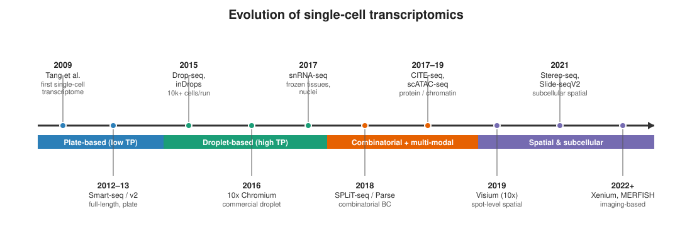{fig-align="center" width="98%"}

-   Throughput went from **one cell** (Tang *et al.* 2009, plate + manual picking) to **millions of cells** in a decade
-   Key milestones: microfluidic capture (Streets *et al.* 2014) → **Drop-seq** droplet barcoding (Macosko *et al.* 2015) → **10x Chromium** launches (2015) → **SPLiT-seq** combinatorial barcoding (Rosenberg *et al.* 2018; Parse founded 2018) → instrument-free **PIP-seq** (Clark *et al.* 2023; Fluent)
-   The field now extends *beyond* dissociated scRNA-seq into **multi-modal** (Lec 09 — scATAC-seq) and **spatial** (Lec 11) measurements

## Droplet generation on the Chromium

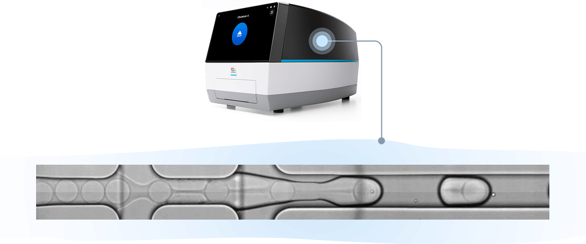{fig-align="center" width="85%"}

-   Microfluidic chip co-flows **cells**, **barcoded gel beads**, and **oil**
-   Each droplet encapsulates (ideally) one cell + one bead → one "GEM"
-   Inside the GEM, the bead releases barcoded primers; lysis + RT happens before demulsification

## Chromium library prep — the full cycle

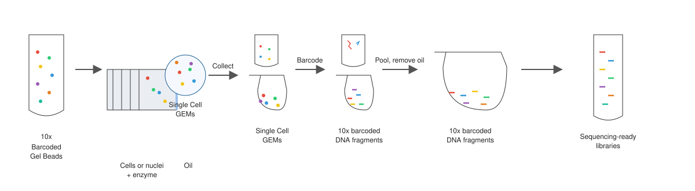{fig-align="center" width="96%"}

-   Gel beads + cells/enzyme + oil → **GEMs**
-   Each GEM: cell lysed, barcoded cDNA synthesized inside the droplet
-   Oil is removed, barcoded DNA is pooled and converted into **sequencing-ready libraries**

## Chromium library prep — the full cycle (dup1)

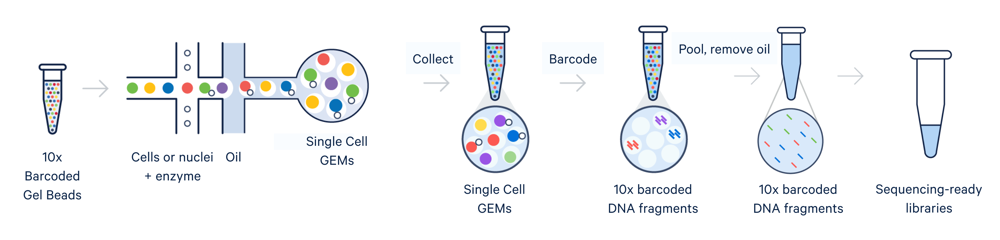{fig-align="center" width="92%"}

## Droplet protocol: barcodes + UMIs

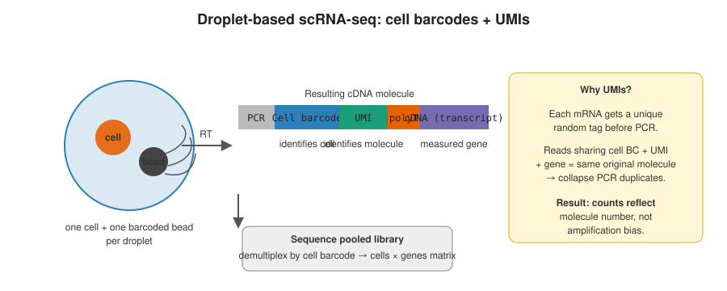{fig-align="center" width="90%"}

-   **[Cell barcode](../Resources_Folder/Glossary.html#b)** identifies which cell a read came from
-   **[UMI](../Resources_Folder/Glossary.html#u)** identifies the original mRNA molecule (collapses PCR duplicates)
-   Reads are pooled and **[demultiplexed](../Resources_Folder/Glossary.html#d)** computationally

## UMIs in detail — amplification, sequencing, dedup

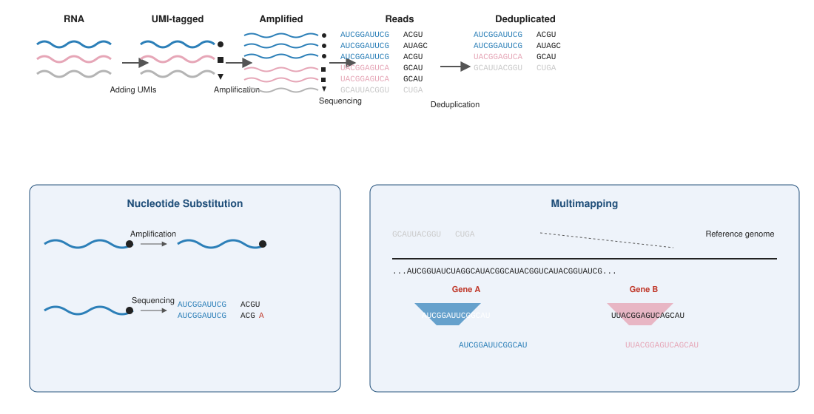{fig-align="center" width="96%"}

-   Each mRNA is tagged with a unique UMI **before** PCR
-   After sequencing, reads sharing a cell barcode **and** UMI collapse to one molecule
-   UMIs help detect **nucleotide substitutions** during PCR/sequencing and resolve **multi-mapping** reads

::: callout-tip
**Rule of thumb on capture:** typical 10x 3' v3 captures \~5–20% of mRNA molecules per cell. That's *why* the count matrix is sparse even when biology isn't.
:::

## UMIs in detail — amplification, sequencing, dedup (dup1)

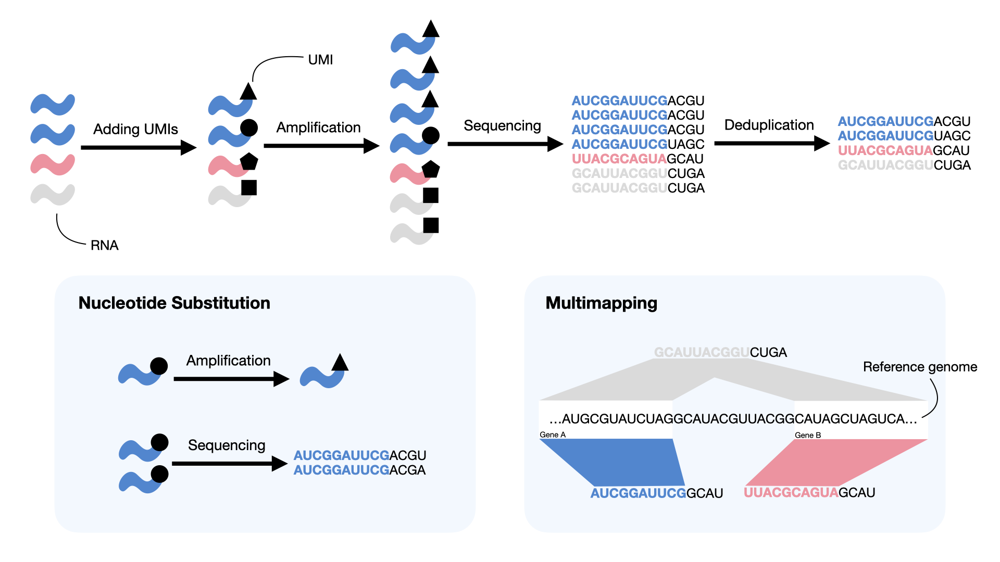{fig-align="center" width="92%"}

## From reads to a count matrix

::: incremental
-   Input: raw **[FASTQ](../Resources_Folder/Glossary.html#f)** files (R1 = cell BC + UMI, R2 = transcript)
-   Output: **cells × genes** count matrix (integer UMI counts)
-   Common tools:
    -   **Cell Ranger** (10x, official)
    -   **STARsolo** (STAR-based, fast, flexible)
    -   **alevin-fry / salmon** (selective alignment, very fast)
    -   **kb-python (kallisto \| bustools)** (pseudoalignment)
:::

## Raw data processing — BCL → count matrix

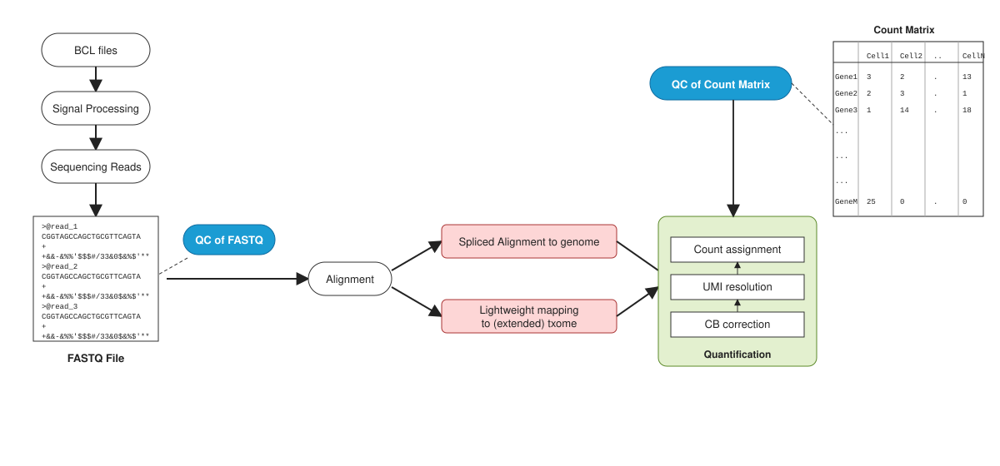{fig-align="center" width="96%"}

-   **Signal processing** turns sequencer BCL files into FASTQ reads (with a first QC step)
-   **Alignment** feeds **quantification**: CB correction → UMI resolution → count assignment
-   Final product: a **cell × gene count matrix**, QC'd before downstream work begins

## Raw data processing — BCL → count matrix (dup1)

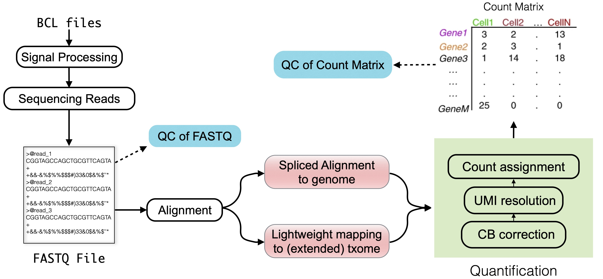{fig-align="center" width="92%"}

## Pipelines side-by-side

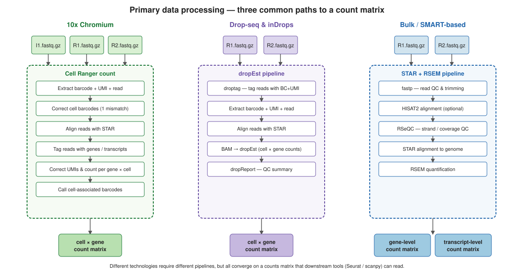{fig-align="center" width="96%"}

-   Three common entry points: **10x Chromium**, **Drop-seq / inDrops**, **bulk or SMART-based**
-   Different stacks of tools, **same destination**: a counts matrix Seurat / scanpy can read

## Pipelines side-by-side (dup1)

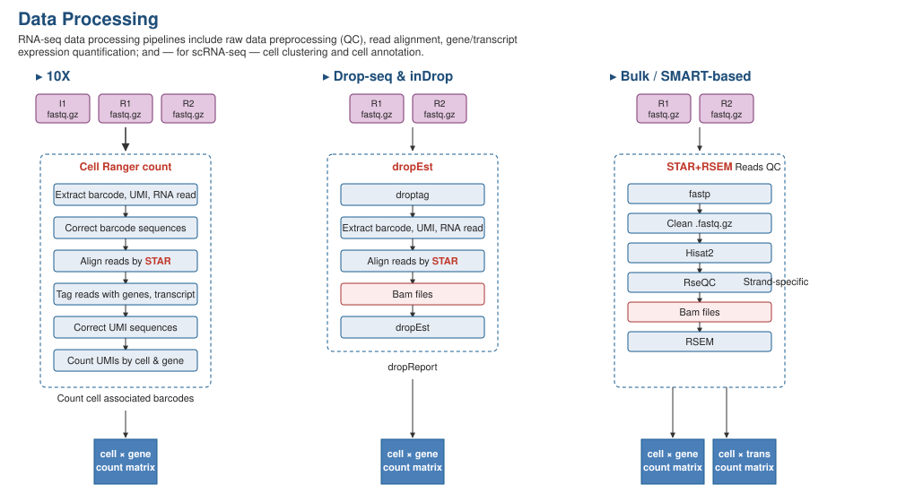{fig-align="center" width="92%"}

## The data structure you analyze

-   **[Sparse matrix](../Resources_Folder/Glossary.html#s)**: rows = genes, columns = cells (or transposed in Python)
-   Paired with per-cell metadata (sample, batch, QC metrics) and per-gene metadata

::: panel-tabset
### R / Seurat

``` r
library(Seurat)
counts <- Read10X(data.dir = "filtered_feature_bc_matrix/")
seu    <- CreateSeuratObject(counts = counts, project = "workshop",
                             min.cells = 3, min.features = 200)
seu
```

### Python / scanpy

``` python
import scanpy as sc
adata = sc.read_10x_mtx("filtered_feature_bc_matrix/", var_names="gene_symbols")
sc.pp.filter_cells(adata, min_genes=200)
sc.pp.filter_genes(adata, min_cells=3)
adata
```
:::

::: callout-note
**`min.cells = 3` and `min.features = 200`** are *defaults*, not gospel. They drop genes seen in fewer than 3 cells and droplets with fewer than 200 detected genes — sensible for whole-tissue 10x data, sometimes too aggressive for very rare cell types or shallow protocols.
:::

## The downstream workflow at a glance

{fig-align="center" width="92%"}

-   That cell × gene matrix is the **input** to every analytical step the rest of the workshop covers
-   The eight steps fall naturally into four chunks, each with a dedicated lecture:
    -   **Pre-processing** (Lec 01 / Tut 01): QC → doublets → normalisation → HVGs
    -   **Geometry** (Lec 02 + 05 / Tut 02 + 05): scale → PCA → neighbour graph → Leiden → t-SNE/UMAP → integration
    -   **Annotation** (Lec 03, Lec 04 / Tut 03, Tut 04): markers, manual annotation, reference-based annotation (SingleR / Azimuth)
    -   **Differential expression** (Lec 06 + 07 / Tuts 06 + 07): DESeq2 fundamentals + pseudobulk
-   Lectures 06 (scATAC-seq) and 07 (WGCNA) extend the same conceptual toolkit to other data modalities

::: callout-tip
**A 4-step mental compression.** From here on out, every chunk of the pipeline (a) cleans something, (b) puts things on a sensible scale, (c) finds structure, (d) names that structure with biology. If any step skips one of those, look harder.
:::

# Recap & what's next {background-color="#2c3e50"}

## What to remember from Lecture 00

::: incremental
-   scRNA-seq is the **same measurement at higher resolution** — count-based, but per cell
-   The chemistry (UMIs + cell barcodes + GEMs) is *what makes it possible* to recover per-cell counts after pooled sequencing
-   The output is always the same shape: a **cell × gene** sparse matrix with metadata
-   Sparsity + cell-level non-independence change the statistics — that's the next seven lectures
:::

## Coming up next

-   **Lec 01** — [Pre-processing](Lecture_01_Preprocessing.html): QC, ambient RNA, doublets, normalization, HVGs
-   **Hands-on:** [Tutorial 01 — QC & Preprocessing](../Exercise_Folder/Tutorial_01_QC_Preprocessing.html)

## Further reading

-   [sc-best-practices](https://www.sc-best-practices.org/) — Heumos *et al.* (the workshop's primary external reference)
-   [10x Genomics Chromium overview](https://www.10xgenomics.com/instruments/chromium-x-series)
-   [Patel's YouTube Tutorials repo](https://github.com/kpatel427/YouTubeTutorials) — companion video walkthroughs of many of these workflows
-   [Workshop Glossary](../Resources_Folder/Glossary.html)
