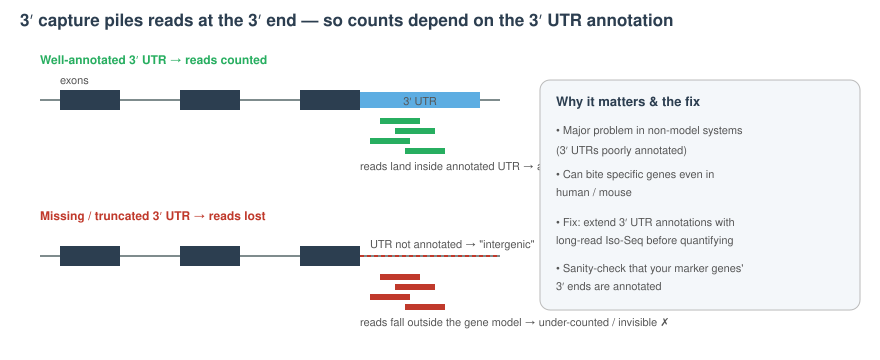
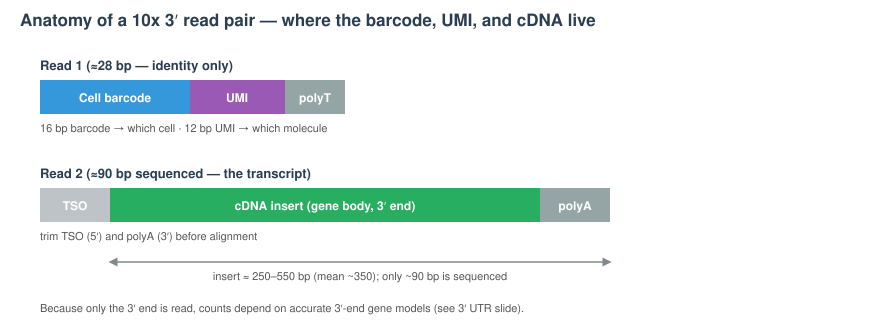

```{r}
#| label: setup
#| include: false

library(tidyverse)
library(knitr)
library(gridExtra)
theme_set(theme_minimal(base_size = 14))
set.seed(2026)
```

## Where this lecture fits

- **You are here:** Lecture 00 — *the why and how of scRNA-seq data, plus getting set up*
- **Core analysis modules (Wed/Thu)** — each lecture pairs with a tutorial
  - Lec 01 ↔ Tutorial 01 — QC & Preprocessing
  - Lec 02 ↔ Tutorial 02 — Dimensionality Reduction & Clustering
  - Lec 03 ↔ Tutorial 03 — Markers & Manual Annotation
  - Lec 04 ↔ Tutorial 04 — Reference-based Annotation
  - Lec 05 ↔ Tutorial 05 — Multi-Sample Integration
  - Lec 06 ↔ Tutorial 06 — DESeq2: Bulk Primer + Pseudobulk DE
  - Lec 07 ↔ Tutorial 07 — Functional Analysis
  - Lec 08 ↔ Tutorial 08 — Differential Abundance
- **Talapas HPC track (Fri morning):** Module 09 — SLURM Basics · Module 10 — the analysis pipeline on Talapas
- **Bonus modules (self-paced):** On your own after the workshop
- **Companion tutorial:** [Tutorial 00 — Setup: R, RStudio, Quarto & VS Code](../Exercise_Folder/Tutorial_00_Setup_RStudio_Packages.html)


# Part 1 — Your tools {background-color="#2c3e50"}

## Two ways you'll run the code

- **On your laptop — RStudio.** The core tutorials (Modules 01–08) are Quarto `.qmd` notebooks you open in **RStudio** and run chunk-by-chunk on the small `ifnb` dataset.
- **On the cluster — Friday (Module 09).** The same material also runs on UO's **Talapas** HPC cluster. VS Code Remote-SSH, interactive sessions, and SLURM batch jobs are covered in [**Tutorial 09 — VS Code & SLURM Basics on Talapas**](../Exercise_Folder/Tutorial_09_SLURM_Basics.html).


## What is VS Code?

::: incremental
- A **free code editor** from Microsoft: it opens, browses, and edits the files in a project.
- It is **language-aware**: it understands R, Python, Quarto, Bash, and more, and helps you as you type.
- It has a built-in **terminal**, so you can run scripts without leaving the window.
- It can edit files on a **remote server** (like an HPC cluster) as if they were sitting on your laptop.
:::

## Why learn a text editor at all?

::: incremental
- **`nano` or `emacs` are fine** for quick edits, but they don't scale to a real project.

- A good editor shows you the **whole directory** at once, color-codes your code, and catches mistakes early.

- You will spend *hours* in your editor. A small upfront investment pays back every day.
:::

# Install & open a folder {background-color="#2c3e50"}

## Step 1: Download and install

- Download VS Code from the official site: <https://code.visualstudio.com/download>
- Pick the installer for your operating system (macOS / Windows / Linux) and run it.
- Open VS Code. If a **permissions pop-up** appears, **allow** the requested access.

## Step 2: Open a folder

- From the welcome screen, choose **Open Folder** and pick your project folder.
- When asked *"Do you trust the authors of the files in this folder?"* — click **Yes** for your own folders.

::: callout-tip
Open the **whole project folder**, not a single file. VS Code is at its best when it can see your entire project at once.
:::

## The Explorer

::: incremental
- The **Explorer** is the panel on the left: it's your familiar directory tree.
- Click folders to expand them and **browse around** your project.
- Click a file to open it in the editor on the right.
- Need more screen space? **Hide/unhide** the Explorer with the top icon in the sidebar.
:::

# Why it helps you write code {background-color="#2c3e50"}

## VS Code is language-aware

::: incremental
- **Syntax highlighting** colors your code: keywords, strings, and comments each get their own color.
- This makes structure **visible at a glance** and helps you spot typos (an unclosed quote turns the rest of the line a strange color).
- It works automatically once VS Code recognizes the file type (`.R`, `.qmd`, `.py`, `.sh`, …).
:::

## The Command Palette

The Command Palette is how you find *anything* VS Code can do.

- Open it with **`Cmd-Shift-P`** (Mac) or **`Ctrl-Shift-P`** (Windows / Linux).
- Use it to change settings, manage extensions, and discover features you didn't know existed.
- **`Cmd-Shift-P`** Developer: Reload Window

::: callout-tip
When you can't remember where a setting lives, open the Command Palette and just start typing what you want.
:::

## Keyboard shortcuts to memorize

| Action               | macOS         | Windows / Linux |
|----------------------|---------------|-----------------|
| Open Command Palette | `Cmd-Shift-P` | `Ctrl-Shift-P`  |
| Toggle comments      | `Cmd-/`       | `Ctrl-/`        |
| Indent code block    | `Cmd-]`       | `Ctrl-]`        |
| Un-indent code block | `Cmd-[`       | `Ctrl-[`        |

::: callout-note
**The two besties:** *toggling comments* and *block indent/unindent*. You'll reach for these constantly when cleaning up code.
:::

## A few more handy shortcuts

| Action                 | macOS         | Windows / Linux |
|------------------------|---------------|-----------------|
| Save file              | `Cmd-S`       | `Ctrl-S`        |
| Find (this file)       | `Cmd-F`       | `Ctrl-F`        |
| Search (whole project) | `Cmd-Shift-F` | `Ctrl-Shift-F`  |

::: callout-tip
If the shortcut requires a (`` ` ``), it is usually above the Tab key — *not* an apostrophe.
:::

## The integrated terminal

::: incremental
- No separate Terminal window needed!

- Run R scripts, render Quarto documents, or use the command line right where you're editing.

- Open a **new** terminal from **Terminal ▸ New Terminal**.

- Add more terminal tabs with the **`+`** on the right of the current terminal.

- This will be very valuable when we are running R and bash scripts on Talapas
:::

|                |                   |                   |
|----------------|-------------------|-------------------|
| Open Terminal  | `` Ctrl-CAPS-` `` | `` Ctrl-CAPS-` `` |
| Split Terminal | `Ctrl-\`          | `Ctrl-\`          |

# Extensions you'll want {background-color="#2c3e50"}

## What are extensions?

::: incremental
- **Extensions** add features to VS Code such as language support, viewers, remote tools.
- Install them from the **Extensions** tab in the left sidebar (the four-squares icon), then **search** by name.
- For this workshop, install the handful below. You don't need anything beyond these to start.
:::

::: callout-note
You can always add or remove extensions later. Start with this short list and grow it as you go.
:::

## Extensions for this workshop

Open the **Extensions** tab, search for each, and click **Install**:

::: incremental
- **Quarto** — render and run `.qmd` notebooks (our tutorials) directly in VS Code.
- **R** — R language support: syntax help, running code, and an R terminal.
- **Remote – SSH** — edit files on a remote server over SSH.
- **Remote Explorer** (a.k.a. **SSH Explorer**) — browse and manage your SSH connections from the sidebar.
- **Remote – SSH: Editing Configuration Files** *(optional, recommended)* — easier editing of your SSH config.
- **PDF viewer** and **CSV/Excel viewer** *(optional)* — preview rendered PDFs and data tables without leaving VS Code.
:::

::: callout-tip
Search **"ssh"** in the Extensions tab to find the Remote – SSH family quickly, and **"quarto"** / **"r"** for the language tools.
:::

# Wrap-up {background-color="#2c3e50"}

## What to remember

::: incremental
- **Open Folder** on your whole project to view all of the contents.
- The **Explorer** browses files. Hide the Explorer by clicking on it.
- **Syntax highlighting** makes code easier to write and correct.
- Memorize the **two besties**: toggle comments (`Cmd/Ctrl-/`) and indent/un-indent (`Cmd/Ctrl-[ ]`).
- The **integrated terminal** (`` Ctrl-CAPS-` ``) runs your code without leaving the editor.
- Install the workshop **extensions**: Quarto, R, Remote – SSH, Remote Explorer (and optional viewers).
:::

## You're set

- Spend a few minutes opening a folder, browsing files, and trying the shortcuts.
- Make sure you have your extensions installed.

::: callout-note
We will revisit VS Code when we connect it to a remote cluster.
:::

## VS Code + Talapas — Friday track (Module 09)

Connecting VS Code to Talapas over **Remote-SSH**, exploring the cluster interactively, and submitting SLURM batch jobs are all covered on **Friday morning** — not today.

➡️ See [**Lecture 09 — VS Code & SLURM Basics on Talapas**](Lecture_09_SLURM_Basics.html) and hands-on in [**Tutorial 09**](../Exercise_Folder/Tutorial_09_SLURM_Basics.html) for the full walkthrough. Full reference: [Chapter 9 — VS Code & SLURM Basics on Talapas](../Resources_Folder/Chapter_09_SLURM_Basics.html).

## Why notebooks + a cluster?

- The tutorials are **literate**: prose, code, and output in one document — reproducible and easy to read back.
- The laptop handles `ifnb` (\~24k cells) fine; **real** datasets (hundreds of thousands of cells, or raw FASTQs through Cell Ranger) need the cluster's CPUs, RAM, and storage.
- Same code, two scales: learn it on the laptop, then scale it on Talapas — that's the whole point of the Friday track.


# Part 2 — Why single-cell? {background-color="#2c3e50"}

## Bulk RNA-seq measures the *average*

- mRNA from many cells is pooled, reverse-transcribed, sequenced
- You get **one expression profile per sample** (typically \~20,000 genes × N samples)
- Excellent for: comparing tissues / treatments / genotypes in **well-controlled designs with biological replicates**

::: callout-tip
Bulk is cheap, mature, and statistically well-understood. If your question is "does gene X change with treatment, averaged over the tissue?" — bulk is still the right tool.
:::

## What bulk cannot tell you

::: incremental
- How many [**cell types**](../Resources_Folder/Glossary.html#c) are in the tissue, and in what proportions
- Whether a gene is "up" because it changed within a cell type, or because the cell-type **composition** shifted
- Rare populations, transitional states, developmental trajectories
- Cell–cell communication in situ
:::

## 
### What is the same about scRNA-seq

::: incremental
- Same core measurement: **count of reads / UMIs per gene**
- Same statistical concerns: normalization, [**batch effects**](../Resources_Folder/Glossary.html#b), multiple testing, replication
- Many downstream questions (DE, enrichment, co-expression) are the **same questions at a new resolution** — and reuse bulk tools (DESeq2, limma, WGCNA) after **pseudobulk aggregation** (Lecture 06)
:::

### What is genuinely new about scRNA-seq

::: incremental
- [**Sparsity**](../Resources_Folder/Glossary.html#s): \~90–95% zeros in typical droplet data — partly real biology, partly technical [**dropout**](../Resources_Folder/Glossary.html#d)
- **Cells are not replicates**: cells from one subject are not statistically independent — using `n = cells` is the most common mistake in the field
- **Cell type is a latent variable** you have to recover from the data
- **Integration** across samples is a first-class problem, not an afterthought
:::


## Sparsity, in numbers

```{r}
#| label: sparsity-illustration
#| echo: false
#| fig-width: 16
#| fig-height: 4

set.seed(2026)
# Three regimes: bulk (dense), Smart-seq (intermediate), 10x v3 (sparse)
make_panel <- function(p_zero, label) {
  m <- matrix(rbinom(40 * 60, 1, prob = 1 - p_zero), nrow = 40, ncol = 60)
  m[m == 1] <- rpois(sum(m == 1), 4)
  expand.grid(gene = seq_len(40), cell = seq_len(60)) |>
    mutate(count = as.vector(m),
           panel = paste0(label, "\n(", round(p_zero * 100), "% zeros)"))
}

dat <- bind_rows(
  make_panel(0.05, "Bulk RNA-seq"),
  make_panel(0.55, "Smart-seq2"),
  make_panel(0.92, "10x 3' v3 droplet")
)

dat$panel <- factor(dat$panel, levels = unique(dat$panel))

ggplot(dat, aes(cell, gene, fill = count)) +
  geom_tile() +
  scale_fill_gradient(low = "white", high = "#2c3e50", name = "count") +
  facet_wrap(~ panel, nrow = 1) +
  labs(x = "Cells (or samples)", y = "Genes",
       title = "What 'sparse' looks like — same panel size, three measurement regimes") +
  theme_minimal(base_size = 12) +
  theme(axis.text = element_blank(), axis.ticks = element_blank(),
        strip.text = element_text(face = "bold"),
        panel.grid = element_blank())
```

- **Bulk:** nearly every gene is detected in every sample (\~5% zeros)
- **Smart-seq2**: \~50–60% zeros — moderate dropout but rich per-cell signal
- **10x 3' v3** droplet: \~90–95% zeros — most (cell, gene) pairs are zero
- The implication for analysis: every step has to handle counts that are *mostly* zero.

- That's why we have specialized normalisation (`SCTransform`), HVG selection, and graph-based clustering instead of the bulk RNA-seq toolkit.


# Part 3 — How the data are generated {background-color="#2c3e50"}

## Major scRNA-seq technologies

| Category | Examples | Strengths | Trade-offs |
|------------------|------------------|------------------|------------------|
| **Plate-based, full-length** | Smart-seq2/3 | Full transcript coverage, isoforms, high sensitivity | Low throughput, more expensive per cell |
| **Droplet-based, 3'/5'** | 10x Genomics Chromium, Drop-seq, inDrops | High throughput (1k–100k+ cells) | 3' or 5' only, shallower per cell |
| **Combinatorial barcoding** | Parse Evercode, SPLiT-seq | No specialized instrument, fixable samples | Protocol complexity |
| **Nuclei (snRNA-seq)** | 10x Nuclei | Works on frozen / difficult tissues | Fewer transcripts, no cytoplasmic RNA |

::: callout-note
**10x Chromium 3'** is the workshop default — the assay used by the workshop's `ifnb` dataset and Patel's [YouTube tutorials](https://github.com/kpatel427/YouTubeTutorials). Most conceptual ideas generalize.
:::


## How we got here — a short timeline

{fig-align="center" width="98%"}

- Throughput went from **one cell** (Tang *et al.* 2009, plate + manual picking) to **millions of cells** in a decade

## How we got here — a short timeline

- Key milestones: 
  - microfluidic capture (Streets *et al.* 2014)
  - **Drop-seq** droplet barcoding (Macosko *et al.* 2015)
  - **10x Chromium** launches (2015)
  - **SPLiT-seq** combinatorial barcoding (Rosenberg *et al.* 2018; Parse founded 2018)
  - instrument-free **PIP-seq** (Clark *et al.* 2023; Fluent)
- The field now extends *beyond* dissociated scRNA-seq into **multi-modal** (Lec 15 — scATAC-seq) and **spatial** (Lec 16) measurements

## Cells vs. nuclei, and multi-omic readouts

- **Cells** capture mature cytoplasmic mRNA — needed for cell-surface protein readouts; richer transcript counts.
- **Nuclei (snRNA-seq)** work on frozen / hard-to-dissociate tissue and large/fragile cell types, and are **required for snATAC** — but yield fewer transcripts and little cytoplasmic RNA.
- On the Chromium, the same partitioning chemistry can add **other modalities to the same cells**:
  - **ATAC** alone or jointly with RNA (**Multiome**, one nucleus → RNA + ATAC)
  - **Cell-surface protein** (CITE-seq / antibody-derived tags)
  - **Immune repertoire** (5′ V(D)J — paired TCR/BCR)
  - **CRISPR perturbations** (guide capture / Perturb-seq)
- **Sample multiplexing** (CellPlex / hashing, or natural-genotype demultiplexing) pools several samples in one run to cut per-sample cost and share a doublet/batch structure.

## Two ways into the Chromium: polyA vs. probe

Even within 10x, there are **two capture chemistries**, and the choice constrains what you can study:

|   | **3′ / 5′ gene expression** | **Flex (probe capture)** |
|------------------------|------------------------|------------------------|
| How RNA is captured | polyA tail → reverse transcription | hybridization probes against a fixed gene panel (microarray-like) |
| Sample state | fresh / cryopreserved (live) cells or nuclei | **fixed** cells/nuclei, incl. FFPE |
| Species | **any** species with a transcriptome | **human & mouse only** (probe panels) |
| Best for | non-model systems, novel/unannotated genes | banked clinical/fixed material, high multiplexing |

::: callout-warning
**Probe panels can't see what they don't target.** Flex only quantifies the genes on the panel, and panels exist only for human and mouse — so for **non-model organisms the polyA chemistry is effectively the only option** (and it carries the 3′-annotation caveat on the next slide).
:::

## A polyA-capture catch: 3′ UTR annotation

- 3′ polyA capture means reads pile up at the **3′ end / 3′ UTR** of each transcript, not evenly across the gene body.
- Counting therefore depends on **accurate 3′ UTR annotation**. If a gene's 3′ UTR is missing or truncated in the reference, its reads land in "intergenic" space and the gene is **under-counted or invisible**.
- This is a **major problem in non-model systems** (3′ UTRs are often poorly annotated) and can still bite for specific genes of interest in model organisms.
- **Fixes:** improve/extend 3′ UTR annotations — e.g. with long-read **Iso-Seq** data — before quantifying, and sanity-check that your key markers' 3′ ends are actually annotated.


## A polyA-capture catch: 3′ UTR annotation

{alt="3′ capture piles reads at the 3′ end; a well-annotated 3′ UTR captures them, but a missing/truncated UTR sends reads to \"intergenic\" and the gene is under-counted — recreated in our style." fig-align="center" width="96%"}

## Beyond 10x: combinatorial-barcoding platforms

Droplet microfluidics is not the only way to barcode single cells. **Combinatorial split-pool barcoding** (Rosenberg *et al.* 2018, SPLiT-seq; commercialized as **Parse Biosciences Evercode**) labels cells by **repeated rounds of split → barcode → pool** instead of one-cell-one-droplet:

- **No specialized instrument** — runs on plates with standard lab equipment.
- Works on **fixed cells *and* nuclei**, which simplifies sample logistics (fix now, sequence later).
- **Scales by adding barcode rounds/plates** — kits span \~10k cells / a handful of samples up to millions of cells / hundreds of samples.
- Trade-offs: **more hands-on bench labor**, needs **more input cells**, and (currently) **no ATAC kit** (immune and CRISPR kits exist).

::: callout-note
Other instrument-light approaches exist too — e.g. **Fluent BioSciences PIP-seq** (particle-templated emulsification, Clark *et al.* 2023) makes droplets without a microfluidic controller.
:::

## 10x Chromium vs. Parse Evercode — at a glance

|   | **10x Chromium** | **Parse Evercode** |
|------------------------|------------------------|------------------------|
| Principle | droplet microfluidics (GEMs) | combinatorial split-pool barcoding |
| Instrument | dedicated controller | none (plates) |
| Input | fresh/cryo cells or nuclei; live preferred (polyA) | fixed cells **or** nuclei |
| Scaling | per-channel; multiplex to lower cost | add barcode rounds → up to millions of cells / hundreds of samples |
| Multi-omics | RNA, ATAC, protein, V(D)J, CRISPR | RNA, immune, CRISPR (no ATAC) |
| Cost / labor | higher reagent cost, less bench labor | cheaper reagents, more bench labor |

::: callout-tip
**There is no single "best" platform** — match it to the question: instrument-free + fixable + many samples → Parse; multi-omics (esp. ATAC/protein) or a turnkey instrument → 10x; non-model species → polyA chemistry either way.
:::

## Platform choice changes results, not just cost

- **Cost is real and shapes design.** A single library prep at a core can run \~\$120 for bulk RNA-seq vs. \~\$2,000+ for a 10x lane (example UO pricing) — which is why scRNA-seq experiments often have **few biological replicates**.
  - \~2 biological replicates can suffice for a **descriptive atlas**; **differential-expression** questions need **more replicates** (see Lec 06); chasing **rare transcripts** needs **more sequencing depth**.
- **The platform is not neutral.** Benchmarks comparing platforms on matched samples (e.g. Filippov *et al.* 2024) report **different QC distributions** and, in some cases, **cell populations recovered by one platform but missed by another** — so the technology choice can change the *biological* conclusions, not just the budget.

::: callout-warning
Report your platform **and** chemistry (3′ vs 5′ vs Flex, cells vs nuclei, multiplexing scheme) in methods. Downstream defaults (ambient correction, doublet rate, mito thresholds, even whether a cluster appears) all depend on them.
:::

# Part 4 - 'Standard' 10X Analysis Workflow

## Droplet generation on the Chromium

{fig-align="center" width="85%"}

- Microfluidic chip co-flows **cells**, **barcoded gel beads**, and **oil**
- Each droplet encapsulates (ideally) one cell + one bead → one "GEM"
- Inside the GEM, the bead releases barcoded primers
- Lysis + RT happens before demulsification

## Library preparation on the Chromium


{alt="Chromium partitioning + library prep — alternative rendering" fig-align="center" width="92%"}


## Bulk vs. single-cell — the flow


{alt="Bulk vs. single-cell — different tools" fig-align="center" width="92%"}


## Bulk vs. single-cell — the tools


{alt="Bulk vs. single-cell toolchain comparison" fig-align="center" width="92%"}


## 10x read structure

{alt="A 10x 3′ read pair: Read 1 carries the cell barcode + UMI; Read 2 carries the cDNA insert (3′ end) between TSO and polyA — recreated in our style." fig-align="center" width="110%"}


## Raw data processing

{fig-align="center" width="96%"}

- **Signal processing** turns sequencer BCL files into FASTQ reads (with a first QC step)
- **Alignment** feeds **quantification**
- Final product: a **barcode(cell) × feature(gene) count matrix**
- We will start with the count matrix
  
  
## Raw data processing


- Common tools:
  - **Cell Ranger** (10x, official)
  - **STARsolo** (STAR-based, fast, flexible)
  - **alevin-fry / salmon** (selective alignment, very fast)
  - **kb-python (kallisto \| bustools)** (pseudoalignment)


## The downstream workflow at a glance

{fig-align="center" width="92%"}

- That cell × gene matrix is the **input** to every analytical step the rest of the workshop covers
- The eight steps fall naturally into four chunks, each with a dedicated lecture:
  - **Pre-processing** (Lec 01 / Tut 01): QC → doublets → normalisation → HVGs
  - **Geometry** (Lec 02 + 05 / Tut 02 + 05): scale → PCA → neighbour graph → Leiden → t-SNE/UMAP → integration
  - **Annotation** (Lec 03, Lec 04 / Tut 03, Tut 04): markers, manual annotation, reference-based annotation (Azimuth)
  - **Differential expression & function** (Lec 06–07 / Tut 06–07): pseudobulk DESeq2 → functional enrichment
  - **Differential abundance** (Lec 08)
- *Bonus modules** extend the same conceptual toolkit to other data modalities

::: callout-tip
**A 4-step mental compression.** From here on out, every chunk of the pipeline (a) cleans something, (b) puts things on a sensible scale, (c) finds structure, (d) names that structure with biology.
:::

## Dataset you'll use: `ifnb` (Kang *et al.* 2017)

- **What it is.** PBMCs from 8 lupus donors — a **control** and an **IFN-β–stimulated** sample per donor. \~24,000 annotated singlets total on the **10x Chromium 3' v1** platform, loaded from `muscData::Kang18_8vs8()`.
- **Why this dataset?** Two conditions + known cell types + fits on a laptop (≤600 MB) → the perfect teaching case.
- **Loaded via** `muscData::Kang18_8vs8()` — no separate download, no SeuratData sign-in.
- The same object travels through **every tutorial (01–08)**; each tutorial picks it up where the previous left off.
- Per-cell **donor IDs** (`ind`) are carried in metadata — enabling proper pseudobulk DE (Tutorial 06) and differential abundance (Tutorial 08) with real biological replicates.

::: callout-note
The older `SeuratData` `ifnb` has \~14k cells. The `muscData` build used here loads the full \~29,000-cell object (no filtering applied), of which \~24,000 are demuxlet-annotated singlets across all eight donors. After the QC filters in Tutorial 01 (`nFeature_RNA > 200 & < 2500`, `percent.mt < 5`, `scDblFinder` singlets) you'll retain **\~23,000 post-QC cells**.

This dataset comes from early (3' v1) 10x chemistry, so its per-cell depth and capture are lower than the generic 3' v3 figures used in the capture/sparsity examples above — expect fewer UMIs and genes per cell than a current run.
:::


