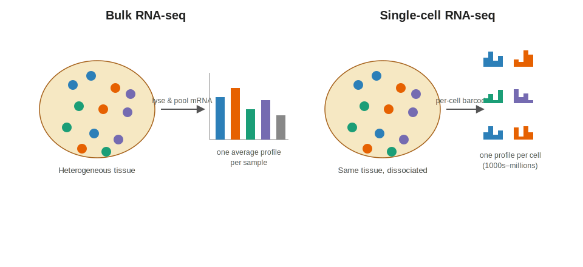
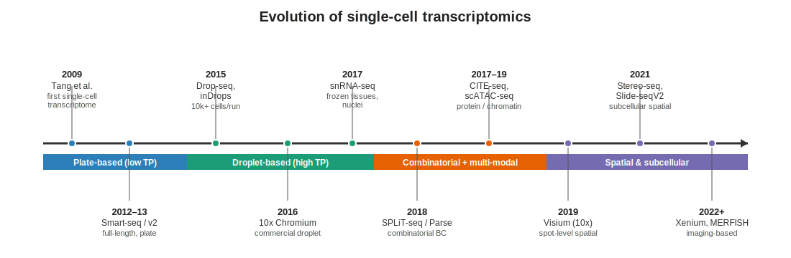
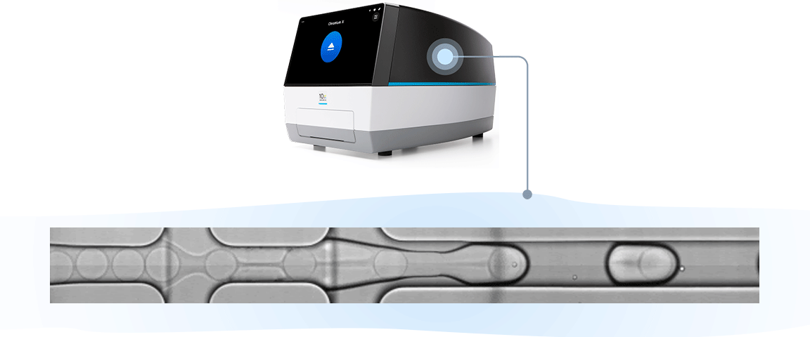
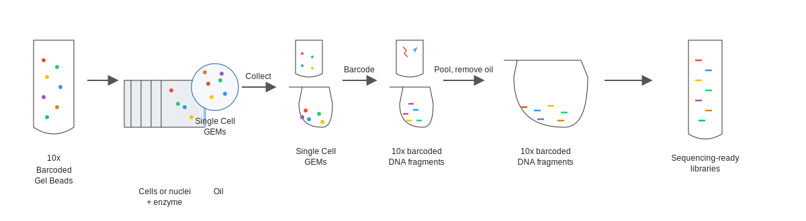
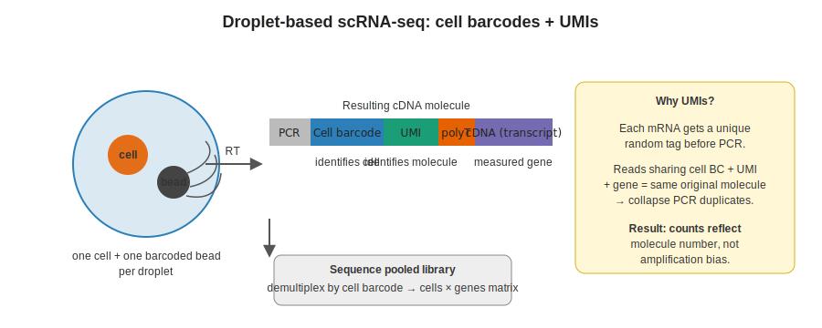
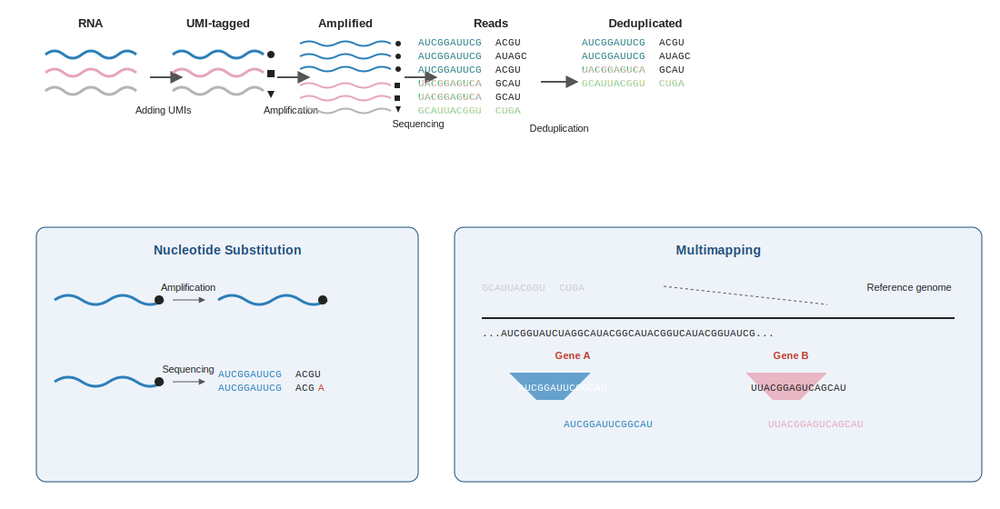
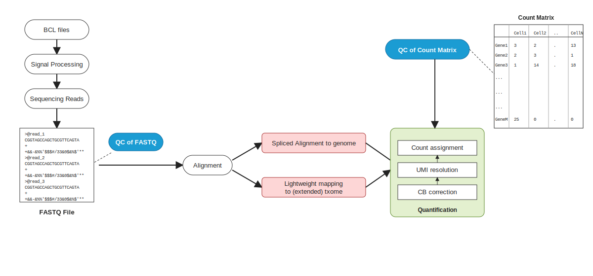
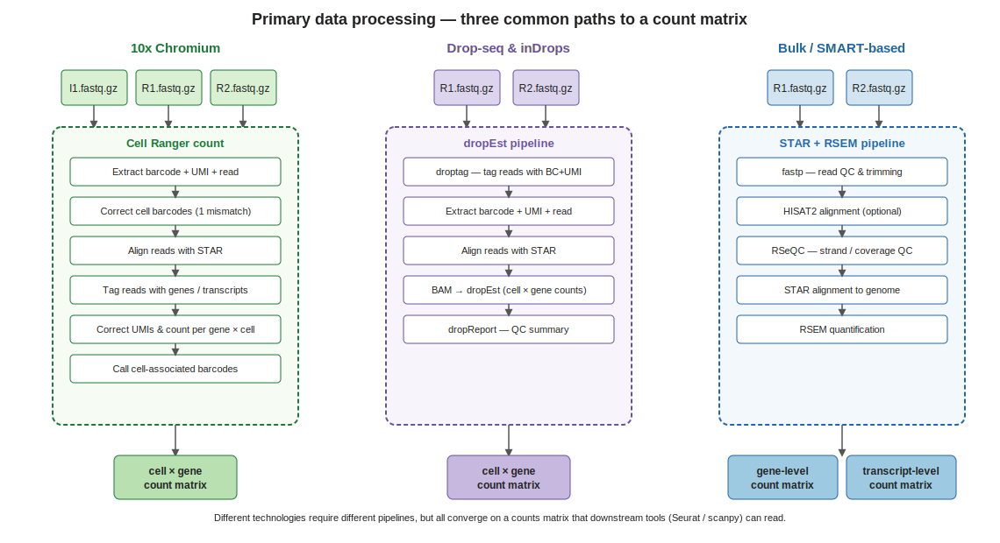
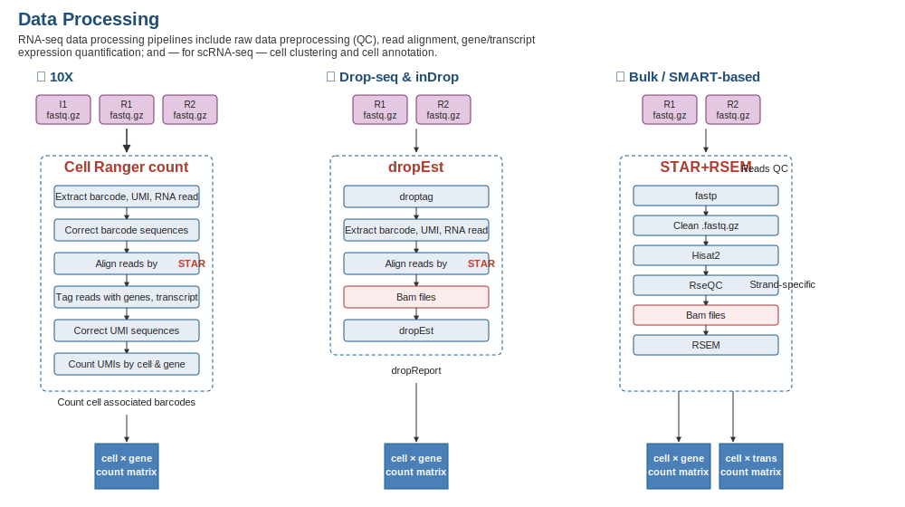

```{r}
#| label: setup
#| include: false

library(tidyverse)
library(knitr)
theme_set(theme_minimal(base_size = 14))
set.seed(2026)
```

# Lecture 01: Bulk vs. Single-Cell RNA-seq {background-color="#2c3e50"}

## Where this lecture fits

::: incremental
-   **You are here:** Lecture 01 — *the why and how of scRNA-seq data*
-   Up next:
    -   Lec 02 — Pre-processing (QC, doublets, normalization, HVGs)
    -   Lec 03 — Dim reduction, integration, clustering
    -   Lec 04 — Annotation
    -   Lec 05 — Downstream analyses (DE, enrichment, WGCNA, trajectory, CCC)
    -   Lec 06 — Beyond scRNA-seq (spatial, ATAC, multi-omics)
-   **Companion tutorial:** [Tutorial 01 — QC & Preprocessing](../Exercise_Folder/Tutorial_01_QC_Preprocessing.html)
:::

## Goals of this lecture

::: incremental
-   Understand what **bulk RNA-seq** measures vs. what **single-cell RNA-seq (scRNA-seq)** measures
-   See how a 10x Chromium-style experiment generates the data
-   Trace **reads → count matrix** end to end
-   Meet the data structure (cell × gene matrix) every downstream step assumes
:::

::: callout-note
**Theme for the workshop:** what is the same vs. what is new when we measure expression per cell instead of per tissue.
:::

# Part 1 — Why single-cell? {background-color="#2c3e50"}

## Bulk RNA-seq measures the *average*

-   mRNA from many cells is pooled, reverse-transcribed, sequenced
-   You get **one expression profile per sample** (usually \~20,000 genes × N samples)
-   Excellent for: comparing tissues / treatments / genotypes in **well-controlled designs with biological replicates**

::: callout-tip
Bulk is cheap, mature, and statistically well-understood. It remains the right tool for many questions.
:::

## What bulk cannot tell you

::: incremental
-   How many **[cell types](../Resources_Folder/Glossary.html#c)** are in the tissue, and in what proportions
-   Whether a gene is "up" because it changed within a cell type, or because the cell-type **composition** shifted
-   Rare populations, transitional states, developmental trajectories
-   Cell–cell communication in situ
:::

## Bulk vs. single-cell — the picture

{fig-align="center" width="92%"}

-   Bulk: one profile per sample
-   Single-cell: one profile per cell — heterogeneity becomes *visible*

## Commonalities you can carry over

::: incremental
-   Same core measurement: **count of reads/UMIs per gene**
-   Same statistical concerns: normalization, **[batch effects](../Resources_Folder/Glossary.html#b)**, multiple testing, replication
-   Many downstream questions (DE, enrichment, co-expression) are the **same questions at a new resolution**
:::

## What is genuinely new

::: incremental
-   **[Sparsity](../Resources_Folder/Glossary.html#s)**: \~90–95% zeros in typical droplet data (not all real biology — technical **[dropout](../Resources_Folder/Glossary.html#d)** too)
-   **Cells are not replicates**: cells from one subject are not statistically independent
-   **Cell type is a latent variable** you have to recover from the data
-   **Integration** across samples is a first-class problem, not an afterthought
:::

# Part 2 — How the data are generated {background-color="#2c3e50"}

## Major scRNA-seq technologies

| Category | Examples | Strengths | Trade-offs |
|----|----|----|----|
| **Plate-based, full-length** | Smart-seq2/3 | Full transcript coverage, isoforms, high sensitivity | Low throughput, more expensive per cell |
| **Droplet-based, 3'/5'** | 10x Genomics Chromium, Drop-seq, inDrops | High throughput (1k–100k+ cells) | 3' or 5' only, shallower per cell |
| **Combinatorial barcoding** | Parse Evercode, SPLiT-seq | No specialized instrument, fixable samples | Protocol complexity |
| **Nuclei (snRNA-seq)** | 10x Nuclei | Works on frozen / difficult tissues | Fewer transcripts, no cytoplasmic RNA |

::: callout-note
**10x Chromium 3'** is the workshop default. Most conceptual ideas generalize.
:::

## How we got here — a short timeline

{fig-align="center" width="98%"}

-   Throughput went from **one cell** (Tang 2009) to **millions of cells** in a decade
-   The field now extends *beyond* dissociated scRNA-seq into **multi-modal** and **spatial** measurements

## Droplet generation on the Chromium

{fig-align="center" width="85%"}

-   Microfluidic chip co-flows **cells**, **barcoded gel beads**, and **oil**
-   Each droplet encapsulates (ideally) one cell + one bead → one "GEM"
-   Inside the GEM, the bead releases barcoded primers; lysis + RT happens before demulsification

## Chromium library prep — the full cycle

{fig-align="center" width="96%"}

-   Gel beads + cells/enzyme + oil → **GEMs**
-   Each GEM: cell lysed, barcoded cDNA synthesized inside the droplet
-   Oil is removed, barcoded DNA is pooled and converted into **sequencing-ready libraries**

## Droplet protocol: barcodes + UMIs

{fig-align="center" width="90%"}

-   **[Cell barcode](../Resources_Folder/Glossary.html#b)** identifies which cell a read came from
-   **[UMI](../Resources_Folder/Glossary.html#u)** identifies the original mRNA molecule (collapses PCR duplicates)
-   Reads are pooled and **[demultiplexed](../Resources_Folder/Glossary.html#d)** computationally

## UMIs in detail — amplification, sequencing, dedup

{fig-align="center" width="96%"}

-   Each mRNA is tagged with a unique UMI **before** PCR
-   After sequencing, reads sharing a cell barcode **and** UMI collapse to one molecule
-   UMIs help detect **nucleotide substitutions** during PCR/sequencing and resolve **multi-mapping** reads

## From reads to a count matrix

::: incremental
-   Input: raw **[FASTQ](../Resources_Folder/Glossary.html#f)** files (R1 = cell BC + UMI, R2 = transcript)
-   Output: **cells × genes** count matrix (integer UMI counts)
-   Common tools:
    -   **Cell Ranger** (10x, official)
    -   **STARsolo** (STAR-based, fast, flexible)
    -   **alevin-fry / salmon** (selective alignment, very fast)
    -   **kb-python (kallisto \| bustools)** (pseudoalignment)
:::

## Raw data processing — BCL → count matrix

{fig-align="center" width="96%"}

-   **Signal processing** turns sequencer BCL files into FASTQ reads (with a first QC step)
-   **Alignment** (spliced to genome *or* lightweight mapping to transcriptome) feeds **quantification**: CB correction → UMI resolution → count assignment
-   Final product: a **cell × gene count matrix**, QC'd before downstream work begins

## Primary-processing pipelines side-by-side

{fig-align="center" width="96%"}

-   Three common entry points: **10x Chromium**, **Drop-seq / inDrops**, **bulk or SMART-based**
-   Different stacks of tools, **same destination**: a counts matrix that Seurat / scanpy can read

## Data-processing pipelines — an alternate view

{fig-align="center" width="96%"}

-   Same three entry points shown with platform-specific tool stacks
-   10X → **Cell Ranger count**; Drop-seq/inDrop → **dropEst**; Bulk/SMART → **STAR+RSEM**
-   All three funnel into the same kind of cell × gene count matrix

## The data structure you analyze

-   **[Sparse matrix](../Resources_Folder/Glossary.html#s)**: rows = genes, columns = cells (or transposed in Python)
-   Paired with per-cell metadata (sample, batch, QC metrics) and per-gene metadata

::: panel-tabset
### R / Seurat

``` r
library(Seurat)
counts <- Read10X(data.dir = "filtered_feature_bc_matrix/")
seu    <- CreateSeuratObject(counts = counts, project = "workshop",
                             min.cells = 3, min.features = 200)
seu
```

### Python / scanpy

``` python
import scanpy as sc
adata = sc.read_10x_mtx("filtered_feature_bc_matrix/", var_names="gene_symbols")
sc.pp.filter_cells(adata, min_genes=200)
sc.pp.filter_genes(adata, min_cells=3)
adata
```
:::

# Recap & what's next {background-color="#2c3e50"}

## What to remember from Lecture 01

::: incremental
-   scRNA-seq is the **same measurement at higher resolution** — count-based, but per cell
-   The chemistry (UMIs + cell barcodes + GEMs) is *what makes it possible* to recover per-cell counts after pooled sequencing
-   The output is always the same shape: a **cell × gene** sparse matrix with metadata
-   Sparsity + cell-level non-independence change the statistics — that's the next five lectures
:::

## Coming up next

-   **Lec 02** — [Pre-processing](Lecture_02_Preprocessing.html): QC, ambient RNA, doublets, normalization, HVGs
-   **Hands-on:** [Tutorial 01 — QC & Preprocessing](../Exercise_Folder/Tutorial_01_QC_Preprocessing.html)

## Further reading

-   [sc-best-practices](https://www.sc-best-practices.org/) — Heumos *et al.* (the workshop's primary external reference)
-   [10x Genomics Chromium overview](https://www.10xgenomics.com/instruments/chromium-x-series)
-   [Workshop Glossary](../Resources_Folder/Glossary.html)
