```{r}
#| label: setup
#| include: false

library(tidyverse)
library(knitr)

# scRNA-seq packages referenced in this lecture (not evaluated here)
# library(Seurat)
# library(SingleCellExperiment)
# library(scran)
# library(scater)
# library(harmony)
# library(SingleR)

theme_set(theme_minimal(base_size = 14))
set.seed(2026)
```

# Lecture 01: Bulk vs. Single-Cell RNA-seq {background-color="#2c3e50"}

## Goals of this lecture

::: incremental
-   Understand what **bulk RNA-seq** measures vs. what **single-cell RNA-seq (scRNA-seq)** measures
-   Walk the full scRNA-seq pipeline end-to-end at a conceptual level
-   Meet the common tools at each step, with a **Seurat** focus and **scanpy** alternatives
-   Preview key downstream analyses: annotation, DE, enrichment, WGCNA, pseudobulk, trajectory, cell-cell communication
:::

::: callout-note
**Theme for the workshop:** what is the same vs. what is new when we measure expression per cell instead of per tissue.
:::

# Part 1 — Why single-cell? {background-color="#2c3e50"}

## Bulk RNA-seq measures the *average*

-   mRNA from many cells is pooled, reverse-transcribed, sequenced
-   You get **one expression profile per sample** (usually ~20,000 genes × N samples)
-   Excellent for: comparing tissues / treatments / genotypes in **well-controlled designs with biological replicates**

::: callout-tip
Bulk is cheap, mature, and statistically well-understood. It remains the right tool for many questions.
:::

## What bulk cannot tell you

::: incremental
-   How many **cell types** are in the tissue, and in what proportions
-   Whether a gene is "up" because it changed within a cell type, or because the cell-type **composition** shifted
-   Rare populations, transitional states, developmental trajectories
-   Cell-cell communication in situ
:::

## Bulk vs. single-cell — the picture

{fig-align="center" width="92%"}

-   Bulk: one profile per sample
-   Single-cell: one profile per cell — heterogeneity becomes *visible*

## Commonalities you can carry over

::: incremental
-   Same core measurement: **count of reads/UMIs per gene**
-   Same statistical concerns: normalization, batch effects, multiple testing, replication
-   Many downstream questions (DE, enrichment, co-expression) are the **same questions at a new resolution**
:::

## What is genuinely new

::: incremental
-   **Sparsity**: \~90–95% zeros in typical droplet data (not all real biology — technical dropout too)
-   **Cells are not replicates**: cells from one subject are not statistically independent
-   **Cell type is a latent variable** you have to recover from the data
-   **Integration** across samples is a first-class problem, not an afterthought
:::

# Part 2 — How the data are generated {background-color="#2c3e50"}

## Major scRNA-seq technologies

| Category               | Examples                               | Strengths                                         | Trade-offs                              |
|------------------------|----------------------------------------|---------------------------------------------------|-----------------------------------------|
| **Plate-based, full-length** | Smart-seq2/3                     | Full transcript coverage, isoforms, high sensitivity | Low throughput, more expensive per cell |
| **Droplet-based, 3'/5'**     | 10x Genomics Chromium, Drop-seq, inDrops | High throughput (1k–100k+ cells)               | 3' or 5' only, shallower per cell        |
| **Combinatorial barcoding**  | Parse Evercode, SPLiT-seq        | No specialized instrument, fixable samples        | Protocol complexity                     |
| **Nuclei (snRNA-seq)**       | 10x Nuclei                       | Works on frozen / difficult tissues               | Fewer transcripts, no cytoplasmic RNA   |

::: callout-note
**10x Chromium 3'** is the workshop default. Most conceptual ideas generalize.
:::

## How we got here — a short timeline

{fig-align="center" width="98%"}

-   Throughput went from **one cell** (Tang 2009) to **millions of cells** in a decade
-   The field now extends *beyond* dissociated scRNA-seq into **multi-modal** and **spatial** measurements

## Droplet protocol: barcodes + UMIs

{fig-align="center" width="90%"}

-   **Cell barcode** identifies which cell a read came from
-   **UMI** identifies the original mRNA molecule (collapses PCR duplicates)
-   Reads are pooled and demultiplexed computationally

## From reads to a count matrix

::: incremental
-   Input: raw FASTQ files (R1 = cell BC + UMI, R2 = transcript)
-   Output: **cells × genes** count matrix (integer UMI counts)
-   Common tools:
    -   **Cell Ranger** (10x, official)
    -   **STARsolo** (STAR-based, fast, flexible)
    -   **alevin-fry / salmon** (selective alignment, very fast)
    -   **kb-python (kallisto \| bustools)** (pseudoalignment)
:::

## Primary-processing pipelines side-by-side

{fig-align="center" width="96%"}

-   Three common entry points: **10x Chromium**, **Drop-seq / inDrops**, **bulk or SMART-based**
-   Different stacks of tools, **same destination**: a counts matrix that Seurat / scanpy can read

## The data structure you analyze

-   **Sparse matrix**: rows = genes, columns = cells (or transposed in Python)
-   Paired with per-cell metadata (sample, batch, QC metrics) and per-gene metadata

::: panel-tabset
### R / Seurat

``` r
library(Seurat)
counts <- Read10X(data.dir = "filtered_feature_bc_matrix/")
seu    <- CreateSeuratObject(counts = counts, project = "workshop",
                             min.cells = 3, min.features = 200)
seu
```

### Python / scanpy

``` python
import scanpy as sc
adata = sc.read_10x_mtx("filtered_feature_bc_matrix/", var_names="gene_symbols")
sc.pp.filter_cells(adata, min_genes=200)
sc.pp.filter_genes(adata, min_cells=3)
adata
```
:::

# Part 3 — The full analysis workflow {background-color="#2c3e50"}

## Bulk RNA-seq workflow (for comparison)

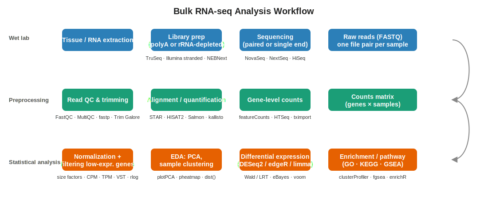{fig-align="center" width="98%"}

## scRNA-seq pipeline at a glance

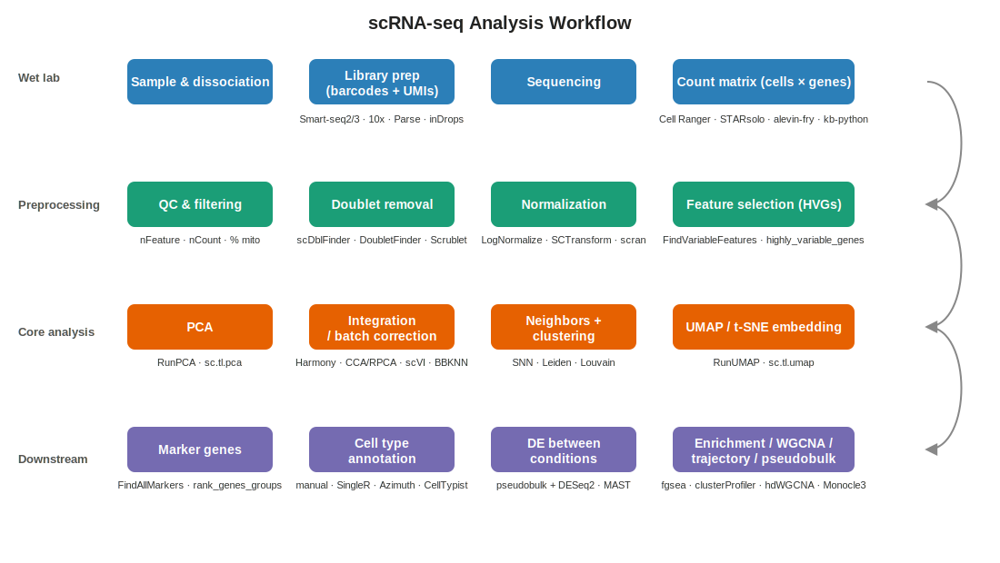{fig-align="center" width="98%"}

## Same data, two complementary analysis chains

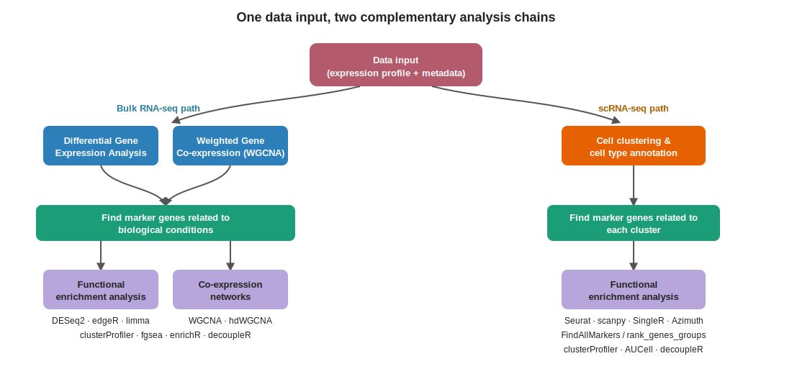{fig-align="center" width="95%"}

-   Bulk path: **DE + WGCNA → markers related to conditions → enrichment / networks**
-   scRNA-seq path: **clustering + annotation → markers per cluster → enrichment**
-   You can (and often do) run **both** on the same data — for scRNA-seq, the bulk path runs on the pseudobulk matrix

## The Seurat workflow in eight steps

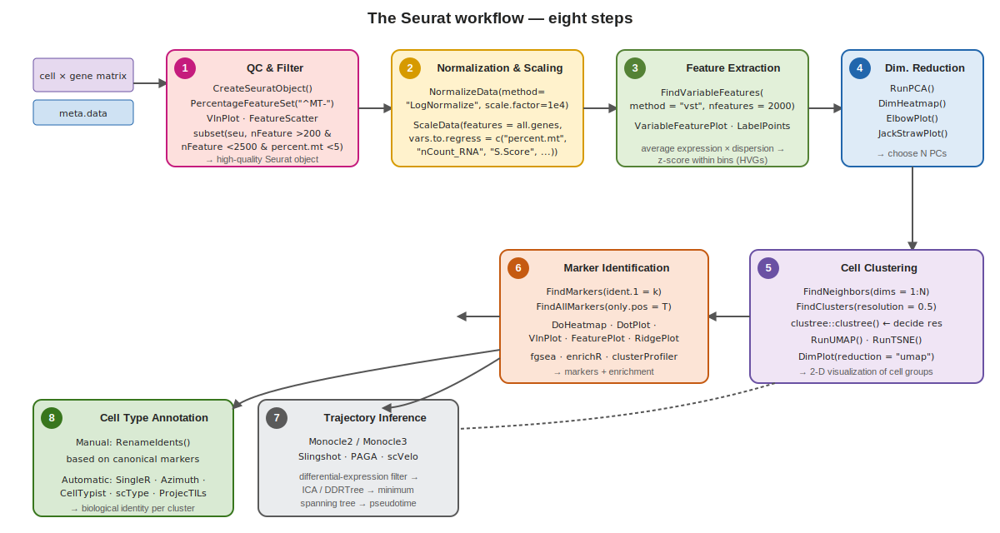{fig-align="center" width="97%"}

## The eight steps, in words

::: incremental
1.  **QC &amp; Filter** — create the Seurat object, drop low-quality cells and low-expression genes
2.  **Normalization &amp; Scaling** — `LogNormalize` then `ScaleData`, optionally regressing out `percent.mt`, cell-cycle, etc.
3.  **Feature Extraction** — `FindVariableFeatures` (VST) → \~2000 highly variable genes
4.  **Dimension Reduction** — `RunPCA`, then `ElbowPlot` / `JackStraw` to pick N PCs
5.  **Cell Clustering** — `FindNeighbors` → `FindClusters`; use **clustree** to pick a resolution; then `RunUMAP` / `RunTSNE`
6.  **Marker Identification** — `FindAllMarkers` + visualizations; gene-set enrichment on the markers
7.  **Trajectory Inference** — Monocle / Slingshot / PAGA / scVelo for continuous processes
8.  **Cell-type Annotation** — `RenameIdents` from markers + `SingleR` / `Azimuth` / `CellTypist` for automation
:::

## Same shape, different resolution

::: incremental
-   Same three big lanes: **wet lab → preprocessing → analysis**
-   Bulk stops at a *sample* counts matrix; scRNA-seq starts with a *cell* counts matrix and gains integration, clustering, annotation before "classical" DE
-   Many classical downstream steps (enrichment, WGCNA) work on **pseudobulk** derived from scRNA-seq, so the bulk skills transfer directly
:::

## Step 1 — Per-cell QC

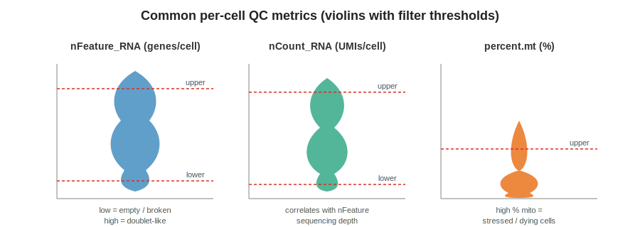{fig-align="center" width="85%"}

-   `nFeature_RNA`: genes detected per cell
-   `nCount_RNA`: total UMI counts per cell
-   `percent.mt`: % reads mapping to mitochondrial genes (stress/dying cells)

## QC in practice

::: panel-tabset
### Seurat

``` r
seu[["percent.mt"]] <- PercentageFeatureSet(seu, pattern = "^MT-")
VlnPlot(seu, features = c("nFeature_RNA", "nCount_RNA", "percent.mt"), ncol = 3)
seu <- subset(seu, nFeature_RNA > 200 & nFeature_RNA < 6000 & percent.mt < 15)
```

### scanpy

``` python
adata.var["mt"] = adata.var_names.str.startswith("MT-")
sc.pp.calculate_qc_metrics(adata, qc_vars=["mt"], inplace=True, percent_top=None)
adata = adata[(adata.obs.n_genes_by_counts > 200) &
              (adata.obs.n_genes_by_counts < 6000) &
              (adata.obs.pct_counts_mt < 15)].copy()
```
:::

::: callout-warning
Thresholds are dataset-specific. Always look at the distributions first.
:::

## Droplets can also be empty — or contaminated

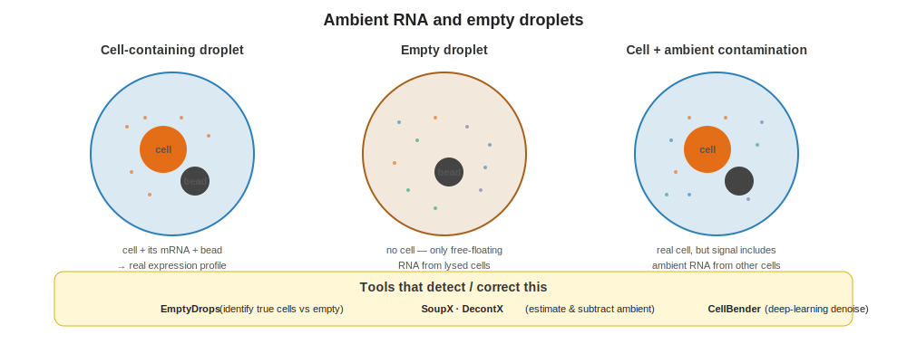{fig-align="center" width="92%"}

-   Many barcodes correspond to **empty droplets** with only ambient RNA — filter with `EmptyDrops` or the Cell Ranger knee-point
-   Even real cells are contaminated by **ambient RNA soup**; estimate and subtract with `SoupX`, `DecontX`, or `CellBender`

## Step 2 — Doublet detection

-   Droplets sometimes capture **two cells** → artificial "hybrid" profiles
-   Run doublet detection on each sample **before** integration

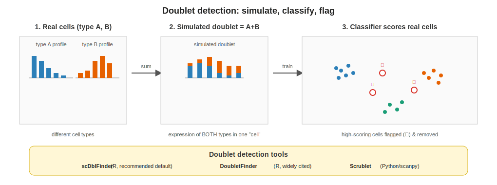{fig-align="center" width="95%"}

| Tool           | Ecosystem | Notes                           |
|----------------|-----------|---------------------------------|
| `scDblFinder`  | R / Bioc  | Fast, recommended default       |
| `DoubletFinder`| R         | Widely cited, parameter tuning  |
| `Scrublet`     | Python    | Classic choice in scanpy flows  |

## Step 3 — Normalization

-   **Goal:** put cells on a comparable scale before downstream math
-   Two dominant approaches:
    -   **Log-normalization** (`NormalizeData` / `sc.pp.normalize_total` + `log1p`): fast, simple
    -   **Variance-stabilizing** (`SCTransform` in Seurat, `scran::sctransform`): models mean-variance, often better for low-count cells

``` r
# Seurat
seu <- NormalizeData(seu) |>
  FindVariableFeatures(nfeatures = 2000) |>
  ScaleData()

# Alternative
seu <- SCTransform(seu, verbose = FALSE)
```

``` python
# scanpy
sc.pp.normalize_total(adata, target_sum=1e4)
sc.pp.log1p(adata)
sc.pp.highly_variable_genes(adata, n_top_genes=2000)
```

## Step 4 — Feature selection (HVGs)

-   Use the \~1,000–3,000 most variable genes for downstream geometry
-   Dramatically reduces noise from ubiquitously-expressed housekeeping genes
-   Seurat: `FindVariableFeatures()`; scanpy: `sc.pp.highly_variable_genes()`

## Step 5 — Linear dimensionality reduction (PCA)

-   PCA on scaled HVG expression gives a **low-dimensional, denoised representation**
-   Typical: first 20–50 PCs used for all downstream neighbor-graph steps
-   Choose the number of PCs with an `ElbowPlot()` or `JackStraw()` / variance explained curve

``` r
seu <- RunPCA(seu, npcs = 50)
ElbowPlot(seu, ndims = 50)
```

## Step 6 — Integration / batch correction

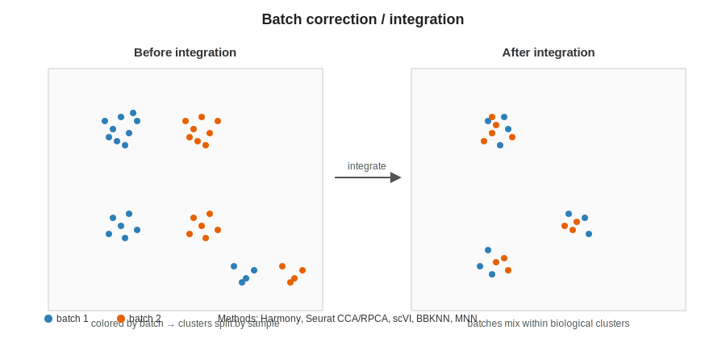{fig-align="center" width="88%"}

## Integration tools

| Tool                | Ecosystem | Approach                       |
|---------------------|-----------|--------------------------------|
| **Harmony**         | R / Py    | Iterative soft-clustering in PC space |
| **Seurat CCA / RPCA** | R       | Anchor-based cross-sample matching |
| **scVI / scANVI**   | Python    | Variational autoencoder        |
| **BBKNN**           | Python    | Batch-balanced k-NN graph      |
| **MNN / fastMNN**   | R / Py    | Mutual nearest neighbors       |

::: callout-tip
**Rule of thumb:** try a simple method (Harmony) first; move to scVI/scANVI for very large or heterogeneous atlases.
:::

## Step 7 — Neighborhood graph, clustering, embedding

-   Build a **shared nearest-neighbor (SNN)** graph from the integrated PCs
-   Cluster with **Louvain** or (preferred today) **Leiden** at a chosen resolution
-   Embed for visualization with **UMAP** or **t-SNE**

``` r
seu <- FindNeighbors(seu, dims = 1:30) |>
  FindClusters(resolution = 0.5, algorithm = 4) |> # 4 = Leiden
  RunUMAP(dims = 1:30)
DimPlot(seu, reduction = "umap", label = TRUE)
```

``` python
sc.pp.neighbors(adata, n_pcs=30)
sc.tl.leiden(adata, resolution=0.5)
sc.tl.umap(adata)
sc.pl.umap(adata, color="leiden", legend_loc="on data")
```

::: callout-warning
UMAP distances between clusters are **not quantitative**. Use for visualization, not inference.
:::

# Part 4 — Annotation {background-color="#2c3e50"}

## Two paths, use both

{fig-align="center" width="92%"}

## Manual annotation — marker-driven

1.  Find cluster markers

``` r
markers <- FindAllMarkers(seu, only.pos = TRUE, min.pct = 0.25,
                          logfc.threshold = 0.25)
markers |> group_by(cluster) |> slice_max(avg_log2FC, n = 10)
```

2.  Compare to canonical markers for the tissue
    -   **CellMarker 2.0**, **PanglaoDB**, tissue-specific references
3.  Assign labels; `RenameIdents()` / `seu$celltype <- ...`

## Automatic annotation — reference-driven

-   Fast, reproducible, reduces personal bias
-   Always **sanity-check** against markers

| Tool          | Reference / mechanism                       |
|---------------|---------------------------------------------|
| **SingleR**   | Bulk/sc references, correlation-based       |
| **Azimuth**   | Seurat v4 reference mapping (human refs)    |
| **CellTypist**| Logistic regression models, many tissues (py) |
| **scType**    | Marker-list–based scoring                   |
| **ProjecTILs**| T-cell / TME specialized                    |

::: callout-tip
Best practice: run an automatic method **and** confirm with manual marker inspection. Disagreements often flag interesting biology.
:::

# Part 5 — Downstream analyses {background-color="#2c3e50"}

## The annotated object is a launchpad

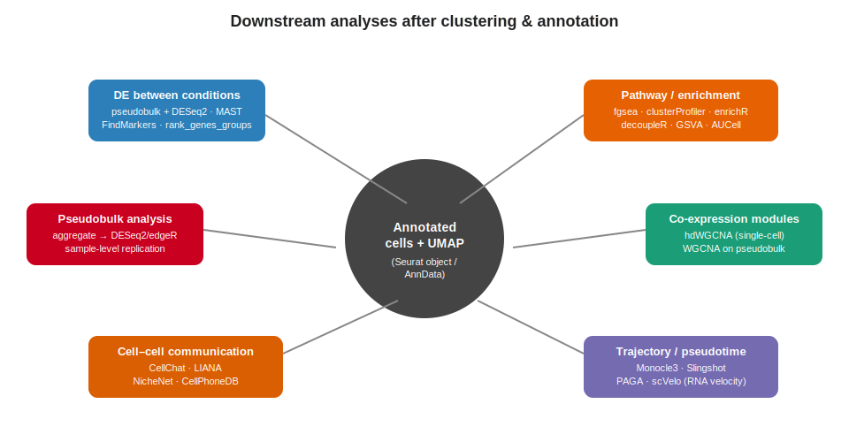{fig-align="center" width="95%"}

## DE between conditions

-   Question: within a given cell type, which genes change with treatment / genotype / time?
-   **Do NOT** treat cells as biological replicates — they are not independent
-   Preferred approach: **pseudobulk** (covered in its own lecture)
-   Within-cell methods still useful for *exploratory* cluster markers: `FindMarkers`, MAST, `rank_genes_groups`

## Enrichment / pathway analysis

-   Summarize gene lists into interpretable biology
-   Main flavors:
    -   **Over-representation** (hypergeometric): enrichR, clusterProfiler
    -   **Rank-based GSEA**: fgsea, clusterProfiler's `gseGO`/`gseKEGG`
    -   **Per-cell scoring**: decoupleR, AUCell, GSVA, `AddModuleScore`

``` r
# per-cell pathway activity (module scoring)
seu <- AddModuleScore(seu, features = list(interferon_genes), name = "IFN")
FeaturePlot(seu, "IFN1")
```

## Co-expression modules (WGCNA)

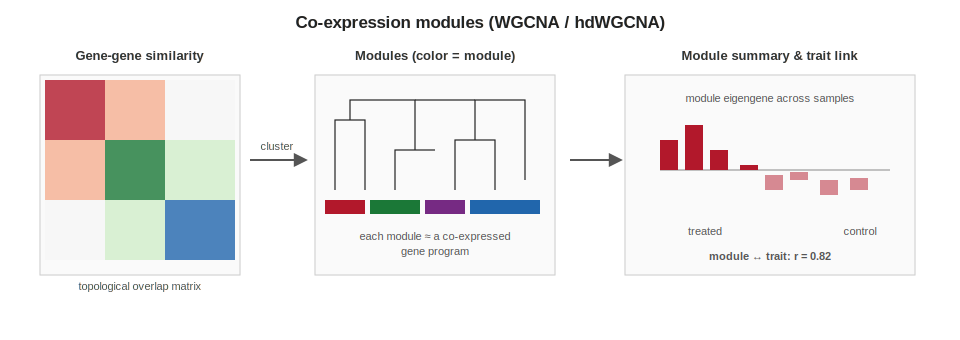{fig-align="center" width="95%"}

-   **hdWGCNA** (Morabito et al.) adapts WGCNA to sparse single-cell data using metacells
-   Alternative: build pseudobulk matrices per cell type, then run classic `WGCNA`
-   Output: gene **modules**, module eigengenes, module-trait correlations, hub genes

## Trajectory / pseudotime

-   For continuous processes (development, differentiation, activation)
-   Tools: **Monocle3**, **Slingshot**, **PAGA**, **scVelo** (RNA velocity)
-   Requires biological justification — not every dataset has a trajectory

## Cell–cell communication

-   Infer signaling between cell types from ligand-receptor expression
-   Tools: **CellChat**, **LIANA** (meta-resource), **NicheNet**, **CellPhoneDB**

## Pseudobulk — preview

-   Aggregate single-cell counts to **one value per (sample, cell type)**
-   Hand the resulting matrix to **DESeq2 / edgeR / limma-voom**
-   Gives properly calibrated DE with real biological replication
-   Covered in its own lecture next

# Part 6 — Beyond dissociated scRNA-seq {background-color="#2c3e50"}

## The landscape is wider than scRNA-seq alone

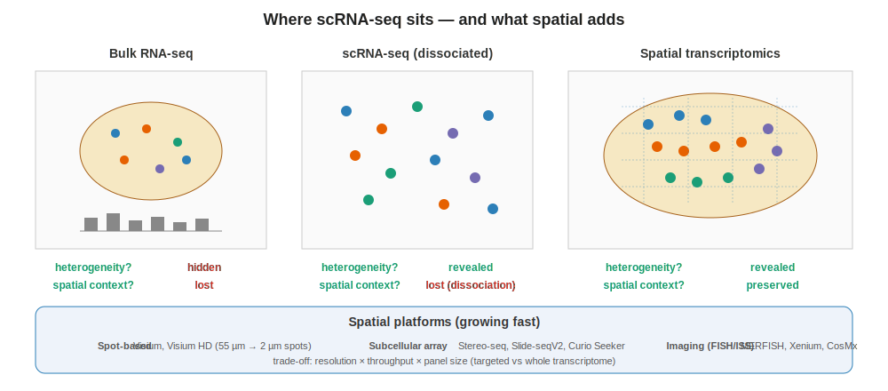{fig-align="center" width="95%"}

## Why spatial matters

::: incremental
-   **Dissociation discards tissue architecture.** scRNA-seq tells you *what* cells are present, not *where* they are
-   Spatial transcriptomics recovers tissue context at varying resolutions (spot → subcellular)
-   Same downstream concepts apply: QC, normalization, clustering, annotation — plus new ones (cell2location, neighborhood enrichment)
-   Often used in combination: scRNA-seq as a **reference** for deconvolving lower-resolution spatial data
:::

# Part 7 — Takeaways {background-color="#2c3e50"}

## What to remember

::: incremental
-   scRNA-seq is the **same measurement at higher resolution** — count-based, but per cell
-   Sparsity + lack of cell-level independence change the statistics
-   The canonical pipeline: **QC → normalize → HVGs → PCA → integrate → cluster → annotate → downstream**
-   **Seurat** in R and **scanpy** in Python cover the same steps with different idioms — pick one, learn it well, be fluent enough to read the other
-   For condition-level DE, default to **pseudobulk**
:::

## Further reading

-   Heumos *et al.* 2023, *Nature Reviews Genetics* — "Best practices for single-cell analysis across modalities"
-   Luecken & Theis 2019, *Molecular Systems Biology* — "Current best practices in single-cell RNA-seq analysis"
-   Amezquita *et al.* 2020 — [Orchestrating Single-Cell Analysis with Bioconductor (OSCA)](https://bioconductor.org/books/release/OSCA/)
-   [Seurat tutorials](https://satijalab.org/seurat/) · [Scanpy tutorials](https://scanpy.readthedocs.io/) · [sc-best-practices book](https://www.sc-best-practices.org/)
