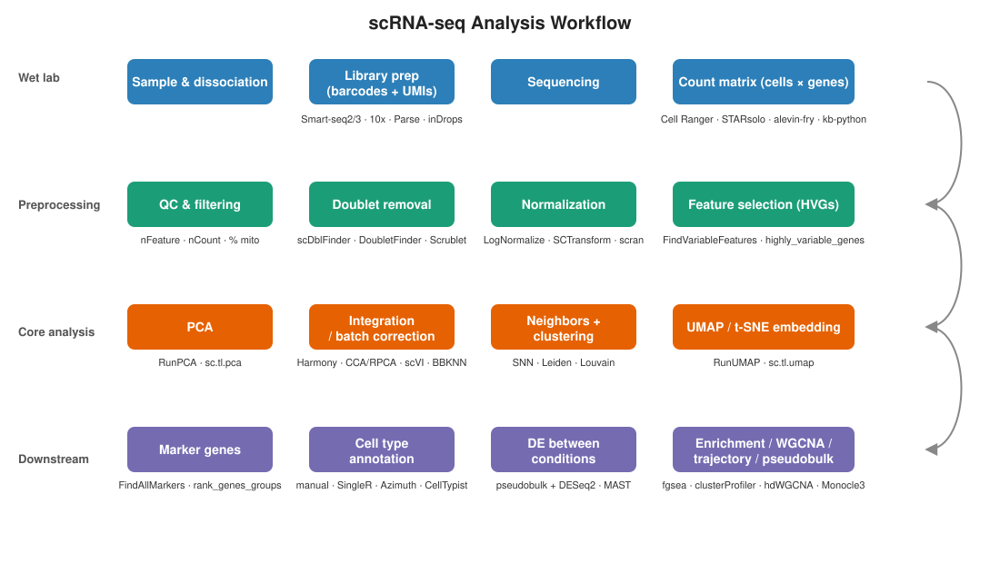
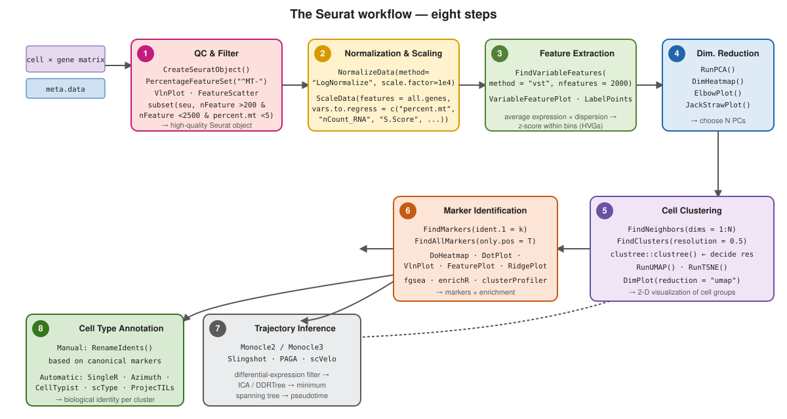
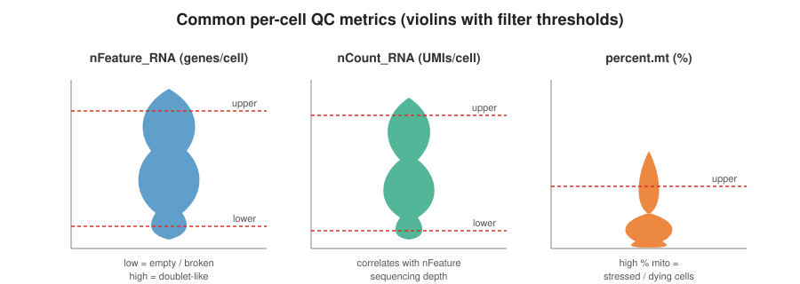
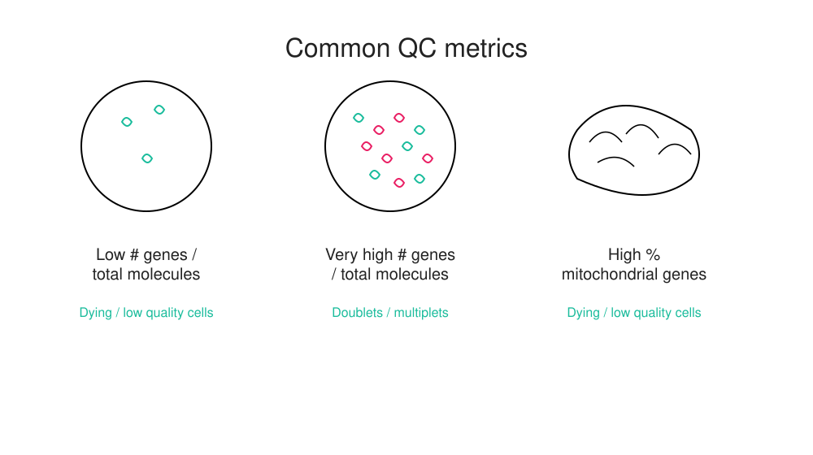
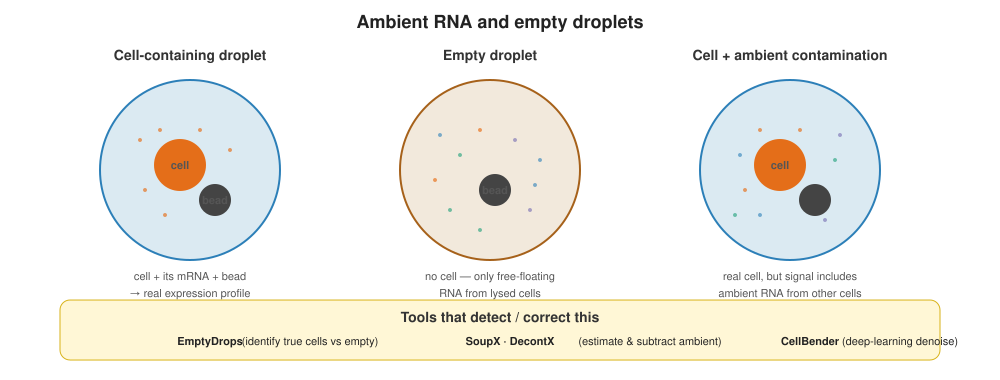
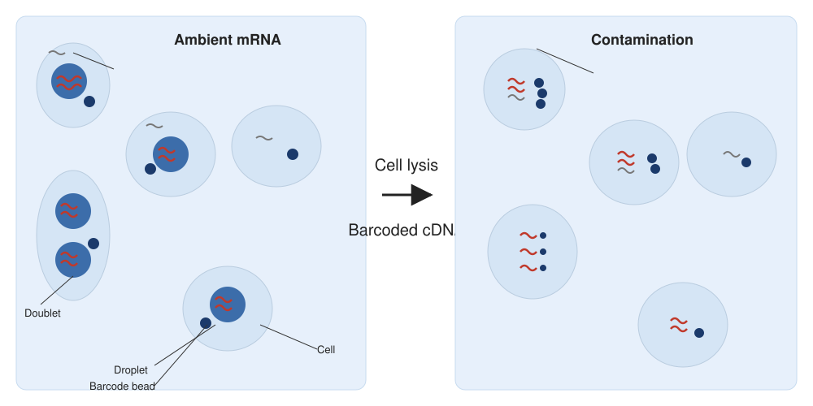
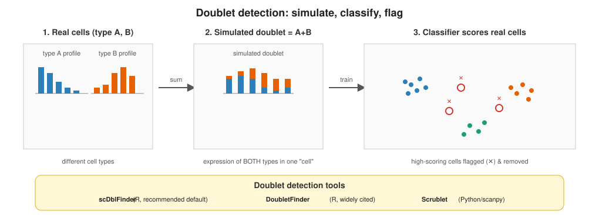
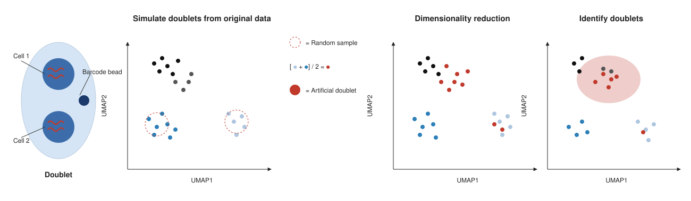
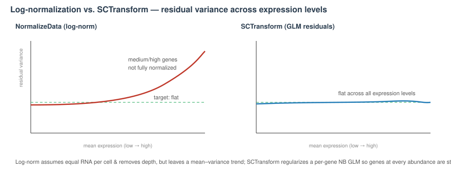

```{r}
#| label: setup
#| include: false

library(tidyverse)
library(knitr)
library(gridExtra)
library(ggrepel)
theme_set(theme_minimal(base_size = 14))
set.seed(2026)
```

# Lecture 01: Pre-processing {background-color="#2c3e50"}

## Where this lecture fits

-   Previous: [Lec 00 — Bulk vs. scRNA-seq + how data are generated](Lecture_00_Bulk_vs_scRNAseq.html)
-   **You are here:** Lec 01 — *turning a raw count matrix into a clean, normalized object*
-   Next: [Lec 02 — Dim Reduction & Clustering](Lecture_02_DimReduction_Clustering.html)
-   **Companion tutorial:** [Tutorial 01 — QC & Preprocessing](../Exercise_Folder/Tutorial_01_QC_Preprocessing.html)
-   **Companion book chapter:** [Chapter 1 — Preprocessing: From Counts Matrix to Filtered Object](../Resources_Folder/Chapter_01_Preprocessing.html)
-   **Parallel reading:** [scNotebooks Module 04](https://integrativebioinformatics.github.io/scNotebooks/modules/en/module04/module04.html) (QC + clustering + annotation in a single Jupyter notebook)

## Goals of this lecture

::: incremental
-   See where pre-processing sits in the canonical pipeline
-   Learn the three core QC metrics, **what they mean**, and **what counts as normal**
-   Recognize ambient-RNA contamination and droplet doublets — and how to handle each
-   Pick a normalization + feature-selection strategy that fits your data
:::

::: callout-note
**Why this matters.** Every downstream geometric step (PCA, clustering, UMAP) treats the post-QC matrix as ground truth. Garbage in → confidently-wrong clusters out. There is no "fix the clustering" — you have to fix the QC.
:::

# The full picture {background-color="#2c3e50"}

## scRNA-seq pipeline at a glance

{fig-align="center" width="98%"}

## The Seurat workflow in eight steps

{fig-align="center" width="97%"}

-   This lecture covers steps **1–4**: QC, normalization, scaling, feature extraction
-   Steps 5–8 come in Lec 02–04

## The Seurat workflow in eight steps (dup1)

{fig-align="center" width="92%"}

## The Seurat workflow in eight steps (dup2)

{fig-align="center" width="92%"}

# Step 1 — Per-cell QC {background-color="#2c3e50"}

## Why QC, in one sentence

A droplet that "looks like a cell" in your matrix may actually be **(a)** an empty droplet with ambient soup, **(b)** a dying cell leaking cytoplasm, **(c)** two cells in one droplet, or **(d)** a real cell. QC is how we triage them.

## Three core metrics

{fig-align="center" width="85%"}

-   `nFeature_RNA`: **genes detected per cell** — proxy for capture quality
-   `nCount_RNA`: **total UMI counts per cell** — proxy for sequencing depth in that cell
-   `percent.mt`: **% reads mapping to mitochondrial genes** — proxy for stress / dying cells (cytoplasmic mRNA leaks before mitochondrial mRNA)

## Three core metrics (dup1)

{fig-align="center" width="92%"}

## Three core metrics (dup2)

{fig-align="center" width="92%"}

## What each metric catches

{fig-align="center" width="85%"}

-   **Low** gene / molecule counts → empty / dying / poorly captured cells
-   **Very high** gene counts for the tissue → likely **[doublets / multiplets](../Resources_Folder/Glossary.html#d)**
-   **High mitochondrial %** → cells that were dying when loaded

## Normal ranges — a starting cheat sheet

::: callout-note
**Typical "healthy" thresholds for 10x 3' v3 on dissociated tissue.** These are starting points, not rules — *always look at the distributions first.*

| Metric | Typical lower | Typical upper | Notes |
|----|----|----|----|
| `nFeature_RNA` (genes/cell) | 200–500 | 2,500–6,000 | Upper bound is dataset-specific; doublets push past it |
| `nCount_RNA` (UMIs/cell) | 500–1,000 | \~50,000 | Very high counts often = doublets, very low = empty |
| `percent.mt` | — | 5–10% (PBMC), 15–20% (tumor / fragile tissue) | Nuclei (snRNA) should be \< \~1–2% |
:::

::: callout-warning
**Watch-outs.**
-   Brain / muscle / cardiomyocytes naturally have **high mitochondrial content** — a 5% threshold will throw away your biology.
-   **snRNA-seq** should have almost no mitochondrial reads; if it does, your nuclei prep contaminated cytoplasm.
-   A **bimodal `nCount_RNA`** distribution often means two cell sizes (e.g., lymphocytes + neutrophils), *not* doublets — don't gate it away.
:::

## QC in practice

::: panel-tabset
### Seurat

``` r
seu[["percent.mt"]] <- PercentageFeatureSet(seu, pattern = "^MT-")
VlnPlot(seu, features = c("nFeature_RNA", "nCount_RNA", "percent.mt"), ncol = 3)

# Inspect distributions BEFORE choosing thresholds
seu <- subset(seu,
              nFeature_RNA > 200 & nFeature_RNA < 2500 &
              percent.mt   < 5)
```

### scanpy

``` python
adata.var["mt"] = adata.var_names.str.startswith("MT-")
sc.pp.calculate_qc_metrics(adata, qc_vars=["mt"],
                           inplace=True, percent_top=None)
adata = adata[(adata.obs.n_genes_by_counts > 200) &
              (adata.obs.n_genes_by_counts < 2500) &
              (adata.obs.pct_counts_mt < 5)].copy()
```
:::

::: callout-tip
**Pattern for the mitochondrial regex:** human = `^MT-`, mouse = `^mt-`. Get this wrong silently and `percent.mt` will be all zeros.
:::

## What QC distributions actually look like

```{r}
#| label: qc-distributions
#| echo: false
#| fig-width: 11
#| fig-height: 4

set.seed(2026)
n_real      <- 8000
n_doublet   <- 800
n_dying     <- 600
n_empty     <- 1200

# Real cells: bell around ~2000 features
real_feat <- pmax(round(rnorm(n_real, 2000, 550)), 250)
real_umi  <- round(real_feat * exp(rnorm(n_real, log(2.5), 0.25)))
real_mt   <- pmin(pmax(rnorm(n_real, 4, 1.8), 0.2), 25)

# Doublets: high features and counts
db_feat <- round(rnorm(n_doublet, 4500, 600))
db_umi  <- round(db_feat * exp(rnorm(n_doublet, log(3), 0.2)))
db_mt   <- pmin(pmax(rnorm(n_doublet, 5, 1.6), 0.5), 20)

# Dying cells: low counts, very high mt
dy_feat <- round(rnorm(n_dying, 700, 200))
dy_umi  <- round(dy_feat * exp(rnorm(n_dying, log(1.6), 0.2)))
dy_mt   <- pmin(pmax(rnorm(n_dying, 22, 5), 8), 60)

# Empty droplets: very few features, low counts, modest mt
em_feat <- round(rnorm(n_empty, 150, 60))
em_umi  <- round(em_feat * exp(rnorm(n_empty, log(1.4), 0.2)))
em_mt   <- pmin(pmax(rnorm(n_empty, 6, 2), 0.5), 25)

qc <- tibble::tibble(
  nFeature_RNA = c(real_feat, db_feat, dy_feat, em_feat),
  nCount_RNA   = c(real_umi,  db_umi,  dy_umi,  em_umi),
  percent.mt   = c(real_mt,   db_mt,   dy_mt,   em_mt),
  kind = factor(c(rep("Real cell", n_real),
                  rep("Doublet (sim)", n_doublet),
                  rep("Dying", n_dying),
                  rep("Empty", n_empty)),
                levels = c("Empty", "Real cell", "Doublet (sim)", "Dying"))
)

p_feat <- ggplot(qc, aes(x = "", y = nFeature_RNA, fill = kind)) +
  geom_violin(scale = "width", trim = TRUE, alpha = 0.85, color = "grey20") +
  scale_fill_manual(values = c("#bdc3c7", "#3498db", "#e74c3c", "#9b59b6")) +
  labs(x = NULL, y = "nFeature_RNA",
       title = "Genes detected / cell") +
  theme_minimal(base_size = 12) + theme(legend.position = "none")

p_umi  <- ggplot(qc, aes(x = "", y = nCount_RNA, fill = kind)) +
  geom_violin(scale = "width", trim = TRUE, alpha = 0.85, color = "grey20") +
  scale_y_log10(labels = scales::comma) +
  scale_fill_manual(values = c("#bdc3c7", "#3498db", "#e74c3c", "#9b59b6")) +
  labs(x = NULL, y = "nCount_RNA (log)", title = "UMIs / cell") +
  theme_minimal(base_size = 12) + theme(legend.position = "none")

p_mt   <- ggplot(qc, aes(x = "", y = percent.mt, fill = kind)) +
  geom_violin(scale = "width", trim = TRUE, alpha = 0.85, color = "grey20") +
  scale_fill_manual(values = c("#bdc3c7", "#3498db", "#e74c3c", "#9b59b6")) +
  labs(x = NULL, y = "percent.mt", title = "% mitochondrial") +
  theme_minimal(base_size = 12) + theme(legend.position = "bottom",
                                         legend.title = element_blank())

gridExtra::grid.arrange(p_feat, p_umi, p_mt, nrow = 1, widths = c(1, 1, 1.3))
```

-   Each violin shows what each "category" of barcode looks like in a typical 10x v3 dataset
-   **Real cells** form the central bulk you want to keep; **doublets** sit at the high end; **dying** cells sit at the low-feature / high-mt corner; **empty** droplets pile up at very low feature counts
-   The right cutoffs aren't universal — they depend on your tissue and protocol — but the *shapes* of these distributions are what your QC plots should look like before you choose thresholds

## The barcode-rank (knee) plot

```{r}
#| label: knee-plot
#| echo: false
#| fig-width: 7
#| fig-height: 4

set.seed(2026)
# Simulate a knee plot — many empty droplets, knee around rank ~10000
ranks <- 1:50000
counts <- sort(c(round(exp(rnorm(8000, log(8000), 0.7))),       # real cells
                 round(exp(rnorm(2000, log(800), 0.4))),        # ambient/borderline
                 round(exp(rnorm(40000, log(40), 0.6)))),       # empty droplets
               decreasing = TRUE)[ranks]

plot(ranks, counts, log = "xy", type = "l", lwd = 2, col = "#2c3e50",
     xlab = "Barcode rank (sorted by UMI count)", ylab = "UMIs per barcode (log)",
     main = "Barcode rank ('knee') plot — typical 10x run")
abline(v = 8500, lty = 2, col = "red"); text(9500, 5e3, "knee", col = "red", pos = 4)
abline(v = 20000, lty = 2, col = "darkorange"); text(22000, 60, "ambient soup", col = "darkorange", pos = 4, cex = 0.9)
```

-   Sort all observed barcodes by UMI count, plot rank vs. count on log–log axes
-   **Above the knee:** real cells. **At the knee:** ambiguous droplets (some real, some ambient). **Below the knee:** empty droplets carrying mostly ambient mRNA.
-   Cell Ranger's filtered matrix uses an EmptyDrops-style algorithm to draw this line for you — but it's worth re-plotting it yourself when results look off
-   `DropletUtils::barcodeRanks()` (R) and `scanpy.pp.scrublet`'s prefilter (Python) both let you re-derive the knee

## Droplets can also be empty — or contaminated

{fig-align="center" width="92%"}

-   Many barcodes correspond to **empty droplets** with only ambient RNA — filter with `EmptyDrops` or the Cell Ranger knee-point
-   Even real cells are contaminated by **ambient RNA soup**; estimate and subtract with `SoupX`, `DecontX`, or `CellBender`

## Droplets can also be empty — or contaminated (dup1)

{fig-align="center" width="92%"}

## Ambient mRNA — before and after lysis

{fig-align="center" width="95%"}

-   Before lysis: each droplet contains (ideally) one cell + one bead, plus trace **ambient mRNA**
-   After lysis: the bead captures its cell's mRNA *and* any ambient mRNA → **cross-cell contamination** in the final counts

::: callout-tip
**When ambient correction matters most:** highly hemorrhagic samples (lots of free hemoglobin), cells dissociated from frozen tissue, or any time you see a marker gene "expressed" in clusters where it shouldn't be (a classic SoupX trigger).
:::

# Step 2 — Doublet detection {background-color="#2c3e50"}

## Doublets in one slide

-   Droplets sometimes capture **two cells** → artificial "hybrid" profiles
-   Run doublet detection on each sample **before** integration
-   Expected doublet rate scales with loading: \~0.8% per 1,000 cells loaded on 10x Chromium → \~8% at 10k cells, \~16% at 20k
-   **Experimental trick:** pooling samples with distinct **genotypes or species** lets you *detect* cross-sample doublets directly — genetic demultiplexing (`demuxlet` / `souporcell` / `Vireo`) or a human–mouse "barnyard" mix — and measure your true multiplet rate

{fig-align="center" width="95%"}

| Tool            | Ecosystem | Notes                          |
|-----------------|-----------|--------------------------------|
| `scDblFinder`   | R / Bioc  | Fast, recommended default      |
| `DoubletFinder` | R         | Used in Patel's tutorial; needs pK sweep |
| `Scrublet`      | Python    | Classic choice in scanpy flows |

## Doublets in one slide (dup1)

{fig-align="center" width="92%"}

## Doublet detection — how it actually works

{fig-align="center" width="98%"}

-   **Simulate** artificial doublets by averaging random pairs of real cells
-   Project real + simulated cells together in **reduced dimensions**
-   Real cells that sit close to many simulated doublets are **flagged** as likely doublets

::: callout-warning
**Doublet detection runs *per sample*, not on a merged object.** Inter-sample mixtures are not doublets — they're integration noise, and pretending they are will silently drop real cells.
:::

## What a doublet-score distribution looks like

```{r}
#| label: doublet-score
#| echo: false
#| fig-width: 9
#| fig-height: 4

set.seed(2026)
real_cells   <- rbeta(8000, 1.6, 14) * 0.6   # most real cells low score
true_doublet <- rbeta(640,  4,   3) * 0.7 + 0.25
df <- tibble::tibble(
  score = c(real_cells, true_doublet),
  truth = factor(c(rep("real (singlet)", length(real_cells)),
                   rep("doublet (sim or true)", length(true_doublet))),
                 levels = c("real (singlet)", "doublet (sim or true)"))
)

ggplot(df, aes(score, fill = truth)) +
  geom_histogram(binwidth = 0.012, position = "identity", alpha = 0.7, color = "grey20") +
  geom_vline(xintercept = 0.25, lty = 2, color = "red") +
  annotate("text", x = 0.27, y = 240, label = "Threshold", hjust = 0, color = "red") +
  scale_fill_manual(values = c("#3498db", "#e74c3c"), name = NULL) +
  labs(x = "Doublet score (e.g. scDblFinder, DoubletFinder, Scrublet)",
       y = "Cells",
       title = "Doublet score distribution — bimodal when doublets are present") +
  theme_minimal(base_size = 13) + theme(legend.position = "bottom")
```

-   Doublet detectors output a continuous **score** per cell — high = "looks like a simulated doublet"
-   In a healthy run the distribution is **bimodal**: a tall left peak (real cells) and a small right shoulder (likely doublets)
-   The threshold is set at the *expected doublet rate* implied by your loading concentration (e.g. 8% at 10k cells loaded on Chromium)
-   If the distribution is **unimodal**, your sample either has no detectable doublets (rare in a 10k-cell run) or your simulator parameters need tuning

# Step 3 — Normalization {background-color="#2c3e50"}

## Why normalize?

Cells are sequenced to wildly different depths (factor-of-10 spread is common). Without correction, a "highly expressed" gene in a deeply sequenced cell looks the same as a moderately expressed one in a shallow cell. Normalization puts cells on a comparable scale before downstream math.

## Two dominant approaches

-   **Log-normalization** (`NormalizeData` / `sc.pp.normalize_total` + `log1p`) — fast, simple, the default in most tutorials
-   **Variance-stabilizing** (`SCTransform` in Seurat) — models the negative-binomial mean–variance relationship; often better for low-count cells; slower

``` r
# Seurat — log-normalization
seu <- NormalizeData(seu) |>
  FindVariableFeatures(nfeatures = 2000) |>
  ScaleData()

# Seurat — SCTransform (alternative, replaces the three calls above)
seu <- SCTransform(seu, verbose = FALSE)
```

::: callout-tip
**When to reach for SCTransform:** noisy or very low-depth data (\~3,000 UMIs/cell median), or when you can see depth artefacts in your UMAP. For typical 10x v3 data, log-normalization is fine.
:::

::: callout-warning
**Don't normalize twice.** SCTransform replaces `NormalizeData` + `ScaleData`. Running both on the same object stacks transforms and breaks downstream assumptions.
:::

## What normalization actually does

```{r}
#| label: normalization-before-after
#| echo: false
#| fig-width: 11
#| fig-height: 4

set.seed(2026)
n_cells <- 1500
# Simulate per-cell sequencing depth — wide spread
total_umi <- round(exp(rnorm(n_cells, log(5000), 0.55)))
# A "typical" gene's count in each cell scales with total
gene_raw  <- rpois(n_cells, lambda = 0.0012 * total_umi)

# Log-normalize: log1p( gene/total * 10000 )
gene_log <- log1p(gene_raw / total_umi * 1e4)

dat <- tibble::tibble(total_umi, gene_raw, gene_log)

p_raw <- ggplot(dat, aes(total_umi, gene_raw)) +
  geom_point(alpha = 0.35, size = 1.2, color = "#3498db") +
  geom_smooth(method = "lm", se = FALSE, color = "#e74c3c", linewidth = 0.8) +
  scale_x_log10(labels = scales::comma) +
  labs(x = "Total UMIs / cell (log)", y = "Raw gene count",
       title = "Before — raw counts ride sequencing depth") +
  theme_minimal(base_size = 12)

p_norm <- ggplot(dat, aes(total_umi, gene_log)) +
  geom_point(alpha = 0.35, size = 1.2, color = "#27ae60") +
  geom_smooth(method = "lm", se = FALSE, color = "#e74c3c", linewidth = 0.8) +
  scale_x_log10(labels = scales::comma) +
  labs(x = "Total UMIs / cell (log)", y = "log1p(CPM10k)",
       title = "After log-normalization — depth dependence is gone") +
  theme_minimal(base_size = 12)

gridExtra::grid.arrange(p_raw, p_norm, nrow = 1)
```

-   **Left:** raw counts for a typical gene scale with each cell's sequencing depth — a high-depth cell looks "more highly expressed" purely because it was sequenced more
-   **Right:** after `NormalizeData()` (log1p of CPM-scaled counts), the depth correlation is gone — same biological signal, comparable across cells
-   This is the *minimum* you need before PCA. **SCTransform** does this *and* models gene-specific overdispersion, which is why it shines on low-depth or noisy data.

## Log-norm vs SCTransform — alternative schematic

{fig-align="center" width="96%"}

::: callout-note
**Alternative to the normalization slides above.** Original figure: **Hafemeister & Satija 2019**, *Genome Biology* — [doi.org/10.1186/s13059-019-1874-1](https://doi.org/10.1186/s13059-019-1874-1) (on Hope Healey's Lecture 2, slides ~17–19).
:::

# Step 4 — Feature selection (HVGs) {background-color="#2c3e50"}

## Why HVGs?

-   Use the \~1,000–3,000 most variable genes for downstream geometry
-   Dramatically reduces noise from ubiquitously-expressed housekeeping genes
-   Seurat: `FindVariableFeatures()`; scanpy: `sc.pp.highly_variable_genes()`

::: callout-note
**Typical settings:** `nfeatures = 2000` is the Seurat default and a defensible choice for most datasets. Bump to 3,000–5,000 for atlas-scale or highly heterogeneous data; drop to 1,000 only if your dataset is small and unimodal.
:::

::: callout-warning
**Pitfalls in HVG selection.**
-   Including **mitochondrial / ribosomal genes** as HVGs lets technical variation drive your PCs — many pipelines exclude these patterns by default.
-   If you regress out cell-cycle scores, do it *before* HVG selection, otherwise cycling genes dominate the variable list.
:::

## What the HVG (variable feature) plot shows

```{r}
#| label: hvg-mean-variance
#| echo: false
#| fig-width: 9
#| fig-height: 4.5

set.seed(2026)
n_genes <- 2500

# Mean expression spans many orders of magnitude
mean_x <- exp(rnorm(n_genes, mean = -2, sd = 2.2))

# Baseline (Poisson-like) variance follows mean closely; HVGs sit above that trend
log_resid <- rnorm(n_genes, mean = 0, sd = 0.45)
# Boost a small fraction of genes (true HVGs) above the trend
hvg_idx <- sample(seq_len(n_genes), 200)
log_resid[hvg_idx] <- log_resid[hvg_idx] + abs(rnorm(length(hvg_idx), 1.6, 0.5))

var_y <- exp(log(mean_x + 0.05) * 1.05 + log_resid)  # roughly mean^1.05 trend

genes <- tibble::tibble(mean = mean_x,
                        variance = var_y,
                        is_hvg = seq_len(n_genes) %in% hvg_idx)

# Top 10 most "variable" genes — pretend marker labels
top10 <- genes |>
  filter(is_hvg) |>
  slice_max(variance, n = 10) |>
  mutate(label = c("S100A9","LYZ","CD74","HBA1","CCL5","NKG7",
                   "GNLY","IGKC","MS4A1","FCGR3A"))

ggplot(genes, aes(mean, variance)) +
  geom_point(aes(color = is_hvg), alpha = 0.5, size = 1.4) +
  geom_smooth(data = filter(genes, !is_hvg),
              method = "loess", span = 0.6, se = FALSE,
              color = "grey30", linewidth = 0.7) +
  ggrepel::geom_text_repel(data = top10, aes(label = label),
                           size = 3.4, color = "#2c3e50",
                           min.segment.length = 0,
                           max.overlaps = 20) +
  geom_point(data = top10, color = "#e74c3c", size = 2) +
  scale_color_manual(values = c(`FALSE` = "grey60", `TRUE` = "#e74c3c"),
                     labels = c("Non-HVG", "HVG (top 2,000)"),
                     name = NULL) +
  scale_x_log10(labels = scales::comma) + scale_y_log10() +
  labs(x = "Mean expression (log)", y = "Variance (log)",
       title = "Mean–variance plot — HVGs are the points above the Poisson trend") +
  theme_minimal(base_size = 12) +
  theme(legend.position = "bottom")
```

-   Every gene gets a (mean, variance) pair. The **grey curve** is the expected mean–variance relationship for technical / housekeeping genes (roughly Poisson with overdispersion).
-   Genes that sit **well above the trend** are over-dispersed — their variance can't be explained by sampling noise alone, so they're carrying biological signal. Those are your HVGs.
-   `FindVariableFeatures(seu, selection.method = "vst", nfeatures = 2000)` returns the top 2,000 such genes, ranked by *standardized residual variance*. `VariableFeaturePlot()` is exactly this picture.
-   Marker labels in the corner are the exact reason you do this: in a PBMC run the top HVGs include the genes you'd already expect (`LYZ`, `S100A9`, `CD74`, `MS4A1`, …) — you should recognise them.

# Recap & what's next {background-color="#2c3e50"}

## What to remember from Lecture 01

::: incremental
-   QC = filtering bad **cells** *and* bad **droplets** — both matter
-   Thresholds are **dataset-specific**; always plot before you cut
-   Ambient RNA is real and can be subtracted (`SoupX`, `DecontX`, `CellBender`)
-   Doublets are detected by simulation; do it **per-sample** before integration
-   Normalization choice is less important than *consistency* between training and downstream steps
-   HVGs give you the gene-space PCA will operate on
:::

## Coming up next

-   **Lec 02** — [Dim reduction, integration, clustering](Lecture_02_DimReduction_Clustering.html)
-   **Hands-on:** [Tutorial 01 — QC & Preprocessing](../Exercise_Folder/Tutorial_01_QC_Preprocessing.html)
