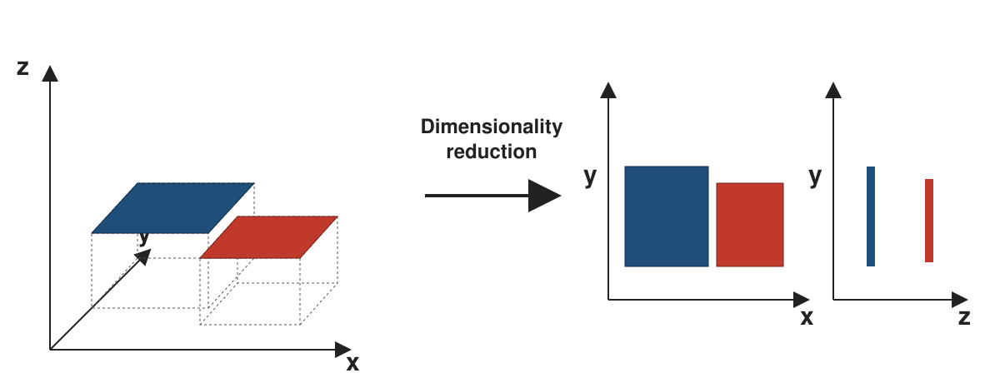
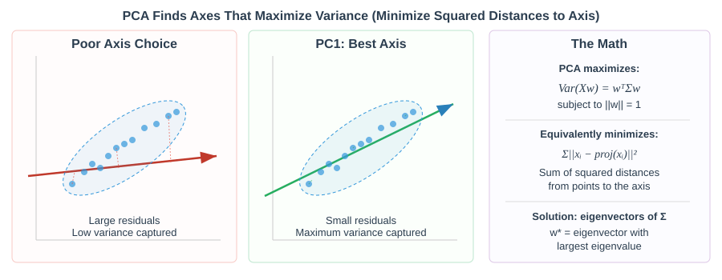
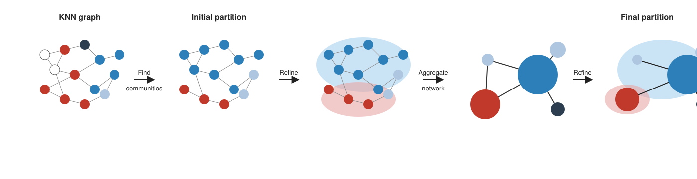
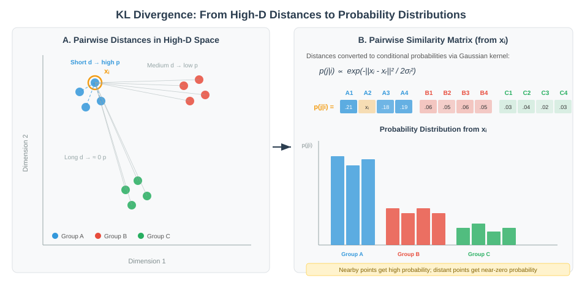
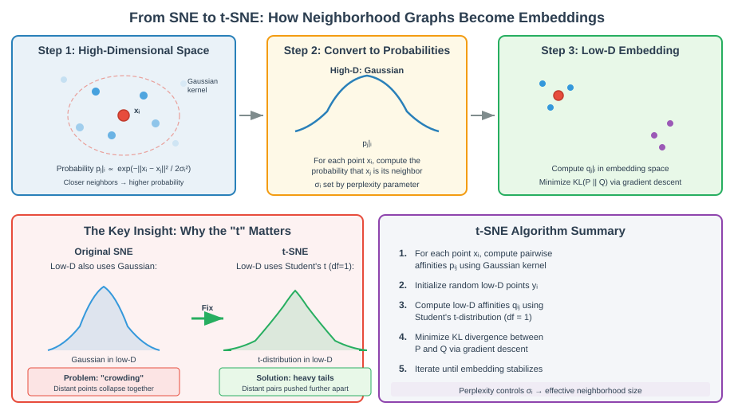
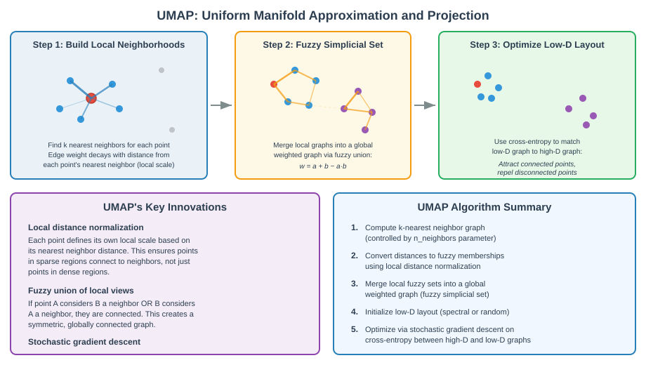
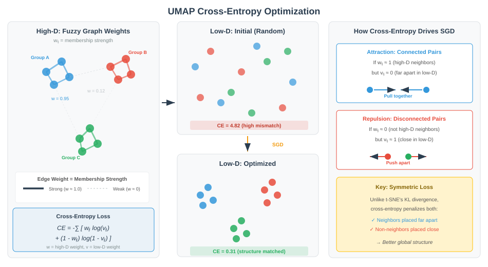
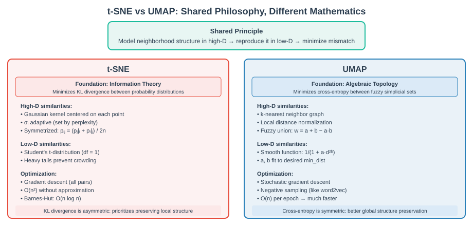

```{r}
#| label: setup
#| include: false
library(tidyverse); library(knitr); library(gridExtra)
theme_set(theme_minimal(base_size = 14)); set.seed(2026)
```

# Lecture 02: Dim Reduction, Integration & Clustering {background-color="#2c3e50"}

## Where this lecture fits

-   Previous: [Lec 01 — Pre-processing](Lecture_01_Preprocessing.html)
-   **You are here:** Lec 02 — *PCA, batch correction, neighbour graph, Leiden, t-SNE/UMAP*
-   Next: [Lec 03 — Markers & Manual Annotation](Lecture_03_Markers_Annotation.html)
-   **Companion tutorial:** [Tutorial 02 — Dim Reduction & Clustering](../Exercise_Folder/Tutorial_02_DimReduction_Clustering.html)

## Goals of this lecture

::: incremental
-   See **why** PCA always comes before anything else "geometric"
-   Read a scree plot and interpret PC loadings in scRNA-seq terms
-   Choose between integration tools by how heterogeneous your data are
-   Build the SNN graph and pick a clustering resolution defensibly
-   Understand what t-SNE and UMAP actually do — and what they *don't*
-   Read a UMAP without over-interpreting it
:::

::: callout-note
**Mental model.** Cells live in a \~20,000-D gene-expression space. PCA collapses that to 20–50 *signal* dimensions; the neighbour graph translates those distances into "who is similar to whom"; clustering carves the graph into groups; UMAP makes a 2D picture of all of it. Every step compresses information — get any of them wrong and you can't see what's there.
:::

::: callout-tip
**Parallel reading.** [scNotebooks Module 05 — Integrating single-cell transcriptomes from multiple samples](https://integrativebioinformatics.github.io/scNotebooks/modules/en/module05/module05.html) covers the integration topics in this lecture as a runnable Jupyter notebook (with R kernel) on the **same `ifnb` dataset** the workshop uses. Open it in Colab if you want a second walkthrough or a copy-pasteable code block. See also our full module-by-module map in the [scNotebooks Crosswalk](../Resources_Folder/scNotebooks_Crosswalk.html).
:::

# Step 5 — Linear dim reduction (PCA) {background-color="#2c3e50"}

## PCA in one slide

-   **[PCA](../Resources_Folder/Glossary.html#p)** on scaled HVG expression gives a low-dimensional, denoised representation
-   First 20–50 PCs are the substrate for **all** downstream neighbour-graph steps
-   Choose the number of PCs with `ElbowPlot()` (visual) or `JackStraw()` / variance-explained curve (statistical)

``` r
seu <- RunPCA(seu, npcs = 50)
ElbowPlot(seu, ndims = 50)
```

## Dimensionality reduction — the intuition

{fig-align="center" width="95%"}

-   Cells live in a very high-dimensional space (thousands of genes)
-   Dimensionality reduction **projects** them into 2–50 dimensions while preserving the main structure
-   Different projections emphasize different axes — the full signal isn't visible in any single 2D view

## Why PCA before everything else?

-   The HVG-scaled matrix has \~2,000 genes × tens of thousands of cells. Most pairs of cells are nearly equidistant in that space — the **curse of dimensionality** at work.
-   PCA does three jobs simultaneously:
    -   **Compresses** the data: 2,000 genes → \~50 PCs that explain most of the structured variance
    -   **Denoises** by discarding low-variance directions dominated by technical noise
    -   **Decorrelates** the axes — PCs are orthogonal, so distances in PC space behave well for the neighbour-graph and clustering steps that follow
-   Everything downstream — Harmony, FindNeighbors, Leiden, UMAP — operates on the PC matrix, *not* the gene matrix

::: callout-warning
**Don't skip PCA and run UMAP on raw gene expression.** UMAP/t-SNE on tens of thousands of genes is slow, noisy, and produces visibly worse embeddings. PCA is doing real statistical work, not just bookkeeping.
:::

## PCA finds axes of maximum variance

{fig-align="center" width="92%"}

-   PC1 = direction in gene space along which the data spread the most. PC2 = next-most variance, **orthogonal to PC1**. PC3 perpendicular to both, etc.
-   Same algebraic object two ways: **eigendecomposition** of the covariance matrix, or **SVD** of the centered data matrix $\tilde X = U \Sigma V^T$
    -   Right singular vectors $V$ → loadings (PC directions in gene space)
    -   $U \Sigma$ → scores (each cell's coordinates in PC space)
    -   $\sigma_i^2 / \sum \sigma_j^2$ → proportion of variance explained by PC $i$
-   `RunPCA()`, `sc.tl.pca()`, and `prcomp()` all call SVD under the hood — it scales better than eigendecomposition when the gene count exceeds the cell count

## In scRNA-seq: what does each PC capture?

-   **PC1–PC10** typically separate **major cell-type axes** (T vs B vs myeloid; epithelial vs stromal vs immune)
-   **PC10–PC30** resolve **subtypes and states** (CD4 vs CD8, naïve vs memory, cycling vs resting)
-   **PC30–PC50** capture finer biology + a growing share of noise — keep them only if your downstream clustering still benefits
-   **Beyond PC50** is overwhelmingly noise

::: callout-tip
**A PC dominated by mitochondrial or ribosomal genes is a red flag.** It usually means your QC let stressed cells through, or your HVG step picked up technical genes. Inspect `VizDimLoadings()` for PC1 and PC2 *before* you trust the embedding.
:::

## Center, then scale — and why this matters

| Setting                          | Result                       | When to use                              |
|----------------------------------|------------------------------|------------------------------------------|
| `center = TRUE, scale = FALSE`   | PCA on the **covariance** matrix  | All variables on the same scale     |
| `center = TRUE, scale = TRUE`    | PCA on the **correlation** matrix | Variables on different scales (default for HVGs) |

-   In Seurat, `ScaleData()` z-scores each gene **across cells** (mean 0, SD 1) before `RunPCA()`. In scanpy, `sc.pp.scale()` does the same.
-   Without scaling, a few high-mean / high-variance genes (`MALAT1`, ribosomal proteins, some lncRNAs) dominate every PC simply because they have larger raw variance — not because they are biologically informative.
-   This is why the canonical order **HVG → ScaleData → RunPCA** is fixed: HVGs select genes that carry biology, ScaleData puts them on equal footing, then PCA finds the structure.

## Reading the scree plot

```{r}
#| label: scree-example
#| echo: false
#| fig-width: 9
#| fig-height: 4.2

# Simulate a typical scRNA-seq scree shape: a steep drop, an elbow,
# then a long noise floor. Numbers chosen to mimic 10x v3 PBMC-style runs.
set.seed(2026)
sd_pc <- c(8.5, 6.0, 4.5, 3.7, 3.1, 2.7, 2.4, 2.2, 2.0, 1.85,
           1.72, 1.62, 1.55, 1.49, 1.44, 1.39, 1.35, 1.32, 1.29, 1.27,
           1.25, 1.23, 1.215, 1.20, 1.19, 1.18, 1.17, 1.165, 1.16, 1.155,
           rep(1.15, 20))
var_pc  <- sd_pc^2
prop_var <- var_pc / sum(var_pc)

par(mfrow = c(1, 2), mar = c(4.5, 4.5, 2.5, 1))
plot(seq_along(prop_var), prop_var * 100, type = "b", pch = 19, col = "#2c3e50",
     xlab = "Principal component", ylab = "% variance explained",
     main = "Scree plot — typical 10x scRNA-seq")
abline(v = 22, lty = 2, col = "red"); text(24, max(prop_var * 100) * 0.7,
                                            "Elbow ≈ PC22", col = "red", pos = 4, cex = 0.85)

plot(seq_along(prop_var), cumsum(prop_var) * 100, type = "b", pch = 19, col = "#2c3e50",
     xlab = "Principal component", ylab = "Cumulative % variance",
     main = "Cumulative variance", ylim = c(0, 100))
abline(h = 90, lty = 2, col = "red")
text(35, 92, "90% threshold", col = "red", cex = 0.85)
```

-   The **elbow** is where each additional PC stops adding meaningful variance — usually between **PC15 and PC30** for 10x runs
-   Cumulative variance is a sanity check, not a goal: a "90% rule" is misleading because the noise floor is high in scRNA-seq
-   `ElbowPlot(seu, ndims = 50)` is the visual; `JackStraw()` is a permutation-based statistical alternative when you want a defensible cutoff

::: callout-tip
**When in doubt, lean high.** Going from 20 PCs to 30 PCs rarely hurts clustering and often recovers a subtype that 20 PCs collapses. Going from 30 to 50 mostly costs runtime.
:::

## Loadings — which genes drive each PC?

```{r}
#| label: loadings-example
#| echo: false
#| fig-width: 10
#| fig-height: 4.2

set.seed(2026)
# Simulate plausible loading values for top-10 genes on PC1 (T/B-cell-like axis)
# and PC2 (myeloid axis). Real Seurat output looks similar in shape.
pc1 <- tibble::tibble(
  gene = c("CD3D","CD3E","TRAC","IL32","CCL5","NKG7","CD79A","MS4A1","CD79B","HLA-DQB1"),
  loading = c(0.18,0.17,0.16,0.14,0.13,0.12,-0.21,-0.20,-0.18,-0.16)
)
pc2 <- tibble::tibble(
  gene = c("LYZ","S100A8","S100A9","FCN1","CST3","TYROBP","CD3D","CD3E","TRAC","NKG7"),
  loading = c(0.22,0.21,0.20,0.18,0.17,0.16,-0.15,-0.14,-0.13,-0.12)
)

p1 <- pc1 |>
  mutate(gene = forcats::fct_reorder(gene, loading)) |>
  ggplot(aes(loading, gene, fill = loading > 0)) +
  geom_col() +
  scale_fill_manual(values = c(`TRUE` = "#e74c3c", `FALSE` = "#3498db"), guide = "none") +
  labs(title = "Top loadings — PC1", x = "Loading", y = NULL) +
  theme_minimal(base_size = 12)

p2 <- pc2 |>
  mutate(gene = forcats::fct_reorder(gene, loading)) |>
  ggplot(aes(loading, gene, fill = loading > 0)) +
  geom_col() +
  scale_fill_manual(values = c(`TRUE` = "#e74c3c", `FALSE` = "#3498db"), guide = "none") +
  labs(title = "Top loadings — PC2", x = "Loading", y = NULL) +
  theme_minimal(base_size = 12)

gridExtra::grid.arrange(p1, p2, nrow = 1)
```

-   **Loadings** are the weights that mix each gene into a PC. Big positive (or negative) loadings = genes moving cells along that axis.
-   In this cartoon: PC1 separates T-cell markers (`CD3D`, `CD3E`, `TRAC`) from B-cell markers (`CD79A`, `MS4A1`); PC2 separates myeloid markers (`LYZ`, `S100A8`, `S100A9`) from lymphoid.
-   Workflow tools: `VizDimLoadings(seu, dims = 1:4)` for bar plots, `DimHeatmap(seu, dims = 1:9, balanced = TRUE)` for a per-cell heatmap of the top loaders.
-   This is the step where PCA earns its reputation as **interpretable**: t-SNE and UMAP cannot tell you *which genes* drive a separation — PCA can.

# Step 6 — Integration / batch correction {background-color="#2c3e50"}

## When to integrate

{fig-align="center" width="88%"}

-   Multiple samples / batches / donors → the same cell type can split into per-sample clusters
-   Integration aligns shared cell types while preserving real biological differences
-   **Diagnostic:** color a UMAP by sample. If cell types co-cluster across samples, you don't need integration. If each sample forms its own island, you do.

## Integration tools

| Tool                  | Ecosystem | Approach                              |
|-----------------------|-----------|---------------------------------------|
| **Harmony**           | R / Py    | Iterative soft-clustering in PC space |
| **Seurat CCA / RPCA** | R         | Anchor-based cross-sample matching    |
| **scVI / scANVI**     | Python    | Variational autoencoder               |
| **BBKNN**             | Python    | Batch-balanced k-NN graph             |
| **MNN / fastMNN**     | R / Py    | Mutual nearest neighbors              |

::: callout-tip
**Rule of thumb:** try a simple method (Harmony) first; move to scVI/scANVI for very large or heterogeneous atlases. The workshop's [Tutorial 04](../Exercise_Folder/Tutorial_04_Integration.html) walks Harmony and Seurat anchors on the `ifnb` dataset (CTRL vs IFN-β-stimulated PBMCs) — the canonical small two-sample integration case. For a complementary, notebook-driven walkthrough see also the [scNotebooks](https://integrativebioinformatics.github.io/scNotebooks/) integration chapter.
:::

::: callout-warning
**Over-integration is real.** If you push integration too hard, real biological differences (e.g. tumor vs. normal) get squashed away with the batch effect. Always plot *both* batch and a known biological covariate after integration to confirm only the unwanted axis was removed.
:::

## Integration strategies — visual guide

{fig-align="center" width="98%"}

-   **Global models** (e.g. ComBat, `sc.tl.regress_out`) fit a regression with batch as a covariate
-   **Linear / MNN** (MNN, FastMNN, Seurat v3, Scanorama) find mutual nearest neighbours across batches and correct
-   **Graph / deep learning** (BBKNN, Conos, scVI, trVAE, SAUCIE) enforce cross-batch connectivity, or add batch as a node in an autoencoder

## Seurat anchors in detail

{fig-align="center" width="95%"}

-   Project both samples by **canonical correlation analysis (CCA)** + L2 normalization into a shared low-rank space
-   Find pairs of cells that are **mutual nearest neighbours** across the two samples — these are the **anchors**
-   **Score** each anchor by how well its local neighbourhoods agree across the two samples; high-scoring anchors drive the alignment, low-scoring anchors are filtered out
-   Apply the anchor-derived correction to bring matching cell types into register

## Harmony in detail

{fig-align="center" width="95%"}

-   Operates in **PC space** after a normal `RunPCA()` — no extra tooling above the standard workflow
-   Iterates four steps until convergence: (a) soft-cluster cells with a batch-diversity penalty, (b) compute a global centroid and per-batch centroids per cluster, (c) compute correction factors that pull each per-batch centroid toward the global one, (d) shift each cell using its soft-cluster-weighted correction
-   Output is a `harmony` reduction that drops in for `pca` in `FindNeighbors` and `RunUMAP`

## What integration looks like — before vs after

```{r}
#| label: integration-toy
#| echo: false
#| fig-width: 10
#| fig-height: 4.5

set.seed(2026)

# 4 cell types, 2 batches; each batch shifted in PC space
make_batch <- function(shift_x, shift_y) {
  bind_rows(
    tibble(x = rnorm(160,  3, 0.7) + shift_x, y = rnorm(160,  4, 0.6) + shift_y, ct = "T cell"),
    tibble(x = rnorm(140, -3, 0.7) + shift_x, y = rnorm(140,  3, 0.7) + shift_y, ct = "B cell"),
    tibble(x = rnorm(120,  0, 0.6) + shift_x, y = rnorm(120, -3, 0.7) + shift_y, ct = "Myeloid"),
    tibble(x = rnorm( 80,  3, 0.7) + shift_x, y = rnorm( 80, -1, 0.6) + shift_y, ct = "NK")
  )
}
b1 <- make_batch( 0.0,  0.0) |> mutate(batch = "Sample A")
b2 <- make_batch( 4.5, -4.5) |> mutate(batch = "Sample B")

# After "integration": project both batches onto the same shared structure
# (here, just remove the per-batch shift)
b1a <- b1 |> mutate(x_int = x,        y_int = y)
b2a <- b2 |> mutate(x_int = x - 4.5,  y_int = y + 4.5)
post <- bind_rows(b1a, b2a)

cols <- c("T cell" = "#3498db", "B cell" = "#e74c3c",
          "Myeloid" = "#27ae60", "NK" = "#9b59b6")

# Before plot — coloured by BATCH so the user sees the batch effect
p_before <- bind_rows(b1, b2) |>
  ggplot(aes(x, y, color = batch)) +
  geom_point(alpha = 0.6, size = 1.4) +
  scale_color_manual(values = c("Sample A" = "#34495e", "Sample B" = "#e67e22"), name = NULL) +
  labs(title = "Before integration — sample drives PC space",
       x = "PC1", y = "PC2") +
  theme_minimal(base_size = 12) + theme(legend.position = "bottom")

# After plot — coloured by CELL TYPE so the user sees the biology emerge
p_after <- post |>
  ggplot(aes(x_int, y_int, color = ct, shape = batch)) +
  geom_point(alpha = 0.7, size = 1.4) +
  scale_color_manual(values = cols, name = NULL) +
  labs(title = "After integration — cell types align across samples",
       x = "PC1 (corrected)", y = "PC2 (corrected)") +
  theme_minimal(base_size = 12) +
  theme(legend.position = "bottom",
        legend.box = "vertical")

gridExtra::grid.arrange(p_before, p_after, nrow = 1)
```

-   **Left:** raw PCA — the biggest axis is *which sample the cell came from*, not *what cell type it is*. Each sample looks like its own island.
-   **Right:** after integration (Harmony / FastMNN / scVI / …) — cell types align across samples, and the four populations are now distinguishable on PC1/PC2.
-   **Diagnostic check:** colour the post-integration UMAP by batch. If batches mix within each cluster you're done. If a cluster is still single-batch, either there's residual batch effect (push integration harder) **or** that population truly only exists in one sample (don't push, you'll erase real biology).

::: callout-warning
The "after" panel above is a cartoon. Real integration *warps* the embedding non-rigidly — that's what makes it powerful and what makes over-integration dangerous. Always sanity-check with both batch and a known biological covariate.
:::

## Diagnosing over- and under-correction

Three diagnostics, all of which appear in [Tutorial 04](../Exercise_Folder/Tutorial_04_Integration.html):

1. **Color the post-integration UMAP by sample.** Cells from each sample should interleave within every cluster. Clusters that remain mostly one sample are either (a) under-corrected or (b) genuinely sample-specific biology (e.g. an activated state present only after stimulation).
2. **Color it by a *biological* covariate.** Cell-type labels (or reference-mapped predictions) should occupy single regions. If a cell type fragments into multiple clusters, integration is leaving residual sample structure.
3. **Score a known biological signal at the cell level and check it survives.** For `ifnb`, score each cell on a panel of interferon-stimulated genes (`ISG15`, `IFI6`, `MX1`, ...) and confirm STIM cells still score higher than CTRL cells *within the same cluster*. If integration has flattened that gap, you've over-corrected.

These three checks generalize to any batch-integrated dataset. The third is particularly important and easy to forget.

## ifnb in practice — UMAPs you'll see in Tutorials 02 and 04

```{r}
#| label: ifnb-umaps
#| echo: false
#| fig-width: 12
#| fig-height: 4.6

set.seed(2026)

# Simulate 6 cell types × 2 conditions
celltypes <- c("CD14 Mono", "CD16 Mono", "B", "CD4 T", "CD8 T", "NK")
ct_centers <- tibble(
  ct = celltypes,
  cx = c(-3, -3, 3, 3, 0, 0),
  cy = c( 2, -2, 2, -2, 4, -4)
)

# Each condition shifts every cluster by the same vector — that's the batch effect
# CTRL: no shift; STIM: shift along the IFN axis
n_per <- 200
cells <- map_dfr(celltypes, function(ct) {
  c <- ct_centers |> filter(ct == !!ct)
  bind_rows(
    tibble(ct = ct, stim = "CTRL",
           u1 = c$cx + rnorm(n_per, 0, 0.6),
           u2 = c$cy + rnorm(n_per, 0, 0.5)),
    tibble(ct = ct, stim = "STIM",
           u1 = c$cx + 4 + rnorm(n_per, 0, 0.6),
           u2 = c$cy + 1 + rnorm(n_per, 0, 0.5))
  )
})

p_unint_sample <- ggplot(cells, aes(u1, u2, color = stim)) +
  geom_point(alpha = 0.6, size = 0.6) +
  scale_color_manual(values = c(CTRL = "#34495e", STIM = "#e67e22"), name = NULL) +
  labs(title = "Unintegrated — by sample",
       subtitle = "two parallel islands, every cell type doubles up",
       x = "UMAP1", y = "UMAP2") +
  theme_minimal(base_size = 11) + theme(legend.position = "bottom")

p_unint_ct <- ggplot(cells, aes(u1, u2, color = ct)) +
  geom_point(alpha = 0.6, size = 0.6) +
  scale_color_brewer(palette = "Set1", name = NULL) +
  labs(title = "Unintegrated — by cell type",
       subtitle = "each type splits in two — left/CTRL, right/STIM",
       x = "UMAP1", y = "UMAP2") +
  theme_minimal(base_size = 11) +
  theme(legend.position = "bottom") +
  guides(color = guide_legend(nrow = 2, override.aes = list(size = 3)))

# After integration: collapse the per-condition shift
cells_int <- cells |>
  mutate(u1_int = ifelse(stim == "STIM", u1 - 4, u1),
         u2_int = ifelse(stim == "STIM", u2 - 1, u2))

p_int_sample <- ggplot(cells_int, aes(u1_int, u2_int, color = stim)) +
  geom_point(alpha = 0.6, size = 0.6) +
  scale_color_manual(values = c(CTRL = "#34495e", STIM = "#e67e22"), name = NULL) +
  labs(title = "After integration — by sample",
       subtitle = "the two colors interleave inside each cluster",
       x = "UMAP1", y = "UMAP2") +
  theme_minimal(base_size = 11) + theme(legend.position = "bottom")

p_int_ct <- ggplot(cells_int, aes(u1_int, u2_int, color = ct)) +
  geom_point(alpha = 0.6, size = 0.6) +
  scale_color_brewer(palette = "Set1", name = NULL) +
  labs(title = "After integration — by cell type",
       subtitle = "one cluster per cell type",
       x = "UMAP1", y = "UMAP2") +
  theme_minimal(base_size = 11) +
  theme(legend.position = "bottom") +
  guides(color = guide_legend(nrow = 2, override.aes = list(size = 3)))

gridExtra::grid.arrange(p_unint_sample, p_unint_ct, p_int_sample, p_int_ct, nrow = 2)
```

The four-panel grid above is exactly what students produce in Tutorials 02 and 04. Read it as:

::: incremental
-   **Top-left** (Tut 02 unintegrated, by sample) — two clearly separated islands. The biggest source of variance is `stim`, not biology
-   **Top-right** (Tut 02 unintegrated, by cell type) — each cell type splits in two, mirroring the sample split. Six biological cell types appear as twelve clusters
-   **Bottom-left** (Tut 04 integrated, by sample) — colors interleave inside each cluster. This is the test of "did integration work?"
-   **Bottom-right** (Tut 04 integrated, by cell type) — one cluster per cell type. This is the goal
:::

## ISG score gap survives integration — the over-correction check

```{r}
#| label: isg-gap-check
#| echo: false
#| fig-width: 9
#| fig-height: 4

set.seed(2026)

# Per-cell ISG score: high in STIM monocytes, mild in T/B/NK
isg_score <- function(stim, ct) {
  baseline <- ifelse(stim == "CTRL", 0.05, 1)
  multiplier <- case_when(
    ct == "CD14 Mono" ~ 1.5,
    ct == "CD16 Mono" ~ 1.4,
    ct == "B"         ~ 0.8,
    ct == "CD4 T"     ~ 1.0,
    ct == "CD8 T"     ~ 1.1,
    ct == "NK"        ~ 0.9
  )
  pmax(baseline * multiplier + rnorm(length(stim), 0, 0.25), 0)
}

cells_int$isg <- isg_score(cells_int$stim, cells_int$ct)

ggplot(cells_int, aes(stim, isg, fill = stim)) +
  geom_violin(scale = "width", trim = TRUE) +
  geom_boxplot(width = 0.15, outlier.size = 0.5, fill = "white") +
  facet_wrap(~ ct, nrow = 1) +
  scale_fill_manual(values = c(CTRL = "#34495e", STIM = "#e67e22"), guide = "none") +
  labs(title = "ISG score per cell type — STIM > CTRL within EVERY cell type",
       subtitle = "If integration had flattened these gaps, it over-corrected.",
       x = NULL, y = "Module score (ISG15, IFI6, IFIT1, MX1, ...)") +
  theme_minimal(base_size = 11)
```

The integration moved cells *spatially* (the bottom panels of the previous figure) **without erasing the IFN-β biology** (ISG score still STIM > CTRL within every cluster). That's the right outcome.

::: callout-tip
**This is the most important diagnostic and the one most often skipped.** Always run a known biological signal through the post-integration object and confirm the signal survives. Pretty UMAPs are not the same as preserved biology.
:::

# Step 7 — Neighbour graph + Leiden clustering {background-color="#2c3e50"}

## SNN graph → Leiden

-   Build a **shared nearest-neighbor (SNN)** graph from the integrated PCs — each cell connects to its $k$ nearest neighbours, weighted by how many of those neighbours are *shared*
-   **[Cluster](../Resources_Folder/Glossary.html#c)** with **Louvain** or (preferred today) **Leiden** at a chosen resolution
-   The graph (not the gene matrix, not the UMAP) is the object Leiden actually clusters

``` r
seu <- FindNeighbors(seu, dims = 1:30) |>
  FindClusters(resolution = 0.5, algorithm = 4)  # 4 = Leiden
```

``` python
sc.pp.neighbors(adata, n_pcs=30)
sc.tl.leiden(adata, resolution=0.5)
```

## Why graph-based clustering instead of K-means?

-   K-means assumes clusters are **roughly spherical and equally sized** — a poor match for scRNA-seq, where rare cell types coexist with abundant ones and clusters have irregular shapes in PC space
-   K-means also requires you to know **k** in advance; for scRNA-seq the whole point is often *discovering* how many populations there are
-   **Graph-based methods** (Louvain, Leiden) discover clusters as densely-connected communities, naturally handle uneven cluster sizes, and let resolution control granularity instead of $k$

::: callout-note
This is the same reason single-cell pipelines have largely abandoned hierarchical clustering on raw expression: graph methods scale to millions of cells, run in minutes, and respect the local geometry that PCA preserved.
:::

## Leiden clustering — step by step

{fig-align="center" width="98%"}

-   Start with the **KNN graph** over cells in PCA space
-   **Find communities** → initial partition; **refine** merges/splits based on modularity
-   **Aggregate** the network, refine again → **final partition** (better-connected communities than Louvain)

## Choosing a resolution

::: incremental
-   No single "right" resolution exists — the question is *what cell types you want to resolve*
-   Typical starting range: **0.4 – 1.2** for Leiden on a 10–30k cell dataset
-   Use **`clustree`** to visualize cluster stability across a sweep of resolutions
-   Cross-check by inspecting markers of merged vs. split clusters
:::

::: callout-tip
**Workflow.** Sweep resolutions, pick one where (a) `clustree` shows stable splits, (b) every cluster has at least a few defensible markers, (c) you can name biology for each. If you can't name a cluster, it's probably noise or technical.
:::

# Step 8 — 2D visualization: t-SNE & UMAP {background-color="#2c3e50"}

## From PCs to a 2D picture

-   **PCA gave us a denoised \~30-D space; clustering already happened on the SNN graph in that space.** What's left is a *picture* — a 2D embedding so we can show clusters, gradients, and trajectories on a slide.
-   Two non-linear methods dominate: **t-SNE** (van der Maaten & Hinton 2008) and **UMAP** (McInnes, Healy & Melville 2018)
-   Both share the same philosophy:
    -   *In high-D:* "for each cell, who are its neighbours, and how similar?"
    -   *In low-D:* "place points in 2D so those neighbour relationships are preserved"
-   Crucially, t-SNE/UMAP are **visualizations, not analyses**. They don't replace PCA or clustering — they sit on top of them.

``` r
seu <- RunUMAP(seu, dims = 1:30)
DimPlot(seu, reduction = "umap", label = TRUE)
```

``` python
sc.tl.umap(adata)
sc.pl.umap(adata, color="leiden", legend_loc="on data")
```

## t-SNE: model neighbours as probabilities

{fig-align="center" width="92%"}

-   For each cell $i$, t-SNE turns *distances* to all other cells into a **probability distribution** $p_{j|i}$ — Gaussian in high-D, with bandwidth $\sigma_i$ chosen per cell so the effective neighbourhood size matches the user's **perplexity**
-   In the 2D embedding, the same idea gives $q_{j|i}$ from the current 2D positions
-   t-SNE then **moves the 2D points** to minimize the Kullback–Leibler divergence

$$D_{KL}(P \| Q) = \sum_{i \neq j} p_{ij} \log \frac{p_{ij}}{q_{ij}}$$

## KL divergence is asymmetric — and that's the point

-   **Heavily penalised:** $p_{ij}$ large but $q_{ij}$ small → "you put true neighbours far apart" → strong attractive gradient pulls them together
-   **Weakly penalised:** $p_{ij}$ small but $q_{ij}$ large → "you put unrelated cells nearby" → near-zero contribution to the loss

::: callout-important
This asymmetry is *the* most important property of t-SNE. It is why t-SNE preserves **local neighbourhoods** beautifully — and why **distances between clusters in a t-SNE plot are not meaningful**. Two clusters drawn far apart could be biologically very similar, and vice versa.
:::

## The crowding problem → Student's t in low-D

{fig-align="center" width="95%"}

-   In high-D space there's a lot of "room": each cell can have many moderately-distant neighbours
-   When you collapse to 2D with **Gaussians**, those moderately-distant neighbours all get squashed onto each other — the **crowding problem** that broke the original SNE
-   t-SNE swaps the low-D Gaussian for a **Student's t-distribution with 1 df** — its **heavy tails** let moderately-distant points sit much further apart in 2D, freeing up room for clusters to separate cleanly
-   The "t" in t-SNE refers to this Student's t — same distribution as a t-test, used for an entirely different reason

## Perplexity = a soft "k" for neighbours

-   **Perplexity** (default 30) sets the effective number of neighbours each cell "considers"
-   **Low perplexity (5–15):** very local focus → real clusters can fragment into substructure
-   **High perplexity (50+):** broader patterns → fine subtypes wash out
-   Hard limit: perplexity $< n/3$. For 5,000 cells, anything above \~1500 will fail.

::: callout-tip
**Always run t-SNE at multiple perplexities** (e.g. 10, 30, 50). If the same clusters appear at all settings you can trust them; if they shift, the structure you're seeing is fragile.
:::

## UMAP: a fuzzy graph + cross-entropy

{fig-align="center" width="92%"}

-   For each cell, UMAP builds a **local weighted graph** out to its $k$ nearest neighbours, but normalises distances **per cell** — so points in sparse and dense regions of the data are still connected to *their own* local neighbours
-   The local graphs are merged into one global **fuzzy weighted graph** ($w_{ij} = a + b - a \cdot b$)
-   The 2D embedding starts from a spectral initialization (or random) and is optimised by stochastic gradient descent

## UMAP's cross-entropy preserves more global structure

{fig-align="center" width="92%"}

$$CE = -\sum_{i,j} \left[ w_{ij} \log v_{ij} + (1 - w_{ij}) \log(1 - v_{ij}) \right]$$

-   **Attraction term** $w_{ij} \log v_{ij}$: connected cells should stay close
-   **Repulsion term** $(1 - w_{ij}) \log(1 - v_{ij})$: unconnected cells should stay apart
-   Unlike KL, both errors are penalised → cluster *positions* and approximate inter-cluster distances are more faithful than t-SNE's

::: callout-note
"More faithful" is not "fully faithful." UMAP still warps global geometry; you should not measure trajectory length or biological similarity from UMAP coordinates alone.
:::

## n_neighbors and min_dist, in practice

| Parameter      | Default | Effect                                                       |
|----------------|--------:|--------------------------------------------------------------|
| `n_neighbors`  | 15      | Soft "k" — local vs. global balance, like t-SNE's perplexity |
| `min_dist`     | 0.1     | Minimum distance between points in the embedding             |

-   **Small `n_neighbors` (5–10):** very local detail; clusters fragment more. **Large (30–50):** broader topology; subtypes may merge.
-   **Small `min_dist` (≤ 0.1):** tight clusters with clear gaps — good for discrete cell types. **Large (0.4–0.8):** spread-out — good for continuous gradients (development, pseudotime).
-   UMAP is **noticeably more stable** across `n_neighbors` than t-SNE is across perplexity — usually one well-chosen UMAP is enough; with t-SNE you really do want to sweep.

## t-SNE vs UMAP — at a glance

{fig-align="center" width="92%"}

| Feature                        | t-SNE                          | UMAP                           |
|--------------------------------|--------------------------------|--------------------------------|
| Local neighbourhoods           | Excellent                      | Excellent                      |
| Inter-cluster distances        | Not meaningful                 | More meaningful (still warped) |
| Speed                          | Slow ($O(n \log n)$ Barnes-Hut)| Fast (\~$O(n)$ with negative sampling) |
| Behaviour at scale (\>50k cells)| Slow, sensitive to perplexity | Default for atlas-scale data   |
| Theory                         | Heuristic                      | Fuzzy simplicial sets / topology |

::: callout-tip
**Default in scRNA-seq today: UMAP.** Use t-SNE when you specifically want fine-grained local structure (e.g. resolving subtypes inside a tight cluster), or when you want a sanity check by sweeping perplexity.
:::

## Reading a UMAP responsibly

::: callout-warning
**Three things a UMAP plot does NOT tell you:**

1.  **Inter-cluster distance** — two clusters drawn far apart are not necessarily more dissimilar than two drawn close
2.  **Cluster density** — apparent point density is heavily affected by `min_dist` and is not biological cell density
3.  **Trajectory direction** — apparent gradients can be optimisation artefacts; use trajectory tools (Slingshot, Monocle, scVelo) for that question
:::

-   What a UMAP **is** good for: showing the cluster solution from Step 7, mapping a known marker onto the cells (`FeaturePlot`), and spotting batch effects (color by sample after integration)
-   What a UMAP is **not** good for: differential testing, distance-based statistics, conclusions about lineage relationships

# Recap & what's next {background-color="#2c3e50"}

## What to remember from Lecture 02

::: incremental
-   **PCA** on HVGs is the substrate every downstream step builds on — read the scree, read the loadings before you trust the embedding
-   **Integration** is *always* an editorial choice — pick the simplest method that works, then check you didn't over-correct
-   Build the **SNN graph** on the integrated PCs, then cluster with **Leiden** — graph-based methods beat K-means for scRNA-seq
-   **t-SNE** preserves local neighbourhoods via KL divergence + the t-distribution; cluster *distances* in t-SNE are not meaningful
-   **UMAP** preserves more global topology via cross-entropy on a fuzzy graph; today it's the default
-   Both are **visualizations, not analyses** — they sit on top of PCA + clustering, never replace them
:::

## Coming up next

-   **Lec 03** — [Markers & Manual Annotation](Lecture_03_Markers_Annotation.html)
-   **Hands-on:** [Tutorial 02 — Dim Reduction & Clustering](../Exercise_Folder/Tutorial_02_DimReduction_Clustering.html)
