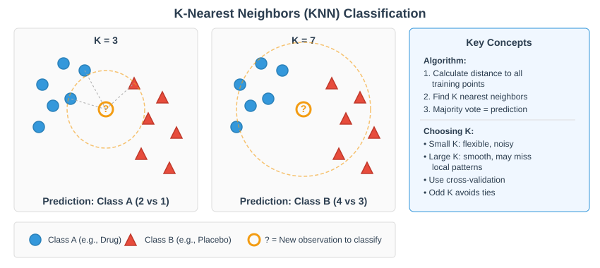

```{r}
#| label: setup-lec02
#| include: false
library(tidyverse); library(knitr); library(gridExtra)
theme_set(theme_minimal(base_size = 14)); set.seed(2026)
```

## Where this lecture fits

- Previous: [Lec 01 — Pre-processing](Lecture_01_Preprocessing.html)
- **You are here:** Lec 02 — *PCA, neighbour graph, graph-based clustering, t-SNE/UMAP on a single sample*
- Next: [Lec 03 — Markers & Manual Annotation](Lecture_03_Markers_Annotation.html)
- **Companion tutorial:** [Tutorial 02 — Dim Reduction & Clustering](../Exercise_Folder/Tutorial_02_DimReduction_Clustering.html)
- **Multi-sample integration** has its own lecture and tutorial — see [Lec 05 — Integration](Lecture_05_Integration.html).
- **Companion book chapter:** [Chapter 2 — Dimensionality Reduction & Clustering](../Resources_Folder/Chapter_02_DimReduction.html)

## Goals of this lecture

- See **why** PCA always comes before anything else "geometric"
- Read a scree plot and interpret PC loadings in scRNA-seq terms
- Build the SNN graph and pick a clustering resolution defensibly
- Understand what t-SNE and UMAP actually do — and what they *don't*
- Read a UMAP without over-interpreting it

::: callout-note
**Mental model.**

- Cells live in a \~20,000-D gene-expression space.

- PCA collapses that to 20–50 *signal* dimensions; the neighbour graph translates those distances into "who is similar to whom"

- Clustering carves the graph into groups

- UMAP makes a 2D picture of all of it.

- Every step compresses information — get any of them wrong and you can't see what's there.
:::

# Linear dimensionality reduction (PCA) {background-color="#2c3e50"}

## Dimensionality reduction — the intuition

{fig-align="center" width="95%"}

- Cells live in a very high-dimensional space (thousands of genes)
- Dimensionality reduction **projects** them into 2–50 dimensions while preserving the main structure
- Different projections emphasize different axes — the full signal isn't visible in any single 2D view

## Why PCA before everything else?

- The HVG-scaled matrix has \~2,000 genes × tens of thousands of cells. Most pairs of cells are nearly equidistant in that space — the **curse of dimensionality** at work.
- PCA does three jobs simultaneously:
  - **Compresses** the data: 2,000 genes → \~50 PCs that explain most of the structured variance
  - **Denoises** by discarding low-variance directions dominated by technical noise
  - **Decorrelates** the axes — PCs are orthogonal, so distances in PC space behave well for the neighbour-graph and clustering steps that follow
- Everything downstream — Harmony, FindNeighbors, clustering, UMAP — operates on the PC matrix, *not* the gene matrix

::: callout-warning
**Don't skip PCA and run UMAP on raw gene expression.** UMAP/t-SNE on tens of thousands of genes is slow, noisy, and produces visibly worse embeddings. PCA is doing real statistical work, not just bookkeeping.
:::

## PCA finds axes of maximum variance

{fig-align="center" width="92%"}

## PCA finds axes of maximum variance

- The PCs are **ordered latent variables**
  - PC1 = direction in gene space along which the data spread the most. 
  - PC2 = next-most variance, **orthogonal to PC1**. 
  - PC3 perpendicular to both, etc.
- Same algebraic object two ways: **eigendecomposition** of the covariance matrix, or **SVD** of the centered data matrix $\tilde X = U \Sigma V^T$
  - Right singular vectors $V$ → loadings (PC directions in gene space)
  - $U \Sigma$ → scores (each cell's coordinates in PC space)
  - $\sigma_i^2 / \sum \sigma_j^2$ → proportion of variance explained by PC $i$
- `RunPCA()`, `sc.tl.pca()`, and `prcomp()` 
  - all call SVD under the hood 
  - it scales better than eigendecomposition when the gene count exceeds the cell count

## In scRNA-seq what does each PC capture?

- **PC1–PC10** typically separate **major cell-type axes** (T vs B vs myeloid; epithelial vs stromal vs immune)
- **PC10–PC30** resolve **subtypes and states** (CD4 vs CD8, naïve vs memory, cycling vs resting)
- **PC30–PC50** capture finer biology + a growing share of noise — keep them only if your downstream clustering still benefits
- **Beyond PC50** is overwhelmingly noise

::: callout-tip
**A PC dominated by mitochondrial or ribosomal genes is a red flag.** 

- It usually means your QC let stressed cells through, or your HVG step picked up technical genes. 
- Inspect `VizDimLoadings()` for PC1 and PC2 *before* you trust the embedding.
:::

## Center, then scale — and why this matters

| Setting | Result | When to use |
|-----------------------|---------------------|----------------------------|
| `center = TRUE, scale = FALSE` | PCA on the **covariance** matrix | All variables on the same scale |
| `center = TRUE, scale = TRUE` | PCA on the **correlation** matrix | Variables on different scales (default for HVGs) |

- In Seurat, `ScaleData()` z-scores each gene **across cells** (mean 0, SD 1) before `RunPCA()`. In scanpy, `sc.pp.scale()` does the same.
- Without scaling, a few high-mean / high-variance genes (`MALAT1`, ribosomal proteins, some lncRNAs) dominate every PC simply because they have larger raw variance — not because they are biologically informative.
- This is why the canonical order **HVG → ScaleData → RunPCA** is fixed: HVGs select genes that carry biology, ScaleData puts them on equal footing, then PCA finds the structure.

::: callout-note
**Using SCTransform? You can skip the separate center/scale step.** Seurat's `SCTransform()` replaces the `NormalizeData → FindVariableFeatures → ScaleData` trio with a single variance-stabilizing transformation (regularized NB regression). Its Pearson residuals are already variance-stabilized and effectively centered, so you go straight from `SCTransform()` to `RunPCA()` — no separate `ScaleData()` / explicit center-and-scale is needed (Hafemeister & Satija 2019).
:::

## Reading the scree plot

```{r}
#| label: scree-example
#| echo: false
#| fig-width: 9
#| fig-height: 4.2

# Simulate a typical scRNA-seq scree shape: a steep drop, an elbow,
# then a long noise floor. Numbers chosen to mimic 10x v3 PBMC-style runs.
set.seed(2026)
sd_pc <- c(8.5, 6.0, 4.5, 3.7, 3.1, 2.7, 2.4, 2.2, 2.0, 1.85,
           1.72, 1.62, 1.55, 1.49, 1.44, 1.39, 1.35, 1.32, 1.29, 1.27,
           1.25, 1.23, 1.215, 1.20, 1.19, 1.18, 1.17, 1.165, 1.16, 1.155,
           rep(1.15, 20))
var_pc  <- sd_pc^2
prop_var <- var_pc / sum(var_pc)

par(mfrow = c(1, 2), mar = c(4.5, 4.5, 2.5, 1))
plot(seq_along(prop_var), prop_var * 100, type = "b", pch = 19, col = "#2c3e50",
     xlab = "Principal component", ylab = "% variance explained",
     main = "Scree plot — typical 10x scRNA-seq")
abline(v = 22, lty = 2, col = "red"); text(24, max(prop_var * 100) * 0.7,
                                            "Elbow ≈ PC22", col = "red", pos = 4, cex = 0.85)

plot(seq_along(prop_var), cumsum(prop_var) * 100, type = "b", pch = 19, col = "#2c3e50",
     xlab = "Principal component", ylab = "Cumulative % variance",
     main = "Cumulative variance", ylim = c(0, 100))
abline(h = 90, lty = 2, col = "red")
text(35, 92, "90% threshold", col = "red", cex = 0.85)
```

## Reading the scree plot

- The **elbow** is where each additional PC stops adding meaningful variance — usually between **PC15 and PC30** for 10x runs
- Cumulative variance is a sanity check, not a goal: a "90% rule" is misleading because the noise floor is high in scRNA-seq
- `ElbowPlot(seu, ndims = 50)` is the visual; `JackStraw()` is a permutation-based statistical alternative when you want a defensible cutoff

::: callout-tip
**When in doubt, lean high.** Going from 20 PCs to 30 PCs rarely hurts clustering and often recovers a subtype that 20 PCs collapses. Going from 30 to 50 mostly costs runtime.
:::

## Loadings — which genes drive each PC?

```{r}
#| label: loadings-example
#| echo: false
#| fig-width: 10
#| fig-height: 4.2

set.seed(2026)
# Simulate plausible loading values for top-10 genes on PC1 (T/B-cell-like axis)
# and PC2 (myeloid axis). Real Seurat output looks similar in shape.
pc1 <- tibble::tibble(
  gene = c("CD3D","CD3E","TRAC","IL32","CCL5","NKG7","CD79A","MS4A1","CD79B","HLA-DQB1"),
  loading = c(0.18,0.17,0.16,0.14,0.13,0.12,-0.21,-0.20,-0.18,-0.16)
)
pc2 <- tibble::tibble(
  gene = c("LYZ","S100A8","S100A9","FCN1","CST3","TYROBP","CD3D","CD3E","TRAC","NKG7"),
  loading = c(0.22,0.21,0.20,0.18,0.17,0.16,-0.15,-0.14,-0.13,-0.12)
)

p1 <- pc1 |>
  mutate(gene = forcats::fct_reorder(gene, loading)) |>
  ggplot(aes(loading, gene, fill = loading > 0)) +
  geom_col() +
  scale_fill_manual(values = c(`TRUE` = "#e74c3c", `FALSE` = "#3498db"), guide = "none") +
  labs(title = "Top loadings — PC1", x = "Loading", y = NULL) +
  theme_minimal(base_size = 12)

p2 <- pc2 |>
  mutate(gene = forcats::fct_reorder(gene, loading)) |>
  ggplot(aes(loading, gene, fill = loading > 0)) +
  geom_col() +
  scale_fill_manual(values = c(`TRUE` = "#e74c3c", `FALSE` = "#3498db"), guide = "none") +
  labs(title = "Top loadings — PC2", x = "Loading", y = NULL) +
  theme_minimal(base_size = 12)

gridExtra::grid.arrange(p1, p2, nrow = 1)
```

## Loadings — which genes drive each PC?

- **Loadings** are the weights that mix each gene into a PC. Big positive (or negative) loadings = genes moving cells along that axis.
- In the previous cartoon: 
  - PC1 separates T-cell markers (`CD3D`, `CD3E`, `TRAC`) from B-cell markers (`CD79A`, `MS4A1`); 
  - PC2 separates myeloid markers (`LYZ`, `S100A8`, `S100A9`) from lymphoid.
- Workflow tools: 
  - `VizDimLoadings(seu, dims = 1:4)` for bar plots, 
  - `DimHeatmap(seu, dims = 1:9, balanced = TRUE)` for a per-cell heatmap of the top loaders.
- This is the step where PCA earns its reputation as **interpretable**: t-SNE and UMAP cannot tell you *which genes* drive a separation — PCA can.

# Neighbour graph + graph-based clustering {background-color="#2c3e50"}

## SNN graph → clusters (Louvain / Leiden)

- Build a **shared nearest-neighbor (SNN)** graph from the integrated PCs — each cell connects to its $k$ nearest neighbours, weighted by how many of those neighbours are *shared*
- [**Cluster**](../Resources_Folder/Glossary.html#c) the graph at a chosen resolution — with Seurat's default **Louvain**, or the modern **Leiden** (preferred, but needs a Python dependency)
- The graph (not the gene matrix nor UMAP) is the object the clustering actually runs on


::: callout-note
**Louvain (default) vs. Leiden.** 

- Seurat's `FindClusters()` defaults to **Louvain** (`algorithm = 1`), and that is what the **workshop tutorials run** — for portability. 
- **Leiden** (`algorithm = 4`) is the modern preferred refinement (it guarantees well-connected communities) but needs the `leidenalg` Python package via `reticulate`. 
- Switching is the one-line `algorithm = 4` change once that dependency is installed.
:::

## KNN — the building block

{fig-align="center" width="92%"}

- Each cell's identity is set by the cells it is **closest to** in PC space
- The KNN graph is the substrate the SNN refinement and Leiden/Louvain modularity all run on top of

## Why graph-based clustering instead of K-means?

- K-means assumes clusters are **roughly spherical and equally sized** — a poor match for scRNA-seq, where rare cell types coexist with abundant ones and clusters have irregular shapes in PC space
- K-means also requires you to know **k** in advance; for scRNA-seq the whole point is often *discovering* how many populations there are
- **Graph-based methods** (Louvain, Leiden) discover clusters as densely-connected communities, naturally handle uneven cluster sizes, and let resolution control granularity instead of $k$

::: callout-note
This is the same reason single-cell pipelines have largely abandoned hierarchical clustering on raw expression: graph methods scale to millions of cells, run in minutes, and respect the local geometry that PCA preserved.
:::

## Graph-based clustering — step by step

{alt="Clustering — raster reference" fig-align="center" width="92%"}

- Start with the **KNN graph** over cells in PCA space
- **Find communities** → initial partition; **refine** merges/splits based on modularity
- **Aggregate** the network, refine again → **final partition** 

## Choosing a resolution

- A lower resolution means fewer clusters, higher means more
- No single "right" resolution exists — the question is *what cell types you want to resolve*
- Typical starting range: **0.4 – 1.2** for Louvain/Leiden on a 10–30k cell dataset
- Use **`clustree`** to visualize cluster stability across a sweep of resolutions
- Cross-check by inspecting markers of merged vs. split clusters


::: callout-tip
**Workflow.** Sweep resolutions, pick one where 

- (a) `clustree` shows stable splits, 
- (b) every cluster has at least a few defensible markers, 
- (c) you can name biology for each. If you can't name a cluster, it's probably noise or technical.
:::

::: callout-important
**Tutorial 02 runs deliberately *un-integrated*.** The ifnb dataset has two conditions (CTRL and STIM). Tutorial 02 runs PCA and clustering *without* integration — so your UMAP will show CTRL and STIM cells splitting into **mirror-image islands** rather than mixing by cell type. This is the expected, intentional outcome of Step 6 ("Diagnose the batch effect"). You will **count those islands and interpret what drives the split** before integration is introduced in Tutorial 05 / Lecture 05. On unintegrated data, resolution ≈ 0.5 typically yields **\~15–20 clusters** — more than the \~13 annotatable cell types — because each cell type appears as a CTRL island and a STIM island.
:::


## From PCs to a 2D picture for human consumption

- **PCA gave us a denoised \~30-D space; clustering already happened on the SNN graph in that space.** What's left is a *picture* — a 2D embedding so we can show clusters, gradients, and trajectories on a slide.
- Two non-linear methods dominate: 

  - **t-SNE** (van der Maaten & Hinton 2008) and 
  - **UMAP** (McInnes, Healy & Melville 2018)
- Both share the same philosophy:
  - *In high-D:* "for each cell, who are its neighbours, and how similar?"
  - *In low-D:* "place points in 2D so those neighbour relationships are preserved"
- Crucially, t-SNE/UMAP are **visualizations, not analyses**. They don't replace PCA or clustering — they sit on top of them.


## t-SNE: model neighbours as probabilities

{fig-align="center" width="92%"}

## t-SNE: model neighbours as probabilities

- For each cell $i$, t-SNE turns *distances* to all other cells into a **probability distribution** $p_{j|i}$ — Gaussian in high-D, with bandwidth $\sigma_i$ chosen per cell so the effective neighbourhood size matches the user's **perplexity**
- In the 2D embedding, the same idea gives $q_{j|i}$ from the current 2D positions
- t-SNE then **moves the 2D points** to minimize the Kullback–Leibler divergence

$$D_{KL}(P \| Q) = \sum_{i \neq j} p_{ij} \log \frac{p_{ij}}{q_{ij}}$$

- KL divergence is asymmetric — and that's the point

- **Heavily penalised:** $p_{ij}$ large but $q_{ij}$ small → "you put true neighbours far apart" → strong attractive gradient pulls them together
- **Weakly penalised:** $p_{ij}$ small but $q_{ij}$ large → "you put unrelated cells nearby" → near-zero contribution to the loss

::: callout-important
This asymmetry is *the* most important property of t-SNE. It is why t-SNE preserves **local neighbourhoods** beautifully — and why **distances between clusters in a t-SNE plot are not meaningful**. Two clusters drawn far apart could be biologically very similar, and vice versa.
:::

## UMAP

{fig-align="center" width="92%"}

## UMAP

- For each cell 
  - UMAP builds a **local weighted graph** out to its $k$ nearest neighbours, but normalises distances **per cell**
  - so points in sparse and dense regions of the data are still connected to *their own* local neighbours
- The local graphs are merged into one global **fuzzy weighted graph** ($w_{ij} = a + b - a \cdot b$)
- The 2D embedding starts from a spectral initialization (or random) and is optimised by stochastic gradient descent

## UMAP's cross-entropy preserves more global structure

{fig-align="center" width="92%"}

## UMAP's cross-entropy preserves more global structure

$$CE = -\sum_{i,j} \left[ w_{ij} \log v_{ij} + (1 - w_{ij}) \log(1 - v_{ij}) \right]$$

- **Attraction term** $w_{ij} \log v_{ij}$: connected cells should stay close
- **Repulsion term** $(1 - w_{ij}) \log(1 - v_{ij})$: unconnected cells should stay apart
- Unlike KL, both errors are penalised → cluster *positions* and approximate inter-cluster distances are more faithful than t-SNE's

::: callout-note
"More faithful" is not "fully faithful." UMAP still warps global geometry; you should not measure trajectory length or biological similarity from UMAP coordinates alone.
:::

## n_neighbors and min_dist, in practice

| Parameter | Seurat default | Effect |
|---------------|--------------:|------------------------------------------|
| `n.neighbors` | 30 | Soft "k" — local vs. global balance, like t-SNE's perplexity |
| `min.dist` | 0.3 | Minimum distance between points in the embedding |

(Seurat's `RunUMAP` defaults; the underlying Python `umap-learn` uses different defaults of 15 and 0.1, so don't be surprised if other tutorials quote those.)

- **Small `n_neighbors` (5–10):** very local detail; clusters fragment more. **Large (30–50):** broader topology; subtypes may merge.
- **Small `min_dist` (≤ 0.1):** tight clusters with clear gaps — good for discrete cell types. **Large (0.4–0.8):** spread-out — good for continuous gradients (development, pseudotime).
- UMAP is **noticeably more stable** across `n_neighbors` than t-SNE is across perplexity — usually one well-chosen UMAP is enough; with t-SNE you really do want to sweep.

## Reading a UMAP responsibly

- What a UMAP **is** good for: 
  - showing the cluster solution
  - mapping a known marker onto the cells (`FeaturePlot`)
  - spotting batch effects (color by sample after integration)
- What a UMAP is **not** good for
  - differential testing
  - distance-based statistics
  - conclusions about lineage relationships

::: callout-warning
**Three things a UMAP plot does NOT tell you:**

1.  **Inter-cluster distance** — two clusters drawn far apart are not necessarily more dissimilar than two drawn close
2.  **Cluster density** — apparent point density is heavily affected by `min_dist` and is not biological cell density
3.  **Trajectory direction** — apparent gradients can be optimisation artefacts; use trajectory tools (Slingshot, Monocle, scVelo) for that question
:::


::: callout-tip
**Build the intuition yourself.** Google PAIR's interactive [Understanding UMAP](https://pair-code.github.io/understanding-umap/) lets you turn `n_neighbors`/`min_dist` and watch what the embedding does (and doesn't) preserve; DataCamp's [Understanding UMAP guide](https://www.datacamp.com/tutorial/understanding-umap-guide-to-dimensionality-reduction) is a written walkthrough. Highly recommended if these plots ever made your head spin.
:::

# Recap {background-color="#2c3e50"}

## What to remember from Lecture 02

::: incremental
- **PCA** on HVGs is the substrate every downstream step builds on — read the scree, read the loadings before you trust the embedding
- Build the **SNN graph** on the PCs, then cluster with **Louvain/Leiden** — graph-based methods beat K-means for scRNA-seq
- **t-SNE** preserves local neighbourhoods via KL divergence + the t-distribution; cluster *distances* in t-SNE are not meaningful
- **UMAP** preserves more global topology via cross-entropy on a fuzzy graph; today it's the default
- Both are **visualizations, not analyses** — they sit on top of PCA + clustering, never replace them
:::

