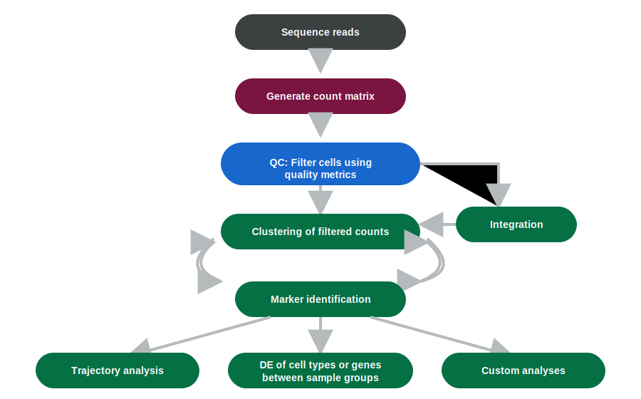
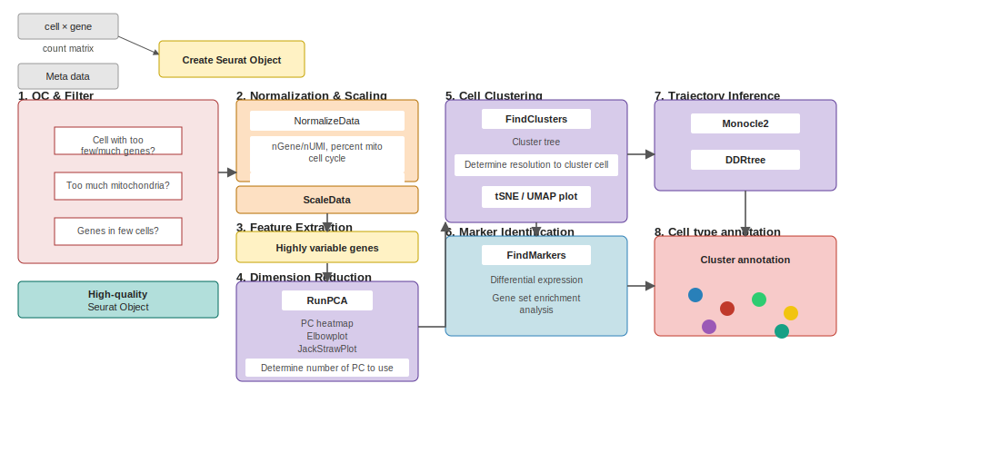
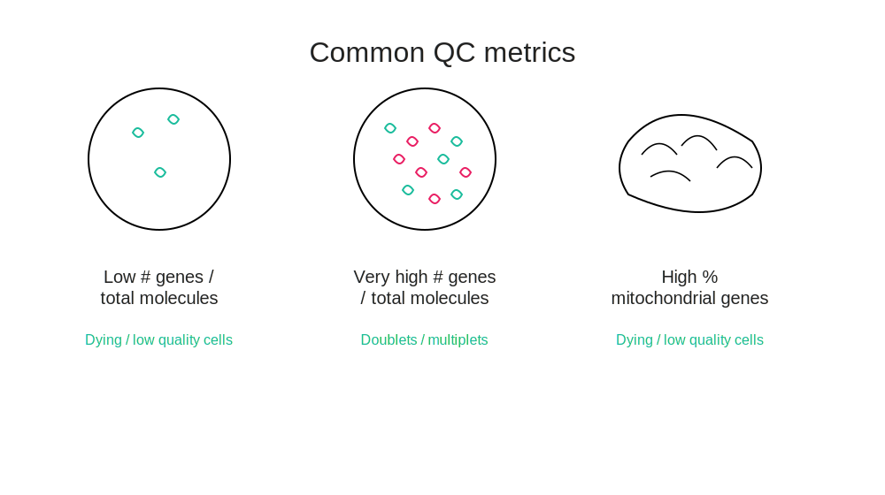
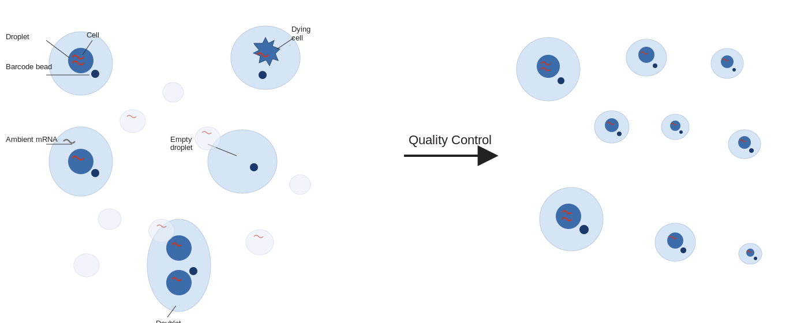
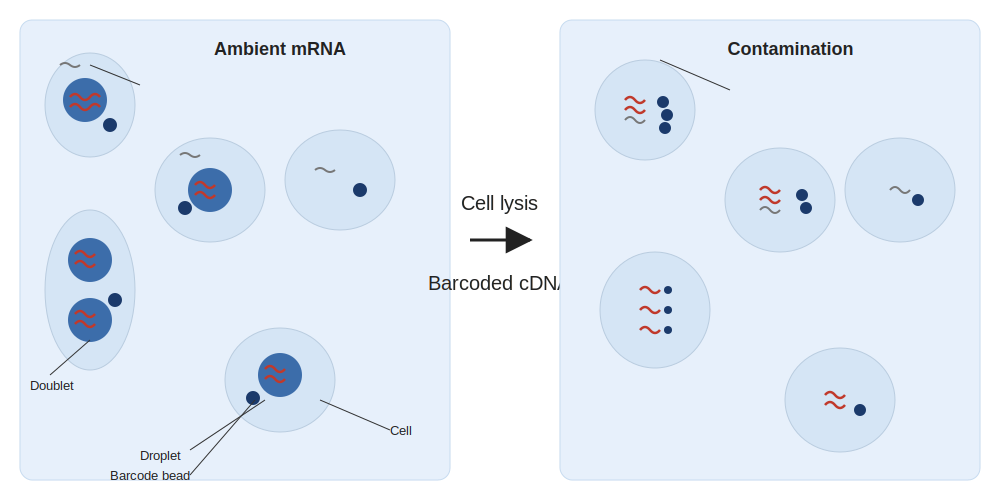
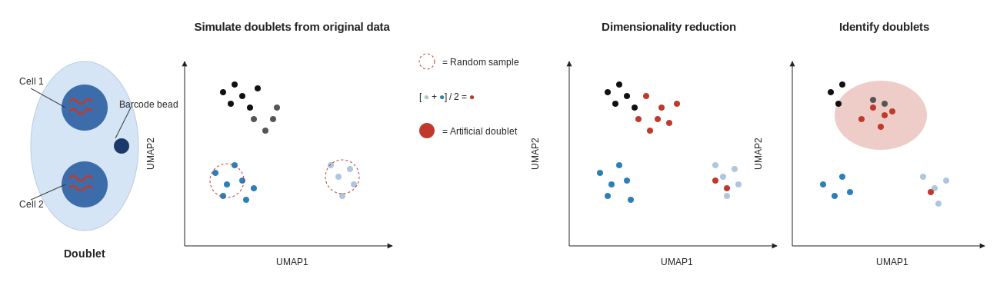

```{r}
#| label: setup
#| include: false

library(tidyverse)
library(knitr)
theme_set(theme_minimal(base_size = 14))
set.seed(2026)
```

# Lecture 02: Pre-processing {background-color="#2c3e50"}

## Where this lecture fits

-   Previous: [Lec 01 — Bulk vs. scRNA-seq + how data are generated](Lecture_01_Bulk_vs_scRNAseq.html)
-   **You are here:** Lec 02 — *turning a raw count matrix into a clean, normalized object*
-   Next: [Lec 03 — Dim reduction, integration, clustering](Lecture_03_DimRed_Integration_Clustering.html)
-   **Companion tutorial:** [Tutorial 01 — QC & Preprocessing](../Exercise_Folder/Tutorial_01_QC_Preprocessing.html)

## Goals of this lecture

::: incremental
-   See where pre-processing sits in the canonical pipeline
-   Learn the three core QC metrics and what they catch
-   Recognize ambient-RNA contamination and droplet doublets — and how to handle each
-   Pick a normalization + feature-selection strategy that fits your data
:::

# The full picture (so you can see where we are) {background-color="#2c3e50"}

## scRNA-seq pipeline at a glance

{fig-align="center" width="98%"}

## Workflow with integration — alternate view

{fig-align="center" width="85%"}

-   QC sits on the main path; **integration** is a parallel branch that feeds back into clustering
-   Clustering ↔ marker identification is iterative (resolution tuning, subclustering)
-   Three downstream lanes: **trajectory**, **DE between sample groups**, **custom analyses**

## The Seurat workflow in eight steps

{fig-align="center" width="97%"}

## The eight steps — expanded block diagram

{fig-align="center" width="98%"}

-   This lecture covers steps **1–4**: QC, normalization, scaling, feature extraction
-   Steps 5–8 come in Lec 03–05

# Step 1 — Per-cell QC {background-color="#2c3e50"}

## Three core metrics

{fig-align="center" width="85%"}

-   `nFeature_RNA`: genes detected per cell
-   `nCount_RNA`: total UMI counts per cell
-   `percent.mt`: % reads mapping to mitochondrial genes (stress/dying cells)

## Common QC metrics — what they catch

{fig-align="center" width="85%"}

-   **Low** gene / molecule counts → dying or poorly captured cells
-   **Very high** gene counts for the tissue → likely **[doublets / multiplets](../Resources_Folder/Glossary.html#d)**
-   **High mitochondrial %** → cells that were dying when loaded

## What QC actually removes — the cell view

{fig-align="center" width="95%"}

-   Before QC: empty droplets, dying cells, doublets, ambient-RNA contamination, true cells — all mixed
-   After QC: a clean set of cell-containing droplets with real transcriptomes

## QC in practice

::: panel-tabset
### Seurat

``` r
seu[["percent.mt"]] <- PercentageFeatureSet(seu, pattern = "^MT-")
VlnPlot(seu, features = c("nFeature_RNA", "nCount_RNA", "percent.mt"), ncol = 3)
seu <- subset(seu, nFeature_RNA > 200 & nFeature_RNA < 6000 & percent.mt < 15)
```

### scanpy

``` python
adata.var["mt"] = adata.var_names.str.startswith("MT-")
sc.pp.calculate_qc_metrics(adata, qc_vars=["mt"], inplace=True, percent_top=None)
adata = adata[(adata.obs.n_genes_by_counts > 200) &
              (adata.obs.n_genes_by_counts < 6000) &
              (adata.obs.pct_counts_mt < 15)].copy()
```
:::

::: callout-warning
Thresholds are dataset-specific. Always look at the distributions first.
:::

## Droplets can also be empty — or contaminated

{fig-align="center" width="92%"}

-   Many barcodes correspond to **empty droplets** with only ambient RNA — filter with `EmptyDrops` or the Cell Ranger knee-point
-   Even real cells are contaminated by **ambient RNA soup**; estimate and subtract with `SoupX`, `DecontX`, or `CellBender`

## Ambient mRNA — before and after lysis

{fig-align="center" width="95%"}

-   Before lysis: each droplet contains (ideally) one cell + one barcoded bead, plus trace **ambient mRNA**
-   After lysis: the bead captures its cell's mRNA *and* any ambient mRNA floating in the droplet → **cross-cell contamination** in the final counts

# Step 2 — Doublet detection {background-color="#2c3e50"}

## Doublets in one slide

-   Droplets sometimes capture **two cells** → artificial "hybrid" profiles
-   Run doublet detection on each sample **before** integration

{fig-align="center" width="95%"}

| Tool            | Ecosystem | Notes                          |
|-----------------|-----------|--------------------------------|
| `scDblFinder`   | R / Bioc  | Fast, recommended default      |
| `DoubletFinder` | R         | Widely cited, parameter tuning |
| `Scrublet`      | Python    | Classic choice in scanpy flows |

## Doublet detection — how it actually works

{fig-align="center" width="98%"}

-   **Simulate** artificial doublets by averaging random pairs of real cells
-   Project real + simulated cells together in **reduced dimensions**
-   Real cells that sit close to many simulated doublets are **flagged** as likely doublets

# Step 3 — Normalization {background-color="#2c3e50"}

## Why normalize?

-   **Goal:** put cells on a comparable scale before downstream math
-   Two dominant approaches:
    -   **Log-normalization** (`NormalizeData` / `sc.pp.normalize_total` + `log1p`): fast, simple
    -   **Variance-stabilizing** (`SCTransform` in Seurat, `scran::sctransform`): models mean–variance, often better for low-count cells

## Normalization in practice

``` r
# Seurat
seu <- NormalizeData(seu) |>
  FindVariableFeatures(nfeatures = 2000) |>
  ScaleData()

# Alternative
seu <- SCTransform(seu, verbose = FALSE)
```

``` python
# scanpy
sc.pp.normalize_total(adata, target_sum=1e4)
sc.pp.log1p(adata)
sc.pp.highly_variable_genes(adata, n_top_genes=2000)
```

# Step 4 — Feature selection (HVGs) {background-color="#2c3e50"}

## Why HVGs?

-   Use the \~1,000–3,000 most variable genes for downstream geometry
-   Dramatically reduces noise from ubiquitously-expressed housekeeping genes
-   Seurat: `FindVariableFeatures()`; scanpy: `sc.pp.highly_variable_genes()`

::: callout-tip
HVGs feed PCA in the **next lecture**. Done well, downstream clustering is more robust; done poorly (e.g. picking too few), you lose biology.
:::

# Recap & what's next {background-color="#2c3e50"}

## What to remember from Lecture 02

::: incremental
-   QC = filtering bad **cells** *and* bad **droplets** — both matter
-   Ambient RNA is real and can be subtracted (`SoupX`, `DecontX`, `CellBender`)
-   Doublets are detected by simulation; do it per-sample before integration
-   Normalization choice is less important than *consistency* between training and downstream steps
-   HVGs give you the gene-space PCA will operate on
:::

## Coming up next

-   **Lec 03** — [Dim reduction, integration, clustering](Lecture_03_DimRed_Integration_Clustering.html)
-   **Hands-on:** [Tutorial 01 — QC & Preprocessing](../Exercise_Folder/Tutorial_01_QC_Preprocessing.html)
