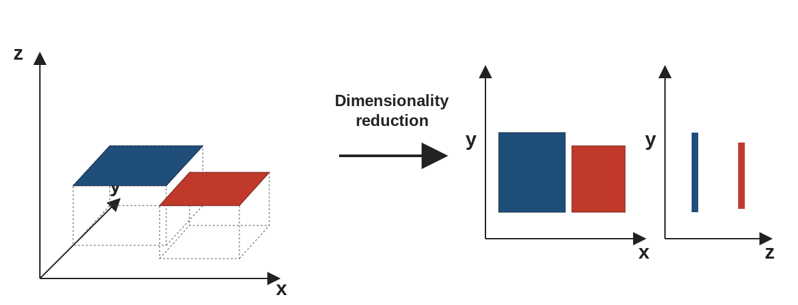
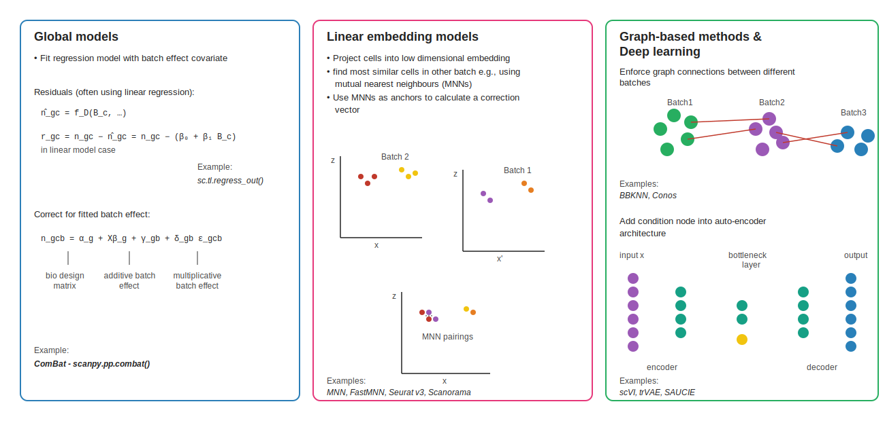
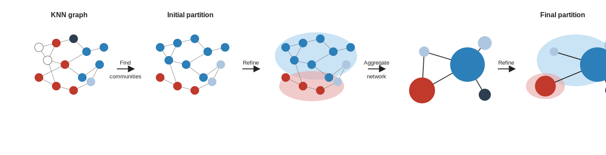

```{r}
#| label: setup
#| include: false
library(tidyverse); library(knitr)
theme_set(theme_minimal(base_size = 14)); set.seed(2026)
```

# Lecture 03: Dim Reduction, Integration & Clustering {background-color="#2c3e50"}

## Where this lecture fits

-   Previous: [Lec 02 — Pre-processing](Lecture_02_Preprocessing.html)
-   **You are here:** Lec 03 — *PCA, batch correction, neighbour graph, Leiden, UMAP*
-   Next: [Lec 04 — Annotation](Lecture_04_Annotation.html)
-   **Companion tutorial:** [Tutorial 02 — Dim Reduction & Clustering](../Exercise_Folder/Tutorial_02_DimReduction_Clustering.html)

## Goals of this lecture

::: incremental
-   See why we always do PCA before anything else "geometric"
-   Choose between integration tools by how heterogeneous your data are
-   Build the SNN graph and pick a clustering resolution defensibly
-   Read a UMAP without over-interpreting it
:::

# Step 5 — Linear dimensionality reduction (PCA) {background-color="#2c3e50"}

## PCA in one slide

-   **[PCA](../Resources_Folder/Glossary.html#p)** on scaled HVG expression gives a **low-dimensional, denoised representation**
-   Typical: first 20–50 PCs used for all downstream neighbor-graph steps
-   Choose the number of PCs with an `ElbowPlot()` or `JackStraw()` / variance explained curve

``` r
seu <- RunPCA(seu, npcs = 50)
ElbowPlot(seu, ndims = 50)
```

## Dimensionality reduction — the intuition

{fig-align="center" width="95%"}

-   Cells live in a very high-dimensional space (thousands of genes)
-   Dimensionality reduction **projects** them into 2–50 dimensions while preserving the main structure
-   Different projections emphasize different axes — the full signal isn't visible in any single 2D view

# Step 6 — Integration / batch correction {background-color="#2c3e50"}

## When to integrate

{fig-align="center" width="88%"}

-   Multiple samples / batches / donors → the same cell type can split into per-sample clusters
-   Integration aligns shared cell types while preserving real biological differences

## Integration tools

| Tool                  | Ecosystem | Approach                              |
|-----------------------|-----------|---------------------------------------|
| **Harmony**           | R / Py    | Iterative soft-clustering in PC space |
| **Seurat CCA / RPCA** | R         | Anchor-based cross-sample matching    |
| **scVI / scANVI**     | Python    | Variational autoencoder               |
| **BBKNN**             | Python    | Batch-balanced k-NN graph             |
| **MNN / fastMNN**     | R / Py    | Mutual nearest neighbors              |

::: callout-tip
**Rule of thumb:** try a simple method (Harmony) first; move to scVI/scANVI for very large or heterogeneous atlases.
:::

## Integration strategies — visual guide

{fig-align="center" width="98%"}

-   **Global models** (e.g. ComBat, `sc.tl.regress_out`) fit a regression with batch as a covariate
-   **Linear embedding / MNN** (MNN, FastMNN, Seurat v3, Scanorama) find mutual nearest neighbours across batches and correct
-   **Graph-based / deep learning** (BBKNN, Conos, scVI, trVAE, SAUCIE) enforce cross-batch connectivity, or add batch as a node in an autoencoder

# Step 7 — Neighborhood graph, clustering, embedding {background-color="#2c3e50"}

## SNN graph → Leiden → UMAP

-   Build a **shared nearest-neighbor (SNN)** graph from the integrated PCs
-   **[Cluster](../Resources_Folder/Glossary.html#c)** with **Louvain** or (preferred today) **Leiden** at a chosen resolution
-   **[Embed](../Resources_Folder/Glossary.html#e)** for visualization with **UMAP** or **t-SNE**

``` r
seu <- FindNeighbors(seu, dims = 1:30) |>
  FindClusters(resolution = 0.5, algorithm = 4) |> # 4 = Leiden
  RunUMAP(dims = 1:30)
DimPlot(seu, reduction = "umap", label = TRUE)
```

``` python
sc.pp.neighbors(adata, n_pcs=30)
sc.tl.leiden(adata, resolution=0.5)
sc.tl.umap(adata)
sc.pl.umap(adata, color="leiden", legend_loc="on data")
```

::: callout-warning
UMAP distances between clusters are **not quantitative**. Use for visualization, not inference.
:::

## Leiden clustering — step by step

{fig-align="center" width="98%"}

-   Start with the **KNN graph** over cells in PCA space
-   **Find communities** → initial partition; **refine** merges/splits based on modularity
-   **Aggregate** the network, refine again → **final partition** (better-connected communities than Louvain)

## Choosing a resolution

::: incremental
-   No single "right" resolution exists — the question is *what cell types you want to resolve*
-   Use **`clustree`** to visualize cluster stability across a range of resolutions
-   Cross-check by inspecting markers of merged vs. split clusters
:::

# Recap & what's next {background-color="#2c3e50"}

## What to remember from Lecture 03

::: incremental
-   PCA on HVGs is the substrate every downstream step builds on
-   Integration is *always* an editorial choice — pick the simplest method that works
-   Cluster on the **integrated** PCs, never the raw ones
-   UMAP is for *looking*, not for *measuring*
:::

## Coming up next

-   **Lec 04** — [Annotation](Lecture_04_Annotation.html)
-   **Hands-on:** [Tutorial 02 — Dim Reduction & Clustering](../Exercise_Folder/Tutorial_02_DimReduction_Clustering.html)
