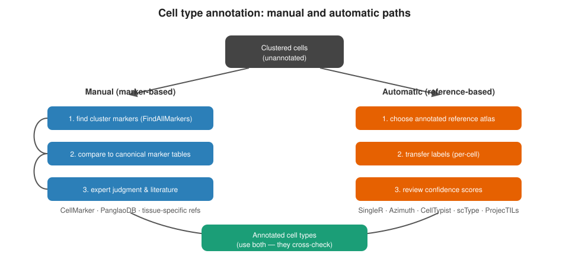

```{r}
#| label: setup
#| include: false
library(tidyverse); library(knitr)
theme_set(theme_minimal(base_size = 14)); set.seed(2026)
```

# Lecture 03: Markers & Manual Annotation {background-color="#2c3e50"}

## Where this lecture fits

-   Previous: [Lec 02 — Dim reduction, integration, clustering](Lecture_02_DimRed_Integration_Clustering.html)
-   **You are here:** Lec 03 — *finding markers and turning clusters into named cell types by hand*
-   Next: [Lec 04 — Pseudobulk DE & DESeq2](Lecture_04_Pseudobulk_DE.html)
-   Reference-based annotation (SingleR / Azimuth) lives in [Lec 07](Lecture_07_Reference_Annotation.html)
-   **Companion tutorial:** [Tutorial 03 — Markers & Manual Annotation](../Exercise_Folder/Tutorial_03_Markers_Annotation.html)
-   **Parallel reading:** [scNotebooks Module 04](https://integrativebioinformatics.github.io/scNotebooks/modules/en/module04/module04.html) covers manual + automated annotation in one notebook

## Goals of this lecture

::: incremental
-   Distinguish **clusters** (a graph property) from **cell types** (a biological label)
-   Find robust cluster markers with `FindAllMarkers` / `FindConservedMarkers`
-   Read DotPlots / FeaturePlots like a clinician
-   Assign labels you can defend with literature
:::

::: callout-note
**Why this matters.** A cluster is a partition of a graph. A *cell type* is a biological claim. Going from one to the other is the most subjective step in the entire workflow — and the one reviewers will scrutinize most.
:::

# Clusters are not cell types {background-color="#2c3e50"}

## The annotation workflow

{fig-align="center" width="92%"}

-   **Manual** (this lecture) — interpretable but biased by the annotator
-   **Automatic** (Lec 05) — fast and reproducible but biased by the reference
-   Best practice: run both, reconcile disagreements, document choices

# Finding markers {background-color="#2c3e50"}

## `FindAllMarkers` — every cluster vs. all others

``` r
markers <- FindAllMarkers(seu,
                          only.pos        = TRUE,
                          min.pct         = 0.25,
                          logfc.threshold = 0.25)

markers |>
  group_by(cluster) |>
  slice_max(avg_log2FC, n = 10)
```

-   `only.pos = TRUE` keeps just the up-regulated markers (what you'd actually use to *name* a cluster)
-   `min.pct = 0.25` requires the gene be detected in at least 25% of cells in either group
-   Default test is the Wilcoxon rank-sum

::: callout-tip
**Defaults that work for most 10x datasets.** `min.pct = 0.25`, `logfc.threshold = 0.25`. Loosen them for very small clusters, tighten them only if results are overwhelming.
:::

## `FindConservedMarkers` — markers that hold across conditions

When your dataset has multiple conditions (e.g. stimulated vs. control PBMCs in Patel's `ifnb` example), you usually want markers that define a cluster **regardless of condition**:

``` r
DefaultAssay(seu) <- "RNA"
cluster3_markers <- FindConservedMarkers(seu,
                                         ident.1       = 3,
                                         grouping.var  = "stim")
head(cluster3_markers)
```

This runs the marker test **inside each condition** and reports genes that come up in both — protecting you from labelling a cluster by a treatment-induced gene rather than its lineage marker.

::: callout-warning
**Don't skip this step in case-control designs.** Naïve `FindAllMarkers` on a stim-vs-ctrl dataset will surface treatment-response genes as "cluster markers", and you'll mis-label populations.
:::

# Reading marker plots well {background-color="#2c3e50"}

## What a "good" marker looks like

::: incremental
-   **Specific** — high in the cluster, low elsewhere (DotPlot's dot *intensity*)
-   **Pervasive** — expressed in most cells of the cluster (DotPlot's dot *size*)
-   **Backed by literature** — appears in canonical lineage panels for the tissue
:::

## The five marker visualizations — what each one shows

Tutorial 03 walks through five canonical plots. They overlap, and each one is best for a different question:

| Plot | What it shows | When to use it |
|----|----|----|
| `VlnPlot` | distribution per cluster, one gene at a time | Bimodality, outliers, comparing 4–8 candidate markers |
| `FeaturePlot` | one gene, every cell, on the UMAP | Spatial structure on the embedding |
| `DoHeatmap` | top-N markers across clusters, cell-by-cell | Eyeballing the global cluster ↔ marker structure |
| `RidgePlot` | density per cluster | Gradient / continuum genes |
| `DotPlot` | mean expr × % positive, per (cluster × gene) | Compact panel display — best for the publication figure |

## VlnPlot — one gene per cluster, distribution-aware

```{r}
#| label: vlnplot-cartoon
#| echo: false
#| fig-width: 10
#| fig-height: 4

set.seed(2026)
clusters <- c("CD14 Mono","CD16 Mono","B","CD4 Naive T","CD4 Memory T","CD8 T","NK","DC")
make_vln <- function(gene, mean_per_cluster) {
  map_dfr(seq_along(clusters), function(i) {
    tibble(cluster = clusters[i],
           gene    = gene,
           expr    = pmax(rnorm(120, mean_per_cluster[i], 0.4), 0))
  })
}

dat <- bind_rows(
  make_vln("CD14",  c(3.5, 1.0, 0.1, 0.1, 0.1, 0.1, 0.1, 0.5)),
  make_vln("MS4A1", c(0.1, 0.1, 3.5, 0.1, 0.1, 0.1, 0.1, 0.1)),
  make_vln("CD8A",  c(0.1, 0.1, 0.1, 0.2, 0.5, 3.5, 0.4, 0.1)),
  make_vln("GNLY",  c(0.1, 0.2, 0.1, 0.1, 0.1, 0.5, 4.0, 0.1))
)
dat$cluster <- factor(dat$cluster, levels = clusters)
dat$gene    <- factor(dat$gene,    levels = c("CD14","MS4A1","CD8A","GNLY"))

ggplot(dat, aes(cluster, expr, fill = cluster)) +
  geom_violin(scale = "width", trim = TRUE) +
  facet_wrap(~ gene, ncol = 4, scales = "free_y") +
  labs(title    = "VlnPlot — four canonical PBMC markers",
       subtitle = "Each gene lights up a single cluster (CD14, B, CD8 T, NK)",
       x = NULL, y = "Log-normalized expression") +
  theme_minimal(base_size = 11) +
  theme(axis.text.x = element_text(angle = 45, hjust = 1),
        legend.position = "none")
```

A "good marker" violin: **one cluster bulges, the rest sit at zero**. If two clusters bulge similarly, the marker is shared by two cell types — keep looking for a discriminator.

## FeaturePlot — single gene on UMAP

```{r}
#| label: featureplot-cartoon
#| echo: false
#| fig-width: 11
#| fig-height: 4

set.seed(2026)
n_cells <- 1500
celltypes <- factor(sample(clusters, n_cells, replace = TRUE,
                           prob = c(0.18, 0.06, 0.13, 0.18, 0.16, 0.13, 0.12, 0.04)),
                    levels = clusters)
cell_centers <- tibble(
  cluster = clusters,
  cx = c(-3.5,  -1.0,  3.0,  1.0,  2.5, -1.5,   2.0, -3.0),
  cy = c( 1.5,   3.0, -1.5,  3.5,  1.5,  -1.0, -3.0,  2.5)
)
cell_pos <- left_join(tibble(cluster = celltypes), cell_centers, by = "cluster") |>
  mutate(umap1 = cx + rnorm(n(), 0, 0.6),
         umap2 = cy + rnorm(n(), 0, 0.5))

# Simulate four markers with cluster-specific expression
gene_expr <- function(targets, base_low = 0.1, base_high = 4) {
  ifelse(cell_pos$cluster %in% targets,
         pmax(rnorm(n_cells, base_high, 0.6), 0),
         pmax(rnorm(n_cells, base_low, 0.3), 0))
}
cell_pos$CD14  <- gene_expr(c("CD14 Mono"))
cell_pos$MS4A1 <- gene_expr(c("B"))
cell_pos$CD8A  <- gene_expr(c("CD8 T"))
cell_pos$GNLY  <- gene_expr(c("NK"))

dat <- cell_pos |> pivot_longer(cols = c(CD14, MS4A1, CD8A, GNLY), names_to = "gene", values_to = "expr")
dat$gene <- factor(dat$gene, levels = c("CD14","MS4A1","CD8A","GNLY"))

ggplot(dat, aes(umap1, umap2, color = expr)) +
  geom_point(size = 0.6, alpha = 0.85) +
  scale_color_gradient(low = "lightgrey", high = "#c0392b", name = "expr") +
  facet_wrap(~ gene, ncol = 4) +
  labs(title = "FeaturePlot — same four markers on the UMAP",
       subtitle = "Each gene lights up the matching anatomical region of the embedding",
       x = "UMAP1", y = "UMAP2") +
  theme_minimal(base_size = 11) +
  theme(axis.text = element_blank(), strip.text = element_text(face = "bold"))
```

`FeaturePlot` is the "geographic" view of a marker — does it have a single home on the UMAP, or is it scattered? Scattered = bad marker (or technical artifact).

## DotPlot — the workhorse panel figure

```{r}
#| label: dotplot-cartoon
#| echo: false
#| fig-width: 11
#| fig-height: 4

set.seed(2026)

# Build the canonical PBMC marker panel × cluster mean+pct grid
panel <- tibble(
  cluster = factor(clusters, levels = clusters),
  CD14    = c( 3.5, 1.0, 0.1, 0.1, 0.1, 0.1, 0.1, 0.5),
  LYZ     = c( 3.0, 1.2, 0.1, 0.1, 0.1, 0.1, 0.1, 0.5),
  FCGR3A  = c( 0.4, 3.5, 0.1, 0.1, 0.1, 0.1, 0.6, 0.3),
  MS4A1   = c( 0.0, 0.0, 3.5, 0.1, 0.0, 0.0, 0.0, 0.1),
  CD79A   = c( 0.0, 0.0, 3.6, 0.0, 0.0, 0.0, 0.0, 0.0),
  IL7R    = c( 0.1, 0.1, 0.0, 3.0, 2.4, 1.5, 0.4, 0.0),
  CCR7    = c( 0.1, 0.1, 0.1, 2.5, 0.6, 0.4, 0.1, 0.0),
  S100A4  = c( 0.7, 1.4, 0.1, 0.6, 2.6, 1.8, 0.7, 0.5),
  CD8A    = c( 0.0, 0.1, 0.0, 0.4, 0.6, 3.5, 0.5, 0.0),
  GZMK    = c( 0.0, 0.0, 0.0, 0.0, 0.4, 2.0, 1.0, 0.0),
  GNLY    = c( 0.1, 0.4, 0.0, 0.0, 0.1, 0.4, 4.0, 0.0),
  NKG7    = c( 0.1, 0.4, 0.0, 0.0, 0.2, 1.0, 4.0, 0.0),
  FCER1A  = c( 0.0, 0.0, 0.1, 0.1, 0.1, 0.0, 0.0, 3.5),
  CST3    = c( 1.5, 1.8, 0.1, 0.1, 0.1, 0.1, 0.1, 3.0)
)

dat <- panel |>
  pivot_longer(-cluster, names_to = "gene", values_to = "mean_expr") |>
  mutate(pct_expr = pmin(pmax(mean_expr / 4 * 100 + rnorm(n(), 0, 5), 0), 100))
dat$gene <- factor(dat$gene, levels = colnames(panel)[-1])

ggplot(dat, aes(gene, fct_rev(cluster), size = pct_expr, color = mean_expr)) +
  geom_point() +
  scale_color_gradient2(low = "#3498db", mid = "white", high = "#c0392b",
                        midpoint = 1.5, name = "Mean expr") +
  scale_size_continuous(range = c(0.5, 7), name = "% expr") +
  labs(title = "DotPlot — canonical PBMC marker panel × clusters",
       x = NULL, y = NULL) +
  theme_minimal(base_size = 11) +
  theme(axis.text.x = element_text(angle = 45, hjust = 1))
```

The single best plot for a publication figure: panel of canonical markers along x, clusters along y, dot **size** = % cells expressing, dot **color** = mean expression. Eight clusters fit on one row; you can scale to 30+ clusters easily.

## Heatmap — global cluster ↔ marker structure

```{r}
#| label: heatmap-cartoon
#| echo: false
#| fig-width: 10
#| fig-height: 4

set.seed(2026)

# Build a top-3-markers-per-cluster expression block
top3 <- tibble(
  cluster = factor(rep(clusters, each = 3), levels = clusters),
  gene    = c("CD14","LYZ","S100A8","FCGR3A","MS4A7","CDKN1C",
              "MS4A1","CD79A","CD79B","IL7R","CCR7","LEF1",
              "S100A4","IL32","NOSIP","CD8A","GZMK","CD8B",
              "GNLY","NKG7","KLRD1","FCER1A","CST3","CLEC10A")
)

# Each cluster has \~120 cells; build a cluster-by-cluster expression block
nc <- 80
cells <- tibble(
  cluster = factor(rep(clusters, each = nc), levels = clusters),
  cell_id = paste0(rep(clusters, each = nc), "_", rep(1:nc, length(clusters)))
)

dat <- expand_grid(top3, cells) |>
  rowwise() |>
  mutate(expr = ifelse(cluster.x == cluster.y,
                        pmax(rnorm(1, 2.4, 0.4), 0),
                        pmax(rnorm(1, 0.0, 0.4), 0))) |>
  ungroup()
dat$gene <- factor(dat$gene, levels = top3$gene)

ggplot(dat, aes(cell_id, gene, fill = expr)) +
  geom_tile() +
  scale_fill_gradient2(low = "#3498db", mid = "black", high = "#f1c40f",
                       midpoint = 1, name = "expr") +
  labs(title = "DoHeatmap — top-3 markers per cluster, every cell as a column",
       x = NULL, y = NULL) +
  theme_minimal(base_size = 11) +
  theme(axis.text.x = element_blank(), axis.ticks.x = element_blank(),
        panel.grid = element_blank())
```

Each cluster's diagonal block "lights up" — its top markers are high in its cells and low elsewhere. A heatmap that doesn't show this pattern means the markers aren't actually specific to their assigned cluster.

::: callout-tip
**One trap.** Heatmaps show *cells*, not *clusters* — a dominant cluster (40% of cells) visually monopolizes the plot. For balanced display, prefer the DotPlot.
:::

## Picking a plot

::: incremental
-   **Confirming one candidate marker for one cluster** → `VlnPlot` (4 candidates side-by-side)
-   **Showing where one gene "lives" on the UMAP** → `FeaturePlot`
-   **Reviewer wants every cluster on one figure** → `DotPlot`
-   **Showing the overall cluster ↔ marker block structure** → `DoHeatmap`
-   **Comparing graded / continuum expression** → `RidgePlot`
:::

::: callout-warning
Genes that are merely *enriched* on a Wilcoxon test are not always **markers** in the canonical sense. Cross-check at least two genes per cluster, and prefer ones that appear in published lineage panels (CellMarker 2.0, PanglaoDB).
:::

# Assigning labels {background-color="#2c3e50"}

## The decision loop

1.  Look at top 10 markers per cluster (`slice_max`)
2.  Cross-reference against **CellMarker 2.0**, **PanglaoDB**, or a tissue-specific atlas
3.  Confirm with `FeaturePlot` / `DotPlot` of the canonical 2–3 markers
4.  Assign — and **write down why** in your notebook

``` r
new_ids <- c("0" = "CD4 T", "1" = "CD14 Mono", "2" = "B",
             "3" = "CD8 T", "4" = "NK",  "5" = "DC")
seu <- RenameIdents(seu, new_ids)
seu$celltype <- Idents(seu)
```

::: callout-tip
**Reference panels worth bookmarking:**
-   [CellMarker 2.0](http://117.50.127.228/CellMarker/) — curated, searchable by tissue/disease
-   [PanglaoDB](https://panglaodb.se/) — large, scRNA-derived
-   [The Human Protein Atlas — Cell types](https://www.proteinatlas.org/humanproteome/celltype) — expression-supported markers
:::

# Recap & what's next {background-color="#2c3e50"}

## What to remember from Lecture 03

::: incremental
-   Clusters ≠ cell types. The biology is in the labels you give the clusters.
-   `FindAllMarkers` finds *enriched* genes; `FindConservedMarkers` finds *condition-robust* ones — use the latter in case-control designs.
-   Document why you assigned each label — future-you (and reviewers) will thank you
-   Manual + automatic (Lec 05) annotation are *complementary*, not redundant
:::

## Coming up next

-   **Lec 04** — [Pseudobulk DE & DESeq2](Lecture_04_Pseudobulk_DE.html): the right way to do condition-level DE
-   **Hands-on:** [Tutorial 03 — Markers & Manual Annotation](../Exercise_Folder/Tutorial_03_Markers_Annotation.html)
