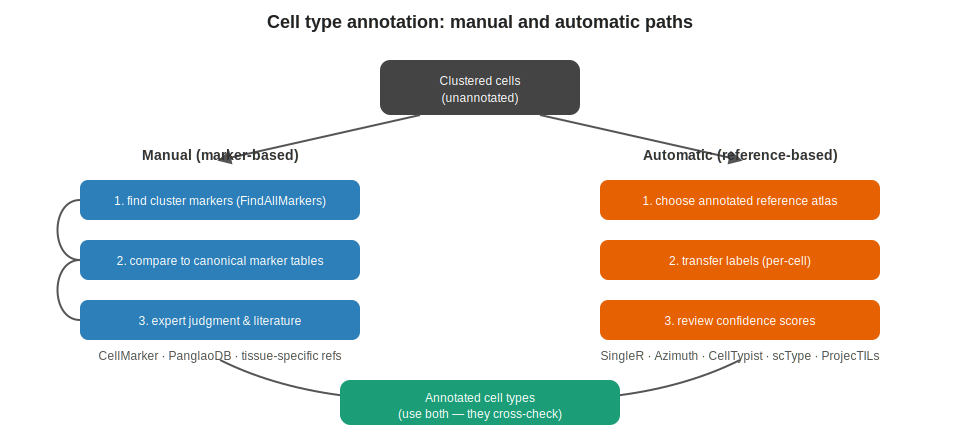

```{r}
#| label: setup
#| include: false
library(tidyverse); library(knitr)
theme_set(theme_minimal(base_size = 14)); set.seed(2026)
```

# Lecture 04: Annotation {background-color="#2c3e50"}

## Where this lecture fits

-   Previous: [Lec 03 — Dim reduction, integration, clustering](Lecture_03_DimRed_Integration_Clustering.html)
-   **You are here:** Lec 04 — *turning clusters into named cell types*
-   Next: [Lec 05 — Downstream analyses](Lecture_05_Downstream.html)
-   **Companion tutorials:**
    -   [Tutorial 03 — Markers & Manual Annotation](../Exercise_Folder/Tutorial_03_Markers_Annotation.html)
    -   [Tutorial 05 — Reference-based Annotation](../Exercise_Folder/Tutorial_05_Reference_Annotation.html)

## Goals of this lecture

::: incremental
-   Distinguish **clusters** (a graph property) from **cell types** (a biological label)
-   Annotate manually with marker genes and canonical references
-   Annotate automatically with a labeled reference (SingleR / Azimuth / CellTypist)
-   Cross-check the two paths against each other
:::

# Two paths, use both {background-color="#2c3e50"}

## The annotation workflow

{fig-align="center" width="92%"}

-   **Manual** — interpretable but biased by the annotator
-   **Automatic** — fast and reproducible but biased by the reference
-   Best practice: run both, reconcile disagreements, document choices

## Manual annotation — marker-driven

1.  Find cluster **[markers](../Resources_Folder/Glossary.html#m)**

``` r
markers <- FindAllMarkers(seu, only.pos = TRUE, min.pct = 0.25,
                          logfc.threshold = 0.25)
markers |> group_by(cluster) |> slice_max(avg_log2FC, n = 10)
```

2.  Compare to canonical markers for the tissue
    -   **CellMarker 2.0**, **PanglaoDB**, tissue-specific references
3.  Assign labels; `RenameIdents()` / `seu$celltype <- ...`

## Automatic annotation — reference-driven

-   Fast, reproducible, reduces personal bias
-   Always **sanity-check** against markers

| Tool           | Reference / mechanism                         |
|----------------|-----------------------------------------------|
| **SingleR**    | Bulk/sc references, correlation-based         |
| **Azimuth**    | Seurat v4 reference mapping (human refs)      |
| **CellTypist** | Logistic regression models, many tissues (py) |
| **scType**     | Marker-list–based scoring                     |
| **ProjecTILs** | T-cell / TME specialized                      |

::: callout-tip
Best practice: run an automatic method **and** confirm with manual marker inspection. Disagreements often flag interesting biology.
:::

## What disagreements tell you

::: incremental
-   **Reference doesn't include this cell type** → trust manual labels for that cluster
-   **Marker plot is ambiguous** → trust the automatic mapping (esp. Azimuth)
-   **Both confident, but different** → look at the score distribution; you may have a *transitional* state
:::

# Reading marker plots well {background-color="#2c3e50"}

## What a "good" marker looks like

::: incremental
-   **Specific** — high in the cluster, low elsewhere (DotPlot's dot intensity contrast)
-   **Pervasive** — expressed in most cells of the cluster (DotPlot's dot size)
-   **Backed by literature** — appears in canonical lineage panels for the tissue
:::

::: callout-warning
Genes that are merely *enriched* on a Wilcoxon test are not always **markers** in the canonical sense. Cross-check at least two genes per cluster.
:::

# Recap & what's next {background-color="#2c3e50"}

## What to remember from Lecture 04

::: incremental
-   Clusters ≠ cell types. The biology is in the labels you give the clusters.
-   Manual + automatic annotation are *complementary*, not redundant
-   Document why you assigned each label — future-you (and reviewers) will thank you
:::

## Coming up next

-   **Lec 05** — [Downstream analyses](Lecture_05_Downstream.html): DE, enrichment, WGCNA, trajectory, cell–cell communication
-   **Hands-on:**
    -   [Tutorial 03 — Markers & Manual Annotation](../Exercise_Folder/Tutorial_03_Markers_Annotation.html)
    -   [Tutorial 05 — Reference-based Annotation](../Exercise_Folder/Tutorial_05_Reference_Annotation.html)
