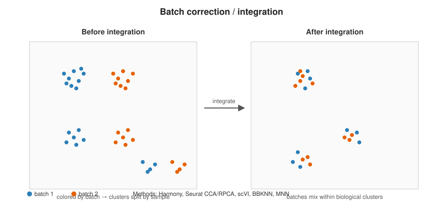
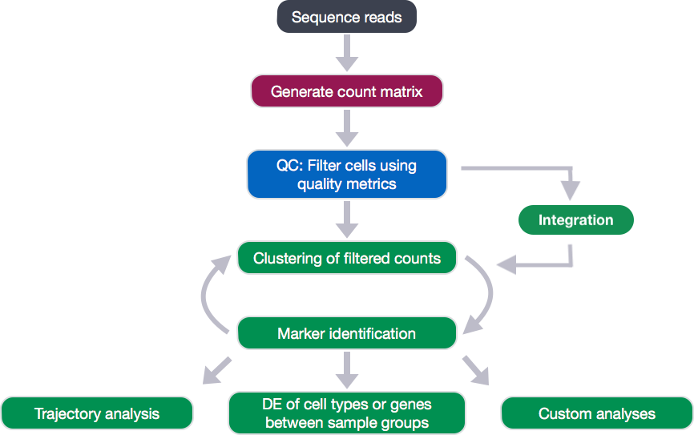
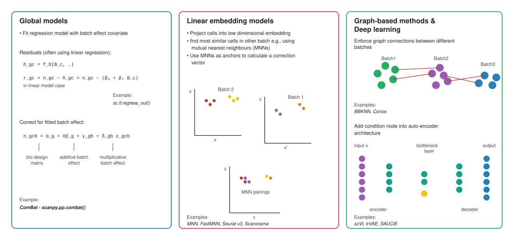
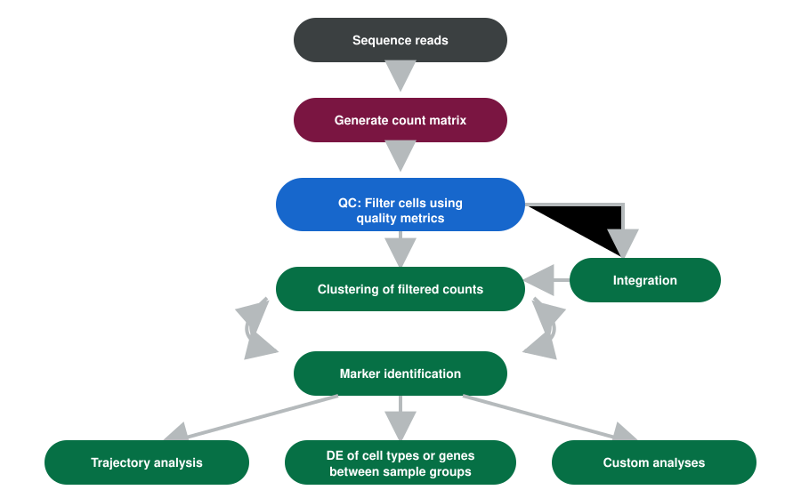
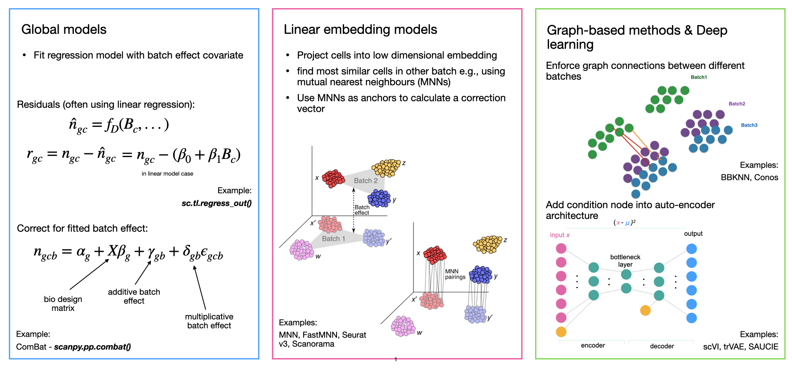
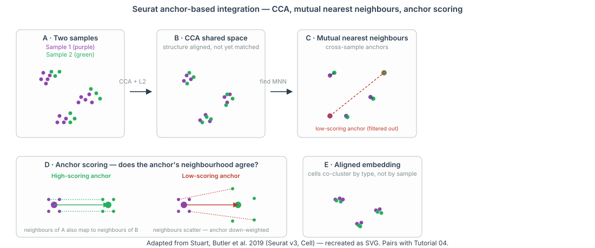
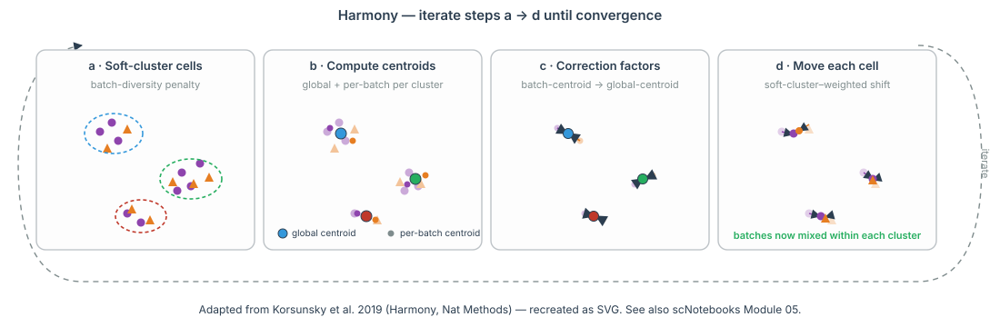

```{r}
#| label: setup-lec04
#| include: false
library(tidyverse); library(knitr); library(gridExtra)
theme_set(theme_minimal(base_size = 14)); set.seed(2026)
```

# Lecture 04: Multi-Sample Integration {background-color="#2c3e50"}

## Where this lecture fits

-   Previous: [Lec 03 — Markers & Manual Annotation](Lecture_03_Markers_Annotation.html)
-   **You are here:** Lec 04 — *aligning shared cell-type structure across samples without erasing biology*
-   Next: [Lec 05 — DESeq2: Bulk Fundamentals + Pseudobulk DE](Lecture_05_DESeq2_DE.html)
-   **Companion tutorial:** [Tutorial 04 — Two-Sample Integration](../Exercise_Folder/Tutorial_04_Integration.html)
-   **Companion book chapter:** [Chapter 4 — Multi-Sample Integration](../Resources_Folder/Chapter_04_Integration.html)
-   **Parallel reading:** [scNotebooks Module 05 — Integrating single-cell transcriptomes from multiple samples](https://integrativebioinformatics.github.io/scNotebooks/modules/en/module05/module05.html) covers the same workflow on the same `ifnb` dataset as a runnable Jupyter notebook.

## Goals of this lecture

::: incremental
-   Recognize when integration is needed by inspecting the unintegrated UMAP / cluster mix
-   Compare integration tools (Harmony, Seurat anchors, scVI, fastMNN) by what they assume
-   Read the Harmony 4-step iterative algorithm; read the Seurat anchor + L2 + MNN scoring algorithm
-   Diagnose **over-correction** vs **under-correction** with three complementary checks
-   Defend the choice of integration method in a methods section
:::

::: callout-note
**Mental model.** Multiple samples / batches / donors of the same biology should produce overlapping clusters of the same cell types. If they don't — if every sample becomes its own island on the UMAP — the technical axis is dominating PC space. Integration warps the embedding to move shared cell types together while leaving genuine biological differences in place.
:::

# Step 6 — Integration / batch correction {background-color="#2c3e50"}

## When to integrate

{fig-align="center" width="88%"}

-   Multiple samples / batches / donors → the same cell type can split into per-sample clusters
-   Integration aligns shared cell types while preserving real biological differences
-   **Diagnostic:** color a UMAP by sample. If cell types co-cluster across samples, you don't need integration. If each sample forms its own island, you do.

## When to integrate (dup1)

{fig-align="center" width="92%"}

## Integration tools

| Tool                  | Ecosystem | Approach                              |
|-----------------------|-----------|---------------------------------------|
| **Harmony**           | R / Py    | Iterative soft-clustering in PC space |
| **Seurat CCA / RPCA** | R         | Anchor-based cross-sample matching    |
| **scVI / scANVI**     | Python    | Variational autoencoder               |
| **BBKNN**             | Python    | Batch-balanced k-NN graph             |
| **MNN / fastMNN**     | R / Py    | Mutual nearest neighbors              |

::: callout-tip
**Rule of thumb:** try a simple method (Harmony) first; move to scVI/scANVI for very large or heterogeneous atlases. The workshop's [Tutorial 04](../Exercise_Folder/Tutorial_04_Integration.html) walks Harmony and Seurat anchors on the `ifnb` dataset (CTRL vs IFN-β-stimulated PBMCs) — the canonical small two-sample integration case. For a complementary, notebook-driven walkthrough see also the [scNotebooks](https://integrativebioinformatics.github.io/scNotebooks/) integration chapter.
:::

::: callout-warning
**Over-integration is real.** If you push integration too hard, real biological differences (e.g. tumor vs. normal) get squashed away with the batch effect. Always plot *both* batch and a known biological covariate after integration to confirm only the unwanted axis was removed.
:::

## Integration strategies — visual guide

{fig-align="center" width="98%"}

-   **Global models** (e.g. ComBat, `sc.tl.regress_out`) fit a regression with batch as a covariate
-   **Linear / MNN** (MNN, FastMNN, Seurat v3, Scanorama) find mutual nearest neighbours across batches and correct
-   **Graph / deep learning** (BBKNN, Conos, scVI, trVAE, SAUCIE) enforce cross-batch connectivity, or add batch as a node in an autoencoder

## Integration strategies — visual guide (dup1)

{fig-align="center" width="92%"}

## Integration strategies — visual guide (dup2)

{fig-align="center" width="92%"}

## Seurat anchors in detail

{fig-align="center" width="95%"}

-   Project both samples by **canonical correlation analysis (CCA)** + L2 normalization into a shared low-rank space
-   Find pairs of cells that are **mutual nearest neighbours** across the two samples — these are the **anchors**
-   **Score** each anchor by how well its local neighbourhoods agree across the two samples; high-scoring anchors drive the alignment, low-scoring anchors are filtered out
-   Apply the anchor-derived correction to bring matching cell types into register

## Harmony in detail

{fig-align="center" width="95%"}

-   Operates in **PC space** after a normal `RunPCA()` — no extra tooling above the standard workflow
-   Iterates four steps until convergence: (a) soft-cluster cells with a batch-diversity penalty, (b) compute a global centroid and per-batch centroids per cluster, (c) compute correction factors that pull each per-batch centroid toward the global one, (d) shift each cell using its soft-cluster-weighted correction
-   Output is a `harmony` reduction that drops in for `pca` in `FindNeighbors` and `RunUMAP`

## What integration looks like — before vs after

```{r}
#| label: integration-toy
#| echo: false
#| fig-width: 10
#| fig-height: 4.5

set.seed(2026)

# 4 cell types, 2 batches; each batch shifted in PC space
make_batch <- function(shift_x, shift_y) {
  bind_rows(
    tibble(x = rnorm(160,  3, 0.7) + shift_x, y = rnorm(160,  4, 0.6) + shift_y, ct = "T cell"),
    tibble(x = rnorm(140, -3, 0.7) + shift_x, y = rnorm(140,  3, 0.7) + shift_y, ct = "B cell"),
    tibble(x = rnorm(120,  0, 0.6) + shift_x, y = rnorm(120, -3, 0.7) + shift_y, ct = "Myeloid"),
    tibble(x = rnorm( 80,  3, 0.7) + shift_x, y = rnorm( 80, -1, 0.6) + shift_y, ct = "NK")
  )
}
b1 <- make_batch( 0.0,  0.0) |> mutate(batch = "Sample A")
b2 <- make_batch( 4.5, -4.5) |> mutate(batch = "Sample B")

# After "integration": project both batches onto the same shared structure
# (here, just remove the per-batch shift)
b1a <- b1 |> mutate(x_int = x,        y_int = y)
b2a <- b2 |> mutate(x_int = x - 4.5,  y_int = y + 4.5)
post <- bind_rows(b1a, b2a)

cols <- c("T cell" = "#3498db", "B cell" = "#e74c3c",
          "Myeloid" = "#27ae60", "NK" = "#9b59b6")

# Before plot — coloured by BATCH so the user sees the batch effect
p_before <- bind_rows(b1, b2) |>
  ggplot(aes(x, y, color = batch)) +
  geom_point(alpha = 0.6, size = 1.4) +
  scale_color_manual(values = c("Sample A" = "#34495e", "Sample B" = "#e67e22"), name = NULL) +
  labs(title = "Before integration — sample drives PC space",
       x = "PC1", y = "PC2") +
  theme_minimal(base_size = 12) + theme(legend.position = "bottom")

# After plot — coloured by CELL TYPE so the user sees the biology emerge
p_after <- post |>
  ggplot(aes(x_int, y_int, color = ct, shape = batch)) +
  geom_point(alpha = 0.7, size = 1.4) +
  scale_color_manual(values = cols, name = NULL) +
  labs(title = "After integration — cell types align across samples",
       x = "PC1 (corrected)", y = "PC2 (corrected)") +
  theme_minimal(base_size = 12) +
  theme(legend.position = "bottom",
        legend.box = "vertical")

gridExtra::grid.arrange(p_before, p_after, nrow = 1)
```

-   **Left:** raw PCA — the biggest axis is *which sample the cell came from*, not *what cell type it is*. Each sample looks like its own island.
-   **Right:** after integration (Harmony / FastMNN / scVI / …) — cell types align across samples, and the four populations are now distinguishable on PC1/PC2.
-   **Diagnostic check:** colour the post-integration UMAP by batch. If batches mix within each cluster you're done. If a cluster is still single-batch, either there's residual batch effect (push integration harder) **or** that population truly only exists in one sample (don't push, you'll erase real biology).

::: callout-warning
The "after" panel above is a cartoon. Real integration *warps* the embedding non-rigidly — that's what makes it powerful and what makes over-integration dangerous. Always sanity-check with both batch and a known biological covariate.
:::

## Diagnosing over- and under-correction

Three diagnostics, all of which appear in [Tutorial 04](../Exercise_Folder/Tutorial_04_Integration.html):

1. **Color the post-integration UMAP by sample.** Cells from each sample should interleave within every cluster. Clusters that remain mostly one sample are either (a) under-corrected or (b) genuinely sample-specific biology (e.g. an activated state present only after stimulation).
2. **Color it by a *biological* covariate.** Cell-type labels (or reference-mapped predictions) should occupy single regions. If a cell type fragments into multiple clusters, integration is leaving residual sample structure.
3. **Score a known biological signal at the cell level and check it survives.** For `ifnb`, score each cell on a panel of interferon-stimulated genes (`ISG15`, `IFI6`, `MX1`, ...) and confirm STIM cells still score higher than CTRL cells *within the same cluster*. If integration has flattened that gap, you've over-corrected.

These three checks generalize to any batch-integrated dataset. The third is particularly important and easy to forget.

## ifnb in practice — UMAPs you'll see in Tutorials 02 and 04

```{r}
#| label: ifnb-umaps
#| echo: false
#| fig-width: 12
#| fig-height: 4.6

set.seed(2026)

# Simulate 6 cell types × 2 conditions
celltypes <- c("CD14 Mono", "CD16 Mono", "B", "CD4 T", "CD8 T", "NK")
ct_centers <- tibble(
  ct = celltypes,
  cx = c(-3, -3, 3, 3, 0, 0),
  cy = c( 2, -2, 2, -2, 4, -4)
)

# Each condition shifts every cluster by the same vector — that's the batch effect
# CTRL: no shift; STIM: shift along the IFN axis
n_per <- 200
cells <- map_dfr(celltypes, function(ct) {
  c <- ct_centers |> filter(ct == !!ct)
  bind_rows(
    tibble(ct = ct, stim = "CTRL",
           u1 = c$cx + rnorm(n_per, 0, 0.6),
           u2 = c$cy + rnorm(n_per, 0, 0.5)),
    tibble(ct = ct, stim = "STIM",
           u1 = c$cx + 4 + rnorm(n_per, 0, 0.6),
           u2 = c$cy + 1 + rnorm(n_per, 0, 0.5))
  )
})

p_unint_sample <- ggplot(cells, aes(u1, u2, color = stim)) +
  geom_point(alpha = 0.6, size = 0.6) +
  scale_color_manual(values = c(CTRL = "#34495e", STIM = "#e67e22"), name = NULL) +
  labs(title = "Unintegrated — by sample",
       subtitle = "two parallel islands, every cell type doubles up",
       x = "UMAP1", y = "UMAP2") +
  theme_minimal(base_size = 11) + theme(legend.position = "bottom")

p_unint_ct <- ggplot(cells, aes(u1, u2, color = ct)) +
  geom_point(alpha = 0.6, size = 0.6) +
  scale_color_brewer(palette = "Set1", name = NULL) +
  labs(title = "Unintegrated — by cell type",
       subtitle = "each type splits in two — left/CTRL, right/STIM",
       x = "UMAP1", y = "UMAP2") +
  theme_minimal(base_size = 11) +
  theme(legend.position = "bottom") +
  guides(color = guide_legend(nrow = 2, override.aes = list(size = 3)))

# After integration: collapse the per-condition shift
cells_int <- cells |>
  mutate(u1_int = ifelse(stim == "STIM", u1 - 4, u1),
         u2_int = ifelse(stim == "STIM", u2 - 1, u2))

p_int_sample <- ggplot(cells_int, aes(u1_int, u2_int, color = stim)) +
  geom_point(alpha = 0.6, size = 0.6) +
  scale_color_manual(values = c(CTRL = "#34495e", STIM = "#e67e22"), name = NULL) +
  labs(title = "After integration — by sample",
       subtitle = "the two colors interleave inside each cluster",
       x = "UMAP1", y = "UMAP2") +
  theme_minimal(base_size = 11) + theme(legend.position = "bottom")

p_int_ct <- ggplot(cells_int, aes(u1_int, u2_int, color = ct)) +
  geom_point(alpha = 0.6, size = 0.6) +
  scale_color_brewer(palette = "Set1", name = NULL) +
  labs(title = "After integration — by cell type",
       subtitle = "one cluster per cell type",
       x = "UMAP1", y = "UMAP2") +
  theme_minimal(base_size = 11) +
  theme(legend.position = "bottom") +
  guides(color = guide_legend(nrow = 2, override.aes = list(size = 3)))

gridExtra::grid.arrange(p_unint_sample, p_unint_ct, p_int_sample, p_int_ct, nrow = 2)
```

The four-panel grid above is exactly what students produce in Tutorials 02 and 04. Read it as:

::: incremental
-   **Top-left** (Tut 02 unintegrated, by sample) — two clearly separated islands. The biggest source of variance is `stim`, not biology
-   **Top-right** (Tut 02 unintegrated, by cell type) — each cell type splits in two, mirroring the sample split. Six biological cell types appear as twelve clusters
-   **Bottom-left** (Tut 04 integrated, by sample) — colors interleave inside each cluster. This is the test of "did integration work?"
-   **Bottom-right** (Tut 04 integrated, by cell type) — one cluster per cell type. This is the goal
:::

## ISG score gap survives integration — the over-correction check

```{r}
#| label: isg-gap-check
#| echo: false
#| fig-width: 9
#| fig-height: 4

set.seed(2026)

# Per-cell ISG score: high in STIM monocytes, mild in T/B/NK
isg_score <- function(stim, ct) {
  baseline <- ifelse(stim == "CTRL", 0.05, 1)
  multiplier <- case_when(
    ct == "CD14 Mono" ~ 1.5,
    ct == "CD16 Mono" ~ 1.4,
    ct == "B"         ~ 0.8,
    ct == "CD4 T"     ~ 1.0,
    ct == "CD8 T"     ~ 1.1,
    ct == "NK"        ~ 0.9
  )
  pmax(baseline * multiplier + rnorm(length(stim), 0, 0.25), 0)
}

cells_int$isg <- isg_score(cells_int$stim, cells_int$ct)

ggplot(cells_int, aes(stim, isg, fill = stim)) +
  geom_violin(scale = "width", trim = TRUE) +
  geom_boxplot(width = 0.15, outlier.size = 0.5, fill = "white") +
  facet_wrap(~ ct, nrow = 1) +
  scale_fill_manual(values = c(CTRL = "#34495e", STIM = "#e67e22"), guide = "none") +
  labs(title = "ISG score per cell type — STIM > CTRL within EVERY cell type",
       subtitle = "If integration had flattened these gaps, it over-corrected.",
       x = NULL, y = "Module score (ISG15, IFI6, IFIT1, MX1, ...)") +
  theme_minimal(base_size = 11)
```

The integration moved cells *spatially* (the bottom panels of the previous figure) **without erasing the IFN-β biology** (ISG score still STIM > CTRL within every cluster). That's the right outcome.

::: callout-tip
**This is the most important diagnostic and the one most often skipped.** Always run a known biological signal through the post-integration object and confirm the signal survives. Pretty UMAPs are not the same as preserved biology.
:::


# Recap & what's next {background-color="#2c3e50"}

## What to remember from Lecture 04

::: incremental
-   **Integration** is *always* an editorial choice — pick the simplest method that works, then check you didn't over-correct
-   **Harmony** corrects in PC space iteratively; **Seurat anchors** finds mutual nearest neighbours after CCA
-   The over-correction check that matters: a **known biological signal** (e.g. ISG score) should still differ between conditions *within* the same cluster after integration
-   Always plot the post-integration UMAP coloured by **batch** AND by **biology** — both dimensions
:::

## Coming up next

-   **Lec 05** — [DESeq2 Fundamentals](Lecture_05_DESeq2_DE.html) — the model behind condition-level DE
-   **Hands-on:** [Tutorial 04 — Two-Sample Integration](../Exercise_Folder/Tutorial_04_Integration.html)
-   **Companion book chapter:** [Chapter 4 — Multi-Sample Integration](../Resources_Folder/Chapter_04_Integration.html)
