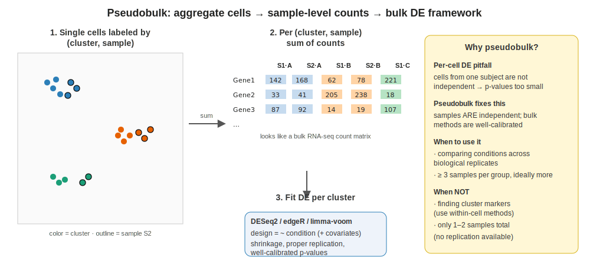
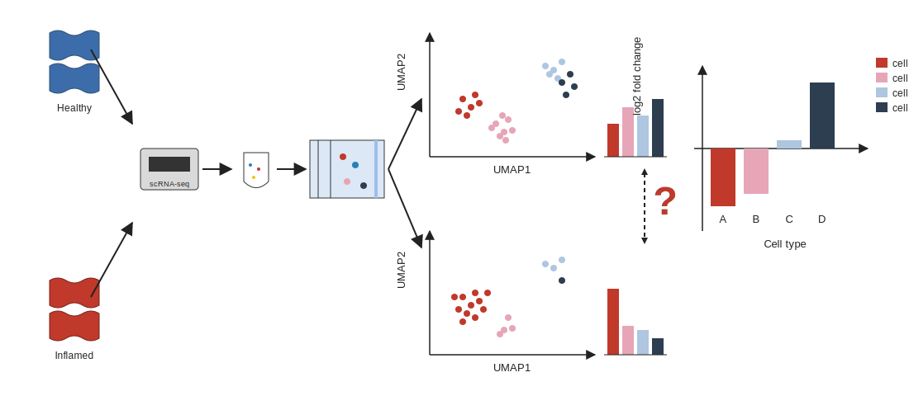

```{r}
#| label: setup
#| include: false
library(tidyverse); library(knitr)
theme_set(theme_minimal(base_size = 14)); set.seed(2026)
```

# Lecture 05: Downstream Analyses {background-color="#2c3e50"}

## Where this lecture fits

-   Previous: [Lec 04 — Annotation](Lecture_04_Annotation.html)
-   **You are here:** Lec 05 — *what to do once you have an annotated object*
-   Next: [Lec 06 — Beyond scRNA-seq](Lecture_06_Beyond_scRNAseq.html)
-   **Companion tutorial:** [Tutorial 04 — Pseudobulk DE](../Exercise_Folder/Tutorial_04_Pseudobulk_DE.html)

## Goals of this lecture

::: incremental
-   Pick the right tool for **DE between conditions** (spoiler: pseudobulk)
-   Run gene-set / pathway enrichment without fooling yourself
-   See how WGCNA generalises to scRNA-seq via metacells
-   Decide *whether* a trajectory is appropriate, before running one
-   Understand what cell–cell communication tools are actually inferring
-   Recognize when to test changes in **cell-type composition** vs. expression
:::

# The annotated object is a launchpad {background-color="#2c3e50"}

## What you can ask now

{fig-align="center" width="95%"}

-   Within-cluster: marker genes, signatures, module scores
-   Between conditions: pseudobulk DE per cell type
-   Across cells: gene modules, trajectories, communication networks
-   Across samples: composition shifts

# Differential expression between conditions {background-color="#2c3e50"}

## DE — the cardinal sin

-   Question: within a given cell type, which genes change with treatment / genotype / time?
-   **Do NOT** treat cells as biological replicates — they are not independent
-   Preferred approach: **pseudobulk** (next part of this lecture)
-   Within-cell methods still useful for *exploratory* cluster **[markers](../Resources_Folder/Glossary.html#m)**: `FindMarkers`, MAST, `rank_genes_groups`

# Pseudobulk analysis {background-color="#2c3e50"}

## Why pseudobulk?

::: incremental
-   Cells from the same sample are **not independent** replicates
-   Using cells as "n" inflates degrees of freedom and produces **anti-conservative p-values** in condition-level DE
-   Pseudobulk sidesteps this by aggregating first, testing on real biological samples
:::

## What pseudobulk does

{fig-align="center" width="95%"}

-   **Aggregate** (sum) UMI counts per *(sample, cell type)* → a classic bulk-looking matrix
-   One row per gene, one column per (sample × cell type) replicate
-   Run a separate DE test **per cell type**

## DESeq2 on pseudobulk in R

``` r
library(Seurat); library(DESeq2)

pb <- AggregateExpression(seu, assays = "RNA",
                          group.by = c("sample_id", "celltype"),
                          return.seurat = FALSE)$RNA

meta <- data.frame(
  sample_id = sub("_.*", "", colnames(pb)),
  celltype  = sub("^[^_]+_", "", colnames(pb))
) |>
  dplyr::left_join(sample_meta, by = "sample_id")

run_de <- function(ct) {
  keep <- meta$celltype == ct
  dds  <- DESeqDataSetFromMatrix(countData = pb[, keep],
                                 colData   = meta[keep, ],
                                 design    = ~ condition)
  dds  <- DESeq(dds)
  results(dds, contrast = c("condition", "treated", "control")) |>
    as.data.frame() |> tibble::rownames_to_column("gene") |>
    dplyr::mutate(celltype = ct)
}

de_all <- purrr::map_dfr(unique(meta$celltype), run_de)
```

## DESeq2 on pseudobulk in Python

``` python
import decoupler as dc
import pydeseq2.dds as dds_mod
from pydeseq2.ds import DeseqStats

pdata = dc.get_pseudobulk(adata, sample_col="sample_id",
                          groups_col="celltype",
                          layer="counts", mode="sum",
                          min_cells=10, min_counts=1000)

ct = "T_CD4"
mask = pdata.obs["celltype"] == ct
dds = dds_mod.DeseqDataSet(
    counts = pdata.layers["counts"][mask].T,
    metadata = pdata.obs[mask],
    design_factors = "condition")
dds.deseq2()
stats = DeseqStats(dds, contrast=["condition", "treated", "control"])
stats.summary()
```

## Gotchas & good practice

::: incremental
-   **Filter low-cell groups** — drop (sample × cell type) combos with few cells (e.g. `< 10`) before DE
-   **Include covariates** in the design (batch, sex, age) just like bulk RNA-seq
-   Prefer **shrinkage LFCs** (`lfcShrink()` in DESeq2, `apeglm` or `ashr`) for ranking
-   Use **BH / IHW** for multiple testing **within** each cell-type run, not across all results naïvely
:::

## When *not* to use pseudobulk

-   Questions about **within-cell-type heterogeneity** (subpopulations defined by a marker)
-   Samples with only one or two biological replicates per condition — no test will save you
-   Rare cell types with too few cells per sample to aggregate meaningfully

# Enrichment / pathway analysis {background-color="#2c3e50"}

## Three flavours

-   Summarize gene lists into interpretable biology
-   Main flavors:
    -   **Over-representation** (hypergeometric): enrichR, clusterProfiler
    -   **Rank-based GSEA**: fgsea, clusterProfiler's `gseGO`/`gseKEGG`
    -   **Per-cell scoring**: decoupleR, AUCell, GSVA, `AddModuleScore`

``` r
# per-cell pathway activity (module scoring)
seu <- AddModuleScore(seu, features = list(interferon_genes), name = "IFN")
FeaturePlot(seu, "IFN1")
```

# Co-expression modules (WGCNA) {background-color="#2c3e50"}

## scRNA-seq + WGCNA

{fig-align="center" width="95%"}

-   **hdWGCNA** (Morabito et al.) adapts WGCNA to sparse single-cell data using metacells
-   Alternative: build pseudobulk matrices per cell type, then run classic `WGCNA`
-   Output: gene **modules**, module eigengenes, module–trait correlations, hub genes

# Trajectory / pseudotime {background-color="#2c3e50"}

## When trajectory inference is appropriate

-   For continuous processes (development, differentiation, activation)
-   Tools: **Monocle3**, **Slingshot**, **PAGA**, **scVelo** (**[RNA velocity](../Resources_Folder/Glossary.html#r)**)
-   Requires biological justification — not every dataset has a **[trajectory](../Resources_Folder/Glossary.html#t)** (see also **[pseudotime](../Resources_Folder/Glossary.html#p)**)

::: callout-warning
A trajectory algorithm will *always* return a trajectory. Whether one exists in your biology is a separate question.
:::

# Cell–cell communication {background-color="#2c3e50"}

## Inferring signaling

-   Infer signaling between cell types from ligand–receptor expression
-   Tools: **CellChat**, **LIANA** (meta-resource), **NicheNet**, **CellPhoneDB**
-   These tools predict *capacity* for communication, not the actual flow

# Compositional analysis {background-color="#2c3e50"}

## *Who* is there, in what proportion

{fig-align="center" width="97%"}

-   Take two conditions (e.g. healthy vs. inflamed), sequence both, cluster and annotate
-   Compare **cell-type proportions** and test whether the shift is real
-   Tools: **scCODA**, **propeller**, **milo**, **tascCODA** (compositional methods handle the constrained-sum nature of proportions)

# Recap & what's next {background-color="#2c3e50"}

## What to remember from Lecture 05

::: incremental
-   For **condition-level DE**, default to **pseudobulk** + DESeq2/edgeR/limma-voom
-   For **per-cell** signatures, use module scoring or AUCell — never claim DE from these
-   Trajectory and CCC tools both *suggest* — they don't *prove*
-   Composition shifts are a separate test, not a side effect of DE
:::

## Coming up next

-   **Lec 06** — [Beyond scRNA-seq](Lecture_06_Beyond_scRNAseq.html): spatial, ATAC, multi-omics
-   **Hands-on:** [Tutorial 04 — Pseudobulk DE](../Exercise_Folder/Tutorial_04_Pseudobulk_DE.html)
