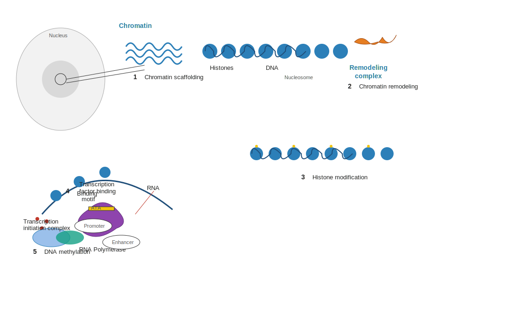
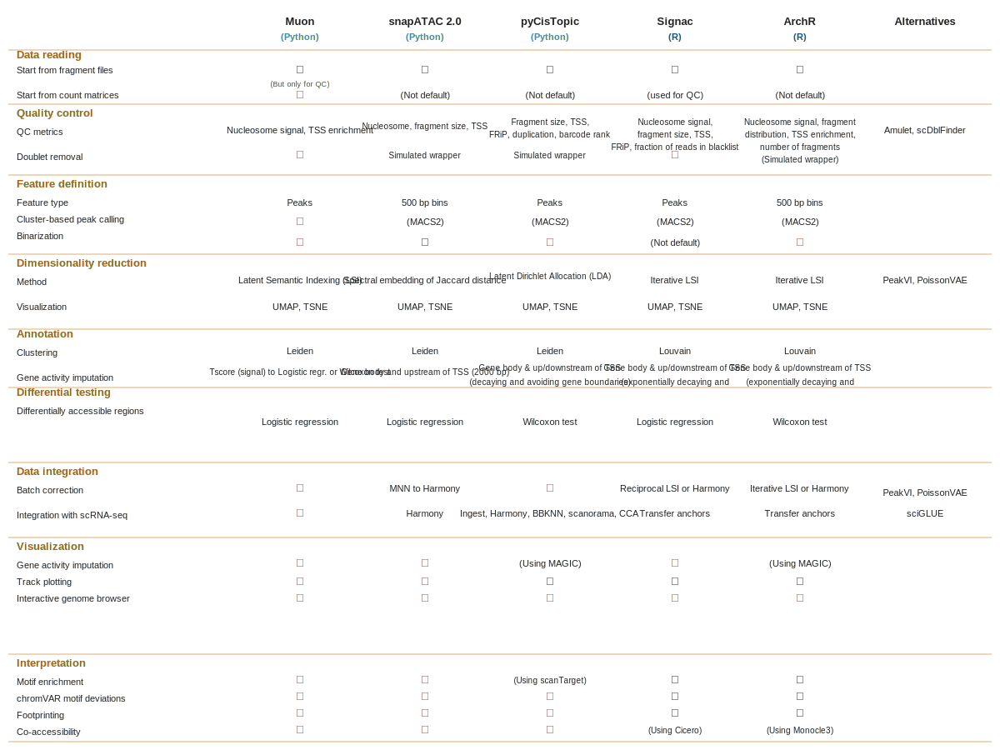

```{r}
#| label: setup
#| include: false
library(tidyverse); library(knitr)
theme_set(theme_minimal(base_size = 14)); set.seed(2026)
```

# Lecture 06: Beyond dissociated scRNA-seq {background-color="#2c3e50"}

## Where this lecture fits

-   Previous: [Lec 05 — Downstream analyses](Lecture_05_Downstream.html)
-   **You are here:** Lec 06 — *spatial, ATAC, and multi-modal extensions*
-   **Companion exercise:** [Bonus — scATAC-seq with Signac](../Exercise_Folder/Exercise_ATACseq_Signac.html)

## Goals of this lecture

::: incremental
-   See where scRNA-seq sits in the broader single-cell measurement landscape
-   Understand what **spatial transcriptomics** adds and at what resolution
-   Map gene-regulation layers (chromatin, histones, methylation) to single-cell assays
-   Compare the major scATAC-seq toolchains
:::

# The scRNA-seq landscape is wider {background-color="#2c3e50"}

## Beyond dissociated scRNA-seq

{fig-align="center" width="95%"}

## Why spatial matters

::: incremental
-   **Dissociation discards tissue architecture.** scRNA-seq tells you *what* cells are present, not *where* they are
-   Spatial transcriptomics recovers tissue context at varying resolutions (spot → subcellular)
-   Same downstream concepts apply: QC, normalization, clustering, annotation — plus new ones (cell2location, neighborhood enrichment)
-   Often used in combination: scRNA-seq as a **reference** for deconvolving lower-resolution spatial data
:::

# Gene regulation in single cells {background-color="#2c3e50"}

## The layers single-cell can see

{fig-align="center" width="90%"}

::: incremental
-   **[Chromatin](../Resources_Folder/Glossary.html#c) scaffolding** packages DNA into nucleosomes → scATAC-seq reads out accessible regions
-   **Chromatin remodeling** exposes DNA for transcription
-   **Histone modifications** (active / repressive marks) → single-cell CUT&Tag, CUT&RUN
-   **Transcription factor binding** at **[promoters](../Resources_Folder/Glossary.html#p)** / enhancers → accessibility + motif enrichment
-   **DNA methylation** — scBS-seq and derivatives
:::

# scATAC-seq — the tool landscape {background-color="#2c3e50"}

## Toolchains

{fig-align="center" width="95%"}

-   Python ecosystem: **Muon**, **snapATAC2**, **pyCisTopic** — tight coupling with AnnData / scverse
-   R ecosystem: **Signac** (Seurat-compatible), **ArchR** — strong visualization and motif tooling
-   Alternatives for specific tasks: **Amulet / scDblFinder** (doublets), **PeakVI / PoissonVAE** (dim-reduction), **sciGLUE** (RNA↔ATAC integration)

## What stays the same

::: incremental
-   The **shape** of the analysis: QC → feature selection → dim-reduction → clustering → annotation
-   The same statistical issues: sparsity, batch, integration
-   The **interpretation** changes: peaks ≠ genes, accessibility ≠ expression
:::

# Multi-omics in one cell {background-color="#2c3e50"}

## Joint measurement

::: incremental
-   **10x Multiome** — scRNA + scATAC from the same nucleus
-   **CITE-seq** — scRNA + cell-surface protein (ADTs)
-   **Perturb-seq / CROP-seq** — scRNA + a CRISPR perturbation barcode
-   Joint analysis tools: **MOFA+**, **scvi-tools (totalVI / multiVI)**, **WNN** (Seurat v4), **Muon**
:::

::: callout-tip
The framework is identical: each modality is a layer with its own QC, normalization, and HVG step; integration happens *after* per-modality preprocessing.
:::

# Where to go from here {background-color="#2c3e50"}

## Workshop wrap-up

::: incremental
-   You can now read a paper that uses scRNA-seq and **understand the choices the authors made**
-   You have the toolchain and the dataset to do the same on your own data
-   The next 6–12 months should be spent **doing** an analysis end-to-end and reading critically
:::

## Further reading

-   Heumos *et al.* 2023, *Nature Reviews Genetics* — "Best practices for single-cell analysis across modalities"
-   Luecken & Theis 2019, *Molecular Systems Biology* — "Current best practices in single-cell RNA-seq analysis"
-   Amezquita *et al.* 2020 — [Orchestrating Single-Cell Analysis with Bioconductor (OSCA)](https://bioconductor.org/books/release/OSCA/)
-   [Seurat tutorials](https://satijalab.org/seurat/) · [Scanpy tutorials](https://scanpy.readthedocs.io/) · [sc-best-practices book](https://www.sc-best-practices.org/)
-   See the workshop's [Additional Readings](../Additional_Readings.html) page for a curated, topic-grouped reading list.

## Thanks!

-   Lectures: 1 → 6 ✓
-   Tutorials: 01–05 + ATAC bonus ✓
-   Reading material: Resources / Glossary / VS Code & Talapas ✓

Now go build something.
