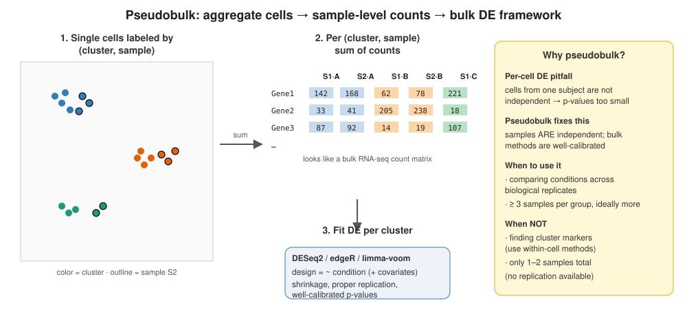
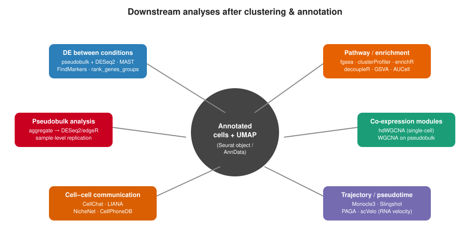

```{r}
#| label: setup-lec06
#| include: false
library(tidyverse); library(knitr)
theme_set(theme_minimal(base_size = 14)); set.seed(2026)
```

# Lecture 06: DESeq2 — Bulk Fundamentals + Pseudobulk DE {background-color="#2c3e50"}

## Where this lecture fits

-   Previous: [Lec 05 — Multi-Sample Integration](Lecture_05_Integration.html)
-   **You are here:** Lec 06 — *the DESeq2 model on bulk RNA-seq, then applied to scRNA-seq pseudobulk*
-   Next: [Lec 07 — Functional Analysis](Lecture_07_FunctionalAnalysis.html)
-   **Companion tutorial:** [Tutorial 06 — DESeq2: Bulk Primer + Pseudobulk DE](../Exercise_Folder/Tutorial_06_DESeq2_DE.html)
-   **Companion book chapter:** [Chapter 6 — DESeq2: Bulk Fundamentals + Pseudobulk DE](../Resources_Folder/Chapter_06_DESeq2_DE.html)
-   **Statistical background:** [Appendix B — Statistical Foundations](../Resources_Folder/Appendix_B_Statistical_Foundations.html)

## Goals of this lecture

::: incremental
-   Understand the **negative-binomial GLM** at the heart of DESeq2 in plain terms
-   Read and correctly interpret DESeq2 output — the sign of `log2FoldChange` (set by the reference level), `padj`, and when to shrink with `lfcShrink`/`apeglm`
-   Run DESeq2 end to end on a real bulk RNA-seq dataset (`airway`)
-   Understand **why per-cell DE is statistically wrong** for condition contrasts
-   Aggregate single cells to a *(sample × cell type)* **pseudobulk** matrix and run DESeq2 per cell type with the right design and contrast
:::

::: callout-note
**Why bulk DESeq2 first?** Pseudobulk DE in scRNA-seq is *just bulk DESeq2 applied to per-cell-type aggregated counts*. So learn the bulk model cleanly first (Part 1); the single-cell scaffolding around it (Part 2) is then a small, well-defined wrapper.
:::

# Part 1 — DESeq2 fundamentals on bulk RNA-seq {background-color="#2c3e50"}

## What DESeq2 actually does

::: incremental
-   Models **integer counts** per gene with a **negative binomial** distribution
-   Estimates a **size factor** per sample (depth normalization), independent of the design
-   **Shrinks** per-gene dispersion estimates toward a fitted trend (gives stable results when N is small)
-   Tests each gene's coefficient with a **Wald test** (default) or LRT
:::

::: callout-note
**Why negative binomial, not Poisson?** RNA-seq counts are **over-dispersed**: variance \> mean. Poisson would underestimate variance and inflate Type-I error. The NB adds a per-gene dispersion parameter.
:::

## A canonical bulk DESeq2 run (Patel-style, `airway` data)

``` r
library(DESeq2); library(airway)
data(airway)

dds <- DESeqDataSetFromMatrix(
  countData = assay(airway),
  colData   = colData(airway),
  design    = ~ cell + dex)        # cell line as covariate, dex as test factor

# Pre-filter: drop genes with < 10 total reads (speed only — does not affect FDR)
dds <- dds[ rowSums(counts(dds)) >= 10, ]

# Set the reference level so log2FC sign is interpretable
dds$dex <- relevel(dds$dex, ref = "untrt")

dds <- DESeq(dds)
res <- results(dds, contrast = c("dex", "trt", "untrt"))
summary(res)
```

::: callout-tip
**`relevel()` matters.** The reference level becomes the *denominator* in `log2FoldChange`. If you forget, your "up-regulated" and "down-regulated" labels can be backwards.
:::

## Reading DESeq2 output

| Column | What it is | Watch-out |
|----|----|----|
| `baseMean` | mean of normalized counts across all samples | Very low values = unstable estimates |
| `log2FoldChange` | effect size on log~2~ scale | Use **shrunk** values for ranking |
| `lfcSE` | standard error of the LFC | |
| `stat` | Wald statistic | |
| `pvalue` | raw p-value | Don't filter on this directly |
| `padj` | BH-adjusted p-value | This is your FDR — filter on `padj < 0.05` |

::: callout-warning
**`NA` in `padj`?** DESeq2 sets `padj = NA` for genes filtered by independent filtering or with extreme outliers (Cook's distance). That's intentional, not a bug.
:::

## Shrink LFCs for ranking & visualization — *not* for testing

``` r
res_shrunk <- lfcShrink(dds,
                        coef = "dex_trt_vs_untrt",
                        type = "apeglm")
```

::: callout-tip
**Why shrink?** Weakly expressed genes have huge, noisy raw LFCs from sampling noise. Shrinkage (`apeglm` / `ashr`) pulls those down toward zero — by an amount set by how much information the gene carries (low counts, high dispersion, or few degrees of freedom → more shrinkage) — so a "top hits" list or volcano plot isn't dominated by junk genes with `baseMean = 2`.
:::

::: callout-important
**Shrinkage is decoupled from the hypothesis test.** Since the 2016 pipeline change, DESeq2 computes `pvalue` / `padj` from the **unshrunken** (MLE) log-fold-changes — shrinkage does **not** enter the Wald test. The shrunken LFCs (and their SEs) are for **ranking, volcano/MA plots, and effect-size reporting**, *after* testing. So "shrink before ranking" means *before you sort and visualize results*, **not** *before DE testing*. Earlier DESeq2 versions did use shrunken estimates in testing; that was removed to keep the FDR well-calibrated.
:::

# Part 2 — Why per-cell DE goes wrong {background-color="#2c3e50"}

## The scientific question

> In *cell type X*, which genes differ between **treated** and **control** subjects?

## Why naïve per-cell tests fail

::: incremental
-   Cells from one subject share genetics, library prep, batch, treatment — they are **not independent**
-   Treating each cell as an independent replicate inflates the effective N by 100×–10,000×
-   Result: **anti-conservative p-values** — thousands of spurious "significant" genes
-   Documented in benchmarks: Squair et al. 2021 (*Nat Commun*), Zimmerman et al. 2021
:::

::: callout-important
If your experimental unit is the **subject**, your statistical unit should be the **subject**. Within-cell methods (`FindMarkers`, `wilcox`, MAST) are fine for *exploratory marker discovery*; they are **not** condition-level DE.
:::

## Cell-level DE — the model-based camp

Pseudobulk is our default, but a second family models **each cell** while still respecting non-independence:

-   **Mixed-effects / GLMM methods** (`nebula`, `glmmTMB`, MAST with a random effect) add a **per-sample random effect**, so the subject remains the unit of replication even though the model fits at cell level
-   **MAST** uses a two-part (hurdle) model tailored to scRNA-seq zero-inflation

The literature is genuinely split — some benchmarks favour pseudobulk (Squair 2021), others find well-specified mixed models competitive (Zimmerman 2021; Gagnon 2022).

::: callout-tip
**Practical stance:** default to **pseudobulk** (simple, robust, hard to fool). Reach for a **mixed-effects cell-level model** when you have many cells per subject, need the extra power, and will check the random-effect specification. The cardinal sin isn't picking one — it's the **naïve per-cell test with no subject term**.
:::

# Part 3 — Pseudobulk in practice {background-color="#2c3e50"}

## What pseudobulk does

{fig-align="center" width="95%"}

-   **Aggregate** (sum) UMI counts per *(sample, cell type)* → a classic bulk-looking matrix
-   One column per (sample × cell type) replicate, one row per gene
-   Run a separate DE test **per cell type** with DESeq2 / edgeR / limma-voom

## DESeq2 on pseudobulk in R

``` r
library(Seurat); library(DESeq2)

pb <- AggregateExpression(seu, assays = "RNA",
                          slot = "counts",   # sum raw counts, not log-normalized data
                          group.by = c("sample_id", "celltype"),
                          return.seurat = FALSE)$RNA

meta <- data.frame(
  sample_id = sub("_.*", "", colnames(pb)),
  celltype  = sub("^[^_]+_", "", colnames(pb))
) |>
  dplyr::left_join(sample_meta, by = "sample_id")

run_de <- function(ct) {
  keep <- meta$celltype == ct
  dds  <- DESeqDataSetFromMatrix(countData = pb[, keep],
                                 colData   = meta[keep, ],
                                 design    = ~ condition)
  dds  <- DESeq(dds)
  results(dds, contrast = c("condition", "treated", "control")) |>
    as.data.frame() |> tibble::rownames_to_column("gene") |>
    dplyr::mutate(celltype = ct)
}

de_all <- purrr::map_dfr(unique(meta$celltype), run_de)
```

## DESeq2 on pseudobulk in Python

``` python
import decoupler as dc
import pydeseq2.dds as dds_mod
from pydeseq2.ds import DeseqStats

pdata = dc.get_pseudobulk(adata, sample_col="sample_id",
                          groups_col="celltype",
                          layer="counts", mode="sum",
                          min_cells=10, min_counts=1000)

ct = "T_CD4"
mask = pdata.obs["celltype"] == ct
dds = dds_mod.DeseqDataSet(
    counts = pdata.layers["counts"][mask].T,
    metadata = pdata.obs[mask],
    design_factors = "condition")
dds.deseq2()
DeseqStats(dds, contrast=["condition", "treated", "control"]).summary()
```

## Gotchas & good practice

::: callout-warning
**Common pitfalls.**

-   **Filter low-cell groups** — drop (sample × cell type) combos with `< 10` cells before DE; the pseudobulk profile is too noisy.
-   **Include covariates** in the design (batch, sex, age) just like bulk RNA-seq.
-   **Need ≥ 3 samples per condition.** With 1–2 samples per group, no test is honest — say so in the paper.
-   Prefer **shrinkage LFCs** (`lfcShrink()` with `apeglm`) for ranking.
-   Apply BH / IHW **within** each cell-type run, not across all results pooled — the null distributions differ.
:::

::: callout-note
**ifnb-specific: the `ind` column and the `g`-prefix issue.** In the `ifnb` dataset, donor IDs are stored in the metadata column `ind` (values like `"101"`, `"1015"`, `"1016"`, ...). Because `AggregateExpression()` pastes group values into column names, a donor ID that starts with a digit produces an invalid R column name; R silently prepends `g` to make it syntactically valid (`g101`, `g1015`, ...). Tutorial 06 pre-empts this by creating a new column `donor_id = paste0("d", ind)` before aggregation, so all pseudobulk columns start with `"d"`. If your column names look like `g101_CD14 Mono`, you have hit this issue — just rename the column before running `DESeq2`.
:::

## When *not* to use pseudobulk

-   Questions about **within-cell-type heterogeneity** (subpopulations defined by a marker)
-   Samples with only one or two biological replicates per condition — no test will save you
-   Rare cell types with too few cells per sample to aggregate meaningfully

# Part 4 — Where DE lands in the bigger picture {background-color="#2c3e50"}

## The annotated object as a launchpad

{fig-align="center" width="95%"}

-   **Within-cluster:** marker genes, signatures, module scores
-   **Between conditions:** pseudobulk DE per cell type *(this lecture)*
-   **Across cells:** gene modules → WGCNA (bonus), trajectory inference, ligand-receptor
-   **Across samples:** composition shifts (scCODA, propeller, milo)

## Pathway / enrichment follow-up

After DE, summarize gene lists into pathways:

-   **Over-representation** (hypergeometric): `enrichR`, `clusterProfiler`
-   **Rank-based GSEA**: `fgsea`, `clusterProfiler::gseGO`
-   **Per-cell scoring** (alternative to gene lists): `decoupleR`, `AUCell`, `AddModuleScore`

# Recap & what's next {background-color="#2c3e50"}

## What to remember from Lecture 06

::: incremental
-   DESeq2 models **integer counts** with a **negative binomial** distribution and **shrinks** dispersion estimates toward a fitted trend
-   `relevel()` your factor before running `DESeq` — the reference level determines the **sign** of the log-fold-change
-   For ranking and visualization, **shrink** LFCs with `lfcShrink(dds, type = "apeglm")` — but the `pvalue` / `padj` come from the **unshrunken** estimates (shrinkage is not part of the test since 2016)
-   `padj` is the **FDR** — filter on `padj < 0.05`, not on raw `pvalue`
-   For **condition-level DE**, default to **pseudobulk** + DESeq2/edgeR/limma-voom; never run per-cell DE for condition contrasts
-   Aggregate counts per *(sample × cell type)* with `AggregateExpression`, then test each cell type separately
-   Drop cell-type × sample combinations with **fewer than \~10 cells**
-   You need real biological replicates (≥ 3 per group) — there is no shortcut
:::

## Coming up next

-   **Lec 07** — [Functional Analysis](Lecture_07_FunctionalAnalysis.html) — turning a pseudobulk DE list into biological themes
-   **Lec 08** — [Differential Abundance](Lecture_08_DifferentialAbundance.html) — the *complement*: do cell-type proportions change?
-   **Hands-on:** [Tutorial 06 — DESeq2: Bulk Primer + Pseudobulk DE](../Exercise_Folder/Tutorial_06_DESeq2_DE.html)
-   **Companion book chapter:** [Chapter 6 — DESeq2: Bulk Fundamentals + Pseudobulk DE](../Resources_Folder/Chapter_06_DESeq2_DE.html)
