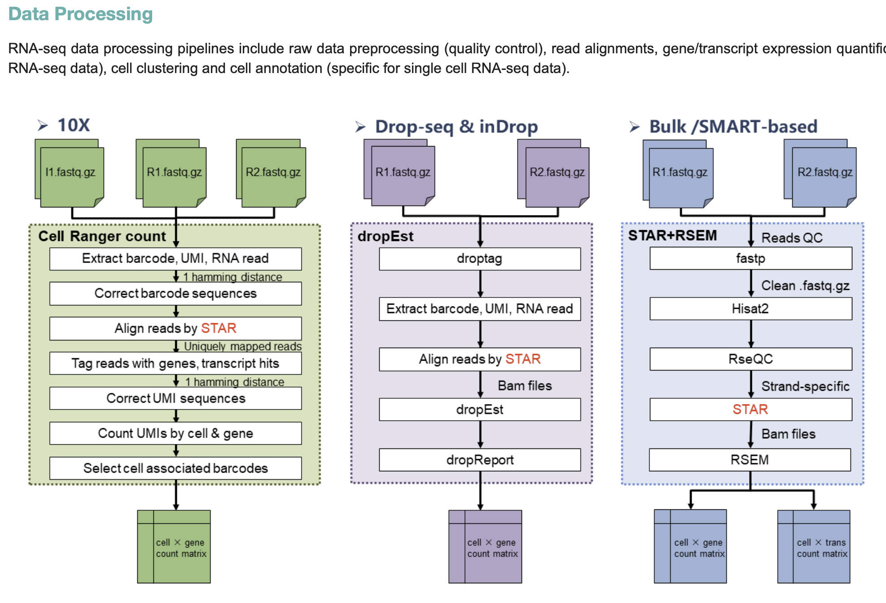

```{r}
#| label: setup-lec06
#| include: false
library(tidyverse); library(knitr)
theme_set(theme_minimal(base_size = 14)); set.seed(2026)
```

# Lecture 06: Pseudobulk Differential Expression {background-color="#2c3e50"}

## Where this lecture fits

-   Previous: [Lec 05 — DESeq2 Fundamentals](Lecture_05_DESeq2_Fundamentals.html)
-   **You are here:** Lec 06 — *applying the DESeq2 model to per-cell-type aggregated single-cell counts*
-   Next: [Lec 07 — Functional Analysis](Lecture_07_FunctionalAnalysis.html)
-   **Companion tutorial:** [Tutorial 05 — DESeq2: Bulk Primer + Pseudobulk DE](../Exercise_Folder/Tutorial_05_DESeq2_DE.html)
-   **Companion book chapter:** [Chapter 6 — Pseudobulk DE](../Resources_Folder/Chapter_06_Pseudobulk_DE.html)
-   **Statistical background:** [Appendix I — Statistical Foundations](../Resources_Folder/Appendix_I_Statistical_Foundations.html)

## Goals of this lecture

::: incremental
-   Understand **why per-cell DE is statistically wrong** for condition contrasts (the cardinal sin of scRNA-seq)
-   Aggregate single-cell counts to a *(sample × cell type)* pseudobulk matrix
-   Run DESeq2 *per cell type* with the right design and the right contrast
-   Avoid the canonical pseudobulk pitfalls (low-cell groups, missing donors, no replication)
-   Plug the result into downstream functional analysis (Lec 07) and differential abundance (Lec 08)
:::

::: callout-important
**The cardinal sin of scRNA-seq:** treating cells from one donor as independent biological replicates. We spend the whole lecture on the right alternative.
:::

# Part 2 — Why per-cell DE goes wrong {background-color="#2c3e50"}

## The scientific question

> In *cell type X*, which genes differ between **treated** and **control** subjects?

## Why naïve per-cell tests fail

::: incremental
-   Cells from one subject share genetics, library prep, batch, treatment — they are **not independent**
-   Treating each cell as an independent replicate inflates the effective N by 100×–10,000×
-   Result: **anti-conservative p-values** — thousands of spurious "significant" genes
-   Documented in benchmarks: Squair et al. 2021 (*Nat Commun*), Zimmerman et al. 2021
:::

::: callout-important
If your experimental unit is the **subject**, your statistical unit should be the **subject**. Within-cell methods (`FindMarkers`, `wilcox`, MAST) are fine for *exploratory marker discovery*; they are **not** condition-level DE.
:::

# Part 3 — Pseudobulk in practice {background-color="#2c3e50"}

## What pseudobulk does

{fig-align="center" width="95%"}

-   **Aggregate** (sum) UMI counts per *(sample, cell type)* → a classic bulk-looking matrix
-   One column per (sample × cell type) replicate, one row per gene
-   Run a separate DE test **per cell type** with DESeq2 / edgeR / limma-voom

## DESeq2 on pseudobulk in R

``` r
library(Seurat); library(DESeq2)

pb <- AggregateExpression(seu, assays = "RNA",
                          group.by = c("sample_id", "celltype"),
                          return.seurat = FALSE)$RNA

meta <- data.frame(
  sample_id = sub("_.*", "", colnames(pb)),
  celltype  = sub("^[^_]+_", "", colnames(pb))
) |>
  dplyr::left_join(sample_meta, by = "sample_id")

run_de <- function(ct) {
  keep <- meta$celltype == ct
  dds  <- DESeqDataSetFromMatrix(countData = pb[, keep],
                                 colData   = meta[keep, ],
                                 design    = ~ condition)
  dds  <- DESeq(dds)
  results(dds, contrast = c("condition", "treated", "control")) |>
    as.data.frame() |> tibble::rownames_to_column("gene") |>
    dplyr::mutate(celltype = ct)
}

de_all <- purrr::map_dfr(unique(meta$celltype), run_de)
```

## DESeq2 on pseudobulk in Python

``` python
import decoupler as dc
import pydeseq2.dds as dds_mod
from pydeseq2.ds import DeseqStats

pdata = dc.get_pseudobulk(adata, sample_col="sample_id",
                          groups_col="celltype",
                          layer="counts", mode="sum",
                          min_cells=10, min_counts=1000)

ct = "T_CD4"
mask = pdata.obs["celltype"] == ct
dds = dds_mod.DeseqDataSet(
    counts = pdata.layers["counts"][mask].T,
    metadata = pdata.obs[mask],
    design_factors = "condition")
dds.deseq2()
DeseqStats(dds, contrast=["condition", "treated", "control"]).summary()
```

## Gotchas & good practice

::: callout-warning
**Common pitfalls.**

-   **Filter low-cell groups** — drop (sample × cell type) combos with `< 10` cells before DE; the pseudobulk profile is too noisy.
-   **Include covariates** in the design (batch, sex, age) just like bulk RNA-seq.
-   **Need ≥ 3 samples per condition.** With 1–2 samples per group, no test is honest — say so in the paper.
-   Prefer **shrinkage LFCs** (`lfcShrink()` with `apeglm`) for ranking.
-   Apply BH / IHW **within** each cell-type run, not across all results pooled — the null distributions differ.
:::

## When *not* to use pseudobulk

-   Questions about **within-cell-type heterogeneity** (subpopulations defined by a marker)
-   Samples with only one or two biological replicates per condition — no test will save you
-   Rare cell types with too few cells per sample to aggregate meaningfully

# Part 4 — Where DE lands in the bigger picture {background-color="#2c3e50"}

## The annotated object as a launchpad

{fig-align="center" width="95%"}

-   **Within-cluster:** marker genes, signatures, module scores
-   **Between conditions:** pseudobulk DE per cell type *(this lecture)*
-   **Across cells:** gene modules → Lec 07 (WGCNA), trajectory inference, ligand-receptor
-   **Across samples:** composition shifts (scCODA, propeller, milo)

## The annotated object as a launchpad (dup1)

{fig-align="center" width="92%"}

## Pathway / enrichment follow-up

After DE, summarize gene lists into pathways:

-   **Over-representation** (hypergeometric): `enrichR`, `clusterProfiler`
-   **Rank-based GSEA**: `fgsea`, `clusterProfiler::gseGO`
-   **Per-cell scoring** (alternative to gene lists): `decoupleR`, `AUCell`, `AddModuleScore`

# Recap & what's next {background-color="#2c3e50"}

# Recap & what's next {background-color="#2c3e50"}

## What to remember from Lecture 06

::: incremental
-   For **condition-level DE**, default to **pseudobulk** + DESeq2/edgeR/limma-voom; never run per-cell DE for condition contrasts
-   Aggregate counts per *(sample × cell type)* with `AggregateExpression`, then test each cell type separately
-   Drop cell-type × sample combinations with **fewer than \~10 cells**
-   You need real biological replicates (≥ 3 per group) — there is no shortcut
:::

## Coming up next

-   **Lec 07** — [Functional Analysis](Lecture_07_FunctionalAnalysis.html) — turning a pseudobulk DE list into biological themes
-   **Lec 08** — [Differential Abundance](Lecture_08_DifferentialAbundance.html) — the *complement*: do cell-type proportions change?
-   **Hands-on:** [Tutorial 05 — DESeq2: Bulk Primer + Pseudobulk DE](../Exercise_Folder/Tutorial_05_DESeq2_DE.html)
-   **Companion book chapter:** [Chapter 6 — Pseudobulk DE](../Resources_Folder/Chapter_06_Pseudobulk_DE.html)
