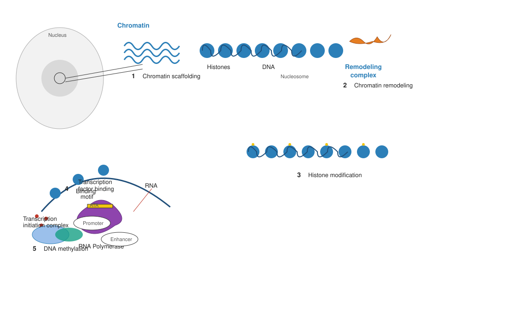
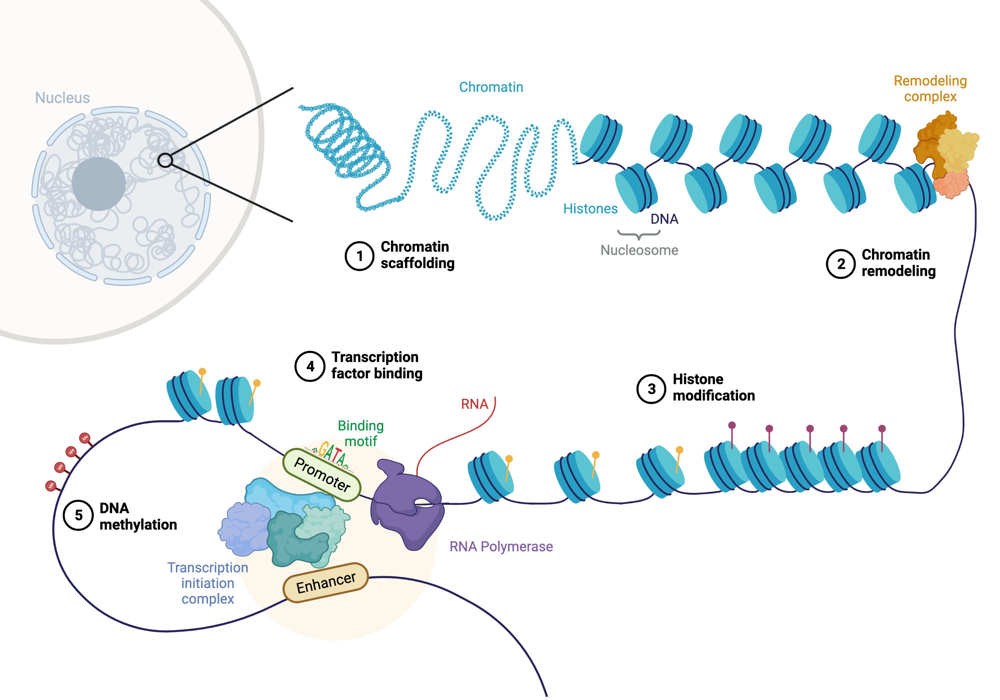

```{r}
#| label: setup
#| include: false
library(tidyverse); library(knitr); library(gridExtra)
theme_set(theme_minimal(base_size = 14)); set.seed(2026)
```

# Lecture 07: Functional Analysis {background-color="#2c3e50"}

## Where this lecture fits

-   Previous: [Lec 06 — DESeq2: Bulk Fundamentals + Pseudobulk DE](Lecture_06_DESeq2_DE.html)
-   **You are here:** Lec 07 — *taking a per-cell-type DE table and turning it into biology*
-   Next: [Lec 08 — Differential Abundance with miloR](Lecture_08_DifferentialAbundance.html)
-   **Companion tutorial:** [Tutorial 07 — Functional Analysis](../Exercise_Folder/Tutorial_07_FunctionalAnalysis.html)
-   **Companion book chapter:** [Chapter 7 — Functional Analysis: GO, GSEA, Reactome](../Resources_Folder/Chapter_07_FunctionalAnalysis.html)
-   **Parallel reading:** [scNotebooks Module 04 (functional analysis section)](https://integrativebioinformatics.github.io/scNotebooks/modules/en/module04/module04.html)

## Goals of this lecture

::: incremental
-   Read a DE table and ask "what biological themes are enriched here?"
-   Distinguish **over-representation analysis (ORA)** from **gene-set enrichment analysis (GSEA)** and know when to use each
-   Pick the right ontology / database — GO BP, GO MF, Reactome, KEGG, MSigDB Hallmark
-   Read enrichment plots — bar plot, dot plot, GSEA running enrichment, `compareCluster` cross-cell-type plot
-   Avoid the most common pitfalls (background-set mistakes, multiple-testing burden, redundant terms)
:::

::: callout-note
**Mental model.** Pseudobulk DE (Lec 06) gave you a long list of genes that change between conditions, *per cell type*. Functional analysis is the next zoom-out: instead of asking *"which genes?"*, you ask *"which biological processes?"* — collapsing thousands of genes into dozens of interpretable themes.
:::

# Part 1 — ORA vs GSEA {background-color="#2c3e50"}

## Why functional analysis — gene regulation in context

{fig-align="center" width="92%"}

-   DE gives a *list of changed genes*; functional analysis asks **which biological mechanisms link them**
-   Gene regulation operates across multiple layers: TFs, chromatin, signalling, post-transcriptional control
-   Pathway databases collapse these layers into named gene sets we can test

## Why functional analysis — gene regulation in context (dup1)

{fig-align="center" width="92%"}

## The two questions

| Method | Question | Input |
|---|---|---|
| **Over-Representation Analysis (ORA)** | Among my **significant genes**, are any biological terms over-represented relative to a background? | A *list* (set) of significant gene IDs + a "universe" |
| **Gene-Set Enrichment Analysis (GSEA)** | When my genes are **ranked** by direction-and-strength of change, do any term's genes cluster at the top or bottom? | A *ranked vector* of all tested genes |

Both methods exist for the same reason: to take \~thousands of genes and ask "what do they have in common, biologically?"

::: callout-tip
**Decision rule.** If you have a clean cutoff (e.g. `padj < 0.05 & |log2FC| > 1`) and the list is moderate-sized (50–500), **start with ORA**. If your effect is broad-but-modest (the entire ISG family slightly up, no single super-significant gene), **GSEA is more sensitive**. Run both when you can.
:::

## ORA — the hypergeometric test

For each gene set $S$, count:

-   $k$ = number of genes in **both** my significant list AND $S$
-   $n$ = number in $S$ ∩ universe
-   $K$ = number in my significant list
-   $N$ = number in universe

Compute $P(X \ge k)$ under the hypergeometric null. Adjust for multiple sets with BH.

```{r}
#| label: ora-cartoon
#| echo: false
#| fig-width: 9
#| fig-height: 4

set.seed(2026)
df <- tibble(
  term = c("Type I IFN response","Antiviral defense","Antigen presentation",
           "Cell cycle","DNA repair","Translation","Glycolysis","Mitochondrial respiration"),
  log_p = c(38, 32, 22, 9, 7, 5, 4, 3),
  count = c(45, 38, 28, 22, 18, 30, 12, 25)
)

ggplot(df, aes(x = log_p, y = fct_reorder(term, log_p), fill = count)) +
  geom_col() +
  scale_fill_viridis_c(name = "genes in set") +
  labs(title  = "ORA: top GO BP terms — STIM vs CTRL on monocytes",
       x = "−log10(p.adjust)", y = NULL) +
  theme_minimal(base_size = 12)
```

The IFN-related terms dominate (because the contrast is IFN-β stimulation). Cell-cycle / housekeeping show modest enrichment but at much lower significance.

## GSEA — using the whole ranking

```{r}
#| label: gsea-cartoon
#| echo: false
#| fig-width: 9
#| fig-height: 4

set.seed(2026)

# Simulate a ranked gene list and the running-enrichment scores for two pathways
n_genes <- 5000
log2fc  <- sort(rnorm(n_genes, mean = 0, sd = 0.4), decreasing = TRUE)
log2fc  <- log2fc + c(rnorm(50, 1.5, 0.2), rep(0, n_genes - 50))   # ISG genes near the top

is_isg <- c(rep(TRUE, 50), rep(FALSE, n_genes - 50))
is_random <- sample(c(rep(TRUE, 50), rep(FALSE, n_genes - 50)))

# Cumulative running ES
running_es <- function(hits, decay = 1.0) {
  hits_w   <- ifelse(hits,  abs(log2fc),  -decay/(n_genes - sum(hits)))
  hits_w[hits] <- hits_w[hits] / sum(abs(log2fc[hits]))
  cumsum(hits_w)
}

es_isg    <- running_es(is_isg)
es_random <- running_es(is_random)

dat <- tibble(rank = seq_len(n_genes),
              ES_ISG = es_isg, ES_random = es_random) |>
  pivot_longer(-rank, names_to = "set", values_to = "ES")

ggplot(dat, aes(rank, ES, color = set)) +
  geom_line(linewidth = 0.9) +
  geom_hline(yintercept = 0, linetype = 2, color = "grey60") +
  scale_color_manual(values = c(ES_ISG = "#c0392b", ES_random = "#7f8c8d"),
                     labels = c(ES_ISG = "ISG core panel",
                                ES_random = "matched random panel"),
                     name = NULL) +
  labs(title    = "GSEA: running enrichment on STIM-vs-CTRL log2FC ranking",
       subtitle = "ISG panel: high running ES at top of ranking; random panel: stays near 0",
       x = "Rank in DE list (top = up in STIM)",
       y = "Running enrichment score") +
  theme_minimal(base_size = 12) + theme(legend.position = "bottom")
```

The peak running ES is the **ES** for that set; its statistical significance comes from a permutation test, with **NES** (Normalized ES) reported alongside.

## When each wins

| Scenario | ORA | GSEA |
|---|---|---|
| Strong, well-separated effect (a few hits with `log2FC > 4`) | ✅ | ✅ |
| Coordinated, modest effect across a whole pathway (e.g. ISGs slightly up) | weak | ✅ |
| Threshold sensitivity matters (results jump when you change the FDR cutoff) | ❌ | ✅ |
| Your list of "significant" genes is short (<20) | ❌ | ✅ |
| Stakeholders want a "the X genes are enriched in Y" headline | ✅ | ❌ |

# Part 2 — Picking a database {background-color="#2c3e50"}

## The catalog

| Database | Strength | When to start here |
|---|---|---|
| **GO BP** (biological process) | Comprehensive, hierarchical, well-curated | Always run as a baseline |
| **GO MF / CC** (molecular function / cellular component) | Function & localization | When BP is dominated by generic terms |
| **Reactome** | Curated **signaling pathways**; modern | Immune / signaling biology |
| **KEGG** | Classic metabolic + signaling | Metabolism; legacy comparison |
| **MSigDB Hallmark** | 50 well-known, broad biological states | Headline figures, low-noise summaries |
| **WikiPathways** | Community-curated, fast updates | Niche pathways missing elsewhere |
| **Cell Ontology / Cell Marker DB** | Cell-type marker enrichment | When testing "is this an X-type cell?" |

## The redundancy problem

GO BP has \~30,000 terms; many overlap heavily. After ORA you'll see 50 hits like:

> *response to virus / type I interferon signaling pathway / cellular response to type I interferon / regulation of type I interferon signaling pathway / response to interferon-beta / ...*

These are the same biology described eight ways.

## Three fixes

::: incremental
-   **Use a smaller, curated database** for the headline (MSigDB Hallmark — only 50 sets), then GO BP for the mechanistic detail
-   **Cluster similar terms** with `enrichplot::pairwise_termsim()` + `treeplot()` — collapse the tree into themes
-   **Apply a stricter cutoff** (`pvalueCutoff = 0.01`, `qvalueCutoff = 0.05`) so the top 5 terms aren't 50 redundant ones
:::

## Run multiple databases — find the consensus

```{r}
#| label: multidb
#| echo: false
#| fig-width: 9
#| fig-height: 4

set.seed(2026)
df <- tibble(
  database = rep(c("GO BP","Reactome","Hallmark","KEGG"), each = 4),
  term     = c("type I IFN signaling","response to virus","defense response","antigen presentation",
               "Interferon Signaling","Antiviral mechanism by IFN","Cytokine signaling","DDX58/IFIH1-mediated",
               "INTERFERON ALPHA RESPONSE","INFLAMMATORY RESPONSE","INTERFERON GAMMA RESPONSE","TNFA SIGNALING VIA NFKB",
               "RIG-I-like receptor signaling","Cytosolic DNA-sensing pathway","Toll-like receptor signaling","NOD-like receptor signaling"),
  log_p    = c(40, 36, 28, 24,  35, 33, 29, 27,  44, 22, 30, 18,  21, 19, 16, 13)
)

ggplot(df, aes(x = log_p, y = fct_reorder(term, log_p), fill = database)) +
  geom_col() +
  facet_wrap(~ database, scales = "free_y", ncol = 2) +
  scale_fill_manual(values = c("GO BP" = "#27ae60", "Reactome" = "#3498db",
                                "Hallmark" = "#c0392b", "KEGG" = "#e67e22"),
                     guide = "none") +
  labs(title = "Same DE list, four databases — interferon biology shows up in all of them",
       x = "−log10(p.adjust)", y = NULL) +
  theme_minimal(base_size = 11)
```

Cross-database agreement is your strongest signal that a finding is real biology rather than a database artifact.

# Part 3 — Cross-cell-type comparison {background-color="#2c3e50"}

## The dot plot that earns its keep

```{r}
#| label: comparecluster
#| echo: false
#| fig-width: 11
#| fig-height: 4.4

set.seed(2026)
celltypes <- c("CD14 Mono","CD16 Mono","B","CD4 Naive T","CD4 Memory T","CD8 T","NK")
terms <- c("type I IFN signaling","antiviral defense","cell cycle G2/M",
           "T cell activation","cytokine secretion","antigen presentation",
           "lymphocyte chemotaxis","interferon-gamma response")

grid <- crossing(celltype = celltypes, term = terms) |>
  mutate(log_p = case_when(
    term == "type I IFN signaling"  ~ runif(n(), 12, 40),
    term == "antiviral defense"     ~ runif(n(), 8, 30),
    term == "antigen presentation" & celltype %in% c("B","CD14 Mono","CD16 Mono") ~ runif(n(), 10, 25),
    term == "T cell activation" & str_detect(celltype, "T") ~ runif(n(), 8, 22),
    term == "cell cycle G2/M" ~ runif(n(), 0, 5),
    term == "cytokine secretion" & celltype %in% c("CD14 Mono","CD16 Mono") ~ runif(n(), 6, 16),
    term == "lymphocyte chemotaxis" ~ runif(n(), 0, 6),
    term == "interferon-gamma response" ~ runif(n(), 4, 14),
    TRUE ~ runif(n(), 0, 4)
  ),
  count = pmax(rpois(n(), pmax(log_p / 2, 1)), 1))

grid$celltype <- factor(grid$celltype, levels = celltypes)
grid$term     <- factor(grid$term,     levels = rev(terms))

ggplot(grid, aes(celltype, term, size = count, color = log_p)) +
  geom_point() +
  scale_color_viridis_c(name = "−log10(p.adjust)", option = "D") +
  scale_size_continuous(name = "gene count", range = c(2, 8)) +
  labs(title = "compareCluster — STIM-vs-CTRL GO BP enrichment across cell types",
       x = NULL, y = NULL) +
  theme_minimal(base_size = 11) +
  theme(axis.text.x = element_text(angle = 45, hjust = 1))
```

Reading rules:

::: incremental
-   **Color** = strength of enrichment (more saturated = more significant)
-   **Size** = how many genes from the cell type's DE list overlap that term
-   A row that lights up across **every** cell type → the shared core response (here: type I IFN signaling)
-   A row that lights up in **only some** cell types → cell-type-specific biology (here: antigen presentation in monocytes + B cells, T-cell activation in T cells only)
:::

::: callout-tip
The `compareCluster` plot is the **single most informative figure** in cross-cell-type functional analysis. Lead with this in your manuscript figures; the per-cell-type bar plots are supplementary.
:::

# Part 4 — Common pitfalls {background-color="#2c3e50"}

## The five mistakes that bite

::: incremental
1.  **Wrong universe.** Default = "all annotated genes in the genome". *Correct* = "all genes you tested in DESeq2" (after low-count filter). The wrong universe inflates "common term" p-values.
2.  **Treating all enriched terms as biology.** Many GO terms are technical artifacts (mitochondrial, ribosomal, cell-cycle). If they top your list and you didn't expect them, suspect QC.
3.  **No multiple-testing correction across databases.** ORA across 4 databases × 30,000 terms = 120,000 tests. BH correction inside each database; don't forget to mention the database in your reported p-value.
4.  **Reporting raw p-values.** Always report `p.adjust` (BH) or `q-value`.
5.  **Ignoring direction in ORA.** ORA on "all DE genes" doesn't distinguish up-regulated from down-regulated. Run separately on each side, or use GSEA which handles this naturally.
:::

## Sanity-check the result against the question

::: callout-warning
**Always read the top-10 hit list aloud.** If it makes biological sense given your experimental contrast, good. If the top hit is "olfactory receptor activity" in a PBMC dataset, something is wrong. The expert eye on the term list is faster than any QC plot.
:::

# Part 5 — A workable workflow {background-color="#2c3e50"}

## The recommended pipeline

::: incremental
1.  Take per-cell-type pseudobulk DE table (Tut 06)
2.  For each cell type, define a **strict significant set** (`padj < 0.05 & |log2FC| > 0.5`) and a **universe** (all tested genes)
3.  Run **ORA** against MSigDB Hallmark, Reactome, GO BP — three databases
4.  Run **GSEA** against the same three, using the full log2FC ranking
5.  Build a **`compareCluster`** dot plot across cell types for ORA-significant terms
6.  Pick the top 5–10 themes by **cross-database agreement**
7.  Make a per-theme **gene-level table** showing which DE genes drove each enrichment
:::

## Tools we use

::: incremental
-   **`clusterProfiler`** (R) — the workshop default. Handles ORA + GSEA + Reactome + KEGG + MSigDB in one API.
-   **`enrichplot`** — the visualization companion to clusterProfiler. `dotplot`, `cnetplot`, `emapplot`, `treeplot`, `gseaplot2`.
-   **`fgsea`** — extremely fast pure-GSEA implementation; useful when clusterProfiler is too slow.
-   **`gprofiler2`** (R / Python) — alternative web API; multi-organism support out of the box.
:::

# Recap & what's next {background-color="#2c3e50"}

## What to remember from Lecture 07

::: incremental
-   ORA asks "which terms are over-represented in my significant list?"; GSEA asks "where do the term's genes sit in my full ranking?"
-   Always run **multiple databases** and look for consensus
-   Always pass a **correct universe** to ORA — your tested genes, not the whole genome
-   The `compareCluster` dot plot across cell types is the single best summary figure
-   ORA + GSEA + a `compareCluster` plot, on three databases, with a careful read of top hits — that's the full functional-analysis pipeline
:::

## Coming up next

-   **Lec 08** — [Differential Abundance with miloR](Lecture_08_DifferentialAbundance.html) — the *complement* to functional analysis: instead of "which genes change?", "do cell-type proportions change?"
-   **Hands-on:** [Tutorial 07 — Functional Analysis](../Exercise_Folder/Tutorial_07_FunctionalAnalysis.html) — runs everything above on the workshop's `ifnb` STIM-vs-CTRL pseudobulk DE table

## Further reading

-   Yu *et al.* 2012 — `clusterProfiler` paper, [doi:10.1089/omi.2011.0118](https://doi.org/10.1089/omi.2011.0118)
-   Subramanian *et al.* 2005 — original GSEA paper, [doi:10.1073/pnas.0506580102](https://doi.org/10.1073/pnas.0506580102)
-   Yu's [Biomedical Knowledge Mining book](https://yulab-smu.top/biomedical-knowledge-mining-book/)
-   [scNotebooks Module 04 GO enrichment section](https://integrativebioinformatics.github.io/scNotebooks/modules/en/module04/module04.html)
