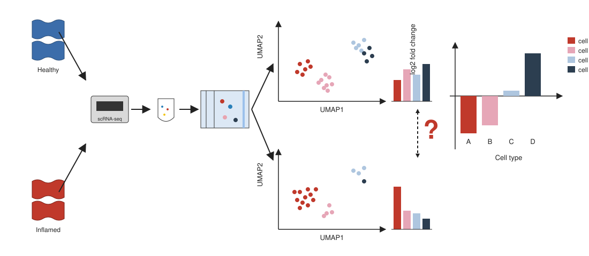
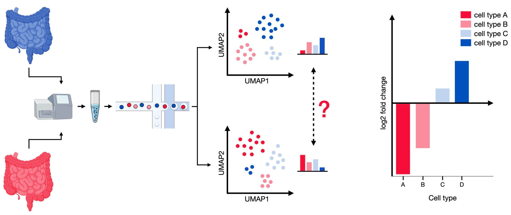

```{r}
#| label: setup
#| include: false
library(tidyverse); library(knitr); library(gridExtra); library(patchwork)
theme_set(theme_minimal(base_size = 14)); set.seed(2026)
```

# Lecture 08: Differential Abundance {background-color="#2c3e50"}

## Where this lecture fits

-   Previous: [Lec 05 — Functional Analysis](Lecture_07_FunctionalAnalysis.html)
-   **You are here:** Lec 08 — *the compositional complement to differential expression*
-   Next: [Lec 07 — Reference-based Annotation](Lecture_09_Reference_Annotation.html)
-   **Companion tutorial:** [Tutorial 07 — Differential Abundance with miloR](../Exercise_Folder/Tutorial_07_DifferentialAbundance.html)
-   **Parallel reading:** [scNotebooks Module 04 (differential abundance section)](https://integrativebioinformatics.github.io/scNotebooks/modules/en/module04/module04.html)

## Goals of this lecture

::: incremental
-   See **why** differential abundance is a different question from differential expression
-   Understand the limits of cluster-level proportion tests
-   Read the **miloR** algorithm — neighbourhoods on a kNN graph + per-neighbourhood NB GLM + **SpatialFDR**
-   Read the signature miloR plots (neighbourhood graph, beeswarm)
-   Avoid common mistakes: pseudo-replicates, cluster-boundary artifacts, condition imbalance
:::

# The two questions, side by side {background-color="#2c3e50"}

## Compositional analysis — overview

{fig-align="center" width="92%"}

-   The **composition** of cell types in a sample is itself a measurement
-   A condition can change the **mix of types** even when within-type expression is unchanged
-   This lecture covers the statistical machinery for testing those proportion shifts

## Compositional analysis — overview (dup1)

{fig-align="center" width="92%"}

## Differential expression vs differential abundance

| | Differential Expression (Lec 04) | Differential Abundance (Lec 08) |
|---|---|---|
| Question | For cells of the same type, **which genes change** between conditions? | Do **cell-type proportions** themselves change between conditions? |
| Tool | `DESeq2` on pseudobulk | `miloR` on kNN neighbourhoods |
| Unit of test | Per gene, per cell type | Per neighbourhood (a small group of similar cells) |
| Statistical test | Negative binomial GLM on counts | Negative binomial GLM on cell counts per neighbourhood |
| Output | per-gene log2FC + padj | per-neighbourhood log2FC + SpatialFDR |

::: callout-note
**They are complementary, not redundant.** A perturbation can change cell-type proportions, gene expression within types, both, or neither. A complete condition-level analysis reports both.
:::

## A toy example — same dataset, four possible patterns

```{r}
#| label: de-vs-da-cartoon
#| echo: false
#| fig-width: 11
#| fig-height: 4

set.seed(2026)
df <- tibble(
  pattern   = factor(rep(c("DE only", "DA only", "DE + DA", "Neither"), each = 2),
                     levels = c("DE only", "DA only", "DE + DA", "Neither")),
  condition = rep(c("CTRL","STIM"), 4),
  proportion = c(0.30,0.30,  0.20,0.45,  0.20,0.40,  0.30,0.30),
  ISG_score  = c(0.05, 1.20,  0.05, 0.10,  0.05, 1.30,  0.05, 0.10)
)

p1 <- ggplot(df, aes(condition, proportion, fill = condition)) +
  geom_col() + facet_wrap(~ pattern, nrow = 1) +
  scale_fill_manual(values = c(CTRL = "#34495e", STIM = "#e67e22"), guide = "none") +
  ylim(0, 0.5) +
  labs(title = "Cell-type proportion (Differential Abundance)",
       x = NULL, y = "Proportion of total cells") +
  theme_minimal(base_size = 11)

p2 <- ggplot(df, aes(condition, ISG_score, fill = condition)) +
  geom_col() + facet_wrap(~ pattern, nrow = 1) +
  scale_fill_manual(values = c(CTRL = "#34495e", STIM = "#e67e22"), guide = "none") +
  ylim(0, 1.5) +
  labs(title = "Mean ISG score within the cell type (Differential Expression)",
       x = NULL, y = "Mean module score") +
  theme_minimal(base_size = 11)

p1 / p2
```

::: incremental
-   **DE only** — same cell-type proportion, but every cell shifts expression. Common pattern for IFN-β–stimulated mature cells.
-   **DA only** — proportion shifts, but each cell of the type has the same expression profile. Common pattern for cell-cycle expansion or recruitment.
-   **DE + DA** — both move. Common in disease vs healthy.
-   **Neither** — no change. The null.
:::

# The naive approach — and why it fails {background-color="#2c3e50"}

## Cluster-level Fisher's exact

The simple thing to do is: count cells per (cluster, sample), make a 2×2 table per cluster (cluster × condition), run Fisher's exact / chi-squared.

```{r}
#| label: cluster-level
#| echo: false
#| fig-width: 9
#| fig-height: 3.6

set.seed(2026)
clusters <- c("Naive T","Memory T","Activated T","CD14 Mono","CD16 Mono","B","NK","DC")
prop_ctrl <- c(0.18, 0.16, 0.05, 0.20, 0.06, 0.13, 0.18, 0.04)
prop_stim <- c(0.12, 0.18, 0.18, 0.20, 0.07, 0.13, 0.08, 0.04)

df <- bind_rows(
  tibble(cluster = clusters, condition = "CTRL", prop = prop_ctrl),
  tibble(cluster = clusters, condition = "STIM", prop = prop_stim)
)

ggplot(df, aes(cluster, prop, fill = condition)) +
  geom_col(position = "dodge") +
  scale_fill_manual(values = c(CTRL = "#34495e", STIM = "#e67e22"), name = NULL) +
  labs(title = "Cluster-level proportions — CTRL vs STIM",
       x = NULL, y = "Proportion") +
  theme_minimal(base_size = 11) +
  theme(axis.text.x = element_text(angle = 30, hjust = 1),
        legend.position = "bottom")
```

This works for big, well-separated clusters but breaks in three ways:

::: incremental
1.  **Hard cluster boundaries are arbitrary.** A cell type that spans two clusters at one resolution and one cluster at another gives a different test result.
2.  **Within-cluster heterogeneity is invisible.** A cluster of "T cells" that contains both expanding-activated and shrinking-naive populations will show NO net change at the cluster level — but real DA at finer resolution.
3.  **Cells aren't independent samples.** Per-cell counting treats every cell as a replicate; the right unit is the donor / sample.
:::

::: callout-warning
**The naive cluster-level Fisher test is the most common mistake in scRNA-seq DA.** It's anti-conservative (cell counts inflate the effective sample size) and resolution-dependent. Use miloR instead.
:::

# How miloR works {background-color="#2c3e50"}

## The five-step algorithm

::: incremental
1.  Build the **kNN graph** on the integrated PC reduction (the same one you use for clustering)
2.  Define **overlapping neighbourhoods** — each neighbourhood is a representative cell + its k nearest neighbours; sample \~1000 neighbourhoods total
3.  **Count cells per neighbourhood per sample** (one row per donor × condition × neighbourhood)
4.  Fit a **negative-binomial GLM** per neighbourhood with your design (`~ condition`, optionally `+ donor`) — gets a log2FC per neighbourhood
5.  Apply **SpatialFDR** correction across overlapping neighbourhoods (a weighted BH that accounts for the correlation between adjacent tests)
:::

## Why neighbourhoods, not clusters?

```{r}
#| label: neigh-vs-cluster
#| echo: false
#| fig-width: 11
#| fig-height: 4.4

set.seed(2026)

# Simulate a 2D embedding with two cell types and a continuum
n <- 1500
x <- c(rnorm(n/3, -2, 0.7), rnorm(n/3, 0, 0.7), rnorm(n/3, 2, 0.7))
y <- c(rnorm(n/3, 0, 0.7), rnorm(n/3, 0, 0.7), rnorm(n/3, 0, 0.7))
true_da <- c(rnorm(n/3, -1.5, 0.3), rnorm(n/3, 0, 0.4), rnorm(n/3, 1.5, 0.3))   # smooth gradient
cluster <- factor(ifelse(x < -0.5, "Cluster A", ifelse(x > 0.5, "Cluster B", "Cluster A")))  # bimodal hard split

dat <- tibble(x, y, true_da, cluster)

p1 <- ggplot(dat, aes(x, y, color = true_da)) +
  geom_point(alpha = 0.7, size = 0.8) +
  scale_color_gradient2(low = "#3498db", mid = "white", high = "#c0392b",
                        name = "log2FC\n(STIM/CTRL)") +
  labs(title = "Underlying DA gradient (smooth)") +
  theme_minimal(base_size = 11) + theme(legend.position = "right")

p2 <- ggplot(dat, aes(x, y, color = cluster)) +
  geom_point(alpha = 0.7, size = 0.8) +
  scale_color_manual(values = c("Cluster A" = "#2c3e50", "Cluster B" = "#16a085"), name = NULL) +
  labs(title = "Cluster-level test loses the gradient") +
  theme_minimal(base_size = 11) + theme(legend.position = "bottom")

p3 <- ggplot(dat, aes(x, y, color = true_da)) +
  geom_point(alpha = 0.7, size = 0.8) +
  scale_color_gradient2(low = "#3498db", mid = "white", high = "#c0392b",
                        name = "log2FC\n(neighbourhood)") +
  labs(title = "Neighbourhood-level test recovers it") +
  theme_minimal(base_size = 11) + theme(legend.position = "right")

p1 + p2 + p3
```

The middle panel shows what cluster-level DA "sees" — two homogeneous groups. The right panel is what miloR's neighbourhood-level test recovers — the smooth gradient that's actually there.

## The neighbourhood graph (signature miloR plot)

```{r}
#| label: nhood-graph
#| echo: false
#| fig-width: 9
#| fig-height: 4.5

set.seed(2026)
n_nhoods <- 320
xn <- c(rnorm(n_nhoods/4, -3, 0.8), rnorm(n_nhoods/4, 0, 0.8),
        rnorm(n_nhoods/4, 3, 0.8),  rnorm(n_nhoods/4, 0, 1.5))
yn <- c(rnorm(n_nhoods/4, 2, 0.7), rnorm(n_nhoods/4, -2, 0.7),
        rnorm(n_nhoods/4, 1, 0.7), rnorm(n_nhoods/4, -1, 0.7))
log2fc <- c(rnorm(n_nhoods/4, -1.0, 0.4), rnorm(n_nhoods/4, 1.5, 0.5),
            rnorm(n_nhoods/4, 0.0, 0.3), rnorm(n_nhoods/4, 0.7, 0.5))
size <- pmax(rpois(n_nhoods, 50), 8)
sig  <- abs(log2fc) > 0.5

dat <- tibble(x = xn, y = yn, log2fc = log2fc, size = size, sig = sig)

ggplot(dat, aes(x, y, size = size, color = log2fc, alpha = ifelse(sig, 1, 0.4))) +
  geom_point() +
  scale_color_gradient2(low = "#3498db", mid = "white", high = "#c0392b",
                        name = "log2FC", limits = c(-2, 2.5)) +
  scale_size_continuous(name = "n_cells in nhood", range = c(0.6, 7)) +
  scale_alpha_identity() +
  labs(title = "miloR neighbourhood graph — STIM vs CTRL on ifnb",
       subtitle = "Each dot = one neighbourhood. Red = enriched in STIM; blue = enriched in CTRL; faint = SpatialFDR > 0.1",
       x = "UMAP1", y = "UMAP2") +
  theme_minimal(base_size = 11)
```

Reading rules:

::: incremental
-   Each **dot** is one neighbourhood (\~50–200 cells from the same kNN region)
-   **Color** = log2FC of STIM vs CTRL within that neighbourhood
-   **Size** = number of cells in the neighbourhood (bigger = more cells in that part of the graph)
-   **Faint** = SpatialFDR > 0.1 (not significant)
-   **Bright red cluster of dots** = a region of cell-type space expanded in STIM
-   **Bright blue cluster of dots** = a region depleted in STIM
:::

## The beeswarm — DA per cell type

```{r}
#| label: beeswarm
#| echo: false
#| fig-width: 9
#| fig-height: 4.4

set.seed(2026)
celltypes <- c("CD14 Mono","CD16 Mono","B","CD4 Naive T","CD4 Memory T","T activated","CD8 T","NK","DC","Mk")
n_per <- c(30, 12, 25, 28, 20, 18, 22, 18, 8, 6)
mean_lfc <- c(0.6, 0.4, 0.1, -0.4, -0.1, 1.5, 0.0, -0.2, 0.3, 0.0)

dat <- map2_dfr(celltypes, seq_along(celltypes), function(ct, i) {
  tibble(celltype = ct,
         logFC    = rnorm(n_per[i], mean_lfc[i], 0.4),
         spatfdr  = runif(n_per[i], 0, 0.3))
})

ggplot(dat, aes(celltype, logFC, color = spatfdr)) +
  geom_jitter(width = 0.3, alpha = 0.85, size = 1.6) +
  geom_hline(yintercept = 0, linetype = 2, color = "grey40") +
  scale_color_viridis_c(direction = -1, name = "SpatialFDR") +
  labs(title    = "miloR beeswarm — DA per cell type, STIM vs CTRL on ifnb",
       subtitle = "T activated expands strongly; CD4 Naive T contracts mildly; the rest mostly static",
       x = NULL, y = "log2FC (per neighbourhood)") +
  theme_minimal(base_size = 11) +
  theme(axis.text.x = element_text(angle = 30, hjust = 1))
```

::: callout-tip
**Read the beeswarm vertically.** A cell type with most points above zero is **enriched** in STIM; below zero, **depleted**. A cell type with points scattered above AND below zero contains both expanding and contracting subpopulations — the case where neighbourhood-level testing recovers what cluster-level testing would miss.
:::

# Practical considerations {background-color="#2c3e50"}

## How many neighbourhoods? How many cells per neighbourhood?

::: incremental
-   `prop = 0.1` (sample 10% of cells as neighbourhood centres) is the default and works for most datasets in the 5k–50k range
-   Aim for the median neighbourhood size around **50–200 cells**. Too small (\<30) → underpowered; too large (\>500) → spatial smoothing that loses fine structure
-   `plotNhoodSizeHist(milo)` is the go-to diagnostic — peak between 50 and 200 means you're set
-   If your peak is too small, increase `k` (graph k-nearest-neighbours) from 30 → 50 or 75
:::

## Replication — the same rule as DESeq2

```{r}
#| label: replication
#| echo: false
#| fig-width: 9
#| fig-height: 3

dat <- tibble(
  setup     = c("1 vs 1 sample", "2 vs 2 samples", "4 vs 4 samples", "8 vs 8 samples"),
  power     = c(0, 0.18, 0.55, 0.85)
)

ggplot(dat, aes(setup, power, fill = power)) +
  geom_col() +
  scale_fill_viridis_c(option = "D", limits = c(0, 1), guide = "none") +
  labs(title = "miloR power scales with sample replication, not cell count",
       subtitle = "Cells per neighbourhood help precision; sample count drives the GLM",
       x = NULL, y = "Approximate detection power (effect size = 1)") +
  theme_minimal(base_size = 11)
```

::: callout-warning
**No replication, no inference.** A 1-vs-1 sample comparison gives miloR no degrees of freedom; you'll get NA p-values everywhere. Plan for 4 vs 4 minimum if you want any chance of detecting modest effects.
:::

## Designs that work well

| Design | Notes |
|---|---|
| `~ condition` | Two-condition contrast, no other covariates |
| `~ donor + condition` | Paired design (donors balanced across conditions) — preferred when you have it |
| `~ batch + condition` | Block on batch effects |
| `~ severity` | Continuous covariate (e.g. clinical severity score) |
| `~ donor + group + condition + group:condition` | Interaction tests |

The full DESeq2-style design framework is available — including interactions, continuous covariates, and random-effect-style blocking.

# Pitfalls {background-color="#2c3e50"}

## Five mistakes worth knowing

::: incremental
1.  **Running on the unintegrated kNN graph.** If batch effect dominates the embedding, neighbourhoods cluster by sample, and DA falsely "detects" composition shifts that are really batch artifacts. Always run miloR on the **integrated** reduction.
2.  **Synthetic donor splits passed as biological replicates.** Splitting one large library into "pseudo-donors" gives miloR fake degrees of freedom — the test is anti-conservative. The workshop tutorial flags this with a `set.seed(2026)` synthetic split for illustration only; never report those p-values as real findings.
3.  **Imbalanced sample sizes.** 8 STIM vs 1 CTRL gives almost no information about the CTRL distribution. Aim for balanced designs.
4.  **Ignoring `seurat_annotations` mapping.** Without `annotateNhoods()`, you'll get neighbourhood-level results but no easy way to summarise by cell type. Always run `annotateNhoods` after `testNhoods`.
5.  **Reading the UMAP without the SpatialFDR filter.** A red cluster of dots that all have SpatialFDR > 0.5 is just visual noise. Filter `da_results$SpatialFDR < 0.1` before drawing conclusions.
:::

# Recap & what's next {background-color="#2c3e50"}

## What to remember from Lecture 08

::: incremental
-   **DE asks "which genes change?"; DA asks "do proportions change?"** — independent questions, both worth running
-   Cluster-level DA tests are anti-conservative and resolution-dependent — **don't use them**
-   `miloR` works at the **neighbourhood level** on the integrated kNN graph, with NB GLM + SpatialFDR
-   Read DA results with the **neighbourhood graph** (spatial pattern) and the **beeswarm** (per cell type)
-   Need replication — at minimum 4 vs 4 biological replicates, ideally with paired donors
-   Always run miloR on the **integrated** reduction, not the unintegrated PCA
:::

## Coming up next

-   **Lec 07** — [Reference-based Annotation](Lecture_09_Reference_Annotation.html) — automated cell-type calling
-   **Hands-on:** [Tutorial 07 — Differential Abundance](../Exercise_Folder/Tutorial_07_DifferentialAbundance.html)

## Further reading

-   Dann *et al.* 2022, *Nat Biotechnol* — miloR paper, [doi:10.1038/s41587-021-01033-z](https://doi.org/10.1038/s41587-021-01033-z)
-   Büttner *et al.* 2021 — *scCODA*, a Bayesian compositional alternative, [doi:10.1038/s41467-021-27150-6](https://doi.org/10.1038/s41467-021-27150-6)
-   Phipson *et al.* 2022 — *propeller*, fast linear-model-based DA, [doi:10.1093/bioinformatics/btac582](https://doi.org/10.1093/bioinformatics/btac582)
-   [scNotebooks Module 04 (DA section)](https://integrativebioinformatics.github.io/scNotebooks/modules/en/module04/module04.html)
