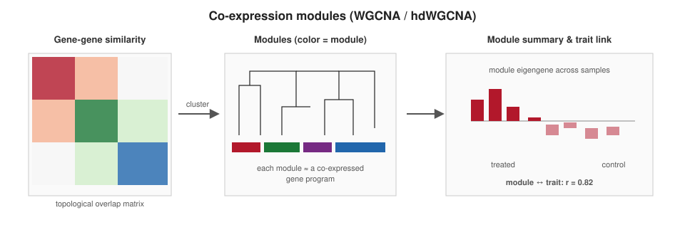

```{r}
#| label: setup
#| include: false
library(tidyverse); library(knitr)
theme_set(theme_minimal(base_size = 14)); set.seed(2026)
```

# Lecture 11: WGCNA {background-color="#2c3e50"}

## Where this lecture fits

-   Previous: [Lec 08 — Bulk + scATAC-seq](Lecture_10_ATACseq.html)
-   **You are here:** Lec 11 — *finding co-expressed gene modules and tying them to phenotype*
-   **Companion tutorial:** [Tutorial 11 — WGCNA on GSE152418](../Exercise_Folder/Tutorial_11_WGCNA.html)

## Goals of this lecture

::: incremental
-   Understand what a **co-expression network** is and what makes it "weighted"
-   Pick a **soft-thresholding power** so the network is approximately scale-free
-   Build modules with **dynamic tree cut**, summarize them with **eigengenes**
-   Correlate modules with sample traits — and read the resulting heatmap
-   Apply WGCNA to **scRNA-seq via pseudobulk or metacells (hdWGCNA)**
:::

::: callout-note
**Why care about modules?** A DE list of 800 genes is hard to interpret. A handful of co-regulated **modules** — each summarized by an eigengene and tied to a trait — is easy to act on. WGCNA reframes "which genes change?" as "which programs change?"
:::

# Part 1 — The idea {background-color="#2c3e50"}

## WGCNA — the concept

{fig-align="center" width="92%"}

-   **Step back from individual genes** — WGCNA groups co-expressed genes into **modules** that move together across samples
-   Each module is summarized by an **eigengene**, then correlated with traits/conditions
-   Outputs are *programs*, not gene lists — much easier to interpret and act on

## From correlations to a network

::: incremental
-   For each pair of genes (i, j) compute Pearson **correlation** $r_{ij}$ across samples
-   Raise to a soft-thresholding power $\beta$: $a_{ij} = |r_{ij}|^{\beta}$ — emphasizes strong correlations, dampens weak ones
-   Result is a **weighted adjacency matrix** — every gene is connected to every other gene, but most edges are near zero
-   Convert to a **topological overlap matrix (TOM)** so genes that share many neighbours are clustered together
:::

## Why "weighted"?

A hard threshold (binary network) loses information: any gene pair just barely above the cutoff looks identical to a perfectly correlated one. The weighted soft-thresholding preserves the gradient — and Zhang & Horvath (2005) showed it produces more biologically meaningful modules.

## Picking the soft-threshold power $\beta$

::: incremental
-   Choose the smallest $\beta$ for which the network is **approximately scale-free** ($R^2 \gtrsim 0.8$)
-   Typical values: **6 for unsigned**, **12 for signed** networks (rule of thumb from Horvath)
-   Use `pickSoftThreshold()` — it returns the $R^2$ vs. $\beta$ table
:::

```r
library(WGCNA)
sft <- pickSoftThreshold(t(expr), powerVector = c(1:10, seq(12, 20, by = 2)),
                         networkType = "signed", verbose = 5)
plot(sft$fitIndices$Power, -sign(sft$fitIndices$slope) * sft$fitIndices$SFT.R.sq,
     xlab = "Soft Threshold (power)", ylab = "Scale Free Topology Model Fit, R^2")
abline(h = 0.80, col = "red")
```

::: callout-warning
**If no β gives R² > 0.8** your data is probably too small (\< \~20 samples), or contains technical structure (batches) overwhelming the biological signal. Fix that *before* running WGCNA — increasing β will not save you.
:::

# Part 2 — Modules {background-color="#2c3e50"}

## From TOM to modules

::: incremental
1.  Compute TOM: $\textrm{TOM}_{ij} = \frac{\sum_u a_{iu} a_{uj} + a_{ij}}{\min(k_i, k_j) + 1 - a_{ij}}$
2.  Cluster genes by **`1 - TOM`** with average linkage
3.  Cut the dendrogram with **dynamic tree cut** (`cutreeDynamic`) → modules (one per "branch")
4.  Merge modules whose **eigengenes** are highly correlated (> 0.75) — avoids redundant near-duplicate modules
:::

```r
bwnet <- blockwiseModules(t(expr),
                          power            = 18,        # from pickSoftThreshold
                          networkType      = "signed",
                          TOMType          = "signed",
                          minModuleSize    = 30,
                          mergeCutHeight   = 0.25,
                          numericLabels    = FALSE,
                          maxBlockSize     = 14000)
table(bwnet$colors)         # genes per module — colours are the WGCNA convention
```

## Module eigengenes — the per-module "summary gene"

For each module, the **first principal component** of the module's expression matrix is the **module eigengene (ME)**. It's a single number per sample per module — and that's what you correlate with traits.

```r
MEs <- moduleEigengenes(t(expr), bwnet$colors)$eigengenes
```

::: callout-tip
**Eigengenes are interpretable.** A high ME for `MEturquoise` in patient X means the genes of that module are coordinately *up* in X. They reduce a 200-gene module to one column you can put in any model.
:::

# Part 3 — Module–trait relationships {background-color="#2c3e50"}

## Correlate modules with phenotypes

```r
trait <- model.matrix(~ severity, data = phenoData)[, -1]   # one-hot encoded
moduleTraitCor    <- cor(MEs, trait, use = "pairwise.complete.obs")
moduleTraitPvalue <- corPvalueStudent(moduleTraitCor, n = nrow(MEs))
labeledHeatmap(Matrix      = moduleTraitCor,
               xLabels     = colnames(trait),
               yLabels     = colnames(MEs),
               textMatrix  = signif(moduleTraitPvalue, 2),
               colors      = blueWhiteRed(50))
```

## Reading the heatmap

::: incremental
-   Each cell: a Pearson **r** between a module eigengene and a trait, with the p-value
-   Modules with *|r| \> 0.5* and *p \< 0.05* are candidates
-   **Hub genes** within a strong module = highest **module membership (kME)** — these are your priority candidates for follow-up
-   Always cross-check that hub genes make biological sense (GO / KEGG enrichment of the module)
:::

::: callout-warning
**Multiple testing.** A WGCNA grid is many tests. Prefer FDR-adjusted p-values, and always check that a "significant" module survives a permutation null on shuffled trait labels.
:::

# Part 4 — WGCNA on single-cell data {background-color="#2c3e50"}

## Why classic WGCNA struggles on raw scRNA

::: incremental
-   Sparsity: \~95% zeros makes pairwise correlations dominated by joint zeros
-   No replicates: each cell is its own column → noise drowns the structure
-   Solution: **aggregate first**, network second
:::

## Two practical strategies

| Strategy | When to use | Tools |
|----|----|----|
| **Pseudobulk** per (sample × cell type) | You have ≥ \~20 samples × cell-types | `AggregateExpression()` → classic `WGCNA` |
| **Metacells** (k-NN aggregates within a cell type) | Single-condition atlas; rich within-cluster structure | **hdWGCNA** (Morabito et al. 2023) |

```r
# hdWGCNA sketch (signed, per-celltype)
seu <- SetupForWGCNA(seu, gene_select = "fraction", fraction = 0.05,
                     wgcna_name = "Tcells")
seu <- MetacellsByGroups(seu, group.by = "celltype",
                         k = 25, max_shared = 10, ident.group = "celltype")
seu <- NormalizeMetacells(seu)
seu <- TestSoftPowers(seu, networkType = "signed")
seu <- ConstructNetwork(seu, soft_power = 9, setDatExpr = FALSE)
```

::: callout-note
**hdWGCNA's metacells are not the same as Patel's pseudobulk.** Metacells aggregate *within* a cell type (creating "super-cells" inside the cluster), while pseudobulk aggregates *all* cells of one type per sample. Use metacells when you have *one* condition and want intra-cluster structure; use pseudobulk when you have *multiple* samples / conditions.
:::

# Part 5 — A workable WGCNA workflow {background-color="#2c3e50"}

## Checklist

::: incremental
1.  **QC**: `goodSamplesGenes()`, drop sample/gene outliers
2.  **Normalize**: VST (`DESeq2::vst`) for bulk; log-normalize per cell type for pseudobulk
3.  **Cluster samples** (`hclust` on Euclidean distance) — drop visible outliers before networking
4.  **Pick power**: `pickSoftThreshold` to scale-free $R^2 \gtrsim 0.8$
5.  **Build network**: `blockwiseModules` (signed, TOMType = "signed")
6.  **Correlate** module eigengenes with traits; flag |r| \> 0.5
7.  **Hub genes** by `kME`; functional enrichment per module
8.  **Validate** in an independent dataset before claiming biology
:::

::: callout-tip
**Reproducibility:** set the random seed (`set.seed(...)`) before `blockwiseModules` — module colour assignment is deterministic only if the seed is fixed.
:::

# Recap {background-color="#2c3e50"}

## What to remember from Lecture 07

::: incremental
-   WGCNA finds **modules** of co-expressed genes; eigengenes summarize them per sample
-   Choose **β** to make the network approximately scale-free, not the largest β you can fit
-   The interesting output is *module–trait correlations* + *hub genes*
-   Don't run WGCNA directly on raw single-cell counts — **pseudobulk** or **hdWGCNA metacells** first
-   Validate in an independent dataset
:::

## Companion tutorial

[Tutorial 11 — WGCNA on GSE152418](../Exercise_Folder/Tutorial_11_WGCNA.html) walks through Patel's worked example: COVID-19 patient PBMC bulk RNA-seq, building a signed network, and correlating modules with disease severity.

## Further reading

-   Langfelder & Horvath (2008) *BMC Bioinformatics* — the original WGCNA paper
-   Morabito et al. (2023) *Cell Reports Methods* — hdWGCNA
-   [WGCNA package tutorials](https://horvath.genetics.ucla.edu/html/CoexpressionNetwork/Rpackages/WGCNA/Tutorials/) — Horvath's official walkthroughs
-   [Patel's `WGCNA.R`](https://github.com/kpatel427/YouTubeTutorials/blob/main/WGCNA.R) — the basis for our Tutorial 07
