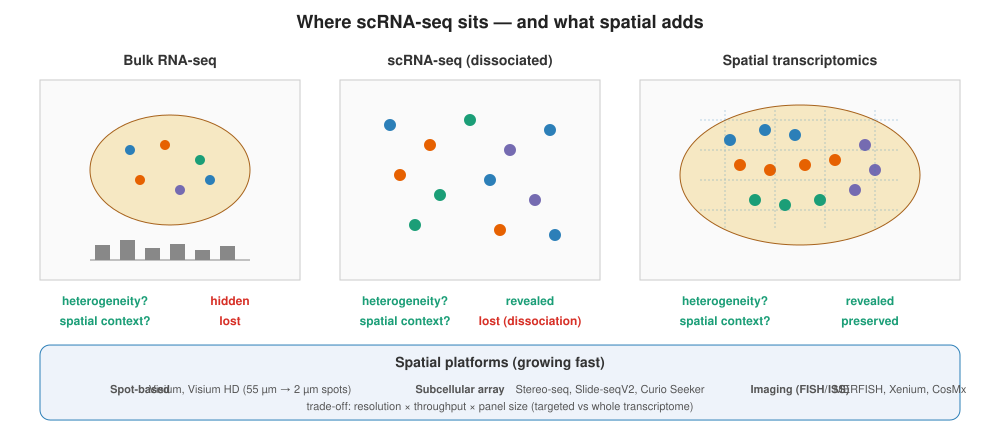

```{r}
#| label: setup
#| include: false
library(tidyverse); library(knitr); library(gridExtra); library(patchwork)
theme_set(theme_minimal(base_size = 14)); set.seed(2026)
```

# Lecture 12: Spatial Transcriptomics {background-color="#2c3e50"}

## Where this lecture fits

-   Previous: [Lec 09 — WGCNA](Lecture_11_WGCNA.html)
-   **You are here:** Lec 12 — *measuring gene expression while keeping the tissue context*
-   Next: [Lec 11 — FAIR Principles & Data Sharing](Lecture_13_FAIR_DataSharing.html)
-   **Companion tutorial:** [Tutorial 11 — Spatial Transcriptomics with Visium](../Exercise_Folder/Tutorial_11_Spatial_Transcriptomics.html)
-   **Parallel reading:** [scNotebooks Module 10](https://integrativebioinformatics.github.io/scNotebooks/modules/en/module10/module10.html)

## Goals of this lecture

::: incremental
-   Understand **what spatial transcriptomics measures** that scRNA-seq cannot
-   Compare the major technologies — **Visium**, **Visium HD**, **Xenium**, **MERFISH**, **CosMx** — by resolution / throughput / coverage
-   Read a Visium experiment as a **spot-level** dataset (≠ single-cell)
-   Apply the standard analysis pipeline: QC → SCTransform → cluster → spatially variable features → integration
-   Know when to use **deconvolution** (RCTD, CARD, cell2location) vs **spatial clustering** (BANKSY, STAGATE)
-   Recognize the limits — bin size vs cell size, edge artifacts, depth heterogeneity
:::

# Part 1 — What does "spatial" buy us? {background-color="#2c3e50"}

## The dissociation lie

scRNA-seq starts with **dissociation**: tissue → cell suspension. That gives you each cell's transcriptome but loses **everywhere it ever was** in the tissue. For developmental biology, immunology, and disease microenvironments, position is the answer to half your questions.

::: incremental
-   Where in the tumor are the exhausted T cells? Adjacent to which tumor sub-clones?
-   In the developing kidney, which transcriptional state precedes which?
-   Are immune cells in the ductal periphery or the lobular core? Granular / scattered or concentrated in foci?
-   Which genes are expressed only at tissue boundaries, where dissociation would shred the spatial signal?
:::

## Spatial transcriptomics at a glance

{fig-align="center" width="92%"}

-   Counts plus **coordinates** — every observation has a `(x, y)` location in the tissue
-   Different platforms make different trade-offs between **resolution**, **gene panel size**, and **field-of-view**
-   The downstream toolchain reuses scRNA-seq machinery but adds spatial-aware steps (Moran's I, deconvolution, region detection)

## What spatial measures

```{r}
#| label: spatial-vs-sc
#| echo: false
#| fig-width: 11
#| fig-height: 4.4

set.seed(2026)
make_tissue <- function(label) {
  expand.grid(x = 1:25, y = 1:18) |>
    mutate(
      gene = case_when(
        x < 8                  ~ "Cortex",
        x >= 8 & x <= 17       ~ "Hippocampus",
        x > 17                 ~ "Thalamus"
      ),
      expr = case_when(
        gene == "Hippocampus" ~ rnorm(n(), 5, 0.7),
        gene == "Cortex"      ~ rnorm(n(), 1, 0.3),
        gene == "Thalamus"    ~ rnorm(n(), 1.5, 0.4)
      ),
      panel = label
    )
}

dat_spatial <- make_tissue("Spatial — Hpca expression keeps tissue layout")
dat_sc      <- dat_spatial |> mutate(panel = "scRNA-seq — same expression, no layout") |>
  mutate(x = runif(n(), 0, 25), y = runif(n(), 0, 18))

dat <- bind_rows(dat_spatial, dat_sc)

ggplot(dat, aes(x, y, fill = expr)) +
  geom_tile(color = NA) +
  scale_fill_viridis_c(name = "Hpca", option = "magma") +
  facet_wrap(~ panel, ncol = 2) +
  coord_equal() +
  labs(title = "Same gene, same expression — only spatial preserves the WHERE",
       x = NULL, y = NULL) +
  theme_minimal(base_size = 11) +
  theme(axis.text = element_blank(), panel.grid = element_blank(),
        strip.text = element_text(face = "bold"))
```

The left panel shows `Hpca` (a hippocampal marker) measured on a Visium tissue section — the gene's expression **traces the hippocampus**. The right panel shows the same cells re-shuffled (as scRNA-seq would after dissociation) — same expression, no anatomy.

# Part 2 — The technologies {background-color="#2c3e50"}

## The landscape

| Technology | Resolution | Throughput | Genome coverage | Best for |
|---|---|---|---|---|
| **10x Visium (v1, v2)** | 55 µm spots | \~5,000 spots / section | Whole transcriptome | First spatial study; tissue overview |
| **10x Visium HD** | 2 µm bins (sub-cellular) | \~6 M bins / section | Whole transcriptome | High-res Visium replacement (2023+) |
| **10x Xenium** | Single-cell, sub-cellular | 100k–500k cells | 200–5000 gene panel | Single-cell-resolution spatial; targeted panels |
| **MERFISH** (Vizgen) | Sub-cellular | 100k–1M cells | Up to \~1000 genes | High plex, single-cell resolution |
| **NanoString CosMx** | Sub-cellular | similar to MERFISH | Up to \~1000 genes (extending to whole-tx) | Clinical samples, FFPE |
| **Slide-seq / Slide-tags** | 10 µm | \~50k beads | Whole-tx (Slide-seq); Xenium-like (Slide-tags) | Higher resolution than Visium, less spatial-uniform |
| **GeoMx DSP** (Nanostring) | Region-of-interest | 100s of ROIs | Whole-tx or panel | Pathology-driven ROI analysis |

::: callout-note
**Two axes to watch.** *Resolution* (spot vs cell vs sub-cellular) and *coverage* (whole-transcriptome vs targeted panel). Visium is high-coverage / low-resolution; Xenium is targeted / high-resolution. The right choice depends on whether your hypothesis is "where in the tissue is gene X expressed?" (panel suffices) or "what are the cell-type-specific expression programs?" (whole-transcriptome better).
:::

## Visium 101 — the workhorse

```{r}
#| label: visium-cartoon
#| echo: false
#| fig-width: 11
#| fig-height: 4

set.seed(2026)
# Hex grid of "spots" with simulated tissue boundary + 1-10 cells per spot
hex_grid <- expand.grid(col = 1:30, row = 1:25) |>
  mutate(x = col + ifelse(row %% 2 == 0, 0.5, 0),
         y = row * 0.866)
# Tissue ellipse mask
hex_grid <- hex_grid |>
  mutate(in_tissue = ((x - 15)/12)^2 + ((y - 11)/8)^2 < 1)
hex_grid <- hex_grid |> filter(in_tissue) |>
  mutate(n_cells = pmax(rpois(n(), 5), 1))

p1 <- ggplot(hex_grid, aes(x, y, color = n_cells)) +
  geom_point(size = 2.5) +
  scale_color_viridis_c(name = "n cells\nper spot", direction = -1) +
  coord_equal() +
  labs(title = "Visium tissue section",
       subtitle = "55 µm spots, ~1-10 cells per spot, ~3,000-5,000 spots covered") +
  theme_minimal(base_size = 11) +
  theme(axis.text = element_blank(), axis.title = element_blank(),
        panel.grid = element_blank())

# Simulated spot histogram
n_per_spot <- rpois(2000, 5)
p2 <- ggplot(tibble(n = n_per_spot), aes(n)) +
  geom_histogram(binwidth = 1, fill = "#3498db", color = "white") +
  labs(title = "Cells per spot — typical Visium",
       x = "Cells per 55 µm spot", y = "Number of spots") +
  theme_minimal(base_size = 11)

p1 + p2
```

The key constraint: **a Visium spot is not a single cell.** Your "marker gene" expression at one spot is a **mixture** of whatever cells are within it. This shapes everything downstream — clustering recovers tissue regions (not cell types), DE recovers region-vs-region differences, and "deconvolution" is its own analytical step.

## Visium HD — sub-cellular bins

In 2023 10x released **Visium HD** with 2 µm × 2 µm capture squares (much smaller than a cell). Output bins at 8 µm (\~1 cell) or 16 µm (multi-cell) provide the choice between resolution and depth. Same chemistry as classic Visium but \~1000× more bins per section.

For atlas-scale work in 2026, Visium HD has largely replaced classic Visium. The analysis pipeline is the same; the file sizes are bigger.

# Part 3 — The Visium analysis pipeline {background-color="#2c3e50"}

## Spot-level QC — three metrics, plus a fourth

```{r}
#| label: spot-qc
#| echo: false
#| fig-width: 11
#| fig-height: 4

set.seed(2026)
hex_grid_qc <- hex_grid |>
  mutate(
    nCount_Spatial   = rnbinom(n(), mu = 6000, size = 5),
    nFeature_Spatial = round(nCount_Spatial * runif(n(), 0.2, 0.5)),
    percent_mt       = pmin(rnorm(n(), 5, 2.5), 25),
    is_white_matter  = (x < 8 | x > 23) & (y > 6 & y < 18)
  ) |>
  mutate(
    nCount_Spatial = ifelse(is_white_matter, nCount_Spatial * 0.4, nCount_Spatial)
  )

p_count <- ggplot(hex_grid_qc, aes(x, y, color = nCount_Spatial)) +
  geom_point(size = 2.5) +
  scale_color_viridis_c(name = "UMI\ncount") +
  coord_equal() +
  labs(title = "nCount_Spatial",
       subtitle = "white matter = lower UMI per spot (real biology, not bad QC)") +
  theme_minimal(base_size = 11) +
  theme(axis.text = element_blank(), axis.title = element_blank(),
        panel.grid = element_blank())

p_pmt <- ggplot(hex_grid_qc, aes(x, y, color = percent_mt)) +
  geom_point(size = 2.5) +
  scale_color_viridis_c(name = "%mt", option = "rocket") +
  coord_equal() +
  labs(title = "percent_mt") +
  theme_minimal(base_size = 11) +
  theme(axis.text = element_blank(), axis.title = element_blank(),
        panel.grid = element_blank())

p_count + p_pmt
```

Per-spot QC metrics generalize from scRNA-seq (`nCount_Spatial`, `nFeature_Spatial`, `percent.mt`) but you should **always plot them on the tissue** — *spatial QC* is the fourth metric:

::: incremental
-   A localized region of low UMI counts? White matter, edge artifacts, bubbles. Don't filter blindly.
-   A localized region of high `percent.mt`? Could be necrotic tissue (real biology) or storage damage (technical).
-   Correlated drops in both? The spot is on tissue but in poor condition.
:::

## Why SCTransform on Visium

Visium spots have a wider dynamic range than single cells (each spot is 1–10 cells). `LogNormalize` works but `SCTransform` is preferred — its regularized negative binomial models the depth-vs-variance relationship more cleanly at the spot level.

```r
library(Seurat)
brain <- LoadData("stxBrain", type = "anterior1")
brain <- SCTransform(brain, assay = "Spatial", verbose = FALSE)
```

## Clustering — but the clusters are *regions*, not cell types

```{r}
#| label: spatial-clustering
#| echo: false
#| fig-width: 11
#| fig-height: 4.4

set.seed(2026)
hex_grid_clust <- hex_grid |>
  mutate(region = case_when(
    x < 8                                   ~ "Cortex",
    x >= 8 & x <= 12                        ~ "Hippocampus",
    x > 12 & x <= 18                        ~ "Thalamus",
    x > 18 & y > 12                          ~ "Hypothalamus",
    x > 18 & y <= 12                         ~ "Striatum"
  ))

p_tissue <- ggplot(hex_grid_clust, aes(x, y, color = region)) +
  geom_point(size = 2.4) +
  coord_equal() +
  scale_color_brewer(palette = "Set2", name = NULL) +
  labs(title = "Spatial clusters on tissue",
       subtitle = "Each color is a brain region — clusters trace anatomy") +
  theme_minimal(base_size = 11) +
  theme(axis.text = element_blank(), axis.title = element_blank(),
        panel.grid = element_blank(), legend.position = "bottom")

# Same clusters, on a UMAP
set.seed(2026)
umap_dat <- hex_grid_clust |>
  mutate(
    u1 = case_when(
      region == "Cortex"       ~ rnorm(n(), -3, 1),
      region == "Hippocampus"  ~ rnorm(n(), -1, 0.7),
      region == "Thalamus"     ~ rnorm(n(),  2, 0.8),
      region == "Hypothalamus" ~ rnorm(n(),  4, 0.9),
      region == "Striatum"     ~ rnorm(n(),  0, 1.0)
    ),
    u2 = case_when(
      region == "Cortex"       ~ rnorm(n(),  2, 0.8),
      region == "Hippocampus"  ~ rnorm(n(),  4, 0.6),
      region == "Thalamus"     ~ rnorm(n(),  0, 0.7),
      region == "Hypothalamus" ~ rnorm(n(), -3, 0.7),
      region == "Striatum"     ~ rnorm(n(), -1, 0.8)
    )
  )

p_umap <- ggplot(umap_dat, aes(u1, u2, color = region)) +
  geom_point(size = 1.4, alpha = 0.85) +
  scale_color_brewer(palette = "Set2", name = NULL) +
  labs(title = "Same clusters on UMAP",
       x = "UMAP1", y = "UMAP2") +
  theme_minimal(base_size = 11) +
  theme(legend.position = "bottom")

p_tissue + p_umap
```

::: callout-tip
A spatial cluster that occupies **one contiguous anatomical region** is biologically meaningful (cortex, hippocampus, etc.). A cluster scattered as random spots across the section is typically a technical signature (depth, ambient RNA) — not real biology.
:::

## Spatially variable features — Moran's I

Some genes vary spot-to-spot **with spatial structure** (clear pattern on the tissue); some vary spot-to-spot but spatially randomly. The first kind is what you want.

**Moran's I** is the standard test:

$$I = \frac{N}{W} \cdot \frac{\sum_i \sum_j w_{ij} (x_i - \bar x)(x_j - \bar x)}{\sum_i (x_i - \bar x)^2}$$

where $w_{ij}$ is the spatial weight (large for spatially close spots, zero for far). High Moran's I means high spatial autocorrelation — adjacent spots have similar expression.

```{r}
#| label: moran
#| echo: false
#| fig-width: 11
#| fig-height: 4

set.seed(2026)
make_pattern <- function(kind) {
  expand.grid(x = 1:25, y = 1:20) |>
    mutate(
      val = case_when(
        kind == "spatial"  ~ exp(-((x - 12)^2 + (y - 10)^2) / 30),
        kind == "random"   ~ runif(n()),
        kind == "stripes"  ~ sin(x / 2),
      ),
      pattern = paste0(kind, " (Moran's I ~ ",
                       round(switch(kind,
                                    spatial = 0.85,
                                    stripes = 0.65,
                                    random  = 0.02), 2),
                       ")")
    )
}

dat <- bind_rows(make_pattern("spatial"), make_pattern("stripes"), make_pattern("random"))

ggplot(dat, aes(x, y, fill = val)) +
  geom_tile() +
  scale_fill_viridis_c(name = NULL, option = "viridis") +
  facet_wrap(~ pattern, ncol = 3) +
  coord_equal() +
  labs(title = "Three spatial patterns and their Moran's I") +
  theme_minimal(base_size = 11) +
  theme(axis.text = element_blank(), axis.title = element_blank(),
        panel.grid = element_blank(),
        strip.text = element_text(face = "bold"))
```

# Part 4 — Cell-type deconvolution {background-color="#2c3e50"}

## The mixture problem

Each Visium spot ≈ 1–10 cells. If a spot's cluster is "putative neuron-rich region", which kinds of neurons? In what proportions?

**Deconvolution** decomposes each spot's mixture using a single-cell **reference** of the same tissue:

```{r}
#| label: deconv
#| echo: false
#| fig-width: 11
#| fig-height: 4.5

set.seed(2026)
deconv <- hex_grid_clust |>
  mutate(
    Neuron      = ifelse(region == "Cortex",       runif(n(), 0.6, 0.9), runif(n(), 0.05, 0.25)),
    Astrocyte   = ifelse(region == "Cortex",       runif(n(), 0.05, 0.20), runif(n(), 0.10, 0.30)),
    Oligo       = ifelse(region == "Hippocampus",  runif(n(), 0.30, 0.50), runif(n(), 0.05, 0.25)),
    Microglia   = ifelse(region == "Thalamus",     runif(n(), 0.20, 0.40), runif(n(), 0.02, 0.10))
  ) |>
  pivot_longer(cols = c(Neuron, Astrocyte, Oligo, Microglia),
               names_to = "celltype", values_to = "weight")

ggplot(deconv, aes(x, y, color = weight)) +
  geom_point(size = 2) +
  scale_color_viridis_c(name = "fraction", option = "magma") +
  facet_wrap(~ celltype, ncol = 2) +
  coord_equal() +
  labs(title = "Deconvolution — each spot resolved into estimated cell-type fractions") +
  theme_minimal(base_size = 11) +
  theme(axis.text = element_blank(), axis.title = element_blank(),
        panel.grid = element_blank(),
        strip.text = element_text(face = "bold"))
```

## Tools

| Tool | Method | Notes |
|---|---|---|
| **RCTD / `spacexr`** | Maximum likelihood with cell-type-specific platform effects | Workshop default for Visium |
| **CARD** | Conditional autoregressive prior on neighborhood smoothness | Smoother results, harder to use |
| **cell2location** | Bayesian, Python | Atlas-scale; pairs natively with HCA |
| **SPOTlight** | Non-negative matrix factorization | Good when you don't have a great reference |
| **CIBERSORTx** | Support-vector regression | Originally bulk; works on spatial |

::: callout-tip
**Use a tissue-matched reference.** Deconvolving a brain Visium with a PBMC reference returns garbage (PBMCs don't include neurons). Match the reference to the tissue you sampled.
:::

# Part 5 — Spatial-aware clustering {background-color="#2c3e50"}

## Beyond standard SNN+Leiden

Standard clustering treats spots as iid points in expression space — but adjacent spots are spatially correlated. A spatial-aware clustering uses the tissue layout as an additional signal:

::: incremental
-   **BANKSY** — augments each spot's expression with its neighbors' average expression before clustering
-   **STAGATE** — graph attention auto-encoder on the spatial graph; learns smoother spatial domains
-   **SpaGCN** — graph convolutional network combining expression + histology image
-   **GraphST** — contrastive self-supervised graph learning
:::

These typically yield **smoother, more biologically interpretable** spatial domains than standard Seurat clustering. Worth using for any "what are the regions?" question.

# Part 6 — Practical pitfalls {background-color="#2c3e50"}

## Six things that bite

::: incremental
1.  **A spot is not a cell.** Any "marker gene" plot you draw is a mixture readout. For cell-type questions, deconvolve.
2.  **Edge effects.** The outermost spots only partially cover tissue and have lower UMI counts. Most pipelines treat them like the rest. Either filter (`SpatialFeaturePlot(... pt.size.factor = 1.0, alpha = c(0.0, 1))`) or annotate them.
3.  **Cross-section integration.** Two sections from the same tissue still need integration — chip-to-chip variation is real. Same Harmony / SCT-anchor methods as scRNA-seq.
4.  **Reference mismatch in deconvolution.** A reference that's missing your tissue's main cell type will distribute that cell's transcripts across the cell types it does have. Always use a same-tissue reference.
5.  **Over-interpreting the histology image.** The H&E underneath is a real image but is **registered**, not a ground truth — slight misalignment between spots and image is expected.
6.  **Visium HD data volume.** A single Visium HD section is \~10 GB; loading naively into Seurat will OOM. Use the bin-aggregated outputs (8 µm, 16 µm) unless you really need 2 µm.
:::

# Recap & what's next {background-color="#2c3e50"}

## What to remember from Lecture 12

::: incremental
-   Spatial transcriptomics measures gene expression **while keeping the position** — answers "where" questions scRNA-seq throws away
-   **Visium** is the workhorse (whole-tx, low resolution, easy); **Xenium / MERFISH / CosMx** trade coverage for resolution
-   Visium spots are **mixtures** (1–10 cells) — clusters recover tissue regions, deconvolution recovers cell-type fractions
-   **`SCTransform`** is the standard normalization; **Moran's I** finds spatially variable genes
-   Spatial-aware clustering (BANKSY, STAGATE) gives cleaner regions than vanilla SNN+Leiden
-   Always plot QC metrics **on the tissue** — spatial QC is itself a sanity check
:::

## Coming up next

-   **Lec 11** — [FAIR Principles & Data Sharing](Lecture_13_FAIR_DataSharing.html)
-   **Hands-on:** [Tutorial 11 — Spatial Transcriptomics](../Exercise_Folder/Tutorial_11_Spatial_Transcriptomics.html)

## Further reading

-   Moses & Pachter 2022, *Nat Methods* — comprehensive spatial-methods landscape, [doi:10.1038/s41592-022-01409-2](https://doi.org/10.1038/s41592-022-01409-2)
-   Cable *et al.* 2022 — RCTD / spacexr, [doi:10.1038/s41587-021-00830-w](https://doi.org/10.1038/s41587-021-00830-w)
-   Kleshchevnikov *et al.* 2022 — cell2location, [doi:10.1038/s41587-021-01139-4](https://doi.org/10.1038/s41587-021-01139-4)
-   Singhal *et al.* 2024 — BANKSY, [doi:10.1038/s41588-024-01664-3](https://doi.org/10.1038/s41588-024-01664-3)
-   [scNotebooks Module 10 — Spatial Transcriptomics](https://integrativebioinformatics.github.io/scNotebooks/modules/en/module10/module10.html)
