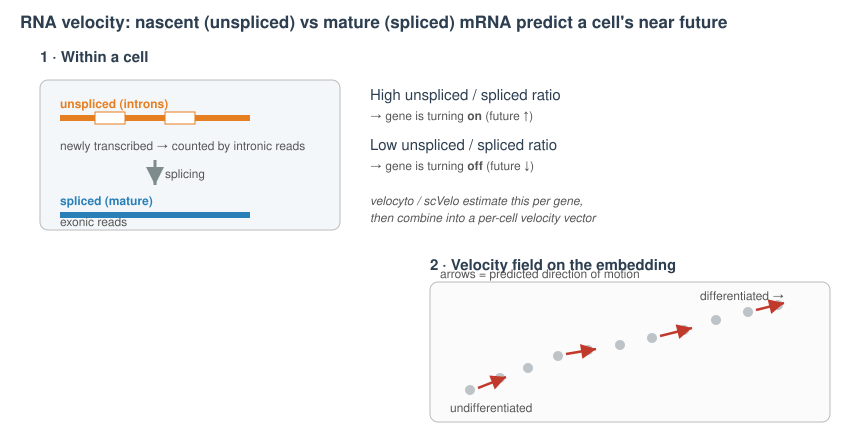
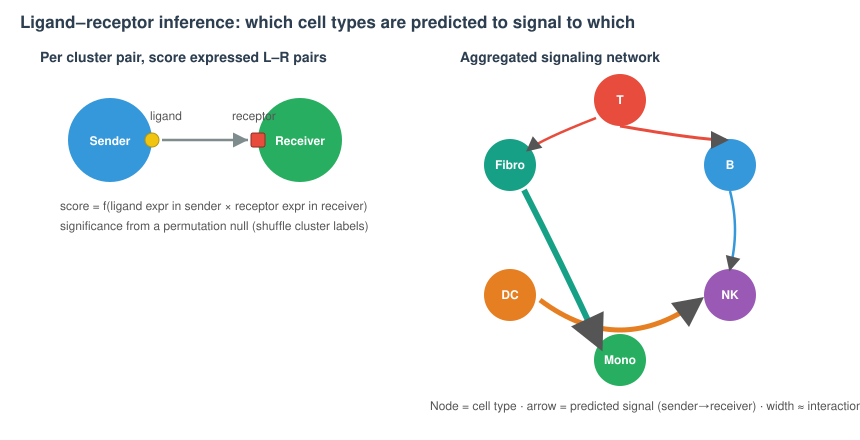

```{r}
#| label: setup
#| include: false
library(tidyverse); library(knitr)
theme_set(theme_minimal(base_size = 14)); set.seed(2026)
```

# Lecture 14: Trajectory Inference & Cell–Cell Communication {background-color="#2c3e50"}

## Where this lecture fits

-   Previous: [Lec 16 — Spatial Transcriptomics](Lecture_16_Spatial.html)
-   **You are here:** Lec 14 — *two downstream analyses that go beyond discrete clusters*
-   Next: [Lec 17 — FAIR Principles & Data Sharing](Lecture_17_FAIR_DataSharing.html)
-   **Companion tutorial:** [Tutorial 14 — Trajectory & Cell–Cell Communication](../Exercise_Folder/Tutorial_14_Trajectory_CellCommunication.html)
-   **Companion book chapter:** [Chapter 14 — Trajectory & Cell–Cell Communication](../Resources_Folder/Chapter_14_Trajectory_CellCommunication.html)
-   **Bonus track:** self-paced after the core workshop

## Goals of this lecture

::: incremental
-   See when **continuous** structure (a trajectory) is the right model instead of discrete clusters
-   Understand **pseudotime**, and how Slingshot / Monocle3 / PAGA order cells
-   Understand **RNA velocity** — how nascent vs. mature mRNA adds *direction* to a trajectory
-   Understand **cell–cell communication** inference (ligand–receptor) with CellChat / CellPhoneDB / LIANA
-   Know the **failure modes** of both — these are the most over-interpreted analyses in the field
:::

::: callout-note
**Both analyses sit on the annotated, integrated object** from the core workshop. They answer *"how do cells move through states?"* (trajectory) and *"which cell types talk to which?"* (communication) — questions clustering alone cannot.
:::

# Part 1 — Trajectory inference & pseudotime {background-color="#2c3e50"}

## When clusters are the wrong model

::: incremental
-   Clustering imposes **discrete** labels. But differentiation, activation, and cell-cycle are **continuous** processes — cells form a *continuum*, not islands.
-   A **trajectory** models cells as lying along one or more paths; **pseudotime** is a cell's position along that path (a number, not real clock time).
-   Use it when you have reason to expect a process: development, a stimulation time-course, a maturation axis.
:::

::: callout-warning
**Trajectory inference will always return a trajectory — even on noise.** The method does not check whether a continuum exists. If your biology is genuinely discrete (e.g. resting PBMC subsets), a pseudotime axis is meaningless. Decide *a priori* whether a continuum is plausible.
:::

## Pseudotime — the core idea

-   Build a graph (or tree) on cells in a reduced space, pick a **root**, and measure distance along the graph
-   Genes that change smoothly along pseudotime are the **drivers** of the process

| Tool | Idea | Notes |
|----|----|----|
| **Slingshot** | smooth principal curves through clusters | robust, R/Bioconductor, needs a start cluster |
| **Monocle3** | learns a principal **graph**; supports branches | popular; `learn_graph()` + `order_cells()` |
| **PAGA** (scanpy) | abstracted graph of cluster connectivity | great for "is there even a continuum?" |
| **Diffusion pseudotime** | random-walk distance from a root | underlies several Python tools |

``` r
library(slingshot)
sce <- slingshot(sce, clusterLabels = "celltype", reducedDim = "UMAP",
                 start.clus = "progenitor")
slingPseudotime(sce) |> head()
```

::: callout-important
**You must choose the root.** Pseudotime has no inherent direction — the algorithm orders cells, but *you* decide which end is "start" (usually from a known progenitor marker). Get the root wrong and the whole story reverses.
:::

## RNA velocity — adding direction

{fig-align="center" width="92%"}

-   Pseudotime gives an *axis* but not a *direction*; **RNA velocity** supplies the arrow
-   Reads are split into **unspliced** (intron-containing, newly transcribed) and **spliced** (mature) counts per gene
-   A high unspliced/spliced ratio ⇒ the gene is being **induced** ⇒ the cell is heading toward a state with more of that transcript

::: callout-note
**Recreated in our style.** Original concept & movies: La Manno *et al.* 2018, *Nature* ([velocyto.org](http://velocyto.org/)); modern dynamical model: Bergen *et al.* 2020, *Nat Biotechnol* (**scVelo**, [scvelo.org](https://scvelo.org/)).
:::

## RNA velocity — code & cautions

``` python
import scvelo as scv
scv.pp.filter_and_normalize(adata, min_shared_counts=20, n_top_genes=2000)
scv.pp.moments(adata, n_pcs=30, n_neighbors=30)
scv.tl.velocity(adata, mode="dynamical")
scv.tl.velocity_graph(adata)
scv.pl.velocity_embedding_stream(adata, basis="umap")
```

::: callout-warning
**Velocity needs a spliced/unspliced matrix** — the standard Cell Ranger `filtered_feature_bc_matrix` does **not** contain this. Generate it with `velocyto run` or `kb count --workflow lamanno` before running scVelo. If only the filtered matrix is available, velocity cannot be run — the most common reason velocity returns flat arrows.
:::

::: callout-warning
**Velocity assumptions break quietly.** Assumes near-steady-state kinetics; unreliable when capture is shallow or the process is fast. Treat the arrows as a hypothesis, not a measurement.
:::

## CytoTRACE — ordering by gene-count breadth

-   A simpler, assumption-light alternative: **less-differentiated cells tend to express *more genes*** (broader transcriptional state)
-   **CytoTRACE** (Gulati *et al.* 2020, *Science*) ranks cells by the number of detected genes (and co-expression structure) as a proxy for differentiation potential
-   Useful **sanity check** on a velocity/pseudotime root: do the two methods agree on which end is "start"?

::: callout-tip
**Triangulate.** When Slingshot, RNA velocity, and CytoTRACE agree on the ordering and root, you can believe it. When they disagree, you've learned the trajectory is fragile — report that, don't pick the prettiest one.
:::

# Part 2 — Cell–cell communication {background-color="#2c3e50"}

## The question, and the trick

-   Cells coordinate via secreted/membrane **ligands** binding **receptors** on other cells
-   We can't observe binding from scRNA-seq — but we *can* ask: is the **ligand** expressed in cluster A **and** its **receptor** expressed in cluster B?
-   Curated **ligand–receptor databases** + per-cluster expression → a predicted signaling network

{fig-align="center" width="92%"}

## Methods & how they differ

| Tool | Ecosystem | Distinctive feature |
|----|----|----|
| **CellPhoneDB** | Python | permutation test; handles multi-subunit complexes |
| **CellChat** | R | signaling **pathways** + nice circle/chord visualizations |
| **NicheNet** | R | links ligands to **downstream target genes** in the receiver |
| **LIANA** | R/Py | **consensus** across many methods/databases |

``` r
library(CellChat)
cc <- createCellChat(object = seu, group.by = "celltype")
cc@DB <- CellChatDB.human
cc <- subsetData(cc) |> identifyOverExpressedGenes() |>
  identifyOverExpressedInteractions() |> computeCommunProb() |>
  aggregateNet()
netVisual_circle(cc@net$weight, weight.scale = TRUE)
```

::: callout-note
**Recreated in our style.** Original methods/figures: Jin *et al.* 2021, *Nat Commun* (**CellChat**, [cellchat.org](http://www.cellchat.org/)); Efremova *et al.* 2020, *Nat Protoc* (**CellPhoneDB**).
:::

## Reading communication results responsibly

::: callout-warning
**Co-expression is not interaction.** These tools report that a ligand and receptor are *expressed in the right places* — not that signaling occurs. Pitfalls:

-   **No spatial constraint** — sender and receiver may never be adjacent (pair with spatial data, Lec 16)
-   **Database bias** — curated for **human/mouse**; sparse for non-model systems
-   **Secretion/diffusion ignored** — mRNA ≠ protein ≠ active ligand
-   **Always validate** top hits (IHC, perturbation, spatial co-localization) before claiming a circuit
:::

## `ifnb` is a demo, not a model system for trajectories

::: callout-note
The tutorial uses `ifnb` (resting + IFN-β-stimulated PBMCs) as a **mechanics demo** — not biology. PBMCs are not a developmental continuum. A pseudotime on `ifnb` shows you how to run the tools; interpreting it as a real differentiation axis would be wrong. On real data (development, maturation, a time-course), you would:

1.  Check *a priori* whether a continuum is plausible
2.  Pick the root from independent evidence (progenitor markers, CytoTRACE, RNA velocity)
3.  Triangulate at least two methods before reporting a trajectory
:::

# Part 3 — A note on long reads {background-color="#2c3e50"}

## Single-cell isoforms need long reads

-   Standard 3′ short-read scRNA-seq counts **genes**, not **isoforms** — it can't see which splice variant a cell uses
-   Pairing single-cell barcoding with **long-read** sequencing (PacBio Iso-Seq, ONT) recovers **full-length, isoform-resolved** transcripts per cell (e.g. scISO-seq)
-   Ties back to the **3′ UTR annotation** problem from Lec 00: long reads both *improve annotations* and *enable per-cell isoform analysis* — especially valuable in non-model systems

# Recap & what's next {background-color="#2c3e50"}

## What to remember from Lecture 14

::: incremental
-   **Trajectory/pseudotime** models cells as a continuum — only valid when a continuum actually exists, and you must set the **root**
-   **RNA velocity** adds *direction* from unspliced/spliced ratios; **CytoTRACE** gives an assumption-light cross-check
-   **Cell–cell communication** infers ligand–receptor signaling from co-expression — a **hypothesis generator**, not proof of interaction
-   Both are heavily over-interpreted: **triangulate methods and validate** before you believe the picture
:::

## Coming up next

-   **Lec 17** — [FAIR Principles & Data Sharing](Lecture_17_FAIR_DataSharing.html): packaging the annotated object for reuse
-   **Hands-on:** [Tutorial 14 — Trajectory & Cell–Cell Communication](../Exercise_Folder/Tutorial_14_Trajectory_CellCommunication.html)
-   **Companion book chapter:** [Chapter 14 — Trajectory & Cell–Cell Communication](../Resources_Folder/Chapter_14_Trajectory_CellCommunication.html)

## Further reading

-   Saelens *et al.* 2019, *Nat Biotechnol* — benchmark of 45 trajectory methods (a reality check)
-   La Manno *et al.* 2018 ([velocyto.org](http://velocyto.org/)); Bergen *et al.* 2020 ([scVelo](https://scvelo.org/))
-   Gulati *et al.* 2020 — [CytoTRACE](https://cytotrace.stanford.edu/)
-   Jin *et al.* 2021 — [CellChat](http://www.cellchat.org/); Armingol *et al.* 2021, *Nat Rev Genet* — review of cell–cell communication inference
