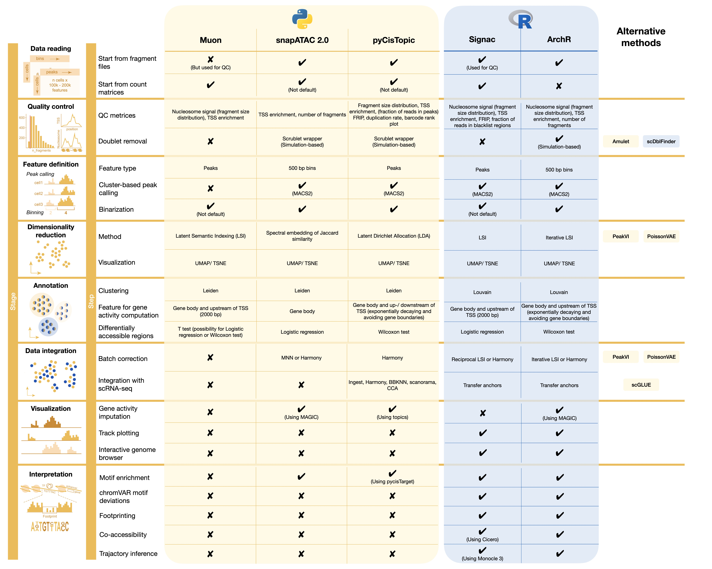
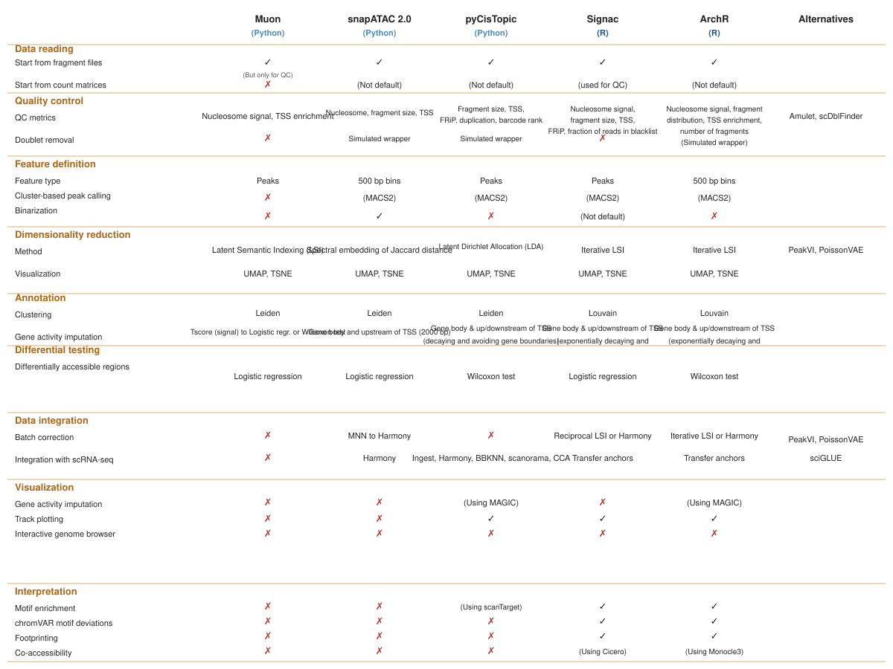

```{r}
#| label: setup
#| include: false
library(tidyverse); library(knitr)
theme_set(theme_minimal(base_size = 14)); set.seed(2026)
```

# Lecture 15: Bulk & Single-Cell ATAC-seq {background-color="#2c3e50"}

## Where this lecture fits

-   Previous: [Lec 08 — Differential Abundance](Lecture_08_DifferentialAbundance.html)
-   **You are here:** Lec 15 — *measuring chromatin accessibility, in bulk and per cell*
-   Next: [Lec 13 — WGCNA](Lecture_13_WGCNA.html)
-   **Companion tutorial:** [Tutorial 15 — scATAC-seq with Signac](../Exercise_Folder/Tutorial_15_scATACseq_Signac.html)
-   **Companion book chapter:** [Chapter 15 — Bulk and Single-Cell ATAC-seq](../Resources_Folder/Chapter_15_ATAC.html)
-   **Alternative toolkit:** [scNotebooks Module 11](https://integrativebioinformatics.github.io/scNotebooks/modules/en/module11/module11.html) walks the same workflow with **ArchR** instead of Signac, on Kumegawa et al. 2022 breast-cancer data — useful for breadth

## Goals of this lecture

::: incremental
-   Understand what **ATAC-seq** measures and how it complements RNA-seq
-   See how the **bulk ATAC-seq** workflow turns reads into peaks
-   Translate the bulk workflow to the **single-cell** setting (scATAC-seq, Signac)
-   Read scATAC QC metrics — fragment counts, TSS enrichment, nucleosome signal
-   Connect chromatin clusters to RNA-defined cell types via **gene activity**
:::

::: callout-note
**Why include this lecture?** RNA-seq tells you what genes are **expressed**; ATAC-seq tells you which regulatory regions are **accessible**. Together they explain *what* a cell is doing and *what it is poised to do*. The analysis vocabulary (counts, peaks, dim reduction, clusters) is almost identical to scRNA-seq — the differences are mostly bioinformatic plumbing.
:::

# Part 1 — What ATAC-seq is {background-color="#2c3e50"}

## The biology in one slide

::: incremental
-   DNA in the nucleus is wrapped around histones into **nucleosomes**
-   Regions where transcription factors and RNA polymerase need access (promoters, enhancers, insulators) are **nucleosome-depleted** → "open chromatin"
-   **ATAC-seq** uses a hyperactive **Tn5 transposase** that simultaneously cuts open DNA *and* tags it with sequencing adapters — only accessible regions are cut
-   Map reads back to the genome → peaks of read coverage = open regions
:::

## ATAC-seq — overview

{fig-align="center" width="92%"}

-   The whole assay in one picture: open chromatin → Tn5 cuts → tagged fragments → sequenced reads → peaks
-   Same data structure as ChIP-seq downstream, very different sample prep upstream

## ATAC vs. other accessibility assays

| Assay | What it measures | Throughput | Notes |
|----|----|----|----|
| **DNase-seq** | DNase I cut sites | High input, classic | Requires lots of cells |
| **FAIRE-seq** | Free, non-nucleosomal DNA | Phenol-extraction | Low resolution |
| **ATAC-seq** | Tn5-accessible DNA | 50k cells (bulk), 1 cell (sc) | Default modern choice |
| **Cut&Run / Cut&Tag** | Antibody-targeted accessibility | Low input | Marks TF-bound or modified regions |

## ATAC tools comparison

{fig-align="center" width="92%"}

-   The processing pipelines for **bulk** and **scATAC** share the same input/output shape but use different tooling at each step
-   Where Cell Ranger ATAC, Signac, ArchR, and SnapATAC2 sit relative to each other

# Part 2 — Bulk ATAC-seq workflow {background-color="#2c3e50"}

## From reads to peaks

::: incremental
1.  **Sequence** paired-end reads (50–75 bp), trim adapters
2.  **Align** with `bwa-mem` or `bowtie2` (`--very-sensitive`)
3.  **Filter**: drop duplicates, mitochondrial reads (chrM is hugely over-represented), low-MAPQ reads
4.  **Shift Tn5 offsets** — `+4`/`-5` bp on the two strands (Tn5 binds as a dimer)
5.  **Call peaks** with `MACS2 callpeak --nomodel --shift -75 --extsize 150 -B --SPMR` (or `-f BAMPE` for paired-end)
6.  **Annotate** peaks with `ChIPseeker` or `HOMER` against a TSS database
:::

::: callout-tip
**Sanity-check the fragment-size distribution.** A good ATAC library shows clear nucleosomal periodicity: a sub-100bp peak (NFR — nucleosome-free region), a \~200bp peak (mono-nucleosome), and \~400bp (di-nucleosome). Missing periodicity = library quality problem.
:::

## Common QC metrics in bulk ATAC

| Metric | Healthy range | What goes wrong |
|----|----|----|
| **% reads on chrM** | \< 30% (often \< 10%) | High = poor mitochondrial depletion |
| **TSS enrichment score** | \> 7 (ENCODE), \> 10 ideal | Low = scattered, non-specific Tn5 |
| **Fraction of reads in peaks (FRiP)** | \> 0.2 | Low = noisy library |
| **Library complexity (NRF, PBC1)** | NRF \> 0.9 | Low = PCR-duplicated library |

::: callout-warning
**Tn5 has sequence preferences.** Don't try to call SNVs or look at base-level features near peak summits — Tn5 cleaves preferentially at `GC`-rich sites and biases the apparent footprint.
:::

# Part 3 — Single-cell ATAC-seq {background-color="#2c3e50"}

## scATAC vs. scRNA — same shape, different math

| | scRNA-seq | scATAC-seq |
|---|---|---|
| Feature | gene | peak (or bin / motif / TF) |
| Counts | UMI per gene per cell | Tn5 cut events per peak per cell |
| Sparsity | \~90% zeros | \~98–99% zeros (most peaks not seen in most cells) |
| Dim reduction | PCA on log-normalized counts | **LSI** (TF-IDF + SVD) on binarized counts |
| Standard tools | Seurat / scanpy | **Signac** / ArchR / SnapATAC2 |

::: callout-note
**Why LSI not PCA?** scATAC counts are nearly binary (a peak is either captured or not in a cell). Variance-stabilizing normalization (TF-IDF) followed by SVD handles this better than naive PCA on log-counts.
:::

## The 10x Multiome / scATAC fragment file

The primary input for `Signac` is a **`fragments.tsv.gz`** — every line is one Tn5 cut event:

```
chr1   10125   10570   AAACGAAAGAGGAGCC-1   2
```

`chrom  start  end  cell_barcode  duplicate_count`

A `tabix` index (`.tbi`) is built so `Signac` can pull fragments for any genomic region in O(log n).

::: callout-tip
**Download the fragment file even if you only have the peak matrix.** Many downstream operations (gene activity, motif scoring, coverage plots) re-count fragments per region from scratch.
:::

## Tutorial dataset — PBMC 10k v1, hg19

::: callout-note
The tutorial (Module 15) uses the **10x PBMC 10k scATAC v1** dataset, which is mapped to **hg19 / GRCh37**. This requires:

-   `EnsDb.Hsapiens.v75` (last Ensembl annotation pinned to hg19)
-   Chromosome names with `chr` prefix — add `seqlevels(annotations) <- paste0("chr", seqlevels(annotations))`
-   The **v1** file prefix `atac_v1_pbmc_10k_*` (not the Next GEM `atac_v1_pbmc_10k_nextgem_*` which is hg38)

Mixing build and annotation causes bizarre coordinate errors — always confirm the build before loading the `EnsDb`.
:::

## scATAC QC metrics — what to look at

| Metric | Healthy range | What it catches |
|----|----|----|
| **`nCount_peaks`** (fragments in peaks per cell) | 1,000–50,000 | Low = empty droplet; very high = doublet |
| **`pct_reads_in_peaks`** (FRiP per cell) | \> 15% | Low = noisy / dying cell |
| **`blacklist_ratio`** | \< 0.05 | High = repetitive / artefactual |
| **`nucleosome_signal`** | \< 4 | High = degraded library, poor periodicity |
| **`TSS.enrichment`** | \> 2 (per-cell) | Low = no real chromatin signal |

```r
# Standard Signac QC subset
pbmc <- subset(pbmc,
               subset = peak_region_fragments > 3000 &
                        peak_region_fragments < 20000 &
                        pct_reads_in_peaks    > 15 &
                        blacklist_ratio       < 0.05 &
                        nucleosome_signal     < 4 &
                        TSS.enrichment        > 2)
```

## The Signac workflow

```r
library(Signac); library(Seurat); library(EnsDb.Hsapiens.v75)

counts <- Read10X_h5("data/atac_v1_pbmc_10k_filtered_peak_bc_matrix.h5")
chrom_assay <- CreateChromatinAssay(
  counts    = counts,
  sep       = c(":", "-"),
  fragments = "data/atac_v1_pbmc_10k_fragments.tsv.gz",
  min.cells = 10, min.features = 200)

pbmc <- CreateSeuratObject(counts = chrom_assay, assay = "ATAC",
                           meta.data = read.csv("data/atac_v1_pbmc_10k_singlecell.csv",
                                                row.names = 1))

# ATAC-specific normalization + reduction
pbmc <- RunTFIDF(pbmc)
pbmc <- FindTopFeatures(pbmc, min.cutoff = "q5")
pbmc <- RunSVD(pbmc)

# Skip LSI component 1 — usually correlates with depth, not biology
pbmc <- RunUMAP(pbmc, reduction = "lsi", dims = 2:30)
pbmc <- FindNeighbors(pbmc, reduction = "lsi", dims = 2:30) |>
        FindClusters(algorithm = 3)
```

::: callout-warning
**Always drop LSI component 1.** It almost always reflects sequencing depth per cell, not biology. `dims = 2:30` is the canonical Signac choice.
:::

# Part 4 — Connecting ATAC to RNA {background-color="#2c3e50"}

## Gene-activity scores

To label scATAC clusters using familiar gene markers, build a **gene activity matrix** — sum fragments overlapping each gene body + 2 kb upstream:

```r
gene.activities <- GeneActivity(pbmc)
pbmc[["RNA"]] <- CreateAssayObject(counts = gene.activities)
pbmc <- NormalizeData(pbmc, assay = "RNA",
                      normalization.method = "LogNormalize",
                      scale.factor = median(pbmc$nCount_RNA))

DefaultAssay(pbmc) <- "RNA"
FeaturePlot(pbmc, c("MS4A1","CD3D","LEF1","NKG7","TREM1","LYZ"),
            max.cutoff = "q95", ncol = 3)
```

::: callout-note
**Gene activity is a proxy.** Accessibility around a gene loosely correlates with expression — but a gene can be open without being transcribed (poised), or transcribed without obvious accessibility (long-range enhancer). Use it for clustering / labelling, not for quantifying expression.
:::

## Label transfer from scRNA to scATAC

If you also have a matched scRNA dataset (10x Multiome, or a published PBMC reference such as Signac's `pbmc_10k_v3.rds`), use **anchor-based label transfer**:

```r
pbmc_rna <- readRDS("data/pbmc_10k_v3.rds")
anchors <- FindTransferAnchors(reference = pbmc_rna, query = pbmc,
                               reduction = "cca")
pred    <- TransferData(anchorset = anchors, refdata = pbmc_rna$celltype,
                        weight.reduction = pbmc[["lsi"]], dims = 2:30)
pbmc <- AddMetaData(pbmc, pred)
```

## Downstream you can reach for

-   **Differential accessibility** — `FindMarkers(test.use = "LR", latent.vars = "nCount_peaks")`
-   **Motif enrichment** — `Signac::FindMotifs` against `JASPAR2020`, or **HOMER** (`findMotifsGenome.pl`) from the command line
-   **Per-cell TF activity** — `chromVAR` deviations
-   **Coverage plots** — `CoveragePlot()` to visualize fragment pileups by cell type

::: callout-tip
**Latent variable matters.** Use `latent.vars = "nCount_peaks"` (or `"peak_region_fragments"`) for differential accessibility — depth varies wildly across cells and otherwise drives spurious "DA peaks".
:::

## Design considerations

::: incremental
-   **QC thresholds are dataset-specific.** The thresholds in the QC code above (`peak_region_fragments > 3000`, `TSS.enrichment > 2`, etc.) are starting points — always inspect the violin plots and density scatters first before cutting.
-   **`min.cutoff = "q0"` vs `"q5"`** in `FindTopFeatures` — `"q0"` keeps all peaks; `"q5"` drops the lowest-frequency 5%. Use `"q0"` if you have few cells or rare cell types.
-   **SLM (algorithm 3) vs Louvain/Leiden** — SLM (algorithm 3) often gives more stable partitions on noisy scATAC graphs; Leiden (algorithm 4) is the modern default for RNA but either is fine.
-   **Gene activity is a proxy** — open chromatin near a gene loosely correlates with expression; a gene can be open without being transcribed (poised) or transcribed via a distal enhancer. Use gene activity for labelling, not expression quantification.
:::

# Recap & what's next {background-color="#2c3e50"}

## What to remember from Lecture 15

::: incremental
-   ATAC-seq measures **chromatin accessibility** via Tn5 tagmentation
-   Bulk ATAC-seq goes reads → peaks → annotation; scATAC-seq adds a barcode layer per Tn5 event
-   scATAC math is **LSI**, not PCA — and the first component is usually depth, drop it
-   Per-cell QC has its own metrics: TSS enrichment, nucleosome signal, FRiP
-   **Gene activity scores** + label transfer let you reuse RNA cell-type labels in chromatin space
:::

## Coming up next

-   **Lec 13** — [WGCNA](Lecture_13_WGCNA.html): co-expression networks for bulk and pseudobulk data
-   **Hands-on:** [Tutorial 15 — scATAC-seq with Signac](../Exercise_Folder/Tutorial_15_scATACseq_Signac.html)

## Further reading

-   [Signac vignette — PBMC scATAC](https://stuartlab.org/signac/articles/pbmc_vignette)
-   [ArchR book](https://www.archrproject.com/) — alternative scATAC stack, fast on large datasets
-   [ENCODE ATAC-seq pipeline standards](https://www.encodeproject.org/atac-seq/) — bulk QC thresholds
