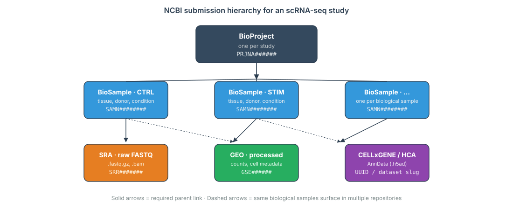
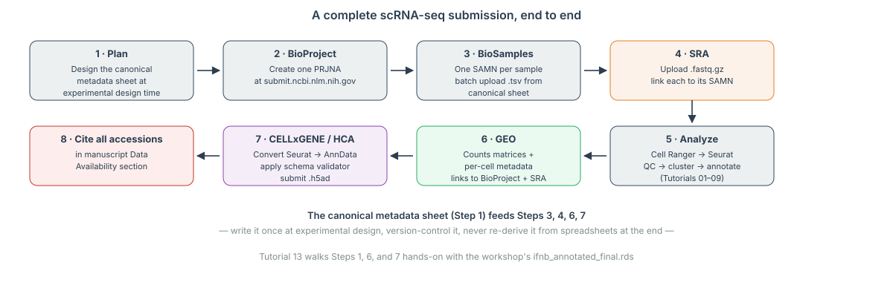

```{r}
#| label: setup
#| include: false
library(tidyverse); library(knitr)
theme_set(theme_minimal(base_size = 14)); set.seed(2026)
```

# Lecture 17: FAIR Principles & Data Sharing {background-color="#2c3e50"}

## Where this lecture fits

-   Previous: [Lec 14 — Trajectory Inference & Cell–Cell Communication](Lecture_14_Trajectory_CellCommunication.html)
-   **You are here:** Lec 17 — *what to do with your data after you've finished the analysis*
-   **Companion tutorial:** [Tutorial 17 — FAIR Metadata & Submission](../Exercise_Folder/Tutorial_17_FAIR_Metadata.html)
-   **Companion book chapter:** [Chapter 17 — FAIR Principles & Data Sharing](../Resources_Folder/Chapter_17_FAIR.html)
-   **Parallel reading:** [scNotebooks Module 13 — FAIR Data & Sharing Data](https://integrativebioinformatics.github.io/scNotebooks/modules/en/module13/module13.html)

## Goals of this lecture

::: incremental
-   Understand the **four FAIR principles** and what each means for an scRNA-seq dataset
-   Recognize the **major repositories** (NCBI, EBI, HCA, CellxGene) and which type of data goes where
-   Know what fields a **complete sample-level metadata sheet** must contain
-   Understand the **ontologies** (Cell Ontology, Uberon, Disease Ontology) that make metadata machine-readable
-   Plan a submission *before* you generate the data, not after
:::

::: callout-warning
**Why this lecture comes last is exactly why it should come first.** Most groups think about data submission after the manuscript is in revision. By then, sample-level metadata is buried in lab notebooks across multiple students, ontology terms have to be reverse-engineered, and you need to chase three former rotation students for their consent forms. **Plan submission at experimental design.**
:::

# Why FAIR? {background-color="#2c3e50"}

## The 2016 Wilkinson paper

-   Wilkinson *et al.* 2016, *Sci Data* — "The FAIR Guiding Principles for scientific data management and stewardship" ([doi](https://doi.org/10.1038/sdata.2016.18))
-   Now the de-facto standard for data reuse, cited by every major funder (NIH, ERC, Wellcome) in their data-sharing policies
-   FAIR = **Findable, Accessible, Interoperable, Reusable** — an *aspiration*, not a checklist; you can be partly FAIR and improve over time

## The four principles

| Principle | One-line definition | What it means for scRNA-seq |
|---|---|---|
| **F**indable | Data + metadata have a **persistent identifier** searchable in a registry | Deposit in a public repository → get a stable ID (GSE, PRJNA, EGAS, …) |
| **A**ccessible | Anyone (or anyone authorized) can retrieve the data via an open protocol | The raw FASTQs, the count matrices, AND the metadata are downloadable — by humans and by code |
| **I**nteroperable | Data uses **shared vocabularies** so different datasets combine cleanly | Cell types in **Cell Ontology** terms, tissues in **Uberon**, diseases in **MONDO** / **Disease Ontology** |
| **R**eusable | Provenance + clear licence + sufficient metadata for reanalysis | Anyone can reproduce your analysis from your raw data + your scripts + your metadata |

::: callout-note
**FAIR ≠ open.** FAIR data can be access-controlled (e.g. patient genomes in a controlled-access archive). The "A" requires that the *protocol* for access is open and standardized — not necessarily that the data itself is.
:::

## What "Findable" really requires

-   A **persistent identifier** (PID): a stable URL or accession that won't 404 in five years
-   The metadata is **separately findable** from the data itself — you should be able to discover the dataset by searching for terms like "PBMC interferon stimulation human" without already knowing the accession
-   Common PIDs for scRNA-seq:
    -   **DOI** (manuscripts, datasets via Zenodo / Figshare)
    -   **NCBI BioProject** → `PRJNA######`
    -   **EBI BioStudies / ArrayExpress** → `E-MTAB-####`
    -   **HCA** → `dcp_uuid` (UUID4)
    -   **CellxGene** → dataset slug

## What "Accessible" really requires

-   A **standardized protocol** to retrieve the data — typically HTTPS, FTP, or an Aspera transfer for big FASTQs
-   The **metadata** must remain accessible *even if the data is removed* — so the FAIR mandate is met even for retracted studies
-   Authentication is allowed (controlled-access human data is FAIR), but the access mechanism must be documented

# The repository ecosystem {background-color="#2c3e50"}

## NCBI vs EBI: the two anchor archives

The two major mirrored archives are:

-   **NCBI** (US, Bethesda) — the GEO + SRA + BioProject + BioSample family
-   **EBI** (Europe, Hinxton) — the ArrayExpress + ENA + BioStudies family

They mirror each other for raw sequence data, so you submit to one and the other indexes it within \~24 hours. Most labs submit to NCBI; consortium-scale projects more often submit to EBI.

## NCBI hierarchy

{fig-align="center" width="92%"}

-   **BioProject** (`PRJNA######`) — the **study** as a whole. One per paper.
-   **BioSample** (`SAMN########`) — each **biological sample**. Tissue, treatment, donor metadata lives here.
-   **SRA** (`SRR#######`) — the **raw sequencing reads** (FASTQs, BAMs).
-   **GEO** (`GSE######`) — the **processed** data: counts matrices, normalized files, expression metadata. GEO records pull SRA + BioSample IDs in.

For an scRNA-seq study you typically create **all four**.

## Single-cell-specific repositories

Beyond the generic raw-archive (SRA / ENA), you should also deposit in a single-cell–aware repository so the data is *queryable as scRNA-seq*:

| Repository | Run by | What it accepts | Strengths |
|---|---|---|---|
| **CELLxGENE Discover** | CZI | AnnData (`.h5ad`) with required metadata | Browseable atlas, in-browser visualization, schema-validated |
| **Human Cell Atlas Data Portal** | HCA Consortium | Raw + processed, full provenance graph | Strict QC, integrated atlas |
| **Single Cell Expression Atlas** | EBI | Counts + author annotations | Curated, queryable per-gene across studies |
| **Single Cell Portal** | Broad Institute | Loose; raw + processed | Easy upload, less curation |

::: callout-tip
For most published scRNA-seq studies in 2026 the recommended workflow is: **raw FASTQs to SRA + BioProject; processed data to GEO; AnnData with cell-type metadata to CELLxGENE**. The triple-deposit looks redundant but each repository serves a different audience (raw-data reanalysers, traditional bench biologists, single-cell-tool users).
:::

# Metadata standards {background-color="#2c3e50"}

## Why "metadata" is most of the work

-   You can't reuse a counts matrix you can't interpret
-   "Sample 1, Sample 2, Sample 3, Sample 4" is **not metadata**
-   At minimum, metadata answers: who is the donor, what's the tissue, what's the condition, what's the protocol, who processed it, when, with what library prep, on what machine, with what software version
-   For human samples: also consent type, age range (often binned for de-identification), self-reported sex / gender, ancestry

## Required fields by repository

A practical minimum for an scRNA-seq submission:

| Field | Why | Source / vocabulary |
|---|---|---|
| `donor_id` | Match cells to biological replicates | study-internal, anonymized |
| `tissue` | Anatomy | **Uberon** (`UBERON:0002048` = lung) |
| `cell_type` (per cell) | Interpretation | **Cell Ontology** (`CL:0000236` = B cell) |
| `disease` | Condition | **MONDO** (`MONDO:0005180` = Parkinson disease) or `PATO:0000461` (normal) |
| `assay` | Platform | **EFO** (`EFO:0009922` = 10x 3' v3) |
| `organism` | Species | **NCBI Taxonomy** (`NCBITaxon:9606` = human) |
| `development_stage` | Age | **HsapDv** for human, **MmusDv** for mouse |
| `sex` | Phenotype | `PATO:0000383` (female) / `PATO:0000384` (male) / unknown |
| `self_reported_ethnicity` | Ancestry | **HANCESTRO** ontology |
| `is_primary_data` | Re-use flag | Boolean |
| `suspension_type` | Cell vs nucleus | `cell` / `nucleus` (CELLxGENE schema enum) |

This is roughly the **CELLxGENE schema v5.0** — the most demanding of the major repositories, and also the most reusable. Meeting CELLxGENE's bar gets you GEO + HCA "for free".

## Ontologies — interoperability in practice

::: incremental
-   **Cell Ontology (CL)** — \~2,400 cell-type terms, hierarchically organized
-   **Uberon** — multi-species anatomy
-   **EFO (Experimental Factor Ontology)** — assays, platforms, technical metadata
-   **MONDO** — diseases, harmonized across DO / OMIM / Orphanet / NCIt
-   **NCBI Taxonomy** — species
-   **HANCESTRO** — human ancestry and ethnicity
:::

::: callout-tip
**Look up ontology terms with [OLS — Ontology Lookup Service](https://www.ebi.ac.uk/ols4/)** at EBI. Search "B cell" → it returns `CL:0000236`. The ID is what goes in your metadata; the human-readable label is for display.
:::

## File formats — what to actually deposit

| Layer | Format | Why |
|---|---|---|
| Raw reads | `.fastq.gz` (paired or single-end) | Universally supported |
| Aligned reads | `.bam` + `.bai` | Optional — useful for re-alignment |
| Per-cell counts | `.h5` (10x), `.mtx` + `barcodes.tsv` + `features.tsv` | Cell Ranger output |
| Annotated object | **`.h5ad`** (AnnData) preferred; `.rds` (Seurat) accepted by some | CELLxGENE / scverse-native |
| Metadata sheet | `.csv` / `.tsv` (also embedded in `.h5ad` via `.obs`) | Sample-level + per-cell |
| Analysis code | git repo (Zenodo for archival) | Reproducibility |

::: callout-warning
**Seurat `.rds` files are not future-proof.** They lock the data to the Seurat version that wrote them. For long-term archival use **AnnData (`.h5ad`)** — it's a versioned, language-agnostic HDF5-based format readable by Scanpy, Seurat 5, and `anndata-rs`.
:::

## Seurat → AnnData conversion (the tutorial workflow)

The tutorial (Module 17) uses a two-step bridge via `SeuratDisk`:

``` r
SaveH5Seurat(ifnb, filename = "ifnb_for_submission.h5Seurat")
Convert("ifnb_for_submission.h5Seurat", dest = "h5ad")
```

::: incremental
-   `SeuratDisk` may fail on Seurat v5's `Assay5` class — check the tutorial's error notes
-   After conversion, run `cellxgene-schema validate ifnb_for_submission.h5ad` to confirm all required columns are present and all ontology IDs are recognized
-   The validator pulls fresh ontology releases — an ID that worked a year ago may now be deprecated; use [OLS](https://www.ebi.ac.uk/ols4/) to look up the current term
:::

# The submission workflow {background-color="#2c3e50"}

## A complete scRNA-seq submission, end to end

{fig-align="center" width="92%"}

1.  Create a **BioProject** (one per study)
2.  Create one **BioSample** per biological sample
3.  Submit raw `.fastq.gz` to **SRA** with sample → BioSample links
4.  Process the data, run your analysis
5.  Submit the **counts matrices + per-cell metadata** to **GEO**
6.  Convert to AnnData and submit to **CELLxGENE Discover**
7.  Cite all accessions in your manuscript's *Data Availability* section

## Doing it well: the metadata-first principle

-   **Design the metadata sheet at experimental design time**, not after sequencing
-   For every sample, capture (at minimum): donor ID, tissue, condition, treatment, protocol version, library prep date, who processed it
-   Keep the metadata sheet in **version control** — git-tracked CSV alongside your code
-   At submission time you'll fill in the BioSample / SRA / GEO sheets *from* this canonical sheet — not by reverse-engineering from spreadsheets

::: callout-tip
**Tutorial 17** has a runnable template for this — start with it now, even before you have data, and adapt for your study.
:::

## Common submission mistakes

::: incremental
1.  **Inconsistent sample names.** "Sample_1" in the BioSample, "S1" in the SRA, "donor1_treated" in the GEO — they must all match
2.  **Free-text instead of ontology terms.** "lung tissue" instead of `UBERON:0002048` — passes for GEO but fails CELLxGENE / HCA
3.  **No `is_primary_data` flag.** If you reanalyzed someone else's published data and submit it, mark it as derivative
4.  **Missing per-cell annotations.** Submitting just the counts matrix without a `cell_type` column makes the dataset effectively unreusable
5.  **No data licence.** Default to **CC-BY 4.0** unless you have a reason not to
6.  **Submitting before publication and not requesting embargoed release.** GEO will release on submission unless you set a release date
:::

## Authentication and human-data special cases

-   For **human genomic data** (germline-resolvable genotypes), most journals + funders now require **controlled access**
-   **dbGaP** (US) and **EGA** (European Genome-phenome Archive) handle controlled-access human data
-   The metadata is still public; only the raw genotype-resolvable data is gated
-   You can submit cell-by-cell expression matrices *publicly* (not genotype-resolvable) while keeping FASTQs in EGA

# Why this matters for your science {background-color="#2c3e50"}

## What good FAIR practice gets you

::: incremental
-   **Citations.** A well-deposited dataset is reused; reuse means citation
-   **Reproducibility.** When a reviewer asks "can I see your raw data?" — you have a one-line answer
-   **Atlas integration.** Your dataset can be pulled into HCA / CELLxGENE / Tabula Sapiens — visibility you won't get any other way
-   **Funder compliance.** NIH (2023+) and most major funders **require** a Data Management & Sharing Plan; FAIR-aligned plans pass review faster
-   **Future-proof your career.** A well-organized metadata sheet from your PhD is reusable five years later when a new tool arrives
:::

## What poor FAIR practice costs you

-   The reanalysis paper that *should* have cited yours uses someone else's better-deposited dataset
-   You can't respond to a reviewer's "please re-analyze with method X" because the metadata isn't sufficient
-   When you change institutions, the data is locked in your previous lab's storage
-   Five years on, your own former student can't reproduce your figure

::: callout-warning
**The cost of doing FAIR is paid up-front during the project.** The payoff is paid back over the rest of your career and the lifetime of the data. Skipping it feels efficient and is not.
:::

# Recap & what's next {background-color="#2c3e50"}

## Reading the audit output (Step 1 of the tutorial)

::: callout-note
`colnames(ifnb@meta.data)` reveals what metadata is already in the object — QC metrics, condition (`stim`), cluster assignments, cell-type labels. What is **missing**: species, tissue ontology, assay type, per-cell donor ID. This gap is the whole point of the tutorial. A dataset with rich per-cell labels but no sample-level metadata is only half-FAIR.
:::

## Design considerations

::: incremental
-   **Derive all submission TSVs from one canonical sheet** — a single-source CSV in version control that generates the BioSample, SRA, and GEO upload templates programmatically. Manual transcription across three forms accumulates case mismatches and broken join keys.
-   **`is_primary_data`** — set to `FALSE` if you are re-depositing someone else's data. Omitting this breaks atlas-level de-duplication.
-   **CELLxGENE schema version changes** — the schema is updated; always check the current version number before submission. The validator may accept a file locally that the portal rejects if versions differ.
-   **Disease vs treatment** — CELLxGENE has no `condition` field. IFN-β stimulation is an experimental treatment (encode in a custom `treatment` column), not a disease (`disease_ontology_term_id = "PATO:0000461"` for both CTRL and STIM).
:::

## What to remember from Lecture 17

::: incremental
-   **FAIR** = Findable, Accessible, Interoperable, Reusable — applies to data **and** metadata
-   The NCBI hierarchy is **BioProject → BioSample → SRA → GEO**, with single-cell adding **CELLxGENE / HCA / SCEA**
-   **Ontologies make interoperability work** — Cell Ontology, Uberon, MONDO, EFO, HANCESTRO
-   **AnnData (`.h5ad`)** is the format-of-record; `.rds` is convenient but not archival
-   **Plan submission at experimental design time.** Keep a canonical, version-controlled metadata sheet
-   The **CELLxGENE schema** is the highest practical bar — meet it and you've effectively met every other repository's
:::

## Coming up next

-   **Hands-on:** [Tutorial 17 — FAIR Metadata & Submission](../Exercise_Folder/Tutorial_17_FAIR_Metadata.html) — build a CELLxGENE-conformant metadata sheet from the workshop's `ifnb_annotated_final.rds`
-   **Parallel reading:** [scNotebooks Module 13](https://integrativebioinformatics.github.io/scNotebooks/modules/en/module13/module13.html) — covers the same workflow with examples for ArrayExpress + HCA Data Portal
