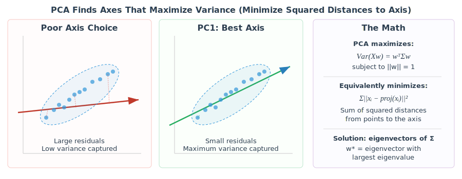
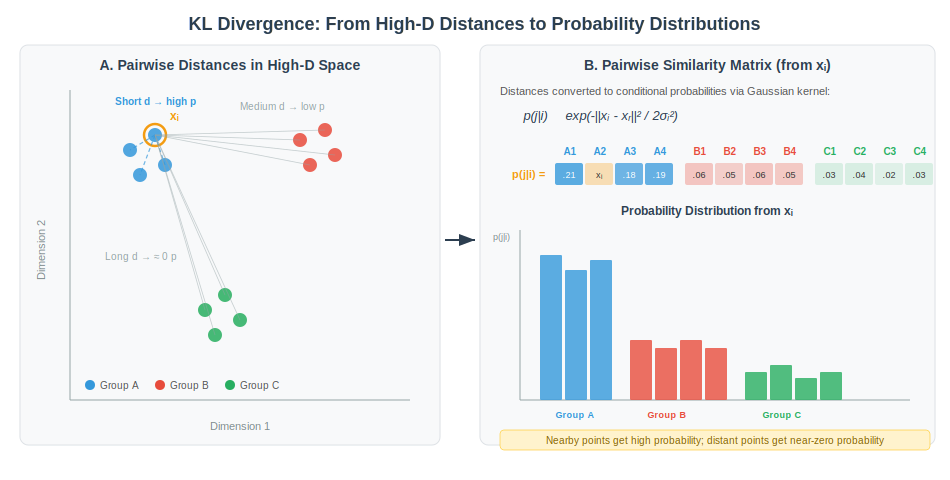
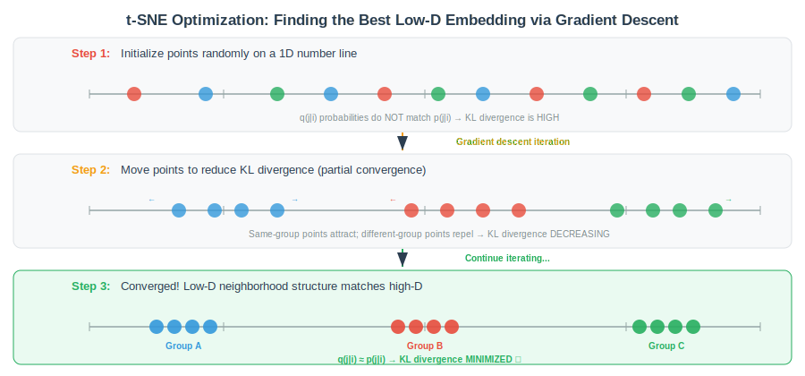
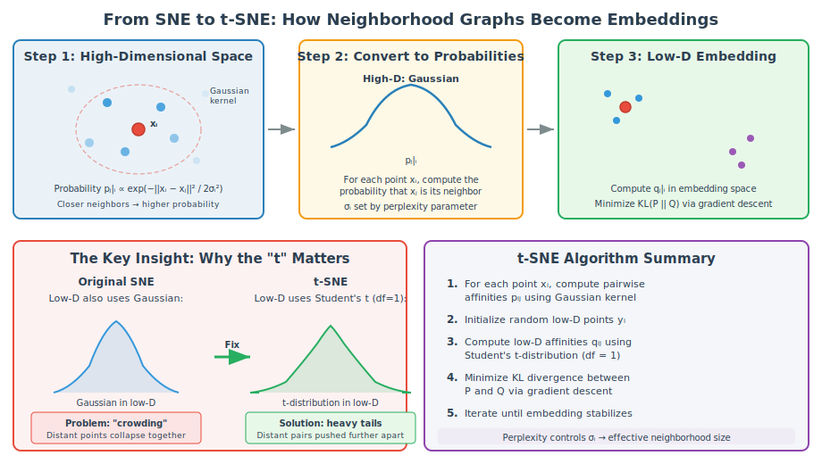
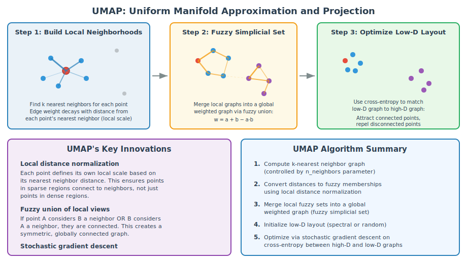
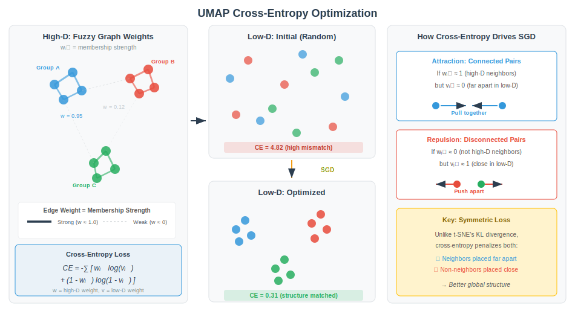
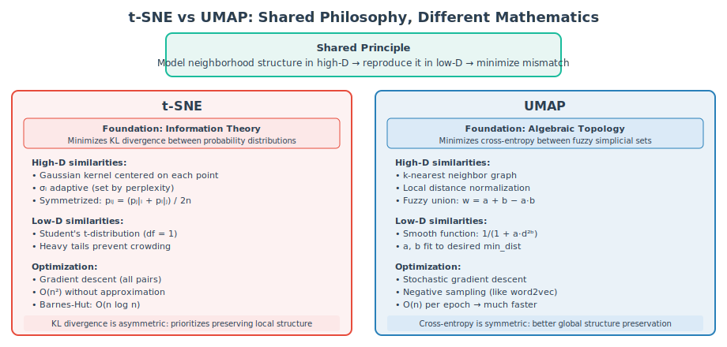
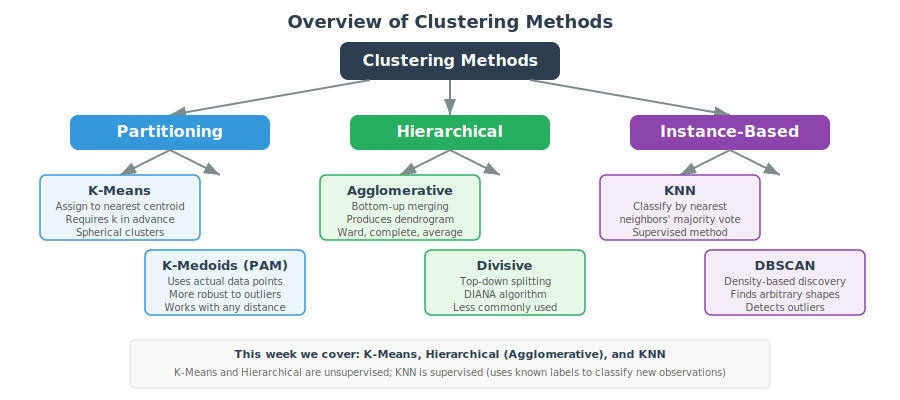
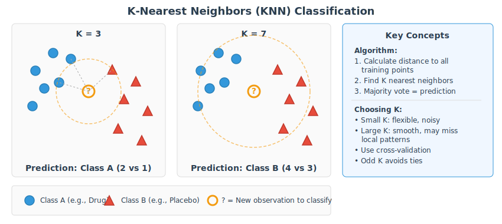

```{r}
#| label: setup
#| include: false

# Core packages
library(tidyverse)
library(knitr)

# Multivariate and ordination
library(vegan)        # Community ecology ordination
library(Rtsne)        # t-SNE
library(umap)         # UMAP
library(ape)          # PCoA

# Clustering and classification
library(cluster)      # Clustering algorithms
library(dendextend)   # Dendrogram visualization
library(class)        # KNN

# Visualization
library(plotly)       # Interactive 3D plots
library(gridExtra)    # Multi-panel figure arrangement
library(cowplot)      # Legend extraction for multi-panel plots

# Set consistent theme
theme_set(theme_minimal(base_size = 14))
set.seed(2026)
```

# Week 10: Unsupervised ML Methods {background-color="#2c3e50"}

## Week 10 Topics

::: incremental
-   Introduction to multivariate statistics and unsupervised learning
-   Principal Component Analysis (PCA) — theory and practice
-   Principal Coordinate Analysis (PCoA) ordination
-   Nonmetric Multidimensional Scaling (NMDS) ordination
-   Dimensionality reduction with t-SNE and UMAP
-   Clustering: hierarchical, K-means, and K-nearest neighbors
-   Course summary and method selection guide
:::

::: callout-note
**Readings:** Chapters 36–40

**Final project due next week**
:::

## Packages for This Week

::: panel-tabset
### Install

```{r}
#| eval: false
#| echo: true

# Install new packages (run once)
install.packages(c("vegan", "Rtsne", "umap", "ape",
                    "cluster", "dendextend", "class", "plotly",
                    "gridExtra", "cowplot"))
```

### Load

```{r}
#| eval: false
#| echo: true

library(tidyverse)    # Data manipulation & visualization
library(vegan)        # Community ecology ordination
library(Rtsne)        # t-SNE implementation
library(umap)         # UMAP implementation
library(ape)          # PCoA
library(cluster)      # Clustering algorithms (silhouette, etc.)
library(dendextend)   # Enhanced dendrogram visualization
library(class)        # K-nearest neighbors classification
library(plotly)       # Interactive 3D visualization
library(gridExtra)    # Multi-panel figure arrangement
library(cowplot)      # Legend extraction
```
:::

# Introduction to Multivariate Statistics {background-color="#2c3e50"}

## The Multivariate Challenge

In bioengineering research, we rarely measure just one variable at a time.

-   Gene expression profiling produces thousands of measurements per sample.
-   Biomaterial characterization involves dozens of correlated physical and chemical properties.
-   Clinical studies track many biomarkers simultaneously.

**The fundamental problem:** How do we find meaningful patterns when our data has many more variables than we can visualize or easily interpret?

**Unsupervised methods** address this by discovering structure in the data without requiring predefined labels or categories. They answer questions like:

-   Are there natural groupings among these samples?
-   Which variables contribute most to differences?
-   Can we reduce 100 measurements to a few meaningful dimensions?

## When to Use Unsupervised Multivariate Methods

Unsupervised methods are appropriate when you want to **explore** and **discover** rather than **predict** or **test**:

**Use unsupervised methods when:**

-   You have many correlated variables and want to identify the dominant patterns of variation
-   You suspect natural groupings exist but don't know what they are
-   You need to reduce dimensionality before applying other statistical methods
-   You want to visualize high-dimensional data in 2D or 3D
-   You are performing quality control — looking for outliers, batch effects, or unexpected structure

**Do NOT use unsupervised methods when:**

-   You have a clear response variable and want to test specific hypotheses (use regression, ANOVA, etc.)
-   You need causal inference (unsupervised methods are descriptive)
-   Your data has only a few variables that can be examined individually

## Overview of Common Methods

| Method | Input | Goal | Key Output |
|:-----------------|:-----------------|:-----------------|:-----------------|
| **PCA** | Raw data matrix | Find axes of maximum variance | Scores, loadings, variance explained |
| **PCoA** | Distance matrix | Metric ordination in reduced space | Coordinates preserving distances |
| **NMDS** | Distance matrix | Non-metric ordination | Coordinates preserving rank-order |
| **t-SNE** | Raw data or distances | Visualize local cluster structure | 2D embedding |
| **UMAP** | Raw data or distances | Visualize local + global structure | 2D embedding |
| **Hierarchical clustering** | Distance matrix | Find nested group structure | Dendrogram |
| **K-means** | Raw data matrix | Partition into k groups | Cluster assignments |
| **KNN** | Labeled training data | Classify new observations | Predicted labels |

## Bioengineering Case Examples

**Single-cell genomics:** PCA reduces 20,000+ gene expression measurements to 50 principal components, then UMAP visualizes cell populations in 2D. Clustering identifies distinct cell types.

**Biomaterial formulation screening:** Dozens of physical properties (porosity, modulus, degradation rate, swelling) measured across hundreds of formulations. Hierarchical clustering groups similar formulations. PCA identifies which properties drive the main differences.

**Drug response profiling:** Gene expression measured in tissue samples before and after treatment. PCA reveals whether treatment dominates the variation. PERMANOVA tests whether treated and untreated groups differ significantly in multivariate space.

**Microbiome analysis:** Species abundance data from gut samples. Bray-Curtis distance captures compositional differences. PCoA and NMDS visualize community differences between patient groups.

## Interactive 3D Multivariate Data Cloud

::: panel-tabset
### Output

```{r}
#| label: plot-3d-cloud
#| echo: false
#| eval: true

set.seed(42)
n <- 200

# Generate football-shaped cloud: elongated along one direction
# PC1 direction: most variance
pc1 <- rnorm(n, 0, 4)
# PC2 direction: moderate variance  
pc2 <- rnorm(n, 0, 2)
# PC3 direction: least variance
pc3 <- rnorm(n, 0, 1)

# Rotate into 3D space (45-degree rotation)
angle1 <- pi/6
angle2 <- pi/4
x <- pc1 * cos(angle1) - pc2 * sin(angle1)
y <- pc1 * sin(angle1) * cos(angle2) + pc2 * cos(angle1) * cos(angle2) - pc3 * sin(angle2)
z <- pc1 * sin(angle1) * sin(angle2) + pc2 * cos(angle1) * sin(angle2) + pc3 * cos(angle2)

# Compute actual PCA axes for overlay
pca_3d <- prcomp(cbind(x, y, z), center = TRUE, scale. = FALSE)
center <- colMeans(cbind(x, y, z))
loadings <- pca_3d$rotation
sds <- pca_3d$sdev

# Create plotly 3D scatter
fig <- plot_ly() |>
  add_markers(x = x, y = y, z = z, 
              marker = list(size = 3, color = pc1, 
                            colorscale = "Viridis", opacity = 0.6),
              name = "Data points")

# Add PC axes as lines through the center
axis_scale <- 5
colors_ax <- c("#e74c3c", "#27ae60", "#3498db")
labels_ax <- c("PC1", "PC2", "PC3")

for (i in 1:3) {
  direction <- loadings[, i] * sds[i] * axis_scale
  fig <- fig |>
    add_trace(x = c(center[1] - direction[1], center[1] + direction[1]),
              y = c(center[2] - direction[2], center[2] + direction[2]),
              z = c(center[3] - direction[3], center[3] + direction[3]),
              type = "scatter3d", mode = "lines",
              line = list(color = colors_ax[i], width = 6),
              name = labels_ax[i])
}

fig <- fig |>
  layout(scene = list(
    xaxis = list(title = "X"),
    yaxis = list(title = "Y"),
    zaxis = list(title = "Z"),
    camera = list(eye = list(x = 1.5, y = 1.5, z = 1.0))
  ),
  title = "3D Data Cloud with Principal Component Axes",
  width = 860, height = 580,
  margin = list(t = 40))

fig
```

### Code

```{r}
#| label: plot-3d-code
#| echo: true
#| eval: false

library(plotly)

# Generate football-shaped data cloud
set.seed(42)
n <- 200
pc1 <- rnorm(n, 0, 4)  # Most variance
pc2 <- rnorm(n, 0, 2)  # Moderate
pc3 <- rnorm(n, 0, 1)  # Least

# Rotate into 3D space
angle1 <- pi/6; angle2 <- pi/4
x <- pc1 * cos(angle1) - pc2 * sin(angle1)
y <- pc1 * sin(angle1) * cos(angle2) + pc2 * cos(angle1) * cos(angle2) - pc3 * sin(angle2)
z <- pc1 * sin(angle1) * sin(angle2) + pc2 * cos(angle1) * sin(angle2) + pc3 * cos(angle2)

# PCA to find axes
pca_3d <- prcomp(cbind(x, y, z), center = TRUE, scale. = FALSE)

# Interactive 3D plot with plotly
fig <- plot_ly() |>
  add_markers(x = x, y = y, z = z, 
              marker = list(size = 3, opacity = 0.6))
fig  # Drag to rotate!
```

### Interpretation

**What you're seeing:**

This interactive 3D plot shows a cloud of 200 data points with three principal component axes projected through the center.

-   **Red axis (PC1):** The longest axis of the "football" — this direction captures the most variance
-   **Green axis (PC2):** Perpendicular to PC1, captures the next most variance
-   **Blue axis (PC3):** Perpendicular to both, captures the least variance

**Drag to rotate the plot** and notice how the data cloud is elongated along PC1. PCA finds these axes automatically from any high-dimensional dataset. When we project data onto PC1 and PC2, we are viewing the data from the angle that shows the most structure.
:::

# Mouse inflammation and gene expression

## Study Description

::: callout-note
### Experimental Design - Mouse Inflammation Gene Expression Study

A bioengineering lab is developing an anti-inflammatory drug for implant-associated tissue reactions. To test the drug's effect on immune gene expression, they conducted a controlled experiment using two common inbred mouse strains.

**Design:** 2 × 2 factorial

-   **Strains:** BALB/c (Th2-skewed immune response) and C57BL/6 (Th1-skewed)
-   **Treatments:** Anti-inflammatory drug vs. Placebo
-   **Replication:** 20 mice per group (80 mice total)
-   **Measurements:** Expression of 100 genes in immune response pathways (log₂ normalized)
:::

The gene panel spans interleukins, chemokines, toll-like receptors, signaling molecules, and matrix-remodeling enzymes — covering the major arms of the inflammatory response.

## Data Dictionary

| Variable | Type | Description |
|:-----------------------|:-----------------------|:-----------------------|
| `mouse_id` | ID | Unique mouse identifier (Mouse_001 through Mouse_080) |
| `strain` | Categorical | Mouse strain: BALB_c or C57BL6 |
| `treatment` | Categorical | Treatment group: Drug or Placebo |
| `IL1`–`IL15` | Continuous | Interleukin gene expression (log₂) |
| `TNF1`–`TNF8` | Continuous | TNF family gene expression |
| `CXCL1`–`CXCL10` | Continuous | CXC chemokine gene expression |
| `CCL1`–`CCL10` | Continuous | CC chemokine gene expression |
| `TLR1`–`TLR8` | Continuous | Toll-like receptor gene expression |
| `STAT1`–`STAT6`, `NFkB1`–`NFkB5`, `JAK1`–`JAK4`, `MAPK1`–`MAPK6` | Continuous | Signaling pathway genes |
| `CD1`–`CD10` | Continuous | Cluster of differentiation markers |
| `CASP1`–`CASP5`, `MMP1`–`MMP5`, `SOD1`–`SOD3`, `HIF1`–`HIF2`, `VEGF1`–`VEGF3` | Continuous | Effector/remodeling genes |

## Loading and Exploring the Data

::: panel-tabset
### Output

```{r}
#| label: load-data-output
#| echo: false
#| eval: true

# Load the dataset
inflam <- read_csv("data/mouse_inflammation_expression.csv")

cat("Dataset dimensions:", nrow(inflam), "mice x", ncol(inflam), "columns\n")
cat("Gene columns:", ncol(inflam) - 3, "\n\n")
cat("Group sizes:\n")
print(table(inflam$strain, inflam$treatment))
```

### Code

```{r}
#| label: load-data-code
#| echo: true
#| eval: false

# Load the dataset
inflam <- read_csv("data/mouse_inflammation_expression.csv")

# Quick overview
dim(inflam)
table(inflam$strain, inflam$treatment)

# Examine first few genes
inflam |> select(mouse_id, strain, treatment, IL1:IL5) |> head()
```

### Interpretation

-   The dataset has 80 mice (rows) and 103 columns: 3 metadata columns (mouse_id, strain, treatment) plus 100 gene expression measurements.
-   The experimental design is fully balanced with 20 mice in each of the four strain × treatment combinations.
-   This balanced design is ideal for multivariate analysis.
:::

## Gene Expression Overview

::: panel-tabset
### Output

```{r}
#| label: gene-overview-output
#| echo: false
#| eval: true
#| fig-width: 10
#| fig-height: 5

gene_cols <- colnames(inflam)[4:ncol(inflam)]
gene_matrix <- as.matrix(inflam[, gene_cols])

# Expression distribution by group
inflam_long <- inflam |>
  pivot_longer(cols = all_of(gene_cols), names_to = "gene", values_to = "expression") |>
  mutate(group = paste(strain, treatment, sep = " / "))

ggplot(inflam_long, aes(x = expression, fill = group)) +
  geom_density(alpha = 0.3) +
  labs(x = "Log2 Expression", y = "Density",
       title = "Distribution of Gene Expression by Experimental Group") +
  scale_fill_manual(values = c("#3498db", "#e74c3c", "#2ecc71", "#9b59b6")) +
  theme_minimal(base_size = 14) +
  theme(legend.position = "bottom")
```

### Code

```{r}
#| label: gene-overview-code
#| echo: true
#| eval: false

# Identify gene columns
gene_cols <- colnames(inflam)[4:ncol(inflam)]
gene_matrix <- as.matrix(inflam[, gene_cols])

# Long format for plotting
inflam_long <- inflam |>
  pivot_longer(cols = all_of(gene_cols), 
               names_to = "gene", values_to = "expression") |>
  mutate(group = paste(strain, treatment, sep = " / "))

# Density plot by group
ggplot(inflam_long, aes(x = expression, fill = group)) +
  geom_density(alpha = 0.3) +
  labs(x = "Log2 Expression", y = "Density",
       title = "Gene Expression Distribution by Group")
```

### Interpretation

-   The density plot shows the overall distribution of gene expression values across all 100 genes for each experimental group
-   The Drug and Placebo groups show different distributions — the drug shifts expression of many genes — while strain differences are subtler
-   This is exactly what we'll see reflected in PCA: the drug effect will dominate PC1, and strain will appear on PC2
:::

# Principal Component Analysis (PCA) {background-color="#2c3e50"}

## What is PCA?

**Principal Component Analysis** is the most widely used dimensionality reduction method. It transforms a set of correlated variables into a smaller set of uncorrelated variables called **principal components**, ordered by the amount of variance they explain.

**Key concepts:**

-   **Principal components** are new axes that maximize variance in the data
-   **Eigenvalues** quantify the variance explained by each PC
-   **Loadings** describe how much each original variable contributes to each PC
-   **Scores** are the coordinates of each observation in the new PC space

::: callout-tip
PCA requires **continuous** variables. It works best when relationships between variables are approximately **linear**. Always **center** (and usually **scale**) your data before PCA.
:::

## PCA Finds Axes That Maximize Variance

{fig-align="center" width="95%"}

::: aside
Source: Lecture material (SVG recreation)
:::

## SVD and PCA: Step by Step

::: panel-tabset
### Equations

**Step 1: Center (and optionally scale) the data**

$$\tilde{X} = \frac{X - \bar{X}}{s_X}$$

**Step 2: Compute the covariance (or correlation) matrix**

$$\Sigma = \frac{1}{n-1} \tilde{X}^T \tilde{X}$$

**Step 3: Eigendecomposition** (or equivalently, SVD of $\tilde{X}$)

$$\tilde{X} = U \cdot \Sigma_s \cdot V^T$$

**Step 4: Extract results**

-   **PC scores** = $U \cdot \Sigma_s$ (or equivalently $\tilde{X} \cdot V$)
-   **Loadings** = columns of $V$
-   **Variance explained** by PC $i$ = $\sigma_i^2 / \sum \sigma_j^2$

### LaTeX

``` text
\tilde{X} = \frac{X - \bar{X}}{s_X}

\Sigma = \frac{1}{n-1} \tilde{X}^T \tilde{X}

\tilde{X} = U \cdot \Sigma_s \cdot V^T

\text{Scores} = U \cdot \Sigma_s
\text{Loadings} = V
\text{Var explained}_i = \sigma_i^2 / \sum_j \sigma_j^2
```

### Interpretation

**What SVD does for PCA:**

-   The singular value decomposition factorizes the centered data matrix into three matrices.
-   The right singular vectors ($V$) are the PC directions (loadings) — the axes along which variance is maximized.
-   The singular values ($\sigma_i$) are proportional to the standard deviation explained by each PC.
-   The left singular vectors ($U$), scaled by the singular values, give the PC scores — each observation's position in the reduced space.

**Why SVD rather than eigendecomposition directly?** SVD is numerically more stable, especially for wide datasets (more variables than observations), which is common in genomics and bioengineering.
:::

## Choosing center vs. scale

| Setting | When to Use | Effect |
|:-----------------------|:-----------------------|:-----------------------|
| `center = TRUE, scale. = FALSE` | Variables in same units | PCA on covariance matrix |
| `center = TRUE, scale. = TRUE` | Variables in different units | PCA on correlation matrix |

::: callout-important
If your variables are on different scales (e.g., gene expression in log₂ vs. protein concentration in ng/mL), always use `scale. = TRUE`. Otherwise, variables with larger absolute values will dominate the PCA. For our gene expression dataset, all genes are on the same log₂ scale, but we'll still scale to give each gene equal weight.
:::

# PCA in Practice

## Running PCA with prcomp()

::: panel-tabset
### Output

```{r}
#| label: pca-run-output
#| echo: false
#| eval: true

# Run PCA on the gene expression data
pca_result <- prcomp(inflam[, gene_cols], center = TRUE, scale. = TRUE)

# Summary of variance explained
summary(pca_result)
```

### Code

```{r}
#| label: pca-run-code
#| echo: true
#| eval: false

# Run PCA on gene expression matrix
# center = TRUE: subtract column means
# scale. = TRUE: divide by column SDs (use correlation matrix)
pca_result <- prcomp(inflam[, gene_cols], center = TRUE, scale. = TRUE)

# Summary shows variance explained by each PC
summary(pca_result)
```

### Interpretation

-   The `prcomp()` function performs PCA via SVD
-   The summary shows that **PC1 captures the majority of total variance** — this is the drug effect
-   **PC2** captures the next largest share — corresponding to the strain difference
-   Together, the first two or three PCs capture most of the meaningful variation in 100 genes, while remaining PCs reflect individual mouse-to-mouse biological variation and noise
:::

## What's Inside the PCA Object?

::: panel-tabset
### Output

```{r}
#| label: pca-object-output
#| echo: false
#| eval: true

cat("Components of prcomp() output:\n\n")
cat("$sdev    - Standard deviations of each PC\n")
cat("  First 5:", round(pca_result$sdev[1:5], 3), "\n\n")
cat("$rotation - Loading matrix (variables x PCs)\n")
cat("  Dimensions:", paste(dim(pca_result$rotation), collapse = " x "), "\n")
cat("  First 3 genes, first 3 PCs:\n")
print(round(pca_result$rotation[1:3, 1:3], 4))
cat("\n$x       - Score matrix (observations x PCs)\n")
cat("  Dimensions:", paste(dim(pca_result$x), collapse = " x "), "\n")
cat("  First 3 mice, first 3 PCs:\n")
print(round(pca_result$x[1:3, 1:3], 3))
cat("\n$center  - Column means used for centering\n")
cat("$scale   - Column SDs used for scaling\n")
```

### Code

```{r}
#| label: pca-object-code
#| echo: true
#| eval: false

# The prcomp object contains:
str(pca_result)

# $sdev: standard deviation of each PC
# Eigenvalues = sdev^2
eigenvalues <- pca_result$sdev^2
head(eigenvalues)

# $rotation: loading matrix (100 genes x 80 PCs)
# Each column = one PC's loadings
dim(pca_result$rotation)
pca_result$rotation[1:5, 1:3]  # First 5 genes, first 3 PCs

# $x: score matrix (80 mice x 80 PCs)  
# Each row = one mouse's coordinates in PC space
dim(pca_result$x)
pca_result$x[1:5, 1:3]  # First 5 mice, first 3 PCs

# $center and $scale: the centering and scaling values
head(pca_result$center)
head(pca_result$scale)
```

### Interpretation

**`$sdev`** — The standard deviations along each PC axis. Squaring these gives eigenvalues. The ratio of each eigenvalue to the total tells you the proportion of variance explained.

**`$rotation`** — The loading matrix (also called eigenvectors). Each column is a PC direction in gene space. Large positive or negative values indicate genes that strongly contribute to that PC.

**`$x`** — The score matrix. Each row positions one mouse in the reduced PC coordinate system. These are the values you plot in a PCA scatter plot.

**`$center`** and **`$scale`** — The mean and standard deviation of each gene, used to standardize the data before decomposition. Needed if you want to project new data into the same PC space.
:::

## Scree Plot

::: panel-tabset
### Output

```{r}
#| label: scree-output
#| echo: false
#| eval: true
#| fig-width: 10
#| fig-height: 4

var_explained <- pca_result$sdev^2 / sum(pca_result$sdev^2)
cum_var <- cumsum(var_explained)

par(mfrow = c(1, 2), mar = c(5, 5, 3, 2))

# Scree plot
barplot(var_explained[1:15] * 100, names.arg = paste0("PC", 1:15),
        ylab = "% Variance Explained", main = "Scree Plot",
        col = c(rep("#2c3e50", 3), rep("#bdc3c7", 12)),
        las = 2, cex.names = 0.8)

# Cumulative variance
plot(1:15, cum_var[1:15] * 100, type = "b", pch = 19,
     xlab = "Number of PCs", ylab = "Cumulative % Variance",
     main = "Cumulative Variance Explained",
     ylim = c(0, 100), col = "#2c3e50")
abline(h = 90, lty = 2, col = "red")
text(12, 92, "90% threshold", col = "red", cex = 0.9)
```

### Code

```{r}
#| label: scree-code
#| echo: true
#| eval: false

# Proportion of variance explained
var_explained <- pca_result$sdev^2 / sum(pca_result$sdev^2)

# Scree plot
barplot(var_explained[1:15] * 100, 
        names.arg = paste0("PC", 1:15),
        ylab = "% Variance Explained", 
        main = "Scree Plot")

# Cumulative variance
plot(cumsum(var_explained[1:15]) * 100, type = "b",
     xlab = "Number of PCs", 
     ylab = "Cumulative % Variance")
abline(h = 90, lty = 2, col = "red")
```

### Interpretation

-   The scree plot shows the dominance of PC1, which captures the largest share of variance by far — the drug treatment effect
-   PC2 adds the strain effect
-   After PC3, additional PCs each contribute only a small percentage — this is the "elbow" of the scree plot
-   The cumulative plot shows how many PCs are needed to explain a target amount of variance (the dashed red line marks 90%)
-   PC3 and beyond capture real biological variation among individual mice, but this variation is not structured by our experimental factors — it reflects the natural heterogeneity of living organisms
:::

## PCA Score Plots: Multiple PC Combinations

::: panel-tabset
### Output

```{r}
#| label: pca-scores-output
#| echo: false
#| eval: true
#| fig-width: 12
#| fig-height: 10

pca_scores <- as.data.frame(pca_result$x)
pca_scores$strain <- inflam$strain
pca_scores$treatment <- inflam$treatment
pca_scores$group <- paste(inflam$strain, inflam$treatment, sep = " / ")
var_pct <- round(var_explained * 100, 1)

group_colors <- c("BALB_c / Drug" = "#3498db", "BALB_c / Placebo" = "#e74c3c",
                   "C57BL6 / Drug" = "#2ecc71", "C57BL6 / Placebo" = "#9b59b6")

p1 <- ggplot(pca_scores, aes(x = PC1, y = PC2, color = group, shape = group)) +
  geom_point(size = 2.5, alpha = 0.7) +
  stat_ellipse(level = 0.95, linewidth = 0.7) +
  labs(x = paste0("PC1 (", var_pct[1], "%)"),
       y = paste0("PC2 (", var_pct[2], "%)"),
       title = "PC1 vs PC2") +
  scale_color_manual(values = group_colors) +
  theme_minimal(base_size = 12) +
  theme(legend.position = "none")

p2 <- ggplot(pca_scores, aes(x = PC1, y = PC3, color = group, shape = group)) +
  geom_point(size = 2.5, alpha = 0.7) +
  stat_ellipse(level = 0.95, linewidth = 0.7) +
  labs(x = paste0("PC1 (", var_pct[1], "%)"),
       y = paste0("PC3 (", var_pct[3], "%)"),
       title = "PC1 vs PC3") +
  scale_color_manual(values = group_colors) +
  theme_minimal(base_size = 12) +
  theme(legend.position = "none")

p3 <- ggplot(pca_scores, aes(x = PC2, y = PC3, color = group, shape = group)) +
  geom_point(size = 2.5, alpha = 0.7) +
  stat_ellipse(level = 0.95, linewidth = 0.7) +
  labs(x = paste0("PC2 (", var_pct[2], "%)"),
       y = paste0("PC3 (", var_pct[3], "%)"),
       title = "PC2 vs PC3") +
  scale_color_manual(values = group_colors) +
  theme_minimal(base_size = 12) +
  theme(legend.position = "none")

p4 <- ggplot(pca_scores, aes(x = PC3, y = PC4, color = group, shape = group)) +
  geom_point(size = 2.5, alpha = 0.7) +
  stat_ellipse(level = 0.95, linewidth = 0.7) +
  labs(x = paste0("PC3 (", var_pct[3], "%)"),
       y = paste0("PC4 (", var_pct[4], "%)"),
       title = "PC3 vs PC4") +
  scale_color_manual(values = group_colors) +
  theme_minimal(base_size = 12) +
  theme(legend.position = "none")

# Shared legend
library(gridExtra)
legend_plot <- ggplot(pca_scores, aes(x = PC1, y = PC2, color = group, shape = group)) +
  geom_point(size = 3) +
  scale_color_manual(values = group_colors) +
  theme_minimal() +
  theme(legend.position = "bottom", legend.title = element_blank(),
        legend.text = element_text(size = 11))
legend_grob <- cowplot::get_legend(legend_plot)

gridExtra::grid.arrange(
  p1, p2, p3, p4,
  legend_grob,
  layout_matrix = rbind(c(1, 2), c(3, 4), c(5, 5)),
  heights = c(5, 5, 1)
)
```

### Code

```{r}
#| label: pca-scores-code
#| echo: true
#| eval: false

# Extract scores and add metadata
pca_scores <- as.data.frame(pca_result$x)
pca_scores$strain <- inflam$strain
pca_scores$treatment <- inflam$treatment
pca_scores$group <- paste(inflam$strain, inflam$treatment, sep = " / ")
var_pct <- round(var_explained * 100, 1)

# Four-panel PCA: different PC combinations
par(mfrow = c(2, 2), mar = c(5, 5, 3, 1))
group_colors <- c("#3498db", "#e74c3c", "#2ecc71", "#9b59b6")
gf <- factor(pca_scores$group)

# PC1 vs PC2
plot(pca_scores$PC1, pca_scores$PC2, col = group_colors[gf], pch = 19,
     xlab = paste0("PC1 (", var_pct[1], "%)"),
     ylab = paste0("PC2 (", var_pct[2], "%)"), main = "PC1 vs PC2")

# PC1 vs PC3
plot(pca_scores$PC1, pca_scores$PC3, col = group_colors[gf], pch = 19,
     xlab = paste0("PC1 (", var_pct[1], "%)"),
     ylab = paste0("PC3 (", var_pct[3], "%)"), main = "PC1 vs PC3")

# PC2 vs PC3
plot(pca_scores$PC2, pca_scores$PC3, col = group_colors[gf], pch = 19,
     xlab = paste0("PC2 (", var_pct[2], "%)"),
     ylab = paste0("PC3 (", var_pct[3], "%)"), main = "PC2 vs PC3")

# PC3 vs PC4
plot(pca_scores$PC3, pca_scores$PC4, col = group_colors[gf], pch = 19,
     xlab = paste0("PC3 (", var_pct[3], "%)"),
     ylab = paste0("PC4 (", var_pct[4], "%)"), main = "PC3 vs PC4")
legend("topright", levels(gf), col = group_colors, pch = 19, cex = 0.7)
```

### Interpretation

**PC1 vs PC2** shows the two main biological effects: PC1 (x-axis) separates Drug from Placebo, and PC2 (y-axis) separates the two mouse strains within each treatment group. These first two PCs capture the experimental design, but notice the within-group scatter — individual mice show real biological variation in their gene expression responses.

**PC1 vs PC3** still shows clear treatment separation along the x-axis, but on the y-axis (PC3), the four groups overlap completely. PC3 captures biological variation *among individual mice* that is unrelated to either treatment or strain — perhaps differences in age, immune history, or housing conditions.

**PC2 vs PC3** reveals the strain separation along the x-axis (PC2), but both axes show much more overlap than PC1 vs PC2. This highlights a key principle: each successive PC captures less structured variation and more noise.

**PC3 vs PC4** shows no group separation at all — the four groups are completely intermixed. These lower PCs capture individual mouse-to-mouse variation and measurement noise. This is exactly why we use dimensionality reduction: the important biological signal is concentrated in the first few PCs, and the remaining variation is uninformative for our experimental question.
:::

## PCA Loadings: Which Genes Drive Each PC?

::: panel-tabset
### Output

```{r}
#| label: pca-loadings-output
#| echo: false
#| eval: true
#| fig-width: 10
#| fig-height: 5

# Top loadings for PC1 and PC2
loadings_df <- data.frame(
  gene = rownames(pca_result$rotation),
  PC1 = pca_result$rotation[, 1],
  PC2 = pca_result$rotation[, 2]
)

# Top 15 genes by absolute loading on PC1
top_pc1 <- loadings_df |> arrange(desc(abs(PC1))) |> head(15)
top_pc2 <- loadings_df |> arrange(desc(abs(PC2))) |> head(15)

par(mfrow = c(1, 2), mar = c(5, 8, 3, 1))
barplot(sort(top_pc1$PC1), horiz = TRUE, las = 1,
        names.arg = top_pc1$gene[order(top_pc1$PC1)],
        main = "Top PC1 Loadings (Drug Effect)",
        col = ifelse(sort(top_pc1$PC1) > 0, "#e74c3c", "#3498db"),
        xlab = "Loading", cex.names = 0.7)

barplot(sort(top_pc2$PC2), horiz = TRUE, las = 1,
        names.arg = top_pc2$gene[order(top_pc2$PC2)],
        main = "Top PC2 Loadings (Strain Effect)",
        col = ifelse(sort(top_pc2$PC2) > 0, "#e74c3c", "#3498db"),
        xlab = "Loading", cex.names = 0.7)
```

### Code

```{r}
#| label: pca-loadings-code
#| echo: true
#| eval: false

# Extract loadings
loadings_df <- data.frame(
  gene = rownames(pca_result$rotation),
  PC1 = pca_result$rotation[, 1],
  PC2 = pca_result$rotation[, 2]
)

# Top genes contributing to PC1
loadings_df |> arrange(desc(abs(PC1))) |> head(15)

# Top genes contributing to PC2
loadings_df |> arrange(desc(abs(PC2))) |> head(15)

# Heatmap of loadings for top genes
top_genes <- unique(c(
  head(loadings_df$gene[order(abs(loadings_df$PC1), decreasing = TRUE)], 20),
  head(loadings_df$gene[order(abs(loadings_df$PC2), decreasing = TRUE)], 20)
))
heatmap(pca_result$rotation[top_genes, 1:5], scale = "none",
        col = hcl.colors(50, "RdBu"), main = "Loadings Heatmap")
```

### Interpretation

**PC1 loadings** identify the genes most affected by the anti-inflammatory drug. Genes with large positive loadings are upregulated in Placebo (high inflammation), while genes with large negative loadings are upregulated with Drug treatment (reduced inflammation). These are the genes most responsive to treatment.

**PC2 loadings** identify genes that differ between mouse strains regardless of treatment. These reflect inherent immunological differences between BALB/c and C57BL/6 mice.

The loadings are essentially the "recipe" for each PC — they tell you how to weight each gene to create that component. This makes PCA **interpretable** in a way that t-SNE and UMAP are not.
:::

## PCA Biplot

::: panel-tabset
### Output

```{r}
#| label: pca-biplot-output
#| echo: false
#| eval: true
#| fig-width: 9
#| fig-height: 6

biplot(pca_result, col = c("gray60", "red3"), cex = c(0.5, 0.6),
       xlab = paste0("PC1 (", var_pct[1], "%)"),
       ylab = paste0("PC2 (", var_pct[2], "%)"),
       main = "PCA Biplot: Mouse Inflammation Data")
```

### Code

```{r}
#| label: pca-biplot-code
#| echo: true
#| eval: false

# Biplot: samples as points, variables as arrows
biplot(pca_result, col = c("gray60", "red3"), cex = c(0.5, 0.6),
       xlab = paste0("PC1 (", var_pct[1], "%)"),
       ylab = paste0("PC2 (", var_pct[2], "%)"),
       main = "PCA Biplot")
```

### Interpretation

-   The biplot overlays both the **sample scores** (gray points) and the **variable loadings** (red arrows) in the same space
-   Arrows pointing in the same direction indicate correlated genes; arrows pointing in opposite directions indicate negatively correlated genes
-   The length and direction of each arrow shows how strongly and in which direction that gene contributes to the PCA space
-   With 100 genes, the biplot is dense — the loadings bar plots are often more informative for high-dimensional data
:::

# PCoA and NMDS {background-color="#2c3e50"}

## Why Distance-Based Ordination?

PCA operates directly on the data matrix and assumes linear relationships. But in many bioengineering contexts, we need more flexibility:

**When PCA is not ideal:**

-   **Count data** (species abundances, gene counts) — Euclidean distance on raw counts overweights abundant species
-   **Compositional data** (relative abundances, proportions) — standard distances don't account for the constraint that proportions sum to 1
-   **Presence/absence data** — Euclidean distance treats shared absences as similarity
-   **Mixed data types** — some variables continuous, others categorical or ordinal

**Distance-based methods** let you choose a dissimilarity metric tailored to your data type, then ordinate based on that metric. This separates the "how do I measure similarity?" question from the "how do I visualize it?" question.

## Data → Correlation and Distance Matrices

:::::: columns
::: {.column width="33%"}
**Data Matrix** (Objects × Variables)

|     | 1        | 2        | 3        |
|:----|:---------|:---------|:---------|
| 1   | $y_{11}$ | $y_{12}$ | $y_{13}$ |
| 2   | $y_{21}$ | $y_{22}$ | $y_{23}$ |
| 3   | $y_{31}$ | $y_{32}$ | $y_{33}$ |
:::

::: {.column width="33%"}
**→ Correlation Matrix** (Variables × Variables)

|     | 1        | 2        | 3        |
|:----|:---------|:---------|:---------|
| 1   | 1        | $r_{12}$ | $r_{13}$ |
| 2   | $r_{21}$ | 1        | $r_{23}$ |
| 3   | $r_{31}$ | $r_{32}$ | 1        |
:::

::: {.column width="33%"}
**→ Distance Matrix** (Objects × Objects)

|     | 1        | 2        | 3        |
|:----|:---------|:---------|:---------|
| 1   | 0        | $d_{12}$ | $d_{13}$ |
| 2   | $d_{21}$ | 0        | $d_{23}$ |
| 3   | $d_{31}$ | $d_{32}$ | 0        |
:::
::::::

-   **Correlation matrix** → used for PCA, factor analysis (relationships among *variables*)
-   **Distance matrix** → used for PCoA, NMDS, clustering (relationships among *objects*)

## Dissimilarity / Distance Formulas

| Dissimilarity | Equation |
|:-----------------------------------|:-----------------------------------|
| **Euclidean** | $\sqrt{\displaystyle\sum_{j=1}^{p}(y_{1j} - y_{2j})^2}$ |
| **Manhattan** | $\displaystyle\sum_{j=1}^{p}\lvert y_{1j} - y_{2j}\rvert$ |
| **Bray–Curtis** | $\dfrac{\displaystyle\sum_{j=1}^{p}\lvert y_{1j} - y_{2j}\rvert}{\displaystyle\sum_{j=1}^{p}(y_{1j} + y_{2j})}$ |
| **Canberra** | $\dfrac{1}{p}\displaystyle\sum_{j=1}^{p}\dfrac{\lvert y_{1j} - y_{2j}\rvert}{y_{1j} + y_{2j}}$ |

::: callout-tip
**Euclidean** is the default for continuous data. **Bray-Curtis** is standard for count/compositional data (ecology, microbiome). Always choose a distance metric that matches your data type and scientific question.
:::

## PCoA — Principal Coordinates Analysis

PCoA (also called **classical multidimensional scaling**) takes a distance matrix as input and finds coordinates in reduced space that best preserve those distances.

**When to use PCoA:**

-   Microbiome data → Bray-Curtis or UniFrac distances
-   Community ecology → Jaccard distances for presence/absence
-   Biomaterial surface properties → custom dissimilarity measures
-   Any data where you want metric ordination with a specific distance metric
-   When you need scores for downstream linear models (unlike NMDS)

## PCoA on Inflammation Data

::: panel-tabset
### Output

```{r}
#| label: pcoa-inflam-output
#| echo: false
#| eval: true
#| fig-width: 9
#| fig-height: 5

# Euclidean distance on scaled gene expression
dist_euc <- dist(scale(inflam[, gene_cols]))
pcoa_res <- cmdscale(dist_euc, k = 2, eig = TRUE)

# Variance explained
pcoa_var <- round(100 * pcoa_res$eig[1:2] / sum(abs(pcoa_res$eig)), 1)

pcoa_df <- data.frame(
  PCoA1 = pcoa_res$points[, 1],
  PCoA2 = pcoa_res$points[, 2],
  group = paste(inflam$strain, inflam$treatment, sep = " / ")
)

ggplot(pcoa_df, aes(x = PCoA1, y = PCoA2, color = group)) +
  geom_point(size = 3, alpha = 0.8) +
  stat_ellipse(level = 0.95, linewidth = 0.8) +
  labs(x = paste0("PCoA1 (", pcoa_var[1], "%)"),
       y = paste0("PCoA2 (", pcoa_var[2], "%)"),
       title = "PCoA of Inflammation Data (Euclidean Distance)") +
  scale_color_manual(values = c("#3498db", "#e74c3c", "#2ecc71", "#9b59b6")) +
  theme_minimal(base_size = 14) +
  theme(legend.position = "bottom")
```

### Code

```{r}
#| label: pcoa-inflam-code
#| echo: true
#| eval: false

# Step 1: Compute distance matrix
dist_euc <- dist(scale(inflam[, gene_cols]), method = "euclidean")

# Step 2: Run PCoA
pcoa_res <- cmdscale(dist_euc, k = 2, eig = TRUE)

# Step 3: Calculate variance explained
pcoa_var <- round(100 * pcoa_res$eig[1:2] / sum(abs(pcoa_res$eig)), 1)

# Step 4: Plot
pcoa_df <- data.frame(
  PCoA1 = pcoa_res$points[, 1],
  PCoA2 = pcoa_res$points[, 2],
  group = paste(inflam$strain, inflam$treatment, sep = " / ")
)

ggplot(pcoa_df, aes(x = PCoA1, y = PCoA2, color = group)) +
  geom_point(size = 3) +
  stat_ellipse(level = 0.95) +
  labs(x = paste0("PCoA1 (", pcoa_var[1], "%)"),
       y = paste0("PCoA2 (", pcoa_var[2], "%)"))
```

### Interpretation

-   With Euclidean distance on scaled data, PCoA gives results identical to PCA — this is expected because PCA on the correlation matrix is mathematically equivalent to PCoA with Euclidean distance on standardized data.
-   The advantage of PCoA is that you can swap in any distance metric: Bray-Curtis for compositional data, Manhattan for count data, or custom metrics for domain-specific applications.
:::

## NMDS — Non-metric Multidimensional Scaling

**NMDS** relaxes PCoA's requirement to preserve exact distances. Instead, it preserves only the **rank order** of dissimilarities — if sample A is more similar to sample B than to sample C in the original space, NMDS ensures this ordering is maintained in the reduced space.

**When to use NMDS over PCoA:**

-   Ecological community data where exact distances are less meaningful than relative rankings
-   When you suspect non-linear relationships between samples
-   When the data don't produce good PCoA results (negative eigenvalues in PCoA can indicate problems)

::: callout-warning
NMDS scores preserve only rank-order relationships. They should **not** be used as predictors in regression or ANOVA! Use PCoA scores instead if you need downstream statistical modeling.
:::

## NMDS on Inflammation Data

::: panel-tabset
### Output

```{r}
#| label: nmds-inflam-output
#| echo: false
#| eval: true
#| fig-width: 9
#| fig-height: 5

set.seed(2026)
nmds_res <- metaMDS(inflam[, gene_cols], distance = "euclidean", k = 2, 
                     trace = FALSE, autotransform = FALSE)

nmds_df <- data.frame(
  NMDS1 = nmds_res$points[, 1],
  NMDS2 = nmds_res$points[, 2],
  group = paste(inflam$strain, inflam$treatment, sep = " / ")
)

ggplot(nmds_df, aes(x = NMDS1, y = NMDS2, color = group)) +
  geom_point(size = 3, alpha = 0.8) +
  stat_ellipse(level = 0.95, linewidth = 0.8) +
  labs(title = paste0("NMDS of Inflammation Data (stress = ", 
                      round(nmds_res$stress, 3), ")")) +
  scale_color_manual(values = c("#3498db", "#e74c3c", "#2ecc71", "#9b59b6")) +
  theme_minimal(base_size = 14) +
  theme(legend.position = "bottom")
```

### Code

```{r}
#| label: nmds-inflam-code
#| echo: true
#| eval: false

library(vegan)

# Run NMDS
set.seed(2026)
nmds_res <- metaMDS(inflam[, gene_cols], distance = "euclidean", 
                     k = 2, trace = FALSE, autotransform = FALSE)

# Check stress (< 0.1 is good)
cat("Stress:", nmds_res$stress, "\n")

# Plot
nmds_df <- data.frame(
  NMDS1 = nmds_res$points[, 1],
  NMDS2 = nmds_res$points[, 2],
  group = paste(inflam$strain, inflam$treatment, sep = " / ")
)

ggplot(nmds_df, aes(x = NMDS1, y = NMDS2, color = group)) +
  geom_point(size = 3) +
  stat_ellipse(level = 0.95)
```

### Interpretation

-   The NMDS ordination shows some of the same basic pattern as PCA and PCoA: clear separation by drug treatment along one axis, but much less strain separation along the other.
-   The **stress value** quantifies how well the 2D ordination preserves the original distance ranks — values below 0.1 indicate a good fit. - Note that NMDS axes don't have "% variance explained" labels because they preserve rank order, not variance.
:::

## PERMANOVA: Testing Multivariate Group Differences

::: panel-tabset
### Output

```{r}
#| label: permanova-output
#| echo: false
#| eval: true

dist_mat <- dist(scale(inflam[, gene_cols]))
perm_result <- adonis2(dist_mat ~ treatment * strain, 
                        data = inflam, permutations = 999)
print(perm_result)
```

### Code

```{r}
#| label: permanova-code
#| echo: true
#| eval: false

library(vegan)

# Distance matrix
dist_mat <- dist(scale(inflam[, gene_cols]))

# PERMANOVA: test treatment, strain, and interaction effects
perm_result <- adonis2(dist_mat ~ treatment * strain, 
                        data = inflam, permutations = 999)
print(perm_result)

# Check homogeneity of dispersions
disp_trt <- betadisper(dist_mat, inflam$treatment)
permutest(disp_trt, permutations = 999)
```

### Interpretation

-   PERMANOVA partitions the total multivariate variation (measured by the distance matrix) among sources — just like ANOVA partitions sums of squares.
-   The **R²** values tell you the proportion of variation explained by each factor.
-   Treatment explains the lion's share of variation, strain explains a smaller portion, and the interaction captures whether the drug works differently in the two strains.
-   Always check `betadisper()` to ensure groups have similar within-group dispersion, which is an assumption of PERMANOVA.
:::

## PCA vs PCoA vs NMDS

| Aspect | PCA | PCoA | NMDS |
|:-----------------|:-----------------|:-----------------|:-----------------|
| **Input** | Covariance/Correlation | Distance matrix | Distance matrix |
| **Scaling** | Metric | Metric | Non-metric (ordinal) |
| **Distance** | Euclidean only | Any metric | Any metric |
| **Variance explained** | Yes (per PC) | Yes (per axis) | No (stress only) |
| **Downstream models** | Yes | Yes | No |
| **Best for** | Continuous data, linear | Any distance metric | Ecological data, non-linear |

# t-SNE and UMAP {background-color="#2c3e50"}

## Why Beyond PCA?

PCA finds **linear** axes of maximum variance. This works beautifully when group differences are large and approximately linear (as in our drug effect). But biological data often contains:

-   **Non-linear manifolds** — cell types that lie on curved surfaces in gene space
-   **Complex local structure** — subclusters within groups that PCA flattens
-   **Hierarchical organization** — groups within groups (e.g., T-cell subtypes within the T-cell cluster)

**t-SNE** and **UMAP** are designed to reveal this local structure by focusing on preserving neighborhood relationships rather than global distances.

::: callout-important
t-SNE and UMAP are **visualization** tools, not analysis tools. Distances between clusters are NOT meaningful. Always use PCA first for quantitative analysis, then t-SNE/UMAP for visualization.
:::

## The Core Idea: Neighborhood Graphs

Both t-SNE and UMAP share the same underlying philosophy, which is fundamentally different from PCA:

**PCA asks:** "What linear projection preserves the most variance?"

**t-SNE and UMAP ask:** "Which points are neighbors in high-dimensional space, and can we arrange points in 2D so that those neighborhood relationships are preserved?"

The key steps are:

1.  **Model neighborhoods in high-D** — For each data point, determine which other points are its "neighbors" and how similar they are
2.  **Initialize a low-D layout** — Place all points in 2D (randomly or via PCA)
3.  **Optimize** — Iteratively move points in 2D until the low-D neighborhood structure matches the high-D neighborhood structure as closely as possible

The methods differ in *how* they define neighborhoods, *what* they optimize, and *how* they handle the mismatch between high-D and low-D space.

## SNE: Stochastic Neighbor Embedding

**SNE** (Hinton & Roweis, 2002) introduced the probability-based approach to dimensionality reduction. For each pair of points, SNE defines a probability that reflects their similarity:

**In high-dimensional space:** The probability that point $x_j$ is a neighbor of point $x_i$ follows a Gaussian:

$$p_{j|i} = \frac{\exp(-||x_i - x_j||^2 / 2\sigma_i^2)}{\sum_{k \neq i} \exp(-||x_i - x_k||^2 / 2\sigma_i^2)}$$

Each point $x_i$ gets its own $\sigma_i$, set so that the effective number of neighbors matches the user-specified **perplexity** — a smooth measure of neighborhood size.

**In low-dimensional space:** The same formula is applied to the 2D coordinates $y_i$, giving probabilities $q_{j|i}$.

**Optimization:** SNE minimizes the **KL divergence** between P and Q — a measure of how different the two probability distributions are — by moving the 2D points via gradient descent.

## What is KL Divergence?

**Kullback-Leibler (KL) divergence** measures how different two probability distributions are. In the context of t-SNE, it quantifies the mismatch between the high-dimensional neighborhood probabilities ($P$) and the low-dimensional embedding probabilities ($Q$).

::: panel-tabset
### Equation

$$D_{KL}(P \| Q) = \sum_{i} \sum_{j \neq i} p_{ij} \log \frac{p_{ij}}{q_{ij}}$$

Where:

-   $p_{ij}$ = probability that points $i$ and $j$ are neighbors in **high-dimensional** space (Gaussian kernel)
-   $q_{ij}$ = probability that points $i$ and $j$ are neighbors in **low-dimensional** embedding (t-distribution kernel)

### LaTeX

``` text
D_{KL}(P \| Q) = \sum_{i} \sum_{j \neq i} p_{ij} \log \frac{p_{ij}}{q_{ij}}
```

### Interpretation

-   **KL = 0** means the two distributions are identical — the low-D embedding perfectly preserves the high-D neighborhood structure
-   **KL \> 0** means there is mismatch — points that are neighbors in high-D are not neighbors in low-D, or vice versa
-   The $p_{ij} \log(p_{ij}/q_{ij})$ term means KL divergence **heavily penalizes** cases where $p_{ij}$ is large (true neighbors) but $q_{ij}$ is small (placed far apart in embedding). It cares less about the reverse.
-   This **asymmetry** is why t-SNE is excellent at preserving local structure but does not preserve global distances between clusters
:::

## KL Divergence: A Critical Asymmetry

The KL divergence used by t-SNE has an important asymmetric penalty structure:

**Heavily penalized:** If $p_{ij}$ is large (points are true neighbors in high-D) but $q_{ij}$ is small (they're far apart in the embedding) → the $\log(p/q)$ term is large and positive → strong gradient pulls them together.

**Weakly penalized:** If $p_{ij}$ is small (points are distant in high-D) but $q_{ij}$ is large (they end up close in the embedding) → $p_{ij}$ is near zero, so the entire $p \cdot \log(p/q)$ term is near zero → weak penalty.

**What this means in practice:**

-   t-SNE **faithfully preserves neighborhoods** — if two points are close in high-D, they will be close in the embedding
-   t-SNE **does not prevent false neighborhoods** — distant points may end up close in the embedding
-   The relative positions and distances between clusters in a t-SNE plot are **not meaningful**

::: callout-important
This asymmetry is the single most important thing to understand about t-SNE. It is why you should never interpret the distance between clusters in a t-SNE plot as reflecting biological similarity.
:::

## High-D Distances → Probability Distributions

{fig-align="center" width="95%"}

::: aside
Source: Lecture material (SVG recreation)
:::

## Minimizing KL Divergence by Gradient Descent

t-SNE minimizes the KL divergence between $P$ and $Q$ using **gradient descent** — the same optimization strategy used in neural networks and many other machine learning methods.

::: panel-tabset
### Algorithm

1.  **Compute** $P$: From the high-D data, calculate pairwise similarity probabilities using Gaussian kernels (bandwidth set by perplexity)
2.  **Initialize** $Y$: Place all points randomly in 2D (or use PCA initialization)
3.  **Compute** $Q$: From the current 2D positions, calculate pairwise similarity probabilities using the t-distribution kernel
4.  **Compute gradient:** $\frac{\partial D_{KL}}{\partial y_i} = 4 \sum_{j} (p_{ij} - q_{ij})(y_i - y_j)(1 + ||y_i - y_j||^2)^{-1}$
5.  **Update positions:** $Y^{(t+1)} = Y^{(t)} - \eta \cdot \nabla D_{KL} + \alpha(Y^{(t)} - Y^{(t-1)})$
6.  **Repeat** steps 3–5 for 500–1000 iterations until convergence

### Equation

$$\frac{\partial D_{KL}}{\partial y_i} = 4 \sum_{j} (p_{ij} - q_{ij})(y_i - y_j)(1 + ||y_i - y_j||^2)^{-1}$$

The gradient has an intuitive interpretation:

-   When $p_{ij} > q_{ij}$: points $i$ and $j$ should be closer → **attractive force**
-   When $p_{ij} < q_{ij}$: points $i$ and $j$ should be farther → **repulsive force**
-   The $(1 + ||y_i - y_j||^2)^{-1}$ factor comes from the t-distribution and prevents overcrowding

### LaTeX

``` text
\frac{\partial D_{KL}}{\partial y_i} = 4 \sum_{j} (p_{ij} - q_{ij})(y_i - y_j)(1 + ||y_i - y_j||^2)^{-1}
```

### Interpretation

-   The gradient is a sum of **forces** on each point in the embedding. Same-group neighbors exert attractive forces; distant points exert repulsive forces.
-   The **learning rate** ($\eta$) controls step size — too large and the optimization oscillates, too small and it converges slowly.
-   The **momentum** term ($\alpha$) helps the optimization escape shallow local minima by carrying forward previous movement.
-   **Early exaggeration** (multiplying $P$ by 4 for the first 50–250 iterations) creates stronger attractive forces early on, helping clusters form before fine-tuning their positions.
:::

## t-SNE Optimization: From Random to Clustered

{fig-align="center" width="95%"}

::: aside
Source: Lecture material (SVG recreation)
:::

## From SNE to t-SNE: Solving the Crowding Problem

{fig-align="center" width="95%"}

::: aside
Source: Lecture material (SVG recreation)
:::

## The Crowding Problem and the t-Distribution Solution

Original SNE uses Gaussians in *both* high-D and low-D. This creates a fundamental problem:

**The crowding problem:** In high dimensions, a point can have many moderately distant neighbors — there is a lot of "room" in high-D space. When you try to place all those neighbors equally close in 2D, there is simply not enough area. Moderately distant points are forced to collapse on top of nearby points.

**van der Maaten & Hinton (2008) fixed this** with two changes:

1.  **Student's t-distribution (df = 1)** for the low-D similarities instead of Gaussian. The t-distribution has **heavier tails**, meaning moderately distant points in high-D are allowed to be much farther apart in low-D. This provides the "pressure" to push dissimilar points apart and create the clean cluster separations t-SNE is known for.

2.  **Symmetrized probabilities:** Instead of separate conditional probabilities $p_{j|i}$ and $p_{i|j}$, t-SNE uses a single joint probability $p_{ij} = (p_{j|i} + p_{i|j}) / 2n$, which simplifies the gradient and improves optimization.

::: callout-note
The "t" in t-SNE refers to the Student's t-distribution — the same distribution we use for t-tests! Here it serves a completely different purpose: its heavy tails allow the algorithm to faithfully embed local structure while giving distant points room to spread out.
:::

## How t-SNE Uses Perplexity

-   The **perplexity** parameter controls the Gaussian bandwidth $\sigma_i$ for each point, effectively setting the size of each point's neighborhood:

-   **Low perplexity (5–10):** Each point considers only its very closest neighbors. The algorithm focuses on fine-grained local structure, potentially breaking real clusters into subclusters.

-   **High perplexity (25+):** Each point considers many neighbors. Broader patterns emerge, but local detail may be lost. Perplexity must be less than $n/3$.

-   In practice, perplexity acts like a soft version of "k" in k-nearest neighbors — it controls how many points each observation "cares about" when constructing its probability distribution.

## t-SNE on Inflammation Data

::: panel-tabset
### Output

```{r}
#| label: tsne-inflam-output
#| echo: false
#| eval: true
#| fig-width: 9
#| fig-height: 5

set.seed(2026)
tsne_res <- Rtsne(as.matrix(inflam[, gene_cols]), perplexity = 15, 
                   dims = 2, verbose = FALSE, check_duplicates = FALSE)

tsne_df <- data.frame(
  tSNE1 = tsne_res$Y[, 1], tSNE2 = tsne_res$Y[, 2],
  group = paste(inflam$strain, inflam$treatment, sep = " / ")
)

ggplot(tsne_df, aes(x = tSNE1, y = tSNE2, color = group)) +
  geom_point(size = 3, alpha = 0.8) +
  labs(x = "t-SNE 1", y = "t-SNE 2",
       title = "t-SNE of Inflammation Data (perplexity = 15)") +
  scale_color_manual(values = c("#3498db", "#e74c3c", "#2ecc71", "#9b59b6")) +
  theme_minimal(base_size = 14) +
  theme(legend.position = "bottom")
```

### Code

```{r}
#| label: tsne-inflam-code
#| echo: true
#| eval: false

library(Rtsne)

set.seed(2026)
tsne_res <- Rtsne(as.matrix(inflam[, gene_cols]), 
                   perplexity = 15, dims = 2, 
                   verbose = FALSE, check_duplicates = FALSE)

tsne_df <- data.frame(
  tSNE1 = tsne_res$Y[, 1], tSNE2 = tsne_res$Y[, 2],
  group = paste(inflam$strain, inflam$treatment, sep = " / ")
)

ggplot(tsne_df, aes(x = tSNE1, y = tSNE2, color = group)) +
  geom_point(size = 3, alpha = 0.8) +
  labs(x = "t-SNE 1", y = "t-SNE 2",
       title = "t-SNE (perplexity = 15)")
```

### Interpretation

-   t-SNE separates the four experimental groups into visually distinct clusters.
-   Unlike PCA, t-SNE axes have no units or "% variance explained."
-   The separation is dramatic, but remember: the distances between clusters are not meaningful — you cannot conclude that BALB/c Drug is "closer to" C57BL/6 Drug based on cluster positions.
-   The perplexity parameter (here 15) controls how many neighbors each point considers — smaller values emphasize very local structure, larger values capture broader patterns.
:::

## t-SNE: Perplexity Comparison

::: panel-tabset
### Output

```{r}
#| label: tsne-perp-output
#| echo: false
#| eval: true
#| fig-width: 12
#| fig-height: 4

par(mfrow = c(1, 4), mar = c(4, 4, 3, 1))
colors <- c("#3498db", "#e74c3c", "#2ecc71", "#9b59b6")
group_factor <- factor(paste(inflam$strain, inflam$treatment, sep = " / "))

for (p in c(5, 10, 15, 25)) {
  set.seed(2026)
  res <- Rtsne(as.matrix(inflam[, gene_cols]), perplexity = p, dims = 2,
               verbose = FALSE, check_duplicates = FALSE)
  plot(res$Y[, 1], res$Y[, 2], col = colors[group_factor], pch = 19, cex = 0.9,
       xlab = "t-SNE 1", ylab = "t-SNE 2", main = paste("Perplexity =", p))
  if (p == 5) legend("topright", levels(group_factor), col = colors, pch = 19, cex = 0.5)
}
```

### Code

```{r}
#| label: tsne-perp-code
#| echo: true
#| eval: false

# Run t-SNE at multiple perplexity values
for (p in c(5, 10, 15, 25)) {
  set.seed(2026)
  res <- Rtsne(as.matrix(inflam[, gene_cols]), perplexity = p, 
               dims = 2, verbose = FALSE, check_duplicates = FALSE)
  plot(res$Y, col = group_factor, pch = 19,
       main = paste("Perplexity =", p))
}
```

### Interpretation

-   The perplexity parameter balances local vs. global structure.

-   With our 80-mouse dataset, perplexity must be less than n/3 ≈ 26.

-   Perplexity 5 focuses on very local neighborhoods (may over-fragment).

-   Perplexity 10–15 gives clean group separation. Perplexity 25 approaches the maximum practical value for this sample size.

-   Always try multiple perplexity values — no single setting tells the full story.
:::

# UMAP: From probability distributions to topological spaces

## UMAP: Uniform Manifold Approximation and Projection

-   UMAP (McInnes, Healy & Melville, 2018) achieves similar goals to t-SNE but approaches the problem from **algebraic topology** rather than information theory.

-   The core assumption is that the data lies on a **manifold** — a curved surface embedded in high-dimensional space — and that the manifold is locally approximately uniform.

## The UMAP pipeline

1.  **Build a local neighborhood graph** — For each point, find its k nearest neighbors and assign edge weights based on distance. Crucially, each point normalizes distances relative to its *own* nearest neighbor, ensuring points in sparse regions of the data are still connected to their local neighbors.

2.  **Create a fuzzy simplicial set** — The local neighborhood graphs from each point are combined into a single global weighted graph using a fuzzy union operation. If point A considers B a neighbor *or* B considers A a neighbor, an edge exists between them (with membership strength $w = a + b - a \cdot b$).

3.  **Optimize a low-D layout** — Initialize points in 2D (via spectral embedding or randomly), then use stochastic gradient descent to minimize the **cross-entropy** between the high-D and low-D graph edge weights. Connected points are attracted together; disconnected points are repelled.

## UMAP Algorithm: From Neighborhoods to Embeddings

-   The diagram on the next slide walks through UMAP's three stages.
-   Read left to right: first, each point builds a local neighborhood weighted by distance from its nearest neighbor.
-   Then, all local views are merged into a single fuzzy weighted graph — edge thickness reflects connection strength.
-   Finally, UMAP arranges points in 2D so that the low-D graph's edge weights match the high-D graph as closely as possible, using stochastic gradient descent on a cross-entropy loss.

::: callout-note
The key difference from t-SNE is in how neighborhoods are defined. UMAP normalizes distances *locally* — each point's scale is set by its own nearest-neighbor distance — and combines neighborhoods with a fuzzy union rather than symmetrized conditional probabilities. This local normalization is what allows UMAP to handle data where different regions have very different densities.
:::

## UMAP Algorithm: From Neighborhoods to Embeddings

{fig-align="center" width="95%"}

::: aside
Source: Lecture material (SVG recreation)
:::

## UMAP Cross-Entropy Optimization

{fig-align="center" width="95%"}

::: aside
Source: Lecture material (SVG recreation)
:::

## How UMAP's Cross-Entropy Differs from t-SNE's KL Divergence

UMAP minimizes **cross-entropy** between the high-D fuzzy graph weights ($w_{ij}$) and the low-D embedding weights ($v_{ij}$):

::: panel-tabset
### Equation

$$CE = -\sum_{i,j} \left[ w_{ij} \log(v_{ij}) + (1 - w_{ij}) \log(1 - v_{ij}) \right]$$

### Interpretation

The cross-entropy loss has **two terms** that work together:

-   **Attraction term** $w_{ij} \log(v_{ij})$: When $w_{ij}$ is large (true neighbors) but $v_{ij}$ is small (far apart in embedding), this term produces a large penalty → pulls connected points together
-   **Repulsion term** $(1 - w_{ij}) \log(1 - v_{ij})$: When $w_{ij}$ is small (not neighbors) but $v_{ij}$ is large (close in embedding), this term produces a large penalty → pushes disconnected points apart

Unlike KL divergence which only strongly penalizes missed neighbors, cross-entropy **symmetrically** penalizes both types of error. This is why UMAP tends to better preserve global topology — clusters that are distant in the original data remain distant in the embedding.

### LaTeX

``` text
CE = -\sum_{i,j} [ w_{ij} \log(v_{ij}) + (1 - w_{ij}) \log(1 - v_{ij}) ]
```
:::

## UMAP's Key Parameters

**`n_neighbors`** controls how UMAP balances local vs. global structure — analogous to perplexity in t-SNE:

-   **Small n_neighbors (5–10):** Very local focus. Captures fine-grained structure but may miss larger-scale patterns. Cluster boundaries may fragment.
-   **Large n_neighbors (30–50):** Each point's neighborhood encompasses more of the dataset. Broader topology is preserved, but small subclusters may merge.

**`min_dist`** controls the minimum distance between points in the embedding:

-   **Small min_dist (0.0–0.1):** Points pack tightly into clusters with clear gaps between them. Good for identifying discrete groups.
-   **Large min_dist (0.5–1.0):** Points spread out more uniformly. Better for visualizing continuous variation and gradients within groups.

::: callout-tip
Start with `n_neighbors = 15` and `min_dist = 0.1` as defaults, then explore. Unlike perplexity in t-SNE, `n_neighbors` doesn't have a strict upper bound relative to n, though very large values lose the "local" character of UMAP.
:::

## t-SNE vs. UMAP: Shared Philosophy, Different Mathematics

{fig-align="center" width="95%"}

::: aside
Source: Lecture material (SVG recreation)
:::

## Key Differences Between t-SNE and UMAP

**1. Speed and scalability**

-   UMAP: \~O(n) per epoch with negative sampling
-   t-SNE: O(n log n) with Barnes-Hut approximation
-   For \>50,000 points, UMAP is dramatically faster

**2. Global structure preservation**

-   t-SNE's KL divergence is asymmetric — relative cluster positions are meaningless
-   UMAP's cross-entropy is symmetric — cluster distances are more meaningful
-   Result: UMAP better preserves overall data topology

**3. Theoretical foundation**

-   UMAP: grounded in algebraic topology (Riemannian geometry, fuzzy simplicial sets)
-   t-SNE: heuristic — t-distribution chosen empirically because it works well

::: callout-note
For most bioengineering applications, UMAP is now the default choice for non-linear visualization due to its speed and better global structure preservation.
:::

## UMAP on Inflammation Data

::: panel-tabset
### Output

```{r}
#| label: umap-inflam-output
#| echo: false
#| eval: true
#| fig-width: 9
#| fig-height: 5

umap_config <- umap.defaults
umap_config$n_neighbors <- 15
umap_config$min_dist <- 0.1
umap_config$random_state <- 2026

umap_res <- umap(as.matrix(inflam[, gene_cols]), config = umap_config)

umap_df <- data.frame(
  UMAP1 = umap_res$layout[, 1], UMAP2 = umap_res$layout[, 2],
  group = paste(inflam$strain, inflam$treatment, sep = " / ")
)

ggplot(umap_df, aes(x = UMAP1, y = UMAP2, color = group)) +
  geom_point(size = 3, alpha = 0.8) +
  labs(x = "UMAP 1", y = "UMAP 2",
       title = "UMAP of Inflammation Data (n_neighbors = 15)") +
  scale_color_manual(values = c("#3498db", "#e74c3c", "#2ecc71", "#9b59b6")) +
  theme_minimal(base_size = 14) +
  theme(legend.position = "bottom")
```

### Code

```{r}
#| label: umap-inflam-code
#| echo: true
#| eval: false

library(umap)

umap_config <- umap.defaults
umap_config$n_neighbors <- 15
umap_config$min_dist <- 0.1
umap_config$random_state <- 2026

umap_res <- umap(as.matrix(inflam[, gene_cols]), config = umap_config)

umap_df <- data.frame(
  UMAP1 = umap_res$layout[, 1], UMAP2 = umap_res$layout[, 2],
  group = paste(inflam$strain, inflam$treatment, sep = " / ")
)

ggplot(umap_df, aes(x = UMAP1, y = UMAP2, color = group)) +
  geom_point(size = 3) +
  labs(x = "UMAP 1", y = "UMAP 2")
```

### Interpretation

-   UMAP produces clean, well-separated clusters similar to t-SNE, but tends to preserve more of the global topology — the relative positions of clusters may be more consistent across runs
-   UMAP is also faster than t-SNE, making it the default for large datasets in single-cell genomics
-   Key parameters: `n_neighbors` (analogous to perplexity — controls local/global tradeoff) and `min_dist` (controls how tightly points pack together)
:::

## UMAP: Effect of n_neighbors

::: panel-tabset
### Output

```{r}
#| label: umap-neighbors-output
#| echo: false
#| eval: true
#| fig-width: 12
#| fig-height: 4

par(mfrow = c(1, 4), mar = c(4, 4, 3, 1))
colors <- c("#3498db", "#e74c3c", "#2ecc71", "#9b59b6")
group_factor <- factor(paste(inflam$strain, inflam$treatment, sep = " / "))

for (nn in c(5, 10, 25, 50)) {
  cfg <- umap.defaults
  cfg$n_neighbors <- nn
  cfg$min_dist <- 0.1
  cfg$random_state <- 2026
  res <- umap(as.matrix(inflam[, gene_cols]), config = cfg)
  plot(res$layout[, 1], res$layout[, 2], col = colors[group_factor], pch = 19, cex = 0.9,
       xlab = "UMAP 1", ylab = "UMAP 2", main = paste("n_neighbors =", nn))
  if (nn == 5) legend("topright", levels(group_factor), col = colors, pch = 19, cex = 0.5)
}
```

### Code

```{r}
#| label: umap-neighbors-code
#| echo: true
#| eval: false

# UMAP at different n_neighbors values
for (nn in c(5, 10, 25, 50)) {
  cfg <- umap.defaults
  cfg$n_neighbors <- nn
  cfg$min_dist <- 0.1
  cfg$random_state <- 2026
  res <- umap(as.matrix(inflam[, gene_cols]), config = cfg)
  plot(res$layout[, 1], res$layout[, 2], col = group_factor, pch = 19,
       main = paste("n_neighbors =", nn))
}
```

### Interpretation

-   **n_neighbors = 5:** Very local focus — clusters are compact but may fragment into subclusters. Fine-grained structure is emphasized at the cost of global coherence.
-   **n_neighbors = 10:** A balance between local detail and broader structure. Groups are clearly separated.
-   **n_neighbors = 25:** More global context incorporated. Cluster positions become more stable and reflective of the overall data topology.
-   **n_neighbors = 50:** Very broad neighborhoods — begins to approach a global view of the data. Clusters may start merging if the underlying signal is weak.

**Compared to t-SNE's perplexity sensitivity:** UMAP's results tend to be more stable across different n_neighbors values than t-SNE is across perplexity values. The overall cluster structure and relative positions of groups are preserved even as n_neighbors changes substantially. This is because UMAP's cross-entropy loss function and fuzzy set construction are less sensitive to the exact neighborhood size. In practice, this means you can usually trust a single UMAP plot, whereas with t-SNE you should always examine multiple perplexity settings.
:::

## Side-by-Side: PCA vs t-SNE vs UMAP

::: panel-tabset
### Output

```{r}
#| label: comparison-output
#| echo: false
#| eval: true
#| fig-width: 14
#| fig-height: 4.5

par(mfrow = c(1, 3), mar = c(5, 5, 3, 1))
colors <- c("#3498db", "#e74c3c", "#2ecc71", "#9b59b6")
gf <- group_factor

# PCA
plot(pca_scores$PC1, pca_scores$PC2, col = colors[gf], pch = 19, cex = 1.2,
     xlab = paste0("PC1 (", var_pct[1], "%)"), ylab = paste0("PC2 (", var_pct[2], "%)"),
     main = "PCA")
legend("topright", levels(gf), col = colors, pch = 19, cex = 0.6)

# t-SNE
plot(tsne_df$tSNE1, tsne_df$tSNE2, col = colors[gf], pch = 19, cex = 1.2,
     xlab = "t-SNE 1", ylab = "t-SNE 2", main = "t-SNE (perplexity=15)")

# UMAP  
plot(umap_df$UMAP1, umap_df$UMAP2, col = colors[gf], pch = 19, cex = 1.2,
     xlab = "UMAP 1", ylab = "UMAP 2", main = "UMAP (n_neighbors=15)")
```

### Code

```{r}
#| label: comparison-code
#| echo: true
#| eval: false

par(mfrow = c(1, 3))

# PCA
plot(pca_scores$PC1, pca_scores$PC2, col = group_factor, pch = 19,
     main = "PCA")

# t-SNE
plot(tsne_df$tSNE1, tsne_df$tSNE2, col = group_factor, pch = 19,
     main = "t-SNE")

# UMAP
plot(umap_df$UMAP1, umap_df$UMAP2, col = group_factor, pch = 19,
     main = "UMAP")
```

### Interpretation

-   All three methods recover the four experimental groups, but with different characteristics
-   **PCA** preserves distances and provides interpretable axes with variance-explained labels — notice the within-group scatter reflecting real biological variation among individual mice
-   **t-SNE** exaggerates cluster separation, making groups appear as distinct islands with tighter internal clustering than PCA suggests
-   **UMAP** strikes a balance, preserving more global topology than t-SNE while still pulling groups apart
-   For this dataset, PCA is the clear winner — the drug and strain effects are well-captured by linear axes; t-SNE and UMAP add visual appeal but no additional biological insight
-   In datasets with more complex, non-linear structure (many cell types, hierarchical subtypes), t-SNE/UMAP become essential
:::

## Key Takeaways: Dimensionality Reduction

| Feature | PCA | t-SNE | UMAP |
|:-----------------|:-----------------|:-----------------|:-----------------|
| **Distances meaningful?** | Yes | No | Partially |
| **Global structure** | Preserved | Lost | Mostly preserved |
| **Interpretable axes** | Yes (loadings) | No | No |
| **Deterministic** | Yes | No (set seed!) | No (set seed!) |
| **Speed** | Fast | Slow (O(n²)) | Fast |
| **Best for** | Analysis + preprocessing | Small data visualization | Large data visualization |

::: callout-tip
**Always run PCA first.** Use it for quantitative analysis and feature selection. Then use UMAP or t-SNE for publication-quality visualization if the linear PCA plot doesn't tell the whole story.
:::

# Clustering {background-color="#2c3e50"}

## Why Clustering?

Dimensionality reduction shows us structure. **Clustering** formalizes that structure by assigning each observation to a group.

**Common bioengineering applications:**

-   **Cell type identification** — assigning single cells to populations based on gene expression
-   **Patient stratification** — grouping patients by molecular profile for personalized treatment
-   **Biomaterial screening** — identifying formulation families with similar performance
-   **Quality control** — detecting batch effects or outlier samples
-   **Drug response** — classifying responders vs. non-responders

**Key question:** Are there natural groupings in the data, and if so, how many groups are there and which observations belong to which group?

## Overview of Clustering Methods

{fig-align="center" width="95%"}

::: aside
Source: Lecture material (SVG recreation)
:::

# Partitioning Methods: K-Means and K-Medoids {background-color="#2c3e50"}

## Why K-Means?

K-means is the most widely used partitioning method in data science. Unlike hierarchical clustering, which builds a full tree and lets you choose how many clusters after the fact, K-means directly partitions the data into a **pre-specified number of groups**.

**Typical bioengineering applications:**

-   **Cell population identification** — assigning single cells to k populations based on marker expression
-   **Biomaterial formulation grouping** — partitioning hundreds of formulations into distinct performance tiers
-   **Patient stratification** — dividing patients into k molecular subtypes for targeted therapy
-   **Image segmentation** — grouping pixels by intensity or color in microscopy images

K-means is fast, scalable, and easy to implement — making it the default first-pass clustering method for most large datasets.

## What is K-Means?

K-means partitions data into **k clusters** by minimizing the total within-cluster sum of squares — the sum of squared distances from each point to its assigned cluster centroid.

::: panel-tabset
### Algorithm

1.  **Choose k** — the number of clusters (must be specified in advance)
2.  **Initialize** k cluster centers (randomly, or with k-means++ which spreads initial centers apart)
3.  **Assign** each observation to the nearest center (using Euclidean distance)
4.  **Update** each center to be the mean of all observations assigned to it
5.  **Repeat** steps 3–4 until assignments stop changing (convergence)
6.  **Re-run** multiple times with different random starts (`nstart`) and keep the best solution

### Equation

$$\min_{C_1, \ldots, C_k} \sum_{j=1}^{k} \sum_{x_i \in C_j} ||x_i - \mu_j||^2$$

Where $\mu_j$ is the centroid of cluster $C_j$.

### LaTeX

``` text
\min_{C_1, \ldots, C_k} \sum_{j=1}^{k} \sum_{x_i \in C_j} ||x_i - \mu_j||^2
```

### Interpretation

-   K-means minimizes the total within-cluster variance -- it finds compact, spherical clusters where points are close to their assigned centroid
-   The objective function decreases monotonically with each iteration, guaranteeing convergence (though not necessarily to the global optimum)
-   Because the algorithm depends on random initialization, always use `nstart = 25` or higher and keep the best solution across multiple runs
-   K-means assumes clusters are roughly spherical and equally sized -- it can perform poorly on elongated, overlapping, or very unequal clusters
:::

## K-Means: Key Parameters and Assumptions

**Parameters:**

-   **k** — the number of clusters. Must be chosen in advance. Use the elbow method or silhouette scores to guide your choice.
-   **nstart** — number of random initializations. Always use `nstart = 25` or higher. K-means can converge to local optima, so multiple starts help find the best solution.
-   **iter.max** — maximum iterations (default 10 in R; increase for complex data).

**Assumptions:**

-   Clusters are roughly **spherical** (equal variance in all directions)
-   Clusters are roughly **equal size** (large clusters don't overwhelm small ones)
-   Variables are on **comparable scales** (always standardize first!)
-   The data actually contains **k distinct groups** (K-means will always partition into k groups, even if no real clusters exist)

::: callout-warning
K-means always finds k clusters, even in random noise. Always validate results with silhouette scores, visualization, and domain knowledge.
:::

## K-Means: Inflammation Data

::: panel-tabset
### Output

```{r}
#| label: kmeans-inflam-output
#| echo: false
#| eval: true
#| fig-width: 10
#| fig-height: 5

par(mfrow = c(1, 2), mar = c(5, 5, 3, 2))

# Scale data for clustering
inflam_scaled <- scale(inflam[, gene_cols])

# Elbow method
set.seed(2026)
wss <- sapply(1:8, function(k) kmeans(inflam_scaled, k, nstart = 25)$tot.withinss)
plot(1:8, wss, type = "b", pch = 19, col = "#2c3e50",
     xlab = "Number of Clusters (k)", ylab = "Total Within-Cluster SS",
     main = "Elbow Method")

# K-means with k=4, show dendrogram of cluster centers
set.seed(2026)
km_fit <- kmeans(inflam_scaled, centers = 4, nstart = 25)

# Dendrogram of cluster centers
center_dist <- dist(km_fit$centers)
center_hc <- hclust(center_dist, method = "ward.D2")
dend_km <- as.dendrogram(center_hc)
dend_km <- color_branches(dend_km, k = 4)
plot(dend_km, main = "Dendrogram of K-Means Cluster Centers",
     ylab = "Distance Between Centers", leaflab = "perpendicular")
```

### Code

```{r}
#| label: kmeans-inflam-code
#| echo: true
#| eval: false

# Scale the data
inflam_scaled <- scale(inflam[, gene_cols])

# Elbow method to choose k
set.seed(2026)
wss <- sapply(1:8, function(k) {
  kmeans(inflam_scaled, k, nstart = 25)$tot.withinss
})
plot(1:8, wss, type = "b", pch = 19,
     xlab = "k", ylab = "Total Within-SS", main = "Elbow Method")

# Fit k-means with k = 4
set.seed(2026)
km_fit <- kmeans(inflam_scaled, centers = 4, nstart = 25)

# Dendrogram of cluster centers shows relationships
center_dist <- dist(km_fit$centers)
center_hc <- hclust(center_dist, method = "ward.D2")
plot(as.dendrogram(center_hc), main = "K-Means Cluster Centers")

# Compare clusters to actual groups
table(Cluster = km_fit$cluster, 
      Group = paste(inflam$strain, inflam$treatment))
```

### Interpretation

-   The elbow plot shows a clear bend at k = 2 (Drug vs. Placebo — the dominant signal) and a secondary bend at k = 4 (the four experimental groups)
-   The dendrogram of cluster centers shows how the four K-means clusters relate to each other — the two Drug clusters are more similar to each other than to the Placebo clusters, mirroring the hierarchical structure of our experiment
-   With k = 4, the k-means clusters almost perfectly correspond to the true experimental groups, confirming that the gene expression profiles are strongly structured by treatment and strain
-   The `nstart = 25` argument runs the algorithm 25 times with different random starting points and keeps the best solution, reducing sensitivity to initialization
:::

## K-Medoids: A Robust Alternative to K-Means

**K-Medoids** (also called PAM — Partitioning Around Medoids) is similar to K-means but uses **actual data points** as cluster centers rather than computed means.

**Key differences from K-means:**

-   **Medoid** = the data point that minimizes the sum of distances to all other points in its cluster (an actual observation, not a computed average)
-   **More robust to outliers** — a single extreme observation can shift a mean dramatically but has less effect on which point is chosen as medoid
-   **Works with any distance metric** — not limited to Euclidean distance (important for biological data where Bray-Curtis or Manhattan may be more appropriate)

## K-Medoids: A Robust Alternative to K-Means

::: panel-tabset
### Output

```{r}
#| label: kmedoids-output
#| echo: false
#| eval: true
#| fig-width: 10
#| fig-height: 5

library(cluster)

# Run PAM (Partitioning Around Medoids) with k = 4
set.seed(2026)
pam_fit <- pam(inflam_scaled, k = 4)

# Plot in PCA space
par(mfrow = c(1, 2), mar = c(5, 5, 3, 2))

plot(pca_scores$PC1, pca_scores$PC2, 
     col = c("#3498db", "#e74c3c", "#2ecc71", "#9b59b6")[pam_fit$clustering],
     pch = 19, cex = 1.2,
     xlab = paste0("PC1 (", var_pct[1], "%)"),
     ylab = paste0("PC2 (", var_pct[2], "%)"),
     main = "K-Medoids Clusters (k=4) in PCA Space")
# Mark medoids
points(pca_scores$PC1[pam_fit$id.med], pca_scores$PC2[pam_fit$id.med],
       pch = 8, cex = 2.5, lwd = 2, col = "black")
legend("topright", "Medoid", pch = 8, col = "black", cex = 0.8)

# Silhouette plot
plot(pam_fit, which.plots = 2, main = "K-Medoids Silhouette (k = 4)")
```

### Code

```{r}
#| label: kmedoids-code
#| echo: true
#| eval: false

library(cluster)

# PAM clustering
pam_fit <- pam(inflam_scaled, k = 4)

# Medoids are actual data points
inflam[pam_fit$id.med, c("mouse_id", "strain", "treatment")]

# Compare to true groups
table(Cluster = pam_fit$clustering,
      Group = paste(inflam$strain, inflam$treatment))
```

### Interpretation

-   K-medoids identifies four clusters that closely match the experimental groups, similar to K-means
-   The star symbols mark the **medoids** — these are actual mice in the dataset that best represent each cluster center
-   Unlike K-means centroids (which are computed averages that may not correspond to any real observation), medoids are interpretable biological samples
-   K-medoids is preferred over K-means when you need robustness to outliers or when using non-Euclidean distances
:::

# Hierarchical Clustering: Agglomerative and Divisive {background-color="#2c3e50"}

## What is Hierarchical Clustering?

Creates a tree-like structure (**dendrogram**) of nested clusters by iteratively merging the most similar observations or groups.

**Agglomerative (bottom-up) algorithm:**

1.  Start with each observation as its own cluster
2.  Find the two closest clusters
3.  Merge them into one cluster
4.  Repeat until all observations are in one cluster
5.  Cut the dendrogram at a chosen height to get k clusters

## Linkage Methods

::: panel-tabset
### Equations

**Single Linkage (Minimum):** $$d(C_i, C_j) = \min_{x \in C_i, y \in C_j} d(x, y)$$

**Complete Linkage (Maximum):** $$d(C_i, C_j) = \max_{x \in C_i, y \in C_j} d(x, y)$$

**Average Linkage:** $$d(C_i, C_j) = \frac{1}{|C_i||C_j|} \sum_{x \in C_i} \sum_{y \in C_j} d(x, y)$$

**Ward's Method:** Minimizes within-cluster sum of squares at each step

### LaTeX

``` text
d_{single}(C_i, C_j) = \min_{x \in C_i, y \in C_j} d(x, y)
d_{complete}(C_i, C_j) = \max_{x \in C_i, y \in C_j} d(x, y)
d_{average}(C_i, C_j) = \frac{1}{|C_i||C_j|} \sum \sum d(x, y)
```

### Interpretation

**Single linkage** can create elongated, "chaining" clusters. **Complete linkage** produces compact, roughly spherical clusters. **Average linkage** is a compromise between the two. **Ward's method** (recommended default) tends to produce balanced, similarly-sized clusters — it is the most common choice for biological data.
:::

## Divisive Hierarchical Clustering

While agglomerative clustering works **bottom-up** (merging), **divisive clustering** works **top-down** (splitting):

**Divisive (top-down) algorithm:**

1.  Start with all observations in a single cluster
2.  Find the cluster with the largest diameter (most internal dissimilarity)
3.  Split it into two sub-clusters
4.  Repeat until each observation is its own cluster

::: panel-tabset
### Output

```{r}
#| label: diana-output
#| echo: false
#| eval: true
#| fig-width: 10
#| fig-height: 5

# Divisive clustering with DIANA
diana_fit <- diana(inflam_scaled)

par(mar = c(6, 6, 3, 1))
dend_diana <- as.dendrogram(diana_fit)
dend_diana <- color_branches(dend_diana, k = 4)
plot(dend_diana, main = "Divisive Hierarchical Clustering (DIANA)",
     leaflab = "none", ylab = "Divisive Coefficient Distance")
rect.dendrogram(dend_diana, k = 4, border = c("#3498db", "#e74c3c", "#2ecc71", "#9b59b6"), lty = 2, lwd = 1.5)
```

### Code

```{r}
#| label: diana-code
#| echo: true
#| eval: false

library(cluster)

# DIANA = DIvisive ANAlysis
diana_fit <- diana(inflam_scaled)

# Plot the divisive dendrogram
plot(as.dendrogram(diana_fit), 
     main = "Divisive Clustering (DIANA)")

# Cut to get clusters
diana_clusters <- cutree(as.hclust(diana_fit), k = 4)
table(diana_clusters, paste(inflam$strain, inflam$treatment))
```

### Interpretation

-   Divisive clustering starts from the top and splits downward — the first split separates Drug vs. Placebo (the strongest signal), then each branch splits by strain
-   The divisive dendrogram often looks different from agglomerative dendrograms because it makes globally optimal splits at each step, while agglomerative methods make locally optimal merges
-   **DIANA** (DIvisive ANAlysis) from the `cluster` package is the most common implementation
-   Divisive methods can be more informative when the major structure in the data is a few large groups, because the top splits are made with all the data available
:::

## Hierarchical Clustering: Inflammation Data

::: panel-tabset
### Output

```{r}
#| label: hclust-output
#| echo: false
#| eval: true
#| fig-width: 10
#| fig-height: 5

inflam_scaled <- scale(inflam[, gene_cols])
dist_mat_clust <- dist(inflam_scaled)
hc_ward <- hclust(dist_mat_clust, method = "ward.D2")

library(dendextend)
dend <- as.dendrogram(hc_ward)
dend <- color_branches(dend, k = 4)

# Determine cluster membership and label them
clusters_hc <- cutree(hc_ward, k = 4)
# Map cluster numbers to group labels based on majority
cluster_labels <- sapply(1:4, function(k) {
  grps <- paste(inflam$strain[clusters_hc == k], inflam$treatment[clusters_hc == k])
  names(sort(table(grps), decreasing = TRUE))[1]
})

par(mar = c(6, 6, 3, 1))
plot(dend, main = "Hierarchical Clustering: Inflammation Data (Ward's Method)",
     leaflab = "none", cex.main = 1.2, ylab = "Ward's Linkage Distance")
rect.dendrogram(dend, k = 4, border = c("#3498db", "#e74c3c", "#2ecc71", "#9b59b6"), lty = 2, lwd = 1.5)

# Add cluster labels at the bottom
cluster_order <- unique(clusters_hc[order.dendrogram(dend)])
n_per <- table(clusters_hc[order.dendrogram(dend)])
cum_n <- cumsum(c(0, n_per))
for (i in seq_along(cluster_order)) {
  mid <- (cum_n[i] + cum_n[i + 1]) / 2
  mtext(cluster_labels[cluster_order[i]], side = 1, at = mid, 
        line = 2, cex = 0.65, col = c("#3498db", "#e74c3c", "#2ecc71", "#9b59b6")[i])
}
```

### Code

```{r}
#| label: hclust-code
#| echo: true
#| eval: false

# Scale the gene expression data
inflam_scaled <- scale(inflam[, gene_cols])

# Distance matrix
dist_mat_clust <- dist(inflam_scaled)

# Hierarchical clustering with Ward's method
hc_ward <- hclust(dist_mat_clust, method = "ward.D2")

# Enhanced dendrogram
library(dendextend)
dend <- as.dendrogram(hc_ward)
dend <- color_branches(dend, k = 4)
plot(dend, main = "Hierarchical Clustering (Ward's)", 
     leaflab = "none", ylab = "Ward's Linkage Distance")
rect.dendrogram(dend, k = 4, border = "gray40", lty = 2)

# Cut tree to get 4 clusters and examine membership
clusters_hc <- cutree(hc_ward, k = 4)
table(clusters_hc, paste(inflam$strain, inflam$treatment))
```

### Interpretation

-   The dendrogram shows two major branches corresponding to Drug vs. Placebo, with each branch further splitting by strain
-   Cutting the tree at k = 4 recovers the four experimental groups almost perfectly
-   The height at which branches merge reflects the dissimilarity between groups — the Drug/Placebo split occurs at a much greater height than the within-treatment strain split, consistent with the PCA results showing treatment as the dominant axis
:::

## What is Silhouette Analysis?

**Silhouette analysis** measures how well each observation fits within its assigned cluster compared to the next-best alternative cluster. It provides a per-observation quality score that helps you evaluate whether your clustering is meaningful.

For each observation $i$ in cluster $C_k$:

1.  $a(i)$ = average distance from $i$ to all other points in its own cluster (measures **cohesion** — how tightly packed the cluster is)
2.  $b(i)$ = average distance from $i$ to all points in the nearest neighboring cluster (measures **separation** — how far away the next cluster is)
3.  $s(i) = \frac{b(i) - a(i)}{\max(a(i), b(i))}$ — the silhouette score

## What is Silhouette Analysis?

**Interpreting the score:**

-   $s(i)$ close to +1: The observation is well inside its cluster and far from the nearest other cluster — a confident assignment
-   $s(i)$ close to 0: The observation lies on the boundary between two clusters — ambiguous membership
-   $s(i)$ negative: The observation is closer to a different cluster than its own — likely misclassified

The **average silhouette width** across all observations summarizes overall clustering quality. Values above 0.5 indicate reasonable structure; above 0.7 indicates strong structure. Comparing average silhouette across different values of $k$ helps identify the optimal number of clusters.

## Cluster Validation: Silhouette Analysis

::: panel-tabset
### Output

```{r}
#| label: silhouette-output
#| echo: false
#| eval: true
#| fig-width: 10
#| fig-height: 4

par(mfrow = c(1, 2), mar = c(5, 5, 3, 2))

# Silhouette for k = 2 to 8
sil_scores <- sapply(2:8, function(k) {
  cl <- cutree(hc_ward, k = k)
  mean(silhouette(cl, dist_mat_clust)[, "sil_width"])
})
plot(2:8, sil_scores, type = "b", pch = 19, col = "#2c3e50",
     xlab = "Number of Clusters (k)", ylab = "Average Silhouette Width",
     main = "Optimal k by Silhouette Score")
points(which.max(sil_scores) + 1, max(sil_scores), pch = 19, col = "red", cex = 2)

# Silhouette plot for k = 4
sil_4 <- silhouette(cutree(hc_ward, k = 4), dist_mat_clust)
plot(sil_4, col = c("#3498db", "#e74c3c", "#2ecc71", "#9b59b6"),
     main = "Silhouette Plot (k = 4)", border = NA)
```

### Code

```{r}
#| label: silhouette-code
#| echo: true
#| eval: false

library(cluster)

# Test multiple k values
sil_scores <- sapply(2:8, function(k) {
  cl <- cutree(hc_ward, k = k)
  mean(silhouette(cl, dist_mat_clust)[, "sil_width"])
})
plot(2:8, sil_scores, type = "b", pch = 19,
     xlab = "k", ylab = "Avg Silhouette Width")

# Detailed silhouette for chosen k
sil_4 <- silhouette(cutree(hc_ward, k = 4), dist_mat_clust)
plot(sil_4, main = "Silhouette (k = 4)")
```

### Interpretation

-   The silhouette score ranges from -1 to 1: values near 1 indicate well-clustered observations, values near 0 indicate borderline observations, and negative values indicate potentially misclassified observations
-   The optimal k has the highest average silhouette width
-   For our data, k = 2 (Drug vs. Placebo) may score highest due to the strong treatment effect, but k = 4 captures both treatment and strain structure
-   The silhouette plot at k = 4 confirms that most observations are well-assigned to their cluster
:::

## Clustered Heatmap

::: panel-tabset
### Output

```{r}
#| label: heatmap-inflam-output
#| echo: false
#| eval: true
#| fig-width: 10
#| fig-height: 6

# Select top variable genes for visualization
gene_vars <- apply(inflam_scaled, 2, var)
top_30_genes <- names(sort(gene_vars, decreasing = TRUE))[1:30]

# Create row-side color bar for experimental groups
group_colors_map <- c("BALB_c_Drug" = "#3498db", "BALB_c_Placebo" = "#e74c3c",
                       "C57BL6_Drug" = "#2ecc71", "C57BL6_Placebo" = "#9b59b6")
row_groups <- paste(inflam$strain, inflam$treatment, sep = "_")
row_colors <- group_colors_map[row_groups]

heatmap(inflam_scaled[, top_30_genes], scale = "none",
        col = hcl.colors(50, "RdBu"),
        main = "Clustered Heatmap: Top 30 Variable Genes",
        labRow = NA, cex.main = 1.2,
        xlab = "Genes", ylab = "Mice",
        RowSideColors = row_colors,
        margins = c(8, 4))

# Add legend for group colors
legend("topright", legend = c("BALB/c Drug", "BALB/c Placebo", 
                               "C57BL/6 Drug", "C57BL/6 Placebo"),
       fill = c("#3498db", "#e74c3c", "#2ecc71", "#9b59b6"),
       cex = 0.55, bty = "n", title = "Group")
```

### Code

```{r}
#| label: heatmap-inflam-code
#| echo: true
#| eval: false

# Select top 30 most variable genes
gene_vars <- apply(inflam_scaled, 2, var)
top_30 <- names(sort(gene_vars, decreasing = TRUE))[1:30]

# Create row-side color bar for experimental groups
group_colors_map <- c("BALB_c_Drug" = "#3498db", "BALB_c_Placebo" = "#e74c3c",
                       "C57BL6_Drug" = "#2ecc71", "C57BL6_Placebo" = "#9b59b6")
row_groups <- paste(inflam$strain, inflam$treatment, sep = "_")
row_colors <- group_colors_map[row_groups]

# Clustered heatmap with group annotations
heatmap(inflam_scaled[, top_30], scale = "none",
        col = hcl.colors(50, "RdBu"),
        main = "Top 30 Variable Genes",
        labRow = NA, xlab = "Genes", ylab = "Mice",
        RowSideColors = row_colors)
```

### Interpretation

-   The clustered heatmap simultaneously clusters both the mice (rows) and the genes (columns), revealing blocks of co-expressed genes
-   The colored sidebar on the left shows the four experimental groups — you can see how the hierarchical clustering of mice (row dendrogram) aligns with the true group membership
-   Two major row blocks correspond to Drug and Placebo groups, with gene blocks consistently upregulated (red) or downregulated (blue) across treatment groups
-   This visualization is ubiquitous in genomics and is especially useful for identifying gene modules — groups of genes that respond together to the treatment
:::

# Instance-Based Methods: KNN and DBSCAN {background-color="#2c3e50"}

## When Would You Use Instance-Based Classification?

Instance-based methods classify new observations by comparing them directly to existing labeled or clustered data, rather than fitting a parametric model. They are especially useful when:

-   **Decision boundaries are complex** — you cannot easily draw a straight line (or even a curved surface) between groups, but the groups are locally separable
-   **You have a reference dataset** with known labels and want to classify new, incoming samples against it
-   **The data has irregular cluster shapes** — elongated, curved, or ring-shaped groups that K-means and hierarchical methods struggle with
-   **You want minimal model assumptions** — no assumptions about distributions, variance, or functional form

**Two key instance-based approaches:**

-   **KNN (K-Nearest Neighbors):** A **supervised** method — classifies new points based on the majority vote of their $k$ closest labeled training points
-   **DBSCAN:** An **unsupervised** method — discovers clusters based on local density without requiring you to specify $k$ in advance

## What is KNN?

{fig-align="center" width="95%"}

::: aside
Source: Lecture material (SVG recreation)
:::

## KNN: How It Works

Unlike k-means (unsupervised), **K-Nearest Neighbors** is a **supervised** classification method. It uses labeled training data to classify new, unlabeled observations.

**Algorithm:**

1.  For a new observation, calculate its distance to all training points
2.  Find the K nearest training points
3.  Assign the new observation to the majority class among those K neighbors

**Key properties:**

-   **No model training** — KNN is "lazy learning" (stores data, computes at prediction time)
-   **Non-parametric** — makes no assumptions about data distribution
-   **Flexible decision boundaries** — naturally adapts to complex class shapes
-   **Sensitive to feature scaling** — always standardize features before KNN

## KNN: Classifying Mouse Samples

::: panel-tabset
### Output

```{r}
#| label: knn-output-v2
#| echo: false
#| eval: true

# Create group labels
inflam$group <- paste(inflam$strain, inflam$treatment, sep = "_")

# Train/test split (70/30)
set.seed(2026)
train_idx <- sample(nrow(inflam), 0.7 * nrow(inflam))
train_data <- inflam_scaled[train_idx, ]
test_data <- inflam_scaled[-train_idx, ]
train_labels <- inflam$group[train_idx]
test_labels <- inflam$group[-train_idx]

# KNN with k = 5
knn_pred <- knn(train = train_data, test = test_data, 
                cl = train_labels, k = 5)

cat("KNN Classification (k = 5)\n")
cat("Test set accuracy:", round(mean(knn_pred == test_labels), 3), "\n\n")
cat("Confusion Matrix:\n")
print(table(Predicted = knn_pred, Actual = test_labels))
```

### Code

```{r}
#| label: knn-code-v2
#| echo: true
#| eval: false

library(class)

# Prepare data
inflam$group <- paste(inflam$strain, inflam$treatment, sep = "_")
inflam_scaled <- scale(inflam[, gene_cols])

# Train/test split (70/30)
set.seed(2026)
train_idx <- sample(nrow(inflam), 0.7 * nrow(inflam))
train_data <- inflam_scaled[train_idx, ]
test_data <- inflam_scaled[-train_idx, ]
train_labels <- inflam$group[train_idx]
test_labels <- inflam$group[-train_idx]

# KNN classification
knn_pred <- knn(train = train_data, test = test_data, 
                cl = train_labels, k = 5)

# Evaluate
mean(knn_pred == test_labels)  # Accuracy
table(Predicted = knn_pred, Actual = test_labels)
```

### Interpretation

-   KNN achieves very high accuracy on this dataset because the four experimental groups are well-separated in the 100-dimensional gene expression space
-   The confusion matrix shows which groups, if any, get confused — with strong drug and strain effects, most misclassifications (if any) occur between same-treatment groups that differ only by strain (the weaker signal)
-   We split the data into training and test sets to get an honest estimate of performance — training accuracy would be unrealistically high because the algorithm memorizes training data
:::

## Understanding How K Affects KNN

Choosing the right $K$ in KNN is a bias-variance tradeoff, just like choosing model complexity in regression:

**Small K (e.g., K = 1–3):** The classifier makes decisions based on very few neighbors. This means it can capture fine-grained, irregular decision boundaries — but it is also highly sensitive to individual noisy observations. A single mislabeled or unusual training point can flip the prediction for nearby test points. This is **high variance, low bias**.

**Large K (e.g., K = 15–25):** The classifier averages over many neighbors, producing smoother, more stable decision boundaries. It is less sensitive to noise but may miss real local patterns — for example, a small subcluster of one class embedded within a larger class could be overwhelmed by majority votes from the surrounding class. This is **low variance, high bias**.

## Understanding How K Affects KNN

**Practical guidance for choosing K:**

-   Start with $K = \sqrt{n}$ as a rough heuristic (where $n$ is the training set size)
-   Use **cross-validation** to systematically test multiple K values and select the one with highest accuracy
-   For binary classification, use **odd values** of K to avoid ties
-   If classes are well-separated (as in our inflammation data), many values of K will work equally well — the choice matters most when classes overlap

## Choosing K in KNN

::: panel-tabset
### Output

```{r}
#| label: knn-tune-output-v2
#| echo: false
#| eval: true
#| fig-width: 8
#| fig-height: 4

# Test multiple k values
k_values <- seq(1, 25, by = 2)
accuracies <- sapply(k_values, function(k) {
  pred <- knn(train = train_data, test = test_data, 
              cl = train_labels, k = k)
  mean(pred == test_labels)
})

plot(k_values, accuracies, type = "b", pch = 19, col = "#2c3e50",
     xlab = "K (number of neighbors)", ylab = "Test Accuracy",
     main = "KNN Accuracy vs. K", ylim = c(0.5, 1.05))
abline(h = max(accuracies), lty = 2, col = "red")
```

### Code

```{r}
#| label: knn-tune-code-v2
#| echo: true
#| eval: false

# Test multiple k values
k_values <- seq(1, 25, by = 2)
accuracies <- sapply(k_values, function(k) {
  pred <- knn(train = train_data, test = test_data, 
              cl = train_labels, k = k)
  mean(pred == test_labels)
})

plot(k_values, accuracies, type = "b", pch = 19,
     xlab = "K", ylab = "Test Accuracy",
     main = "KNN Accuracy vs. K")
```

### Interpretation

-   For this well-separated dataset, accuracy is high across most values of K
-   In datasets with more group overlap, you would see a clear peak — performance degrades at very small K (overfitting to noise) and very large K (undersmoothing boundaries)
-   The dashed red line marks the best accuracy — the optimal K balances bias and variance
-   Use odd values of K for binary classification to avoid ties
-   Cross-validation gives a more robust estimate than a single train/test split
:::

## DBSCAN: Density-Based Clustering

**DBSCAN** (Density-Based Spatial Clustering of Applications with Noise) finds clusters as regions of high density separated by regions of low density. Unlike K-means, it **does not require specifying the number of clusters** in advance.

**Algorithm:**

1.  For each point, count how many other points fall within radius $\epsilon$ (epsilon)
2.  **Core points** have at least `minPts` neighbors within $\epsilon$
3.  **Border points** fall within $\epsilon$ of a core point but have fewer than `minPts` neighbors
4.  **Noise points** are neither core nor border — they are not assigned to any cluster
5.  Connect all core points that are within $\epsilon$ of each other into the same cluster

**Key parameters:**

-   $\epsilon$ (eps): The neighborhood radius — how close points must be to be considered neighbors
-   **minPts**: Minimum number of points to form a dense region (a rule of thumb is `minPts` $\geq$ number of dimensions + 1)

::: callout-tip
DBSCAN excels at finding clusters of arbitrary shape (crescents, rings, elongated structures) and automatically identifies outliers as noise. It struggles with clusters of very different densities.
:::

## DBSCAN: Inflammation Data

::: panel-tabset
### Output

```{r}
#| label: dbscan-output
#| echo: false
#| eval: true
#| fig-width: 10
#| fig-height: 5

# Using a simple DBSCAN implementation via the cluster-adjacent approach
# We'll use the dbscan package if available, otherwise demonstrate the concept
if (requireNamespace("dbscan", quietly = TRUE)) {
  library(dbscan)
  
  # Use PCA-reduced data for cleaner visualization
  pca_2d <- pca_scores[, c("PC1", "PC2")]
  
  par(mfrow = c(1, 2), mar = c(5, 5, 3, 2))
  
  # k-distance plot to choose eps
  kNNdistplot(pca_2d, k = 4)
  abline(h = 2.5, lty = 2, col = "red")
  title("k-Distance Plot (choose eps at elbow)")
  
  # Run DBSCAN
  db_fit <- dbscan(pca_2d, eps = 2.5, minPts = 4)
  
  # Plot results (0 = noise)
  cluster_colors <- c("gray70", "#3498db", "#e74c3c", "#27ae60", "#9b59b6")
  plot(pca_2d$PC1, pca_2d$PC2, 
       col = cluster_colors[db_fit$cluster + 1],
       pch = ifelse(db_fit$cluster == 0, 4, 19), cex = 1.2,
       xlab = paste0("PC1 (", var_pct[1], "%)"),
       ylab = paste0("PC2 (", var_pct[2], "%)"),
       main = "DBSCAN Clusters in PCA Space")
  legend("topright", c("Noise", paste("Cluster", 1:max(db_fit$cluster))),
         col = cluster_colors[1:(max(db_fit$cluster)+1)], 
         pch = c(4, rep(19, max(db_fit$cluster))), cex = 0.7)
} else {
  cat("Install the dbscan package: install.packages('dbscan')\n")
}
```

### Code

```{r}
#| label: dbscan-code
#| echo: true
#| eval: false

library(dbscan)

# Use PCA-reduced data
pca_2d <- pca_scores[, c("PC1", "PC2")]

# k-distance plot helps choose eps
kNNdistplot(pca_2d, k = 4)  # Look for the "elbow"

# Run DBSCAN
db_fit <- dbscan(pca_2d, eps = 2.5, minPts = 4)

# Cluster 0 = noise points
table(db_fit$cluster)
table(Cluster = db_fit$cluster, 
      Group = paste(inflam$strain, inflam$treatment))
```

### Interpretation

-   DBSCAN automatically discovers the number of clusters — it finds the dense regions and marks sparse points as noise (shown as gray X's)
-   The k-distance plot helps you choose $\epsilon$: plot the distance to each point's k-th nearest neighbor, sorted from largest to smallest — the "elbow" suggests a good $\epsilon$ threshold
-   For our well-separated inflammation data, DBSCAN recovers the experimental groups without needing to specify k = 4 in advance
-   DBSCAN's ability to identify noise points makes it valuable for quality control — outlier samples that don't fit any group are flagged automatically
:::

## KNN: Important Considerations

**Strengths:**

-   Simple, intuitive, no training phase
-   Works well when decision boundaries are non-linear
-   Naturally handles multi-class problems
-   Good baseline for classification tasks

**Limitations:**

-   Computationally expensive at prediction time (calculates all distances)
-   Sensitive to irrelevant features — all dimensions contribute equally to distance
-   Sensitive to feature scaling — must standardize
-   "Curse of dimensionality" — distance becomes less meaningful in very high dimensions
-   No model to interpret — unlike logistic regression, you can't examine coefficients

::: callout-tip
For high-dimensional data like gene expression, consider running PCA first to reduce dimensions, then applying KNN on the top PCs. This reduces noise and computation time.
:::

# Comparing Clustering Approaches {background-color="#2c3e50"}

## When to Use Each Clustering Method

| Scenario | Recommended Method | Why |
|:-----------------------|:-----------------------|:-----------------------|
| **Known number of groups, large data** | K-means | Fast, scalable, spherical clusters |
| **Need robustness to outliers** | K-medoids (PAM) | Uses actual data points as centers |
| **Want to explore hierarchical structure** | Agglomerative (Ward's) | Dendrogram reveals nested groups |
| **Major group splits are most important** | Divisive (DIANA) | Top-down splits find global structure |
| **Clusters have arbitrary shapes** | DBSCAN | Finds density-based regions |
| **Have labeled training data** | KNN | Supervised, flexible boundaries |
| **Don't know how many clusters** | DBSCAN or hierarchical | No need to pre-specify k |

## Choosing a Clustering Method: Decision Flowchart

**Start here:**

1.  **Do you have labeled training data?**
    -   Yes → **KNN** (supervised classification)
    -   No → continue to step 2
2.  **Do you know how many clusters to expect?**
    -   Yes → **K-means** (fast) or **K-medoids** (robust to outliers)
    -   No → continue to step 3
3.  **Do you want to see hierarchical relationships?**
    -   Yes → **Hierarchical clustering** (agglomerative with Ward's method)
    -   No → continue to step 4
4.  **Do your clusters have irregular shapes or varying density?**
    -   Yes → **DBSCAN** (density-based, handles arbitrary shapes)
    -   No → **K-means** with silhouette analysis to choose k

::: callout-tip
When in doubt, **run multiple methods and compare**. Agreement between methods increases confidence. Disagreement tells you the data structure is ambiguous — which is also valuable information.
:::

------------------------------------------------------------------------

# Pulling it all together {background-color="#2c3e50"}

## Which Method Should I Use?

**Start by asking these questions:**

1.  **What is your goal?** Inference (understanding) vs. Prediction vs. Exploration
2.  **What type is your response variable?** Continuous, binary, count, time-to-event, multivariate
3.  **How many predictors?** Few vs. many; continuous vs. categorical vs. mixed
4.  **Sample size?** Small (n \< 30), moderate (30-200), large (200+)
5.  **Do you need to account for non-independence?** Repeated measures, nested designs, batch effects

## Method Selection: Comparing Two Groups

| Data Type | Parametric | Non-Parametric | Week |
|:-----------------|:-----------------|:-----------------|:-----------------|
| Continuous, 2 independent groups | Two-sample t-test | Mann-Whitney U | 3 |
| Continuous, 2 paired groups | Paired t-test | Wilcoxon signed-rank | 3-4 |
| Categorical, 2 groups | $\chi^2$ test | Fisher's exact test | 4 |
| Binary outcome | Two-proportion z-test | Fisher's exact test | 4 |

## Method Selection: Comparing Multiple Groups

| Design | Method | Post Hoc | Week |
|:-----------------|:-----------------|:-----------------|:-----------------|
| 1 factor, \$\geq\$3 groups | One-way ANOVA | Tukey HSD, Dunnett | 6 |
| 1 factor, non-normal | Kruskal-Wallis | Dunn's test | 4 |
| 2+ factors, balanced | Factorial ANOVA | emmeans contrasts | 7 |
| Nested groups | Nested ANOVA | emmeans | 7 |
| Repeated observations | Repeated measures / mixed model | emmeans | 7-8 |

## Method Selection: Modeling Relationships

| Response      | Predictors               | Method                      | Week |
|:---------------|:------------------|:--------------------|:---------------|
| Continuous    | 1 continuous             | Simple linear regression    | 5    |
| Continuous    | Multiple continuous      | Multiple regression         | 7    |
| Continuous    | Continuous + categorical | ANCOVA                      | 7    |
| Continuous    | Any (non-independence)   | Linear mixed model (lme4)   | 8    |
| Binary        | Continuous/mixed         | Logistic regression         | 8    |
| Count         | Continuous/mixed         | Poisson / negative binomial | 8    |
| Time-to-event | Continuous/mixed         | Cox proportional hazards    | 8-9  |
| Continuous    | Smooth/nonlinear         | GAM / LOESS / splines       | 9    |

## Method Selection: Prediction & Machine Learning

| Goal | Data Type | Method | Week |
|:-----------------|:-----------------|:-----------------|:-----------------|
| Classify | Labeled, interpretable | Logistic regression | 8 |
| Classify | Labeled, complex boundaries | KNN, random forest, CART | 9-10 |
| Predict | Continuous, complex | Random forest, Bayesian (brms) | 9 |
| Reduce dimensions | Continuous | PCA | 10 |
| Reduce dimensions | Distance/dissimilarity | PCoA, NMDS | 10 |
| Visualize clusters | High-dimensional | t-SNE, UMAP | 10 |
| Find groups | No labels | K-means, hierarchical, DBSCAN | 10 |
| Test group differences | Distance matrix | PERMANOVA | 10 |

## Reporting Effect Sizes

P-values tell you **whether** an effect exists; effect sizes tell you **how large** it is. Always report both.

| Method | Effect Size Measure | R Code |
|:--------------------|:---------------------|:----------------------------|
| t-test | Cohen's d | `effectsize::cohens_d()` |
| ANOVA | $\eta^2$ (eta-squared), $\omega^2$ | `effectsize::eta_squared()` |
| Regression | $R^2$, partial $R^2$ | `summary(model)$r.squared` |
| Logistic regression | Odds ratio | `exp(coef(model))` |
| Cox PH | Hazard ratio | `exp(coef(model))` |
| PERMANOVA | $R^2$ | `adonis2()` output |

::: callout-important
"Statistical significance does not imply practical importance." A tiny effect can be highly significant with a large enough sample. Effect sizes help you assess whether the difference matters in your bioengineering application.
:::

# The journey has just begun

## Congratulations!

-   **Weeks 1-2:** Foundations — R programming, Unix, Quarto, tidy data, ggplot2, probability distributions, confidence intervals, and experimental design
-   **Week 3:** Hypothesis testing — t-tests, significance, power analysis, and multiple testing correction
-   **Week 4:** Categorical and non-parametric methods — $\chi^2$ tests, Fisher's exact, Wilcoxon, Kruskal-Wallis, and bootstrapping
-   **Week 5:** Correlation and simple linear regression — model fitting, diagnostics, residual analysis
-   **Week 6:** ANOVA — single-factor designs, planned and post hoc comparisons, assumption checking
-   **Week 7:** Complex designs — multiple regression, ANCOVA, factorial and nested ANOVA, random effects
-   **Week 8:** Advanced modeling — linear mixed models (lme4), GLMs (logistic, Poisson), and survival analysis
-   **Week 9:** Modern methods — LOESS/splines, CART, random forests, cross-validation, and Bayesian inference (brms)
-   **Week 10:** Multivariate and unsupervised ML — PCA, PCoA, NMDS, t-SNE, UMAP, clustering (hierarchical, K-means, K-medoids, DBSCAN), and KNN

**Skills you've developed:** R programming, data visualization with ggplot2, reproducible analysis with Quarto, model diagnostics, effect size reporting, and critical evaluation of statistical methods.

## Want to Learn More?

The University of Oregon offers many courses that build on what you've learned here:

**Computer Science (CIS):**

-   CIS 322: Introduction to Software Engineering
-   CIS 415: Operating Systems — systems programming foundations
-   CIS 422: Software Methodology — project-based software development
-   CIS 425: Principles of Programming Languages — foundations for understanding R, Python, and beyond
-   CIS 431: Introduction to Parallel Computing — essential for large-scale data
-   CIS 441: Introduction to Computer Graphics — visualization foundations
-   CIS 471: Introduction to Natural Language Processing
-   CIS 472: Introduction to Artificial Intelligence
-   CIS 410/510: Computational Science — numerical methods and simulation

**Data Science (CIS/DSCI):**

-   DSCI 631: Machine Learning — deep dive into supervised and unsupervised learning
-   DSCI 632: Deep Learning — neural networks, CNNs, transformers
-   DSCI 633: Natural Language Processing — text analysis and language models

## Want to Learn More?

**Biology (BI):**

-   BI 610/611: Biostatistics I & II — advanced biological statistics
-   BI 682: Bioinformatics and Genomics

**Knight Campus / Bioengineering:**

-   Research rotations applying these methods to your own data!
-   Journal clubs on methods papers in your field

**Psychology (PSY):**

-   PSY 611/612: Quantitative Methods in Psychology — mixed models, SEM, multilevel modeling

::: callout-note
The best way to solidify these skills is to **apply them to your own research data** in your term project and beyond. The methods you've learned form the foundation for nearly all quantitative bioengineering research.
:::

##  {background-color="#2c3e50"}

{fig-align="center" width="85%"}

::: aside
Source: Lecture material (SVG recreation)
:::
