```{r}
#| label: setup
#| include: false

# Core data manipulation and visualization
library(tidyverse)
library(knitr)
library(readxl)

# Statistical analysis packages
library(MASS)        # LDA, robust regression
library(pwr)         # Power analysis
library(boot)        # Bootstrap methods
library(car)         # Companion to Applied Regression
library(survival)    # Survival analysis
library(nlme)        # Mixed effects models
library(broom)       # Tidy model output
library(emmeans)     # Estimated marginal means

# Set consistent theme for all plots
theme_set(theme_minimal(base_size = 14))

# Set seed for reproducibility
set.seed(2026)
```

# Week 3: Hypothesis Testing {background-color="#2c3e50"}

## Week 3 Topics

::: incremental
-   Hypothesis testing & significance
-   Type I & II errors
-   T-tests
-   Simulating empirical null distributions
-   Clinical trials & experimental design
-   Multiple testing and corrections
:::

::: callout-note
**Readings:** Chapters 16-17

**HW1 Due this week**
:::

## Packages for This Week

::: panel-tabset
### Install

```{r}
#| eval: false
#| echo: true

# Install new packages (run once)
install.packages("boot")
```

### Load

```{r}
#| eval: false
#| echo: true

# Load packages
library(tidyverse)    # Data manipulation & visualization
library(boot)         # Bootstrap methods for resampling
```
:::

::: callout-tip
The `boot` package provides tools for bootstrap resampling and confidence interval estimation.
:::

# Hypothesis Testing Fundamentals {background-color="#2c3e50"}

## What is a Hypothesis?

-   A statement of belief about the world
-   Requires a **critical test** to accept/reject

::: incremental
-   $H_0$: **Null hypothesis** — no effect/difference
-   $H_A$: **Alternative hypothesis** — there is an effect/difference
:::

## Example Hypotheses

$H_0$: The amino acid substitution **does not change** the catalytic rate

$H_A$: The amino acid substitution **does change** the catalytic rate

\
\

Or more specifically:

::: incremental
$H_A$: The substitution **increases** the catalytic rate

$H_A$: The substitution **decreases** the catalytic rate
:::

## Null and Alternative Hypotheses

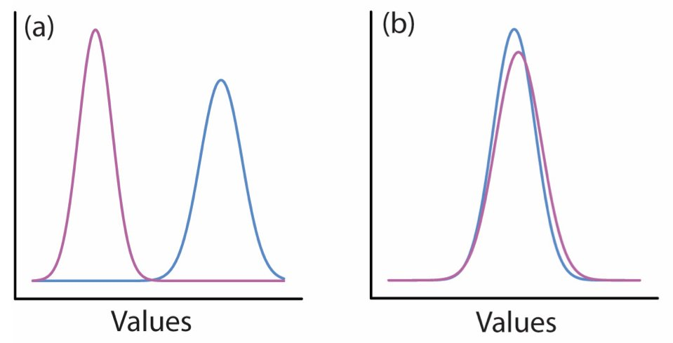{fig-align="center" width="90%"}

## Null and Alternative Hypotheses (SVG)

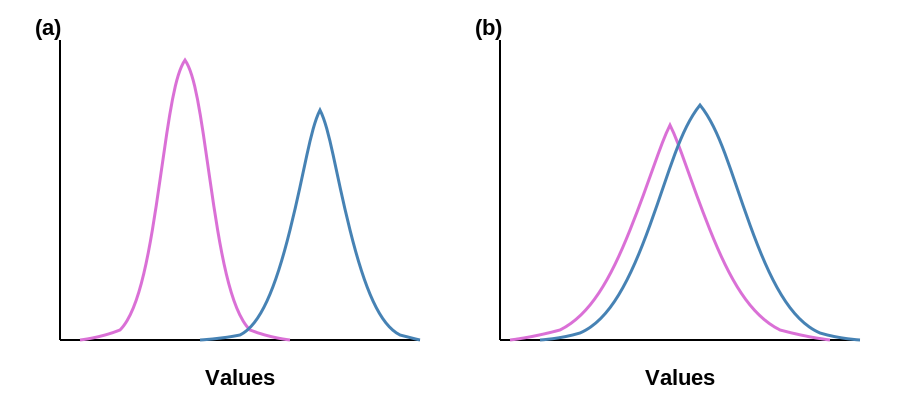{fig-align="center" width="90%"}

## DRAFT: Null and Alternative Hypotheses

::: panel-tabset
### Output

```{r}
#| label: null-alt-draft-output
#| echo: false
#| eval: true
#| fig-width: 10
#| fig-height: 5

par(mfrow = c(1, 2), mar = c(4, 1, 3, 1))

# Panel (a): well-separated distributions
x <- seq(-5, 10, length.out = 500)
plot(x, dnorm(x, 0, 0.8), type = "l", lwd = 3, col = "orchid",
     axes = FALSE, xlab = "Values", ylab = "", main = "(a)",
     ylim = c(0, 0.55))
lines(x, dnorm(x, 4, 1.2), lwd = 3, col = "steelblue")
axis(1)

# Panel (b): overlapping distributions
plot(x, dnorm(x, 2, 1.5), type = "l", lwd = 3, col = "orchid",
     axes = FALSE, xlab = "Values", ylab = "", main = "(b)",
     ylim = c(0, 0.35))
lines(x, dnorm(x, 4, 1.2), lwd = 3, col = "steelblue")
axis(1)
```

### Code

```{r}
#| label: null-alt-draft-code
#| echo: true
#| eval: false

par(mfrow = c(1, 2), mar = c(4, 1, 3, 1))

# Panel (a): well-separated distributions
x <- seq(-5, 10, length.out = 500)
plot(x, dnorm(x, 0, 0.8), type = "l", lwd = 3, col = "orchid",
     axes = FALSE, xlab = "Values", ylab = "", main = "(a)")
lines(x, dnorm(x, 4, 1.2), lwd = 3, col = "steelblue")
axis(1)

# Panel (b): overlapping distributions
plot(x, dnorm(x, 2, 1.5), type = "l", lwd = 3, col = "orchid",
     axes = FALSE, xlab = "Values", ylab = "", main = "(b)")
lines(x, dnorm(x, 4, 1.2), lwd = 3, col = "steelblue")
axis(1)
```

### Interpretation

-   Panel (a): when null and alternative distributions are well separated, hypothesis testing has high power to detect a real effect
-   Panel (b): when distributions overlap substantially, it becomes difficult to distinguish between the null and alternative hypotheses, increasing Type II error risk
-   The degree of separation depends on the effect size and the variability (standard deviation) of each distribution
:::

##

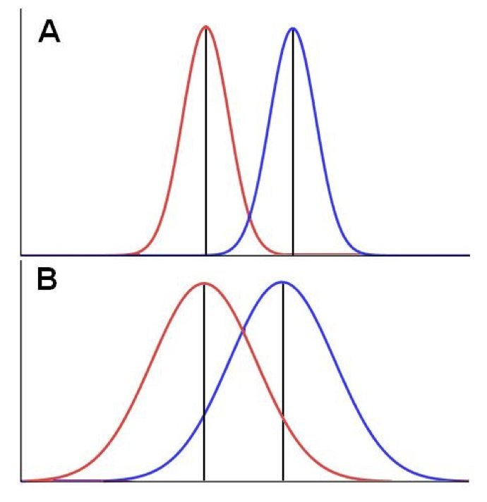{fig-align="center" width="60%"}

## (SVG)

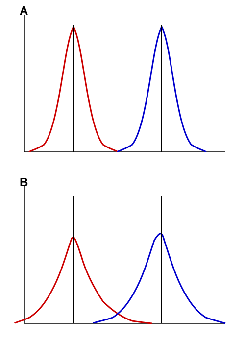{fig-align="center" width="60%"}

## DRAFT: Effect Size and Distribution Overlap

::: panel-tabset
### Output

```{r}
#| label: effect-overlap-draft-output
#| echo: false
#| eval: true
#| fig-width: 6
#| fig-height: 8

par(mfrow = c(2, 1), mar = c(3, 1, 3, 1))

x <- seq(-5, 12, length.out = 500)

# Panel A: small variance, clear separation
plot(x, dnorm(x, 2, 1), type = "l", lwd = 3, col = "red",
     axes = FALSE, xlab = "", ylab = "", main = "A",
     ylim = c(0, 0.45), cex.main = 2)
lines(x, dnorm(x, 6, 1), lwd = 3, col = "blue")
abline(v = c(2, 6), lwd = 2)

# Panel B: large variance, overlapping
plot(x, dnorm(x, 2, 2), type = "l", lwd = 3, col = "red",
     axes = FALSE, xlab = "", ylab = "", main = "B",
     ylim = c(0, 0.25), cex.main = 2)
lines(x, dnorm(x, 6, 2), lwd = 3, col = "blue")
abline(v = c(2, 6), lwd = 2)
```

### Code

```{r}
#| label: effect-overlap-draft-code
#| echo: true
#| eval: false

par(mfrow = c(2, 1), mar = c(3, 1, 3, 1))
x <- seq(-5, 12, length.out = 500)

# Panel A: small variance, clear separation
plot(x, dnorm(x, 2, 1), type = "l", lwd = 3, col = "red",
     axes = FALSE, xlab = "", ylab = "", main = "A",
     ylim = c(0, 0.45), cex.main = 2)
lines(x, dnorm(x, 6, 1), lwd = 3, col = "blue")
abline(v = c(2, 6), lwd = 2)

# Panel B: large variance, overlapping
plot(x, dnorm(x, 2, 2), type = "l", lwd = 3, col = "red",
     axes = FALSE, xlab = "", ylab = "", main = "B",
     ylim = c(0, 0.25), cex.main = 2)
lines(x, dnorm(x, 6, 2), lwd = 3, col = "blue")
abline(v = c(2, 6), lwd = 2)
```

### Interpretation

-   Panel A: with small variance (sd = 1), the same mean difference (4 units) produces clearly separated distributions that are easy to distinguish
-   Panel B: with large variance (sd = 2), the distributions overlap substantially despite having the same mean difference
-   This illustrates why effect size depends on both the magnitude of the difference and the variability within groups
:::

## Type I and Type II Errors

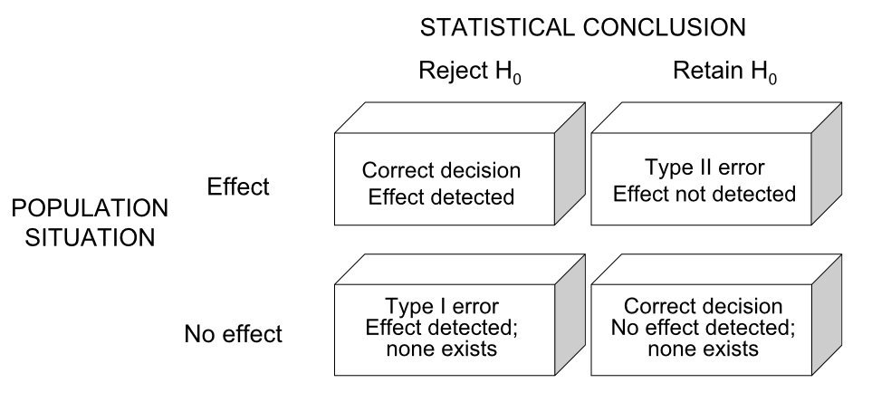{fig-align="center" width="90%"}

## Type I and Type II Errors (SVG)

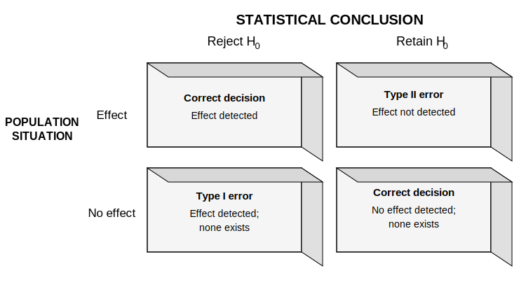{fig-align="center" width="90%"}

## DRAFT: Type I and Type II Errors

|  | **Reject $H_0$** | **Retain $H_0$** |
|:---|:---|:---|
| **Effect exists** | Correct decision: Effect detected | Type II error ($\beta$): Effect not detected |
| **No effect** | Type I error ($\alpha$): Effect detected; none exists | Correct decision: No effect detected; none exists |

## Components of Hypothesis Testing

| Term | Definition |
|:-----------------------------------|:-----------------------------------|
| **p-value** | Probability of observing data as extreme as ours if H₀ is true |
| **α** | Probability making a type 1 error - Critical test (usually 0.05) |
| **β** | Probability of making a type 2 error - accepting a false null |
| **Power** | Probability of rejecting a false null (1 - β) |

## Why $\alpha$ = 0.05?

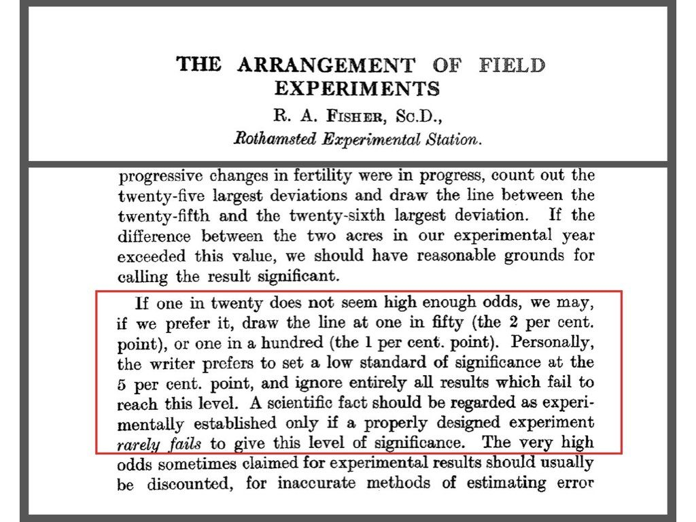{fig-align="center" width="90%"}

::: {.aside}
Source: R. A. Fisher, "The Arrangement of Field Experiments," *Journal of the Ministry of Agriculture*, 1926
:::

# Statistical Sampling Distributions

## Statistical Sampling Distributions

-   When we want to perform a particular hypothesis test, we need to use a statistical test.
-   These statistics are built upon sampling distributions, and they themselves have distributions
-   For example, the t-distribution, F-distribution or $\chi^2$ distribution
-   Our goal is to determine a null distribution of test statistic values assuming $H_0$
-   Then, we compare our observed test value and see how likely it was to occur by chance
-   A small probability - or p-value - means that it was very unlikely to occur.
-   If it is small than our critical value $\alpha$ we reject the null and accept the alternative

## Statistical Sampling Distributions

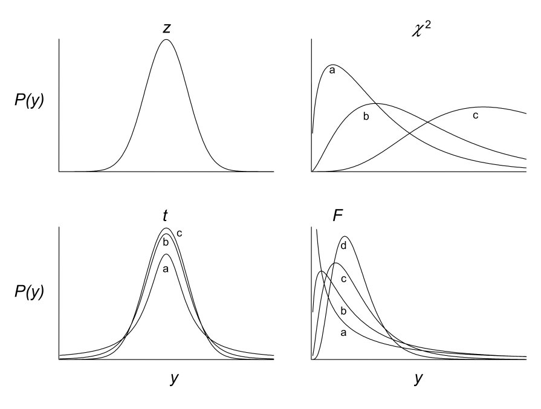{fig-align="center" width="70%"}

## Statistical Sampling Distributions (SVG)

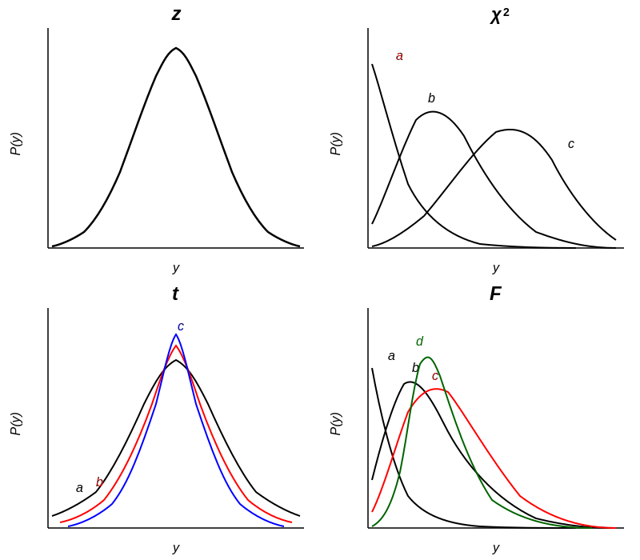{fig-align="center" width="70%"}

## DRAFT: Statistical Sampling Distributions

::: panel-tabset
### Output

```{r}
#| label: stat-dist-draft-output
#| echo: false
#| eval: true
#| fig-width: 10
#| fig-height: 8

par(mfrow = c(2, 2), mar = c(4, 4, 3, 1))

x <- seq(-4, 4, length.out = 500)

# z distribution
plot(x, dnorm(x), type = "l", lwd = 3, main = expression(italic(z)),
     xlab = expression(italic(y)), ylab = expression(italic(P(y))),
     cex.main = 2, las = 1)

# chi-squared
x_chi <- seq(0.01, 20, length.out = 500)
plot(x_chi, dchisq(x_chi, df = 2), type = "l", lwd = 2,
     main = expression(chi^2), col = "red",
     xlab = expression(italic(y)), ylab = expression(italic(P(y))),
     ylim = c(0, 0.35), cex.main = 2, las = 1)
lines(x_chi, dchisq(x_chi, df = 5), lwd = 2, col = "black")
lines(x_chi, dchisq(x_chi, df = 10), lwd = 2, col = "blue")
text(3, 0.32, "a", col = "red", cex = 1.2)
text(5, 0.15, "b", cex = 1.2)
text(12, 0.09, "c", col = "blue", cex = 1.2)

# t distribution
plot(x, dt(x, df = 2), type = "l", lwd = 2, main = expression(italic(t)),
     xlab = expression(italic(y)), ylab = expression(italic(P(y))),
     ylim = c(0, 0.45), cex.main = 2, las = 1)
lines(x, dt(x, df = 5), lwd = 2, col = "red")
lines(x, dt(x, df = 30), lwd = 2, col = "blue")
text(-2.5, 0.08, "a", cex = 1.2)
text(-1.8, 0.15, "b", col = "red", cex = 1.2)
text(0.3, 0.42, "c", col = "blue", cex = 1.2)

# F distribution
x_f <- seq(0.01, 6, length.out = 500)
plot(x_f, df(x_f, df1 = 2, df2 = 5), type = "l", lwd = 2,
     main = expression(italic(F)),
     xlab = expression(italic(y)), ylab = expression(italic(P(y))),
     ylim = c(0, 1.0), cex.main = 2, las = 1)
lines(x_f, df(x_f, df1 = 5, df2 = 10), lwd = 2, col = "red")
lines(x_f, df(x_f, df1 = 10, df2 = 20), lwd = 2, col = "blue")
lines(x_f, df(x_f, df1 = 50, df2 = 100), lwd = 2, col = "darkgreen")
text(0.2, 0.85, "a", cex = 1.2)
text(0.5, 0.65, "b", col = "red", cex = 1.2)
text(0.7, 0.75, "c", col = "blue", cex = 1.2)
text(1, 0.95, "d", col = "darkgreen", cex = 1.2)
```

### Code

```{r}
#| label: stat-dist-draft-code
#| echo: true
#| eval: false

par(mfrow = c(2, 2), mar = c(4, 4, 3, 1))
x <- seq(-4, 4, length.out = 500)

# z distribution
plot(x, dnorm(x), type = "l", lwd = 3, main = expression(italic(z)),
     xlab = expression(italic(y)), ylab = expression(italic(P(y))))

# chi-squared with varying df
x_chi <- seq(0.01, 20, length.out = 500)
plot(x_chi, dchisq(x_chi, df = 2), type = "l", lwd = 2,
     main = expression(chi^2), col = "red")
lines(x_chi, dchisq(x_chi, df = 5), lwd = 2, col = "black")
lines(x_chi, dchisq(x_chi, df = 10), lwd = 2, col = "blue")

# t distribution with varying df
plot(x, dt(x, df = 2), type = "l", lwd = 2, main = expression(italic(t)))
lines(x, dt(x, df = 5), lwd = 2, col = "red")
lines(x, dt(x, df = 30), lwd = 2, col = "blue")

# F distribution with varying df
x_f <- seq(0.01, 6, length.out = 500)
plot(x_f, df(x_f, df1 = 2, df2 = 5), type = "l", lwd = 2,
     main = expression(italic(F)))
lines(x_f, df(x_f, df1 = 5, df2 = 10), lwd = 2, col = "red")
lines(x_f, df(x_f, df1 = 10, df2 = 20), lwd = 2, col = "blue")
```

### Interpretation

-   The z (normal) distribution is symmetric and used when population parameters are known or sample sizes are large
-   The chi-squared distribution is right-skewed and becomes more symmetric with increasing df; used for variance tests and goodness-of-fit
-   The t-distribution has heavier tails than the normal for small df, approaching the normal as df increases; used for comparing means
-   The F-distribution is right-skewed and used for comparing variances and in ANOVA; its shape depends on two df parameters
:::

## Statistical Null Distributions and p-Values

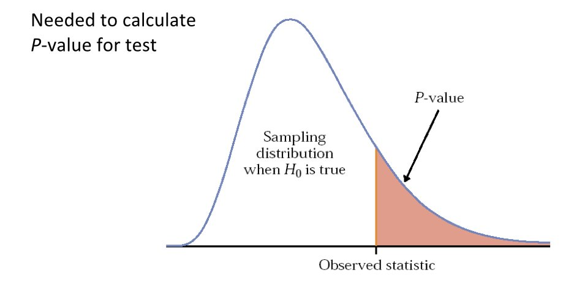{fig-align="center" width="90%"}

## Statistical Null Distributions and p-Values (SVG)

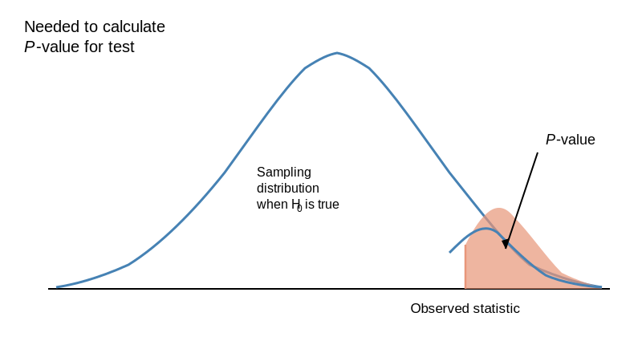{fig-align="center" width="90%"}

## DRAFT: Understanding p-Values

::: panel-tabset
### Output

```{r}
#| label: p-values-draft-output
#| echo: false
#| eval: true
#| fig-width: 8
#| fig-height: 5

x <- seq(-4, 4, length.out = 500)
y <- dnorm(x)
obs_stat <- 1.8

plot(x, y, type = "l", lwd = 3, col = "steelblue",
     axes = FALSE, xlab = "", ylab = "",
     ylim = c(-0.02, max(y) * 1.15))

# Shade p-value region
x_tail <- x[x >= obs_stat]
polygon(c(obs_stat, x_tail, max(x_tail)),
        c(0, dnorm(x_tail), 0),
        col = rgb(1, 0.6, 0.4, 0.6), border = NA)
lines(x, y, lwd = 3, col = "steelblue")

# Axis
axis(1, at = c(obs_stat), labels = c("Observed statistic"), cex.axis = 1.1)
segments(obs_stat, 0, obs_stat, dnorm(obs_stat), lwd = 2, col = "darkorange")

# Labels
text(-1.5, 0.22, expression("Sampling\ndistribution\nwhen " * H[0] * " is true"),
     cex = 1.2)
arrows(2.8, 0.15, 2.5, 0.04, length = 0.12, lwd = 2)
text(3, 0.17, expression(italic(P) * "-value"), cex = 1.4, font = 3)
text(-3, 0.38, expression("Needed to calculate\n" * italic(P) * "-value for test"),
     cex = 1.2)
```

### Code

```{r}
#| label: p-values-draft-code
#| echo: true
#| eval: false

x <- seq(-4, 4, length.out = 500)
y <- dnorm(x)
obs_stat <- 1.8

plot(x, y, type = "l", lwd = 3, col = "steelblue",
     axes = FALSE, xlab = "", ylab = "",
     ylim = c(-0.02, max(y) * 1.15))

# Shade p-value region
x_tail <- x[x >= obs_stat]
polygon(c(obs_stat, x_tail, max(x_tail)),
        c(0, dnorm(x_tail), 0),
        col = rgb(1, 0.6, 0.4, 0.6), border = NA)
lines(x, y, lwd = 3, col = "steelblue")

# Axis and labels
axis(1, at = c(obs_stat), labels = c("Observed statistic"), cex.axis = 1.1)
segments(obs_stat, 0, obs_stat, dnorm(obs_stat), lwd = 2, col = "darkorange")
```

### Interpretation

-   The blue curve represents the sampling distribution of the test statistic assuming the null hypothesis is true
-   The shaded orange area is the p-value: the probability of observing a statistic as extreme or more extreme than the one calculated from the data
-   A smaller shaded area (smaller p-value) provides stronger evidence against the null hypothesis
:::

# T-Tests {background-color="#2c3e50"}

## The t-Distribution

::: panel-tabset
### Equation

$$\large t = \frac{(\bar{y}_1-\bar{y}_2)}{s_{\bar{y}_1-\bar{y}_2}}$$

### LaTeX

``` text
\large t = \frac{(\bar{y}_1-\bar{y}_2)}{s_{\bar{y}_1-\bar{y}_2}}
```

### Interpretation

-   The t-statistic measures how many standard errors the difference between two group means is from zero
-   Larger absolute t-values indicate stronger evidence against the null hypothesis of no difference
-   The denominator standardizes by the variability within groups, so t increases with larger effects or less noise
:::

-   Compares group means
-   Scaled by the standard deviation within group
-   t = 0 indicates no difference
-   BUT sampling variation will create `a distribution of t-values`
-   Shape depends on degrees of freedom (e.g. how much data)

## Visualizing the t-Distribution in R

::: panel-tabset
### Output

```{r}
#| label: fig-t-dist-output
#| fig-cap: "t-distributions approach normal as df increases"
#| fig-width: 9
#| fig-height: 4
#| echo: false
#| eval: true

x <- seq(-4, 4, length.out = 200)
df_values <- c(1, 3, 10, 30)
colors <- c("#E41A1C", "#377EB8", "#4DAF4A", "#984EA3")

plot(x, dnorm(x), type = "l", lwd = 3, col = "black", lty = 2,
     ylab = "Density", xlab = "t-value",
     main = "t-Distributions vs. Standard Normal")

for(i in seq_along(df_values)) {
  lines(x, dt(x, df = df_values[i]), col = colors[i], lwd = 2)
}

legend("topright", c("Normal", paste("df =", df_values)),
       col = c("black", colors), lwd = 2, lty = c(2, rep(1, 4)))
```

### Code

```{r}
#| label: fig-t-dist-code
#| echo: true
#| eval: false

x <- seq(-4, 4, length.out = 200)
df_values <- c(1, 3, 10, 30)
colors <- c("#E41A1C", "#377EB8", "#4DAF4A", "#984EA3")

plot(x, dnorm(x), type = "l", lwd = 3, col = "black", lty = 2,
     ylab = "Density", xlab = "t-value",
     main = "t-Distributions vs. Standard Normal")

for(i in seq_along(df_values)) {
  lines(x, dt(x, df = df_values[i]), col = colors[i], lwd = 2)
}

legend("topright", c("Normal", paste("df =", df_values)),
       col = c("black", colors), lwd = 2, lty = c(2, rep(1, 4)))
```

### Interpretation

-   With low degrees of freedom (df = 1), the t-distribution has heavy tails, reflecting greater uncertainty with small samples
-   As df increases, the t-distribution converges to the standard normal (dashed line), so critical values become less extreme
-   This is why larger samples require smaller t-statistics to achieve significance -- the distribution tightens around zero
:::

## One-Tailed Test

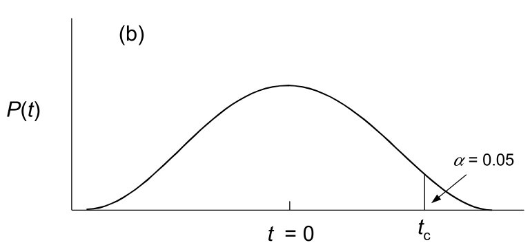{fig-align="center" width="90%"}

## One-Tailed Test (SVG)

{fig-align="center" width="90%"}

## DRAFT: One-Tailed Test

::: panel-tabset
### Output

```{r}
#| label: one-tailed-draft-output
#| echo: false
#| eval: true
#| fig-width: 8
#| fig-height: 4

x <- seq(-4, 4, length.out = 500)
y <- dt(x, df = 20)
tc <- qt(0.95, df = 20)

plot(x, y, type = "l", lwd = 3, axes = FALSE,
     xlab = "", ylab = expression(italic(P(t))),
     main = "(b)")
axis(1, at = c(0, tc), labels = c(expression(italic(t) == 0), expression(italic(t)[c])),
     cex.axis = 1.2)

# Shade alpha region
x_tail <- x[x >= tc]
polygon(c(tc, x_tail, max(x_tail)), c(0, dt(x_tail, df = 20), 0),
        col = "gray80", border = NA)
lines(x, y, lwd = 3)
arrows(tc + 0.5, 0.08, tc + 0.2, 0.02, length = 0.1, lwd = 2)
text(tc + 0.8, 0.10, expression(alpha == 0.05), cex = 1.3)
```

### Code

```{r}
#| label: one-tailed-draft-code
#| echo: true
#| eval: false

x <- seq(-4, 4, length.out = 500)
y <- dt(x, df = 20)
tc <- qt(0.95, df = 20)

plot(x, y, type = "l", lwd = 3, axes = FALSE,
     xlab = "", ylab = expression(italic(P(t))),
     main = "(b)")
axis(1, at = c(0, tc), labels = c(expression(italic(t) == 0), expression(italic(t)[c])),
     cex.axis = 1.2)

# Shade alpha region
x_tail <- x[x >= tc]
polygon(c(tc, x_tail, max(x_tail)), c(0, dt(x_tail, df = 20), 0),
        col = "gray80", border = NA)
lines(x, y, lwd = 3)
arrows(tc + 0.5, 0.08, tc + 0.2, 0.02, length = 0.1, lwd = 2)
text(tc + 0.8, 0.10, expression(alpha == 0.05), cex = 1.3)
```

### Interpretation

-   The one-tailed test concentrates the entire alpha = 0.05 rejection region in the upper tail, providing greater power to detect increases
-   The critical value t_c is lower than in a two-tailed test, making it easier to reject when the effect is in the predicted direction
-   Use one-tailed tests only when you have a strong directional hypothesis established before data collection
:::

## Two-Tailed Test

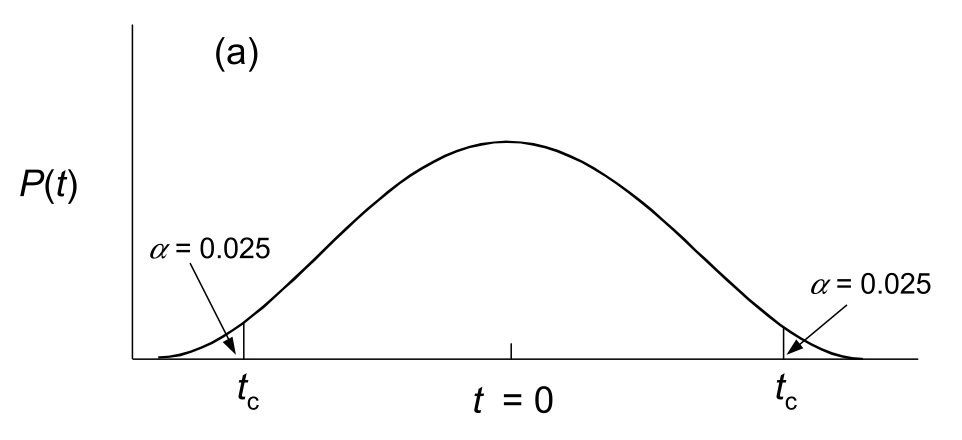{fig-align="center" width="90%"}

## Two-Tailed Test (SVG)

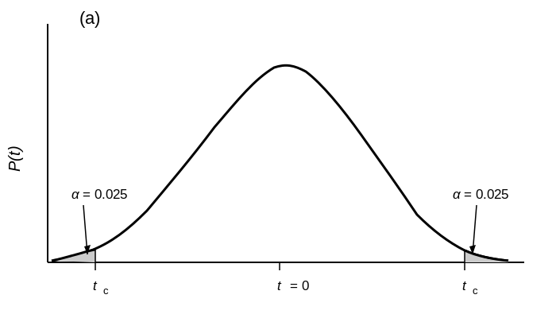{fig-align="center" width="90%"}

## DRAFT: Two-Tailed Test

::: panel-tabset
### Output

```{r}
#| label: two-tailed-draft-output
#| echo: false
#| eval: true
#| fig-width: 8
#| fig-height: 4

x <- seq(-4, 4, length.out = 500)
y <- dt(x, df = 20)
tc <- qt(0.975, df = 20)

plot(x, y, type = "l", lwd = 3, axes = FALSE,
     xlab = "", ylab = expression(italic(P(t))),
     main = "(a)")
axis(1, at = c(-tc, 0, tc),
     labels = c(expression(italic(t)[c]), expression(italic(t) == 0), expression(italic(t)[c])),
     cex.axis = 1.2)

# Shade left tail
x_left <- x[x <= -tc]
polygon(c(min(x_left), x_left, -tc), c(0, dt(x_left, df = 20), 0),
        col = "gray80", border = NA)
# Shade right tail
x_right <- x[x >= tc]
polygon(c(tc, x_right, max(x_right)), c(0, dt(x_right, df = 20), 0),
        col = "gray80", border = NA)
lines(x, y, lwd = 3)

arrows(-tc - 0.5, 0.08, -tc - 0.2, 0.02, length = 0.1, lwd = 2)
text(-tc - 0.8, 0.10, expression(alpha == 0.025), cex = 1.2)
arrows(tc + 0.5, 0.08, tc + 0.2, 0.02, length = 0.1, lwd = 2)
text(tc + 0.8, 0.10, expression(alpha == 0.025), cex = 1.2)
```

### Code

```{r}
#| label: two-tailed-draft-code
#| echo: true
#| eval: false

x <- seq(-4, 4, length.out = 500)
y <- dt(x, df = 20)
tc <- qt(0.975, df = 20)

plot(x, y, type = "l", lwd = 3, axes = FALSE,
     xlab = "", ylab = expression(italic(P(t))),
     main = "(a)")
axis(1, at = c(-tc, 0, tc),
     labels = c(expression(italic(t)[c]), expression(italic(t) == 0), expression(italic(t)[c])),
     cex.axis = 1.2)

# Shade left tail
x_left <- x[x <= -tc]
polygon(c(min(x_left), x_left, -tc), c(0, dt(x_left, df = 20), 0),
        col = "gray80", border = NA)
# Shade right tail
x_right <- x[x >= tc]
polygon(c(tc, x_right, max(x_right)), c(0, dt(x_right, df = 20), 0),
        col = "gray80", border = NA)
lines(x, y, lwd = 3)

arrows(-tc - 0.5, 0.08, -tc - 0.2, 0.02, length = 0.1, lwd = 2)
text(-tc - 0.8, 0.10, expression(alpha == 0.025), cex = 1.2)
arrows(tc + 0.5, 0.08, tc + 0.2, 0.02, length = 0.1, lwd = 2)
text(tc + 0.8, 0.10, expression(alpha == 0.025), cex = 1.2)
```

### Interpretation

-   The two-tailed test splits the total alpha (0.05) equally between both tails, placing 0.025 in each rejection region
-   A test statistic falling in either shaded region leads to rejection of the null hypothesis
-   This is the default and most conservative approach when you have no prior expectation about the direction of the effect
:::

## Visualizing Critical Regions in R

::: panel-tabset
### Output

```{r}
#| label: fig-critical-regions-output
#| fig-cap: "Critical regions for α = 0.05 with df = 20"
#| fig-width: 10
#| fig-height: 4
#| echo: false
#| eval: true

par(mfrow = c(1, 2))
x <- seq(-4, 4, length.out = 200)
df <- 20

# One-tailed test (upper)
plot(x, dt(x, df), type = "l", lwd = 2, main = "One-Tailed Test (α = 0.05)",
     xlab = "t-value", ylab = "Density")
crit_1 <- qt(0.95, df)
polygon(c(crit_1, x[x > crit_1], 4), c(0, dt(x[x > crit_1], df), 0),
        col = "coral", border = NA)
abline(v = crit_1, lty = 2, col = "red")
text(crit_1 + 0.5, 0.1, paste("t* =", round(crit_1, 2)), col = "red")

# Two-tailed test
plot(x, dt(x, df), type = "l", lwd = 2, main = "Two-Tailed Test (α = 0.05)",
     xlab = "t-value", ylab = "Density")
crit_2 <- qt(0.975, df)
polygon(c(crit_2, x[x > crit_2], 4), c(0, dt(x[x > crit_2], df), 0),
        col = "coral", border = NA)
polygon(c(-4, x[x < -crit_2], -crit_2), c(0, dt(x[x < -crit_2], df), 0),
        col = "coral", border = NA)
abline(v = c(-crit_2, crit_2), lty = 2, col = "red")
```

### Code

```{r}
#| label: fig-critical-regions-code
#| echo: true
#| eval: false

par(mfrow = c(1, 2))
x <- seq(-4, 4, length.out = 200)
df <- 20

# One-tailed test (upper)
plot(x, dt(x, df), type = "l", lwd = 2, main = "One-Tailed Test (α = 0.05)",
     xlab = "t-value", ylab = "Density")
crit_1 <- qt(0.95, df)
polygon(c(crit_1, x[x > crit_1], 4), c(0, dt(x[x > crit_1], df), 0),
        col = "coral", border = NA)
abline(v = crit_1, lty = 2, col = "red")
text(crit_1 + 0.5, 0.1, paste("t* =", round(crit_1, 2)), col = "red")

# Two-tailed test
plot(x, dt(x, df), type = "l", lwd = 2, main = "Two-Tailed Test (α = 0.05)",
     xlab = "t-value", ylab = "Density")
crit_2 <- qt(0.975, df)
polygon(c(crit_2, x[x > crit_2], 4), c(0, dt(x[x > crit_2], df), 0),
        col = "coral", border = NA)
polygon(c(-4, x[x < -crit_2], -crit_2), c(0, dt(x[x < -crit_2], df), 0),
        col = "coral", border = NA)
abline(v = c(-crit_2, crit_2), lty = 2, col = "red")
```

### Interpretation

-   The one-tailed test (left) places the entire alpha = 0.05 rejection region in one tail, providing more power to detect effects in a single direction
-   The two-tailed test (right) splits alpha across both tails (0.025 each), testing for effects in either direction but requiring a larger test statistic to reject
-   Choose one-tailed only when you have a strong prior reason to expect an effect in one specific direction
:::

## Assumptions of Parametric t-Tests

-   Normally distributed errors in the populations
-   Equal variances (for two-sample t-test)
-   Independent observations (random sampling)

::: callout-warning
If assumptions are violated, use nonparametric tests or randomization.
:::

## Checking Normality with QQ Plots

A **Quantile-Quantile (QQ) plot** compares your data's distribution to a theoretical (often normal) distribution.

**How to read a QQ plot:**

-   Points follow the diagonal line → data are approximately following the distribution
-   Systematic deviations → data violate normality
-   S-shaped curve → heavy or light tails
-   Curved pattern → skewness

## Checking Normality with QQ Plots

::: panel-tabset
### Output

```{r}
#| label: qq-intro-output
#| echo: false
#| eval: true
#| fig-width: 10
#| fig-height: 4

par(mfrow = c(1, 3))

# Normal data
set.seed(42)
normal_data <- rnorm(100)
qqnorm(normal_data, main = "Normal Data", pch = 19, col = "steelblue")
qqline(normal_data, col = "red", lwd = 2)

# Right-skewed data
skewed_data <- rexp(100, rate = 1)
qqnorm(skewed_data, main = "Right-Skewed Data", pch = 19, col = "steelblue")
qqline(skewed_data, col = "red", lwd = 2)

# Heavy-tailed data
heavy_tail <- rt(100, df = 3)
qqnorm(heavy_tail, main = "Heavy-Tailed Data", pch = 19, col = "steelblue")
qqline(heavy_tail, col = "red", lwd = 2)
```

### Code

```{r}
#| label: qq-intro-code
#| echo: true
#| eval: false

par(mfrow = c(1, 3))

# Normal data
set.seed(42)
normal_data <- rnorm(100)
qqnorm(normal_data, main = "Normal Data", pch = 19, col = "steelblue")
qqline(normal_data, col = "red", lwd = 2)

# Right-skewed data
skewed_data <- rexp(100, rate = 1)
qqnorm(skewed_data, main = "Right-Skewed Data", pch = 19, col = "steelblue")
qqline(skewed_data, col = "red", lwd = 2)

# Heavy-tailed data
heavy_tail <- rt(100, df = 3)
qqnorm(heavy_tail, main = "Heavy-Tailed Data", pch = 19, col = "steelblue")
qqline(heavy_tail, col = "red", lwd = 2)
```

### Interpretation

-   Normal data (left): points closely follow the reference line, confirming the data are approximately normally distributed
-   Right-skewed data (center): points curve upward at the right end, indicating a long right tail typical of count data or reaction times
-   Heavy-tailed data (right): points deviate at both extremes, showing more extreme values than a normal distribution would predict
:::

## QQ Plots in R

::: panel-tabset
### Code

```{r}
#| label: qq-basic-code
#| echo: true
#| eval: false

# Base R approach
qqnorm(my_data)
qqline(my_data, col = "red")

# Or using car package for more options
library(car)
qqPlot(my_data)  # Includes confidence envelope
```

### Interpretation

-   `qqnorm()` and `qqline()` provide a quick visual check of whether data follow a normal distribution
-   The `car::qqPlot()` function adds a confidence envelope, making it easier to judge whether deviations from normality are statistically meaningful
-   QQ plots are preferred over formal tests for assessing normality because they show the nature of any departures (skew, heavy tails, outliers)
:::

## Interpreting QQ Plot Patterns for Normal Distribution

| Pattern | Interpretation | Example Data |
|:-----------------------|:-----------------------|:-----------------------|
| Points on line | Normal distribution | Most biological measurements |
| Upward curve at both ends | Heavy tails (leptokurtic) | Gene expression, financial data |
| Downward curve at both ends | Light tails (platykurtic) | Uniform-like data |
| Concave up | Right skew | Reaction times, cell counts |
| Concave down | Left skew | Ceiling effects |
| Single outlying points | Individual outliers | Measurement errors |

## Formal Normality Tests

While QQ plots are preferred for visual assessment, formal tests exist:

::: panel-tabset
### Output

```{r}
#| label: normality-tests-output
#| echo: false
#| eval: true

# Shapiro-Wilk test (best for n < 50)
set.seed(42)
normal_sample <- rnorm(30)
shapiro.test(normal_sample)
```

### Code

```{r}
#| label: normality-tests-code
#| echo: true
#| eval: false

# Shapiro-Wilk test (best for n < 50)
set.seed(42)
normal_sample <- rnorm(30)
shapiro.test(normal_sample)
```

### Interpretation

-   The Shapiro-Wilk test evaluates whether a sample comes from a normally distributed population; a high p-value (> 0.05) means we cannot reject normality
-   This test works best for small to moderate sample sizes (n < 50); for larger samples, it detects trivial departures from normality
-   Visual inspection with QQ plots is generally preferred because it reveals the nature and severity of non-normality
:::

::: callout-note
## Limitations of Normality Tests

-   Very sensitive with large samples (reject normality for trivial deviations)
-   Low power with small samples (fail to detect real departures)
-   **Visual inspection with QQ plots is often more informative**
:::

# T-tests

## One-Sample t-Test

Tests whether sample mean differs from a hypothesized value:

::: panel-tabset
### Output

```{r}
#| label: one-sample-t-output
#| echo: false
#| eval: true

sample_data <- rnorm(30, mean = 10.5, sd = 2)
t.test(sample_data, mu = 10)
```

### Code

```{r}
#| label: one-sample-t-code
#| echo: true
#| eval: false

sample_data <- rnorm(30, mean = 10.5, sd = 2)
t.test(sample_data, mu = 10)
```

### Interpretation

-   The one-sample t-test evaluates whether the sample mean differs significantly from a hypothesized population value (mu = 10)
-   A significant result suggests the population mean is unlikely to be the hypothesized value
-   The confidence interval provides a range of plausible values for the true population mean
:::

## Two-Sample t-Test

::: panel-tabset
### Output

```{r}
#| label: t-test-example-output
#| echo: false
#| eval: true

set.seed(518)
pop1 <- rnorm(n = 100, mean = 2, sd = 0.5)
pop2 <- rnorm(n = 100, mean = 2.5, sd = 0.5)

t.test(pop1, pop2)
```

### Code

```{r}
#| label: t-test-example-code
#| echo: true
#| eval: false

set.seed(518)
pop1 <- rnorm(n = 100, mean = 2, sd = 0.5)
pop2 <- rnorm(n = 100, mean = 2.5, sd = 0.5)

t.test(pop1, pop2)
```

### Interpretation

-   The two-sample t-test compares the means of two independent groups to determine if they differ significantly
-   A small p-value indicates that the observed difference between groups is unlikely under the null hypothesis of equal means
-   The 95% confidence interval for the difference in means provides a range of plausible effect sizes

### Try It

```{r}
#| label: t-test-try-it
#| echo: true
#| eval: false

# Try changing the means, sd, or sample size and observe the effect on the p-value
pop1 <- rnorm(n = 20, mean = 2, sd = 0.5)   # Try n = 10 or n = 500
pop2 <- rnorm(n = 20, mean = 2.2, sd = 0.5) # Try mean = 3.0 for a larger effect

t.test(pop1, pop2)

# Try a one-sided test
t.test(pop1, pop2, alternative = "less")

# Try Welch's vs. Student's t-test
t.test(pop1, pop2, var.equal = TRUE)  # Student's (assumes equal variance)
```
:::

## Paired t-Test

For matched or repeated measurements:

::: panel-tabset
### Output

```{r}
#| label: paired-t-output
#| echo: false
#| eval: true

before <- c(200, 190, 210, 180, 195)
after <- c(180, 170, 190, 165, 175)

t.test(before, after, paired = TRUE)
```

### Code

```{r}
#| label: paired-t-code
#| echo: true
#| eval: false

before <- c(200, 190, 210, 180, 195)
after <- c(180, 170, 190, 165, 175)

t.test(before, after, paired = TRUE)
```

### Interpretation

-   The paired t-test accounts for within-subject correlation by testing the mean of the differences rather than comparing independent groups
-   A significant result indicates that the treatment produced a consistent directional change across subjects
-   Paired designs are more powerful than independent designs when individual baseline variation is large
:::

## In-Class Practice: T-test on real data

-   Let's practice on the datasets you've downloaded
-   Create a QQ plot to check assumptions
-   Perform a t-test between some levels of a categorical variable
-   Perform both a one-tail and two-tail test
-   Write out the null and alternative hypotheses for each of these tests

## Sample Size and Statistical Significance

With large enough N, even tiny effects become "significant":

::: panel-tabset
### Output

```{r}
#| label: sample-size-sig-output
#| echo: false
#| eval: true

set.seed(22)

# Small effect (1% difference): 20.0 vs 20.2
cat("SMALL SAMPLE (n=10 per group):\n")
diet_A_small <- rnorm(10, 20, 2)
diet_B_small <- rnorm(10, 20.2, 2)
cat("  p-value:", round(t.test(diet_A_small, diet_B_small)$p.value, 4), "\n\n")

cat("LARGE SAMPLE (n=10,000 per group):\n")
diet_A_large <- rnorm(10000, 20, 2)
diet_B_large <- rnorm(10000, 20.2, 2)
cat("  p-value:", format(t.test(diet_A_large, diet_B_large)$p.value, scientific = TRUE), "\n")
```

### Code

```{r}
#| label: sample-size-sig-code
#| echo: true
#| eval: false

set.seed(22)

# Small effect (1% difference): 20.0 vs 20.2
cat("SMALL SAMPLE (n=10 per group):\n")
diet_A_small <- rnorm(10, 20, 2)
diet_B_small <- rnorm(10, 20.2, 2)
cat("  p-value:", round(t.test(diet_A_small, diet_B_small)$p.value, 4), "\n\n")

cat("LARGE SAMPLE (n=10,000 per group):\n")
diet_A_large <- rnorm(10000, 20, 2)
diet_B_large <- rnorm(10000, 20.2, 2)
cat("  p-value:", format(t.test(diet_A_large, diet_B_large)$p.value, scientific = TRUE), "\n")
```

### Interpretation

-   With a small sample (n=10), a tiny 1% difference in means is not statistically significant -- the test lacks power to detect such a small effect
-   With a large sample (n=10,000), the same tiny difference becomes highly significant because the standard error shrinks with sample size
-   This demonstrates that statistical significance alone does not imply practical importance -- always consider effect sizes alongside p-values
:::

::: callout-warning
Statistical significance ≠ practical significance. Always report effect sizes!
:::

# Simulation in Statistics

## Why Simulate?

-   Understand sampling distributions
-   Validate statistical methods
-   Power analysis
-   Bootstrap confidence intervals

# Bootstrapping {background-color="#2c3e50"}

## Etymology of "Bootstrap"

{fig-align="center" width="100%"}

::: {.aside}
Source: Illustration by Oskar Herrfurth; from *The Travels and Surprising Adventures of Baron Munchausen* by Rudolf Erich Raspe, 1785
:::

## Why Bootstrap?

-   Most estimates (not just the mean) lack simple SE formulas
-   Bootstrap is a **nonparametric** approach
-   Invented by Efron (1979)

::: callout-tip
## Bootstrap Can Be Applied To

Means, proportions, correlations, regression coefficients, medians, eigenvalues, and more!
:::

## Bootstrap Steps

1.  Take a random sample **with replacement** from your data
2.  Calculate the estimate from the bootstrap sample
3.  Repeat steps 1-2 many times (≥1000)
4.  Calculate standard deviation of bootstrap estimates

The result is the **bootstrap standard error**.

## Bootstrap Example

::: panel-tabset
### Output

```{r}
#| label: bootstrap-example-output
#| echo: false
#| eval: true
#| fig-width: 8
#| fig-height: 4

set.seed(42)
original_sample <- rnorm(50, mean = 10, sd = 3)

# Bootstrap 1000 times
boot_means <- replicate(1000, mean(sample(original_sample, replace = TRUE)))

hist(boot_means, breaks = 30, col = "steelblue",
     main = "Bootstrap Distribution of Means")
abline(v = quantile(boot_means, c(0.025, 0.975)), col = "red", lwd = 2)
```

### Code

```{r}
#| label: bootstrap-example-code
#| echo: true
#| eval: false

set.seed(42)
original_sample <- rnorm(50, mean = 10, sd = 3)

# Bootstrap 1000 times
boot_means <- replicate(1000, mean(sample(original_sample, replace = TRUE)))

hist(boot_means, breaks = 30, col = "steelblue",
     main = "Bootstrap Distribution of Means")
abline(v = quantile(boot_means, c(0.025, 0.975)), col = "red", lwd = 2)
```

### Interpretation

-   The histogram shows the distribution of means from 1000 bootstrap resamples, approximating the sampling distribution of the mean
-   The red vertical lines mark the 2.5th and 97.5th percentiles, forming a 95% bootstrap confidence interval
-   The roughly normal shape of the bootstrap distribution illustrates the Central Limit Theorem in action

### Try It

```{r}
#| label: bootstrap-try-it
#| echo: true
#| eval: false

# Try bootstrapping the median instead of the mean
set.seed(42)
original_sample <- rnorm(50, mean = 10, sd = 3)

boot_medians <- replicate(1000, median(sample(original_sample, replace = TRUE)))
hist(boot_medians, breaks = 30, col = "darkolivegreen3",
     main = "Bootstrap Distribution of Medians")
abline(v = quantile(boot_medians, c(0.025, 0.975)), col = "red", lwd = 2)

# Try with a skewed distribution (e.g., exponential)
skewed_sample <- rexp(50, rate = 0.5)
boot_means_skewed <- replicate(1000, mean(sample(skewed_sample, replace = TRUE)))
hist(boot_means_skewed, breaks = 30, col = "plum",
     main = "Bootstrap Means from Skewed Data")
```
:::

## Bootstrap Confidence Intervals

::: panel-tabset
### Output

```{r}
#| label: boot-ci-output
#| echo: false
#| eval: true

# 95% CI from bootstrap percentiles
quantile(boot_means, probs = c(0.025, 0.975))
```

### Code

```{r}
#| label: boot-ci-code
#| echo: true
#| eval: false

# 95% CI from bootstrap percentiles
quantile(boot_means, probs = c(0.025, 0.975))
```

### Interpretation

-   The bootstrap 95% CI is constructed by taking the 2.5th and 97.5th percentiles of the resampled means
-   This approach requires no assumptions about the shape of the sampling distribution, making it suitable for small or non-normal samples
-   If the CI does not contain the hypothesized value, we can reject the null hypothesis at the 0.05 level
:::

The 2.5th and 97.5th percentiles provide a 95% confidence interval without normality assumptions.

# Loops in R {background-color="#2c3e50"}

## For Loops

::: panel-tabset
### Output

```{r}
#| label: for-loop-output
#| echo: false
#| eval: true

for (i in 1:5) {
  print(i^2)
}
```

### Code

```{r}
#| label: for-loop-code
#| echo: true
#| eval: false

for (i in 1:5) {
  print(i^2)
}
```

### Interpretation

-   The `for` loop iterates over a sequence, executing the body once for each value
-   This is fundamental for repetitive tasks like bootstrap resampling, permutation tests, and simulations
:::

## While Loops

::: panel-tabset
### Output

```{r}
#| label: while-loop-output
#| echo: false
#| eval: true

i <- 0
while (i < 5) {
  i <- i + 1
  print(i)
}
```

### Code

```{r}
#| label: while-loop-code
#| echo: true
#| eval: false

i <- 0
while (i < 5) {
  i <- i + 1
  print(i)
}
```

### Interpretation

-   A `while` loop continues executing as long as its condition remains TRUE
-   Useful when the number of iterations is not known in advance, such as convergence-based algorithms
-   Be cautious: if the condition never becomes FALSE, the loop runs indefinitely
:::

## If-Else Statements

::: panel-tabset
### Output

```{r}
#| label: if-else-output
#| echo: false
#| eval: true

eggs <- TRUE

if (eggs == TRUE) {
  n_milk <- 6
} else {
  n_milk <- 1
}

cat("Bought", n_milk, "cartons of milk")
```

### Code

```{r}
#| label: if-else-code
#| echo: true
#| eval: false

eggs <- TRUE

if (eggs == TRUE) {
  n_milk <- 6
} else {
  n_milk <- 1
}

cat("Bought", n_milk, "cartons of milk")
```

### Interpretation

-   The `if-else` statement evaluates a logical condition and executes different code blocks depending on whether it is TRUE or FALSE
-   This is essential for controlling program flow in simulations, data cleaning, and conditional analyses
:::

A programmer's partner says: "Buy milk, and if they have eggs, get six." The programmer returns with 6 cartons of milk.Permutation testing to create empirical null distributions

## Permutation Test Example

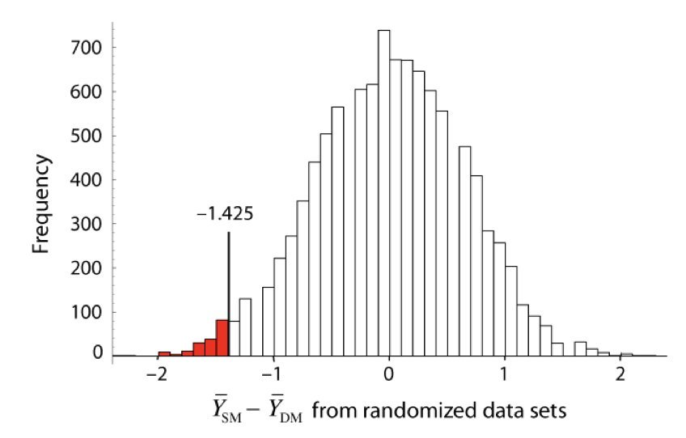{fig-align="center" width="40%"}

## Permutation Test Example (SVG)

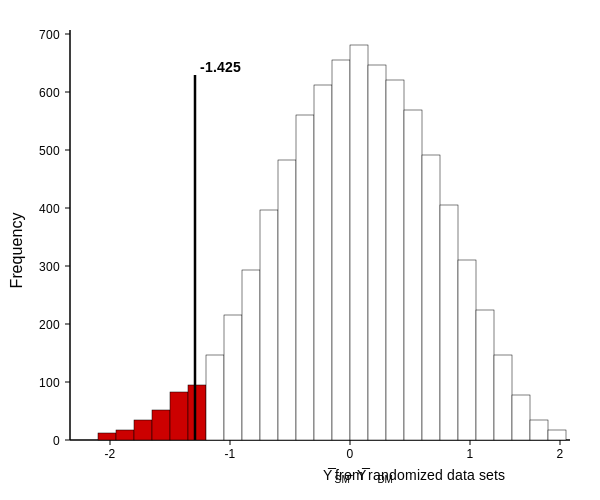{fig-align="center" width="40%"}

## DRAFT: Permutation Null Distribution

::: panel-tabset
### Output

```{r}
#| label: perm-null-draft-output
#| echo: false
#| eval: true
#| fig-width: 6
#| fig-height: 5

# Simulate a permutation test: difference in means between SM and DM groups
set.seed(123)
sm_data <- rnorm(20, mean = 3.5, sd = 1.5)
dm_data <- rnorm(20, mean = 5.0, sd = 1.5)
obs_diff <- mean(sm_data) - mean(dm_data)  # approximately -1.425

combined <- c(sm_data, dm_data)
n_perms <- 5000
perm_diffs <- replicate(n_perms, {
  shuffled <- sample(combined)
  mean(shuffled[1:20]) - mean(shuffled[21:40])
})

# Color bars more extreme than observed
h <- hist(perm_diffs, breaks = 40, plot = FALSE)
colors <- ifelse(h$mids <= obs_diff, "red", "white")

hist(perm_diffs, breaks = 40, col = colors, border = "black",
     main = "", las = 1,
     xlab = expression(bar(Y)[SM] - bar(Y)[DM] * " from randomized data sets"),
     ylab = "Frequency")
abline(v = obs_diff, lwd = 2)
text(obs_diff + 0.1, max(h$counts) * 0.9, round(obs_diff, 3),
     cex = 1.1, adj = 0)
```

### Code

```{r}
#| label: perm-null-draft-code
#| echo: true
#| eval: false

# Simulate a permutation test: difference in means between SM and DM groups
set.seed(123)
sm_data <- rnorm(20, mean = 3.5, sd = 1.5)
dm_data <- rnorm(20, mean = 5.0, sd = 1.5)
obs_diff <- mean(sm_data) - mean(dm_data)

combined <- c(sm_data, dm_data)
n_perms <- 5000
perm_diffs <- replicate(n_perms, {
  shuffled <- sample(combined)
  mean(shuffled[1:20]) - mean(shuffled[21:40])
})

# Color bars more extreme than observed
h <- hist(perm_diffs, breaks = 40, plot = FALSE)
colors <- ifelse(h$mids <= obs_diff, "red", "white")

hist(perm_diffs, breaks = 40, col = colors, border = "black",
     main = "", las = 1,
     xlab = expression(bar(Y)[SM] - bar(Y)[DM] * " from randomized data sets"),
     ylab = "Frequency")
abline(v = obs_diff, lwd = 2)
text(obs_diff + 0.1, max(h$counts) * 0.9, round(obs_diff, 3),
     cex = 1.1, adj = 0)
```

### Interpretation

-   The red-shaded bars represent permuted differences as extreme or more extreme than the observed difference, forming the empirical p-value region
-   The black vertical line shows the observed mean difference between the SM and DM groups
-   If few permuted values fall in the red region, it indicates the observed difference is unlikely due to chance alone
:::

## Creating Empirical Null Distributions

::: panel-tabset
### Output

```{r}
#| label: empirical-null-output
#| echo: false
#| eval: true
#| fig-width: 7
#| fig-height: 4

set.seed(56)
pop_1 <- rnorm(n = 50, mean = 20.1, sd = 2)
pop_2 <- rnorm(n = 50, mean = 19.3, sd = 2)

t_obs <- t.test(x = pop_1, y = pop_2, alternative = "greater")$statistic

pops_comb <- c(pop_1, pop_2)
t_rand <- replicate(1000, {
  pops_shuf <- sample(pops_comb)
  t.test(x = pops_shuf[1:50], y = pops_shuf[51:100], alternative = "greater")$statistic
})

hist(t_rand, breaks = 30, main = "Null Distribution", col = "lightgray")
abline(v = t_obs, col = "red", lwd = 2)
```

### Code

```{r}
#| label: empirical-null-code
#| echo: true
#| eval: false

set.seed(56)
pop_1 <- rnorm(n = 50, mean = 20.1, sd = 2)
pop_2 <- rnorm(n = 50, mean = 19.3, sd = 2)

t_obs <- t.test(x = pop_1, y = pop_2, alternative = "greater")$statistic

pops_comb <- c(pop_1, pop_2)
t_rand <- replicate(1000, {
  pops_shuf <- sample(pops_comb)
  t.test(x = pops_shuf[1:50], y = pops_shuf[51:100], alternative = "greater")$statistic
})

hist(t_rand, breaks = 30, main = "Null Distribution", col = "lightgray")
abline(v = t_obs, col = "red", lwd = 2)
```

### Interpretation

-   The histogram shows the distribution of t-statistics obtained by randomly shuffling group labels, representing what we would expect if there were no true difference
-   The red vertical line marks the observed t-statistic from the original data -- values far from the center of the null distribution suggest a real group difference
-   This permutation approach builds an empirical null distribution without relying on parametric assumptions about the data
:::

## Calculating Empirical p-Value

::: panel-tabset
### Output

```{r}
#| label: empirical-p-output
#| echo: false
#| eval: true

p_value <- sum(t_rand >= t_obs) / 1000
cat("Empirical p-value:", p_value)
```

### Code

```{r}
#| label: empirical-p-code
#| echo: true
#| eval: false

p_value <- sum(t_rand >= t_obs) / 1000
cat("Empirical p-value:", p_value)
```

### Interpretation

-   The empirical p-value counts how often the permuted test statistics exceed the observed statistic, providing a distribution-free significance test
-   A small empirical p-value indicates that the observed difference is unlikely under the null hypothesis of no group difference
-   This approach does not rely on assumptions about the shape of the underlying distribution, making it robust for non-normal data

### Try It

```{r}
#| label: empirical-p-try-it
#| echo: true
#| eval: false

# Try increasing the number of permutations for a more precise p-value
p_value_5000 <- sum(t_rand[1:5000] >= t_obs) / 5000

# Compare the parametric p-value with the empirical one
parametric_p <- t.test(x = pop_1, y = pop_2, alternative = "greater")$p.value
cat("Parametric p-value:", parametric_p, "\n")
cat("Empirical p-value:", p_value, "\n")

# Try with equal means (should give non-significant results)
set.seed(99)
pop_equal_1 <- rnorm(50, mean = 20, sd = 2)
pop_equal_2 <- rnorm(50, mean = 20, sd = 2)
t.test(pop_equal_1, pop_equal_2)
```
:::

# Experimental Design Principles

## What is an Experimental Study?

-   In an **experimental study** the researcher assigns treatments to units
-   In an **observational study** nature does the assigning
-   The crucial advantage of experiments: **random assignment of treatments**
-   Randomization **minimizes the influence of confounding variables**
-   Allows us to infer **cause and effect**

## Clinical Trials

-   Gold standard of experimental designs
-   Two or more treatments assigned to human subjects
-   Design refined because cost of mistakes is high

**Key components:**

-   Simultaneous control group
-   Randomization
-   Blinding
-   Replication
-   Balance
-   Blocking

## Clinical Trial Example

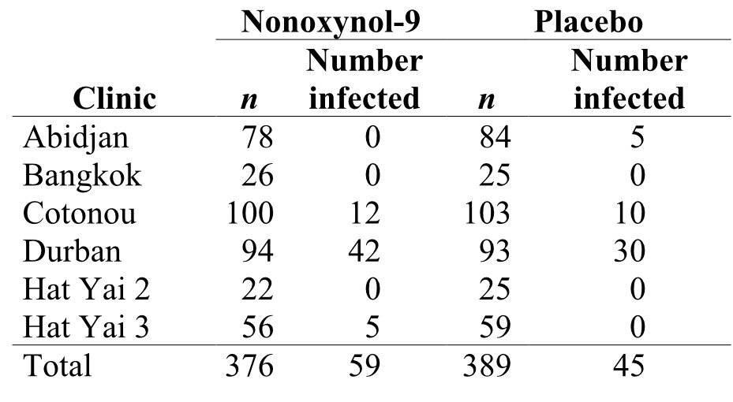{fig-align="center" width="90%"}

## Clinical Trial Example (SVG)

{fig-align="center" width="90%"}

## DRAFT: Clinical Trial Example

|  | **Nonoxynol-9** |  | **Placebo** |  |
|:---------|:---:|:---:|:---:|:---:|
| **Clinic** | **n** | **Number infected** | **n** | **Number infected** |
| Abidjan | 78 | 0 | 84 | 5 |
| Bangkok | 26 | 0 | 25 | 0 |
| Cotonou | 100 | 12 | 103 | 10 |
| Durban | 94 | 42 | 93 | 30 |
| Hat Yai 2 | 22 | 0 | 25 | 0 |
| Hat Yai 3 | 56 | 5 | 59 | 0 |
| **Total** | **376** | **59** | **389** | **45** |

## Simultaneous Control Group

-   Placebo or currently accepted treatment
-   Control subjects should be perturbed similarly to treated subjects
-   "Sham operation" example in surgical studies

## Randomization

-   Breaks association between confounding variables and treatment
-   Ensures variation from confounding variables is similar across groups

**Types:**

-   Completely randomized design
-   Randomized block design
-   Matched pair design

## Random Sampling Approaches

-   **Simple random sample** - every sample has equal probability
-   **Stratified sample** - divided into groups, then random sample from each
-   **Cluster sample** - random sample of naturally occurring groups
-   **Multistage sampling** - combines the above approaches
-   **Systematic sample** - predetermined pattern (e.g., every 20th person)

## Blinding

-   **Single-blind:** Subjects unaware of treatment
-   **Double-blind:** Both subjects and researchers unaware

::: callout-important
Studies without double-blinding exaggerate treatment effects by 16% on average (Jüni et al. 2001)
:::

## Replication and Balance

**Replication:**

-   Assignment of each treatment to multiple independent units
-   Larger samples = smaller standard errors, more power

**Balance:**

-   Equal sample sizes across treatments
-   Minimizes standard error

$$\huge s_{\bar{y}_1 - \bar{y}_2} = \sqrt{\frac{(n_1 - 1)s_1^2 + (n_2 - 1)s_2^2}{n_1 + n_2 - 2}\left(\frac{1}{n_1} + \frac{1}{n_2}\right)}$$

<!--
DUPLICATE SLIDES - Original image versions (remove when LaTeX is finalized)

## Replication and Balance (JPEG Original)

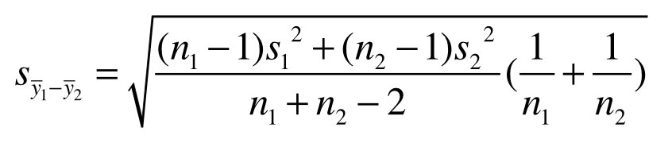{fig-align="center" width="80%"}

## Replication and Balance (SVG)

{fig-align="center" width="80%"}
-->

When $n_1 = n_2$, this simplifies and gives the smallest standard error — this is why **balanced designs** are preferred.

## Types of Replication

Understanding the distinction between replication types is **critical** for valid statistical inference:

| Type | Definition | Example |
|:-----------------------|:-----------------------|:-----------------------|
| **Biological replicates** | Independent biological samples | Different mice, different patients, different cell cultures |
| **Technical replicates** | Repeated measurements of same sample | Running the same sample on a sequencer 3 times |
| **Pseudo-replication** | Treating non-independent observations as independent | Multiple cells from one dish treated as separate replicates |

::: callout-warning
## Common Error

Treating technical replicates or pseudo-replicates as biological replicates inflates sample size and leads to false positives!
:::

## Biological vs. Technical Replication

::: panel-tabset
### Output

```{r}
#| label: replication-diagram-2-output
#| echo: false
#| eval: true
#| fig-width: 10
#| fig-height: 4

par(mfrow = c(1, 2), mar = c(4, 4, 3, 1))

# Biological replication
set.seed(42)
bio_reps <- data.frame(
  mouse = rep(1:6, each = 1),
  treatment = rep(c("Control", "Treatment"), each = 3),
  value = c(rnorm(3, 10, 2), rnorm(3, 15, 2))
)
boxplot(value ~ treatment, data = bio_reps, col = c("lightblue", "coral"),
        main = "Biological Replicates (n=3 per group)",
        ylab = "Response", xlab = "")
text(1.5, 17, "Each point = different mouse", cex = 0.9)

# Technical replication (wrong analysis)
tech_reps <- data.frame(
  measurement = 1:18,
  treatment = rep(c("Control", "Treatment"), each = 9),
  value = c(rep(rnorm(3, 10, 2), each = 3) + rnorm(9, 0, 0.5),
            rep(rnorm(3, 15, 2), each = 3) + rnorm(9, 0, 0.5))
)
boxplot(value ~ treatment, data = tech_reps, col = c("lightblue", "coral"),
        main = "Technical Replicates (n=3 mice, 3 measures each)",
        ylab = "Response", xlab = "")
text(1.5, 17, "True n=3, NOT n=9!", cex = 0.9, col = "red")
```

### Code

```{r}
#| label: replication-diagram-2-code
#| echo: true
#| eval: false

par(mfrow = c(1, 2), mar = c(4, 4, 3, 1))

# Biological replication
set.seed(42)
bio_reps <- data.frame(
  mouse = rep(1:6, each = 1),
  treatment = rep(c("Control", "Treatment"), each = 3),
  value = c(rnorm(3, 10, 2), rnorm(3, 15, 2))
)
boxplot(value ~ treatment, data = bio_reps, col = c("lightblue", "coral"),
        main = "Biological Replicates (n=3 per group)",
        ylab = "Response", xlab = "")
text(1.5, 17, "Each point = different mouse", cex = 0.9)

# Technical replication (wrong analysis)
tech_reps <- data.frame(
  measurement = 1:18,
  treatment = rep(c("Control", "Treatment"), each = 9),
  value = c(rep(rnorm(3, 10, 2), each = 3) + rnorm(9, 0, 0.5),
            rep(rnorm(3, 15, 2), each = 3) + rnorm(9, 0, 0.5))
)
boxplot(value ~ treatment, data = tech_reps, col = c("lightblue", "coral"),
        main = "Technical Replicates (n=3 mice, 3 measures each)",
        ylab = "Response", xlab = "")
text(1.5, 17, "True n=3, NOT n=9!", cex = 0.9, col = "red")
```

### Interpretation

-   The left panel shows true biological replicates: each data point comes from a different mouse, giving n=3 per group
-   The right panel illustrates pseudo-replication: 3 measurements per mouse inflates the apparent sample size to n=9, but the true n remains 3
-   Using technical replicates as if they were biological replicates underestimates standard errors and inflates false positive rates
:::

## Pseudo-Replication: A Common Pitfall

**Definition:** Using observations that are not independent as if they were independent replicates.

**Examples in biology:**

-   Measuring 100 cells from 1 dish, treating as n=100 (true n=1)
-   Taking 5 leaves from each of 3 plants, treating as n=15 (true n=3)
-   Repeated measurements on the same animal over time
-   Multiple fish from the same tank

**Consequences:**

-   Underestimated standard errors
-   Inflated test statistics
-   False positive rates far exceeding α

# Effect Sizes {background-color="#2c3e50"}

## Why Effect Sizes Matter

**Statistical significance ≠ Practical significance**

-   P-values only tell us IF an effect exists
-   Effect sizes tell us HOW BIG the effect is
-   With large samples, even tiny effects become "significant"
-   Always report both p-values AND effect sizes

::: callout-important
## The Significance Problem

A study with n=10,000 might find p \< 0.001 for a difference of 0.1 points on a 100-point scale. Statistically significant? Yes. Practically meaningful? Probably not.
:::

## Cohen's d for t-Tests

**Standardized mean difference:**

::: panel-tabset
### Equation

$$d = \frac{\bar{x}_1 - \bar{x}_2}{s_{pooled}}$$

### LaTeX

``` text
d = \frac{\bar{x}_1 - \bar{x}_2}{s_{pooled}}
```

### Interpretation

-   Cohen's d expresses the difference between two group means in units of pooled standard deviation, making it comparable across different measurement scales
-   Values of 0.2, 0.5, and 0.8 are conventionally considered small, medium, and large effects, though context matters in biological applications
-   Unlike p-values, Cohen's d is independent of sample size and directly quantifies the magnitude of the observed effect
:::

Where: $s_{pooled} = \sqrt{\frac{(n_1-1)s_1^2 + (n_2-1)s_2^2}{n_1 + n_2 - 2}}$

**Interpretation Guidelines (Cohen, 1988):**

| d Value | Interpretation |
|---------|----------------|
| 0.2     | Small effect   |
| 0.5     | Medium effect  |
| 0.8     | Large effect   |

## Calculating Cohen's d in R

::: panel-tabset
### Output

```{r}
#| label: cohens-d-output
#| echo: false
#| eval: true

# Example: Compare two groups
set.seed(123)
group1 <- rnorm(30, mean = 100, sd = 15)
group2 <- rnorm(30, mean = 108, sd = 15)

# Manual calculation
mean_diff <- mean(group2) - mean(group1)
pooled_sd <- sqrt(((29 * sd(group1)^2) + (29 * sd(group2)^2)) / 58)
cohens_d <- mean_diff / pooled_sd

cat("Mean difference:", round(mean_diff, 2), "\n")
cat("Cohen's d:", round(cohens_d, 2), "\n")

# Using t-test
t_result <- t.test(group2, group1)
cat("p-value:", format(t_result$p.value, digits = 4))
```

### Code

```{r}
#| label: cohens-d-code
#| echo: true
#| eval: false

# Example: Compare two groups
set.seed(123)
group1 <- rnorm(30, mean = 100, sd = 15)
group2 <- rnorm(30, mean = 108, sd = 15)

# Manual calculation
mean_diff <- mean(group2) - mean(group1)
pooled_sd <- sqrt(((29 * sd(group1)^2) + (29 * sd(group2)^2)) / 58)
cohens_d <- mean_diff / pooled_sd

cat("Mean difference:", round(mean_diff, 2), "\n")
cat("Cohen's d:", round(cohens_d, 2), "\n")

# Using t-test
t_result <- t.test(group2, group1)
cat("p-value:", format(t_result$p.value, digits = 4))
```

### Interpretation

-   Cohen's d standardizes the mean difference by the pooled standard deviation, making it comparable across studies
-   A d around 0.5 indicates a medium effect -- the two groups differ by about half a standard deviation
-   The p-value tells us the effect is statistically significant, while d tells us the effect is practically meaningful
:::

## Visualizing Effect Sizes

::: panel-tabset
### Output

```{r}
#| label: effect-sizes-output
#| echo: false
#| eval: true
#| fig-width: 10
#| fig-height: 4

par(mfrow = c(1, 3))

# Small effect (d = 0.2)
x <- seq(-4, 6, length.out = 200)
plot(x, dnorm(x, 0, 1), type = "l", lwd = 2, col = "steelblue",
     main = "Small Effect (d = 0.2)", ylab = "Density", xlab = "Value")
lines(x, dnorm(x, 0.2, 1), lwd = 2, col = "coral")
legend("topright", c("Group 1", "Group 2"), col = c("steelblue", "coral"), lwd = 2)

# Medium effect (d = 0.5)
plot(x, dnorm(x, 0, 1), type = "l", lwd = 2, col = "steelblue",
     main = "Medium Effect (d = 0.5)", ylab = "Density", xlab = "Value")
lines(x, dnorm(x, 0.5, 1), lwd = 2, col = "coral")

# Large effect (d = 0.8)
plot(x, dnorm(x, 0, 1), type = "l", lwd = 2, col = "steelblue",
     main = "Large Effect (d = 0.8)", ylab = "Density", xlab = "Value")
lines(x, dnorm(x, 0.8, 1), lwd = 2, col = "coral")
```

### Code

```{r}
#| label: effect-sizes-code
#| echo: true
#| eval: false

par(mfrow = c(1, 3))

# Small effect (d = 0.2)
x <- seq(-4, 6, length.out = 200)
plot(x, dnorm(x, 0, 1), type = "l", lwd = 2, col = "steelblue",
     main = "Small Effect (d = 0.2)", ylab = "Density", xlab = "Value")
lines(x, dnorm(x, 0.2, 1), lwd = 2, col = "coral")
legend("topright", c("Group 1", "Group 2"), col = c("steelblue", "coral"), lwd = 2)

# Medium effect (d = 0.5)
plot(x, dnorm(x, 0, 1), type = "l", lwd = 2, col = "steelblue",
     main = "Medium Effect (d = 0.5)", ylab = "Density", xlab = "Value")
lines(x, dnorm(x, 0.5, 1), lwd = 2, col = "coral")

# Large effect (d = 0.8)
plot(x, dnorm(x, 0, 1), type = "l", lwd = 2, col = "steelblue",
     main = "Large Effect (d = 0.8)", ylab = "Density", xlab = "Value")
lines(x, dnorm(x, 0.8, 1), lwd = 2, col = "coral")
```

### Interpretation

-   Small effects (d = 0.2) show nearly complete overlap between groups -- hard to detect without large samples
-   Medium effects (d = 0.5) show visible separation but substantial overlap remains
-   Large effects (d = 0.8) show clear separation between group distributions and are detectable with modest sample sizes
:::

## Effect Sizes for Correlations

Correlation coefficient **r** is itself an effect size:

| r Value | Interpretation |
|---------|----------------|
| 0.1     | Small          |
| 0.3     | Medium         |
| 0.5     | Large          |

**Coefficient of Determination (r²):**

-   Proportion of variance explained
-   r = 0.3 → r² = 0.09 → only 9% of variance explained
-   More intuitive for interpretation

## Confidence Intervals for Effect Sizes

::: panel-tabset
### Output

```{r}
#| label: effect-size-ci-output
#| echo: false
#| eval: true

# Bootstrap confidence interval for Cohen's d
library(boot)

# Function to calculate Cohen's d
calc_d <- function(data, indices) {
  d <- data[indices, ]
  g1 <- d[d$group == 1, "value"]
  g2 <- d[d$group == 2, "value"]
  pooled_sd <- sqrt(((length(g1)-1)*sd(g1)^2 + (length(g2)-1)*sd(g2)^2) /
                    (length(g1) + length(g2) - 2))
  (mean(g2) - mean(g1)) / pooled_sd
}

# Create data frame
effect_data <- data.frame(
  value = c(group1, group2),
  group = rep(1:2, each = 30)
)

# Bootstrap
boot_d <- boot(effect_data, calc_d, R = 1000)
boot_ci <- boot.ci(boot_d, type = "perc")
cat("Cohen's d =", round(boot_d$t0, 2),
    "\n95% CI: [", round(boot_ci$percent[4], 2), ",",
    round(boot_ci$percent[5], 2), "]")
```

### Code

```{r}
#| label: effect-size-ci-code
#| echo: true
#| eval: false

# Bootstrap confidence interval for Cohen's d
library(boot)

# Function to calculate Cohen's d
calc_d <- function(data, indices) {
  d <- data[indices, ]
  g1 <- d[d$group == 1, "value"]
  g2 <- d[d$group == 2, "value"]
  pooled_sd <- sqrt(((length(g1)-1)*sd(g1)^2 + (length(g2)-1)*sd(g2)^2) /
                    (length(g1) + length(g2) - 2))
  (mean(g2) - mean(g1)) / pooled_sd
}

# Create data frame
effect_data <- data.frame(
  value = c(group1, group2),
  group = rep(1:2, each = 30)
)

# Bootstrap
boot_d <- boot(effect_data, calc_d, R = 1000)
boot_ci <- boot.ci(boot_d, type = "perc")
cat("Cohen's d =", round(boot_d$t0, 2),
    "\n95% CI: [", round(boot_ci$percent[4], 2), ",",
    round(boot_ci$percent[5], 2), "]")
```

### Interpretation

-   Bootstrap provides a confidence interval for the effect size without assuming normality of the sampling distribution
-   If the 95% CI excludes zero, the effect is statistically significant at alpha = 0.05
-   The width of the CI reflects uncertainty in the effect size estimate -- wider intervals suggest more data is needed
:::

## Reporting Effect Sizes

::: callout-tip
## Best Practice Reporting

**For t-tests:**

> "Students who used the new method scored significantly higher (M = 85.3, SD = 12.1) than those using the traditional method (M = 78.6, SD = 11.8), t(58) = 2.14, p = .037, **d = 0.56** \[95% CI: 0.12, 0.99\]."

**For correlations:**

> "There was a moderate positive correlation between study hours and exam scores, r = .42, p \< .001, **r² = .18** (18% variance explained)."
:::

------------------------------------------------------------------------

# Multiple Testing Corrections {background-color="#2c3e50"}

## When Does Multiple Testing Apply?

**Common scenarios requiring correction:**

-   Testing the same hypothesis across multiple genes, proteins, or metabolites (e.g., differential expression analysis)
-   Comparing multiple treatment groups to a control
-   Testing associations between an outcome and many predictors
-   Subgroup analyses (e.g., treatment effects across age groups, sexes, tissues)
-   Running the same analysis on multiple timepoints or conditions
-   Post-hoc pairwise comparisons after ANOVA

**The key question:** Are you making multiple statistical inferences that collectively address a related family of questions?

## What Is NOT Multiple Testing?

**These situations generally don't require correction:**

-   Running diagnostics on a single model (e.g., checking normality, homoscedasticity)
-   Reporting multiple descriptive statistics (means, medians, ranges)
-   A single pre-planned primary analysis with pre-specified covariates
-   Independent studies testing unrelated hypotheses (different papers, different questions)
-   Sensitivity analyses exploring robustness of a single primary result
-   Computing confidence intervals for different parameters in one model

**Rule of thumb:** If the tests address fundamentally different scientific questions and weren't selected from a larger pool, correction may not be needed.

::: callout-tip
When in doubt, ask: "Could I have cherry-picked a significant result from many attempts?"
:::

## The Multiple Testing Problem

When conducting multiple hypothesis tests, the probability of at least one Type I error increases dramatically.

**Family-Wise Error Rate (FWER):**

::: panel-tabset
### Equation

$$FWER = 1 - (1 - \alpha)^k$$

### LaTeX

``` text
FWER = 1 - (1 - \alpha)^k
```

### Interpretation

-   The probability of at least one false positive grows rapidly with the number of tests
-   With just 20 independent tests at alpha = 0.05, there is a 64% chance of at least one false positive
-   This motivates the need for multiple testing corrections in high-throughput biological experiments
:::

Where $k$ is the number of tests performed.

| Tests (k) | FWER (α = 0.05) |
|-----------|-----------------|
| 1         | 0.05            |
| 5         | 0.23            |
| 10        | 0.40            |
| 20        | 0.64            |
| 100       | 0.99            |

## Bonferroni Correction

The simplest and most conservative correction:

::: panel-tabset
### Equation

$$\alpha_{adjusted} = \frac{\alpha}{k}$$

Or equivalently, multiply each p-value by $k$:

$$p_{adjusted} = p \times k$$

### LaTeX

``` text
\alpha_{adjusted} = \frac{\alpha}{k}

p_{adjusted} = p \times k
```

### Interpretation

-   The adjusted significance threshold becomes more stringent as the number of tests increases
-   For 20 tests at alpha = 0.05, each individual test must reach p < 0.0025 to be declared significant
-   This trades increased Type II error (missed true effects) for strict control of false positives
:::

**Pros:** Simple, controls FWER strictly

**Cons:** Very conservative, may miss true effects (increased Type II error)

## Holm Correction (Step-Down)

A less conservative alternative that maintains FWER control:

1.  Order p-values from smallest to largest: $p_{(1)} \leq p_{(2)} \leq ... \leq p_{(k)}$
2.  For the $i$-th smallest p-value, multiply by $(k - i + 1)$
3.  Reject hypotheses where adjusted p-value \< α

**Example with 3 tests:**

| Rank | Original p | Multiplier | Adjusted p |
|------|------------|------------|------------|
| 1    | 0.001      | 3          | 0.003      |
| 2    | 0.030      | 2          | 0.060      |
| 3    | 0.040      | 1          | 0.040      |

## Benjamini-Hochberg Correction (FDR)

Controls the **False Discovery Rate** — the expected proportion of false positives among rejected hypotheses.

**Procedure:**

1.  Order p-values from smallest to largest: $p_{(1)} \leq p_{(2)} \leq ... \leq p_{(k)}$
2.  Find the largest $i$ where $p_{(i)} \leq \frac{i}{k} \alpha$
3.  Reject all hypotheses with $p_{(1)}, ..., p_{(i)}$

**Adjusted p-values:** $p_{adj(i)} = \min\left(\frac{k}{i} \times p_{(i)}, \; 1\right)$, enforcing monotonicity

| Rank | Original p | Calculation | Adjusted p |
|------|------------|-------------|------------|
| 1    | 0.001      | 0.001 × 5/1 | 0.005      |
| 2    | 0.030      | 0.030 × 5/2 | 0.075      |
| 3    | 0.040      | 0.040 × 5/3 | 0.075\*    |

\*Adjusted for monotonicity (can't be less than previous)

**Why use FDR?** Ideal for high-dimensional data (genomics, proteomics) where some false positives are acceptable in exchange for greater power.

## Choosing a Correction Method

| Method | Controls | Stringency | Use When |
|------------------|------------------|------------------|------------------|
| **Bonferroni** | FWER | Most conservative | Few tests, need strict control |
| **Holm** | FWER | Less conservative | Multiple tests, balanced approach |
| **Benjamini-Hochberg** | FDR | Least conservative | Many tests, exploratory analysis |

::: callout-warning
**Data Dredging Warning:** Running many tests to find "something significant" inflates false positives. Always correct for multiple comparisons and report how many tests were conducted!
:::

## Multiple Testing in R

::: panel-tabset
### Output

```{r}
#| label: multiple-testing-output
#| echo: false
#| eval: true

# Original p-values from multiple tests
p_values <- c(0.001, 0.030, 0.040, 0.120, 0.250)

# Different correction methods
data.frame(
  original = p_values,
  bonferroni = p.adjust(p_values, method = "bonferroni"),
  holm = p.adjust(p_values, method = "holm"),
  BH = p.adjust(p_values, method = "BH")  # Benjamini-Hochberg (FDR)
)
```

### Code

```{r}
#| label: multiple-testing-code
#| echo: true
#| eval: false

# Original p-values from multiple tests
p_values <- c(0.001, 0.030, 0.040, 0.120, 0.250)

# Different correction methods
data.frame(
  original = p_values,
  bonferroni = p.adjust(p_values, method = "bonferroni"),
  holm = p.adjust(p_values, method = "holm"),
  BH = p.adjust(p_values, method = "BH")  # Benjamini-Hochberg (FDR)
)
```

### Interpretation

-   Bonferroni is the most conservative: only the smallest p-value (0.001) remains significant after correction
-   Holm provides slightly more power than Bonferroni while still controlling the family-wise error rate
-   Benjamini-Hochberg (FDR) is the most liberal, ideal for exploratory genomics where some false positives are tolerable
-   The choice of correction method depends on whether you prioritize avoiding any false positives (FWER) or maximizing discoveries (FDR)
:::
