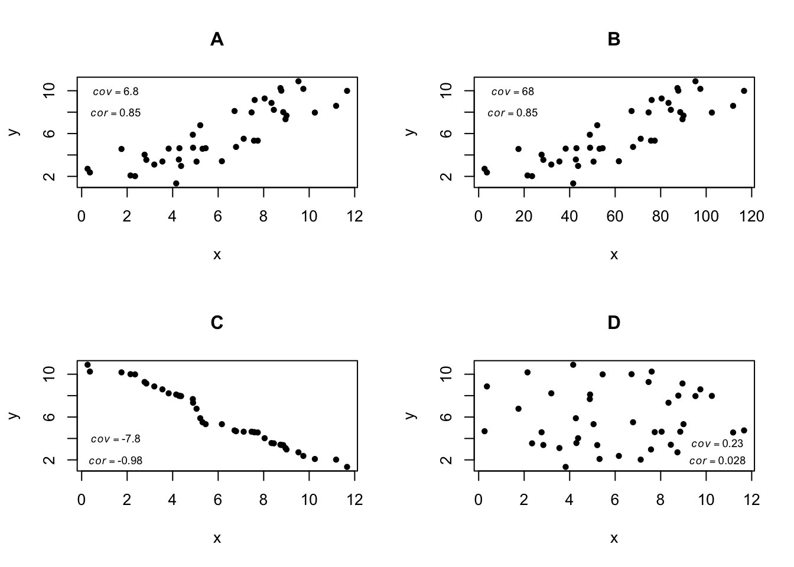
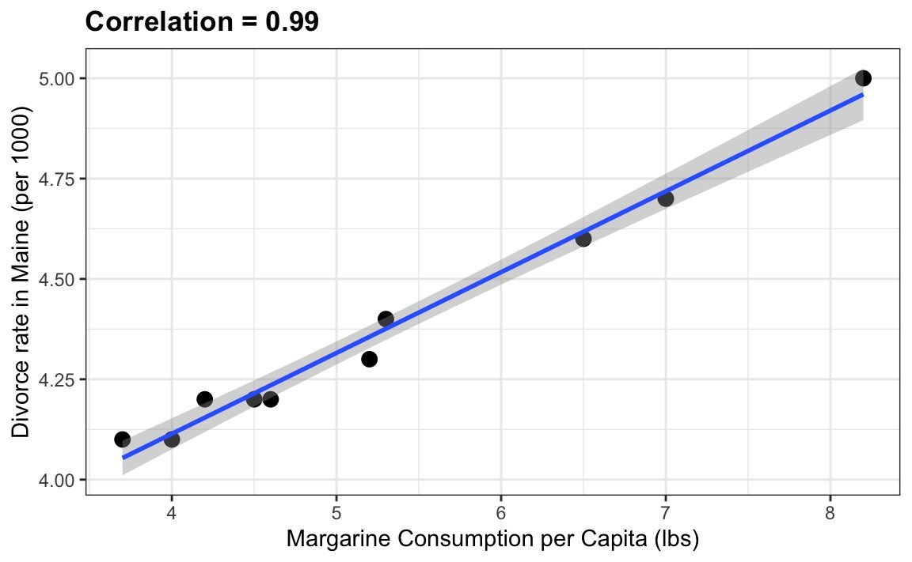
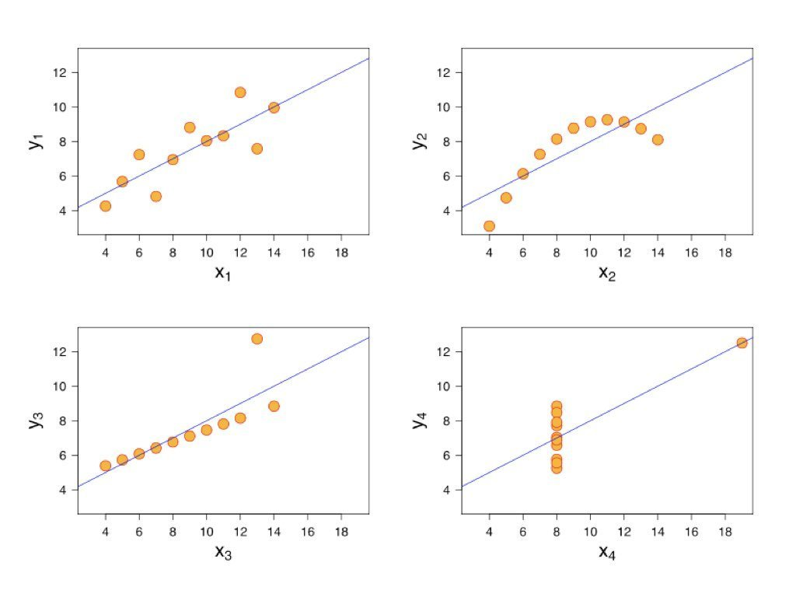
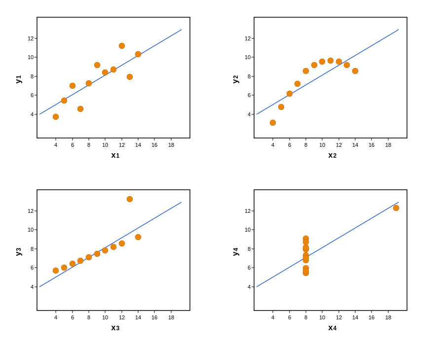
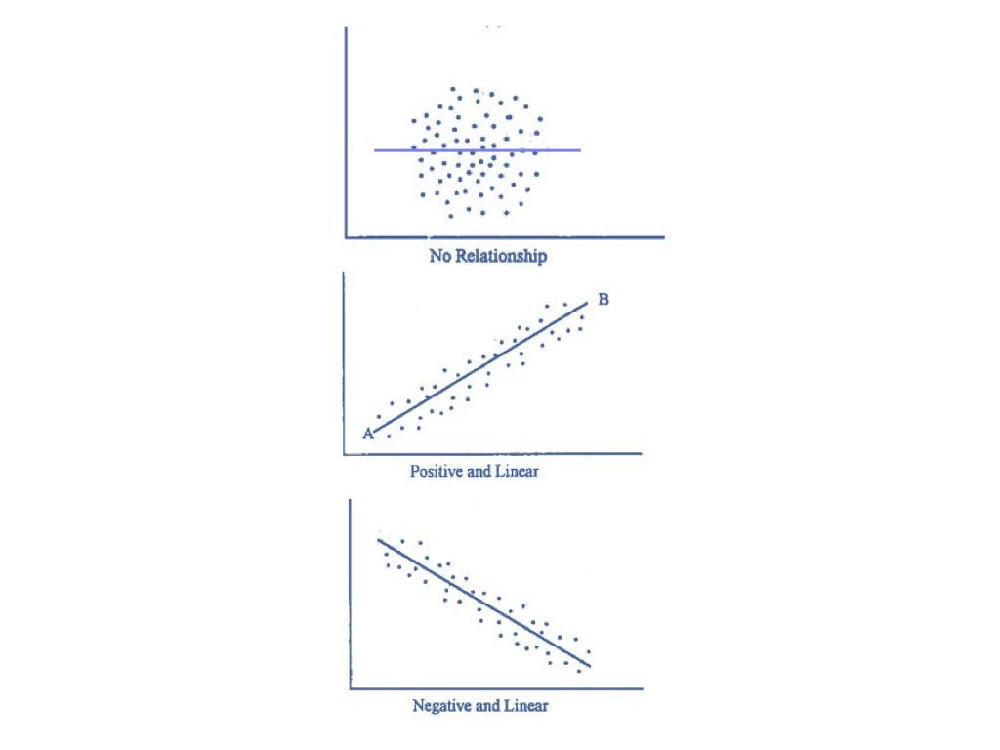
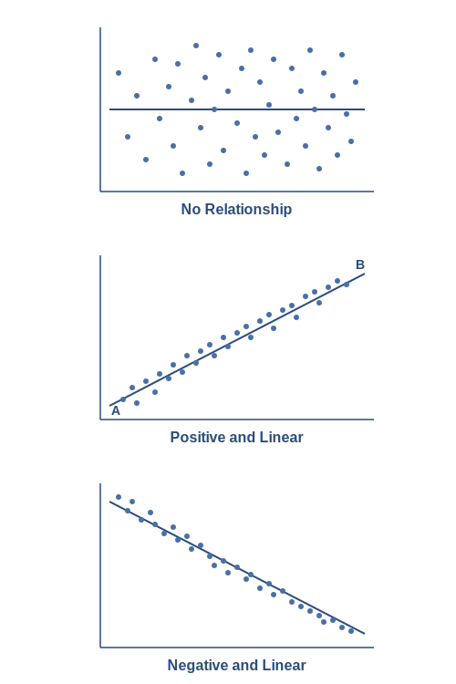
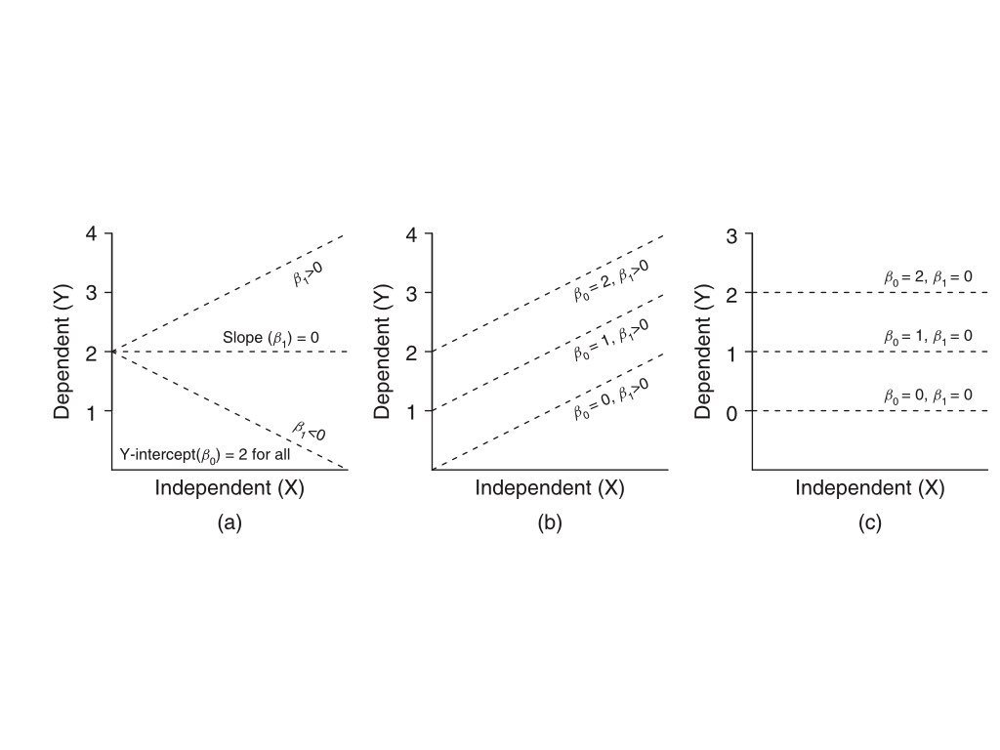

```{r}
#| label: setup
#| include: false

# Core data manipulation and visualization
library(tidyverse)
library(knitr)
library(readxl)

# Statistical analysis packages
library(MASS)        # LDA, robust regression
library(pwr)         # Power analysis
library(boot)        # Bootstrap methods
library(car)         # Companion to Applied Regression
library(survival)    # Survival analysis
library(nlme)        # Mixed effects models
library(broom)       # Tidy model output
library(emmeans)     # Estimated marginal means

# Set consistent theme for all plots
theme_set(theme_minimal(base_size = 14))

# Set seed for reproducibility
set.seed(2026)
```

# Week 4: Frequency and Contingency Analyses, Correlation and Covariance {background-color="#2c3e50"}

## Week 4 Topics

::: incremental
-   Frequency analyses
-   Contingency tests
-   Non-parametric tests
-   Correlation and Covariance
-   Next week - linear models!
:::

::: callout-note
**Readings:** Chapters 18-19 **HW2 Assigned on Wednesday, due next week**
:::

## Packages for This Week

:::: panel-tabset
### Install

```{r}
#| eval: false
#| echo: true

# Install new packages (run once)
install.packages(c("epitools", "DescTools", "pwr"))
```

### Load

```{r}
#| eval: false
#| echo: true

# Load packages
library(tidyverse)    # Data manipulation & visualization
library(epitools)     # Epidemiological tools (odds ratios, risk ratios)
library(DescTools)    # Descriptive statistics & tests (G-test, Cramer's V)
library(pwr)          # Power analysis for study design
```
:::

::: callout-tip
**epitools** is essential for 2×2 contingency table analyses in epidemiology and clinical research.
:::

# Chi-Square Tests {background-color="#2c3e50"}

## The Chi-Square Distribution

If $Z_1, Z_2, ..., Z_k$ are independent standard normal variables:

:::: panel-tabset
### Equation

$$\chi^2_k = \sum_{i=1}^k Z_i^2$$

### LaTeX

``` text
\chi^2_k = \sum_{i=1}^k Z_i^2
```

### Interpretation

- The chi-square distribution arises from summing $k$ squared independent standard normal variables
- The parameter $k$ (degrees of freedom) controls the shape: more terms produce a distribution with a larger mean and less skew
- This distribution is the basis for chi-square goodness-of-fit and independence tests
:::

**Properties:**

-   Domain: $x \in [0, \infty)$
-   Mean: $k$
-   Variance: $2k$
-   Right-skewed

## Chi-Square Distribution

:::: panel-tabset
### Output

```{r}
#| label: chi-square-plot-output
#| echo: false
#| eval: true
#| fig-width: 8
#| fig-height: 4

df_vals <- c(1, 2, 5, 10)
x <- seq(0, 30, length.out = 300)
colors <- c("red", "blue", "green", "purple")

plot(x, dchisq(x, df = 1), type = "l", lwd = 2, col = colors[1],
     ylim = c(0, 0.5), ylab = "Density", main = "Chi-square Distribution")
for(i in 2:4) {
  lines(x, dchisq(x, df = df_vals[i]), lwd = 2, col = colors[i])
}
legend("topright", paste("df =", df_vals), col = colors, lwd = 2)
```

### Code

```{r}
#| label: chi-square-plot-code
#| echo: true
#| eval: false

df_vals <- c(1, 2, 5, 10)
x <- seq(0, 30, length.out = 300)
colors <- c("red", "blue", "green", "purple")

plot(x, dchisq(x, df = 1), type = "l", lwd = 2, col = colors[1],
     ylim = c(0, 0.5), ylab = "Density", main = "Chi-square Distribution")
for(i in 2:4) {
  lines(x, dchisq(x, df = df_vals[i]), lwd = 2, col = colors[i])
}
legend("topright", paste("df =", df_vals), col = colors, lwd = 2)
```

### Interpretation

- With low degrees of freedom (df = 1, 2), the chi-square distribution is strongly right-skewed with density concentrated near zero
- As degrees of freedom increase, the distribution shifts rightward and becomes more symmetric, approaching a normal distribution
- The mean of the distribution equals the degrees of freedom, and the spread increases with higher df
:::

## Chi-Square Test Statistic

:::: panel-tabset
### Equation

$$\chi^2 = \sum \frac{(O_i - E_i)^2}{E_i}$$

### LaTeX

``` text
\chi^2 = \sum \frac{(O_i - E_i)^2}{E_i}
```

### Interpretation

- The chi-square statistic sums the squared differences between observed and expected frequencies, each divided by its expected value
- Larger values indicate greater deviation from the null hypothesis (expected distribution)
- The statistic is compared to the chi-square distribution with appropriate degrees of freedom to obtain a p-value
:::

Where:

-   $O_i$ = Observed frequency
-   $E_i$ = Expected frequency

Degrees of freedom: $df = k - 1$ (goodness-of-fit)

## When to Use Chi-Square Tests

-   **Goodness-of-fit test**: Does observed data match expected proportions?
-   **Test of independence**: Are two categorical variables related?
-   **Test of homogeneity**: Do different groups have the same distribution?

## Assumptions

-   Data are **counts** (not percentages or proportions)
-   Categories are **mutually exclusive**
-   Expected count in each category **should be ≥ 5**

## Goodness-of-Fit Test

Tests whether observed frequencies match expected proportions.

:::: panel-tabset
### Output

```{r}
#| label: gof-test-output
#| echo: false
#| eval: true

# Mendelian 3:1 ratio
observed <- c(Dominant = 72, Recessive = 28)
expected_probs <- c(0.75, 0.25)

chisq.test(x = observed, p = expected_probs)
```

### Code

```{r}
#| label: gof-test-code
#| echo: true
#| eval: false

# Mendelian 3:1 ratio
observed <- c(Dominant = 72, Recessive = 28)
expected_probs <- c(0.75, 0.25)

chisq.test(x = observed, p = expected_probs)
```

### Interpretation

- The test compares observed phenotype counts (72 dominant, 28 recessive) against the expected Mendelian 3:1 ratio (75:25)
- A non-significant p-value indicates the observed data are consistent with Mendelian inheritance
- Small deviations from expected values are normal due to sampling variation
:::

## Goodness-of-Fit: Dice Example

:::: panel-tabset
### Output

```{r}
#| label: dice-gof-output
#| echo: false
#| eval: true

# Rolling a six-sided die 60 times
observed <- c(8, 9, 10, 12, 11, 10)
expected_probs <- rep(1/6, 6)

chisq.test(x = observed, p = expected_probs)
```

### Code

```{r}
#| label: dice-gof-code
#| echo: true
#| eval: false

# Rolling a six-sided die 60 times
observed <- c(8, 9, 10, 12, 11, 10)
expected_probs <- rep(1/6, 6)

chisq.test(x = observed, p = expected_probs)
```

### Interpretation

- The null hypothesis is that the die is fair (each face has probability 1/6)
- The observed counts (8, 9, 10, 12, 11, 10) are close to the expected count of 10 per face
- A large p-value indicates no evidence to reject the null; the die appears to be fair
:::

## Test of Independence

Tests whether two categorical variables are related.

:::: panel-tabset
### Output

```{r}
#| label: independence-test-output
#| echo: false
#| eval: true

# Create contingency table
tbl <- matrix(c(50, 10, 20, 40), nrow = 2, byrow = TRUE)
rownames(tbl) <- c("Group1", "Group2")
colnames(tbl) <- c("Outcome1", "Outcome2")

chisq.test(tbl)
```

### Code

```{r}
#| label: independence-test-code
#| echo: true
#| eval: false

# Create contingency table
tbl <- matrix(c(50, 10, 20, 40), nrow = 2, byrow = TRUE)
rownames(tbl) <- c("Group1", "Group2")
colnames(tbl) <- c("Outcome1", "Outcome2")

chisq.test(tbl)
```

### Interpretation

- The chi-square test of independence evaluates whether group membership is associated with the outcome
- A small p-value indicates a significant association: the distribution of outcomes differs between Group 1 and Group 2
- Group 1 shows a strong preference for Outcome 1 (50 vs. 10), while Group 2 favors Outcome 2 (40 vs. 20)
:::

## Mosaic Plot

:::: panel-tabset
### Output

```{r}
#| label: mosaic-plot-output
#| echo: false
#| eval: true
#| fig-width: 6
#| fig-height: 5

mosaicplot(tbl,
           main = "Mosaic Plot of Contingency Table",
           xlab = "Group",
           ylab = "Outcome",
           color = TRUE)
```

### Code

```{r}
#| label: mosaic-plot-code
#| echo: true
#| eval: false

mosaicplot(tbl,
           main = "Mosaic Plot of Contingency Table",
           xlab = "Group",
           ylab = "Outcome",
           color = TRUE)
```

### Interpretation

- The mosaic plot visually represents the contingency table where tile widths correspond to row totals and tile heights correspond to column proportions within each row
- Differences in tile proportions between groups indicate an association between the categorical variables
- This plot makes it easy to see that Group 1 is heavily skewed toward Outcome 1, while Group 2 favors Outcome 2
:::

## Cramér's V

Effect size for chi-square test:

:::: panel-tabset
### Equation

$$V = \sqrt{\frac{\chi^2}{n(k-1)}}$$

### LaTeX

``` text
V = \sqrt{\frac{\chi^2}{n(k-1)}}
```

### Interpretation

- Cramér's V normalizes the chi-square statistic by sample size $n$ and table dimensions $k$ (the smaller of rows or columns)
- This produces a value between 0 (no association) and 1 (perfect association), making it interpretable regardless of sample size
- Convention: V around 0.1 is a small effect, 0.3 is medium, and 0.5 or above is large
:::

| V   | Interpretation |
|:----|:---------------|
| 0.1 | Small effect   |
| 0.3 | Medium effect  |
| 0.5 | Large effect   |

## Calculating Cramér's V in R

:::: panel-tabset
### Output

```{r}
#| label: cramers-v-output
#| echo: false
#| eval: true

# Chi-square test of independence
test <- chisq.test(tbl)

# Extract test statistic
chisq_val <- test$statistic

# Total number of observations
n <- sum(tbl)

# Minimum of (rows, columns) for Cramér's V formula
k <- min(nrow(tbl), ncol(tbl))

# Cramér's V calculation
cramers_v <- sqrt(chisq_val / (n * (k - 1)))

cat("Cramér's V:", round(cramers_v, 3))
```

### Code

```{r}
#| label: cramers-v-code
#| echo: true
#| eval: false

# Chi-square test of independence
test <- chisq.test(tbl)

# Extract test statistic
chisq_val <- test$statistic

# Total number of observations
n <- sum(tbl)

# Minimum of (rows, columns) for Cramér's V formula
k <- min(nrow(tbl), ncol(tbl))

# Cramér's V calculation
cramers_v <- sqrt(chisq_val / (n * (k - 1)))

cat("Cramér's V:", round(cramers_v, 3))
```

### Interpretation

- Cramér's V provides a standardized effect size for chi-square tests, bounded between 0 and 1
- A value near 0.5 or above indicates a large effect, meaning the two categorical variables are strongly associated
- This complements the p-value by quantifying the practical significance of the relationship
:::

## Fisher's Exact Test

Use when:

-   Sample sizes are small
-   Expected frequencies \< 5

:::: panel-tabset
### Output

```{r}
#| label: fisher-test-output
#| echo: false
#| eval: true

beverage_table <- matrix(c(8, 2, 1, 9), nrow = 2, byrow = TRUE)
rownames(beverage_table) <- c("American", "English")
colnames(beverage_table) <- c("Coffee", "Tea")

fisher.test(beverage_table)
```

### Code

```{r}
#| label: fisher-test-code
#| echo: true
#| eval: false

beverage_table <- matrix(c(8, 2, 1, 9), nrow = 2, byrow = TRUE)
rownames(beverage_table) <- c("American", "English")
colnames(beverage_table) <- c("Coffee", "Tea")

fisher.test(beverage_table)
```

### Interpretation

- Fisher's exact test is appropriate here because the sample size is small (n = 20) and some expected cell counts would be below 5
- The test calculates the exact probability of observing the data under the null hypothesis of no association
- The resulting p-value and odds ratio indicate whether nationality and beverage preference are significantly associated
:::

## Odds Ratios

Compares odds of an event between two groups:

-   **OR = 1**: No association
-   **OR \> 1**: Group 1 has higher odds
-   **OR \< 1**: Group 1 has lower odds

**Example:**

-   Odds (Americans prefer Coffee) = $\frac{8}{2} = 4$

-   Odds (English prefer Coffee) = $\frac{1}{9} ≈ 0.111$

-   **Odds Ratio** = $\frac{4}{0.111} ≈ 36$

::: callout-note
The chi-square test tells us **whether** there is a difference, but the odds ratio tells us the **effect size** - how much more likely one outcome is compared to another.
:::

## Calculating Odds Ratio in R

:::: panel-tabset
### Output

```{r}
#| label: odds-ratio-output
#| echo: false
#| eval: true

# Fisher's test returns odds ratio automatically
fisher_result <- fisher.test(beverage_table)
fisher_result$estimate  # Odds ratio

# 95% confidence interval for odds ratio
fisher_result$conf.int
```

### Code

```{r}
#| label: odds-ratio-code
#| echo: true
#| eval: false

# Fisher's test returns odds ratio automatically
fisher_result <- fisher.test(beverage_table)
fisher_result$estimate  # Odds ratio

# 95% confidence interval for odds ratio
fisher_result$conf.int

# For larger tables, can use epitools package
# install.packages("epitools")
library(epitools)
oddsratio(beverage_table)
```

### Interpretation

- The odds ratio quantifies how much more likely one group is to experience the outcome compared to another group
- A wide confidence interval for the odds ratio suggests uncertainty due to small sample size
- The `epitools` package provides additional functionality for computing odds ratios and relative risks in larger contingency tables
:::

## G-Test (Log-Likelihood Ratio Test)

An alternative to chi-square based on log-likelihood ratios:

-   Better when sample sizes are small
-   Better when differences between observed & expected are small
-   Follows chi-square distribution

:::: panel-tabset
### Output

```{r}
#| label: gtest-output
#| echo: false
#| eval: true

library(DescTools)

# G-test for goodness of fit
observed <- c(161, 38, 53, 6)
expected_ratio <- c(9/16, 3/16, 3/16, 1/16)
GTest(observed, p = expected_ratio)
```

### Code

```{r}
#| label: gtest-code
#| echo: true
#| eval: false

library(DescTools)

# G-test for goodness of fit
observed <- c(161, 38, 53, 6)
expected_ratio <- c(9/16, 3/16, 3/16, 1/16)
GTest(observed, p = expected_ratio)

# G-test for independence
GTest(contingency_table)
```

### Interpretation

- The G-test evaluates whether observed counts match expected proportions (here a 9:3:3:1 Mendelian ratio) using log-likelihood ratios
- It is preferred over the chi-square test when sample sizes are small or when observed and expected values are close
- The output provides a test statistic that follows a chi-square distribution, along with a p-value for the null hypothesis
:::

## R Exercise: Chi-Square and Contingency Analysis

::: callout-tip
## Exercise

A researcher studies the relationship between antibiotic treatment and bacterial clearance:

|             | Cleared | Not Cleared |
|-------------|---------|-------------|
| Treatment A | 45      | 15          |
| Treatment B | 30      | 30          |
| Control     | 20      | 40          |

1.  Create the contingency table in R
2.  Perform chi-square test of independence
3.  Calculate Cramér's V effect size
4.  Interpret: Is treatment associated with clearance?

```{r}
#| eval: false
#| echo: true

# Starter code
bacteria <- matrix(c(45, 15, 30, 30, 20, 40),
                   nrow = 3, byrow = TRUE,
                   dimnames = list(
                     Treatment = c("A", "B", "Control"),
                     Outcome = c("Cleared", "Not Cleared")))

# Your analysis here...
```
:::

# Relationship between two continuous variables

## Covariance and Correlation

-   Simple but useful measures of association between two or more continuous variables
-   Covariance is the shared variance and scales with the variance of the variables
-   Correlcation is a standardized covariance to put the values on a common scale
-   Both are useful but suboptimal compared to linear models.

## Covariance and Correlation

**Covariance** Measures how two variables vary together:

:::: panel-tabset
### Equation

$$Cov(X,Y) = \frac{\sum(x_i - \bar{x})(y_i - \bar{y})}{n-1}$$

### LaTeX

``` text
Cov(X,Y) = \frac{\sum(x_i - \bar{x})(y_i - \bar{y})}{n-1}
```

### Interpretation

- Covariance measures how two variables change together: positive values mean they increase together, negative values mean one increases as the other decreases
- The magnitude depends on the scales of both variables, making it difficult to compare across different variable pairs
- This limitation motivates the use of the correlation coefficient, which standardizes covariance
:::

**Correlation** does the same thing but is a standardized covariance (ranges from -1 to 1):

:::: panel-tabset
### Equation

$$r = \frac{Cov(X,Y)}{s_x \cdot s_y}$$

### LaTeX

``` text
r = \frac{Cov(X,Y)}{s_x \cdot s_y}
```

### Interpretation

- Pearson's correlation coefficient divides the covariance by the product of both standard deviations, standardizing it to the range [-1, 1]
- Values near +1 or -1 indicate strong linear relationships; values near 0 indicate no linear relationship
- Unlike covariance, correlation is unitless and comparable across different variable pairs
:::

-   Positive: variables increase together
-   Negative: one increases as other decreases
-   Zero: no linear relationship

## Covariance and Correlation

{fig-align="center" width="60%"}

## Covariance and Correlation (SVG)

{fig-align="center" width="60%"}

## Visualizing Different Correlations in R

:::: panel-tabset
### Output

```{r}
#| label: fig-correlation-examples-figure
#| fig-cap: "Different correlation strengths and directions"
#| fig-width: 10
#| fig-height: 4
#| echo: false
#| eval: true

par(mfrow = c(1, 4))
set.seed(123)
n <- 100

# Function to generate correlated data
make_corr_data <- function(r, n = 100) {
  x <- rnorm(n)
  y <- r * x + sqrt(1 - r^2) * rnorm(n)
  data.frame(x = x, y = y)
}

correlations <- c(-0.9, -0.3, 0.3, 0.9)
for(r in correlations) {
  d <- make_corr_data(r)
  plot(d$x, d$y, pch = 19, col = rgb(0.2, 0.4, 0.8, 0.5),
       main = paste("r =", r), xlab = "X", ylab = "Y")
  abline(lm(y ~ x, d), col = "red", lwd = 2)
}
```

### Code

```{r}
#| label: fig-correlation-examples-code
#| fig-cap: "Different correlation strengths and directions"
#| fig-width: 10
#| fig-height: 4
#| echo: true
#| eval: false

par(mfrow = c(1, 4))
set.seed(123)
n <- 100

# Function to generate correlated data
make_corr_data <- function(r, n = 100) {
  x <- rnorm(n)
  y <- r * x + sqrt(1 - r^2) * rnorm(n)
  data.frame(x = x, y = y)
}

correlations <- c(-0.9, -0.3, 0.3, 0.9)
for(r in correlations) {
  d <- make_corr_data(r)
  plot(d$x, d$y, pch = 19, col = rgb(0.2, 0.4, 0.8, 0.5),
       main = paste("r =", r), xlab = "X", ylab = "Y")
  abline(lm(y ~ x, d), col = "red", lwd = 2)
}
```

### Interpretation

- Strong correlations (r = -0.9, r = 0.9) show points tightly clustered around the regression line, while weak correlations (r = -0.3, r = 0.3) show much more scatter
- Negative correlations slope downward (as X increases, Y decreases); positive correlations slope upward
- The sign indicates direction and the magnitude indicates strength; these plots help build intuition for interpreting correlation values
:::

## Calculating Correlations in R

### Pearson Correlation Value

:::: panel-tabset
### Output

```{r}
#| label: cor-example-1-output
#| echo: false
#| eval: true

# Using built-in mtcars dataset
cor(mtcars$mpg, mtcars$wt)  # Pearson correlation
```

### Code

```{r}
#| label: cor-example-1-code
#| echo: true
#| eval: false

# Using built-in mtcars dataset
cor(mtcars$mpg, mtcars$wt)  # Pearson correlation
```

### Interpretation

- The Pearson correlation between mpg and weight is approximately -0.87, indicating a strong negative linear relationship
- As car weight increases, fuel efficiency (mpg) decreases substantially
- The magnitude (close to -1) suggests weight is a strong predictor of fuel efficiency
:::

\
\
\

### Pearson Product-Moment Test of Correlation

:::: panel-tabset
### Output

```{r}
#| label: cor-example-2-output
#| echo: false
#| eval: true

# Test significance
cor.test(mtcars$mpg, mtcars$wt)
```

### Code

```{r}
#| label: cor-example-2-code
#| echo: true
#| eval: false

# Test significance
cor.test(mtcars$mpg, mtcars$wt)
```

### Interpretation

- `cor.test()` provides a formal hypothesis test for whether the true correlation is zero
- The very small p-value indicates a statistically significant negative correlation between mpg and weight
- The 95% confidence interval for the correlation coefficient gives the plausible range for the true population correlation
:::

## Parametric vs. Nonparametric Correlation

| Test     | Use When                         | R Function                    |
|:---------|:---------------------------------|:------------------------------|
| Pearson  | Linear relationship, normal data | `cor.test(method="pearson")`  |
| Spearman | Monotonic relationship, n \< 30  | `cor.test(method="spearman")` |
| Kendall  | Monotonic relationship, n ≥ 30   | `cor.test(method="kendall")`  |

# Challenges of only using correlation

## Correlation vs. Causation

**Warning**: Correlation does NOT imply causation without randomization!

{fig-align="center" width="80%"}

::: {.aside}
Source: Tyler Vigen, *Spurious Correlations*, tylervigen.com, 2015
:::

## Anscombe's Quartet

{fig-align="center" width="90%"}

All four datasets have identical: mean of x (9), variance of x (11), mean of y (7.5), correlation (0.816), and regression line ($y = 3.00 + 0.50x$).

::: {.aside}
Source: Anscombe, F.J. "Graphs in Statistical Analysis," *The American Statistician*, 1973
:::

## Anscombe's Quartet (SVG)

{fig-align="center" width="90%"}

All four datasets have identical: mean of x (9), variance of x (11), mean of y (7.5), correlation (0.816), and regression line ($y = 3.00 + 0.50x$).

## In-Class Demo: Anscombe's Quartet in R

:::: panel-tabset
### Output

```{r}
#| label: anscombe-output
#| echo: false
#| eval: true
#| fig-width: 10
#| fig-height: 4

# Built-in anscombe dataset
data(anscombe)

par(mfrow = c(1, 4))
for(i in 1:4) {
  x <- anscombe[, i]; y <- anscombe[, i + 4]
  plot(x, y, pch = 19, col = "steelblue", main = paste("Dataset", i),
       xlim = c(3, 20), ylim = c(3, 13))
  abline(lm(y ~ x), col = "red", lwd = 2)
}
```

### Code

```{r}
#| label: anscombe-code
#| echo: true
#| eval: false

# Built-in anscombe dataset
data(anscombe)

# All four have identical summary statistics!
cat("Dataset 1 - cor:", round(cor(anscombe$x1, anscombe$y1), 3),
    "| Dataset 2 - cor:", round(cor(anscombe$x2, anscombe$y2), 3),
    "\nDataset 3 - cor:", round(cor(anscombe$x3, anscombe$y3), 3),
    "| Dataset 4 - cor:", round(cor(anscombe$x4, anscombe$y4), 3))

par(mfrow = c(1, 4))
for(i in 1:4) {
  x <- anscombe[, i]; y <- anscombe[, i + 4]
  plot(x, y, pch = 19, col = "steelblue", main = paste("Dataset", i),
       xlim = c(3, 20), ylim = c(3, 13))
  abline(lm(y ~ x), col = "red", lwd = 2)
}
```

### Interpretation

- All four datasets share nearly identical correlation (r = 0.816) and regression lines, yet the scatterplots reveal very different patterns
- Dataset 1 shows a standard linear relationship; Dataset 2 is clearly curvilinear; Dataset 3 has an influential outlier shifting the slope; Dataset 4 has a single extreme x-value driving the entire relationship
- This classic example demonstrates that summary statistics alone can be misleading and visual inspection of data is essential
:::

::: callout-warning
**Always visualize your data!** Summary statistics can hide important patterns.
:::

------------------------------------------------------------------------

# Simple Linear Regression {background-color="#2c3e50"}

## What is a Linear Model?

:::: panel-tabset
### Equation

$$y_i = \beta_0 + \beta_1 x_i + \epsilon_i$$

### LaTeX

``` text
y_i = \beta_0 + \beta_1 x_i + \epsilon_i
```

### Interpretation

- A linear model expresses the response variable $y$ as a linear function of predictor $x$ plus random error
- $\beta_0$ (intercept) is the expected value of $y$ when $x = 0$; $\beta_1$ (slope) is the expected change in $y$ per unit increase in $x$
- $\epsilon_i$ represents the residual error assumed to be normally distributed with mean zero
:::

-   $\beta_0$: intercept
-   $\beta_1$: slope
-   $\epsilon_i$: error/residual

## What is a Linear Model?

:::: panel-tabset
### Equation

$$y_i = \beta_0 + \beta_1 x_i + \epsilon_i$$

### LaTeX

``` text
y_i = \beta_0 + \beta_1 x_i + \epsilon_i
```

### Interpretation

- This is the same linear model equation shown previously, repeated here alongside Galton's historical regression-to-the-mean example
- $\beta_0$ is the predicted value of y when x = 0; $\beta_1$ is the change in y per unit change in x
- $\epsilon_i$ captures all variation not explained by the linear relationship
:::

{fig-align="center" width="100%"}

::: {.aside}
Source: Left: Galton, F. "Regression Towards Mediocrity in Hereditary Stature," *Journal of the Anthropological Institute*, 1886. Right: Genetics class data, 1999.
:::

##

{fig-align="center" width="90%"}

## (SVG)

{fig-align="center" width="90%"}

##

{fig-align="center" width="90%"}

## (SVG)

{fig-align="center" width="90%"}

## Many Methods Are Linear Models

-   Simple linear regression
-   Multiple regression
-   ANOVA (single and multi-factor)
-   ANCOVA
-   Repeated-measures ANOVA

## Classes of Linear Models

| Abbreviation       | Name                       | Description                  |
|:-------------------|:---------------------------|:-----------------------------|
| **GLM**            | General Linear Model       | Continuous variables         |
| **GLMM**           | General Linear Mixed Model | Mixed continuous/categorical |
| **Generalized LM** | Generalized Linear Model   | Non-normal response          |
| **GAM**            | Generalized Additive Model | Non-linear relationships     |

## Linear Models in R

:::: panel-tabset
### Output

```{r}
#| label: lm-syntax-output
#| echo: false
#| eval: true

# Demonstrate formula syntax with mtcars
my_lm <- lm(mpg ~ wt, data = mtcars)
summary(my_lm)
```

### Code

```{r}
#| label: lm-syntax-code
#| echo: true
#| eval: false

# Include intercept (default)
Y ~ X
Y ~ 1 + X

# Exclude intercept
Y ~ -1 + X
Y ~ X - 1

# Fit and examine model
my_lm <- lm(Y ~ X, data = mydata)
summary(my_lm)
```

### Interpretation

- R formula syntax uses `~` to separate the response (left) from predictors (right)
- The intercept is included by default; use `-1` to fit a model through the origin
- `lm()` fits the model and `summary()` provides coefficients, standard errors, t-values, p-values, and R-squared
:::

## Linear Regression Example

:::: panel-tabset
### Output

```{r}
#| label: lm-example-output
#| echo: false
#| eval: true
#| fig-width: 8
#| fig-height: 4

set.seed(123)
x <- runif(50, 0, 10)
y <- 2 + 1.5*x + rnorm(50, 0, 2)

my_lm <- lm(y ~ x)
plot(x, y, pch = 19, col = "steelblue")
abline(my_lm, col = "red", lwd = 2)
```

### Code

```{r}
#| label: lm-example-code
#| echo: true
#| eval: false

set.seed(123)
x <- runif(50, 0, 10)
y <- 2 + 1.5*x + rnorm(50, 0, 2)

my_lm <- lm(y ~ x)
plot(x, y, pch = 19, col = "steelblue")
abline(my_lm, col = "red", lwd = 2)
```

### Interpretation

- The data were generated with a true intercept of 2 and slope of 1.5, so the fitted line should recover values close to these
- The scatter around the line reflects the added noise (SD = 2), illustrating that residual variance is a natural part of regression
- The positive slope confirms a positive linear relationship between x and y
:::
