# Week 5: Linear Models {background-color="#2c3e50"}

## Week 5 Topics

::: incremental
-   Ordinary Linear Models (OLMs)
-   Simple linear regression
-   Loss function - sum of squared error (SSE and MSE)
-   Residual analysis to test assumptions
-   The eugenics origin of linear models
:::

::: callout-note
**Readings:** Chapters 21-24

**HW2 Due this week - on Thursday**
:::

## Packages for This Week

::: panel-tabset
### Install/Load

```{r}
#| eval: false
#| echo: true

# Install new packages (run once)
install.packages(c("ggfortify", "lmodel2"))

# Load packages
library(tidyverse)    # Data manipulation & visualization
library(ggfortify)    # ggplot2 extensions for model diagnostics
library(lmodel2)      # Model II regression (when X and Y both have error)
library(broom)
library(knitr)
```

### Interpretation

- **tidyverse**: Core data manipulation and visualization (includes ggplot2, dplyr, readr, etc.).
- **ggfortify**: Extends ggplot2 to produce diagnostic plots from model objects via `autoplot()`.
- **lmodel2**: Provides Model II regression methods (MA, SMA, RMA) for when both X and Y have measurement error.
- **broom**: Tidies model output into data frames with `tidy()` (coefficients) and `glance()` (model-level statistics).
- **knitr**: Provides `kable()` for rendering tables in presentations and reports.
:::

# Linear Models {background-color="#2c3e50"}

## Classes of Linear Models

| Abbreviation       | Name                       | Description                  |
|:------------------|:-------------------------|:---------------------------|
| **GLM**            | General Linear Model       | Continuous variables         |
| **GLMM**           | General Linear Mixed Model | Mixed continuous/categorical |
| **Generalized LM** | Generalized Linear Model   | Non-normal response          |
| **GAM**            | Generalized Additive Model | Non-linear relationships     |

## What is a Ordinary Linear Model?

An ordinary linear model describes the relationship between a continuous response variable $y$ and one or more predictor variables $x$. In its simplest form with one predictor, the model is:

::: panel-tabset
### Equation

$$y_i = \beta_0 + \beta_1 x_i + \epsilon_i$$

### LaTeX

``` text
y_i = \beta_0 + \beta_1 x_i + \epsilon_i
```

### Interpretation

- This is the fundamental equation of simple linear regression: each observation $y_i$ is modeled as a linear function of $x_i$ plus random error.
- $\beta_0$ (intercept) is the expected value of Y when X equals zero; $\beta_1$ (slope) is the expected change in Y per unit increase in X.
- $\epsilon_i$ captures everything the model does not explain -- measurement error, unmeasured variables, and natural variability.
:::

where:

-   $\beta_0$: intercept — the expected value of $y$ when $x = 0$
-   $\beta_1$: slope — the expected change in $y$ for a one-unit increase in $x$
-   $\epsilon_i$: error/residual — the deviation of observation $i$ from the fitted line

The goal of fitting a linear model is to estimate $\beta_0$ and $\beta_1$ from our data.

## Simple Linear Regression Example

::: panel-tabset
### Output

```{r}
#| label: lm-example-output
#| echo: false
#| eval: true
#| fig-width: 8
#| fig-height: 4

# This part of the code creates two variables, one with random error that is normally distributed
set.seed(123)
x <- runif(50, 0, 10)
y <- 2 + 1.5*x + rnorm(50, 0, 2)

# This part of the code is fitting the model, plotting the points and the best fit line
my_lm <- lm(y ~ x)
plot(x, y, pch = 19, col = "steelblue")
abline(my_lm, col = "red", lwd = 2)
```

### Code

```{r}
#| label: lm-example-code
#| echo: true
#| eval: false

# This part of the code creates two variables, one with random error that is normally distributed
set.seed(123)
x <- runif(50, 0, 10)
y <- 2 + 1.5*x + rnorm(50, 0, 2)

# This part of the code is fitting the model, plotting the points and the best fit line
my_lm <- lm(y ~ x)
plot(x, y, pch = 19, col = "steelblue")
abline(my_lm, col = "red", lwd = 2)
```

### Interpretation

- This example creates simulated data with a known linear relationship ($y = 2 + 1.5x + \text{noise}$) to demonstrate how `lm()` fits a regression line.
- The `set.seed(123)` ensures reproducibility -- you will get the same "random" data each time.
- The scatter shows points around the true line, and `abline()` overlays the OLS-estimated best fit in red.
:::

## 

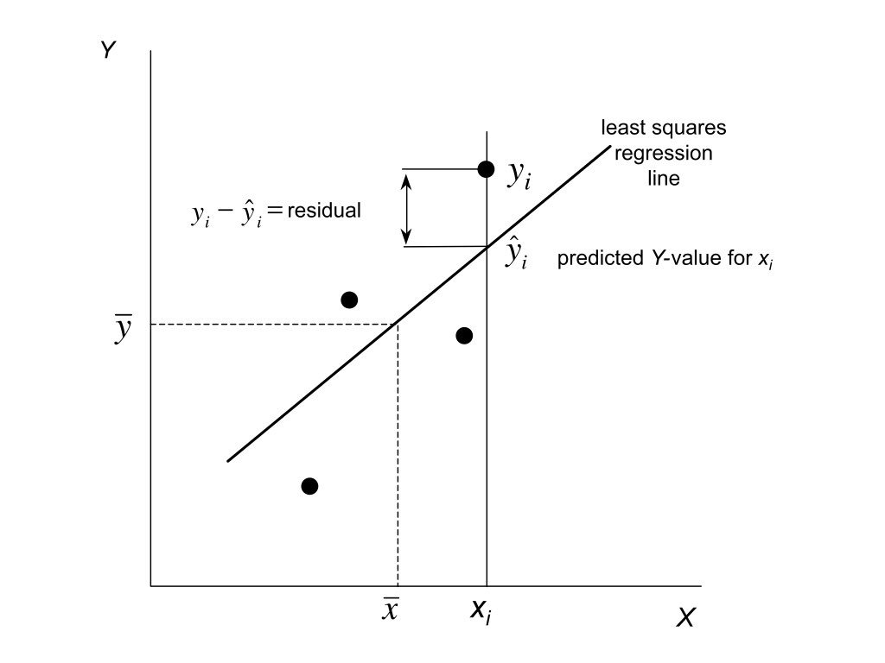{fig-align="center" width="90%"}

## (SVG)

{fig-align="center" width="90%"}

## DRAFT: Residuals and Least Squares

::: panel-tabset
### Output

```{r}
#| echo: false
#| eval: true
#| fig-width: 7
#| fig-height: 6

set.seed(42)
x <- c(2, 3, 3.5, 5, 5.5)
y <- c(2, 4.5, 3, 5.5, 4.5)
fit <- lm(y ~ x)
pred <- predict(fit)
x_bar <- mean(x); y_bar <- mean(y)

plot(x, y, pch = 16, cex = 2, xlim = c(0, 7), ylim = c(0, 7),
     xlab = "X", ylab = "Y", las = 1, cex.lab = 1.5)
abline(fit, lwd = 3)

# Show residual for point 4
i <- 4
segments(x[i], pred[i], x[i], y[i], lwd = 3, col = "black")
rect(x[i] - 0.15, pred[i], x[i] + 0.15, pred[i] + 0.15, border = "black", lwd = 2)
text(x[i] + 0.6, y[i], bquote(y[i]), cex = 1.4, font = 3)
text(x[i] + 0.6, pred[i], bquote(hat(y)[i]), cex = 1.4, font = 3)
text(x[i] - 1.2, (y[i] + pred[i]) / 2,
     bquote(y[i] - hat(y)[i] == "residual"), cex = 1.1, font = 3)

# Show x_bar, y_bar
abline(h = y_bar, lty = 2, col = "gray50")
abline(v = x_bar, lty = 2, col = "gray50")
text(x_bar, 0.3, expression(bar(x)), cex = 1.3, font = 3)
text(0.3, y_bar, expression(bar(y)), cex = 1.3, font = 3)

# Label regression line
text(6.2, predict(fit, newdata = data.frame(x = 6.2)) + 0.5,
     "least squares\nregression\nline", cex = 1.0, adj = 0)
text(x[i] + 0.3, pred[i] - 0.3, expression("predicted Y-value for " * x[i]),
     cex = 0.9, adj = 0)
```

### Code

```{r}
#| echo: true
#| eval: false

set.seed(42)
x <- c(2, 3, 3.5, 5, 5.5)
y <- c(2, 4.5, 3, 5.5, 4.5)
fit <- lm(y ~ x)
pred <- predict(fit)

plot(x, y, pch = 16, cex = 2, xlim = c(0, 7), ylim = c(0, 7),
     xlab = "X", ylab = "Y", las = 1)
abline(fit, lwd = 3)

# Show residual for a point
i <- 4
segments(x[i], pred[i], x[i], y[i], lwd = 3, col = "black")
text(x[i] + 0.6, y[i], bquote(y[i]), cex = 1.4)
text(x[i] + 0.6, pred[i], bquote(hat(y)[i]), cex = 1.4)

# Show means
abline(h = mean(y), lty = 2, col = "gray50")
abline(v = mean(x), lty = 2, col = "gray50")
```

### Interpretation

- The vertical distance between each observed point ($y_i$) and the regression line ($\hat{y}_i$) is the **residual** for that observation.
- The least squares regression line always passes through the point ($\bar{x}$, $\bar{y}$) -- the means of X and Y.
- OLS finds the line that minimizes the sum of all squared residuals, giving the "best fit" in the least-squares sense.
:::

##

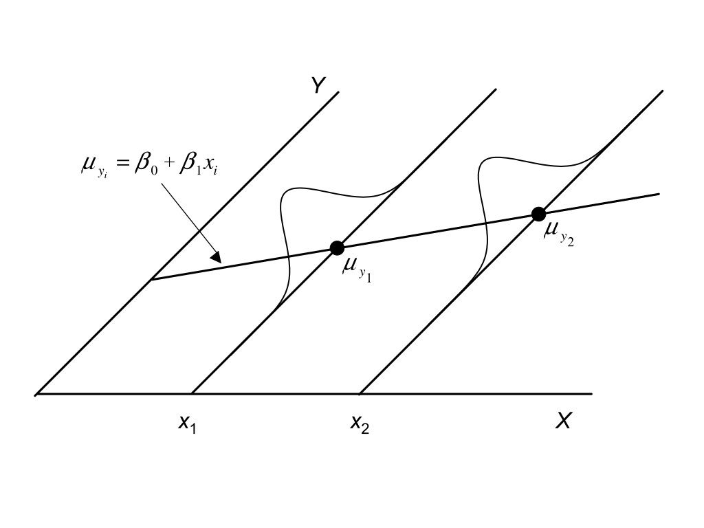{fig-align="center" width="90%"}

## (SVG)

{fig-align="center" width="90%"}

## DRAFT: Regression Conditional Distributions

::: panel-tabset
### Output

```{r}
#| echo: false
#| eval: true
#| fig-width: 8
#| fig-height: 6

# Show regression line with normal distributions at two x values
plot(NULL, xlim = c(0, 10), ylim = c(0, 12),
     xlab = "X", ylab = "Y", las = 1, cex.lab = 1.5, axes = FALSE)
axis(1, at = c(3, 7), labels = c(expression(x[1]), expression(x[2])), cex.axis = 1.3)
axis(2, labels = FALSE)

# Regression line
abline(a = 2, b = 1, lwd = 3)
# Confidence band
abline(a = 0.5, b = 1, lwd = 1, lty = 1)
abline(a = 3.5, b = 1, lwd = 1, lty = 1)

# Normal distributions at x1 = 3 and x2 = 7
for (xi in c(3, 7)) {
  mu_y <- 2 + xi
  y_seq <- seq(mu_y - 3, mu_y + 3, length.out = 100)
  dens <- dnorm(y_seq, mean = mu_y, sd = 1)
  lines(xi + dens * 4, y_seq, lwd = 2)
  points(xi, mu_y, pch = 16, cex = 1.5)
}
text(3.5, 5, expression(mu[y[1]]), cex = 1.3)
text(7.5, 9, expression(mu[y[2]]), cex = 1.3)
text(2, 10, expression(mu[y[i]] == beta[0] + beta[1] * x[i]),
     cex = 1.3)
```

### Code

```{r}
#| echo: true
#| eval: false

plot(NULL, xlim = c(0, 10), ylim = c(0, 12),
     xlab = "X", ylab = "Y", las = 1, cex.lab = 1.5, axes = FALSE)
axis(1, at = c(3, 7), labels = c(expression(x[1]), expression(x[2])))
axis(2, labels = FALSE)

abline(a = 2, b = 1, lwd = 3)  # Regression line

# Normal distributions at each x value
for (xi in c(3, 7)) {
  mu_y <- 2 + xi
  y_seq <- seq(mu_y - 3, mu_y + 3, length.out = 100)
  dens <- dnorm(y_seq, mean = mu_y, sd = 1)
  lines(xi + dens * 4, y_seq, lwd = 2)
  points(xi, mu_y, pch = 16, cex = 1.5)
}
```

### Interpretation

- At each value of X, the response Y follows a normal distribution centered on the regression line ($\mu_{y_i} = \beta_0 + \beta_1 x_i$).
- The **equal variance** assumption (homoscedasticity) means these conditional distributions all have the same spread ($\sigma^2$), regardless of the X value.
- The **normality** assumption applies to these conditional distributions (or equivalently, to the residuals), not to the marginal distribution of Y.
:::

## Hypothesis Tests in Regression

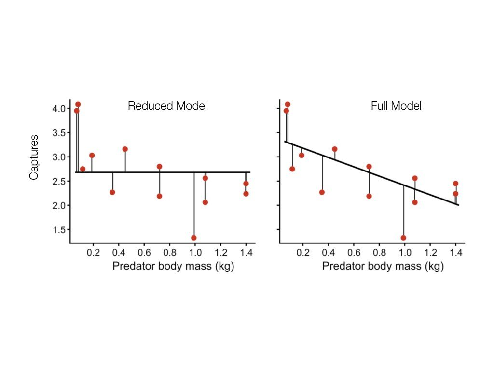{fig-align="center" width="90%"}

## Hypothesis Tests in Regression (SVG)

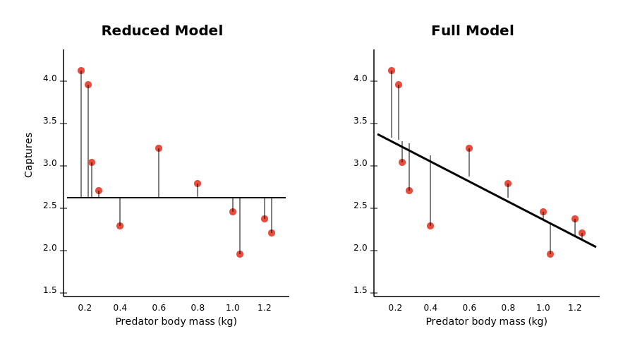{fig-align="center" width="90%"}

## DRAFT: Reduced vs Full Model Residuals

::: panel-tabset
### Output

```{r}
#| echo: false
#| eval: true
#| fig-width: 10
#| fig-height: 5

set.seed(42)
x <- seq(0.1, 1.4, length.out = 15)
y <- 3.2 - 0.7 * x + rnorm(15, 0, 0.4)

par(mfrow = c(1, 2), mar = c(5, 4, 3, 1))

# Reduced model (mean only)
plot(x, y, pch = 16, col = "red", cex = 1.5,
     xlab = "Predator body mass (kg)", ylab = "Captures",
     main = "Reduced Model", ylim = c(1, 4.2), las = 1)
abline(h = mean(y), lwd = 2)
segments(x, mean(y), x, y, lwd = 1)

# Full model (regression)
plot(x, y, pch = 16, col = "red", cex = 1.5,
     xlab = "Predator body mass (kg)", ylab = "Captures",
     main = "Full Model", ylim = c(1, 4.2), las = 1)
fit <- lm(y ~ x)
abline(fit, lwd = 2)
segments(x, predict(fit), x, y, lwd = 1)
```

### Code

```{r}
#| echo: true
#| eval: false

set.seed(42)
x <- seq(0.1, 1.4, length.out = 15)
y <- 3.2 - 0.7 * x + rnorm(15, 0, 0.4)

par(mfrow = c(1, 2), mar = c(5, 4, 3, 1))

# Reduced model (mean only)
plot(x, y, pch = 16, col = "red", cex = 1.5,
     xlab = "Predator body mass (kg)", ylab = "Captures",
     main = "Reduced Model", ylim = c(1, 4.2), las = 1)
abline(h = mean(y), lwd = 2)
segments(x, mean(y), x, y, lwd = 1)

# Full model (regression)
plot(x, y, pch = 16, col = "red", cex = 1.5,
     xlab = "Predator body mass (kg)", ylab = "Captures",
     main = "Full Model", ylim = c(1, 4.2), las = 1)
fit <- lm(y ~ x)
abline(fit, lwd = 2)
segments(x, predict(fit), x, y, lwd = 1)
```

### Interpretation

- The **reduced model** ($H_0$: $\beta_1 = 0$) uses only the overall mean to predict Y -- the residuals (vertical lines) are the deviations from that horizontal line.
- The **full model** adds the predictor X, allowing the line to tilt. The residuals from the regression line are visibly smaller.
- The F-test compares these two sets of residuals: if the full model's residuals are substantially smaller, the predictor is significant.
:::

## Hypothesis Tests in Regression

::: panel-tabset
### Equation

$$H_0: \beta_1 = 0 \quad \text{(no relationship)}$$ $$H_A: \beta_1 \neq 0 \quad \text{(relationship exists)}$$

### LaTeX

``` text
H_0: \beta_1 = 0 \quad \text{(no relationship)}
H_A: \beta_1 \neq 0 \quad \text{(relationship exists)}
```

### Interpretation

- The null hypothesis states that the slope is zero -- meaning X has no linear relationship with Y.
- The alternative hypothesis states the slope is nonzero -- meaning X does predict Y.
- This is tested by comparing the reduced model (intercept only, $H_0$) to the full model (intercept + slope, $H_A$) via the F-test.
:::

Compares:

-   Reduced model: $y_i = \beta_0 + \epsilon_i$
-   Full model: $y_i = \beta_0 + \beta_1 x_i + \epsilon_i$

## Sum of Squares

| Term         | Description                    |
|:-------------|:-------------------------------|
| $SS_{Total}$ | Total variability in data      |
| $SS_{Model}$ | Variability explained by model |
| $SS_{Error}$ | Unexplained variability        |

::: panel-tabset
### Equation

$$SS_{Total} = SS_{Model} + SS_{Error}$$

### LaTeX

``` text
SS_{Total} = SS_{Model} + SS_{Error}
```

### Interpretation

- This fundamental identity shows that total variability in the data can be decomposed into two parts: what the model explains ($SS_{Model}$) and what remains unexplained ($SS_{Error}$).
- A good model will have a large $SS_{Model}$ relative to $SS_{Error}$, meaning most of the variability is accounted for by the predictor.
- This decomposition is the basis for the F-test and for computing $R^2$.
:::

## The Loss Function: Minimizing Error

Linear regression finds the line of best fit by minimizing the **sum of squared errors (SSE)**. For each observation, the residual is the difference between the observed and predicted value:

::: panel-tabset
### Equation

$$e_i = y_i - \hat{y}_i = y_i - (\hat{\beta}_0 + \hat{\beta}_1 x_i)$$

### LaTeX

``` text
e_i = y_i - \hat{y}_i = y_i - (\hat{\beta}_0 + \hat{\beta}_1 x_i)
```

### Interpretation

- The residual $e_i$ is the vertical distance between the observed value $y_i$ and the predicted value $\hat{y}_i$ on the regression line.
- Positive residuals indicate the observation is above the line; negative residuals indicate it is below.
- Examining residual patterns is the primary method for checking whether regression assumptions are met.
:::

The SSE is the total squared deviation of all observations from the fitted line:

::: panel-tabset
### Equation

$$SSE = \sum_{i=1}^{n} e_i^2 = \sum_{i=1}^{n} (y_i - \hat{y}_i)^2$$

### LaTeX

``` text
SSE = \sum_{i=1}^{n} e_i^2 = \sum_{i=1}^{n} (y_i - \hat{y}_i)^2
```

### Interpretation

- SSE is the total squared deviation of all observations from the fitted line -- the quantity that OLS minimizes.
- Each residual is squared so that positive and negative deviations do not cancel out.
- Comparing SSE between models (e.g., reduced vs. full) forms the basis of the F-test for regression significance.
:::

The **mean squared error (MSE)** normalizes by degrees of freedom:

::: panel-tabset
### Equation

$$MSE = \frac{SSE}{n - p}$$

### LaTeX

``` text
MSE = \frac{SSE}{n - p}
```

### Interpretation

- MSE normalizes the SSE by degrees of freedom, providing an unbiased estimate of the residual variance.
- For simple linear regression, $p = 2$ (one intercept + one slope), so MSE = SSE / ($n - 2$).
- MSE is the denominator of the F-statistic and is used to calculate standard errors of the regression coefficients.
:::

where $p$ is the number of parameters estimated (2 for simple linear regression: intercept and slope). Ordinary Least Squares (OLS) is the method that finds the values of $\hat{\beta}_0$ and $\hat{\beta}_1$ that minimize the SSE.

## Hypothesis Tests in Regression

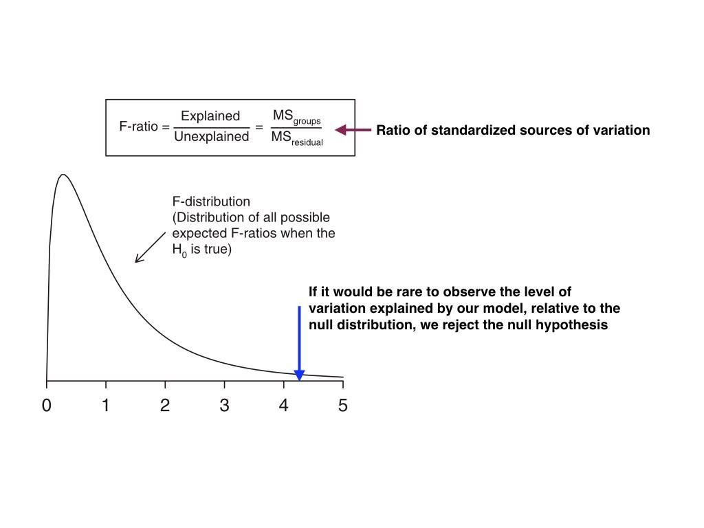{fig-align="center" width="90%"}

## Hypothesis Tests in Regression (SVG)

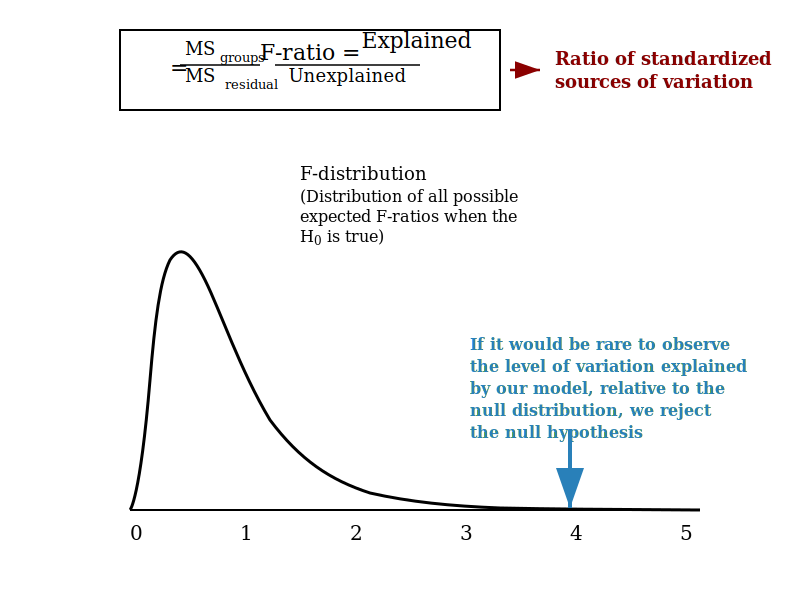{fig-align="center" width="90%"}

## DRAFT: F-Ratio and the F-Distribution

::: panel-tabset
### Equation

$$\text{F-ratio} = \frac{\text{Explained}}{\text{Unexplained}} = \frac{MS_{groups}}{MS_{residual}}$$

### LaTeX

``` text
\text{F-ratio} = \frac{\text{Explained}}{\text{Unexplained}} = \frac{MS_{groups}}{MS_{residual}}
```

### Interpretation

- The F-ratio compares the variance explained by the model to the unexplained (residual) variance.
- An F-ratio near 1 means the model explains no more variance than expected by chance (consistent with $H_0$).
- A large F-ratio means the model explains substantially more variance than expected, providing evidence against $H_0$.
:::

**Ratio of standardized sources of variation**

::: panel-tabset
### Output

```{r}
#| echo: false
#| eval: true
#| fig-width: 7
#| fig-height: 4

x <- seq(0.01, 6, length.out = 500)
plot(x, df(x, df1 = 3, df2 = 20), type = "l", lwd = 3,
     xlab = "", ylab = "", axes = FALSE,
     ylim = c(0, 0.8))
axis(1, at = 0:5, cex.axis = 1.3)

# Mark observed F value
abline(v = 4.2, col = "blue", lwd = 3)
arrows(4.2, 0.35, 4.2, 0.02, col = "blue", lwd = 3, length = 0.15)

text(2, 0.5, "F-distribution\n(Distribution of all possible\nexpected F-ratios when the\nH₀ is true)", cex = 1.0)
text(4.8, 0.45, "If it would be rare to observe\nthe level of variation explained\nby our model, relative to the\nnull distribution, we reject\nthe null hypothesis",
     cex = 0.85, col = "blue", font = 2)
```

### Code

```{r}
#| echo: true
#| eval: false

x <- seq(0.01, 6, length.out = 500)
plot(x, df(x, df1 = 3, df2 = 20), type = "l", lwd = 3,
     xlab = "", ylab = "", axes = FALSE, ylim = c(0, 0.8))
axis(1, at = 0:5, cex.axis = 1.3)
abline(v = 4.2, col = "blue", lwd = 3)
arrows(4.2, 0.35, 4.2, 0.02, col = "blue", lwd = 3, length = 0.15)
```

### Interpretation

- The plot shows the F-distribution under the null hypothesis (df1=3, df2=20).
- The blue arrow marks the observed F-statistic at 4.2. Because it falls far in the right tail, the probability of observing this value under $H_0$ is very small.
- If the observed F-ratio falls in this extreme region, we reject $H_0$ and conclude the model explains a significant amount of variance.
:::

## R² as Measure of Fit (\~ effect size)

::: panel-tabset
### Equation

$$R^2 = \frac{SS_{Model}}{SS_{Total}} = 1 - \frac{SS_{Error}}{SS_{Total}}$$

### LaTeX

``` text
R^2 = \frac{SS_{Model}}{SS_{Total}} = 1 - \frac{SS_{Error}}{SS_{Total}}
```

### Interpretation

- $R^2$ represents the proportion of total variance in Y that is explained by the model (predictor X).
- It ranges from 0 (model explains nothing) to 1 (model explains all variance). For simple linear regression, $R^2 = r^2$ (the squared Pearson correlation).
- A high $R^2$ does not guarantee the model is correct -- always check residual diagnostics alongside $R^2$.
:::

$R^2$ is the proportion of variance in Y explained by X. It ranges from 0 (model explains none of the variance) to 1 (model explains all of the variance). For simple linear regression, $R^2$ equals the square of the Pearson correlation coefficient $r$.

::: callout-note
A high $R^2$ does not necessarily mean the model is appropriate — always check residual diagnostics!
:::

## Components of an lm Object

When you fit a model with `lm()`, R stores many useful components in the returned object:

| Component | Description | Accessor Function |
|:-----------------------|:-----------------------|:-----------------------|
| `coefficients` | Estimated $\beta$ values | `coef()` |
| `residuals` | Observed minus fitted values ($y_i - \hat{y}_i$) | `residuals()` or `resid()` |
| `fitted.values` | Predicted values ($\hat{y}_i$) | `fitted()` |
| `rank` | Rank of the design matrix | — |
| `df.residual` | Residual degrees of freedom | `df.residual()` |
| `call` | The original function call | — |
| `terms` | The model formula terms | — |
| `model` | The data frame used for fitting | `model.frame()` |
| `qr` | QR decomposition of design matrix | — |
| `effects` | Orthogonal effects | — |

## Extracting Model Information

::: panel-tabset
### Output

```{r}
#| label: lm-extract-1-output
#| echo: false
#| eval: true

# View all components
names(my_lm)

# Access individual components
my_lm$coefficients
my_lm$residuals
```

### Code

```{r}
#| label: lm-extract-1
#| echo: true
#| eval: false

# View all components
names(my_lm)

# Access individual components
my_lm$coefficients
my_lm$residuals
```

### Interpretation

- `names()` reveals all the components stored inside an `lm` object -- these are the building blocks for diagnostics and interpretation.
- `coefficients` gives the estimated intercept ($\hat{\beta}_0$) and slope ($\hat{\beta}_1$).
- `residuals` gives the difference between observed and predicted values ($y_i - \hat{y}_i$) for each observation, which are central to assumption checking.
:::

## Extracting Model Information

::: panel-tabset
### Output

```{r}
#| label: lm-extract-3-output
#| echo: false
#| eval: true

# Confidence intervals
confint(my_lm)
```

### Code

```{r}
#| label: lm-extract-3
#| echo: true
#| eval: false

# Confidence intervals
confint(my_lm)
```

### Interpretation

- `confint()` returns the 95% confidence intervals for the intercept and slope.
- If the confidence interval for $\beta_1$ does not include 0, we have evidence that the predictor has a significant linear relationship with the response.
- Wider intervals indicate greater uncertainty in the parameter estimates, often due to small sample size or high variability.
:::

## Extracting Model Information

::: panel-tabset
### Output

```{r}
#| label: lm-extract-4-output
#| echo: false
#| eval: true

# Make predictions
predict(my_lm, data.frame(x = c(2, 5, 8)), interval = "confidence")
```

### Code

```{r}
#| label: lm-extract-4
#| echo: true
#| eval: false

# Make predictions
predict(my_lm, data.frame(x = c(2, 5, 8)), interval = "confidence")
```

### Interpretation

- `predict()` with `interval = "confidence"` returns the predicted mean response at each new x-value, along with lower and upper 95% confidence bounds.
- These confidence intervals represent uncertainty in the **mean** response, not individual observations (use `interval = "prediction"` for individual prediction intervals, which are wider).
- Predictions are most reliable within the range of the original data; extrapolation beyond the data range is risky.
:::

------------------------------------------------------------------------

# Subgroups in simple linear regression

## Simpson's Paradox

A trend that appears in groups can disappear or reverse when groups are combined.

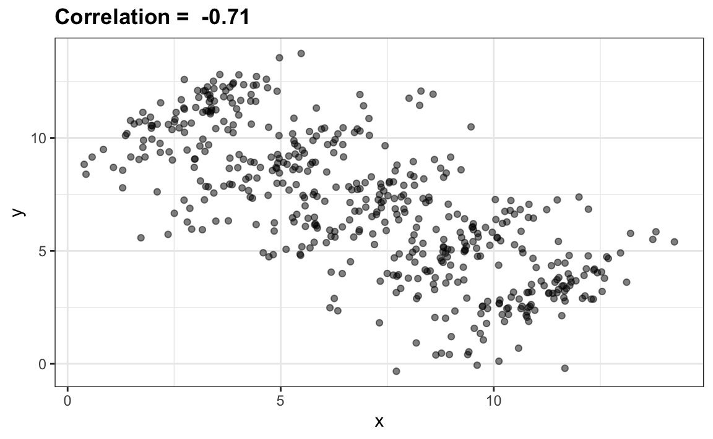{fig-align="center" width="80%"}

::: {.aside}
Source: Simpson's Paradox illustration
:::

## DRAFT: Simpson's Paradox

::: panel-tabset
### Output

```{r}
#| echo: false
#| eval: true
#| fig-width: 8
#| fig-height: 5

library(ggplot2)
set.seed(42)
groups <- 5
n_per <- 100
z <- rep(1:groups, each = n_per)
x <- z * 2.5 + rnorm(groups * n_per, 0, 1.2)
y <- -0.7 * x + z * 4 + rnorm(groups * n_per, 0, 1)

df <- data.frame(x = x, y = y, z = factor(z))

ggplot(df, aes(x, y)) +
  geom_point(alpha = 0.5, color = "gray40") +
  geom_smooth(method = "lm", se = FALSE, color = "black", linewidth = 1) +
  labs(title = paste("Correlation =", round(cor(x, y), 2)),
       x = "x", y = "y") +
  theme_bw(base_size = 16) +
  theme(plot.title = element_text(face = "bold", size = 18))
```

### Code

```{r}
#| echo: true
#| eval: false

library(ggplot2)
set.seed(42)
groups <- 5
n_per <- 100
z <- rep(1:groups, each = n_per)
x <- z * 2.5 + rnorm(groups * n_per, 0, 1.2)
y <- -0.7 * x + z * 4 + rnorm(groups * n_per, 0, 1)

df <- data.frame(x = x, y = y, z = factor(z))

ggplot(df, aes(x, y)) +
  geom_point(alpha = 0.5, color = "gray40") +
  geom_smooth(method = "lm", se = FALSE, color = "black", linewidth = 1) +
  labs(title = paste("Correlation =", round(cor(x, y), 2)),
       x = "x", y = "y") +
  theme_bw(base_size = 16)
```

### Interpretation

- The overall correlation appears positive when all data are combined, ignoring group structure.
- This is a setup for Simpson's Paradox: the aggregate trend may be misleading because it ignores a confounding variable (group membership z).
- The next slide reveals what happens when we color by group -- the within-group trends may differ dramatically from the overall trend.
:::

## Simpson's Paradox Explained

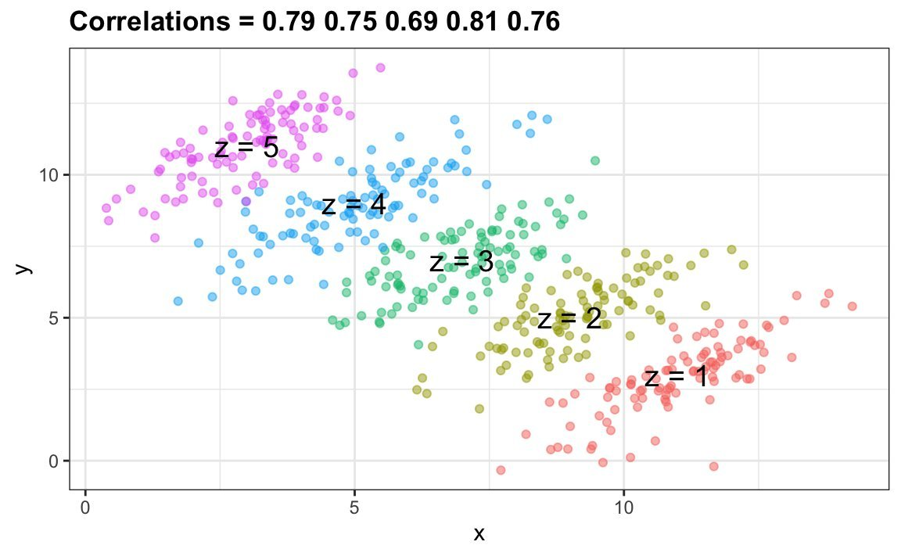{fig-align="center" width="80%"}

::: {.aside}
Source: Simpson's Paradox illustration
:::

## DRAFT: Simpson's Paradox Explained

::: panel-tabset
### Output

```{r}
#| echo: false
#| eval: true
#| fig-width: 8
#| fig-height: 5

library(ggplot2)
set.seed(42)
groups <- 5
n_per <- 100
z <- rep(1:groups, each = n_per)
x <- z * 2.5 + rnorm(groups * n_per, 0, 1.2)
y <- -0.7 * x + z * 4 + rnorm(groups * n_per, 0, 1)

df <- data.frame(x = x, y = y, z = factor(z))
cors <- sapply(split(df, df$z), function(d) round(cor(d$x, d$y), 2))

ggplot(df, aes(x, y, color = z)) +
  geom_point(alpha = 0.5) +
  geom_smooth(method = "lm", se = FALSE, linewidth = 1) +
  labs(title = paste("Correlations =", paste(cors, collapse = " ")),
       x = "x", y = "y") +
  scale_color_brewer(palette = "Set1", labels = paste("z =", 1:5)) +
  theme_bw(base_size = 16) +
  theme(plot.title = element_text(face = "bold", size = 16))
```

### Code

```{r}
#| echo: true
#| eval: false

library(ggplot2)
set.seed(42)
groups <- 5
n_per <- 100
z <- rep(1:groups, each = n_per)
x <- z * 2.5 + rnorm(groups * n_per, 0, 1.2)
y <- -0.7 * x + z * 4 + rnorm(groups * n_per, 0, 1)

df <- data.frame(x = x, y = y, z = factor(z))
cors <- sapply(split(df, df$z), function(d) round(cor(d$x, d$y), 2))

ggplot(df, aes(x, y, color = z)) +
  geom_point(alpha = 0.5) +
  geom_smooth(method = "lm", se = FALSE, linewidth = 1) +
  labs(title = paste("Correlations =", paste(cors, collapse = " ")),
       x = "x", y = "y") +
  scale_color_brewer(palette = "Set1", labels = paste("z =", 1:5))
```

### Interpretation

- When colored by group (z), each subgroup shows a **negative** correlation between x and y, even though the overall trend appeared positive.
- This reversal occurs because the confounding variable z drives both x and y upward across groups, creating an artificial positive association.
- This is a classic example of why controlling for confounding variables is critical in regression analysis -- ignoring group structure leads to the wrong conclusion.
:::

## In-Class Demo: Simpson's Paradox with Iris Data

::: panel-tabset
### Output

```{r}
#| label: simpsons-paradox-output
#| echo: false
#| eval: true
#| fig-width: 10
#| fig-height: 4

par(mfrow = c(1, 2))

# Overall: negative correlation
plot(iris$Sepal.Width, iris$Sepal.Length, pch = 19, col = "gray50",
     xlab = "Sepal Width", ylab = "Sepal Length",
     main = "All Species Combined")
abline(lm(Sepal.Length ~ Sepal.Width, iris), col = "black", lwd = 2)

# By species: positive correlation within each!
colors <- c("red", "green3", "blue")
plot(iris$Sepal.Width, iris$Sepal.Length, pch = 19,
     col = colors[as.numeric(iris$Species)],
     xlab = "Sepal Width", ylab = "Sepal Length",
     main = "By Species: Direction Reverses!")
for(i in 1:3) {
  sp_data <- iris[iris$Species == levels(iris$Species)[i], ]
  abline(lm(Sepal.Length ~ Sepal.Width, sp_data), col = colors[i], lwd = 2)
}
legend("topleft", levels(iris$Species), col = colors, pch = 19, cex = 0.8)
```

### Code

```{r}
#| label: simpsons-paradox-code
#| echo: true
#| eval: false

par(mfrow = c(1, 2))

# Overall: negative correlation
plot(iris$Sepal.Width, iris$Sepal.Length, pch = 19, col = "gray50",
     xlab = "Sepal Width", ylab = "Sepal Length",
     main = "All Species Combined")
abline(lm(Sepal.Length ~ Sepal.Width, iris), col = "black", lwd = 2)
cat("Overall correlation:", round(cor(iris$Sepal.Width, iris$Sepal.Length), 3))

# By species: positive correlation within each!
colors <- c("red", "green3", "blue")
plot(iris$Sepal.Width, iris$Sepal.Length, pch = 19,
     col = colors[as.numeric(iris$Species)],
     xlab = "Sepal Width", ylab = "Sepal Length",
     main = "By Species: Direction Reverses!")
for(i in 1:3) {
  sp_data <- iris[iris$Species == levels(iris$Species)[i], ]
  abline(lm(Sepal.Length ~ Sepal.Width, sp_data), col = colors[i], lwd = 2)
}
legend("topleft", levels(iris$Species), col = colors, pch = 19, cex = 0.8)
```

### Interpretation

- The left panel shows a negative overall correlation between sepal width and sepal length when all species are combined.
- The right panel reveals that within each species, the correlation is actually positive -- the trend reverses when we account for species.
- This is a real-world example of Simpson's Paradox: the confounding variable (species) drives both sepal dimensions and creates a spurious negative overall trend.
:::

::: callout-important
The overall negative trend reverses to positive within each species — a classic confounding variable problem!
:::

------------------------------------------------------------------------

## R Exercise: Linear Regression

-   Load the grip_strength.csv\` dataset
-   The data set has one reponse variable and two predictor variables:
    -   response: grip_strength
    -   predictor 1: bmp2_cream
    -   predictor 2: exercise_hours
-   Run appropriate correlation test
-   Create scatterplots and check the fit
-   Fit a linear model with `lm()`
-   Interpret coefficients and R²

## The Loss Function: Minimizing Error

Linear regression finds the line of best fit by minimizing the **sum of squared errors (SSE)**. For each observation, the residual is the difference between the observed and predicted value:

::: panel-tabset
### Equation

$$e_i = y_i - \hat{y}_i = y_i - (\hat{\beta}_0 + \hat{\beta}_1 x_i)$$

### LaTeX

``` text
e_i = y_i - \hat{y}_i = y_i - (\hat{\beta}_0 + \hat{\beta}_1 x_i)
```

### Interpretation

- The residual $e_i$ measures how far each observed value falls from the predicted value on the regression line.
- Positive residuals mean the observation is above the line; negative residuals mean it is below.
- Examining residuals is the foundation of regression diagnostics -- patterns in the residuals reveal assumption violations.
:::

The SSE is the total squared deviation of all observations from the fitted line:

::: panel-tabset
### Equation

$$SSE = \sum_{i=1}^{n} e_i^2 = \sum_{i=1}^{n} (y_i - \hat{y}_i)^2$$

### LaTeX

``` text
SSE = \sum_{i=1}^{n} e_i^2 = \sum_{i=1}^{n} (y_i - \hat{y}_i)^2
```

### Interpretation

- SSE sums the squared residuals across all observations -- squaring ensures positive and negative residuals do not cancel.
- This is the quantity that OLS minimizes: the best-fit line is the one that makes this sum as small as possible.
- Larger SSE indicates more unexplained variability; smaller SSE indicates a better-fitting model.
:::

The **mean squared error (MSE)** normalizes by degrees of freedom:

::: panel-tabset
### Equation

$$MSE = \frac{SSE}{n - p}$$

### LaTeX

``` text
MSE = \frac{SSE}{n - p}
```

### Interpretation

- MSE divides the SSE by the degrees of freedom ($n - p$), giving an unbiased estimate of the error variance $\sigma^2$.
- For simple linear regression, $p = 2$ (intercept and slope), so we divide by $n - 2$.
- Smaller MSE indicates the model fits the data more closely, with less unexplained variability per observation.
:::

where $p$ is the number of parameters estimated (2 for simple linear regression: intercept and slope). Ordinary Least Squares (OLS) is the method that finds the values of $\hat{\beta}_0$ and $\hat{\beta}_1$ that minimize the SSE.

## The Grip Strength Dataset

-   This dataset examines whether grip strength (in kg) in patients recovering from hand injury is predicted by two continuous variables:
    -   the concentration of a BMP2 cream applied topically (mg/ml), and
    -   hours of exercise per week. We have 200 patients.
-   We will fit separate simple linear regressions for each predictor, then explore which model is more appropriate by examining residual diagnostics.

## Importing and Exploring the Data

::: panel-tabset
### Output

```{r}
#| label: grip-import-output
#| echo: false
#| eval: true

library(tidyverse)
library(broom)
library(knitr)

grip <- read_csv("data/grip_strength_data.csv")

# Preview the data
head(grip, 8) |> kable(digits = 2)
```

### Code

```{r}
#| label: grip-import-code
#| echo: true
#| eval: false

library(tidyverse)
library(broom)
library(knitr)

grip <- read_csv("data/grip_strength_data.csv")

# Preview the data
head(grip, 8) |> kable(digits = 2)
```

### Interpretation

- We load the grip strength dataset and preview the first 8 rows to verify the data imported correctly and understand its structure.
- The dataset contains measurements of grip strength (response), BMP2 cream concentration, and exercise hours (predictors) for each patient.
- Always inspect your data before modeling -- check for unexpected values, missing data, or formatting issues.
:::

## Summary Statistics of the Data

::: panel-tabset
### Output

```{r}
#| label: grip-summary-output
#| echo: false
#| eval: true

summary(grip[, c("grip_strength_kg", "bmp2_cream_mg_ml", "exercise_hrs_week")])
```

### Code

```{r}
#| label: grip-summary-code
#| echo: true
#| eval: false

summary(grip[, c("grip_strength_kg", "bmp2_cream_mg_ml", "exercise_hrs_week")])
```

### Interpretation

- The summary statistics provide the min, quartiles, mean, and max for each variable, giving a quick overview of the data distribution.
- Check whether the ranges make sense (e.g., grip strength should be positive, exercise hours should be reasonable).
- Large differences between mean and median suggest skewness that might affect model assumptions.
:::

## Grip Strength \~ BMP2 Cream

We hypothesize that BMP2 cream concentration is positively associated with grip strength. The model is:

::: panel-tabset
### Equation

$$\text{grip_strength}_i = \beta_0 + \beta_1 \cdot \text{bmp2_cream}_i + \epsilon_i$$

### LaTeX

``` text
\text{grip_strength}_i = \beta_0 + \beta_1 \cdot \text{bmp2_cream}_i + \epsilon_i
```

### Interpretation

- This is the simple linear regression model predicting grip strength from BMP2 cream concentration.
- $\beta_0$ is the expected grip strength when no BMP2 cream is applied (concentration = 0).
- $\beta_1$ represents the expected change in grip strength (kg) for each 1 mg/ml increase in BMP2 cream concentration.
:::

## Grip Strength \~ BMP2 Cream

The `summary()` output gives us the estimated coefficients, their standard errors, t-statistics, and p-values, plus the overall model $R^2$ and F-test.

::: panel-tabset
### Output

```{r}
#| label: lm-bmp2-output
#| echo: false
#| eval: true

lm_bmp2 <- lm(grip_strength_kg ~ bmp2_cream_mg_ml, data = grip)
summary(lm_bmp2)
```

### Code

```{r}
#| label: lm-bmp2-code
#| echo: true
#| eval: false

lm_bmp2 <- lm(grip_strength_kg ~ bmp2_cream_mg_ml, data = grip)
summary(lm_bmp2)
```

### Interpretation

- The `summary()` output shows the estimated intercept and slope, along with their standard errors, t-statistics, and p-values.
- A significant p-value for `bmp2_cream_mg_ml` indicates that BMP2 cream concentration is a statistically significant predictor of grip strength.
- The $R^2$ value indicates what proportion of the variance in grip strength is explained by BMP2 cream concentration alone.
:::

## Interpreting the BMP2 Model Output

The `broom` package provides two useful functions: `tidy()` extracts coefficient-level information (estimates, standard errors, test statistics, and p-values), while `glance()` extracts model-level summaries ($R^2$, AIC, BIC, etc.).

::: panel-tabset
### Output

```{r}
#| label: lm-bmp2-tidy-output
#| echo: false
#| eval: true

tidy(lm_bmp2) |> kable(digits = 4)
```

### Code

```{r}
#| label: lm-bmp2-tidy-code
#| echo: true
#| eval: false

# Coefficient-level summary
tidy(lm_bmp2) |> kable(digits = 4)

# Model-level summary
glance(lm_bmp2) |> kable(digits = 4)
```

### Interpretation

- `tidy()` extracts coefficient-level information in a clean data frame format, making it easy to report and compare across models.
- `glance()` provides model-level summaries including $R^2$, adjusted $R^2$, AIC, BIC, and the overall F-statistic.
- These broom functions are especially useful when comparing multiple models programmatically.
:::

# Visualizing Model Fits with ggplot2 {background-color="#2c3e50"}

## Why ggplot2 for Model Visualization?

-   Base R `plot()` and `abline()` work for quick diagnostics.

-   However, `ggplot2` provides publication-quality graphics with better control over aesthetics, annotations, and layering.

-   For presenting results in papers and talks, `ggplot2` is the standard in modern statistics.

-   Key advantages include built-in support for confidence intervals via `geom_smooth()`, faceting for multiple models, and consistent theming.

## Visualizing Grip Strength \~ BMP2 Cream

`geom_smooth(method = "lm", se = TRUE)` adds the fitted regression line with a 95% confidence interval ribbon for the mean response.

::: panel-tabset
### Output

```{r}
#| label: ggplot-bmp2-output
#| echo: false
#| eval: true
#| fig-width: 8
#| fig-height: 5

library(ggplot2)

ggplot(grip, aes(x = bmp2_cream_mg_ml, y = grip_strength_kg)) +
  geom_point(color = "steelblue", alpha = 0.6, size = 2) +
  geom_smooth(method = "lm", se = TRUE, color = "firebrick", fill = "firebrick", alpha = 0.2) +
  labs(
    x = "BMP2 Cream Concentration (mg/ml)",
    y = "Grip Strength (kg)",
    title = "Grip Strength vs. BMP2 Cream Concentration",
    subtitle = paste0("Linear fit: R² = ", round(summary(lm_bmp2)$r.squared, 3))
  ) +
  theme_minimal(base_size = 14)
```

### Code

```{r}
#| label: ggplot-bmp2-code
#| echo: true
#| eval: false

ggplot(grip, aes(x = bmp2_cream_mg_ml, y = grip_strength_kg)) +
  geom_point(color = "steelblue", alpha = 0.6, size = 2) +
  geom_smooth(method = "lm", se = TRUE, color = "firebrick",
              fill = "firebrick", alpha = 0.2) +
  labs(
    x = "BMP2 Cream Concentration (mg/ml)",
    y = "Grip Strength (kg)",
    title = "Grip Strength vs. BMP2 Cream Concentration",
    subtitle = paste0("Linear fit: R² = ", round(summary(lm_bmp2)$r.squared, 3))
  ) +
  theme_minimal(base_size = 14)
```

### Interpretation

- The scatterplot shows the relationship between BMP2 cream concentration and grip strength, with the OLS regression line and 95% confidence band overlaid.
- The confidence ribbon represents uncertainty in the estimated mean response -- it is narrowest near $\bar{x}$ and widens at the extremes.
- A tight ribbon with a clear upward trend confirms a strong positive linear relationship, consistent with the high $R^2$.
:::

# Exercise Hours

## Grip Strength \~ Exercise Hours

Now we test whether hours of exercise per week predict grip strength:

::: panel-tabset
### Equation

$$\text{grip_strength}_i = \beta_0 + \beta_1 \cdot \text{exercise_hrs}_i + \epsilon_i$$

### LaTeX

``` text
\text{grip_strength}_i = \beta_0 + \beta_1 \cdot \text{exercise_hrs}_i + \epsilon_i
```

### Interpretation

- This model tests whether weekly exercise hours linearly predict grip strength.
- $\beta_1$ represents the expected change in grip strength for each additional hour of exercise per week.
- As we will see, this linear model may not be the best fit -- the relationship could be nonlinear.
:::

::: panel-tabset
### Output

```{r}
#| label: lm-exercise-output
#| echo: false
#| eval: true

lm_exercise <- lm(grip_strength_kg ~ exercise_hrs_week, data = grip)
summary(lm_exercise)
```

### Code

```{r}
#| label: lm-exercise-code
#| echo: true
#| eval: false

lm_exercise <- lm(grip_strength_kg ~ exercise_hrs_week, data = grip)
summary(lm_exercise)
```

### Interpretation

- The `summary()` output for the exercise model shows the estimated relationship between exercise hours and grip strength.
- Compare the $R^2$ value here to the BMP2 model -- a much lower $R^2$ suggests exercise hours explain far less of the variability in grip strength.
- However, a poor linear fit does not mean there is no relationship -- the relationship may be nonlinear.
:::

## Interpreting the Model Output

::: panel-tabset
### Output

```{r}
#| label: lm-exercise-tidy-output
#| echo: false
#| eval: true

tidy(lm_exercise) |> kable(digits = 4)
```

```{r}
#| label: lm-exercise-glance-output
#| echo: false
#| eval: true

glance(lm_exercise) |> kable(digits = 4)
```

### Code

```{r}
#| label: lm-exercise-tidy-code2
#| echo: true
#| eval: false

tidy(lm_exercise) |> kable(digits = 4)
glance(lm_exercise) |> kable(digits = 4)
```

### Interpretation

- Notice that the exercise model has a much lower $R^2$ than the BMP2 model.
- This suggests that exercise hours alone explain very little of the variation in grip strength.
- But we should check whether the relationship might be nonlinear before concluding.
:::

\

## Visualizing Grip Strength \~ Exercise Hours

::: panel-tabset
### Output

```{r}
#| label: ggplot-exercise-output
#| echo: false
#| eval: true
#| fig-width: 8
#| fig-height: 5

ggplot(grip, aes(x = exercise_hrs_week, y = grip_strength_kg)) +
  geom_point(color = "darkorange", alpha = 0.6, size = 2) +
  geom_smooth(method = "lm", se = TRUE, color = "firebrick", fill = "firebrick", alpha = 0.2) +
  labs(
    x = "Exercise (hours/week)",
    y = "Grip Strength (kg)",
    title = "Grip Strength vs. Exercise Hours",
    subtitle = paste0("Linear fit: R² = ", round(summary(lm_exercise)$r.squared, 3))
  ) +
  theme_minimal(base_size = 14)
```

### Code

```{r}
#| label: ggplot-exercise-code
#| echo: true
#| eval: false

ggplot(grip, aes(x = exercise_hrs_week, y = grip_strength_kg)) +
  geom_point(color = "darkorange", alpha = 0.6, size = 2) +
  geom_smooth(method = "lm", se = TRUE, color = "firebrick",
              fill = "firebrick", alpha = 0.2) +
  labs(
    x = "Exercise (hours/week)",
    y = "Grip Strength (kg)",
    title = "Grip Strength vs. Exercise Hours",
    subtitle = paste0("Linear fit: R² = ", round(summary(lm_exercise)$r.squared, 3))
  ) +
  theme_minimal(base_size = 14)
```

### Interpretation

- The scatterplot with the linear fit shows a weak relationship between exercise hours and grip strength, reflected in the low $R^2$.
- The wide confidence ribbon indicates substantial uncertainty in the estimated mean response.
- Compare this visually to the BMP2 plot -- the scatter is much more diffuse relative to the trend line.
:::

## Comparing Both Fits Side by Side

::: panel-tabset
### Output

```{r}
#| label: ggplot-both-output
#| echo: false
#| eval: true
#| fig-width: 12
#| fig-height: 5

library(patchwork)

p1 <- ggplot(grip, aes(x = bmp2_cream_mg_ml, y = grip_strength_kg)) +
  geom_point(color = "steelblue", alpha = 0.6, size = 2) +
  geom_smooth(method = "lm", se = TRUE, color = "firebrick", fill = "firebrick", alpha = 0.2) +
  labs(x = "BMP2 Cream (mg/ml)", y = "Grip Strength (kg)",
       title = "Model 1: BMP2 Cream") +
  theme_minimal(base_size = 13)

p2 <- ggplot(grip, aes(x = exercise_hrs_week, y = grip_strength_kg)) +
  geom_point(color = "darkorange", alpha = 0.6, size = 2) +
  geom_smooth(method = "lm", se = TRUE, color = "firebrick", fill = "firebrick", alpha = 0.2) +
  labs(x = "Exercise (hours/week)", y = "Grip Strength (kg)",
       title = "Model 2: Exercise Hours") +
  theme_minimal(base_size = 13)

p1 + p2
```

### Code

```{r}
#| label: ggplot-both-code
#| echo: true
#| eval: false

library(patchwork)

p1 <- ggplot(grip, aes(x = bmp2_cream_mg_ml, y = grip_strength_kg)) +
  geom_point(color = "steelblue", alpha = 0.6, size = 2) +
  geom_smooth(method = "lm", se = TRUE, color = "firebrick", fill = "firebrick", alpha = 0.2) +
  labs(x = "BMP2 Cream (mg/ml)", y = "Grip Strength (kg)",
       title = "Model 1: BMP2 Cream") +
  theme_minimal(base_size = 13)

p2 <- ggplot(grip, aes(x = exercise_hrs_week, y = grip_strength_kg)) +
  geom_point(color = "darkorange", alpha = 0.6, size = 2) +
  geom_smooth(method = "lm", se = TRUE, color = "firebrick", fill = "firebrick", alpha = 0.2) +
  labs(x = "Exercise (hours/week)", y = "Grip Strength (kg)",
       title = "Model 2: Exercise Hours") +
  theme_minimal(base_size = 13)

p1 + p2  # patchwork combines plots side-by-side
```

### Interpretation

- Placing both models side by side makes the contrast clear: BMP2 cream shows a strong, tight linear relationship while exercise hours shows a weak, diffuse one.
- The patchwork package makes it easy to compose multiple ggplot panels for comparison.
- This visual comparison is more informative than comparing $R^2$ values alone -- you can see the difference in scatter and confidence band width.

### Enhancement

```{r}
#| eval: false
#| echo: true

# Combine into a single faceted plot using pivot_longer
grip_long <- grip |>
  pivot_longer(cols = c(bmp2_cream_mg_ml, exercise_hrs_week),
               names_to = "predictor", values_to = "value")

ggplot(grip_long, aes(x = value, y = grip_strength_kg)) +
  geom_point(alpha = 0.5) +
  geom_smooth(method = "lm", se = TRUE) +
  facet_wrap(~ predictor, scales = "free_x") +
  theme_minimal()
```

- An alternative approach uses `pivot_longer()` and `facet_wrap()` to create a single faceted plot, which scales well when comparing many predictors.
:::

------------------------------------------------------------------------

# Other R Packages for Fitting Linear Models {background-color="#2c3e50"}

## Using aov() for ANOVA-Style Output

-   The `aov()` function fits the same underlying model as `lm()`, but presents the results in an analysis of variance (ANOVA) table format.
-   This is useful when you want to focus on the partitioning of variance rather than individual coefficient estimates.

::: panel-tabset
### Output

```{r}
#| label: aov-bmp2-output
#| echo: false
#| eval: true

aov_bmp2 <- aov(grip_strength_kg ~ bmp2_cream_mg_ml, data = grip)
summary(aov_bmp2)
```

### Code

```{r}
#| label: aov-bmp2-code
#| echo: true
#| eval: false

# aov() gives ANOVA table output for the same model
aov_bmp2 <- aov(grip_strength_kg ~ bmp2_cream_mg_ml, data = grip)
summary(aov_bmp2)
```

### Interpretation

- The `aov()` output decomposes total variance into model (BMP2 cream) and residual components.
- The F-statistic tests whether the model explains significantly more variance than expected by chance.
- The `aov()` and `lm()` functions fit the same underlying model -- they just present results differently (ANOVA table vs. coefficient table).
:::

-   The ANOVA table decomposes variance into the model sum of squares ($SS_{Model}$) and residual sum of squares ($SS_{Error}$).
-   It also tests whether the model explains a significant proportion of variance via the F-statistic.

## Using anova() to Compare Models

The `anova()` function can also be applied to `lm` objects directly, and it is especially useful for comparing nested models:

::: panel-tabset
### Output

```{r}
#| label: anova-lm-output
#| echo: false
#| eval: true

# ANOVA table from an lm object
anova(lm_bmp2)
```

### Code

```{r}
#| label: anova-lm-code
#| echo: true
#| eval: false

# ANOVA table from an lm object
anova(lm_bmp2)
```

### Interpretation

- `anova()` applied to an `lm` object produces the same ANOVA decomposition as `aov()`, showing $SS_{Model}$, $SS_{Error}$, and the F-test.
- This function is especially useful for comparing nested models by passing two `lm` objects (e.g., `anova(model1, model2)`).
- The significant F-statistic confirms that BMP2 cream concentration explains a significant amount of variance in grip strength.
:::

## Overview of R Packages for Linear Models

R provides a rich ecosystem of packages for fitting models of increasing complexity:

| Package / Function | Use Case | Key Feature |
|:-----------------------|:-----------------------|:-----------------------|
| `lm()` | Simple/multiple linear regression | Coefficient estimates, $R^2$, F-test |
| `aov()` | ANOVA-style linear models | Variance partitioning, F-table |
| `glm()` | Generalized linear models | Non-normal response (logistic, Poisson) |
| `lme4::lmer()` | Linear mixed-effects models | Random effects for nested/grouped data |
| `nlme::lme()` | Linear mixed-effects models | Flexible correlation structures |
| `MASS::rlm()` | Robust linear regression | Resistant to outliers |
| `mgcv::gam()` | Generalized additive models | Smooth nonlinear relationships |

## Fitting with glm()

The `glm()` function fits generalized linear models. With the default `family = gaussian`, it is equivalent to `lm()`:

::: panel-tabset
### Output

```{r}
#| label: glm-bmp2-output
#| echo: false
#| eval: true

glm_bmp2 <- glm(grip_strength_kg ~ bmp2_cream_mg_ml, data = grip, family = gaussian)
summary(glm_bmp2)
```

### Code

```{r}
#| label: glm-bmp2-code
#| echo: true
#| eval: false

# glm() with family = gaussian is equivalent to lm()
glm_bmp2 <- glm(grip_strength_kg ~ bmp2_cream_mg_ml, data = grip, family = gaussian)
summary(glm_bmp2)
```

### Interpretation

- With `family = gaussian`, `glm()` produces identical results to `lm()` -- the same coefficient estimates and standard errors.
- The advantage of `glm()` is its flexibility: changing the `family` argument allows fitting logistic regression (`binomial`), Poisson regression (`poisson`), and other generalized linear models.
- Note that `glm()` reports deviance and AIC rather than $R^2$ and adjusted $R^2$.
:::

## Fitting with glm()

-   The advantage of `glm()` is that it generalizes to non-normal responses by changing the `family` argument
-   `binomial` for logistic regression
-   `poisson` for count data
-   We will use this later in the course.

## How to report linear model statistics

-   Say what you found, and then put the statistics in parentheses.
-   Support the finding with the statistics, not the other way around.
-   Remember to include magnitude and direction of the finding.
-   Also, reference the figure that shows the relationship.\
    \
    \

::: callout-note
We found that topical application of a cream containing the signaling molecule bone morphogenetic protein 2 (bmp-2) significantly increased the grip strength of patients in a clinical trial ($F_{1,198} = 272.7; p<2e^{-16}; R^2 = 0.58$), Specifically, an increase of 1mg/ml of bmp-2 was correlated with an increase of 1.64 kg of grip strength (Fig. 1)
:::

------------------------------------------------------------------------

# Residual Analysis {background-color="#2c3e50"}

## Why Residual Analysis?

-   Fitting a linear model is only the first step.
-   Before we trust the model's coefficient estimates, p-values, and confidence intervals, we must verify that the **assumptions** underlying the model are reasonably met.
-   If assumptions are violated, the standard errors and p-values may be unreliable, and our conclusions could be misleading.
-   Residual analysis is the primary diagnostic tool for checking these assumptions.
-   By examining patterns in the residuals ($e_i = y_i - \hat{y}_i$), we can detect violations that aren't obvious from the raw data alone.

## Assumptions of Linear Regression

Linear regression makes four key assumptions, often remembered by the acronym **LINE**:

-   **L — Linearity**: The relationship between $x$ and $y$ is linear. The expected value of $y$ is a straight-line function of $x$.

-   **I — Independence**: The residuals are independent of each other. Knowing one residual gives no information about another. Violations often occur with time series or spatially structured data.

-   **N — Normality**: The residuals follow a normal distribution at each value of $x$: $\epsilon_i \sim N(0, \sigma^2)$. This assumption is most important for small sample sizes; with large $n$, the Central Limit Theorem makes inference robust to moderate departures.

-   **E — Equal variance (Homoscedasticity)**: The variance of the residuals is constant across all values of $x$: $\text{Var}(\epsilon_i) = \sigma^2$ for all $i$. When variance changes with $x$ (heteroscedasticity), standard errors become biased.

## Visualizing the Assumptions

The figure below illustrates what the conditional distributions of $y$ should look like at each value of $x$ under a well-specified linear model: each distribution is normal, centered on the regression line, and has equal spread.

{fig-align="center" width="80%"}

## Visualizing the Assumptions (SVG)

{fig-align="center" width="80%"}

## Spotting Assumption Violations

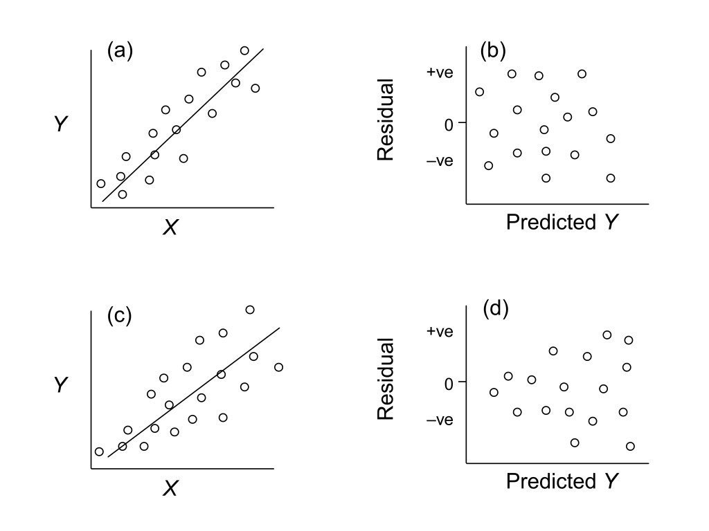{fig-align="center" width="90%"}

## Spotting Assumption Violations (SVG)

{fig-align="center" width="90%"}

## DRAFT: Homoscedasticity vs Heteroscedasticity

::: panel-tabset
### Output

```{r}
#| echo: false
#| eval: true
#| fig-width: 10
#| fig-height: 8

par(mfrow = c(2, 2), mar = c(4, 4, 3, 1))

set.seed(42)
n <- 20
x_good <- runif(n, 1, 10)
y_good <- 2 + 1.5 * x_good + rnorm(n, 0, 1.5)
fit_good <- lm(y_good ~ x_good)

# (a) Good fit - scatter with line
plot(x_good, y_good, pch = 1, cex = 1.5, xlab = "X", ylab = "Y",
     main = "(a)", las = 1)
abline(fit_good, lwd = 2)

# (b) Good residuals
plot(fitted(fit_good), residuals(fit_good), pch = 1, cex = 1.5,
     xlab = "Predicted Y", ylab = "Residual", main = "(b)", las = 1)
abline(h = 0, lty = 2)

# (c) Heteroscedastic fit
x_het <- runif(n, 1, 10)
y_het <- 2 + 1.5 * x_het + rnorm(n, 0, x_het * 0.5)
fit_het <- lm(y_het ~ x_het)
plot(x_het, y_het, pch = 1, cex = 1.5, xlab = "X", ylab = "Y",
     main = "(c)", las = 1)
abline(fit_het, lwd = 2)

# (d) Heteroscedastic residuals (funnel)
plot(fitted(fit_het), residuals(fit_het), pch = 1, cex = 1.5,
     xlab = "Predicted Y", ylab = "Residual", main = "(d)", las = 1)
abline(h = 0, lty = 2)
```

### Code

```{r}
#| echo: true
#| eval: false

par(mfrow = c(2, 2), mar = c(4, 4, 3, 1))

set.seed(42)
n <- 20
x_good <- runif(n, 1, 10)
y_good <- 2 + 1.5 * x_good + rnorm(n, 0, 1.5)
fit_good <- lm(y_good ~ x_good)

# (a) Good fit and (b) Good residuals
plot(x_good, y_good, pch = 1, cex = 1.5, xlab = "X", ylab = "Y", main = "(a)")
abline(fit_good, lwd = 2)
plot(fitted(fit_good), residuals(fit_good), pch = 1, cex = 1.5,
     xlab = "Predicted Y", ylab = "Residual", main = "(b)")
abline(h = 0, lty = 2)

# (c) Heteroscedastic fit and (d) its residuals
x_het <- runif(n, 1, 10)
y_het <- 2 + 1.5 * x_het + rnorm(n, 0, x_het * 0.5)
fit_het <- lm(y_het ~ x_het)
plot(x_het, y_het, pch = 1, cex = 1.5, xlab = "X", ylab = "Y", main = "(c)")
abline(fit_het, lwd = 2)
plot(fitted(fit_het), residuals(fit_het), pch = 1, cex = 1.5,
     xlab = "Predicted Y", ylab = "Residual", main = "(d)")
abline(h = 0, lty = 2)
```

### Interpretation

- **(a-b)** show a well-behaved linear model: the scatterplot shows a clear linear trend, and the residual plot shows random scatter with constant variance (homoscedasticity).
- **(c-d)** show a heteroscedastic model: the spread of points increases with X. The residual plot reveals a **funnel shape**, indicating the equal-variance assumption is violated.
- When heteroscedasticity is present, standard errors and p-values from OLS may be unreliable. Remedies include log-transforming Y, using weighted least squares, or robust standard errors.
:::

## Spotting Assumption Violations

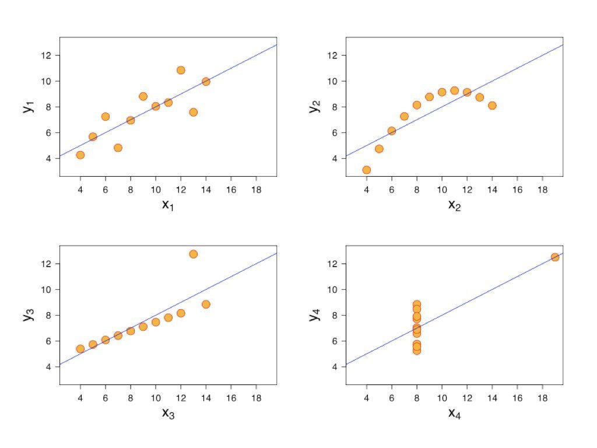{fig-align="center" width="90%"}

::: {.aside}
Source: Anscombe, F.J. (1973). "Graphs in Statistical Analysis." *The American Statistician*, 27(1), 17-21.
:::

## DRAFT: Anscombe's Quartet

::: panel-tabset
### Output

```{r}
#| echo: false
#| eval: true
#| fig-width: 10
#| fig-height: 8

library(datasets)
par(mfrow = c(2, 2), mar = c(4, 4, 2, 1))

for (i in 1:4) {
  xi <- anscombe[[paste0("x", i)]]
  yi <- anscombe[[paste0("y", i)]]
  plot(xi, yi, pch = 16, cex = 1.8, col = "darkorange",
       xlab = bquote(x[.(i)]), ylab = bquote(y[.(i)]),
       xlim = c(3, 19), ylim = c(3, 13), las = 1)
  abline(lm(yi ~ xi), col = "steelblue", lwd = 2)
}
```

### Code

```{r}
#| echo: true
#| eval: false

library(datasets)
par(mfrow = c(2, 2), mar = c(4, 4, 2, 1))

for (i in 1:4) {
  xi <- anscombe[[paste0("x", i)]]
  yi <- anscombe[[paste0("y", i)]]
  plot(xi, yi, pch = 16, cex = 1.8, col = "darkorange",
       xlab = bquote(x[.(i)]), ylab = bquote(y[.(i)]),
       xlim = c(3, 19), ylim = c(3, 13), las = 1)
  abline(lm(yi ~ xi), col = "steelblue", lwd = 2)
}
```

### Interpretation

- All four datasets have nearly identical summary statistics ($\bar{x}=9$, $\bar{y} \approx 7.5$, $r \approx 0.82$, same regression line) but very different patterns.
- **Dataset 1**: A well-behaved linear relationship. **Dataset 2**: A clear nonlinear (quadratic) pattern that a straight line cannot capture.
- **Dataset 3**: A perfect linear relationship with one outlier pulling the fit. **Dataset 4**: No relationship in X, but one extreme point creates an apparent correlation.
- This classic example demonstrates why **visualization is essential** -- summary statistics alone can be deeply misleading.
:::

All four datasets have nearly identical summary statistics ($\bar{x}=9$, $\bar{y} \approx 7.5$, $r \approx 0.82$, same regression line) but very different patterns.

## Spotting Assumption Violations

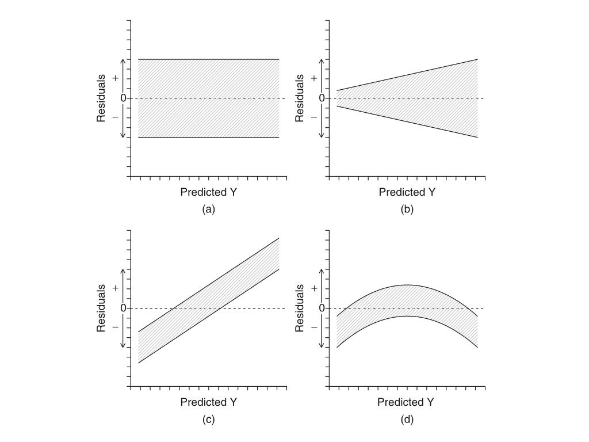{fig-align="center" width="90%"}

## Spotting Assumption Violations (SVG)

{fig-align="center" width="90%"}

## DRAFT: Residual Patterns

::: panel-tabset
### Output

```{r}
#| echo: false
#| eval: true
#| fig-width: 10
#| fig-height: 8

par(mfrow = c(2, 2), mar = c(4, 4, 3, 1))

# (a) Homoscedastic - good
set.seed(1)
x <- 1:50
resid_a <- rnorm(50, 0, 1)
plot(x, resid_a, pch = 1, xlab = "Predicted Y", ylab = "Residuals",
     main = "(a) Homoscedastic", ylim = c(-4, 4), las = 1)
abline(h = 0, lty = 2)
lines(c(1, 50), c(2, 2), lwd = 2)
lines(c(1, 50), c(-2, -2), lwd = 2)

# (b) Fan shape - increasing variance
resid_b <- rnorm(50, 0, x * 0.08)
plot(x, resid_b, pch = 1, xlab = "Predicted Y", ylab = "Residuals",
     main = "(b) Funnel (heteroscedastic)", ylim = c(-4, 4), las = 1)
abline(h = 0, lty = 2)
lines(x, x * 0.08 * 2, lwd = 2)
lines(x, -x * 0.08 * 2, lwd = 2)

# (c) Linear trend in residuals
resid_c <- rnorm(50, 0, 0.5) + (x - 25) * 0.06
plot(x, resid_c, pch = 1, xlab = "Predicted Y", ylab = "Residuals",
     main = "(c) Linear trend", ylim = c(-4, 4), las = 1)
abline(h = 0, lty = 2)
abline(lm(resid_c ~ x), lwd = 2)

# (d) Curved pattern
resid_d <- rnorm(50, 0, 0.5) + sin(x / 8) * 2
plot(x, resid_d, pch = 1, xlab = "Predicted Y", ylab = "Residuals",
     main = "(d) Curvilinear", ylim = c(-4, 4), las = 1)
abline(h = 0, lty = 2)
lines(x, sin(x / 8) * 2, lwd = 2)
```

### Code

```{r}
#| echo: true
#| eval: false

par(mfrow = c(2, 2), mar = c(4, 4, 3, 1))

set.seed(1)
x <- 1:50

# (a) Homoscedastic - good
resid_a <- rnorm(50, 0, 1)
plot(x, resid_a, pch = 1, xlab = "Predicted Y", ylab = "Residuals",
     main = "(a) Homoscedastic", ylim = c(-4, 4), las = 1)
abline(h = 0, lty = 2)

# (b) Funnel (heteroscedastic)
resid_b <- rnorm(50, 0, x * 0.08)
plot(x, resid_b, pch = 1, xlab = "Predicted Y", ylab = "Residuals",
     main = "(b) Funnel (heteroscedastic)", ylim = c(-4, 4), las = 1)
abline(h = 0, lty = 2)

# (c) Linear trend
resid_c <- rnorm(50, 0, 0.5) + (x - 25) * 0.06
plot(x, resid_c, pch = 1, xlab = "Predicted Y", ylab = "Residuals",
     main = "(c) Linear trend", ylim = c(-4, 4), las = 1)
abline(h = 0, lty = 2)

# (d) Curvilinear
resid_d <- rnorm(50, 0, 0.5) + sin(x / 8) * 2
plot(x, resid_d, pch = 1, xlab = "Predicted Y", ylab = "Residuals",
     main = "(d) Curvilinear", ylim = c(-4, 4), las = 1)
abline(h = 0, lty = 2)
```

### Interpretation

- **(a) Homoscedastic**: Ideal pattern -- random scatter with constant spread around zero. No assumption violations.
- **(b) Funnel**: Variance increases with predicted values (heteroscedasticity). Consider log-transforming Y or using weighted least squares.
- **(c) Linear trend**: Residuals still have a systematic relationship with predicted values, suggesting a missing predictor or incorrect functional form.
- **(d) Curvilinear**: A U-shaped or sinusoidal pattern indicates the true relationship is nonlinear. Consider adding polynomial terms or using a different model.
:::

## Common Residual Patterns and Causes

Understanding what different residual patterns mean helps you decide how to fix model problems:

-   **Funnel shape** (variance increases with fitted values): Heteroscedasticity. Consider a variance-stabilizing transformation (e.g., log) or use weighted least squares.

-   **Curved pattern** (U-shape or arch): The relationship is nonlinear. Consider adding polynomial terms (e.g., $x^2$) or using a different model.

-   **Clusters or groups**: There may be a missing categorical variable or subgroup structure in the data (recall Simpson's Paradox).

-   **Systematic pattern over time/order**: Autocorrelation among residuals. Consider time-series models or including a time covariate.

## What Each Residual Plot Tells You

The standard `plot(lm_object)` in R produces four diagnostic plots. Each one targets a specific assumption:

| Plot | Name | What It Checks | What to Look For |
|:-----------------|:-----------------|:-----------------|:-----------------|
| 1 | Residuals vs. Fitted | Linearity & equal variance | No pattern; random scatter around 0 |
| 2 | Normal Q-Q | Normality of residuals | Points follow the diagonal line |
| 3 | Scale-Location | Homoscedasticity | Flat trend line; no fan shape |
| 4 | Residuals vs. Leverage | Influential observations | No points beyond Cook's distance lines |

## Residual Diagnostic Plots

::: panel-tabset
### Output

```{r}
#| label: resid-plots-output
#| echo: false
#| eval: true
#| fig-width: 10
#| fig-height: 8

par(mfrow = c(2, 2))
plot(my_lm)
```

### Code

```{r}
#| label: resid-plots-code
#| echo: true
#| eval: false

par(mfrow = c(2, 2))
plot(my_lm)
```

### Interpretation

- The four diagnostic plots check the LINE assumptions: Linearity, Independence, Normality, and Equal variance.
- **Residuals vs. Fitted**: Look for random scatter around zero (no pattern = good). **Q-Q Plot**: Points should follow the diagonal line (normality).
- **Scale-Location**: Should show a flat trend (constant variance). **Residuals vs. Leverage**: Identifies influential observations (high Cook's distance).
:::

## Using ggfortify for Diagnostics

::: panel-tabset
### Output

```{r}
#| label: ggfortify-diag-output
#| echo: false
#| eval: true
#| fig-width: 10
#| fig-height: 6

library(ggfortify)
autoplot(my_lm, which = 1:4, ncol = 2)
```

### Code

```{r}
#| label: ggfortify-diag-code
#| echo: true
#| eval: false

library(ggfortify)
autoplot(my_lm, which = 1:4, ncol = 2)
```

### Interpretation

- `ggfortify::autoplot()` produces the same four diagnostic plots as base R's `plot(lm)`, but with ggplot2 aesthetics for publication-quality output.
- The ggplot2 versions are easier to customize with themes, colors, and annotations.
- Using `which = 1:4` selects all four standard diagnostic plots; you can select specific plots by changing this argument.

### Enhancement

```{r}
#| eval: false
#| echo: true

# Alternative: use performance package for comprehensive diagnostics
# install.packages("performance")
library(performance)
check_model(my_lm)
```

- The `performance::check_model()` function provides an even more comprehensive set of diagnostic plots in a single call, including posterior predictive checks and variance inflation factor plots.
:::

## Outlier Leverage and Influence

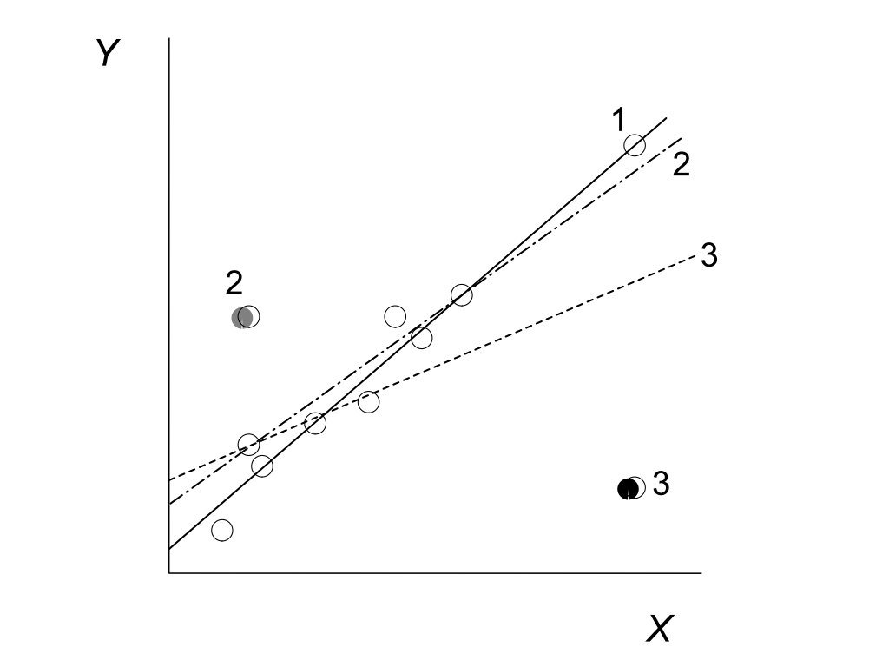{fig-align="center" width="90%"}

## Outlier Leverage and Influence (SVG)

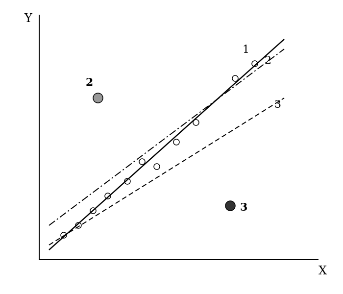{fig-align="center" width="90%"}

## DRAFT: Outlier Leverage and Influence

::: panel-tabset
### Output

```{r}
#| echo: false
#| eval: true
#| fig-width: 7
#| fig-height: 6

set.seed(42)
x <- c(1, 2, 3, 4, 5, 6, 7, 8, 9, 10)
y <- c(0.5, 1, 1.8, 2.3, 3.5, 4, 4.2, 5, 5.5, 6.5)

# Outlier points
x_all <- c(x, 3, 9)
y_all <- c(y, 5, 2)

plot(x_all, y_all, pch = c(rep(1, 10), 16, 16), cex = c(rep(1.5, 10), 2.5, 2.5),
     col = c(rep("black", 10), "gray50", "gray20"),
     xlab = "X", ylab = "Y", las = 1, xlim = c(0, 11), ylim = c(0, 8))

# Fit 1: original data
fit1 <- lm(y ~ x)
abline(fit1, lwd = 2, lty = 1)

# Fit 2: with high-leverage non-influential outlier
fit2 <- lm(y_all[c(1:10, 11)] ~ x_all[c(1:10, 11)])
abline(fit2, lwd = 2, lty = 4)

# Fit 3: with high-leverage influential outlier
fit3 <- lm(y_all[c(1:10, 12)] ~ x_all[c(1:10, 12)])
abline(fit3, lwd = 2, lty = 2)

legend("topleft",
       c("1: Original fit", "2: + Low leverage outlier", "3: + High leverage outlier"),
       lty = c(1, 4, 2), lwd = 2, cex = 0.9)
text(3, 5.3, "2", cex = 1.5, col = "gray50", font = 2)
text(9, 1.7, "3", cex = 1.5, col = "gray20", font = 2)
```

### Code

```{r}
#| echo: true
#| eval: false

set.seed(42)
x <- c(1, 2, 3, 4, 5, 6, 7, 8, 9, 10)
y <- c(0.5, 1, 1.8, 2.3, 3.5, 4, 4.2, 5, 5.5, 6.5)
x_all <- c(x, 3, 9)
y_all <- c(y, 5, 2)

plot(x_all, y_all, pch = c(rep(1, 10), 16, 16), cex = c(rep(1.5, 10), 2.5, 2.5),
     col = c(rep("black", 10), "gray50", "gray20"),
     xlab = "X", ylab = "Y", las = 1, xlim = c(0, 11), ylim = c(0, 8))

fit1 <- lm(y ~ x)
abline(fit1, lwd = 2, lty = 1)
fit2 <- lm(y_all[c(1:10, 11)] ~ x_all[c(1:10, 11)])
abline(fit2, lwd = 2, lty = 4)
fit3 <- lm(y_all[c(1:10, 12)] ~ x_all[c(1:10, 12)])
abline(fit3, lwd = 2, lty = 2)

legend("topleft",
       c("1: Original fit", "2: + Low leverage outlier", "3: + High leverage outlier"),
       lty = c(1, 4, 2), lwd = 2, cex = 0.9)
```

### Interpretation

- Point **2** (gray, at x=3) has a large residual but low leverage (it is near the center of x-space). It barely changes the regression line because it has little pull.
- Point **3** (dark gray, at x=9) has high leverage AND a large residual -- it is an **influential** point that noticeably tilts the regression line toward itself.
- This demonstrates why Cook's distance (which combines leverage and residual size) is more informative than either metric alone.
:::

## Outlier Leverage and Influence

-   **Leverage**: How much of an outlier in x-space

-   **Residual**: How much of an outlier in y-space

-   **Cook's D**: Overall influence on fitted model

-   A point with high leverage doesn't necessarily distort the model — only if it also has a large residual.

-   Cook's distance combines both: it measures how much all the fitted values would change if that single observation were removed.

::: callout-warning
Cook's D ≥ 1 indicates highly influential observations, and a rough rule of thumb is 4/n. Investigate these points — they may be data entry errors, measurement problems, or genuinely unusual cases.
:::

------------------------------------------------------------------------

# Residual Plots for the Grip Strength Models {background-color="#2c3e50"}

## BMP2 Model

-   The residuals vs. fitted values plot is our primary tool for checking linearity and homoscedasticity.
-   If the model is well-specified, we expect to see a random cloud of points centered around zero with no systematic pattern.

::: panel-tabset
### Output

```{r}
#| label: resid-bmp2-output
#| echo: false
#| eval: true
#| fig-width: 8
#| fig-height: 5

bmp2_diag <- data.frame(
  fitted = fitted(lm_bmp2),
  residuals = residuals(lm_bmp2)
)

ggplot(bmp2_diag, aes(x = fitted, y = residuals)) +
  geom_point(color = "steelblue", alpha = 0.6, size = 2) +
  geom_hline(yintercept = 0, linetype = "dashed", color = "red", linewidth = 0.8) +
  geom_smooth(method = "loess", se = FALSE, color = "darkorange", linewidth = 1) +
  labs(
    x = "Fitted Values (ŷ)",
    y = "Residuals (y - ŷ)",
    title = "Residuals vs. Fitted — BMP2 Model"
  ) +
  theme_minimal(base_size = 14)
```

### Code

```{r}
#| label: resid-bmp2-code
#| echo: true
#| eval: false

bmp2_diag <- data.frame(
  fitted = fitted(lm_bmp2),
  residuals = residuals(lm_bmp2)
)

ggplot(bmp2_diag, aes(x = fitted, y = residuals)) +
  geom_point(color = "steelblue", alpha = 0.6, size = 2) +
  geom_hline(yintercept = 0, linetype = "dashed", color = "red", linewidth = 0.8) +
  geom_smooth(method = "loess", se = FALSE, color = "darkorange", linewidth = 1) +
  labs(
    x = "Fitted Values (ŷ)",
    y = "Residuals (y - ŷ)",
    title = "Residuals vs. Fitted — BMP2 Model"
  ) +
  theme_minimal(base_size = 14)
```

### Interpretation

- The residuals vs. fitted plot for the BMP2 model should show a random cloud centered around zero with constant spread.
- The loess smoother (orange line) staying close to zero across all fitted values confirms the linearity assumption is met.
- Constant vertical spread of points indicates homoscedasticity -- the equal variance assumption holds.
:::

-   The loess smoother (orange line) helps visualize any systematic trend.
-   If it stays close to zero across the range of fitted values, linearity is satisfied.

## Exercise Model

::: panel-tabset
### Output

```{r}
#| label: resid-exercise-output
#| echo: false
#| eval: true
#| fig-width: 8
#| fig-height: 5

exercise_diag <- data.frame(
  fitted = fitted(lm_exercise),
  residuals = residuals(lm_exercise)
)

ggplot(exercise_diag, aes(x = fitted, y = residuals)) +
  geom_point(color = "darkorange", alpha = 0.6, size = 2) +
  geom_hline(yintercept = 0, linetype = "dashed", color = "red", linewidth = 0.8) +
  geom_smooth(method = "loess", se = FALSE, color = "purple", linewidth = 1) +
  labs(
    x = "Fitted Values (ŷ)",
    y = "Residuals (y - ŷ)",
    title = "Residuals vs. Fitted — Exercise Model (Linear)"
  ) +
  theme_minimal(base_size = 14)
```

### Code

```{r}
#| label: resid-exercise-code
#| echo: true
#| eval: false

exercise_diag <- data.frame(
  fitted = fitted(lm_exercise),
  residuals = residuals(lm_exercise)
)

ggplot(exercise_diag, aes(x = fitted, y = residuals)) +
  geom_point(color = "darkorange", alpha = 0.6, size = 2) +
  geom_hline(yintercept = 0, linetype = "dashed", color = "red", linewidth = 0.8) +
  geom_smooth(method = "loess", se = FALSE, color = "purple", linewidth = 1) +
  labs(
    x = "Fitted Values (ŷ)",
    y = "Residuals (y - ŷ)",
    title = "Residuals vs. Fitted — Exercise Model (Linear)"
  ) +
  theme_minimal(base_size = 14)
```

### Interpretation

- The residuals vs. fitted plot for the exercise model may show a curved loess smoother, suggesting the linear model does not fully capture the relationship.
- A systematic curved pattern in the residuals indicates the true relationship between exercise and grip strength may be nonlinear.
- This diagnostic motivates exploring polynomial regression as an alternative to the simple linear model.
:::

::: callout-important
Look carefully at the loess smoother — does it show curvature? If the residuals show a systematic curved pattern, this suggests a nonlinear relationship that a straight line cannot capture.
:::

## Full Diagnostic Panel: BMP2 Model

::: panel-tabset
### Output

```{r}
#| label: ggfortify-bmp2-output
#| echo: false
#| eval: true
#| fig-width: 10
#| fig-height: 7

autoplot(lm_bmp2, which = 1:4, ncol = 2) +
  theme_minimal(base_size = 12)
```

### Code

```{r}
#| label: ggfortify-bmp2-code
#| echo: true
#| eval: false

autoplot(lm_bmp2, which = 1:4, ncol = 2) +
  theme_minimal(base_size = 12)
```

### Interpretation

- The full diagnostic panel for the BMP2 model should confirm well-behaved residuals across all four diagnostic checks.
- Compare these plots to the exercise model diagnostics -- the BMP2 model should show better adherence to LINE assumptions.
- If the Q-Q plot shows points close to the diagonal, normality of residuals is satisfied, supporting the validity of confidence intervals and p-values.

### Enhancement

```{r}
#| eval: false
#| echo: true

# Alternative using ggfortify::autoplot with custom styling
autoplot(lm_bmp2, which = 1:4, ncol = 2,
         colour = "steelblue", smooth.colour = "firebrick") +
  theme_bw(base_size = 12)
```

- You can customize `autoplot()` colors and themes to match your presentation style.
:::

## Full Diagnostic Panel: Exercise Model

::: panel-tabset
### Output

```{r}
#| label: ggfortify-exercise-output
#| echo: false
#| eval: true
#| fig-width: 10
#| fig-height: 7

autoplot(lm_exercise, which = 1:4, ncol = 2) +
  theme_minimal(base_size = 12)
```

### Code

```{r}
#| label: ggfortify-exercise-code
#| echo: true
#| eval: false

autoplot(lm_exercise, which = 1:4, ncol = 2) +
  theme_minimal(base_size = 12)
```

### Interpretation

- The diagnostic plots for the exercise model may show violations -- particularly curvature in the Residuals vs. Fitted plot.
- Compare these diagnostics with the BMP2 model to see the contrast between a well-specified and a potentially misspecified model.
- Curvature in the residuals suggests that adding a polynomial term (e.g., quadratic) may improve the fit.
:::

------------------------------------------------------------------------

# Identifying and Removing Outliers {background-color="#2c3e50"}

## Fibroblast Cell Culture BMP/Sox9 Experiment

-   A colleague has shared data from a cell culture experiment measuring BMP4 and SOX9 gene expression (relative expression units from qPCR).

-   They want to model BMP4 expression as a function of SOX9 expression across 80 samples.

-   However, they suspect there may be some **data entry errors** and **outliers** in the dataset.

-   Your job is to fit a linear model, use diagnostic plots to identify the problematic observations, decide which to remove, and then refit the model.

-   Download the file `cell_culture_expression.csv` and move through the slides

## Types of Outliers to Watch For

Before we dive in, recall the different ways an observation can be unusual:

-   **Data entry errors**: Values that are off by an order of magnitude (e.g., someone typed 165 instead of 16.5). These are unambiguously wrong and should be corrected or removed.

-   **High leverage points**: Observations with extreme predictor ($x$) values. They have outsized *potential* to influence the fit, but may not actually distort it if they fall near the regression line.

-   **High residual points**: Observations far from the fitted line in the $y$ direction but with typical $x$ values. These inflate the residual variance but may not drastically shift the slope.

-   **High influence points**: The most dangerous — observations with *both* high leverage and a large residual. These can pull the entire regression line toward them, distorting slope and intercept estimates. Cook's distance captures this combined effect.

## Import and Plot the Raw Data

::: callout-tip
Always label your points with sample IDs when looking for outliers — you need to know *which* observations to investigate!
:::

::: panel-tabset
### Output

```{r}
#| label: outlier-import-output
#| echo: false
#| eval: true
#| fig-width: 8
#| fig-height: 5

expr <- read_csv("data/cell_culture_expression.csv")

ggplot(expr, aes(x = sox9_expression, y = bmp4_expression)) +
  geom_point(color = "steelblue", alpha = 0.7, size = 2.5) +
  geom_text(aes(label = sample_id), size = 2.2, nudge_y = 2, color = "gray40",
            check_overlap = TRUE) +
  labs(
    x = "SOX9 Expression (relative units)",
    y = "BMP4 Expression (relative units)",
    title = "BMP4 vs. SOX9 Expression — Raw Data"
  ) +
  theme_minimal(base_size = 14)
```

### Code

```{r}
#| label: outlier-import-code
#| echo: true
#| eval: false

expr <- read_csv("data/cell_culture_expression.csv")

ggplot(expr, aes(x = sox9_expression, y = bmp4_expression)) +
  geom_point(color = "steelblue", alpha = 0.7, size = 2.5) +
  geom_text(aes(label = sample_id), size = 2.2, nudge_y = 2, color = "gray40",
            check_overlap = TRUE) +
  labs(
    x = "SOX9 Expression (relative units)",
    y = "BMP4 Expression (relative units)",
    title = "BMP4 vs. SOX9 Expression — Raw Data"
  ) +
  theme_minimal(base_size = 14)
```

### Interpretation

- The scatterplot with labeled sample IDs allows visual identification of potential outliers -- points far from the main cluster.
- Labeling points is essential for outlier analysis because you need to trace suspicious observations back to the original data for investigation.
- The `check_overlap = TRUE` argument prevents label text from overlapping, improving readability.
:::

## Fit the Initial Model

-   Notice that the $R^2$ is lower than we might expect for a direct regulatory relationship.
-   Some of the unexplained variance is likely due to the outliers pulling the fit.

::: panel-tabset
### Output

```{r}
#| label: outlier-lm-raw-output
#| echo: false
#| eval: true

lm_expr_raw <- lm(bmp4_expression ~ sox9_expression, data = expr)
tidy(lm_expr_raw) |> kable(digits = 4)
```

\

```{r}
#| label: outlier-lm-raw-glance-output
#| echo: false
#| eval: true

glance(lm_expr_raw) |> kable(digits = 4)
```

### Code

```{r}
#| label: outlier-lm-raw-code
#| echo: true
#| eval: false

lm_expr_raw <- lm(bmp4_expression ~ sox9_expression, data = expr)
tidy(lm_expr_raw) |> kable(digits = 4)
glance(lm_expr_raw) |> kable(digits = 4)
```

### Interpretation

- The initial model fit shows the coefficient estimates and $R^2$ with outliers still present in the data.
- The $R^2$ is lower than expected for a direct regulatory relationship, likely because outliers are inflating the residual variance.
- These baseline statistics will be compared to the cleaned model to quantify the impact of outlier removal.
:::

## Visualize the Fit with Outliers Present

::: panel-tabset
### Output

```{r}
#| label: outlier-fit-raw-output
#| echo: false
#| eval: true
#| fig-width: 8
#| fig-height: 5

ggplot(expr, aes(x = sox9_expression, y = bmp4_expression)) +
  geom_point(color = "steelblue", alpha = 0.7, size = 2.5) +
  geom_smooth(method = "lm", se = TRUE, color = "firebrick", fill = "firebrick", alpha = 0.2) +
  labs(
    x = "SOX9 Expression (relative units)",
    y = "BMP4 Expression (relative units)",
    title = "Linear Fit with Outliers Present",
    subtitle = paste0("R² = ", round(summary(lm_expr_raw)$r.squared, 3))
  ) +
  theme_minimal(base_size = 14)
```

### Code

```{r}
#| label: outlier-fit-raw-code
#| echo: true
#| eval: false

ggplot(expr, aes(x = sox9_expression, y = bmp4_expression)) +
  geom_point(color = "steelblue", alpha = 0.7, size = 2.5) +
  geom_smooth(method = "lm", se = TRUE, color = "firebrick",
              fill = "firebrick", alpha = 0.2) +
  labs(
    x = "SOX9 Expression (relative units)",
    y = "BMP4 Expression (relative units)",
    title = "Linear Fit with Outliers Present",
    subtitle = paste0("R² = ", round(summary(lm_expr_raw)$r.squared, 3))
  ) +
  theme_minimal(base_size = 14)
```

### Interpretation

- The regression line with outliers present is visibly pulled away from the main data cloud by the extreme observations.
- The wide confidence ribbon reflects the increased uncertainty caused by the outliers inflating residual variance.
- After removing outliers, the fit should tighten considerably, with a narrower confidence band and steeper/shallower slope.
:::

## Diagnostic Plots to Identify Outliers

-   Examine the four panels. Which observations are flagged by R with their row numbers?
-   Pay attention to the Residuals vs. Leverage plot — points near or beyond the Cook's distance contour lines are the most influential.

::: panel-tabset
### Output

```{r}
#| label: outlier-diag-output
#| echo: false
#| eval: true
#| fig-width: 10
#| fig-height: 7

autoplot(lm_expr_raw, which = 1:4, ncol = 2) +
  theme_minimal(base_size = 12)
```

### Code

```{r}
#| label: outlier-diag-code
#| echo: true
#| eval: false

autoplot(lm_expr_raw, which = 1:4, ncol = 2) +
  theme_minimal(base_size = 12)
```

### Interpretation

- The four diagnostic plots help identify which observations are problematic and what type of outlier each one is.
- The Residuals vs. Leverage plot (bottom right) is the most important for identifying influential points -- observations near or beyond Cook's distance contour lines.
- R automatically labels the most extreme observations with their row numbers, guiding your investigation.
:::

## Cook's Distance

-   We can extract Cook's distance values and identify the most influential observations programmatically.
-   A common threshold for Cook's distance is $4/n$. Values exceeding this warrant closer inspection.
-   Values approaching or exceeding 1 are almost certainly problematic.

::: panel-tabset
### Output

```{r}
#| label: outlier-cooks-output
#| echo: false
#| eval: true

expr_diag <- expr |>
  mutate(
    cooks_d = cooks.distance(lm_expr_raw),
    leverage = hatvalues(lm_expr_raw),
    std_resid = rstandard(lm_expr_raw)
  )

# Flag observations with Cook's D > 4/n (common threshold)
threshold <- 4 / nrow(expr)

expr_diag |>
  filter(cooks_d > threshold) |>
  select(sample_id, bmp4_expression, sox9_expression, std_resid, leverage, cooks_d) |>
  arrange(desc(cooks_d)) |>
  kable(digits = 4)
```

### Code

```{r}
#| label: outlier-cooks-code
#| echo: true
#| eval: false

expr_diag <- expr |>
  mutate(
    cooks_d = cooks.distance(lm_expr_raw),
    leverage = hatvalues(lm_expr_raw),
    std_resid = rstandard(lm_expr_raw)
  )

# Flag observations with Cook's D > 4/n (common threshold)
threshold <- 4 / nrow(expr)

expr_diag |>
  filter(cooks_d > threshold) |>
  select(sample_id, bmp4_expression, sox9_expression, std_resid, leverage, cooks_d) |>
  arrange(desc(cooks_d)) |>
  kable(digits = 4)
```

### Interpretation

- Cook's distance values above the $4/n$ threshold flag observations that have a disproportionate influence on the model fit.
- The table shows each flagged observation's expression values, standardized residual, leverage, and Cook's distance, helping distinguish data entry errors from biological outliers.
- Observations with both high leverage and large residuals (high Cook's distance) are the most dangerous -- they can substantially distort slope and intercept estimates.
:::

## Visualizing Cook's Distance

::: panel-tabset
### Output

```{r}
#| label: outlier-cooks-plot-output
#| echo: false
#| eval: true
#| fig-width: 9
#| fig-height: 5

expr_diag <- expr_diag |>
  mutate(row_num = row_number())

ggplot(expr_diag, aes(x = row_num, y = cooks_d)) +
  geom_col(fill = ifelse(expr_diag$cooks_d > threshold, "firebrick", "steelblue"),
           alpha = 0.7) +
  geom_hline(yintercept = threshold, linetype = "dashed", color = "red", linewidth = 0.8) +
  geom_text(data = expr_diag |> filter(cooks_d > threshold),
            aes(label = sample_id), size = 2.8, nudge_y = 0.01, angle = 45) +
  labs(
    x = "Observation Index",
    y = "Cook's Distance",
    title = "Cook's Distance for Each Observation",
    subtitle = paste0("Dashed line = 4/n threshold (", round(threshold, 4), ")")
  ) +
  theme_minimal(base_size = 13)
```

### Code

```{r}
#| label: outlier-cooks-plot-code
#| echo: true
#| eval: false

expr_diag <- expr_diag |>
  mutate(row_num = row_number())

threshold <- 4 / nrow(expr)

ggplot(expr_diag, aes(x = row_num, y = cooks_d)) +
  geom_col(fill = ifelse(expr_diag$cooks_d > threshold, "firebrick", "steelblue"),
           alpha = 0.7) +
  geom_hline(yintercept = threshold, linetype = "dashed", color = "red", linewidth = 0.8) +
  geom_text(data = expr_diag |> filter(cooks_d > threshold),
            aes(label = sample_id), size = 2.8, nudge_y = 0.01, angle = 45) +
  labs(
    x = "Observation Index",
    y = "Cook's Distance",
    title = "Cook's Distance for Each Observation",
    subtitle = paste0("Dashed line = 4/n threshold (", round(threshold, 4), ")")
  ) +
  theme_minimal(base_size = 13)
```

### Interpretation

- The bar plot of Cook's distance makes it easy to spot which observations exceed the threshold (red bars above the dashed line).
- Observations with the highest Cook's distance values are labeled with their sample IDs for easy identification in the original data.
- This visualization is a practical tool for deciding which observations to investigate further or potentially remove.

### Enhancement

```{r}
#| eval: false
#| echo: true

# Interactive outlier investigation with plotly
library(plotly)
p <- ggplot(expr_diag, aes(x = leverage, y = std_resid,
                            size = cooks_d, label = sample_id)) +
  geom_point(alpha = 0.6, color = "steelblue") +
  geom_hline(yintercept = c(-2, 2), linetype = "dashed", color = "red") +
  labs(x = "Leverage", y = "Standardized Residual",
       title = "Leverage vs. Residual (size = Cook's D)") +
  theme_minimal()
ggplotly(p)
```

- An interactive `plotly` version lets you hover over points to see their sample IDs and diagnostic values, making outlier investigation faster and more intuitive.
:::

## Interpreting What We Found

Look at the flagged observations and think about what kind of outlier each one is:

-   **SC012** and **SC055**: BMP4 values around 100–165 when the rest of the data is in the 0–50 range. These are almost certainly **data entry errors** — values off by an order of magnitude (someone forgot a decimal point). These should be removed or corrected.

-   **SC037**: SOX9 value around 28 when the rest of the data is in the 0.5–8 range. Another likely **data entry error** with the same order-of-magnitude pattern.

-   **SC060**: High SOX9 (13.8) but very low BMP4 (8.5). This is a **high influence point** — extreme in x-space *and* far from the expected trend. It pulls the regression line down at the right end.

-   **SC045**: Moderate SOX9 (4.2) but very high BMP4 (25.5). A **high residual point** — not extreme in x-space, but far above the fitted line.

::: callout-important
Data entry errors should always be corrected or removed. For other outliers, the decision is more nuanced — document your reasoning!
:::

## Remove the Problematic Observations

-   We will remove the three clear data entry errors (SC012, SC037, SC055) and the high influence point (SC060).
-   We keep SC045 for now — it has a large residual but isn't clearly erroneous, and it doesn't have enough leverage to distort the fit badly.

::: panel-tabset
### Output

```{r}
#| label: outlier-remove-output
#| echo: false
#| eval: true

# Remove data entry errors and the high influence point
remove_ids <- c("SC012", "SC037", "SC055", "SC060")

expr_clean <- expr |>
  filter(!sample_id %in% remove_ids)

cat("Original observations:", nrow(expr), "\n")
cat("Removed:", length(remove_ids), "observations:", paste(remove_ids, collapse = ", "), "\n")
cat("Remaining observations:", nrow(expr_clean), "\n")
```

### Code

```{r}
#| label: outlier-remove-code
#| echo: true
#| eval: false

# Remove data entry errors and the high influence point
remove_ids <- c("SC012", "SC037", "SC055", "SC060")

expr_clean <- expr |>
  filter(!sample_id %in% remove_ids)

cat("Original observations:", nrow(expr), "\n")
cat("Removed:", length(remove_ids), "observations\n")
cat("Remaining observations:", nrow(expr_clean), "\n")
```

### Interpretation

- Four observations are removed: three clear data entry errors (SC012, SC037, SC055 with values off by an order of magnitude) and one high-influence point (SC060).
- SC045 is retained because, despite its large residual, it does not appear to be erroneous and lacks sufficient leverage to distort the fit.
- Always document the reasoning for each removal decision -- transparency is critical for reproducible research.
:::

::: callout-note
Always document which observations you removed and why. Never silently drop data points — your methods section should describe this.
:::

## Refit the Model on Clean Data

-   Compare the $R^2$ before and after cleaning.
-   The relationship between SOX9 and BMP4 should now be much clearer, and the coefficient estimates more trustworthy.

::: panel-tabset
### Output

```{r}
#| label: outlier-refit-output
#| echo: false
#| eval: true

lm_expr_clean <- lm(bmp4_expression ~ sox9_expression, data = expr_clean)
tidy(lm_expr_clean) |> kable(digits = 4)
```

\

```{r}
#| label: outlier-refit-glance-output
#| echo: false
#| eval: true

glance(lm_expr_clean) |> kable(digits = 4)
```

### Code

```{r}
#| label: outlier-refit-code
#| echo: true
#| eval: false

lm_expr_clean <- lm(bmp4_expression ~ sox9_expression, data = expr_clean)
tidy(lm_expr_clean) |> kable(digits = 4)
glance(lm_expr_clean) |> kable(digits = 4)
```

### Interpretation

- After removing the problematic observations, the $R^2$ should increase substantially, indicating that the outliers were masking the true strength of the SOX9-BMP4 relationship.
- The coefficient estimates should also change, particularly the slope -- without outliers pulling the line, the estimated relationship becomes more accurate.
- Comparing before/after statistics quantifies the impact of outlier removal and strengthens confidence in the cleaned model.
:::

## Compare Fits — Before and After

::: panel-tabset
### Output

```{r}
#| label: outlier-compare-output
#| echo: false
#| eval: true
#| fig-width: 12
#| fig-height: 5

p_raw <- ggplot(expr, aes(x = sox9_expression, y = bmp4_expression)) +
  geom_point(color = "steelblue", alpha = 0.6, size = 2) +
  geom_point(data = expr |> filter(sample_id %in% remove_ids),
             color = "firebrick", size = 3, shape = 1, stroke = 1.5) +
  geom_smooth(method = "lm", se = TRUE, color = "firebrick", fill = "firebrick", alpha = 0.15) +
  labs(x = "SOX9 Expression", y = "BMP4 Expression",
       title = "Before: With Outliers",
       subtitle = paste0("R² = ", round(summary(lm_expr_raw)$r.squared, 3))) +
  theme_minimal(base_size = 13)

p_clean <- ggplot(expr_clean, aes(x = sox9_expression, y = bmp4_expression)) +
  geom_point(color = "steelblue", alpha = 0.6, size = 2) +
  geom_smooth(method = "lm", se = TRUE, color = "darkgreen", fill = "darkgreen", alpha = 0.15) +
  labs(x = "SOX9 Expression", y = "BMP4 Expression",
       title = "After: Outliers Removed",
       subtitle = paste0("R² = ", round(summary(lm_expr_clean)$r.squared, 3))) +
  theme_minimal(base_size = 13)

p_raw + p_clean
```

### Code

```{r}
#| label: outlier-compare-code
#| echo: true
#| eval: false

p_raw <- ggplot(expr, aes(x = sox9_expression, y = bmp4_expression)) +
  geom_point(color = "steelblue", alpha = 0.6, size = 2) +
  geom_point(data = expr |> filter(sample_id %in% remove_ids),
             color = "firebrick", size = 3, shape = 1, stroke = 1.5) +
  geom_smooth(method = "lm", se = TRUE, color = "firebrick",
              fill = "firebrick", alpha = 0.15) +
  labs(x = "SOX9 Expression", y = "BMP4 Expression",
       title = "Before: With Outliers",
       subtitle = paste0("R² = ", round(summary(lm_expr_raw)$r.squared, 3))) +
  theme_minimal(base_size = 13)

p_clean <- ggplot(expr_clean, aes(x = sox9_expression, y = bmp4_expression)) +
  geom_point(color = "steelblue", alpha = 0.6, size = 2) +
  geom_smooth(method = "lm", se = TRUE, color = "darkgreen",
              fill = "darkgreen", alpha = 0.15) +
  labs(x = "SOX9 Expression", y = "BMP4 Expression",
       title = "After: Outliers Removed",
       subtitle = paste0("R² = ", round(summary(lm_expr_clean)$r.squared, 3))) +
  theme_minimal(base_size = 13)

p_raw + p_clean
```

### Interpretation

- The side-by-side comparison dramatically illustrates how outliers can distort a regression analysis.
- The "Before" panel shows the outliers circled in red and a regression line pulled toward them, with a lower $R^2$.
- The "After" panel shows a tighter fit, higher $R^2$, and a regression line that better represents the majority of the data.
:::

## Residual Diagnostics on Clean Data

::: panel-tabset
### Output

```{r}
#| label: outlier-resid-clean-output
#| echo: false
#| eval: true
#| fig-width: 10
#| fig-height: 7

autoplot(lm_expr_clean, which = 1:4, ncol = 2) +
  theme_minimal(base_size = 12)
```

### Code

```{r}
#| label: outlier-resid-clean-code
#| echo: true
#| eval: false

autoplot(lm_expr_clean, which = 1:4, ncol = 2) +
  theme_minimal(base_size = 12)
```

### Interpretation

- The diagnostic plots for the cleaned data should show well-behaved residuals -- no systematic patterns, approximate normality, and constant variance.
- If the cleaned model passes all diagnostic checks, we can be confident in its coefficient estimates, standard errors, and p-values.
- Any remaining flagged observations in the cleaned data are likely natural biological variation rather than errors, and should generally be retained.
:::

## Outlier Exercise Summary

::: callout-tip
## What We Learned

1.  **Always visualize your data first.** A simple scatterplot with labeled points would have immediately revealed the order-of-magnitude entry errors.

2.  **Use multiple diagnostic tools.** Cook's distance, leverage, and standardized residuals each capture different aspects of "outlierness."

3.  **Distinguish error from biology.** Data entry errors (10x values) are unambiguously wrong. Biological outliers require more thought — they could represent real variation, subpopulations, or experimental artifacts.

4.  **Document everything.** Record which observations you removed, why, and how the results changed. Transparency is essential for reproducibility.

5.  **Outlier removal can dramatically improve** $R^2$ **and coefficient estimates**, but it must be justified by evidence, not by a desire for better-looking results.
:::

------------------------------------------------------------------------

# The Eugenics History of Statistics

## Galton's original data

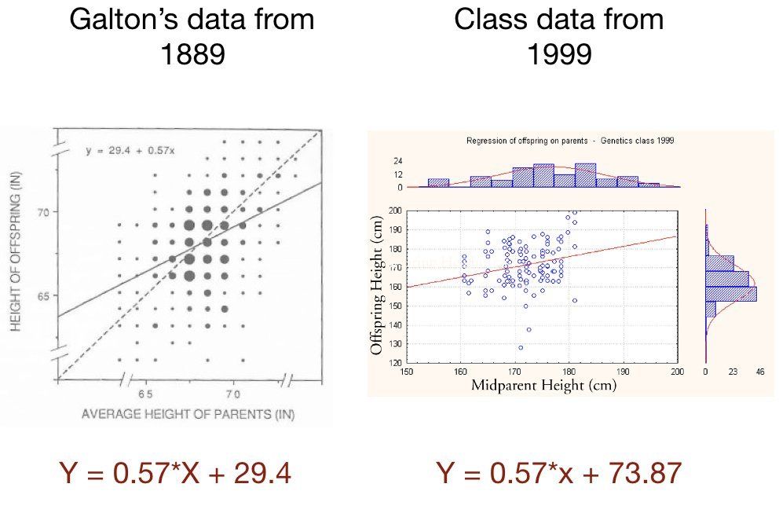{fig-align="center" width="100%"}

::: {.aside}
Source: Galton, F. (1889). *Natural Inheritance.* Macmillan; Class data from 1999.
:::

## DRAFT: Galton's Regression to the Mean

::::: columns
::: {.column width="50%"}
**Galton's data from 1889**

```{r}
#| echo: false
#| eval: true
#| fig-width: 5
#| fig-height: 5

set.seed(1889)
n <- 200
parent_height <- rnorm(n, mean = 68, sd = 2)
offspring_height <- 29.4 + 0.57 * parent_height + rnorm(n, 0, 1.5)

parent_r <- round(parent_height)
offspring_r <- round(offspring_height)
df <- data.frame(parent = parent_r, offspring = offspring_r)
df_counts <- as.data.frame(table(df$parent, df$offspring))
names(df_counts) <- c("parent", "offspring", "count")
df_counts$parent <- as.numeric(as.character(df_counts$parent))
df_counts$offspring <- as.numeric(as.character(df_counts$offspring))
df_counts <- df_counts[df_counts$count > 0, ]

plot(df_counts$parent, df_counts$offspring,
     cex = sqrt(df_counts$count) * 1.2,
     pch = 16, col = rgb(0.3, 0.3, 0.3, 0.7),
     xlab = "AVERAGE HEIGHT OF PARENTS (IN)",
     ylab = "HEIGHT OF OFFSPRING (IN)",
     xlim = c(63, 73), ylim = c(62, 73), las = 1)
abline(a = 29.4, b = 0.57, lwd = 2)
abline(a = 0, b = 1, lwd = 2, lty = 2)
```

$$Y = 0.57X + 29.4$$
:::

::: {.column width="50%"}
**Class data from 1999**

```{r}
#| echo: false
#| eval: true
#| fig-width: 5
#| fig-height: 5

set.seed(1999)
n <- 60
mid_parent <- rnorm(n, mean = 172, sd = 8)
offspring_cm <- 73.87 + 0.57 * mid_parent + rnorm(n, 0, 5)

plot(mid_parent, offspring_cm, pch = 1, cex = 1.2,
     col = "blue", xlab = "Midparent Height (cm)",
     ylab = "Offspring Height (cm)",
     xlim = c(150, 200), ylim = c(120, 200), las = 1)
abline(lm(offspring_cm ~ mid_parent), col = "red", lwd = 2)
```

$$Y = 0.57x + 73.87$$
:::
:::::

## Galton as the Father of Eugenics

{fig.align="center"}

::: {.aside}
Source: Portrait of Sir Francis Galton, public domain.
:::

-   Francis Galton: Darwin's half cousin
-   Studied human variation and genetic inheritance
    -   Human height, fingerprints, intelligence
    -   Correlation, regression toward the mean, and "nature versus nurture"
    -   Pioneered twin studies

## Galton as the Father of Eugenics

-   Believed that intelligence was hereditary based on surveying prominent academics in Europe
-   Used the ideas of **correlation** and **regression towards the mean** to argue that the upper class should breed amongst themselves to keep those "good genes" pure
-   Wanted to provide monetary incentives for "good" couples to marry and reproduce as a way to avoid the upper class being genetically muddied by the lower class

## A common sight at state fairs around the U.S. in the 1930s

-   Competitions for the "perfect family" to encourage public consciousness and support for eugenics

```{r, echo=FALSE, out.width='50%', fig.asp=.75, fig.align='center'}

```

::: {.aside}
Source: Eugenics Building at a state fair, ca. 1920s. American Philosophical Society.
:::

## Galton, Charles Davenport & G. Stanley Hall

```{r, echo=FALSE, out.width='50%', fig.asp=.75, fig.align='center'}
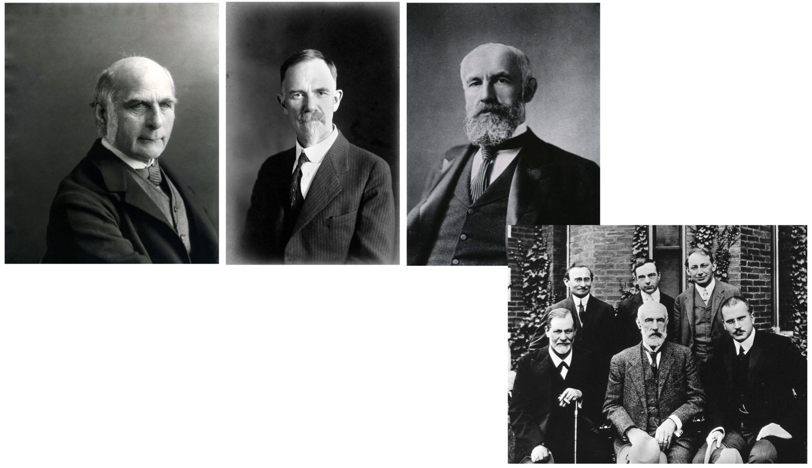
```

::: {.aside}
Source: Historical photographs, public domain.
:::

## Logo of the US eugenics society

```{r, echo=FALSE, out.width='80%', fig.asp=.75, fig.align='center'}

```

::: {.aside}
Source: Eugenics tree logo, American Eugenics Society, ca. 1920s. Public domain.
:::

-   American Eugenics Record Office (ERO) founded in Cold Springs Harbor

## Eugenics societies in America

-   Advocated for state laws to ban interracial marriages and promote sterilization of "unfit" individuals (negative eugenics) - especially black, Latinx, and Native American women
-   30 states passed laws to force mental institution patients to be sterilized
-   Between 1907 and 1963, over 64,000 individuals were forcibly sterilized under eugenic legislation in the United States

## RA Fisher and Eugenics in London

-   Developer of Fishers exact test, analysis of variance (ANOVA), null hypothesis, p values, maximum likelihood, probability density functions
-   Founding Chairman of the University of Cambridge Eugenics Society

```{r, echo=FALSE, out.width='20%', fig.asp=.75, fig.align='center'}

```

::: {.aside}
Source: Portrait of R.A. Fisher, public domain.
:::

## RA Fisher and Eugenics

-   1/3rd of his work "The Genetical Theory of Natural Selection" discussed eugenics and his theory that the fall of civilizations was due to the fertility of their upper classes being diminished
-   Used these statistical methods to test data on human variation to prove biological differences between human races
-   Eugenics and racism were the primary motivators for many of these statistical tests that we use today

## A direct line to Hitler and Nazism

-   Eugenics existed in America (and England) before it became popular in Germany.
-   By 1933, California had subjected more people to forceful sterilization than all other U.S. states combined.
-   The forced sterilization program engineered by the Nazis was partly inspired by California's.

```{r, echo=FALSE, out.width='70%', fig.asp=.75, fig.align='center'}

```

::: {.aside}
Source: Historical photographs, public domain.
:::

## Sterilizations continue in America

-   Our history books paint Nazi Germany as the primary evil of that time, while we try to cover up our significant role in eugenics
-   It wasn't until 1978 that the US passed regulations on sterilization procedures
-   California only passed a bill to outlaw sterilization of inmates in 2014
-   Certain members of the genetic engineering community threaten to bring back eugenics ideas
-   Our current President repeats eugenics talking points

## So, what do we do from here?

-   The statistical methods that Galton, Fisher, and others developed are useful science tools
-   Important to use these tools for good - improving our planet, human health, and technology
-   Important to acknowledge and not forget the history of science - educate others to avoid repeating history

## Interested in learning more?

```{r, echo=FALSE, out.width='20%', fig.asp=.75, fig.align='center'}

```

::: {.aside}
Source: Zimmer, C. (2018). *She Has Her Mother's Laugh.* Dutton.
:::

-   See also
    -   "The Gene" by Siddhartha Mukherjee
    -   "Control" by Adam Rutherford

------------------------------------------------------------------------

# Polynomial Regression: When Linear Isn't Enough {background-color="#2c3e50"}

## Motivation for Polynomial Regression

The residual plots for the exercise model may suggest curvature — the loess smoother deviates from zero in a systematic way. This is a signal that the true relationship between exercise hours and grip strength may be nonlinear.

A polynomial regression extends the linear model by adding powers of $x$ as additional predictors. For a quadratic (degree 2) polynomial:

::: panel-tabset
### Equation

$$y_i = \beta_0 + \beta_1 x_i + \beta_2 x_i^2 + \epsilon_i$$

### LaTeX

``` text
y_i = \beta_0 + \beta_1 x_i + \beta_2 x_i^2 + \epsilon_i
```

### Interpretation

- This extends the simple linear model by adding a squared term ($x_i^2$), allowing the relationship between Y and X to curve.
- It is still "linear" in the statistical sense because the parameters ($\beta_0$, $\beta_1$, $\beta_2$) enter linearly -- it is the relationship with X that is nonlinear.
- A positive $\beta_2$ produces a U-shape; a negative $\beta_2$ produces an inverted-U (concave down).
:::

This is still a **linear model** in the statistical sense (the parameters $\beta$ enter linearly), but the relationship between $y$ and $x$ is now curved. A quadratic term can capture a U-shape or inverted-U pattern that a straight line would miss.

## Power and Polynomial Relationships

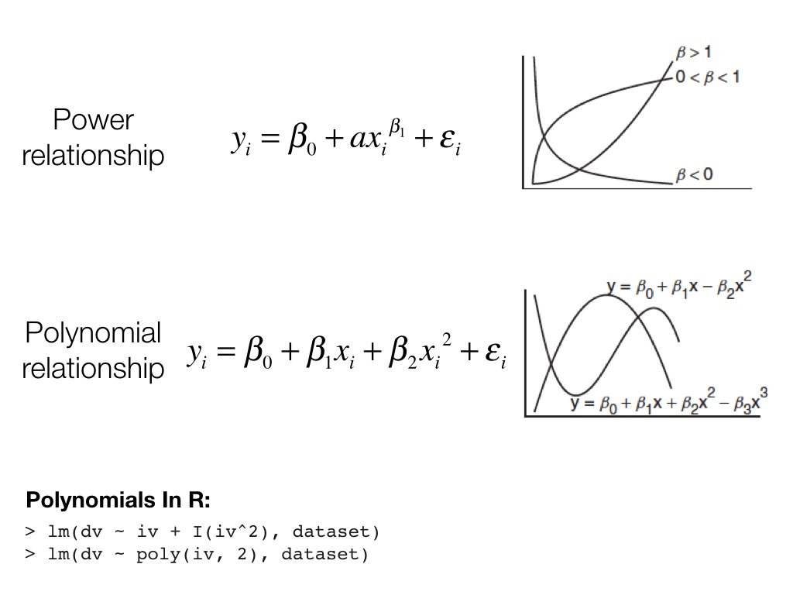{alt="Power and polynomial relationships in regression" fig-align="center" width="90%"}

## Power and Polynomial Relationships (SVG)

{fig-align="center" width="90%"}

## DRAFT: Power and Polynomial Relationships

::::: columns
::: {.column width="50%"}
**Power relationship:**

$$y_i = \beta_0 + ax_i^{\beta_1} + \varepsilon_i$$

```{r}
#| echo: false
#| eval: true
#| fig-width: 4
#| fig-height: 3

x <- seq(0.1, 5, length.out = 100)
plot(x, x^2, type = "l", lwd = 2, xlab = "", ylab = "",
     main = "", axes = FALSE)
lines(x, x^0.5, lwd = 2, lty = 2)
lines(x, x^(-1), lwd = 2, lty = 3)
axis(1); axis(2)
text(4, 22, expression(beta > 1), cex = 1.1)
text(4, 2.5, expression(0 < beta~"<"~ 1), cex = 1.1)
text(4, 0.5, expression(beta < 0), cex = 1.1)
```
:::

::: {.column width="50%"}
**Polynomial relationship:**

$$y_i = \beta_0 + \beta_1 x_i + \beta_2 x_i^2 + \varepsilon_i$$

```{r}
#| echo: false
#| eval: true
#| fig-width: 4
#| fig-height: 3

x <- seq(-3, 3, length.out = 100)
plot(x, 0.5 + x - 0.5*x^2, type = "l", lwd = 2,
     xlab = "", ylab = "", axes = FALSE)
lines(x, 0.5 + x + 0.3*x^2 - 0.2*x^3, lwd = 2, lty = 2)
axis(1); axis(2)
```
:::
:::::

**Polynomials in R:**
```r
lm(dv ~ iv + I(iv^2), dataset)
lm(dv ~ poly(iv, 2), dataset)
```

In R, we use `poly(x, degree)` inside the `lm()` formula, or equivalently `I(x^2)`:

The `raw = TRUE` argument means R uses the raw polynomial terms ($x$ and $x^2$) rather than orthogonal polynomials, making the coefficients directly interpretable.

::: panel-tabset
### Output

```{r}
#| label: poly-exercise-output
#| echo: false
#| eval: true

lm_exercise_poly <- lm(grip_strength_kg ~ poly(exercise_hrs_week, 2, raw = TRUE), data = grip)
summary(lm_exercise_poly)
```

### Code

```{r}
#| label: poly-exercise-code
#| echo: true
#| eval: false

# Fit quadratic polynomial: grip_strength ~ exercise + exercise^2
lm_exercise_poly <- lm(grip_strength_kg ~ poly(exercise_hrs_week, 2, raw = TRUE),
                        data = grip)
summary(lm_exercise_poly)
```

### Interpretation

- The polynomial model adds a quadratic term ($\text{exercise}^2$) to capture potential curvature in the exercise-grip strength relationship.
- Using `poly(x, 2, raw = TRUE)` gives raw polynomial coefficients that are directly interpretable as the linear and quadratic effects.
- A significant quadratic term (p < 0.05) would confirm that the relationship is nonlinear and that the polynomial model is preferred over the simple linear one.
:::

## Interpreting the Polynomial Model

Compare the $R^2$ from this polynomial model with the linear exercise model. If the quadratic term is significant and $R^2$ improves meaningfully, the curvilinear fit is more appropriate.

::: panel-tabset
### Output

```{r}
#| label: poly-exercise-tidy-output
#| echo: false
#| eval: true

tidy(lm_exercise_poly) |> kable(digits = 4)
```

\

```{r}
#| label: poly-exercise-glance-output
#| echo: false
#| eval: true

glance(lm_exercise_poly) |> kable(digits = 4)
```

### Code

```{r}
#| label: poly-exercise-tidy-code
#| echo: true
#| eval: false

tidy(lm_exercise_poly) |> kable(digits = 4)
glance(lm_exercise_poly) |> kable(digits = 4)
```

### Interpretation

- Compare the $R^2$ from the polynomial model with the linear exercise model -- a meaningful increase confirms the quadratic term improves the fit.
- The `tidy()` output shows whether the quadratic coefficient is statistically significant.
- If the quadratic term is significant but the $R^2$ improvement is modest, the practical significance may be limited.
:::

## Comparing Linear vs. Polynomial Fit

We can formally compare the linear and polynomial models using `anova()`, which tests whether the additional quadratic term significantly improves the fit:

A significant p-value here means the quadratic term explains a statistically significant amount of additional variance beyond the linear term alone.

::: panel-tabset
### Output

```{r}
#| label: anova-compare-output
#| echo: false
#| eval: true

anova(lm_exercise, lm_exercise_poly)
```

### Code

```{r}
#| label: anova-compare-code
#| echo: true
#| eval: false

# Compare nested models: linear vs. quadratic
anova(lm_exercise, lm_exercise_poly)
```

### Interpretation

- The `anova()` comparison performs a formal F-test of whether the quadratic term significantly improves the model over the linear-only version.
- A significant p-value means the additional variance explained by the quadratic term is unlikely to have occurred by chance.
- This nested model comparison is the proper way to test whether increased model complexity is justified.
:::

## Visualizing the Polynomial Fit

::: panel-tabset
### Output

```{r}
#| label: ggplot-poly-output
#| echo: false
#| eval: true
#| fig-width: 8
#| fig-height: 5

ggplot(grip, aes(x = exercise_hrs_week, y = grip_strength_kg)) +
  geom_point(color = "darkorange", alpha = 0.6, size = 2) +
  geom_smooth(method = "lm", formula = y ~ poly(x, 2),
              se = TRUE, color = "darkgreen", fill = "darkgreen", alpha = 0.2) +
  labs(
    x = "Exercise (hours/week)",
    y = "Grip Strength (kg)",
    title = "Grip Strength vs. Exercise Hours — Polynomial Fit",
    subtitle = paste0("Quadratic fit: R² = ", round(summary(lm_exercise_poly)$r.squared, 3))
  ) +
  theme_minimal(base_size = 14)
```

### Code

```{r}
#| label: ggplot-poly-code
#| echo: true
#| eval: false

ggplot(grip, aes(x = exercise_hrs_week, y = grip_strength_kg)) +
  geom_point(color = "darkorange", alpha = 0.6, size = 2) +
  geom_smooth(method = "lm", formula = y ~ poly(x, 2),
              se = TRUE, color = "darkgreen", fill = "darkgreen", alpha = 0.2) +
  labs(
    x = "Exercise (hours/week)",
    y = "Grip Strength (kg)",
    title = "Grip Strength vs. Exercise Hours — Polynomial Fit",
    subtitle = paste0("Quadratic fit: R² = ",
                      round(summary(lm_exercise_poly)$r.squared, 3))
  ) +
  theme_minimal(base_size = 14)
```

### Interpretation

- The polynomial fit shows a curved relationship between exercise hours and grip strength, capturing a pattern the linear model missed.
- The curve may reveal an optimal range of exercise -- too little or too much might not improve grip strength as much as moderate amounts.
- Compare the $R^2$ of this fit with the linear model to quantify the improvement.
:::

## Linear vs. Polynomial: Side by Side

::: panel-tabset
### Output

```{r}
#| label: ggplot-compare-fits-output
#| echo: false
#| eval: true
#| fig-width: 12
#| fig-height: 5

p_lin <- ggplot(grip, aes(x = exercise_hrs_week, y = grip_strength_kg)) +
  geom_point(color = "darkorange", alpha = 0.6, size = 2) +
  geom_smooth(method = "lm", se = TRUE, color = "firebrick", fill = "firebrick", alpha = 0.2) +
  labs(x = "Exercise (hours/week)", y = "Grip Strength (kg)",
       title = "Linear Fit",
       subtitle = paste0("R² = ", round(summary(lm_exercise)$r.squared, 3))) +
  theme_minimal(base_size = 13)

p_poly <- ggplot(grip, aes(x = exercise_hrs_week, y = grip_strength_kg)) +
  geom_point(color = "darkorange", alpha = 0.6, size = 2) +
  geom_smooth(method = "lm", formula = y ~ poly(x, 2),
              se = TRUE, color = "darkgreen", fill = "darkgreen", alpha = 0.2) +
  labs(x = "Exercise (hours/week)", y = "Grip Strength (kg)",
       title = "Quadratic Fit",
       subtitle = paste0("R² = ", round(summary(lm_exercise_poly)$r.squared, 3))) +
  theme_minimal(base_size = 13)

p_lin + p_poly
```

### Code

```{r}
#| label: ggplot-compare-fits-code
#| echo: true
#| eval: false

p_lin <- ggplot(grip, aes(x = exercise_hrs_week, y = grip_strength_kg)) +
  geom_point(color = "darkorange", alpha = 0.6, size = 2) +
  geom_smooth(method = "lm", se = TRUE, color = "firebrick",
              fill = "firebrick", alpha = 0.2) +
  labs(x = "Exercise (hours/week)", y = "Grip Strength (kg)",
       title = "Linear Fit",
       subtitle = paste0("R² = ", round(summary(lm_exercise)$r.squared, 3))) +
  theme_minimal(base_size = 13)

p_poly <- ggplot(grip, aes(x = exercise_hrs_week, y = grip_strength_kg)) +
  geom_point(color = "darkorange", alpha = 0.6, size = 2) +
  geom_smooth(method = "lm", formula = y ~ poly(x, 2),
              se = TRUE, color = "darkgreen", fill = "darkgreen", alpha = 0.2) +
  labs(x = "Exercise (hours/week)", y = "Grip Strength (kg)",
       title = "Quadratic Fit",
       subtitle = paste0("R² = ", round(summary(lm_exercise_poly)$r.squared, 3))) +
  theme_minimal(base_size = 13)

p_lin + p_poly
```

### Interpretation

- Side-by-side comparison makes the improvement from the linear to quadratic fit visually apparent.
- The polynomial fit (green) curves through the data, while the linear fit (red) misses the nonlinear pattern.
- The $R^2$ values in the subtitles quantify how much additional variance the quadratic term explains.
:::

## Residuals: Linear vs. Polynomial Exercise Model

Now we compare the residual plots to see whether the polynomial model resolves the curvature issue:

::: panel-tabset
### Output

```{r}
#| label: resid-compare-output
#| echo: false
#| eval: true
#| fig-width: 12
#| fig-height: 5

lin_diag <- data.frame(
  fitted = fitted(lm_exercise),
  residuals = residuals(lm_exercise),
  model = "Linear"
)

poly_diag <- data.frame(
  fitted = fitted(lm_exercise_poly),
  residuals = residuals(lm_exercise_poly),
  model = "Quadratic"
)

both_diag <- rbind(lin_diag, poly_diag)

ggplot(both_diag, aes(x = fitted, y = residuals)) +
  geom_point(alpha = 0.5, size = 2) +
  geom_hline(yintercept = 0, linetype = "dashed", color = "red", linewidth = 0.8) +
  geom_smooth(method = "loess", se = FALSE, color = "darkorange", linewidth = 1) +
  facet_wrap(~ model, scales = "free_x") +
  labs(
    x = "Fitted Values (ŷ)",
    y = "Residuals (y - ŷ)",
    title = "Residuals vs. Fitted — Linear vs. Quadratic Exercise Model"
  ) +
  theme_minimal(base_size = 13)
```

### Code

```{r}
#| label: resid-compare-code
#| echo: true
#| eval: false

lin_diag <- data.frame(
  fitted = fitted(lm_exercise),
  residuals = residuals(lm_exercise),
  model = "Linear"
)

poly_diag <- data.frame(
  fitted = fitted(lm_exercise_poly),
  residuals = residuals(lm_exercise_poly),
  model = "Quadratic"
)

both_diag <- rbind(lin_diag, poly_diag)

ggplot(both_diag, aes(x = fitted, y = residuals)) +
  geom_point(alpha = 0.5, size = 2) +
  geom_hline(yintercept = 0, linetype = "dashed", color = "red", linewidth = 0.8) +
  geom_smooth(method = "loess", se = FALSE, color = "darkorange", linewidth = 1) +
  facet_wrap(~ model, scales = "free_x") +
  labs(x = "Fitted Values (ŷ)", y = "Residuals (y - ŷ)",
       title = "Residuals vs. Fitted — Linear vs. Quadratic Exercise Model") +
  theme_minimal(base_size = 13)
```

### Interpretation

- Comparing residual patterns between the linear and quadratic models reveals whether the polynomial term resolved the curvature issue.
- In the linear model, the loess smoother should show a curved pattern; in the quadratic model, it should be flatter (closer to zero).
- A flatter loess smoother in the polynomial residuals confirms that the quadratic term successfully captured the nonlinear component of the relationship.
:::

## Full Diagnostics: Polynomial Exercise Model

::: panel-tabset
### Output

```{r}
#| label: ggfortify-poly-output
#| echo: false
#| eval: true
#| fig-width: 10
#| fig-height: 7

autoplot(lm_exercise_poly, which = 1:4, ncol = 2) +
  theme_minimal(base_size = 12)
```

### Code

```{r}
#| label: ggfortify-poly-code
#| echo: true
#| eval: false

autoplot(lm_exercise_poly, which = 1:4, ncol = 2) +
  theme_minimal(base_size = 12)
```

### Interpretation

- After fitting the polynomial model, the residual diagnostics should show improved patterns compared to the linear exercise model.
- Look for the Residuals vs. Fitted plot showing a more random scatter (less curvature), confirming the quadratic term addresses the nonlinearity.
- The Q-Q plot should still show approximate normality, and the Scale-Location plot should show constant variance.
:::

##

## Case Study in Model Selection: Beetle Horn Allometry

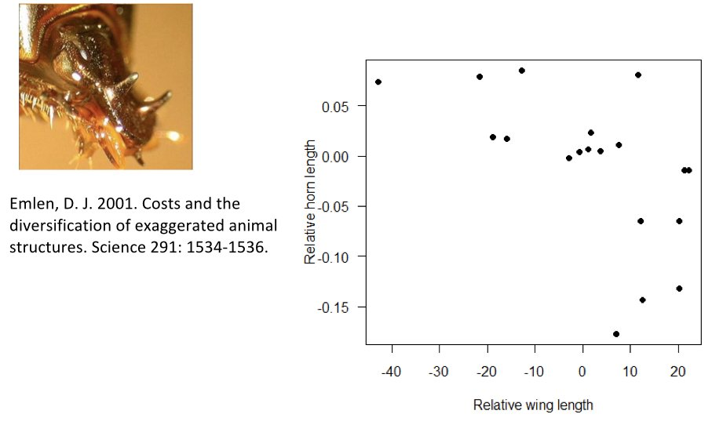{alt="Emlen 2001 beetle horn vs wing length data" fig-align="center" width="90%"}

::: {.aside}
Source: Emlen, D.J. (2001). Costs and the diversification of exaggerated animal structures. *Science*, 291, 1534-1536.
:::

Data from Emlen, D.J. 2001. *Costs and the diversification of exaggerated animal structures.* Science 291: 1534-1536.

## DRAFT: Beetle Horn Allometry Data

::: panel-tabset
### Output

```{r}
#| echo: false
#| eval: true
#| fig-width: 7
#| fig-height: 5

# Simulate beetle horn vs wing data similar to Emlen 2001
set.seed(2001)
wing <- seq(5, 25, length.out = 50) + rnorm(50, 0, 1)
horn <- ifelse(wing < 15, rnorm(50, 0, 0.5),
               0.8 * (wing - 14)^1.3 + rnorm(50, 0, 1.5))
horn[horn < 0] <- abs(rnorm(sum(horn < 0), 0.2, 0.1))
beetle <- data.frame(wing = wing, horn = horn)

plot(beetle$wing, beetle$horn, pch = 16, cex = 1.3,
     xlab = "Wing length (mm)", ylab = "Horn length (mm)",
     main = "Emlen 2001: Beetle horn vs wing length", las = 1)
```

### Code

```{r}
#| echo: true
#| eval: false

# Simulate beetle horn vs wing data similar to Emlen 2001
set.seed(2001)
wing <- seq(5, 25, length.out = 50) + rnorm(50, 0, 1)
horn <- ifelse(wing < 15, rnorm(50, 0, 0.5),
               0.8 * (wing - 14)^1.3 + rnorm(50, 0, 1.5))
horn[horn < 0] <- abs(rnorm(sum(horn < 0), 0.2, 0.1))
beetle <- data.frame(wing = wing, horn = horn)

plot(beetle$wing, beetle$horn, pch = 16, cex = 1.3,
     xlab = "Wing length (mm)", ylab = "Horn length (mm)",
     main = "Emlen 2001: Beetle horn vs wing length", las = 1)
```

### Interpretation

- The scatterplot reveals a clear nonlinear (threshold-like) pattern: beetles with small wings have essentially no horn growth, while larger beetles show rapid, accelerating horn growth.
- This is a classic allometric relationship where resource allocation to horns depends on body size exceeding a developmental threshold.
- A simple linear model would be inappropriate here; polynomial or piecewise regression is needed to capture this pattern.
:::

## Linear Regression Fit

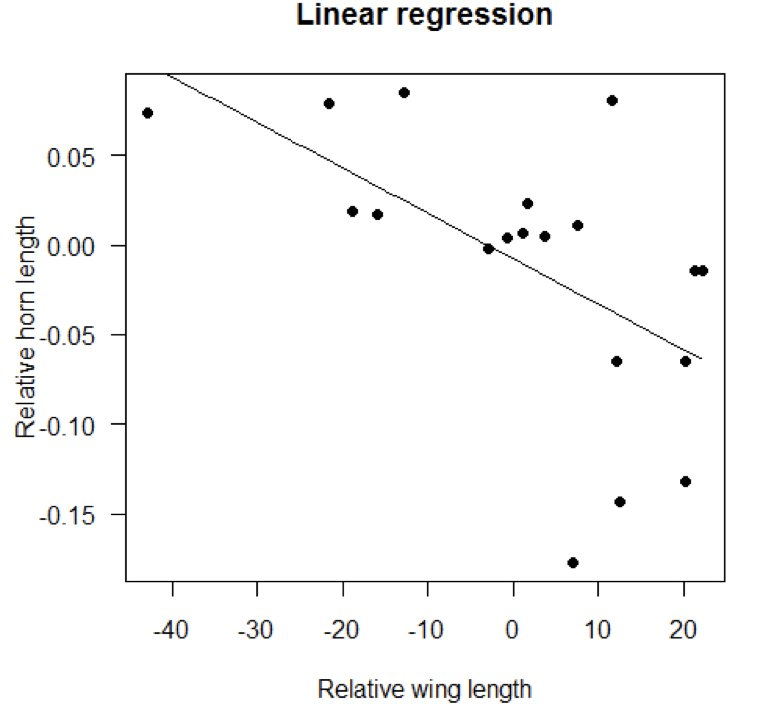{alt="Linear regression on beetle data" fig-align="center" width="90%"}

::: {.aside}
Source: Data from Emlen, D.J. (2001). *Science*, 291, 1534-1536.
:::

## DRAFT: Linear Fit

::: panel-tabset
### Output

```{r}
#| echo: false
#| eval: true
#| fig-width: 7
#| fig-height: 5

plot(beetle$wing, beetle$horn, pch = 16, cex = 1.3,
     xlab = "Wing length (mm)", ylab = "Horn length (mm)",
     main = "Linear: y = β₀ + β₁x", las = 1)
fit1 <- lm(horn ~ wing, data = beetle)
abline(fit1, lwd = 2, col = "red")
```

### Code

```{r}
#| echo: true
#| eval: false

plot(beetle$wing, beetle$horn, pch = 16, cex = 1.3,
     xlab = "Wing length (mm)", ylab = "Horn length (mm)",
     main = "Linear: y = β₀ + β₁x", las = 1)
fit1 <- lm(horn ~ wing, data = beetle)
abline(fit1, lwd = 2, col = "red")
```

### Interpretation

- A simple linear fit to the beetle horn data shows a positive trend but clearly misses the nonlinear pattern.
- The line underpredicts horn length for very large beetles and overpredicts for mid-sized beetles, suggesting a curved relationship.
- This motivates exploring polynomial regression to better capture the allometric growth pattern.
:::

## Quadratic Regression Fit

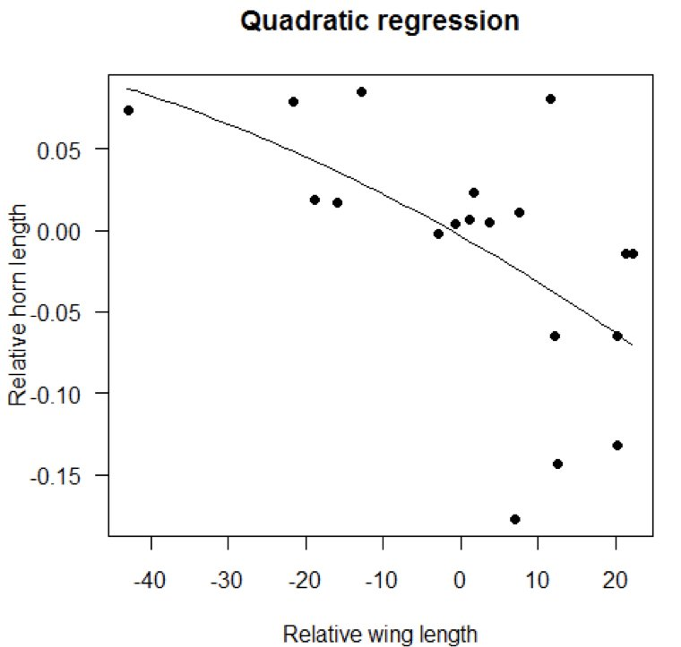{alt="Quadratic (polynomial degree 2) regression" fig-align="center" width="90%"}

::: {.aside}
Source: Data from Emlen, D.J. (2001). *Science*, 291, 1534-1536.
:::

## DRAFT: Quadratic Fit

::: panel-tabset
### Output

```{r}
#| echo: false
#| eval: true
#| fig-width: 7
#| fig-height: 5

plot(beetle$wing, beetle$horn, pch = 16, cex = 1.3,
     xlab = "Wing length (mm)", ylab = "Horn length (mm)",
     main = "Quadratic: y = β₀ + β₁x + β₂x²", las = 1)
fit2 <- lm(horn ~ poly(wing, 2, raw = TRUE), data = beetle)
xseq <- seq(min(beetle$wing), max(beetle$wing), length.out = 200)
lines(xseq, predict(fit2, newdata = data.frame(wing = xseq)),
      lwd = 2, col = "red")
```

### Code

```{r}
#| echo: true
#| eval: false

plot(beetle$wing, beetle$horn, pch = 16, cex = 1.3,
     xlab = "Wing length (mm)", ylab = "Horn length (mm)",
     main = "Quadratic: y = β₀ + β₁x + β₂x²", las = 1)
fit2 <- lm(horn ~ poly(wing, 2, raw = TRUE), data = beetle)
xseq <- seq(min(beetle$wing), max(beetle$wing), length.out = 200)
lines(xseq, predict(fit2, newdata = data.frame(wing = xseq)),
      lwd = 2, col = "red")
```

### Interpretation

- The quadratic fit captures the nonlinear relationship between wing length and horn length, showing an accelerating pattern.
- This is biologically plausible: horn growth may be disproportionately allocated in larger beetles (allometric scaling).
- The curve fits the data much better than the linear model, particularly at the extremes of wing length.
:::

## Cubic Regression Fit

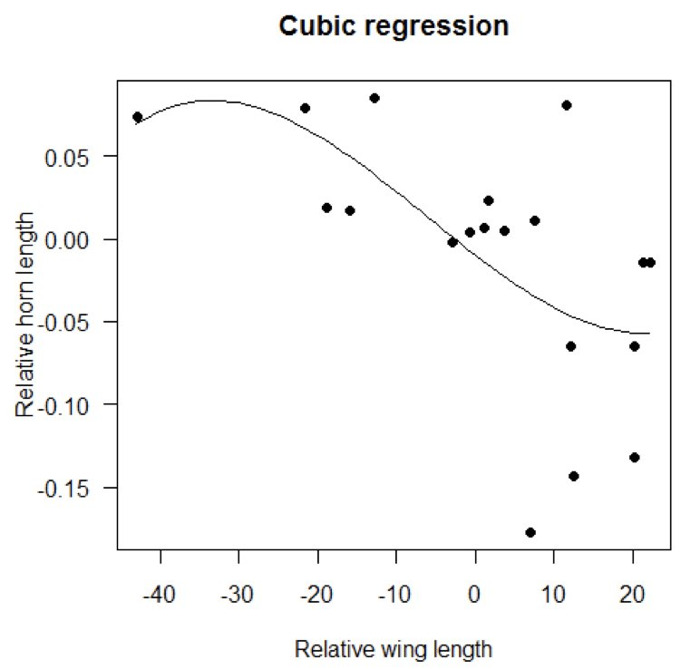{alt="Cubic (polynomial degree 3) regression" fig-align="center" width="90%"}

::: {.aside}
Source: Data from Emlen, D.J. (2001). *Science*, 291, 1534-1536.
:::

## DRAFT: Cubic Fit

::: panel-tabset
### Output

```{r}
#| echo: false
#| eval: true
#| fig-width: 7
#| fig-height: 5

plot(beetle$wing, beetle$horn, pch = 16, cex = 1.3,
     xlab = "Wing length (mm)", ylab = "Horn length (mm)",
     main = "Cubic: y = β₀ + β₁x + β₂x² + β₃x³", las = 1)
fit3 <- lm(horn ~ poly(wing, 3, raw = TRUE), data = beetle)
lines(xseq, predict(fit3, newdata = data.frame(wing = xseq)),
      lwd = 2, col = "red")
```

### Code

```{r}
#| echo: true
#| eval: false

plot(beetle$wing, beetle$horn, pch = 16, cex = 1.3,
     xlab = "Wing length (mm)", ylab = "Horn length (mm)",
     main = "Cubic: y = β₀ + β₁x + β₂x² + β₃x³", las = 1)
fit3 <- lm(horn ~ poly(wing, 3, raw = TRUE), data = beetle)
xseq <- seq(min(beetle$wing), max(beetle$wing), length.out = 200)
lines(xseq, predict(fit3, newdata = data.frame(wing = xseq)),
      lwd = 2, col = "red")
```

### Interpretation

- The cubic fit adds a third-order term ($x^3$), allowing the curve to have an inflection point (change in concavity).
- For the beetle horn data, this captures the sigmoidal-like pattern where horn growth accelerates above a threshold wing length.
- Compare this with the quadratic fit to determine whether the cubic term meaningfully improves the model.
:::

## Higher-Order Polynomials

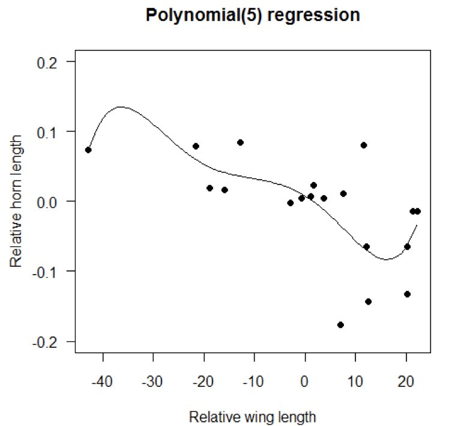{alt="Polynomial degree 5 regression" fig-align="center" width="90%"}

::: {.aside}
Source: Data from Emlen, D.J. (2001). *Science*, 291, 1534-1536.
:::

## DRAFT: Degree 5 Polynomial

::: panel-tabset
### Output

```{r}
#| echo: false
#| eval: true
#| fig-width: 7
#| fig-height: 5

plot(beetle$wing, beetle$horn, pch = 16, cex = 1.3,
     xlab = "Wing length (mm)", ylab = "Horn length (mm)",
     main = "Polynomial degree 5", las = 1)
fit5 <- lm(horn ~ poly(wing, 5, raw = TRUE), data = beetle)
lines(xseq, predict(fit5, newdata = data.frame(wing = xseq)),
      lwd = 2, col = "red")
```

### Code

```{r}
#| echo: true
#| eval: false

plot(beetle$wing, beetle$horn, pch = 16, cex = 1.3,
     xlab = "Wing length (mm)", ylab = "Horn length (mm)",
     main = "Polynomial degree 5", las = 1)
fit5 <- lm(horn ~ poly(wing, 5, raw = TRUE), data = beetle)
xseq <- seq(min(beetle$wing), max(beetle$wing), length.out = 200)
lines(xseq, predict(fit5, newdata = data.frame(wing = xseq)),
      lwd = 2, col = "red")
```

### Interpretation

- A degree-5 polynomial begins to show signs of overfitting, with the curve starting to follow individual data points rather than the overall trend.
- While this may fit the training data better than a quadratic, the additional flexibility risks capturing noise rather than biological signal.
- Compare the shape of this curve with the quadratic and cubic fits to judge whether the extra terms add meaningful improvement.
:::

##

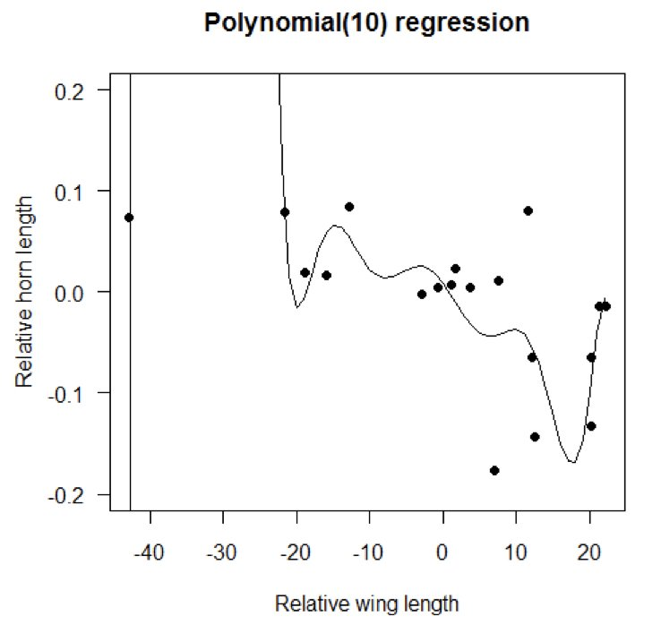{alt="Polynomial degree 10 regression - overfitting!" fig-align="center" width="90%"}

::: {.aside}
Source: Data from Emlen, D.J. (2001). *Science*, 291, 1534-1536.
:::

## DRAFT: Degree 10 Polynomial - Overfitting!

::: panel-tabset
### Output

```{r}
#| echo: false
#| eval: true
#| fig-width: 7
#| fig-height: 5

plot(beetle$wing, beetle$horn, pch = 16, cex = 1.3,
     xlab = "Wing length (mm)", ylab = "Horn length (mm)",
     main = "Polynomial degree 10 — OVERFITTING", las = 1)
fit10 <- lm(horn ~ poly(wing, 10, raw = TRUE), data = beetle)
lines(xseq, predict(fit10, newdata = data.frame(wing = xseq)),
      lwd = 2, col = "red")
```

### Code

```{r}
#| echo: true
#| eval: false

plot(beetle$wing, beetle$horn, pch = 16, cex = 1.3,
     xlab = "Wing length (mm)", ylab = "Horn length (mm)",
     main = "Polynomial degree 10 — OVERFITTING", las = 1)
fit10 <- lm(horn ~ poly(wing, 10, raw = TRUE), data = beetle)
xseq <- seq(min(beetle$wing), max(beetle$wing), length.out = 200)
lines(xseq, predict(fit10, newdata = data.frame(wing = xseq)),
      lwd = 2, col = "red")
```

### Interpretation

- A degree-10 polynomial produces wild oscillations at the edges of the data -- a classic example of **overfitting**.
- While the $R^2$ is very high, the model is fitting noise rather than the true biological relationship.
- This model would perform terribly on new data; it has memorized the training data rather than learning the underlying pattern.
- This illustrates why model selection criteria that penalize complexity (AIC, BIC, $C_p$) are essential.
:::

## Model Selection Visualization

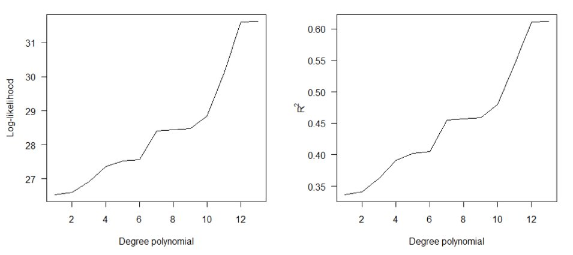{alt="Log-likelihood and R² vs polynomial degree" fig-align="center" width="90%"}

::: {.aside}
Source: Data from Emlen, D.J. (2001). *Science*, 291, 1534-1536.
:::

## DRAFT: Model Selection - Log-Likelihood and R²

::: panel-tabset
### Output

```{r}
#| echo: false
#| eval: true
#| fig-width: 10
#| fig-height: 5

degrees <- 1:10
loglik <- sapply(degrees, function(d) {
  fit <- lm(horn ~ poly(wing, d, raw = TRUE), data = beetle)
  logLik(fit)
})
r2 <- sapply(degrees, function(d) {
  fit <- lm(horn ~ poly(wing, d, raw = TRUE), data = beetle)
  summary(fit)$r.squared
})

par(mfrow = c(1, 2), mar = c(5, 4, 3, 1))
plot(degrees, loglik, type = "b", pch = 16, cex = 1.5,
     xlab = "Polynomial degree", ylab = "Log-likelihood",
     main = "Log-likelihood vs. Degree", las = 1)
plot(degrees, r2, type = "b", pch = 16, cex = 1.5,
     xlab = "Polynomial degree", ylab = expression(R^2),
     main = expression(R^2 * " vs. Degree"), las = 1)
```

### Code

```{r}
#| echo: true
#| eval: false

degrees <- 1:10
loglik <- sapply(degrees, function(d) {
  fit <- lm(horn ~ poly(wing, d, raw = TRUE), data = beetle)
  logLik(fit)
})
r2 <- sapply(degrees, function(d) {
  fit <- lm(horn ~ poly(wing, d, raw = TRUE), data = beetle)
  summary(fit)$r.squared
})

par(mfrow = c(1, 2), mar = c(5, 4, 3, 1))
plot(degrees, loglik, type = "b", pch = 16, cex = 1.5,
     xlab = "Polynomial degree", ylab = "Log-likelihood",
     main = "Log-likelihood vs. Degree", las = 1)
plot(degrees, r2, type = "b", pch = 16, cex = 1.5,
     xlab = "Polynomial degree", ylab = expression(R^2),
     main = expression(R^2 * " vs. Degree"), las = 1)
```

### Interpretation

- Both log-likelihood and $R^2$ increase with polynomial degree, but the gains diminish after degree 2-3.
- The flattening of the curves indicates that additional polynomial terms add complexity without meaningfully improving fit -- a sign of overfitting.
- Model selection criteria like AIC, BIC, or Mallow's $C_p$ penalize complexity to identify the point where adding more terms is no longer justified.
:::

## Mallow's Cp Statistic {.smaller}

$$C_p = \frac{SS_{\text{error}}}{\hat{\sigma}^2} - n + 2p$$

- $SS_{\text{error}}$: error sum of squares for the model with $p$ predictors (incl. intercept)
- $\hat{\sigma}^2$: error mean square of full model (e.g., all predictors)
- $n$: sample size
- $p$: number of predictors (including intercept)

$C_p$ estimates mean square prediction error. (Related to AIC.)

$2p$: sort of a penalty for including too many predictors. A feature shared with all other model selection criteria.

A model with $C_p \approx p$ fits well without overfitting. Models with $C_p \gg p$ underfit; those with minimum $C_p$ are preferred.

<!--
DUPLICATE SLIDES - Original image versions (remove when LaTeX is finalized)

## Mallow's Cp Statistic (JPEG Original)

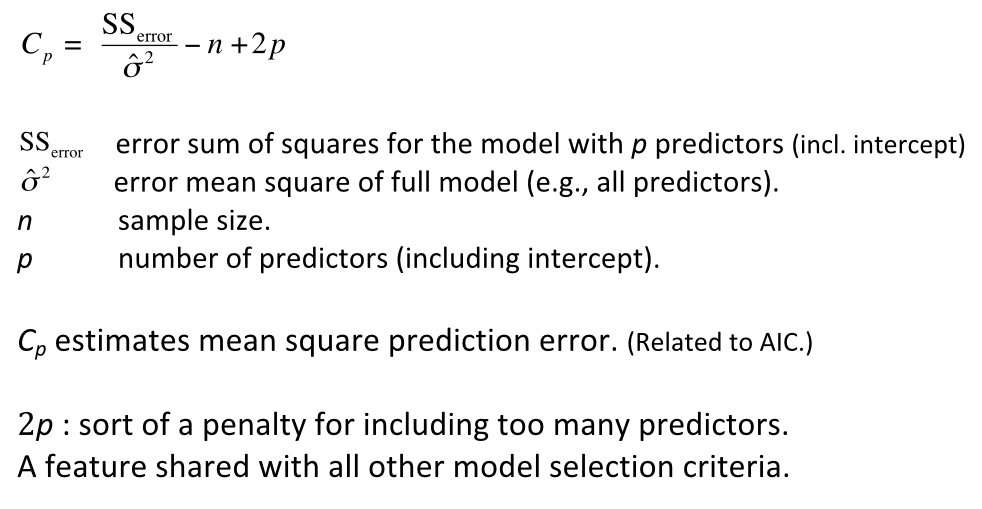{fig-align="center" width="90%"}

## Mallow's Cp Statistic (SVG)

{fig-align="center" width="90%"}
-->

::: callout-tip
## Summary

1.  **Always plot residuals** after fitting a model. The summary statistics ($R^2$, p-values) alone are not sufficient.

2.  A poor residual pattern does not mean your data are bad — it means **your model needs improvement**. Consider transformations, polynomial terms, or different model families.

3.  The BMP2 cream model shows a clear linear relationship with well-behaved residuals.

4.  The exercise model shows that forcing a linear fit on a potentially nonlinear relationship produces misleading residuals. Adding a quadratic term can resolve this.

5.  **Model selection is iterative**: fit, diagnose, improve, repeat.
:::

------------------------------------------------------------------------

# Model I vs Model II Regression {background-color="#2c3e50"}

## When to Use Model II Regression

**Model I (OLS) Regression:**

-   Assumes predictor X is measured **without error**
-   Y contains all the measurement error
-   Standard `lm()` in R

**Model II Regression:**

-   Both X and Y have **measurement error**
-   Neither variable is controlled/fixed
-   Use when both variables are random measurements

::: callout-note
Use Model II when both X and Y are biological measurements (e.g., body size vs organ size, two gene expression levels).
:::

## Model II Regression Methods

| Method | Abbreviation | Description |
|:-----------------------|:-----------------------|:-----------------------|
| **Major Axis** | MA | Minimizes perpendicular distances |
| **Standard Major Axis** | SMA | Geometric mean regression |
| **Ranged Major Axis** | RMA | Accounts for range differences |
| **Ordinary Least Squares** | OLS | Standard regression (for comparison) |

## Types of Linear Regression

Not all regression is created equal! The choice depends on **measurement error**:

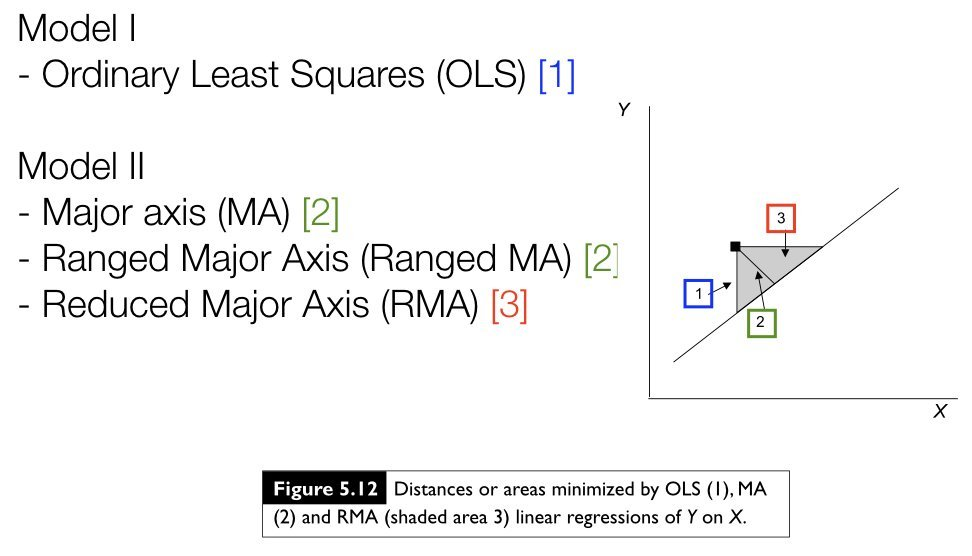{fig-align="center" width="80%"}

::: {.aside}
Source: Figure 5.12, Logan, M. (2010). *Biostatistical Design and Analysis Using R.* Wiley-Blackwell.
:::

## Types of Linear Regression (SVG)

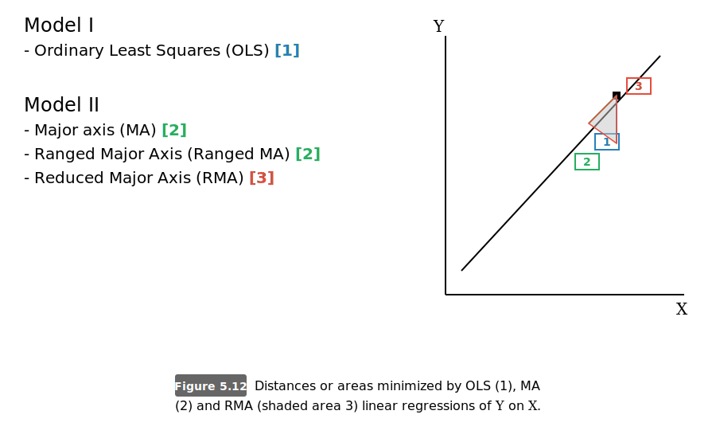{fig-align="center" width="80%"}

## DRAFT: Model I vs Model II Regression

::: panel-tabset
### Output

```{r}
#| echo: false
#| eval: true
#| fig-width: 6
#| fig-height: 6

set.seed(42)
x <- rnorm(2, c(3, 8), c(0.5, 0.5))
y <- rnorm(2, c(3, 8), c(0.5, 0.5))

plot(x, y, pch = 15, cex = 2, xlim = c(0, 10), ylim = c(0, 10),
     xlab = "X", ylab = "Y", las = 1, main = "")
# OLS: vertical distance [1]
abline(a = 0.5, b = 0.9, lwd = 2)
segments(x[2], y[2], x[2], 0.5 + 0.9 * x[2], lwd = 2, lty = 1)
text(x[2] - 0.5, (y[2] + 0.5 + 0.9 * x[2]) / 2, "1", cex = 1.5, col = "blue")

# MA: perpendicular distance [2]
text(x[2] + 1, y[2] + 0.5, "3", cex = 1.5, col = "darkgreen")

# RMA: area [3]
text(x[2] + 0.3, y[2] - 1.5, "2", cex = 1.5, col = "red")
```

### Code

```{r}
#| echo: true
#| eval: false
#| fig-width: 6
#| fig-height: 6

set.seed(42)
x <- rnorm(2, c(3, 8), c(0.5, 0.5))
y <- rnorm(2, c(3, 8), c(0.5, 0.5))

plot(x, y, pch = 15, cex = 2, xlim = c(0, 10), ylim = c(0, 10),
     xlab = "X", ylab = "Y", las = 1, main = "")
abline(a = 0.5, b = 0.9, lwd = 2)
segments(x[2], y[2], x[2], 0.5 + 0.9 * x[2], lwd = 2, lty = 1)
text(x[2] - 0.5, (y[2] + 0.5 + 0.9 * x[2]) / 2, "1", cex = 1.5, col = "blue")
text(x[2] + 1, y[2] + 0.5, "3", cex = 1.5, col = "darkgreen")
text(x[2] + 0.3, y[2] - 1.5, "2", cex = 1.5, col = "red")
```

### Interpretation

- **[1] OLS (Model I)** minimizes vertical distances from points to the line -- assumes all error is in Y.
- **[2] RMA (Model II)** minimizes the area of triangles formed between each point and the line -- accounts for error in both variables using the ratio of standard deviations.
- **[3] MA (Model II)** minimizes perpendicular distances from points to the line -- assumes equal error variance in both X and Y.
- The key distinction: Model I assumes X is fixed/known; Model II acknowledges that both variables are measured with error.
:::

**Model I** — Ordinary Least Squares (OLS) [1]: minimizes vertical distances

**Model II** — Major axis (MA) [2]: minimizes perpendicular distances; Reduced Major Axis (RMA) [3]: minimizes area of triangles

## Regression Type Examples

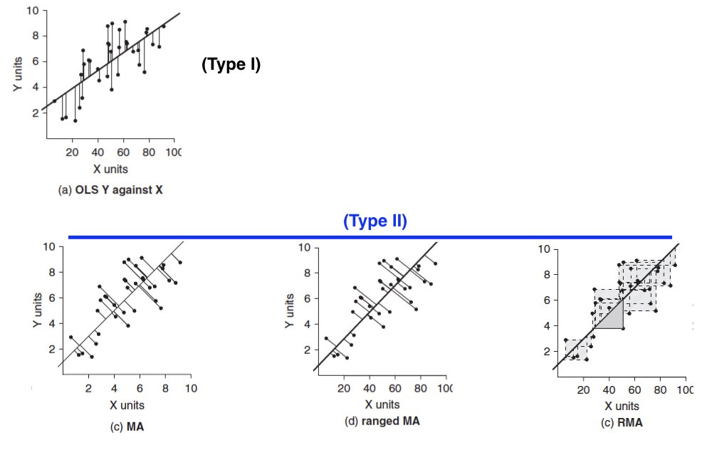{fig-align="center" width="90%"}

::: {.aside}
Source: Logan, M. (2010). *Biostatistical Design and Analysis Using R.* Wiley-Blackwell.
:::

## DRAFT: OLS, MA, and RMA Comparison

::: panel-tabset
### Output

```{r}
#| echo: false
#| eval: true
#| fig-width: 10
#| fig-height: 4

set.seed(42)
n <- 20
x <- runif(n, 10, 90)
y <- 0.1 * x + rnorm(n, 0, 1)

par(mfrow = c(1, 4), mar = c(4, 4, 3, 1))

# (a) OLS Y on X
plot(x, y, pch = 16, cex = 1.2, xlab = "X units", ylab = "Y units",
     main = "(a) OLS Y against X", cex.main = 0.9, las = 1, xlim = c(0, 100), ylim = c(-2, 12))
fit_ols <- lm(y ~ x)
abline(fit_ols, lwd = 2)
segments(x, fitted(fit_ols), x, y, lwd = 0.5)

# (b) MA
plot(x, y, pch = 16, cex = 1.2, xlab = "X units", ylab = "Y units",
     main = "(b) MA", cex.main = 0.9, las = 1, xlim = c(0, 100), ylim = c(-2, 12))
# MA: perpendicular projection
sx <- sd(x); sy <- sd(y)
slope_ma <- (sy^2 - sx^2 + sqrt((sy^2 - sx^2)^2 + 4 * cov(x,y)^2)) / (2 * cov(x,y))
int_ma <- mean(y) - slope_ma * mean(x)
abline(a = int_ma, b = slope_ma, lwd = 2)

# (c) Ranged MA
plot(x, y, pch = 16, cex = 1.2, xlab = "X units", ylab = "Y units",
     main = "(c) Ranged MA", cex.main = 0.9, las = 1, xlim = c(0, 100), ylim = c(-2, 12))
abline(a = int_ma, b = slope_ma, lwd = 2)

# (d) RMA
plot(x, y, pch = 16, cex = 1.2, xlab = "X units", ylab = "Y units",
     main = "(d) RMA", cex.main = 0.9, las = 1, xlim = c(0, 100), ylim = c(-2, 12))
slope_rma <- sign(cor(x, y)) * sy / sx
int_rma <- mean(y) - slope_rma * mean(x)
abline(a = int_rma, b = slope_rma, lwd = 2)
```

### Code

```{r}
#| echo: true
#| eval: false
#| fig-width: 10
#| fig-height: 4

set.seed(42)
n <- 20
x <- runif(n, 10, 90)
y <- 0.1 * x + rnorm(n, 0, 1)

par(mfrow = c(1, 4), mar = c(4, 4, 3, 1))

# (a) OLS Y on X
plot(x, y, pch = 16, cex = 1.2, xlab = "X units", ylab = "Y units",
     main = "(a) OLS Y against X", cex.main = 0.9, las = 1, xlim = c(0, 100), ylim = c(-2, 12))
fit_ols <- lm(y ~ x)
abline(fit_ols, lwd = 2)
segments(x, fitted(fit_ols), x, y, lwd = 0.5)

# (b) MA
plot(x, y, pch = 16, cex = 1.2, xlab = "X units", ylab = "Y units",
     main = "(b) MA", cex.main = 0.9, las = 1, xlim = c(0, 100), ylim = c(-2, 12))
sx <- sd(x); sy <- sd(y)
slope_ma <- (sy^2 - sx^2 + sqrt((sy^2 - sx^2)^2 + 4 * cov(x,y)^2)) / (2 * cov(x,y))
int_ma <- mean(y) - slope_ma * mean(x)
abline(a = int_ma, b = slope_ma, lwd = 2)

# (c) Ranged MA
plot(x, y, pch = 16, cex = 1.2, xlab = "X units", ylab = "Y units",
     main = "(c) Ranged MA", cex.main = 0.9, las = 1, xlim = c(0, 100), ylim = c(-2, 12))
abline(a = int_ma, b = slope_ma, lwd = 2)

# (d) RMA
plot(x, y, pch = 16, cex = 1.2, xlab = "X units", ylab = "Y units",
     main = "(d) RMA", cex.main = 0.9, las = 1, xlim = c(0, 100), ylim = c(-2, 12))
slope_rma <- sign(cor(x, y)) * sy / sx
int_rma <- mean(y) - slope_rma * mean(x)
abline(a = int_rma, b = slope_rma, lwd = 2)
```

### Interpretation

- **(a) OLS** minimizes vertical distances from points to the line -- appropriate when X is measured without error.
- **(b) Major Axis** minimizes perpendicular distances -- appropriate when both variables have equal error and are in the same units.
- **(c) Ranged MA** adjusts for different variable ranges -- useful when X and Y have different units or scales.
- **(d) RMA (SMA)** uses the ratio of standard deviations as the slope -- the most commonly used Model II method in biology for allometric relationships.
- Notice how the slopes differ across methods; OLS typically has a shallower slope than Model II methods when both variables have error.
:::

## When to Use Each Model Type

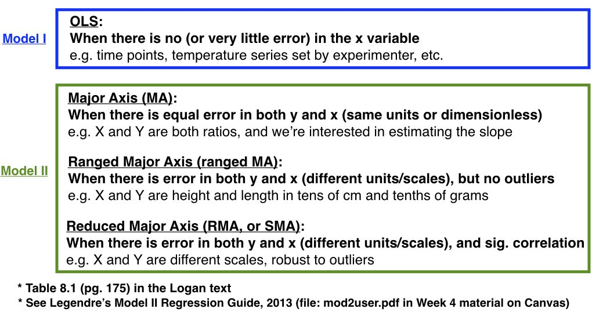{fig-align="center" width="90%"}

::: {.aside}
Source: Table 8.1, Logan, M. (2010). *Biostatistical Design and Analysis Using R.* Wiley-Blackwell; Legendre, P. (2013). Model II Regression Guide.
:::

## When to Use Each Model Type (SVG)

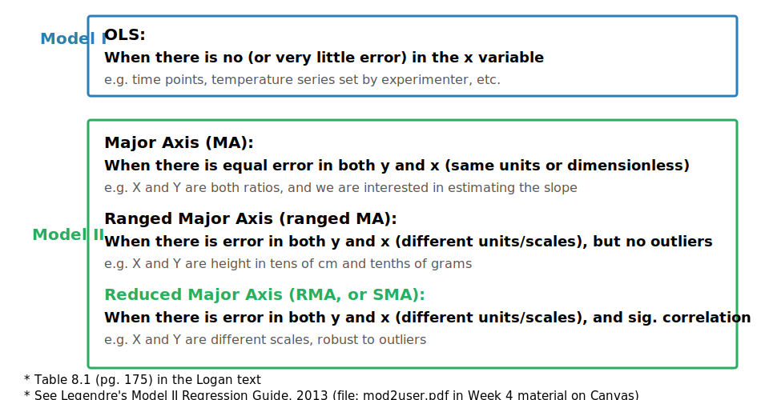{fig-align="center" width="90%"}

## DRAFT: When to Use Each Regression Type

| | **Method** | **When to use** | **Example** |
|:---|:---|:---|:---|
| **Model I** | **OLS** | No (or very little) error in x variable | Time points, temperature set by experimenter |
| **Model II** | **Major Axis (MA)** | Equal error in both y and x (same units or dimensionless) | X and Y are both ratios; interested in estimating slope |
| | **Ranged MA** | Error in both y and x (different units/scales), no outliers | Height in cm and length in tenths of grams |
| | **Reduced MA (RMA, SMA)** | Error in both y and x (different scales), significant correlation | X and Y are different scales, robust to outliers |

*Table 8.1 (pg. 175) in the Logan text. See also Legendre's Model II Regression Guide, 2013.*

## Model II Regression with lmodel2

::: panel-tabset
### Code

```{r}
#| eval: false
#| echo: true

library(lmodel2)

# Model II regression when both X and Y have measurement error
# Example: comparing two measurement methods
mod2 <- lmodel2(Y ~ X, data = mydata, range.y = "relative", range.x = "relative")

# Returns OLS, MA, SMA (RMA), and ranged major axis results
summary(mod2)
plot(mod2)
```

### Interpretation

- The `lmodel2()` function fits four regression methods simultaneously: OLS, Major Axis, Standard Major Axis (SMA/RMA), and Ranged Major Axis.
- Setting `range.y = "relative"` and `range.x = "relative"` tells the function to standardize variables by their ranges, which is appropriate when X and Y have different units or scales.
- The `plot()` method visualizes all regression lines together, making it easy to see how much the slope estimates differ across methods.
:::

::: callout-note
Use Model II regression when: - Both variables have measurement error - Neither variable is experimentally controlled - You're comparing methods or studying allometry
:::

## Model II Regression in R

::: panel-tabset
### Code

```{r}
#| label: model2-regression
#| eval: false
#| echo: true

# Install and load lmodel2 package
# install.packages("lmodel2")
library(lmodel2)

# Fit Model II regression
model2_result <- lmodel2(y ~ x, data = mydata)

# View results - provides OLS, MA, and SMA estimates
model2_result

# Plot with different regression lines
plot(mydata$x, mydata$y, pch = 19)
abline(model2_result$regression.results[2, 2],  # MA intercept
       model2_result$regression.results[2, 3],  # MA slope
       col = "blue", lty = 2)
abline(model2_result$regression.results[3, 2],  # SMA intercept
       model2_result$regression.results[3, 3],  # SMA slope
       col = "red", lty = 3)
```

### Interpretation

- This code fits a Model II regression using `lmodel2()`, which simultaneously estimates OLS, MA, and SMA regression lines.
- The plot overlays the Major Axis (blue dashed) and Standard Major Axis (red dotted) regression lines on the scatterplot, allowing visual comparison of the different methods.
- SMA (Reduced Major Axis) is the most commonly used Model II method in biology; MA is preferred when both variables are in the same units.
:::

## Choosing Between Model I and II

::: callout-tip
## Decision Guide

Use **Model I (OLS)** when:

-   X is controlled/manipulated experimentally
-   X is measured with negligible error
-   Goal is prediction of Y from X

Use **Model II (SMA/MA)** when:

-   Both variables are random biological measurements
-   Both have comparable measurement error
-   Goal is to describe the functional relationship
:::
