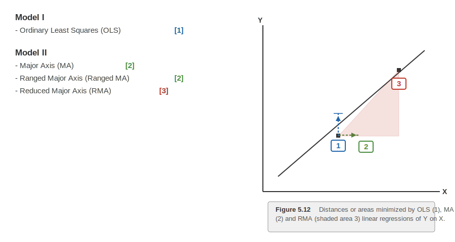
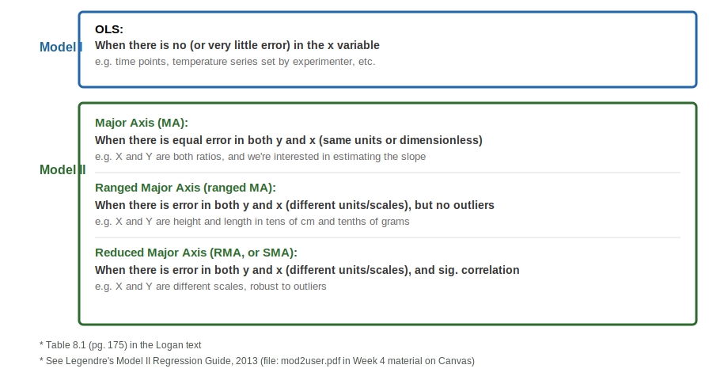
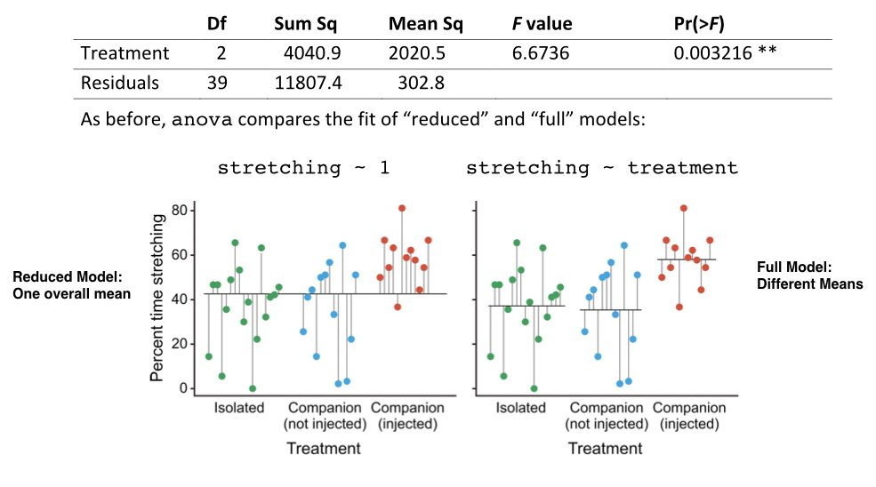
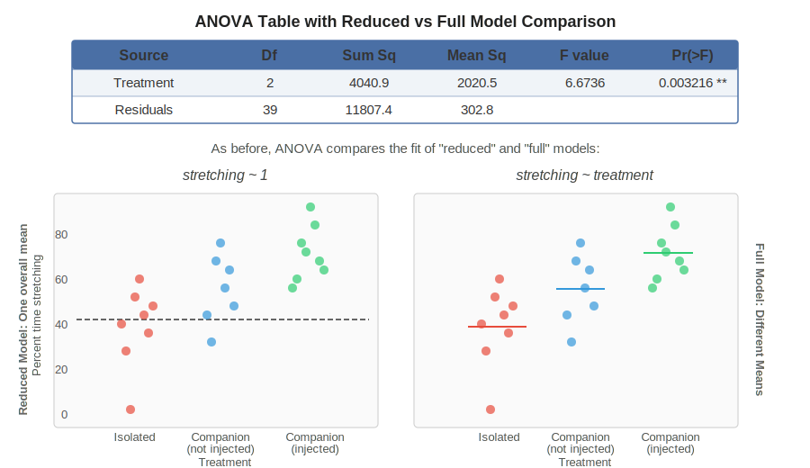

```{r}
#| label: setup
#| include: false

# Core data manipulation and visualization
library(tidyverse)
library(knitr)
library(readxl)

# Statistical analysis packages
library(MASS)        # LDA, robust regression
library(pwr)         # Power analysis
library(boot)        # Bootstrap methods
library(car)         # Companion to Applied Regression
library(survival)    # Survival analysis
library(nlme)        # Mixed effects models
library(broom)       # Tidy model output
library(emmeans)     # Estimated marginal means
library(lmodel2)     # Model II regression
library(patchwork)   # Combine multiple plots
library(ggfortify)   # Diagnostic plots for lm objects

# Set consistent theme for all plots
theme_set(theme_minimal(base_size = 14))

# Set seed for reproducibility
set.seed(2026)
```

# Finish Linear Models and Analysis of Variance (ANOVA) {background-color="#2c3e50"}

## Week 6 Topics

::: incremental
-   Eugenics history of statistical analysis
-   Polynomial Regression
-   Type 1 and Type 2 Regression
-   Analysis of Variance (ANOVA)
-   Single factor ANOVA
-   Planned & post hoc comparisons
-   Analysis of Covariance (ANCOVA)
:::

**Readings:** Chapters 25-27

## Packages for This Week

::: panel-tabset
### Install

```{r}
#| eval: false
#| echo: true

# Install new packages (run once)
install.packages("car")
install.packages("lmodel2")
install.packages("patchwork")
install.packages("ggfortify")
```

### Load

```{r}
#| eval: false
#| echo: true

# Load packages
library(tidyverse)    # Data manipulation & visualization
library(knitr)        # Formatted tables with kable()
library(broom)        # Tidy model output (tidy, glance)
library(car)          # Companion to Applied Regression (Type II/III SS, Levene's test)
library(pwr)          # Power analysis (from Week 4)
library(emmeans)      # Estimated marginal means & pairwise comparisons
library(lmodel2)      # Model II regression
library(patchwork)    # Combine multiple plots side by side
library(ggfortify)    # Diagnostic plots for lm objects (autoplot)
```

### Interpretation

This week introduces several new packages: `car` provides Levene's test for homogeneity of variance and Type II/III sums of squares; `lmodel2` fits Model II regression methods (MA, SMA, RMA) for when both variables have measurement error; `patchwork` arranges multiple ggplot objects side by side for comparison; and `ggfortify` provides `autoplot()` for quick diagnostic plots from `lm` objects. Install packages once, then load them each session.
:::

**Built-in datasets used this week:**

-   `iris` (Iris plant data),
-   `PlantGrowth` (plant weight by treatment)

**Other datasets used this week:**

-   `grip_strength_data.csv`
-   `cell_culture_expression.csv`

## Term Project

Pull together all of the activities that you performed on your own data that you've chosen to analyze and put it into one complete Markdown document that can be rendered.

In addition to packaging these previous analyses together, you can also perform any additional visualizations and analyses that make sense. Lastly, add some interpretive writing that explains the nature of your data, the types of analyses you performed at each step, your outcomes or findings from each, and the conclusions that you might draw from each finding.

The overall goal is to create something like a report to share with a collaborator or your PI, or should your work be far enough along the skeleton of a manuscript that can submitted for subsequent publication.

# The Eugenics History of Statistics {background-color="#2c3e50"}

## Galton's parent-offspring regression

-   Last week we discussed how Galton developed the concept of regression to the mean using height data from parents and their children.
-   This week we need to confront the darker side of that history — the statistical methods we use daily were developed in the service of eugenics.

{fig-align="center" width="100%"}

::: {.aside}
Source: Galton, F. (1889) *Natural Inheritance*; class data from Genetics course, 1999
:::

## Galton as the Father of Eugenics

{fig-align="center"}

::: {.aside}
Source: Photograph of Francis Galton, c. 1890s (public domain)
:::

-   Francis Galton: Darwin's half cousin
-   Studied human variation and genetic inheritance
    -   Human height, fingerprints, intelligence
    -   Correlation, regression toward the mean, and "nature versus nurture"
    -   Pioneered twin studies

## Galton as the Father of Eugenics

-   Believed that intelligence was hereditary based on surveying prominent academics in Europe
-   Used the ideas of **correlation** and **regression towards the mean** to argue that the upper class should breed amongst themselves to keep those "good genes" pure
-   Wanted to provide monetary incentives for "good" couples to marry and reproduce as a way to avoid the upper class being genetically 'muddied' by the lower classes

## RA Fisher and Eugenics in London

-   Developer of Fishers exact test, analysis of variance (ANOVA), null hypothesis, p values, maximum likelihood, probability density functions
-   Founding Chairman of the University of Cambridge Eugenics Society

{fig-align="center" width="20%"}

::: {.aside}
Source: Photograph of R.A. Fisher, c. 1910s (public domain)
:::

## RA Fisher and Eugenics

-   1/3rd of his work "The Genetical Theory of Natural Selection" discussed eugenics and his theory that the fall of civilizations was due to the fertility of their upper classes being diminished
-   Used these statistical methods to test data on human variation to prove biological differences between human races
-   Eugenics and racism were the primary motivators for many of these statistical tests that we use today

## Eugenics in the U.S.

{fig-align="center" width="50%"}

::: {.aside}
Source: Historical photographs of Francis Galton, Charles Davenport, G. Stanley Hall, and colleagues (public domain)
:::

-   Galton's ideas were brought to the United States by Charles Davenport, a biologist who established the Eugenics Record Office at Cold Spring Harbor in 1910.
-   G. Stanley Hall, a prominent psychologist who promoted the "child study" movement and was the first president of Clark University.

## 

{fig-align="center" width="80%"}

::: {.aside}
Source: Eugenics tree logo, Second International Congress of Eugenics, 1921 (public domain)
:::

## Eugenics societies in the U.S.

-   Advocated for state laws to ban interracial marriages and promote sterilization of "unfit" individuals (negative eugenics) - especially black, Latinx, and Native American women
-   30 states passed laws to force mental institution patients to be sterilized
-   Between 1907 and 1963, over 64,000 individuals were forcibly sterilized under eugenic legislation in the United States

## A common sight at state fairs around the U.S. in the 1930s

-   Competitions for the "perfect family" to encourage public consciousness and support for eugenics

{fig-align="center" width="50%"}

::: {.aside}
Source: "Fittest Family" contest at a state fair, c. 1920s, American Philosophical Society (public domain)
:::

## A direct line to Hitler and Nazism

-   Eugenics existed in America (and England) before it became popular in Germany.
-   By 1933, California had subjected more people to forceful sterilization than all other U.S. states combined.
-   The forced sterilization program engineered by the Nazis was partly inspired by California's.

{fig-align="center" width="70%"}

::: {.aside}
Source: Historical photographs of Galton, Davenport, Hall, and Hitler (public domain)
:::

## Sterilizations continued in America

-   It wasn't until 1978 that the US passed regulations on sterilization procedures
-   California only passed a bill to outlaw sterilization of inmates in 2014
-   Certain members of the genetic engineering community threaten to bring back eugenics ideas
-   Our current President repeats eugenics talking points

## So, what do we do from here?

-   The statistical methods that Galton, Fisher, and others developed are useful science tools
-   Important to use these tools for good - improving our planet, human health, and technological advances
-   Important to acknowledge and not forget the history of science - educate others to avoid repeating history

## Interested in learning more?

{fig-align="center" width="20%"}

::: {.aside}
Source: *She Has Her Mother's Laugh* by Carl Zimmer, Dutton/Penguin, 2018. Cover art copyright Penguin Random House.
:::

-   See also
    -   "The Gene" by Siddhartha Mukherjee
    -   "Control" by Adam Rutherford

------------------------------------------------------------------------

# Polynomial Regression {background-color="#2c3e50"}

## Motivation for Polynomial Regression

-   We now return to the grip strength dataset from last week.

-   When we fit a simple linear regression of grip strength on exercise hours, the residual plots suggested curvature — the loess smoother deviated from zero in a systematic way.

-   This is a signal that the true relationship between exercise hours and grip strength may be **nonlinear**.

-   A polynomial regression extends the linear model by adding powers of $x$ as additional predictors. For a quadratic (degree 2) polynomial:

::: panel-tabset
### Equation

$$y_i = \beta_0 + \beta_1 x_i + \beta_2 x_i^2 + \epsilon_i$$

### LaTeX

``` text
y_i = \beta_0 + \beta_1 x_i + \beta_2 x_i^2 + \epsilon_i
```

### Interpretation

This quadratic polynomial regression extends the simple linear model by adding an $x^2$ term. The coefficient $\beta_2$ controls the curvature: if $\beta_2 > 0$ the curve is U-shaped, and if $\beta_2 < 0$ it is inverted-U (a peak). Despite having a squared term, this remains a "linear model" because the parameters ($\beta_0, \beta_1, \beta_2$) enter the equation linearly. The trade-off with polynomial regression is that higher-degree polynomials fit training data better but risk overfitting -- always test whether the added complexity is statistically justified.
:::

-   This is still a **linear model** in the statistical sense (the parameters $\beta$ enter linearly), but the relationship between $y$ and $x$ is now curved.

-   A quadratic term can capture a U-shape or inverted-U pattern that a straight line would miss.

## Import the Data and Fit Linear Model

::: panel-tabset
### Output

```{r}
#| label: grip-import-code
#| echo: false
#| eval: true

library(tidyverse)
library(broom)
library(knitr)

grip <- read_csv("data/grip_strength_data.csv")

# Fit linear model for later comparison
lm_exercise <- lm(grip_strength_kg ~ exercise_hrs_week, data = grip)

```

### Code

```{r}
#| label: grip-import-code-show
#| echo: true
#| eval: false

library(tidyverse)
library(broom)
library(knitr)

grip <- read_csv("data/grip_strength_data.csv")

# Fit linear model for later comparison
lm_exercise <- lm(grip_strength_kg ~ exercise_hrs_week, data = grip)

```

### Interpretation

We import the grip strength dataset and fit the simple linear model from last week. This linear fit serves as our baseline for comparison with the polynomial model. If the residual plots from this linear model showed curvature (which they did in Week 5), it motivates fitting a polynomial to capture the nonlinear relationship.
:::

## In R, we use `poly(x, degree)` inside the `lm()` formula:

::: panel-tabset
### Output

```{r}
#| label: poly-exercise-output
#| echo: false
#| eval: true

lm_exercise_poly <- lm(grip_strength_kg ~ poly(exercise_hrs_week, 2, raw = TRUE), data = grip)
summary(lm_exercise_poly)
```

### Code

```{r}
#| label: poly-exercise-code
#| echo: true
#| eval: false

# Fit linear model for comparison
lm_exercise <- lm(grip_strength_kg ~ exercise_hrs_week, data = grip)

# Fit quadratic polynomial: grip_strength ~ exercise + exercise^2
lm_exercise_poly <- lm(grip_strength_kg ~ poly(exercise_hrs_week, 2, raw = TRUE), 
                        data = grip)
summary(lm_exercise_poly)
```

The `raw = TRUE` argument means R uses the raw polynomial terms ($x$ and $x^2$) rather than orthogonal polynomials, making the coefficients directly interpretable.

### Interpretation

The `poly()` function inside `lm()` adds polynomial terms to the model formula. With `degree = 2`, R fits a quadratic curve: $y = \beta_0 + \beta_1 x + \beta_2 x^2$. Using `raw = TRUE` produces coefficients that correspond directly to powers of $x$, making them easier to interpret. The `summary()` output shows whether each term (intercept, linear, quadratic) is significant. Note that this is still a **linear model** in the statistical sense because the parameters ($\beta$ values) enter linearly -- only the relationship between $y$ and $x$ is curved.
:::

## Interpreting the Polynomial Model

-   The `tidy()` output shows three coefficients: the intercept ($\beta_0$), the linear term ($\beta_1$), and the quadratic term ($\beta_2$).

-   If the p-value for the quadratic term is significant, it confirms that the curved relationship is real and not just noise.

::: panel-tabset
### Output

```{r}
#| label: poly-exercise-tidy-output
#| echo: false
#| eval: true

tidy(lm_exercise_poly) |> kable(digits = 4)
```

```{r}
#| label: poly-exercise-glance-output
#| echo: false
#| eval: true

glance(lm_exercise_poly) |> kable(digits = 4)
```

### Code

```{r}
#| label: poly-exercise-tidy-code
#| echo: true
#| eval: false

tidy(lm_exercise_poly) |> kable(digits = 4)
glance(lm_exercise_poly) |> kable(digits = 4)
```

### Interpretation

The `tidy()` output shows three coefficients: the intercept ($\beta_0$), the linear term ($\beta_1$), and the quadratic term ($\beta_2$). If the p-value for the quadratic term ($\beta_2$) is significant, it confirms that the curvature is real. The `glance()` output provides the overall $R^2$ -- compare this to the linear model's $R^2$ to see whether adding the quadratic term meaningfully improves the fit. A large increase in $R^2$ combined with a significant quadratic coefficient supports using the polynomial model.
:::

\
\

-   The `glance()` output gives us the overall model fit. Compare this $R^2$ with the linear model — does adding the quadratic term meaningfully improve the fit?

## Comparing Linear vs. Polynomial Fit

-   We can formally compare the linear and polynomial models using `anova()`, which performs an **F-test** of nested models.

-   Because the linear model is a special case of the polynomial model (with $\beta_2 = 0$), we can test whether the additional quadratic term significantly improves the fit.

::: panel-tabset
### Output

```{r}
#| label: anova-compare-output
#| echo: false
#| eval: true

anova(lm_exercise, lm_exercise_poly)
```

### Code

```{r}
#| label: anova-compare-code
#| echo: true
#| eval: false

# Compare nested models: linear vs. quadratic
anova(lm_exercise, lm_exercise_poly)
```

### Interpretation

The `anova()` function performs an F-test comparing the linear (reduced) model to the quadratic (full) model. A significant p-value means the quadratic term explains a statistically significant amount of additional variance beyond the linear term alone. This is a formal test of whether the extra complexity of the polynomial is justified. If p > 0.05, the simpler linear model is preferred (parsimony). Note the trade-off: higher-degree polynomials always fit the training data better, but risk overfitting.
:::

-   A significant p-value here means the quadratic term explains a statistically significant amount of additional variance beyond the linear term alone.

-   This is conceptually similar to the model comparison approach we will use in ANOVA later today.

## Visualizing the Polynomial Fit

::: panel-tabset
### Output

```{r}
#| label: ggplot-poly-output
#| echo: false
#| eval: true
#| fig-width: 8
#| fig-height: 5

ggplot(grip, aes(x = exercise_hrs_week, y = grip_strength_kg)) +
  geom_point(color = "darkorange", alpha = 0.6, size = 2) +
  geom_smooth(method = "lm", formula = y ~ poly(x, 2), 
              se = TRUE, color = "darkgreen", fill = "darkgreen", alpha = 0.2) +
  labs(
    x = "Exercise (hours/week)",
    y = "Grip Strength (kg)",
    title = "Grip Strength vs. Exercise Hours — Polynomial Fit",
    subtitle = paste0("Quadratic fit: R² = ", round(summary(lm_exercise_poly)$r.squared, 3))
  ) +
  theme_minimal(base_size = 14)
```

### Code

```{r}
#| label: ggplot-poly-code
#| echo: true
#| eval: false

ggplot(grip, aes(x = exercise_hrs_week, y = grip_strength_kg)) +
  geom_point(color = "darkorange", alpha = 0.6, size = 2) +
  geom_smooth(method = "lm", formula = y ~ poly(x, 2), 
              se = TRUE, color = "darkgreen", fill = "darkgreen", alpha = 0.2) +
  labs(
    x = "Exercise (hours/week)",
    y = "Grip Strength (kg)",
    title = "Grip Strength vs. Exercise Hours — Polynomial Fit",
    subtitle = paste0("Quadratic fit: R² = ", 
                      round(summary(lm_exercise_poly)$r.squared, 3))
  ) +
  theme_minimal(base_size = 14)
```

### Interpretation

The scatter plot with a quadratic fit line shows the curved relationship between exercise hours and grip strength. The shaded band represents the 95% confidence interval for the fitted curve. Unlike a straight line, the polynomial can capture diminishing returns -- grip strength may increase with exercise up to a point but then plateau or even decline. The $R^2$ value in the subtitle quantifies how well this curved model explains the variation in grip strength.
:::

## Linear vs. Polynomial: Side by Side

::: panel-tabset
### Output

```{r}
#| label: ggplot-compare-fits-output
#| echo: false
#| eval: true
#| fig-width: 12
#| fig-height: 5

library(patchwork)

p_lin <- ggplot(grip, aes(x = exercise_hrs_week, y = grip_strength_kg)) +
  geom_point(color = "darkorange", alpha = 0.6, size = 2) +
  geom_smooth(method = "lm", se = TRUE, color = "firebrick", fill = "firebrick", alpha = 0.2) +
  labs(x = "Exercise (hours/week)", y = "Grip Strength (kg)",
       title = "Linear Fit",
       subtitle = paste0("R² = ", round(summary(lm_exercise)$r.squared, 3))) +
  theme_minimal(base_size = 13)

p_poly <- ggplot(grip, aes(x = exercise_hrs_week, y = grip_strength_kg)) +
  geom_point(color = "darkorange", alpha = 0.6, size = 2) +
  geom_smooth(method = "lm", formula = y ~ poly(x, 2), 
              se = TRUE, color = "darkgreen", fill = "darkgreen", alpha = 0.2) +
  labs(x = "Exercise (hours/week)", y = "Grip Strength (kg)",
       title = "Quadratic Fit",
       subtitle = paste0("R² = ", round(summary(lm_exercise_poly)$r.squared, 3))) +
  theme_minimal(base_size = 13)

p_lin + p_poly
```

### Code

```{r}
#| label: ggplot-compare-fits-code
#| echo: true
#| eval: false

library(patchwork)

p_lin <- ggplot(grip, aes(x = exercise_hrs_week, y = grip_strength_kg)) +
  geom_point(color = "darkorange", alpha = 0.6, size = 2) +
  geom_smooth(method = "lm", se = TRUE, color = "firebrick", 
              fill = "firebrick", alpha = 0.2) +
  labs(x = "Exercise (hours/week)", y = "Grip Strength (kg)",
       title = "Linear Fit",
       subtitle = paste0("R² = ", round(summary(lm_exercise)$r.squared, 3))) +
  theme_minimal(base_size = 13)

p_poly <- ggplot(grip, aes(x = exercise_hrs_week, y = grip_strength_kg)) +
  geom_point(color = "darkorange", alpha = 0.6, size = 2) +
  geom_smooth(method = "lm", formula = y ~ poly(x, 2), 
              se = TRUE, color = "darkgreen", fill = "darkgreen", alpha = 0.2) +
  labs(x = "Exercise (hours/week)", y = "Grip Strength (kg)",
       title = "Quadratic Fit",
       subtitle = paste0("R² = ", round(summary(lm_exercise_poly)$r.squared, 3))) +
  theme_minimal(base_size = 13)

p_lin + p_poly
```

### Interpretation

The side-by-side comparison shows the linear fit (left) and quadratic fit (right) on the same data. Compare the $R^2$ values in the subtitles -- a meaningful increase in $R^2$ for the quadratic model suggests the curved relationship is real. The `patchwork` package makes it easy to combine plots for direct visual comparison. Notice how the quadratic fit captures the curvature that the linear fit misses, particularly at the extremes of the exercise hours range.
:::

## Residuals: Linear vs. Polynomial Exercise Model

Now we compare the residual plots to see whether the polynomial model resolves the curvature issue:

::: panel-tabset
### Output

```{r}
#| label: resid-compare-output
#| echo: false
#| eval: true
#| fig-width: 12
#| fig-height: 5

lin_diag <- data.frame(
  fitted = fitted(lm_exercise),
  residuals = residuals(lm_exercise),
  model = "Linear"
)

poly_diag <- data.frame(
  fitted = fitted(lm_exercise_poly),
  residuals = residuals(lm_exercise_poly),
  model = "Quadratic"
)

both_diag <- rbind(lin_diag, poly_diag)

ggplot(both_diag, aes(x = fitted, y = residuals)) +
  geom_point(alpha = 0.5, size = 2) +
  geom_hline(yintercept = 0, linetype = "dashed", color = "red", linewidth = 0.8) +
  geom_smooth(method = "loess", se = FALSE, color = "darkorange", linewidth = 1) +
  facet_wrap(~ model, scales = "free_x") +
  labs(
    x = "Fitted Values (ŷ)",
    y = "Residuals (y - ŷ)",
    title = "Residuals vs. Fitted — Linear vs. Quadratic Exercise Model"
  ) +
  theme_minimal(base_size = 13)
```

### Code

```{r}
#| label: resid-compare-code
#| echo: true
#| eval: false

lin_diag <- data.frame(
  fitted = fitted(lm_exercise),
  residuals = residuals(lm_exercise),
  model = "Linear"
)

poly_diag <- data.frame(
  fitted = fitted(lm_exercise_poly),
  residuals = residuals(lm_exercise_poly),
  model = "Quadratic"
)

both_diag <- rbind(lin_diag, poly_diag)

ggplot(both_diag, aes(x = fitted, y = residuals)) +
  geom_point(alpha = 0.5, size = 2) +
  geom_hline(yintercept = 0, linetype = "dashed", color = "red", linewidth = 0.8) +
  geom_smooth(method = "loess", se = FALSE, color = "darkorange", linewidth = 1) +
  facet_wrap(~ model, scales = "free_x") +
  labs(x = "Fitted Values (ŷ)", y = "Residuals (y - ŷ)",
       title = "Residuals vs. Fitted — Linear vs. Quadratic Exercise Model") +
  theme_minimal(base_size = 13)
```

### Interpretation

Comparing residual plots side by side reveals whether the polynomial term resolved the curvature issue. In the **linear** panel, the loess smoother deviates systematically from zero, indicating that a straight line misses the true relationship. In the **quadratic** panel, the smoother should be closer to flat, indicating that the polynomial captures the curvature. If the quadratic residuals look randomly scattered around zero, the polynomial model is a better specification.
:::

## Full Diagnostics:

-   The `autoplot()` function from `ggfortify` produces four standard diagnostic plots: Residuals vs. Fitted, Normal Q-Q, Scale-Location, and Cook's Distance.

-   Together these help assess whether the model assumptions of linearity, normality, and constant variance are met.

::: panel-tabset
### Output

```{r}
#| label: ggfortify-poly-output
#| echo: false
#| eval: true
#| fig-width: 10
#| fig-height: 7

autoplot(lm_exercise_poly, which = 1:4, ncol = 2) +
  theme_minimal(base_size = 12)
```

### Code

```{r}
#| label: ggfortify-poly-code
#| echo: true
#| eval: false

autoplot(lm_exercise_poly, which = 1:4, ncol = 2) +
  theme_minimal(base_size = 12)
```

### Interpretation

The four diagnostic plots assess the polynomial model's assumptions. **Residuals vs. Fitted**: look for random scatter around zero (no systematic pattern). **Normal Q-Q**: points should fall along the diagonal line, indicating normally distributed residuals. **Scale-Location**: a flat trend line indicates constant variance (homoscedasticity). **Cook's Distance**: identifies influential observations -- points with high Cook's distance disproportionately affect the regression coefficients. If all four plots look clean, the polynomial model is a good fit.
:::

# Model I vs Model II Regression {background-color="#2c3e50"}

## When to Use Model II Regression

-   So far all of our regression models have been **Model I (OLS)**, which assumes the predictor X is measured without error and only Y contains random variation.

-   This is appropriate when X is experimentally controlled — like when we set BMP2 cream concentrations or record exercise hours from a questionnaire.

-   But what happens when **both variables are random biological measurements** with their own measurement error?

-   Standard OLS regression will **underestimate** the true slope because it ignores error in X.

-   **Model II Regression** addresses this by accounting for measurement error in both variables. Use it when neither variable is experimentally controlled — for example, comparing two gene expression levels, body size vs. organ size, or two measurement instruments.

## Types of Linear Regression

{fig-align="center" width="80%"}

::: {.aside}
Source: Figure 5.12 from Logan, M. (2010) *Biostatistical Design and Analysis Using R*
:::

## Types of Linear Regression (SVG)

{fig-align="center" width="80%"}

::: {.aside}
SVG recreation of Figure 5.12 from Logan, M. (2010) *Biostatistical Design and Analysis Using R*
:::

## Model II Regression Methods

| Method | Abbreviation | Description |
|:---|:---|:---|
| **Major Axis** | MA | Minimizes perpendicular distances to the line |
| **Standard Major Axis** | SMA | Geometric mean regression; scales both axes equally |
| **Ranged Major Axis** | RMA | Accounts for range differences between X and Y |
| **Ordinary Least Squares** | OLS | Standard regression (for comparison only) |

The key insight is that OLS minimizes vertical distances (residuals in Y only), while Model II methods minimize distances in **both dimensions**. This matters whenever X and Y have comparable measurement error.

## When to Use Each Model Type

{fig-align="center" width="90%"}

::: {.aside}
Source: Adapted from Table 8.1 in Logan, M. (2010) *Biostatistical Design and Analysis Using R*; Legendre, P. (2013) *Model II Regression Guide*
:::

## When to Use Each Model Type (SVG)

{fig-align="center" width="90%"}

::: {.aside}
SVG recreation adapted from Table 8.1 in Logan, M. (2010) *Biostatistical Design and Analysis Using R*; Legendre, P. (2013) *Model II Regression Guide*
:::

## Example: BMP4 vs. SOX9 Expression

-   To illustrate the difference between Model I and Model II regression, we will use the gene expression data from the cell culture experiment we analyzed last week.

-   Recall that this dataset contains BMP4 and SOX9 expression from 80 stem cell cultures measured by qPCR.

-   Because both measurements come from the same assay and neither variable was experimentally controlled, both have comparable measurement error — making this a natural candidate for Model II regression.

-   But first, we need to deal with the outliers we identified last week.

::: panel-tabset
### Output

```{r}
#| label: cell-import
#| echo: false
#| eval: true

cell_raw <- read_csv("data/cell_culture_expression.csv")
```

### Code

```{r}
#| label: cell-import-show
#| echo: true
#| eval: false

cell_raw <- read_csv("data/cell_culture_expression.csv")
```

### Interpretation

This imports the cell culture gene expression dataset containing BMP4 and SOX9 expression measurements from 80 stem cell cultures. Both variables were measured by qPCR, meaning both have comparable measurement error -- making this dataset a natural candidate for Model II regression rather than standard OLS.
:::

## Recall: Outliers in the Cell Culture Data

-   Last week we used Cook's distance and diagnostic plots to identify problematic observations in this dataset.

-   Let's quickly revisit the raw data to remind ourselves what we found.

::: panel-tabset
### Output

```{r}
#| label: cell-raw-scatter-output
#| echo: false
#| eval: true
#| fig-width: 8
#| fig-height: 5

ggplot(cell_raw, aes(x = bmp4_expression, y = sox9_expression)) +
  geom_point(color = "steelblue", alpha = 0.7, size = 2.5) +
  geom_text(aes(label = sample_id), size = 2.2, nudge_y = 0.5, color = "gray40",
            check_overlap = TRUE) +
  labs(x = "BMP4 Expression", y = "SOX9 Expression",
       title = "BMP4 vs. SOX9 Expression — Raw Data with Sample IDs") +
  theme_minimal(base_size = 14)
```

### Code

```{r}
#| label: cell-raw-scatter-code
#| echo: true
#| eval: false

ggplot(cell_raw, aes(x = bmp4_expression, y = sox9_expression)) +
  geom_point(color = "steelblue", alpha = 0.7, size = 2.5) +
  geom_text(aes(label = sample_id), size = 2.2, nudge_y = 0.5, color = "gray40",
            check_overlap = TRUE) +
  labs(x = "BMP4 Expression", y = "SOX9 Expression",
       title = "BMP4 vs. SOX9 Expression — Raw Data with Sample IDs") +
  theme_minimal(base_size = 14)
```

### Interpretation

The raw scatterplot with sample IDs reveals the outliers we identified last week using Cook's distance diagnostics. Several points are clearly separated from the main cluster of data: SC012 and SC055 have extremely high BMP4 values (~100-165), SC037 has an anomalously high SOX9 value (~28), and SC060 exerts high leverage on the regression. Labeling points with sample IDs is essential for tracking which observations need to be investigated or removed.
:::

## Remove Outliers Identified Last Week

From our Week 5 analysis, we identified four problematic observations using Cook's distance:

-   **SC012** and **SC055**: BMP4 values of \~100–165 when the bulk of the data is 0–50 — likely data entry errors (misplaced decimal)
-   **SC037**: SOX9 value of \~28 when the rest is 0.5–8 — another likely data entry error
-   **SC060**: High leverage *and* high residual — a high influence point pulling the regression line

:::: panel-tabset
### Output

```{r}
#| label: cell-remove-output
#| echo: false
#| eval: true

remove_ids <- c("SC012", "SC037", "SC055", "SC060")

cell <- cell_raw |>
  filter(!sample_id %in% remove_ids)

cat("Original observations:", nrow(cell_raw), "\n")
cat("Removed:", length(remove_ids), "observations:", paste(remove_ids, collapse = ", "), "\n")
cat("Remaining observations:", nrow(cell), "\n")
```

### Code

```{r}
#| label: cell-remove-code
#| echo: true
#| eval: false

# Remove data entry errors and the high influence point identified in Week 5
remove_ids <- c("SC012", "SC037", "SC055", "SC060")

cell <- cell_raw |>
  filter(!sample_id %in% remove_ids)

cat("Original observations:", nrow(cell_raw), "\n")
cat("Removed:", length(remove_ids), "observations:", paste(remove_ids, collapse = ", "), "\n")
cat("Remaining observations:", nrow(cell), "\n")
```

### Interpretation

We removed four observations that were identified as problematic in Week 5: SC012 and SC055 had BMP4 values far outside the normal range (likely decimal place errors), SC037 had an extreme SOX9 value, and SC060 was a high-leverage, high-influence point. Removing these reduces the dataset from the original size to 76 observations. Always document your reasoning for removing data points -- these were not arbitrary exclusions but evidence-based decisions from our diagnostic analysis.

::: callout-important
Always clean your data before fitting models. Outliers — especially data entry errors — can distort both OLS and Model II regression estimates. We documented our reasoning for these removals last week.
:::
::::

## Visualizing the Cleaned Data

With the outliers removed, the relationship between BMP4 and SOX9 expression is much clearer. Now we can meaningfully compare Model I and Model II regression approaches.

::: panel-tabset
### Output

```{r}
#| label: cell-scatter-output
#| echo: false
#| eval: true
#| fig-width: 7
#| fig-height: 5

ggplot(cell, aes(x = bmp4_expression, y = sox9_expression)) +
  geom_point(color = "steelblue", alpha = 0.7, size = 2) +
  labs(x = "BMP4 Expression", y = "SOX9 Expression",
       title = "BMP4 vs. SOX9 Expression — Cleaned Data") +
  theme_minimal(base_size = 14)
```

### Code

```{r}
#| label: cell-scatter-code
#| echo: true
#| eval: false

ggplot(cell, aes(x = bmp4_expression, y = sox9_expression)) +
  geom_point(color = "steelblue", alpha = 0.7, size = 2) +
  labs(x = "BMP4 Expression", y = "SOX9 Expression",
       title = "BMP4 vs. SOX9 Expression — Cleaned Data") +
  theme_minimal(base_size = 14)
```

### Interpretation

After removing the four outliers identified via Cook's distance in Week 5, the cleaned scatterplot shows a clearer positive relationship between BMP4 and SOX9 expression. The data now range from approximately 0--50 for BMP4 and 0--8 for SOX9, with no extreme values distorting the pattern. This cleaned dataset is suitable for comparing Model I and Model II regression approaches.
:::

## Model I (OLS) Fit for Comparison

-   First, let's fit the standard OLS regression on the cleaned data.
-   Remember that this approach assumes all measurement error is in Y (SOX9) and none in X (BMP4) — an assumption we know is incorrect here.

::: panel-tabset
### Output

```{r}
#| label: cell-ols-output
#| echo: false
#| eval: true

lm_cell <- lm(sox9_expression ~ bmp4_expression, data = cell)
tidy(lm_cell) |> kable(digits = 4)
```

```{r}
#| label: cell-ols-glance
#| echo: false
#| eval: true

glance(lm_cell) |> kable(digits = 4)
```

### Code

```{r}
#| label: cell-ols-code
#| echo: true
#| eval: false

lm_cell <- lm(sox9_expression ~ bmp4_expression, data = cell)
tidy(lm_cell) |> kable(digits = 4)
glance(lm_cell) |> kable(digits = 4)
```

### Interpretation

The OLS regression of SOX9 on BMP4 provides a baseline for comparison with Model II methods. The `tidy()` output shows the intercept and slope estimates with p-values, while `glance()` provides the overall $R^2$ and model fit statistics. Because both BMP4 and SOX9 are measured with comparable error from the same qPCR assay, this OLS slope is likely an underestimate of the true relationship -- motivating Model II regression.
:::

## Model II Regression with lmodel2

Now let's fit the Model II regression using the `lmodel2` package. This function returns results for OLS, MA, SMA, and RMA all at once, so we can directly compare how each method estimates the slope.

::: panel-tabset
### Output

```{r}
#| label: cell-model2-output
#| echo: false
#| eval: true

mod2_cell <- lmodel2(sox9_expression ~ bmp4_expression, data = cell, 
                      range.y = "relative", range.x = "relative", nperm = 999)
mod2_cell
```

### Code

```{r}
#| label: cell-model2-code
#| echo: true
#| eval: false

library(lmodel2)

# Model II regression: both variables have measurement error
mod2_cell <- lmodel2(sox9_expression ~ bmp4_expression, data = cell, 
                      range.y = "relative", range.x = "relative", nperm = 999)
mod2_cell
```

-   `range.y = "relative"` and `range.x = "relative"` tell `lmodel2` to use the relative ranges of X and Y when computing the RMA regression
-   `nperm = 999` runs a permutation test for the slope

### Interpretation

The `lmodel2` output provides regression results for four methods simultaneously: OLS, MA, SMA, and RMA. Compare the slopes across methods -- the Model II slopes (MA, SMA) will be steeper than OLS because they account for measurement error in BMP4. The permutation test p-value assesses whether the relationship between BMP4 and SOX9 is statistically significant. Use SMA when variables are measured in different units, and MA when they share the same units and scale.
:::

## Comparing OLS vs. Model II

-   The plot below overlays the OLS (Model I) line with the Major Axis and SMA (Model II) lines.
-   Notice how the Model II slopes are **steeper** than OLS — this is expected because OLS underestimates the true slope when X has measurement error.

::: panel-tabset
### Output

```{r}
#| label: cell-compare-plot-output
#| echo: false
#| eval: true
#| fig-width: 8
#| fig-height: 5

# Extract regression coefficients from lmodel2 results
reg_results <- mod2_cell$regression.results

ggplot(cell, aes(x = bmp4_expression, y = sox9_expression)) +
  geom_point(color = "gray40", alpha = 0.6, size = 2) +
  geom_abline(intercept = reg_results[1, 2], slope = reg_results[1, 3],
              color = "firebrick", linewidth = 1, linetype = "solid") +
  geom_abline(intercept = reg_results[2, 2], slope = reg_results[2, 3],
              color = "blue", linewidth = 1, linetype = "dashed") +
  geom_abline(intercept = reg_results[3, 2], slope = reg_results[3, 3],
              color = "darkgreen", linewidth = 1, linetype = "dotdash") +
  labs(x = "BMP4 Expression", y = "SOX9 Expression",
       title = "Comparing Regression Methods: OLS vs. Model II (Cleaned Data)",
       subtitle = "Red = OLS, Blue = Major Axis, Green = SMA") +
  theme_minimal(base_size = 14)
```

### Code

```{r}
#| label: cell-compare-plot-code
#| echo: true
#| eval: false

# Extract regression coefficients from lmodel2 results
reg_results <- mod2_cell$regression.results

ggplot(cell, aes(x = bmp4_expression, y = sox9_expression)) +
  geom_point(color = "gray40", alpha = 0.6, size = 2) +
  geom_abline(intercept = reg_results[1, 2], slope = reg_results[1, 3],
              color = "firebrick", linewidth = 1, linetype = "solid") +
  geom_abline(intercept = reg_results[2, 2], slope = reg_results[2, 3],
              color = "blue", linewidth = 1, linetype = "dashed") +
  geom_abline(intercept = reg_results[3, 2], slope = reg_results[3, 3],
              color = "darkgreen", linewidth = 1, linetype = "dotdash") +
  labs(x = "BMP4 Expression", y = "SOX9 Expression",
       title = "Comparing Regression Methods: OLS vs. Model II (Cleaned Data)",
       subtitle = "Red = OLS, Blue = Major Axis, Green = SMA") +
  theme_minimal(base_size = 14)
```

### Interpretation

The plot overlays three regression lines on the same scatterplot. The OLS line (red, solid) has the shallowest slope because it only minimizes vertical distances and ignores measurement error in X (BMP4). The Major Axis (blue, dashed) and SMA (green, dot-dash) lines are steeper because they account for error in both variables. The difference between the methods illustrates why Model II regression is important when both variables have measurement error -- OLS systematically underestimates the true slope in this situation.
:::

## Choosing Between Model I and II

::: callout-tip
## Decision Guide

Use **Model I (OLS)** when:

-   X is controlled/manipulated experimentally
-   X is measured with negligible error
-   Goal is prediction of Y from X

Use **Model II (SMA/MA)** when:

-   Both variables are random biological measurements
-   Both have comparable measurement error
-   Goal is to describe the functional relationship
:::

-   In our grip strength data, exercise hours were self-reported (not controlled), but we treated them as a predictor, so Model I was reasonable.

-   For the BMP4/SOX9 expression data, both come from the same assay with comparable error, so Model II is the better choice.

## Key Takeaways: Regression Models

::: callout-tip
## Summary

1.  **Always plot residuals** after fitting a model. The summary statistics ($R^2$, p-values) alone are not sufficient.

2.  A poor residual pattern does not mean your data are bad — it means **your model needs improvement**. Consider transformations, polynomial terms, or different model families.

3.  **Polynomial regression** adds curved terms while remaining a linear model in the parameters. Use `anova()` to formally test whether the extra complexity is justified.

4.  **Model I vs. Model II** regression is about measurement error: use OLS when X is controlled or error-free, and Model II (SMA/MA) when both variables are random biological measurements.

5.  **Model selection is iterative**: fit, diagnose, improve, repeat.
:::

-   Up to this point, all of our models have used **continuous predictors**.

-   What happens when the predictor is **categorical** — like species, treatment group, or genotype?

-   That is the domain of ANOVA.

------------------------------------------------------------------------

# ANOVA Fundamentals {background-color="#2c3e50"}

## What is ANOVA?

-   **AN**alysis **o**f **VA**riance
-   Core statistical procedure in biology
-   Developed by R.A. Fisher in the early 20th Century
-   Asks how much variation exists within vs. among groups
-   Linear models with **categorical predictor** and **continuous response**
-   Categorical predictors called **factors** with **levels**

## ANOVA is Really Just Regression

-   ANOVA and regression are both special cases of the **general linear model**
-   In regression, the predictor $x$ is continuous
-   In ANOVA, the predictor is categorical (encoded with dummy variables)
-   The math is identical — we are still minimizing the sum of squared residuals

## ANOVA vs. Regression — Equations

**Regression** (continuous predictor):

::: panel-tabset
### Equation

$$y_i = \beta_0 + \beta_1 x_i + \beta_2 x_i^2 + \varepsilon_i$$

### LaTeX

``` text
y_i = \beta_0 + \beta_1 x_i + \beta_2 x_i^2 + \varepsilon_i
```

### Interpretation

This is the standard polynomial regression equation where $x$ is a continuous predictor. The coefficients $\beta_0$ (intercept), $\beta_1$ (linear slope), and $\beta_2$ (quadratic curvature) are estimated by minimizing the sum of squared residuals. This is the same least-squares framework used in ANOVA -- the only difference is that regression uses continuous predictors while ANOVA uses categorical ones.
:::

**ANOVA** (categorical predictor with $p$ groups):

::: panel-tabset
### Equation

$$y_{ij} = \mu + \alpha_i x_{ij} + \varepsilon_{ij}$$

### LaTeX

``` text
y_{ij} = \mu + \alpha_i x_{ij} + \varepsilon_{ij}
```

### Interpretation

In the ANOVA equation, $\mu$ is the overall mean (analogous to the intercept in regression), $\alpha_i$ is the effect of treatment group $i$, and $x_{ij}$ is an indicator variable (0 or 1) that flags whether observation $j$ belongs to group $i$. The key difference from regression is that the predictor is categorical rather than continuous, but the mathematical framework of minimizing squared residuals is identical.
:::

Or equivalently, with separate indicator variables for each group:

::: panel-tabset
### Equation

$$y_{ij} = \mu + \alpha_1 x_{1j} + \alpha_2 x_{2j} + \alpha_3 x_{3j} + \varepsilon_{ij}$$

### LaTeX

``` text
y_{ij} = \mu + \alpha_1 x_{1j} + \alpha_2 x_{2j} + \alpha_3 x_{3j} + \varepsilon_{ij}
```

### Interpretation

This expanded form shows that ANOVA uses indicator (dummy) variables $x_{1j}, x_{2j}, x_{3j}$ to encode group membership. Each indicator is 1 if observation $j$ belongs to that group and 0 otherwise. The coefficients $\alpha_1, \alpha_2, \alpha_3$ represent the effect of each treatment relative to the overall mean $\mu$. This makes explicit that ANOVA is simply a regression with binary predictor variables.
:::

-   $\mu$ is the overall mean (analogous to the intercept)
-   $\alpha_i$ is the effect of treatment group $i$ (analogous to the slope)
-   $\varepsilon_{ij}$ is the residual error for observation $j$ in group $i$

## Full vs. Reduced Model — Equations

ANOVA works by comparing two models:

**Full model** ($H_A$) — each group has its own mean:

::: panel-tabset
### Equation

$$y_{ij} = \mu + \alpha_i + \varepsilon_{ij}$$

### LaTeX

``` text
y_{ij} = \mu + \alpha_i + \varepsilon_{ij}
```

### Interpretation

The full (alternative) model allows each group to have its own mean ($\mu + \alpha_i$). The treatment effect $\alpha_i$ represents how much group $i$ deviates from the overall mean. If any $\alpha_i \neq 0$, the groups differ. ANOVA tests whether this model explains significantly more variance than the reduced model.
:::

-   $\mu$ = overall mean (similar to intercept)
-   $\alpha_i$ = effect of treatment $i$ (similar to slope)

**Reduced model** ($H_0$) — all groups share the same mean:

::: panel-tabset
### Equation

$$y_{ij} = \mu + \varepsilon_{ij}$$

### LaTeX

``` text
y_{ij} = \mu + \varepsilon_{ij}
```

### Interpretation

The reduced (null) model assumes all observations come from a single population with mean $\mu$. There are no group effects -- every observation is modeled as the grand mean plus random error. If this model fits as well as the full model, there is no evidence that groups differ.
:::

-   If the full model fits significantly better than the reduced model, we reject $H_0$ and conclude that at least one group differs

## ANOVA Table

{fig-align="center" width="100%"}

::: {.aside}
Source: ANOVA table for treatment groups comparison
:::

## ANOVA Table (SVG)

{fig-align="center" width="100%"}

::: {.aside}
SVG recreation of ANOVA table for treatment groups comparison
:::

## DRAFT: ANOVA Table and Reduced vs Full Model

|  | **Df** | **Sum Sq** | **Mean Sq** | **F value** | **Pr(>F)** |
|:---|:---:|:---:|:---:|:---:|:---:|
| Treatment | 2 | 4040.9 | 2020.5 | 6.6736 | 0.003216 ** |
| Residuals | 39 | 11807.4 | 302.8 | | |

As before, ANOVA compares the fit of "reduced" and "full" models:

::: panel-tabset
### Output

```{r}
#| label: anova-reduced-full-output
#| echo: false
#| eval: true
#| fig-width: 10
#| fig-height: 5

set.seed(42)
n_per <- 14
treatment <- rep(c("Isolated", "Companion\n(not injected)", "Companion\n(injected)"), each = n_per)
stretching <- c(
  rnorm(n_per, 40, 17),
  rnorm(n_per, 45, 15),
  rnorm(n_per, 58, 13)
)
stretching <- pmax(0, pmin(80, stretching))
group_col <- rep(c("green3", "steelblue", "red"), each = n_per)

par(mfrow = c(1, 2), mar = c(5, 5, 3, 4))

# Reduced model (grand mean)
plot(jitter(rep(1:3, each = n_per), 0.3), stretching,
     pch = 16, col = group_col, cex = 1.3,
     xlab = "Treatment", ylab = "Percent time stretching",
     main = "stretching ~ 1", axes = FALSE, xlim = c(0.5, 3.5), ylim = c(0, 85))
axis(1, at = 1:3, labels = c("Isolated", "Companion\n(not injected)", "Companion\n(injected)"), cex.axis = 0.8)
axis(2, las = 1)
abline(h = mean(stretching), lwd = 2)
segments(rep(1:3, each = n_per) + runif(n_per * 3, -0.1, 0.1) * 0,
         stretching, rep(1:3, each = n_per), mean(stretching),
         col = "gray70", lwd = 0.5)
mtext("Reduced Model:\nOne overall mean", side = 4, line = 0.5, cex = 0.8, las = 0)

# Full model (group means)
plot(jitter(rep(1:3, each = n_per), 0.3), stretching,
     pch = 16, col = group_col, cex = 1.3,
     xlab = "Treatment", ylab = "Percent time stretching",
     main = "stretching ~ treatment", axes = FALSE, xlim = c(0.5, 3.5), ylim = c(0, 85))
axis(1, at = 1:3, labels = c("Isolated", "Companion\n(not injected)", "Companion\n(injected)"), cex.axis = 0.8)
axis(2, las = 1)
grp_means <- tapply(stretching, rep(1:3, each = n_per), mean)
segments(0.7, grp_means[1], 1.3, grp_means[1], lwd = 2)
segments(1.7, grp_means[2], 2.3, grp_means[2], lwd = 2)
segments(2.7, grp_means[3], 3.3, grp_means[3], lwd = 2)
mtext("Full Model:\nDifferent Means", side = 4, line = 0.5, cex = 0.8, las = 0)
```

### Code

```{r}
#| label: anova-reduced-full-code
#| echo: true
#| eval: false

set.seed(42)
n_per <- 14
treatment <- rep(c("Isolated", "Companion\n(not injected)", "Companion\n(injected)"), each = n_per)
stretching <- c(
  rnorm(n_per, 40, 17),
  rnorm(n_per, 45, 15),
  rnorm(n_per, 58, 13)
)
stretching <- pmax(0, pmin(80, stretching))
group_col <- rep(c("green3", "steelblue", "red"), each = n_per)

par(mfrow = c(1, 2), mar = c(5, 5, 3, 4))

# Reduced model (grand mean)
plot(jitter(rep(1:3, each = n_per), 0.3), stretching,
     pch = 16, col = group_col, cex = 1.3,
     xlab = "Treatment", ylab = "Percent time stretching",
     main = "stretching ~ 1", axes = FALSE, xlim = c(0.5, 3.5), ylim = c(0, 85))
axis(1, at = 1:3, labels = c("Isolated", "Companion\n(not injected)", "Companion\n(injected)"), cex.axis = 0.8)
axis(2, las = 1)
abline(h = mean(stretching), lwd = 2)
segments(rep(1:3, each = n_per) + runif(n_per * 3, -0.1, 0.1) * 0,
         stretching, rep(1:3, each = n_per), mean(stretching),
         col = "gray70", lwd = 0.5)
mtext("Reduced Model:\nOne overall mean", side = 4, line = 0.5, cex = 0.8, las = 0)

# Full model (group means)
plot(jitter(rep(1:3, each = n_per), 0.3), stretching,
     pch = 16, col = group_col, cex = 1.3,
     xlab = "Treatment", ylab = "Percent time stretching",
     main = "stretching ~ treatment", axes = FALSE, xlim = c(0.5, 3.5), ylim = c(0, 85))
axis(1, at = 1:3, labels = c("Isolated", "Companion\n(not injected)", "Companion\n(injected)"), cex.axis = 0.8)
axis(2, las = 1)
grp_means <- tapply(stretching, rep(1:3, each = n_per), mean)
segments(0.7, grp_means[1], 1.3, grp_means[1], lwd = 2)
segments(1.7, grp_means[2], 2.3, grp_means[2], lwd = 2)
segments(2.7, grp_means[3], 3.3, grp_means[3], lwd = 2)
mtext("Full Model:\nDifferent Means", side = 4, line = 0.5, cex = 0.8, las = 0)
```

### Interpretation

The left panel shows the **reduced model** (`stretching ~ 1`), which fits a single grand mean to all observations regardless of treatment group. The gray segments show the residuals -- the distances from each point to the overall mean. The right panel shows the **full model** (`stretching ~ treatment`), which fits separate means for each group. The residuals in the full model are shorter because group-specific means better capture the data. ANOVA asks whether this improvement in fit (the reduction in residual sum of squares) is statistically significant.
:::

## ANOVA Table — Equations

| Source | SS | df | MS |
|:---|:---|:---|:---|
| Between groups | $\displaystyle\sum_{i=1}^{p} n_i(\bar{y}_i - \bar{y})^2$ | $p - 1$ | $\dfrac{SS_{between}}{p - 1}$ |
| Residual (within) | $\displaystyle\sum_{i=1}^{p}\sum_{j=1}^{n_i} (y_{ij} - \bar{y}_i)^2$ | $\displaystyle\sum_{i=1}^{p} n_i - p$ | $\dfrac{SS_{within}}{\sum n_i - p}$ |
| Total | $\displaystyle\sum_{i=1}^{p}\sum_{j=1}^{n_i} (y_{ij} - \bar{y})^2$ | $\displaystyle\sum_{i=1}^{p} n_i - 1$ |  |

::: panel-tabset
### Equation

$$F = \frac{MS_{groups}}{MS_{residuals}}$$

### LaTeX

``` text
F = \frac{MS_{groups}}{MS_{residuals}}
```

### Interpretation

The F-statistic is the ratio of between-group variance ($MS_{groups}$) to within-group variance ($MS_{residuals}$). Under the null hypothesis of no group differences, $F \approx 1$. Large F values indicate that the between-group variability is much greater than the within-group variability, providing evidence that at least one group mean differs. The p-value is computed from the F-distribution with $(p-1)$ and $(N-p)$ degrees of freedom.
:::

-   $MS_{groups}$ = variance **explained** by groupings
-   $MS_{residuals}$ = variance **unexplained** by groupings
-   Large F → groups explain much more variance than random noise

## Variance Partitioning — Key Concepts

-   $SS_{groups}$: sum of squared distances from each **group mean** to the **overall mean**, weighted by group size — the variance your factor explains
-   $SS_{residual}$: sum of squared distances from each **observation** to its **group mean** — the leftover variance within groups
-   $SS_{total} = SS_{groups} + SS_{residual}$ — total variance is always partitioned into these two pieces
-   The F-ratio asks: is the between-group variance larger than we would expect from within-group noise alone?
-   Under $H_0$ (no group differences), $F \approx 1$; large values of $F$ provide evidence against $H_0$

## An Example - Irises

{fig-align="center" width="70%"}

::: {.aside}
Source: Iris photographs, Wikimedia Commons (CC BY-SA 3.0). Dataset: Fisher, R.A. (1936) / Anderson, E. (1935)
:::

-   3 Different species: *Iris versicolor*, *Iris setosa*, and *Iris virginica*
-   Length of sepal as a continuous variable
-   Question: do the species differ in the length of sepals?

## An Example - Irises

::: panel-tabset
### Output

```{r}
#| label: iris-stripchart-output
#| echo: false
#| eval: true
#| fig-width: 8
#| fig-height: 4

stripchart(iris$Sepal.Length ~ iris$Species, vertical=T, method="jitter",
           ylab="sepal length", xlab="species", pch=19, cex=0.5)
```

### Code

```{r}
#| label: iris-stripchart-code
#| echo: true
#| eval: false

stripchart(iris$Sepal.Length ~ iris$Species, vertical=T, method="jitter",
           ylab="sepal length", xlab="species", pch=19, cex=0.5)
```

### Interpretation

The strip chart shows individual sepal length measurements for each iris species, with jittering to avoid overplotting. Even before formal testing, visual separation between groups suggests that species differ in sepal length. *I. setosa* has the shortest sepals, *I. virginica* the longest, and *I. versicolor* falls in between. The spread (variance) within each group appears roughly similar, supporting the homogeneity of variance assumption.
:::

## ANOVA Hypotheses

::: panel-tabset
### Equation

$$H_0: \mu_1 = \mu_2 = \mu_3 = ... = \mu_k$$

### LaTeX

``` text
H_0: \mu_1 = \mu_2 = \mu_3 = ... = \mu_k
```

### Interpretation

The null hypothesis states that all $k$ group means are equal -- i.e., the categorical factor has no effect on the response variable. If this is true, any observed differences among groups are due to random sampling variation alone.
:::

::: panel-tabset
### Equation

$$H_A: \text{At least one group mean differs}$$

### LaTeX

``` text
H_A: \text{At least one group mean differs}
```

### Interpretation

The alternative hypothesis states that at least one group mean is different from the others. Importantly, this does not specify which groups differ or how many -- it only asserts that the groups are not all identical. A significant ANOVA result supports $H_A$ but requires follow-up post-hoc tests to determine specific pairwise differences.
:::

-   Note that $H_A$ does **not** say "all means differ" — it only says at least one is different
-   A significant ANOVA result tells us the groups are not all the same, but it does not tell us **which** groups differ — we need post-hoc tests for that

## Assumptions of ANOVA

1.  **Normality**: Response variable approximately normal in each group
    -   ANOVA is robust to moderate departures from normality, especially with large or equal sample sizes
2.  **Homogeneity of variance**: Variances approximately equal across groups
    -   Test with Levene's test (`car::leveneTest()`) or Bartlett's test
    -   Violated when the largest group variance is more than \~4× the smallest
3.  **Independence**: Observations within and between groups are independent
    -   This is a design issue, not something you can test statistically

::: callout-warning
If normality is severely violated, use the nonparametric **Kruskal-Wallis test**. If variances are unequal, use **Welch's ANOVA** (`oneway.test()`).
:::

## Checking Assumptions

::: panel-tabset
### Output

```{r}
#| label: anova-assumptions-output
#| echo: false
#| eval: true
#| fig-width: 10
#| fig-height: 3

set <- subset(iris, Species =="setosa")
vers <- subset(iris, Species =="versicolor")
vir <- subset(iris, Species=="virginica")

par(mfrow = c(1, 3))
hist(set$Sepal.Length, main = "I. setosa")
hist(vers$Sepal.Length, main = "I. versicolor")
hist(vir$Sepal.Length, main="I. virginica")
```

### Code

```{r}
#| label: anova-assumptions-code
#| echo: true
#| eval: false

set <- subset(iris, Species =="setosa")
vers <- subset(iris, Species =="versicolor")
vir <- subset(iris, Species=="virginica")

par(mfrow = c(1, 3))
hist(set$Sepal.Length, main = "I. setosa")
hist(vers$Sepal.Length, main = "I. versicolor")
hist(vir$Sepal.Length, main="I. virginica")
```

### Interpretation

The histograms display the distribution of sepal length within each species. We look for approximate normality (bell-shaped curves) in each group, which is an assumption of ANOVA. All three distributions appear roughly symmetric and unimodal, supporting the normality assumption. Minor departures from normality are acceptable because ANOVA is robust to moderate non-normality, especially with sample sizes of 50 per group.
:::

## Testing Homogeneity of Variance

-   Levene's test formally tests whether group variances are equal
-   A non-significant result (p \> 0.05) means we can proceed with standard ANOVA

::: panel-tabset
### Output

```{r}
#| label: levene-test
#| echo: false
#| eval: true

# Levene's test from the car package
car::leveneTest(Sepal.Length ~ Species, data = iris)
```

### Code

```{r}
#| label: levene-test-show
#| echo: true
#| eval: false

# Levene's test from the car package
car::leveneTest(Sepal.Length ~ Species, data = iris)
```

### Interpretation

Levene's test evaluates the null hypothesis that group variances are equal. A significant p-value (here p = 0.0021) suggests the variances differ across species. However, ANOVA is robust to moderate violations of homoscedasticity, especially when group sizes are equal (n = 50 per species here). If sample sizes were unequal, we might consider Welch's ANOVA (`oneway.test()`) as an alternative.
:::

-   Here, p = 0.0021 suggests unequal variances — but ANOVA is robust to this with equal sample sizes (n = 50 per species), so we proceed

## ANOVA in R

-   R provides two equivalent ways to run a one-way ANOVA: `aov()` and `lm()` followed by `anova()`
-   The `aov()` function is needed for `TukeyHSD()`, while `lm()` works better with `emmeans` and `broom`

::: panel-tabset
### Output

```{r}
#| label: iris-anova
#| echo: false
#| eval: true

iris_aov <- aov(Sepal.Length ~ Species, iris)
anova(iris_aov)
```

### Code

```{r}
#| label: iris-anova-show
#| echo: true
#| eval: false

iris_aov <- aov(Sepal.Length ~ Species, iris)
anova(iris_aov)
```

### Interpretation

The ANOVA F-test yields $F_{2, 147} = 119.26$ with $p < 2.2 \times 10^{-16}$, providing overwhelming evidence that at least one species differs in mean sepal length. The F-statistic is the ratio of between-group variance to within-group variance. A value this large means the variation among species means far exceeds what we would expect from random noise alone. However, ANOVA does not tell us *which* species differ -- post-hoc tests are needed for that.
:::

Would report as: $F_{2, 147} = 119.26; p < 2.2 \times 10^{-16}$

-   This tells us the species differ significantly in sepal length, but not **which** species differ from which — for that we need post-hoc tests

## Visualizing ANOVA Results

::: panel-tabset
### Output

```{r}
#| label: anova-plot-output
#| echo: false
#| eval: true
#| fig-width: 8
#| fig-height: 4

ggplot(iris, aes(x = Species, y = Sepal.Length, fill = Species)) +
  geom_boxplot(alpha = 0.7) +
  geom_jitter(width = 0.2, alpha = 0.5) +
  stat_summary(fun = mean, geom = "point", shape = 20, size = 3, color = "red") +
  theme_minimal() +
  theme(legend.position = "none")
```

### Code

```{r}
#| label: anova-plot-code
#| echo: true
#| eval: false

ggplot(iris, aes(x = Species, y = Sepal.Length, fill = Species)) +
  geom_boxplot(alpha = 0.7) +
  geom_jitter(width = 0.2, alpha = 0.5) +
  stat_summary(fun = mean, geom = "point", shape = 20, size = 3, color = "red") +
  theme_minimal() +
  theme(legend.position = "none")
```

### Interpretation

The boxplot with jittered points shows the distribution of sepal length for each iris species. The boxes capture the interquartile range (IQR), whiskers extend to 1.5x IQR, and the red dots mark group means. Visual separation between the boxes confirms the ANOVA result -- the three species have clearly different sepal length distributions, with *I. setosa* having the shortest sepals and *I. virginica* the longest.
:::

## ANOVA as Linear Model

-   When we fit ANOVA with `lm()`, R creates **dummy variables** automatically
-   The intercept is the mean of the **reference group** (first factor level, alphabetically)
-   Each coefficient is the **difference** between that group's mean and the reference group mean

::: panel-tabset
### Output

```{r}
#| label: anova-lm-output
#| echo: false
#| eval: true

iris_lm <- lm(Sepal.Length ~ Species, data = iris)
tidy(iris_lm) |>
  kable(digits = 4, caption = "ANOVA as Linear Model: Coefficients")
```

### Code

```{r}
#| label: anova-lm-code
#| echo: true
#| eval: false

# Fit linear model
iris_lm <- lm(Sepal.Length ~ Species, data = iris)

# Tidy output with broom
tidy(iris_lm) |>
  kable(digits = 4, caption = "ANOVA as Linear Model: Coefficients")

# ANOVA table
anova(iris_lm) |>
  tidy() |>
  kable(digits = 4, caption = "ANOVA Table")
```

### Interpretation

When ANOVA is fit as a linear model, R uses dummy variable coding. The intercept represents the mean of the reference group (alphabetically first -- here *I. setosa*). Each subsequent coefficient represents the difference between that group's mean and the reference group mean. This parameterization makes it easy to see both the absolute level of the reference group and how much each other group deviates from it.
:::

-   Here, `(Intercept)` = mean sepal length for *I. setosa*
-   `Speciesversicolor` = how much longer *I. versicolor* sepals are compared to *I. setosa*
-   `Speciesvirginica` = how much longer *I. virginica* sepals are compared to *I. setosa*

## ANOVA Table

::: panel-tabset
### Output

```{r}
#| label: anova-table-output
#| echo: false
#| eval: true

anova(iris_lm) |>
  tidy() |>
  kable(digits = 4, caption = "ANOVA Table")
```

### Code

```{r}
#| label: anova-table-code-show
#| echo: true
#| eval: false

anova(iris_lm) |>
  tidy() |>
  kable(digits = 4, caption = "ANOVA Table")
```

### Interpretation

The ANOVA table shows the F-test for the overall effect of Species on sepal length. The large F-statistic with a very small p-value indicates that species identity explains a significant portion of the variance in sepal length. The `tidy()` function from `broom` converts the ANOVA table into a clean data frame, and `kable()` formats it for presentation.
:::

## On Your Own ANOVA

-   Take a look at the dataset `Drerio_development_complete.csv`

-   You will find a mixture of categorical and contious variables.

-   Create a linear regression model that relates `length` to `age`. Do the same thing for `weight` and `age`

-   Now create an ANOVA model that asks whether `condition` affects `weight`. How about `length`

-   Repeat the above analyses using the `Stickle_RNAseq.tsv` data set

# Post-Hoc Comparisons {background-color="#2c3e50"}

## The Multiple Comparison Problem

-   ANOVA tells us that at least one group mean differs
-   But with $k$ groups, there are $\binom{k}{2} = \frac{k(k-1)}{2}$ possible pairwise comparisons
-   With 3 species, that's 3 comparisons; with 5 groups, it's 10; with 10 groups, it's 45
-   Each test at $\alpha = 0.05$ has a 5% false positive rate. Running many tests inflates the **family-wise error rate** — the probability of at least one false positive across all tests
-   For 10 independent tests: $1 - (1 - 0.05)^{10} = 0.40$, so a 40% chance of at least one false positive!
-   Post-hoc methods control for this by adjusting p-values or confidence intervals

## Post-Hoc Comparisons

-   **Post hoc** = "after the fact" — comparisons carried out after ANOVA is significant
-   Used to identify which specific group means differ
-   Several methods available, each with different trade-offs:

| Method | Description | When to Use |
|:---|:---|:---|
| **Tukey HSD** | All pairwise comparisons, controls family-wise error | Default choice for balanced designs |
| **Bonferroni** | Divides $\alpha$ by number of tests | Conservative; few planned comparisons |
| **Dunnett** | Compares each group to a control | Treatment vs. control designs |
| **Scheffé** | Most conservative; allows any contrast | Exploratory; complex contrasts |

## Tukey's Honestly Significant Difference (HSD)

-   Tukey's HSD compares **all pairs** of group means while controlling the family-wise Type I error rate at $\alpha$
-   It computes a critical difference: if the observed difference between two means exceeds this value, the difference is significant
-   The critical value depends on the **studentized range distribution** $q$:

::: panel-tabset
### Equation

$$\text{HSD} = q_{\alpha, k, N-k} \cdot \sqrt{\frac{MS_{within}}{n}}$$

### LaTeX

``` text
\text{HSD} = q_{\alpha, k, N-k} \cdot \sqrt{\frac{MS_{within}}{n}}
```

### Interpretation

The HSD critical value determines how large a difference between two group means must be to be declared significant. It depends on $q$ (the studentized range statistic), the number of groups $k$, total sample size $N$, and the within-group mean square $MS_{within}$. Any observed pairwise difference exceeding HSD is significant at level $\alpha$, while controlling the family-wise error rate across all $\binom{k}{2}$ comparisons.
:::

-   $k$ = number of groups, $N$ = total sample size, $n$ = observations per group
-   Assumes balanced designs (equal $n$ per group) — for unbalanced designs, use the Tukey-Kramer modification or `emmeans`

## Tukey's HSD in R

::: panel-tabset
### Output

```{r}
#| label: tukey-hsd
#| echo: false
#| eval: true

TukeyHSD(iris_aov)
```

### Code

```{r}
#| label: tukey-hsd-show
#| echo: true
#| eval: false

TukeyHSD(iris_aov)
```

### Interpretation

Tukey's HSD output shows the estimated difference (`diff`) between each pair of group means, along with 95% confidence intervals (`lwr`, `upr`) and adjusted p-values (`p adj`). If the confidence interval excludes zero, the difference is statistically significant. The adjustment controls the family-wise error rate so that the overall probability of any false positive across all comparisons remains at $\alpha = 0.05$.
:::

## Interpreting Tukey's HSD Output

-   `diff` = difference between group means
-   `lwr` and `upr` = 95% confidence interval for the difference
-   `p adj` = adjusted p-value controlling family-wise error rate
-   If the confidence interval does not include zero, the difference is significant
-   All three pairwise comparisons are significant here — every species differs from every other species in sepal length

::: panel-tabset
### Output

```{r}
#| label: tukey-hsd-plot-output
#| echo: false
#| eval: true
#| fig-width: 8
#| fig-height: 4

plot(TukeyHSD(iris_aov), las = 1, cex.axis = 0.8)
```

### Code

```{r}
#| label: tukey-hsd-plot-code
#| echo: true
#| eval: false

# Base R plot of Tukey HSD confidence intervals
# Intervals that don't cross zero are significant
plot(TukeyHSD(iris_aov))
```

### Interpretation

The Tukey HSD plot displays 95% confidence intervals for the difference between each pair of group means. Intervals that do not cross the dashed zero line indicate statistically significant pairwise differences. Here, all three pairwise comparisons show intervals entirely above or below zero, confirming that every iris species differs significantly from every other species in sepal length.
:::

## The emmeans Package

-   `TukeyHSD()` works well for simple one-way ANOVA, but it only accepts `aov()` objects and struggles with unbalanced designs
-   The **emmeans** (Estimated Marginal Means) package provides a modern, flexible approach that works with virtually any model type

**Why use emmeans?**

-   Works with `lm()`, `glm()`, `lmer()`, `glmer()`, and many other model types
-   Handles unbalanced designs properly
-   Provides back-transformed estimates for GLMs
-   Consistent syntax across different analyses
-   Better support for complex factorial designs

::: panel-tabset
### Code

```{r}
#| label: emmeans-setup
#| echo: true
#| eval: true
#| message: false

library(emmeans)
```

### Interpretation

The `emmeans` package provides estimated marginal means and flexible post-hoc comparisons for a wide variety of model types. Loading it here prepares us to use `emmeans()`, `pairs()`, and `contrast()` functions for pairwise and custom group comparisons.
:::

## Estimated Marginal Means

-   Marginal means are model-predicted means averaged over other factors
-   For a one-way ANOVA these are identical to the group means, but for factorial designs they account for the imbalance across factor levels

::: panel-tabset
### Output

```{r}
#| label: emmeans-basic-output
#| echo: false
#| eval: true

# Fit ANOVA model
iris_lm <- lm(Sepal.Length ~ Species, data = iris)

# Get estimated marginal means
iris_emm <- emmeans(iris_lm, ~ Species)
iris_emm
```

### Code

```{r}
#| label: emmeans-basic-code
#| echo: true
#| eval: false

# Fit ANOVA model
iris_lm <- lm(Sepal.Length ~ Species, data = iris)

# Get estimated marginal means
iris_emm <- emmeans(iris_lm, ~ Species)
iris_emm
```

### Interpretation

The emmeans output displays the estimated marginal mean for each species along with standard errors and 95% confidence intervals. For a one-way ANOVA, these are identical to the raw group means. However, in more complex designs (e.g., factorial or unbalanced), emmeans adjusts for other factors in the model, providing marginal means that are averaged across the levels of other variables.
:::

## Pairwise Comparisons with emmeans

-   `pairs()` performs all pairwise comparisons, with Tukey adjustment by default — equivalent to `TukeyHSD()` but works with any model

::: panel-tabset
### Output

```{r}
#| label: emmeans-pairs-output
#| echo: false
#| eval: true

# All pairwise comparisons with Tukey adjustment
pairs(iris_emm)
```

### Code

```{r}
#| label: emmeans-pairs-code
#| echo: true
#| eval: false

# All pairwise comparisons with Tukey adjustment (default)
pairs(iris_emm)

# Alternative adjustment methods
pairs(iris_emm, adjust = "bonferroni")  # Bonferroni correction
pairs(iris_emm, adjust = "fdr")         # Benjamini-Hochberg (less conservative)
pairs(iris_emm, adjust = "none")        # No adjustment (use with caution)
```

### Interpretation

The `pairs()` output shows the estimated difference between each pair of group means, along with standard errors, t-statistics, and adjusted p-values. The `adjust` argument controls how p-values are corrected for multiple comparisons -- Tukey is the standard default; Bonferroni is more conservative; FDR controls the false discovery rate rather than family-wise error. A significant adjusted p-value indicates that the two groups differ after accounting for the number of comparisons being made.
:::

## Custom Contrasts with emmeans

Define specific comparisons of scientific interest:

::: panel-tabset
### Output

```{r}
#| label: emmeans-contrast
#| echo: false
#| eval: true

# Compare setosa vs. average of versicolor and virginica
contrast(iris_emm, method = list(
  "setosa vs others" = c(1, -0.5, -0.5)
))
```

### Code

```{r}
#| label: emmeans-contrast-show
#| echo: true
#| eval: false

# Compare setosa vs. average of versicolor and virginica
contrast(iris_emm, method = list(
  "setosa vs others" = c(1, -0.5, -0.5)
))
```

### Interpretation

Custom contrasts let you test specific scientific hypotheses rather than all possible pairwise comparisons. Here, the contrast `c(1, -0.5, -0.5)` compares *I. setosa* against the average of the other two species. The coefficients must sum to zero. A significant result means *I. setosa* differs from the combined average of *I. versicolor* and *I. virginica*. This is more powerful than Tukey HSD when you have a priori hypotheses about which comparisons matter.
:::

## Visualizing emmeans Results

::: panel-tabset
### Output

```{r}
#| label: emmeans-plot-output
#| echo: false
#| eval: true
#| fig-width: 9
#| fig-height: 4

# Plot with confidence intervals
plot(iris_emm, comparisons = TRUE) +
  labs(title = "Estimated Marginal Means with 95% CIs",
       subtitle = "Non-overlapping arrows indicate significant differences")
```

### Code

```{r}
#| label: emmeans-plot-code
#| echo: true
#| eval: false

# Plot with confidence intervals
plot(iris_emm, comparisons = TRUE) +
  labs(title = "Estimated Marginal Means with 95% CIs",
       subtitle = "Non-overlapping arrows indicate significant differences")
```

### Interpretation

The emmeans plot displays the estimated marginal mean for each species with 95% confidence intervals. The comparison arrows help visualize which groups differ significantly -- when arrows for two groups do not overlap, their means are significantly different after adjusting for multiple comparisons. This provides a quick visual summary of pairwise differences that complements the numerical output from `pairs()`.
:::

## emmeans vs. TukeyHSD

| Feature            | TukeyHSD()   | emmeans                        |
|:-------------------|:-------------|:-------------------------------|
| Model types        | Only `aov()` | Any model                      |
| Unbalanced designs | Problematic  | Handles correctly              |
| GLMs               | No           | Yes (with back-transformation) |
| Custom contrasts   | No           | Yes                            |
| Mixed models       | No           | Yes                            |
| Visualization      | Basic        | Publication-ready              |

::: callout-tip
## Recommendation

Use **emmeans** as your default for post-hoc comparisons. It's more flexible, works with more model types, and produces cleaner output.
:::

## R Exercise: ANOVA with Effect Sizes

::: callout-tip
## Exercise

Using either the `Drerio` or the `Stickle` dataset:

1.  Perform one-way ANOVA some continuous variable across treatment groups
2.  Run Tukey HSD post-hoc test
3.  Run emmeans post-hoc test
4.  Interpret the results including effect size
:::

------------------------------------------------------------------------

# ANCOVA: Combining Regression and ANOVA in a `Mixed Model`{background-color="#2c3e50"}

## Including Categorical Variables in Regression

-   So far we've treated regression (continuous predictor) and ANOVA (categorical predictor) as separate tools
-   But many biological questions involve **both** kinds of predictors simultaneously
-   **Analysis of Covariance (ANCOVA)** combines:
    -   **Continuous predictor** (covariate) — like temperature or body size
    -   **Categorical predictor** (factor) — like species or treatment

Use **dummy variables** to encode categorical information:

::: panel-tabset
### Equation

$$x_{species} = \begin{cases} 0 & \text{for Species A} \\ 1 & \text{for Species B} \end{cases}$$

### LaTeX

``` text
x_{species} = \begin{cases} 0 & \text{for Species A} \\ 1 & \text{for Species B} \end{cases}
```

### Interpretation

Dummy (indicator) variables encode categorical information as 0/1 numeric values. The reference group is coded as 0, so its effect is absorbed into the intercept. The coefficient for the dummy variable represents the difference between the group coded as 1 and the reference group. With $k$ groups, R automatically creates $k-1$ dummy variables.
:::

## Parallel Slopes (Additive) Model

When there's no interaction, each group has the **same slope** but **different intercepts**:

::: panel-tabset
### Equation

$$y = \beta_0 + \beta_1 x_{i,continuous} + \beta_2 x_{i,categorical} + \epsilon_i$$

### LaTeX

``` text
y = \beta_0 + \beta_1 x_{i,continuous} + \beta_2 x_{i,categorical} + \epsilon_i
```

### Interpretation

In this additive model, $\beta_1$ captures the effect of the continuous predictor (the slope), which is the same for all groups. $\beta_2$ captures the difference in intercept between the categorical groups. The result is parallel regression lines -- each group has the same rate of change in $y$ per unit change in $x$, but different starting points.
:::

::: panel-tabset
### Code

```{r}
#| eval: false
#| echo: true

# Parallel slopes model (additive)
lm(response ~ continuous_var + factor_var, data = mydata)
```

### Interpretation

-   The `+` in the formula means "additive" -- the effect of the covariate is the same in every group
-   This produces parallel regression lines for each group
-   The continuous variable coefficient gives the shared slope, while the factor coefficients give the intercept offsets for each group relative to the reference level
:::

## Interaction Model

When the relationship **differs between groups**, add an **interaction term**:

::: panel-tabset
### Equation

$$y = \beta_0 + \beta_1 x_1 + \beta_2 x_2 + \beta_3 (x_1 \times x_2)+ \epsilon_i$$

### LaTeX

``` text
y = \beta_0 + \beta_1 x_1 + \beta_2 x_2 + \beta_3 (x_1 \times x_2)+ \epsilon_i
```

### Interpretation

The interaction model includes a product term $\beta_3 (x_1 \times x_2)$ that allows the slope of the continuous predictor to differ between groups. If $\beta_3$ is significant, the effect of $x_1$ on $y$ depends on the group ($x_2$). Each group gets its own slope ($\beta_1 + \beta_3$) and intercept ($\beta_0 + \beta_2$).
:::

::: panel-tabset
### Code

```{r}
#| eval: false
#| echo: true

# Model with interaction (different slopes)
lm(response ~ continuous_var * factor_var, data = mydata)

# Equivalent to:
lm(response ~ continuous_var + factor_var + continuous_var:factor_var,
   data = mydata)
```

### Interpretation

-   The `*` in the formula expands to main effects plus interaction
-   The interaction term allows **different slopes** for each group
-   A significant interaction means that the relationship between the continuous predictor and the response differs depending on the group
-   If the interaction is not significant, use the simpler additive model (parallel slopes) for parsimony
:::

## Interpreting ANCOVA Output

::: panel-tabset
### Code

```{r}
#| eval: false
#| echo: true

# Example with crickets data
lm(rate ~ temp + species, data = crickets)

# Output interpretation:
# (Intercept)      - baseline intercept for reference level
# temp             - slope (same for all groups)
# speciesO.niveus  - difference in intercept from reference
```

### Interpretation

-   The categorical variable coefficient represents the **offset from the reference group**
-   This is the same dummy variable encoding that `lm()` uses for ANOVA -- the only difference is we now have a continuous predictor in the model too
-   The `(Intercept)` is the predicted value for the reference group when the continuous predictor equals zero
-   The `temp` coefficient gives the slope shared by all groups (in a parallel slopes model)
-   The `speciesO.niveus` coefficient tells you how much the intercept shifts for that species relative to the reference
:::

## Parallel vs Interaction: When to Use

| Model | Use When | R Formula |
|:---|:---|:---|
| **Parallel Slopes** | Effect of covariate is same across groups | `y ~ x + group` |
| **Interaction** | Effect of covariate differs by group | `y ~ x * group` |

::: callout-tip
Test whether interaction term is significant. If not, use the simpler parallel slopes model (parsimony principle).
:::

## Dangers of Extrapolation

-   All regression models (including ANCOVA) are only valid **within the range of the observed data**
-   Polynomial models are especially dangerous to extrapolate — They can produce wildly unrealistic predictions outside the data range

## Visualizing ANCOVA Models

::: panel-tabset
### Output

```{r}
#| label: ancova-viz-output
#| echo: false
#| eval: true
#| fig-width: 8
#| fig-height: 4

# Simulated data for two groups
set.seed(42)
x <- rep(seq(1, 10, length.out = 20), 2)
group <- rep(c("A", "B"), each = 20)
y <- ifelse(group == "A", 2 + 0.8*x, 5 + 0.8*x) + rnorm(40, 0, 0.8)
df <- data.frame(x, y, group)

# Plot parallel slopes
plot(x, y, col = ifelse(group == "A", "blue", "red"), pch = 19,
     main = "Parallel Slopes Model")
abline(2, 0.8, col = "blue", lwd = 2)
abline(5, 0.8, col = "red", lwd = 2)
legend("bottomright", c("Group A", "Group B"), col = c("blue", "red"), pch = 19)
```

### Code

```{r}
#| label: ancova-viz-code
#| echo: true
#| eval: false

# Simulated data for two groups
set.seed(42)
x <- rep(seq(1, 10, length.out = 20), 2)
group <- rep(c("A", "B"), each = 20)
y <- ifelse(group == "A", 2 + 0.8*x, 5 + 0.8*x) + rnorm(40, 0, 0.8)
df <- data.frame(x, y, group)

# Plot parallel slopes
plot(x, y, col = ifelse(group == "A", "blue", "red"), pch = 19,
     main = "Parallel Slopes Model")
abline(2, 0.8, col = "blue", lwd = 2)
abline(5, 0.8, col = "red", lwd = 2)
legend("bottomright", c("Group A", "Group B"), col = c("blue", "red"), pch = 19)
```

### Interpretation

The parallel slopes model shows two regression lines with the **same slope** but **different intercepts**. Group B's line is shifted upward relative to Group A, indicating a constant additive effect of group membership across all values of the predictor. This is the hallmark of an additive ANCOVA model -- the covariate effect is identical for both groups, and the group difference is the same vertical offset at every point along the x-axis.
:::
