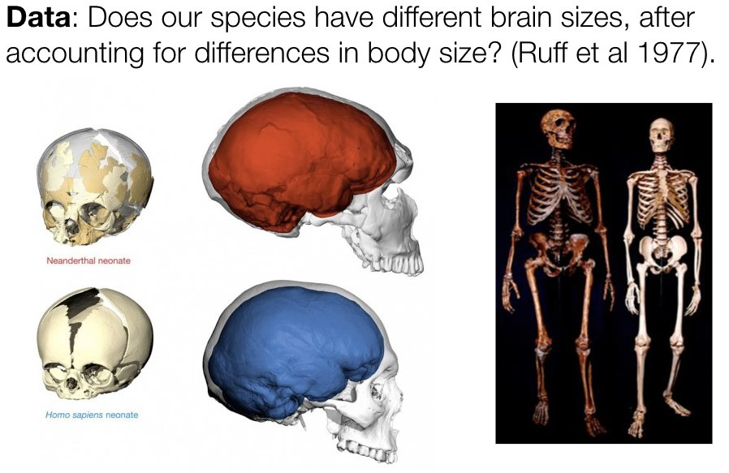
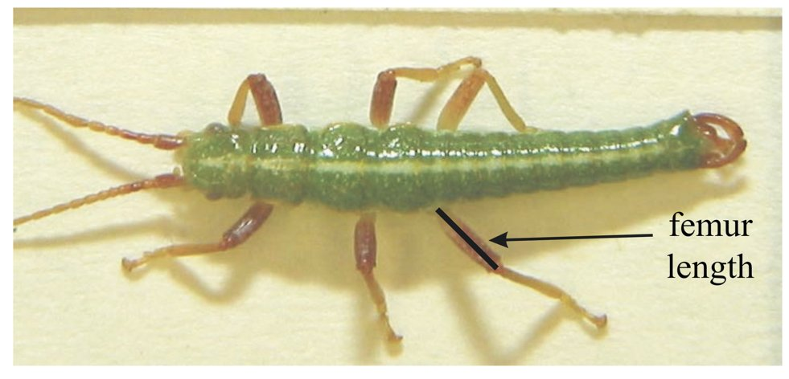
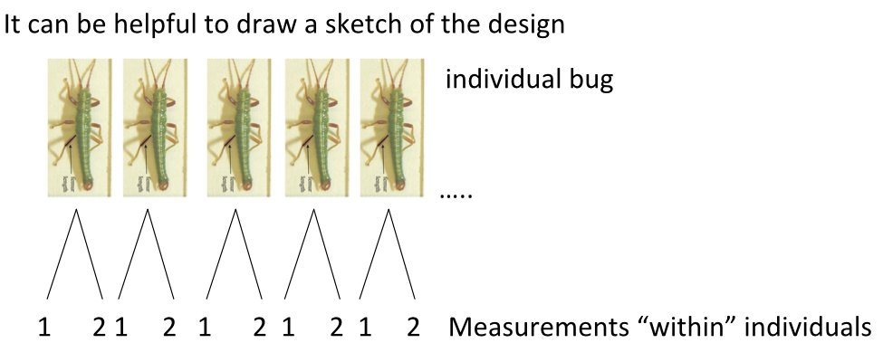
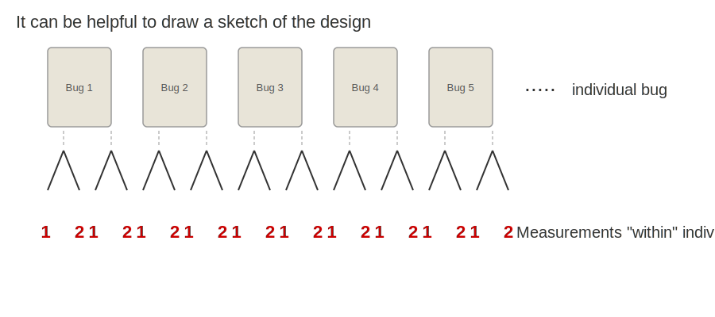
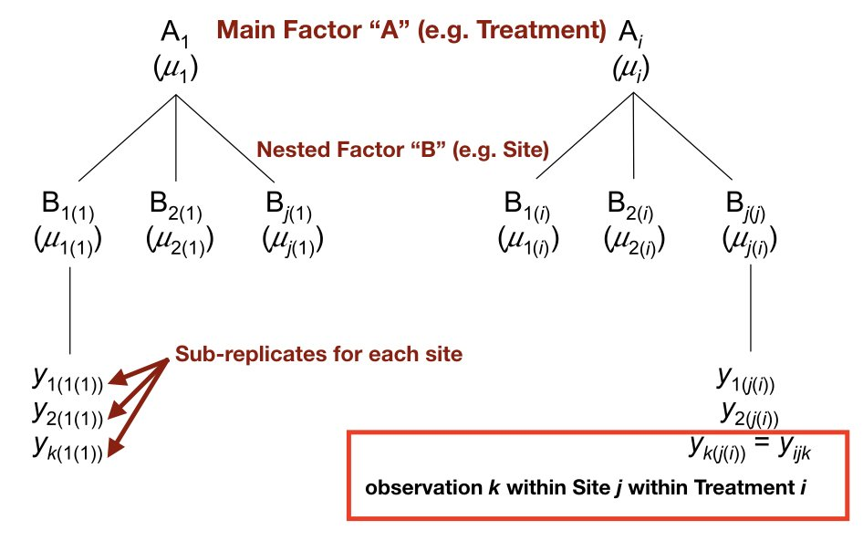
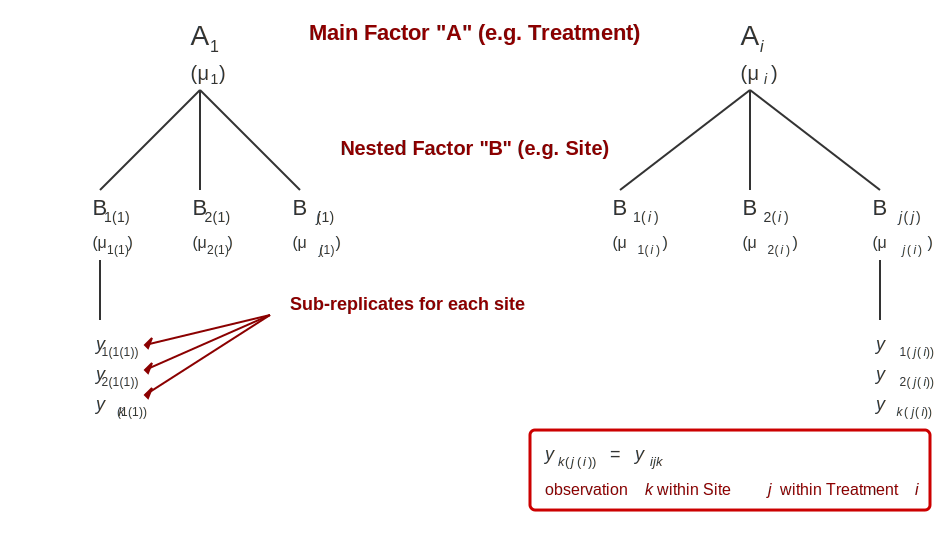
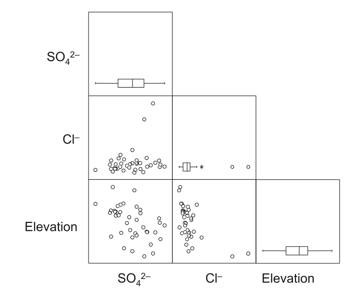
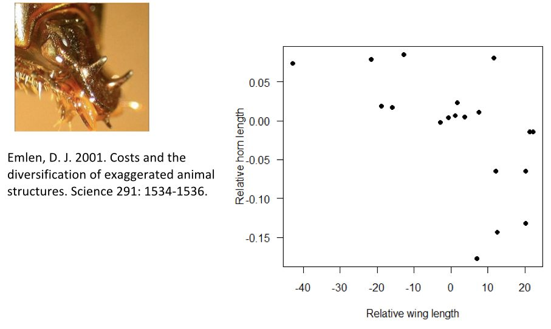

```{r}
#| label: setup
#| include: false

# Core data manipulation and visualization
library(tidyverse)
library(knitr)
library(readxl)
library(patchwork)

# Statistical analysis packages
library(MASS)        # LDA, robust regression
library(pwr)         # Power analysis
library(boot)        # Bootstrap methods
library(car)         # Companion to Applied Regression
library(nlme)        # Mixed effects models
library(broom)       # Tidy model output
library(emmeans)     # Estimated marginal means
library(GGally)      # Extended ggplot2 pairs plots
library(ggfortify)   # ggplot2 diagnostics for lm objects

# Set consistent theme for all plots
theme_set(theme_minimal(base_size = 14))

# Set seed for reproducibility
set.seed(2026)
```

# Week 7: Multifactor ANOVA and Multiple Regression {background-color="#d4edda"}

## Week 7 Topics

::: incremental
-   Finish ANCOVA (with post-hoc analysis using `emmeans`)
-   Multifactor ANOVA
-   Factorial & nested designs (with post-hoc analysis)
-   Random effects & repeated measures
-   Multiple linear regression
-   Model selection: AIC, BIC, Mallow's Cp, and worked example
:::

**Readings:** Chapter 28

**HW3 Due this week**

## Packages for This Week

::: panel-tabset
### Install

```{r}
#| eval: false
#| echo: true

# Install new packages (run once)
install.packages(c("nlme", "car", "pwr", "leaps",
                   "patchwork", "GGally", "ggfortify"))
```

### Load

```{r}
#| eval: false
#| echo: true

# Load packages
library(tidyverse)    # Data manipulation & visualization
library(car)          # Type II/III SS, VIF, assumption testing
library(nlme)         # Linear mixed-effects models
library(pwr)          # Power analysis
library(leaps)        # All-subsets regression
library(broom)        # Tidy model output
library(emmeans)      # Estimated marginal means
library(patchwork)    # Combining ggplots
library(GGally)       # ggpairs scatterplot matrices
library(ggfortify)    # ggplot2 diagnostic plots for lm
```
:::

## Datasets for This Week

**Built-in datasets:** `ToothGrowth` (vitamin C effects on guinea pig tooth growth)

**Course datasets (download from Canvas):**

| File | Analysis | Description |
|:---|:---|:---|
| `hydrogel_drug_release.csv` | ANCOVA | Drug release from hydrogel scaffolds by polymer type |
| `nanofiber_tensile_strength.csv` | Nested ANOVA | Tensile strength of nanofiber scaffolds across batches |
| `cell_proliferation_assay.csv` | Factorial ANOVA | Stem cell proliferation by substrate stiffness and growth factor |
| `implant_degradation.csv` | Repeated Measures | Biodegradable implant mass loss over time by coating type |
| `RNAseq_lipid.tsv` | Multiple regression | Gene expression and lipid content in stickleback fish |

------------------------------------------------------------------------

# Finish ANCOVA: Combining Regression and ANOVA {background-color="#d4edda"}

## ANCOVA Review

Last week we introduced **Analysis of Covariance (ANCOVA)**, which combines:

-   **Continuous predictor** (covariate) — like body mass or temperature
-   **Categorical predictor** (factor) — like species or treatment

This week we continue with the biological motivations, interpretation, and assumptions.

-   ANCOVA increases statistical power by reducing unexplained variance — the covariate "absorbs" variation that would otherwise inflate the residual error term
-   The adjusted group means account for differences in the covariate, providing a fairer comparison between groups

## ANCOVA: Neanderthal vs. Modern Human

{fig-align="center" width="90%"}

::: aside
Source: Ruff et al., 1977; skull reconstructions and skeleton comparison images
:::

## Brain-Body Mass Regression

::: panel-tabset
### Output

```{r}
#| label: plot-brain-body-mass
#| echo: false
#| eval: true
#| fig-width: 10
#| fig-height: 5

set.seed(42)
n <- 30

species_data <- tibble(
  species = rep(c("H. sapiens", "Neanderthal"), each = n),
  body_mass = c(rnorm(n, 70, 10), rnorm(n, 80, 12))
) %>%
  mutate(brain_size = ifelse(species == "H. sapiens",
                              900 + 8 * body_mass + rnorm(n(), 0, 50),
                              850 + 8 * body_mass + rnorm(n(), 0, 50)))

p1 <- ggplot(species_data, aes(x = body_mass, y = brain_size,
                                color = species, shape = species)) +
  geom_point(size = 2.5, alpha = 0.7) +
  geom_smooth(method = "lm", se = FALSE, linewidth = 1.2) +
  scale_color_manual(values = c("H. sapiens" = "steelblue",
                                 "Neanderthal" = "firebrick")) +
  scale_shape_manual(values = c(16, 17)) +
  labs(title = "Parallel Slopes: brain ~ mass + species",
       x = "Body mass (kg)", y = "Brain size (cc)",
       color = "Species", shape = "Species") +
  theme_minimal(base_size = 14) +
  theme(legend.position = "top")

p2 <- ggplot(species_data, aes(x = body_mass, y = brain_size,
                                color = species, shape = species)) +
  geom_point(size = 2.5, alpha = 0.7) +
  geom_smooth(method = "lm", se = FALSE, linewidth = 1.2) +
  scale_color_manual(values = c("H. sapiens" = "steelblue",
                                 "Neanderthal" = "firebrick")) +
  scale_shape_manual(values = c(16, 17)) +
  labs(title = "Interaction: brain ~ mass * species",
       x = "Body mass (kg)", y = "Brain size (cc)",
       color = "Species", shape = "Species") +
  theme_minimal(base_size = 14) +
  theme(legend.position = "top")

p1 + p2 + plot_layout(guides = "collect") &
  theme(legend.position = "top")
```

### Code

```{r}
#| label: plot-brain-body-mass-code
#| echo: true
#| eval: false

# Simulated Neanderthal vs. H. sapiens data
set.seed(42)
n <- 30
species_data <- tibble(
  species = rep(c("H. sapiens", "Neanderthal"), each = n),
  body_mass = c(rnorm(n, 70, 10), rnorm(n, 80, 12))
) %>%
  mutate(brain_size = ifelse(species == "H. sapiens",
                              900 + 8 * body_mass + rnorm(n(), 0, 50),
                              850 + 8 * body_mass + rnorm(n(), 0, 50)))

# Parallel slopes visualization
ggplot(species_data, aes(x = body_mass, y = brain_size,
                          color = species, shape = species)) +
  geom_point(size = 2.5, alpha = 0.7) +
  geom_smooth(method = "lm", se = FALSE, linewidth = 1.2) +
  scale_color_manual(values = c("steelblue", "firebrick")) +
  labs(title = "brain ~ mass + species",
       x = "Body mass (kg)", y = "Brain size (cc)")
```

### Interpretation

-   **Left panel (additive model):** Both species have the same slope relating body mass to brain size, but Neanderthals have a different intercept — the lines are parallel
-   **Right panel (interaction model):** The slopes are allowed to differ between species — if the interaction is not significant, the parallel model is preferred
-   The key ANCOVA question: after controlling for body mass, do the species differ in brain size?
:::

## ANCOVA Null Hypotheses

::: panel-tabset
### Equations

**For the categorical factor (e.g., species):**

$$H_0: \mu_{1(adj)} = \mu_{2(adj)} = \ldots = \mu_{p(adj)}$$

All adjusted group means are equal (after accounting for the covariate).

**For the covariate (e.g., body mass):**

$$H_0: \beta = 0$$

The covariate has no linear relationship with the response.

### LaTeX

``` text
H_0: \mu_{1(adj)} = \mu_{2(adj)} = \ldots = \mu_{p(adj)}
H_0: \beta = 0
```

### Interpretation

-   The ANCOVA null hypotheses test group differences after adjusting for the covariate and whether the covariate has a significant linear relationship with the response
-   The group hypothesis asks: after removing the covariate's effect, do the adjusted group means still differ?
-   The covariate hypothesis asks: is there a significant linear relationship between the covariate and the response, pooled across groups?
:::

## ANCOVA F-Ratio Table

| Source    | df          | MS               | F-ratio                    |
|:----------|:------------|:-----------------|:---------------------------|
| Factor A  | $p - 1$     | $MS_A$           | $MS_A / MS_{Residual}$     |
| Covariate | 1           | $MS_{Covariate}$ | $MS_{Cov} / MS_{Residual}$ |
| Residual  | $N - p - 1$ | $MS_{Residual}$  |                            |

-   The covariate consumes 1 df from the residual, reducing the error term
-   If the covariate is strongly related to the response, $MS_{Residual}$ drops substantially, increasing power for the factor test
-   This is why ANCOVA is more powerful than one-way ANOVA when the covariate is correlated with the response

## Homogeneous vs. Heterogeneous Slopes

::: panel-tabset
### Output

```{r}
#| label: plot-slopes-assumption
#| echo: false
#| eval: true
#| fig-width: 10
#| fig-height: 5

set.seed(42)
n <- 25

homo_a <- tibble(group = "Group A", x = rnorm(n, 5, 2)) %>%
  mutate(y = 2 + 1.5 * x + rnorm(n(), 0, 1), panel = "Homogeneous Slopes (OK)")
homo_b <- tibble(group = "Group B", x = rnorm(n, 5, 2)) %>%
  mutate(y = 5 + 1.5 * x + rnorm(n(), 0, 1), panel = "Homogeneous Slopes (OK)")
het_a <- tibble(group = "Group A", x = rnorm(n, 5, 2)) %>%
  mutate(y = 2 + 0.5 * x + rnorm(n(), 0, 1), panel = "Heterogeneous Slopes (VIOLATION)")
het_b <- tibble(group = "Group B", x = rnorm(n, 5, 2)) %>%
  mutate(y = 1 + 2.5 * x + rnorm(n(), 0, 1), panel = "Heterogeneous Slopes (VIOLATION)")

slopes_df <- bind_rows(homo_a, homo_b, het_a, het_b)

ggplot(slopes_df, aes(x = x, y = y, color = group)) +
  geom_point(size = 2, alpha = 0.6) +
  geom_smooth(method = "lm", se = FALSE, linewidth = 1.2) +
  facet_wrap(~ panel) +
  scale_color_manual(values = c("Group A" = "steelblue", "Group B" = "firebrick")) +
  labs(x = "Covariate", y = "Response", color = "Group") +
  theme_minimal(base_size = 14) +
  theme(legend.position = "top")
```

### Code

```{r}
#| label: plot-slopes-assumption-code
#| echo: true
#| eval: false

# Demonstrating slope homogeneity assumption
set.seed(42)
n <- 25

# Homogeneous: same slope (1.5), different intercepts
homo_a <- tibble(group = "A", x = rnorm(n, 5, 2)) %>%
  mutate(y = 2 + 1.5 * x + rnorm(n(), 0, 1))
homo_b <- tibble(group = "B", x = rnorm(n, 5, 2)) %>%
  mutate(y = 5 + 1.5 * x + rnorm(n(), 0, 1))

# Heterogeneous: different slopes (0.5 vs 2.5)
het_a <- tibble(group = "A", x = rnorm(n, 5, 2)) %>%
  mutate(y = 2 + 0.5 * x + rnorm(n(), 0, 1))
het_b <- tibble(group = "B", x = rnorm(n, 5, 2)) %>%
  mutate(y = 1 + 2.5 * x + rnorm(n(), 0, 1))

ggplot(bind_rows(homo_a, homo_b), aes(x, y, color = group)) +
  geom_point() + geom_smooth(method = "lm", se = FALSE)
```

### Interpretation

-   The side-by-side comparison of parallel vs. non-parallel slopes visualizes the core ANCOVA question: does the covariate's effect differ between groups?
-   Parallel lines (left panel) indicate the group effect is constant regardless of the covariate value — the additive model is appropriate
-   Non-parallel lines (right panel) indicate an interaction between the group and the covariate — the effect of one depends on the level of the other
-   Always test the interaction term first; if non-significant, drop it and interpret the simpler additive model
:::

When slopes differ between groups, the interaction between the covariate and the factor is significant — this is a violation of the **parallel slopes assumption**. In this case, the interaction model is more appropriate than the additive model.

## Parallel vs. Interaction: When to Use

| Model | Use When | R Formula |
|:---|:---|:---|
| **Parallel Slopes** | Effect of covariate is same across groups | `y ~ x + group` |
| **Interaction** | Effect of covariate differs by group | `y ~ x * group` |

::: callout-tip
Always start with the interaction model. Test whether the interaction term is significant. If not, drop it and use the simpler parallel slopes model (parsimony principle).
:::

## Parallel Slopes (Additive) Model

When there is no interaction, each group has the **same slope** but **different intercepts**:

::: panel-tabset
### Equation

$$y = \beta_0 + \beta_1 x_{continuous} + \beta_2 x_{categorical} + \epsilon_i$$

### LaTeX

``` text
y = \beta_0 + \beta_1 x_{continuous} + \beta_2 x_{categorical} + \epsilon_i
```

### Interpretation

-   The parallel slopes model assumes all groups share the same slope for the continuous covariate, differing only in their intercepts
-   This is the default ANCOVA model and is appropriate when the covariate-response relationship is consistent across groups
-   The adjusted group means (least-squares means) from this model control for the covariate, giving a fairer comparison than raw group means
:::

::: panel-tabset
### Code

```{r}
#| eval: false
#| echo: true

# Parallel slopes model (additive)
lm(response ~ continuous_var + factor_var, data = mydata)
```

### Interpretation

-   The `+` means "additive" — the effect of the covariate is the same in every group, producing parallel regression lines with different y-intercepts
-   This model assumes the continuous predictor's slope is identical across all levels of the categorical variable
-   The additive model is simpler and has more statistical power, but is only appropriate when the parallel slopes assumption holds
:::

-   The `+` means "additive" — the effect of the covariate is the same in every group
-   This produces parallel regression lines with different y-intercepts

## Non-parallel Slopes (Interaction) Model

When the relationship **differs between groups**, add an **interaction term**:

::: panel-tabset
### Equation

$$y = \beta_0 + \beta_1 x_1 + \beta_2 x_2 + \beta_3 (x_1 \times x_2) + \epsilon_i$$

### LaTeX

``` text
y = \beta_0 + \beta_1 x_1 + \beta_2 x_2 + \beta_3 (x_1 \times x_2) + \epsilon_i
```

### Interpretation

-   The interaction model allows the slope of the continuous predictor to differ across factor levels, producing non-parallel regression lines
-   A significant interaction term indicates that the relationship between the covariate and response genuinely differs between groups
-   When the interaction is non-significant, the simpler parallel slopes model is preferred for its greater statistical power and interpretability
:::

::: panel-tabset
### Code

```{r}
#| eval: false
#| echo: true

# Model with interaction (different slopes)
lm(response ~ continuous_var * factor_var, data = mydata)

# Equivalent to:
lm(response ~ continuous_var + factor_var + continuous_var:factor_var, data = mydata)
```

### Interpretation

-   The `*` operator automatically includes both main effects and their interaction — it is shorthand for `A + B + A:B`
-   A significant interaction means the slope of the covariate differs between groups — the group effect depends on the level of the continuous variable
-   When the interaction is significant, main effects should not be interpreted in isolation because the effect of each predictor depends on the level of the other
:::

## Interpreting ANCOVA Output

::: panel-tabset
### Code

```{r}
#| eval: false
#| echo: true

# Interpreting ANCOVA coefficients
# With: lm(response ~ covariate + factor, data = mydata)
# The output contains:
# (Intercept)        - baseline intercept for reference level
# covariate          - slope (same for all groups in additive model)
# factor_level2      - difference in intercept from reference group
# factor_level3      - difference in intercept from reference group
```

### Interpretation

-   The categorical variable coefficient represents the **offset from the reference group**
-   This is the same dummy variable encoding that `lm()` uses for ANOVA
-   The only difference from pure ANOVA is the inclusion of a continuous predictor
-   Use `summary()` to see individual coefficients; use `car::Anova()` with `type = "II"` for the overall ANOVA table with proper sums of squares
:::

## Hydrogel Drug Release Dataset

**Scenario:** Researchers are testing how **polymer type** (PEG, Alginate, Chitosan) affects cumulative drug release from hydrogel scaffolds, with **crosslink density** as a covariate. The relationship between crosslink density and release rate is expected to differ by polymer.

| Variable | Type | Description |
|:---|:---|:---|
| `polymer` | Categorical (3 levels) | Hydrogel polymer type: PEG, Alginate, Chitosan |
| `crosslink_density` | Continuous | Crosslink density of the hydrogel (mol/L, range 2–12) |
| `cumulative_release_pct` | Continuous (response) | Cumulative drug release after 24 hours (%) |

-   *n* = 75 (25 per polymer type)
-   The interaction model is expected to be the best fit because the three polymers have different degradation mechanisms

## ANCOVA Worked Example: Loading and Exploring

::: panel-tabset
### Output

```{r}
#| label: plot-ancova-explore
#| echo: false
#| eval: true
#| fig-width: 9
#| fig-height: 5

hydrogel <- read.csv("data/hydrogel_drug_release.csv")

ggplot(hydrogel, aes(x = crosslink_density, y = cumulative_release_pct,
                      color = polymer, shape = polymer)) +
  geom_point(size = 2.5, alpha = 0.7) +
  geom_smooth(method = "lm", se = TRUE, alpha = 0.15, linewidth = 1.1) +
  scale_color_brewer(palette = "Set1") +
  labs(title = "Drug Release vs. Crosslink Density by Polymer Type",
       x = "Crosslink Density (mol/L)",
       y = "Cumulative Release (%)",
       color = "Polymer", shape = "Polymer") +
  theme_minimal(base_size = 14) +
  theme(legend.position = "top")
```

### Code

```{r}
#| label: plot-ancova-explore-code
#| echo: true
#| eval: false

# Load the hydrogel dataset
hydrogel <- read.csv("data/hydrogel_drug_release.csv")

# Explore the data
str(hydrogel)
summary(hydrogel)

# Visualize: do the slopes look different?
ggplot(hydrogel, aes(x = crosslink_density, y = cumulative_release_pct,
                      color = polymer, shape = polymer)) +
  geom_point(size = 2.5, alpha = 0.7) +
  geom_smooth(method = "lm", se = TRUE, alpha = 0.15) +
  scale_color_brewer(palette = "Set1") +
  labs(title = "Drug Release vs. Crosslink Density by Polymer",
       x = "Crosslink Density (mol/L)",
       y = "Cumulative Release (%)")
```

### Interpretation

-   The three polymer types clearly show **different slopes** — Chitosan has the steepest negative relationship with crosslink density while Alginate is nearly flat
-   This visual pattern suggests the **interaction model** will be more appropriate than the parallel slopes model
-   All three polymers show decreasing release with increasing crosslink density, but the rate of decrease differs substantially
:::

## ANCOVA Worked Example: Fitting and Comparing Models

::: panel-tabset
### Output

```{r}
#| label: ancova-fit-output
#| echo: false
#| eval: true

hydrogel <- read.csv("data/hydrogel_drug_release.csv")

# Step 1: Fit the interaction model
ancova_interaction <- lm(cumulative_release_pct ~ crosslink_density * polymer,
                          data = hydrogel)

# Step 2: Fit the parallel slopes (additive) model
ancova_additive <- lm(cumulative_release_pct ~ crosslink_density + polymer,
                       data = hydrogel)

# Step 3: Compare models — is the interaction significant?
cat("=== Model Comparison (Additive vs. Interaction) ===\n")
anova(ancova_additive, ancova_interaction)
```

### ANOVA Table

```{r}
#| label: ancova-fit-anova
#| echo: false
#| eval: true

hydrogel <- read.csv("data/hydrogel_drug_release.csv")

ancova_interaction <- lm(cumulative_release_pct ~ crosslink_density * polymer,
                          data = hydrogel)

# Type II ANOVA table
cat("=== Type II ANOVA Table (Interaction Model) ===\n")
car::Anova(ancova_interaction, type = "II")
```

### Code

```{r}
#| echo: true
#| eval: false

# Step 1: Fit the interaction model
ancova_interaction <- lm(cumulative_release_pct ~ crosslink_density * polymer,
                          data = hydrogel)

# Step 2: Fit the parallel slopes (additive) model
ancova_additive <- lm(cumulative_release_pct ~ crosslink_density + polymer,
                       data = hydrogel)

# Step 3: Compare models — is the interaction significant?
anova(ancova_additive, ancova_interaction)

# Step 4: Examine the interaction model
summary(ancova_interaction)

# Step 5: Type II ANOVA table
car::Anova(ancova_interaction, type = "II")
```

### Interpretation

-   The `anova()` comparison tests whether the interaction terms significantly improve the model (F-test on the additional parameters)
-   If the interaction is significant (p \< 0.05), use the interaction model — the effect of crosslink density on drug release **depends on polymer type**
-   The `summary()` output gives you the slope for the reference polymer (Alginate) and the slope *differences* for the other polymers
-   Each polymer's actual slope = reference slope + its interaction coefficient
:::

## ANCOVA Post-Hoc: Adjusted Means with emmeans

When the interaction is significant, we want to compare the **adjusted group means** — the predicted drug release for each polymer at the mean crosslink density:

::: panel-tabset
### Output

```{r}
#| label: plot-ancova-emmeans-output
#| echo: false
#| eval: true
#| fig-width: 9
#| fig-height: 5

hydrogel <- read.csv("data/hydrogel_drug_release.csv")

ancova_interaction <- lm(cumulative_release_pct ~ crosslink_density * polymer,
                          data = hydrogel)

library(emmeans)

# Estimated marginal means at mean crosslink density
ancova_emm <- emmeans(ancova_interaction, ~ polymer)
ancova_pairs <- pairs(ancova_emm)

# Plot the emmeans
emm_df <- as.data.frame(ancova_emm)

ggplot(emm_df, aes(x = polymer, y = emmean, color = polymer)) +
  geom_point(size = 4) +
  geom_errorbar(aes(ymin = lower.CL, ymax = upper.CL),
                width = 0.2, linewidth = 1) +
  scale_color_brewer(palette = "Set1") +
  labs(title = "Adjusted Mean Drug Release by Polymer Type",
       subtitle = "Estimated marginal means at mean crosslink density, with 95% CI",
       x = "Polymer Type", y = "Adjusted Cumulative Release (%)") +
  theme_minimal(base_size = 14) +
  theme(legend.position = "none")
```

### Code

```{r}
#| label: plot-ancova-emmeans-code
#| echo: true
#| eval: false

library(emmeans)

# Estimated marginal means at mean crosslink density
ancova_emm <- emmeans(ancova_interaction, ~ polymer)
summary(ancova_emm)

# Pairwise comparisons (Tukey-adjusted)
pairs(ancova_emm)

# Visualize with CLD (compact letter display)
plot(ancova_emm, comparisons = TRUE) +
  labs(x = "Adjusted Cumulative Release (%)",
       y = "Polymer Type")

# emtrends: compare slopes across groups
emtrends(ancova_interaction, pairwise ~ polymer,
         var = "crosslink_density")
```

### Interpretation

-   `emmeans()` computes the predicted response for each polymer at the **mean** value of the covariate — this gives a fair comparison by holding crosslink density constant
-   `pairs()` performs Tukey-adjusted pairwise comparisons of these adjusted means
-   `emtrends()` compares the **slopes** across polymer types — this directly tests whether the rate of change in drug release per unit of crosslink density differs between polymers
-   When the interaction is significant, the `emtrends()` output is often more informative than the adjusted means, because the group differences depend on where along the covariate you evaluate them
:::

## Type I, II, and III Sums of Squares

Throughout this lecture, you'll see both `anova()` and `car::Anova(type = "II")` used to produce ANOVA tables. These give **different results** because they decompose the sums of squares differently. Understanding which to use is critical for correct inference.

-   **Type I (Sequential):** Each term is tested after accounting for all terms listed *before* it in the formula. The order of terms in the model formula matters!
-   **Type II (Partial, no interaction):** Each term is tested after accounting for all *other terms of the same order or lower*. Order does not matter. Assumes no significant interactions.
-   **Type III (Partial, with interaction):** Each term is tested after accounting for *all other terms including interactions*. Requires specific contrast coding (sum-to-zero).

## Comparing SS Types: When They Differ

::: panel-tabset
### Balanced Design

With **balanced data** (equal sample sizes in all cells), Types I, II, and III all give **identical results** — the effects are orthogonal and the order of terms does not matter.

This is one of the main advantages of balanced experimental designs.

### Unbalanced Design

With **unbalanced data** (unequal sample sizes), the SS types diverge:

| Type | Tests | Order matters? | Best for |
|:---|:---|:---|:---|
| I (Sequential) | Each term after previous terms | **Yes** | Hierarchical/nested models where order is meaningful |
| II (Partial) | Each term after all other same-order terms | No | Main effects when interaction is **not** significant |
| III (Partial) | Each term after all others including interactions | No | Main effects when interaction **is** significant |

### Code

```{r}
#| echo: true
#| eval: false

# Type I: anova() — sequential, order-dependent
anova(lm(y ~ A + B + A:B, data = mydata))      # A tested first
anova(lm(y ~ B + A + A:B, data = mydata))      # B tested first (different!)

# Type II: car::Anova() — each main effect adjusted for the other
car::Anova(lm(y ~ A * B, data = mydata), type = "II")

# Type III: requires sum-to-zero contrasts
options(contrasts = c("contr.sum", "contr.poly"))
car::Anova(lm(y ~ A * B, data = mydata), type = "III")
```

### Interpretation

-   Type I (sequential) SS depend on the order variables enter the model and are appropriate for balanced designs or when there is a natural ordering to predictors
-   Type III (marginal) SS test each effect after adjusting for all other effects and are preferred for unbalanced designs because results do not depend on variable order
-   In balanced designs, all SS types give identical results; the distinction only matters with unbalanced data or missing cells
-   R's `anova()` uses Type I by default; use `car::Anova(model, type = 'III')` for Type III SS
:::

## Which SS Type Should You Use?

::: callout-tip
## Decision Guide

1.  **Design is balanced?** → All types give the same answer. Use Type I (`anova()`) for simplicity.
2.  **Unbalanced, interaction is NOT significant?** → Use **Type II**. It has more statistical power for testing main effects.
3.  **Unbalanced, interaction IS significant?** → Use **Type III** (but be cautious — main effects are hard to interpret in the presence of interactions regardless of SS type).
4.  **Nested or sequential model?** → Type I is appropriate when the order of terms reflects a scientific hierarchy.
:::

-   In this course, we default to **Type II** via `car::Anova(type = "II")` unless there is a specific reason to use another type
-   R's default `anova()` always uses Type I — this is a common source of confusion when results differ from other software (SAS, SPSS, JMP default to Type III)

------------------------------------------------------------------------

# Multifactor ANOVA {background-color="#d4edda"}

## Why Multifactor Designs?

Single-factor designs can only test one variable at a time. In bioengineering experiments, **multiple factors** often operate simultaneously:

-   Scaffold material × growth factor concentration
-   Temperature × pH × incubation time
-   Device geometry × surface coating

Multifactor designs allow us to test **main effects** of each factor and their **interactions** — whether the effect of one factor depends on the level of another.

-   **Factorial designs**: all combinations of factor levels are present (crossed)
-   **Nested designs**: levels of one factor are unique to levels of another (hierarchical)
-   **Mixed models**: incorporate both fixed and random effects

# Random Effects in Multifactor ANOVA {background-color="#d4edda"}

## Fixed vs. Random Effects

**Fixed effects:**

-   Groups are predetermined, of direct interest, repeatable
-   Examples: medical treatments, predetermined doses, habitat types
-   We want to estimate specific group means

**Random effects:**

-   Groups randomly sampled from a larger population

-   Examples: families, subjects measured repeatedly, blocks, batches

-   **Variance among groups** is of interest, not specific group means

-   The distinction matters because it changes which error term is used in the F-ratio — using the wrong one leads to incorrect p-values

-   If your groups could be replaced by a different random sample and you'd still be answering the same question, they are random

## When to Use Random Effects

-   Nested sampling designs (individuals within populations)
-   Subplots within plots
-   Replicates grouped spatially or temporally (blocks, batches)
-   Related individuals (families, litters)
-   Repeated measures on the same subjects

::: callout-note
A good rule of thumb: if you are interested in the **specific levels** of a factor, it is fixed. If you are interested in the **variability among levels** drawn from a larger population, it is random.
:::

## Random Effects Hypothesis

::: panel-tabset
### Equation

$$H_0: \sigma^2_\alpha = 0 \qquad H_A: \sigma^2_\alpha \neq 0$$

### LaTeX

``` text
H_0: \sigma^2_\alpha = 0
H_A: \sigma^2_\alpha \neq 0
```

### Interpretation

-   The random effects hypothesis tests whether the variance component $\sigma^2_\alpha$ is greater than zero, not whether specific group means differ
-   A significant random effect means there is meaningful variation among the population of groups from which the observed levels were sampled
-   Random effects are appropriate when factor levels represent a random sample from a larger population (e.g., subjects, batches, labs)
:::

We are testing whether the **variance component** for the random effect is zero — i.e., whether there is meaningful variation among the randomly sampled groups.

-   Unlike fixed effects where we test for differences among specific group means, here we test whether the *variance* across groups is greater than zero
-   A significant result means the grouping structure explains meaningful variation in the response

## Random Effects in R

::: panel-tabset
### Code

```{r}
#| eval: false
#| echo: true

library(nlme)

# Random effect model — e.g., wells nested within plates
plate_model <- lme(
  fixed  = viability ~ 1,
  random = ~1 | plate,
  data   = cell_viability_data
)

summary(plate_model)
```

### Key Points

-   In R, `lm()` assumes all effects are **fixed**
-   For random effects, use `lme()` from the **nlme** package or `lmer()` from **lme4**
-   The `~1 | group` syntax specifies a random intercept for each level of `group`
-   The output reports variance components rather than group means

### Interpretation

-   The `aov()` function with an `Error()` term specifies the random-effects structure in traditional ANOVA — the error term defines the correct denominator for F-tests
-   The `lmer()` function from lme4 provides a more flexible framework for random effects, using REML for unbiased variance estimation
-   Choosing the correct error structure is essential: using `Error(subject)` tells R that subjects are random and observations within subjects are not independent
:::

## Random Effects: Bioengineering Example

Measuring cell viability across multiple wells within multiple plates within multiple experiments:

::: panel-tabset
### Output

```{r}
#| label: random-effects-bioeng-output
#| echo: false
#| eval: true

set.seed(42)
n_exp <- 3; n_plate <- 4; n_well <- 6
experiment <- rep(1:n_exp, each = n_plate * n_well)
plate      <- rep(rep(1:n_plate, each = n_well), n_exp)

exp_effect   <- rnorm(n_exp, 0, 5)[experiment]
plate_effect <- rnorm(n_exp * n_plate, 0, 3)[
  as.numeric(interaction(factor(experiment), factor(plate)))]
viability    <- 75 + exp_effect + plate_effect +
                rnorm(n_exp * n_plate * n_well, 0, 2)

cell_hier <- data.frame(
  viability, experiment = factor(experiment),
  plate = factor(plate)
)

library(nlme)
nested_model <- lme(viability ~ 1,
                    random = ~1 | experiment/plate,
                    data = cell_hier)

cat("=== Variance Components ===\n")
VarCorr(nested_model)

# Calculate ICCs
vc <- as.numeric(VarCorr(nested_model)[,1])
total_var <- sum(vc, na.rm = TRUE)
cat("\n=== Intraclass Correlations ===\n")
cat(sprintf("Experiment ICC:        %.3f\n", vc[1] / total_var))
cat(sprintf("Plate-within-exp ICC:  %.3f\n", vc[2] / total_var))
cat(sprintf("Residual (within-well): %.3f\n", vc[3] / total_var))
```

### Code

```{r}
#| echo: true
#| eval: false

# Simulated hierarchical data: cells → wells → plates → experiments
set.seed(42)
n_exp <- 3; n_plate <- 4; n_well <- 6
experiment <- rep(1:n_exp, each = n_plate * n_well)
plate      <- rep(rep(1:n_plate, each = n_well), n_exp)

# Generate data with variance at each level
exp_effect   <- rnorm(n_exp, 0, 5)[experiment]
plate_effect <- rnorm(n_exp * n_plate, 0, 3)[
  interaction(experiment, plate)]
viability    <- 75 + exp_effect + plate_effect +
                rnorm(n_exp * n_plate * n_well, 0, 2)

cell_hier <- data.frame(
  viability, experiment = factor(experiment),
  plate = factor(plate)
)

# Fit nested random effects model
library(nlme)
nested_model <- lme(viability ~ 1,
                    random = ~1 | experiment/plate,
                    data = cell_hier)
summary(nested_model)

# Extract variance components
VarCorr(nested_model)
```

### Interpreting Variance Components

The output from `VarCorr()` shows:

-   **Experiment variance**: variation between experimental runs
-   **Plate-within-experiment variance**: variation between plates within a run
-   **Residual variance**: well-to-well variation within plates
-   ICC (Intraclass Correlation) = group variance / total variance

The ICC tells you what proportion of total variability is attributable to each level of the hierarchy. A high experiment ICC means most variability comes from run-to-run differences — potentially a quality control concern.
:::

# Factorial ANOVA {background-color="#d4edda"}

## Factorial vs. Nested Designs

**Factorial designs:**

-   All pairwise combinations of factor levels are present
-   Can assess interactions between factors
-   Example: Drug dose × Exercise regimen

**Nested designs:**

-   Hierarchical structure — levels of one factor occur within levels of another

-   No interaction terms (levels are unique to each group)

-   Often contain random effects

-   Example: Cells within wells within plates

-   The key distinction: in a factorial design, every level of A occurs with every level of B; in a nested design, the levels of B are unique to each level of A

## Two-Factor Factorial Model

::: panel-tabset
### Equation

$$y_{ijk} = \mu + \underbrace{\alpha_i + \beta_j}_{\text{Main Effects}} + \underbrace{(\alpha\beta)_{ij}}_{\text{Two-way interaction}} + \varepsilon_{ijk}$$

where:

-   $\mu$ = grand mean
-   $\alpha_i$ = effect of level $i$ of factor A
-   $\beta_j$ = effect of level $j$ of factor B
-   $(\alpha\beta)_{ij}$ = interaction effect of A level $i$ and B level $j$
-   $\varepsilon_{ijk}$ = random error for replicate $k$

### LaTeX

``` text
y_{ijk} = \mu + \alpha_i + \beta_j + (\alpha\beta)_{ij} + \varepsilon_{ijk}
```

### Interpretation

-   The two-factor factorial model partitions total variation into main effect of A, main effect of B, their interaction AB, and residual error
-   The interaction term $(\alpha\beta)_{ij}$ captures the deviation of each cell mean from what would be predicted by the main effects alone
-   Factorial designs are efficient because they test multiple factors simultaneously and can detect interactions that single-factor experiments cannot
:::

## Three-Factor Factorial Model

::: panel-tabset
### Equation

$$y_{ijkl} = \mu + \underbrace{\alpha_i + \beta_j + \gamma_k}_{\text{Main Effects}} + \underbrace{(\alpha\beta)_{ij} + (\alpha\gamma)_{ik} + (\beta\gamma)_{jk}}_{\text{Two-way interactions}} + \underbrace{(\alpha\beta\gamma)_{ijk}}_{\text{Three-way}} + \varepsilon_{ijkl}$$

### Components

| Term | Meaning |
|:---|:---|
| $\alpha_i, \beta_j, \gamma_k$ | Main effects of factors A, B, C |
| $(\alpha\beta)_{ij}, (\alpha\gamma)_{ik}, (\beta\gamma)_{jk}$ | Two-way interaction effects |
| $(\alpha\beta\gamma)_{ijk}$ | Three-way interaction effect |
| $\varepsilon_{ijkl}$ | Random error for replicate $l$ |

### LaTeX

``` text
y_{ijkl} = \mu + \alpha_i + \beta_j + \gamma_k
  + (\alpha\beta)_{ij} + (\alpha\gamma)_{ik} + (\beta\gamma)_{jk}
  + (\alpha\beta\gamma)_{ijk} + \varepsilon_{ijkl}
```

### Interpretation

-   A three-factor model includes three main effects, three two-way interactions, and one three-way interaction — the number of parameters grows rapidly with factors
-   The three-way interaction tests whether any two-way interaction itself depends on the level of the third factor
-   In practice, three-way and higher-order interactions are often difficult to interpret and are frequently non-significant — simpler models are preferred unless strong theoretical justification exists
:::

-   The number of terms grows rapidly — a 3-factor model has 7 terms (3 main + 3 two-way + 1 three-way)
-   Higher-order interactions become increasingly difficult to interpret biologically

## Factorial Design Sizes

**For 2 levels per factor:**

| Factors | Design  | Combinations | Observations (*N* = 6 replicates) |
|:--------|:--------|:-------------|:----------------------------------|
| 2       | 2×2     | 4            | 24                                |
| 3       | 2×2×2   | 8            | 48                                |
| 4       | 2×2×2×2 | 16           | 96                                |

::: panel-tabset
### Formula

$$\text{Total \# of observations} = N \cdot 2^p$$

where $N$ = replicates per cell, $p$ = number of factors

### LaTeX

``` text
\text{Total number of observations} = N \cdot 2^p
```

### Interpretation

-   The interaction notation captures how the combined effect of two factors deviates from what would be expected from their individual effects alone
-   In R, the `*` operator in a formula automatically includes main effects and their interaction, while `:` includes only the interaction
:::

-   The total number of cells grows exponentially — a 2×3×4 design has 24 cells
-   Budget and feasibility constrain factorial designs; fractional factorials can help when full designs are too large

## Factorial ANOVA Null Hypotheses — Fixed Effects

::: panel-tabset
### Equations

**Factor A:**

$$H_0(A): \mu_1 = \mu_2 = \cdots = \mu_i = \mu$$

$$H_0(A): \alpha_1 = \alpha_2 = \cdots = \alpha_i = 0$$

**Factor B:**

$$H_0(B): \mu_1 = \mu_2 = \cdots = \mu_j = \mu$$

**A:B Interaction:**

$$H_0(AB): \mu_{ij} = \mu_i + \mu_j - \mu$$

(i.e., the cell mean equals what we'd expect from the marginal means alone — no interaction)

### LaTeX

``` text
H_0(A): \alpha_1 = \alpha_2 = \cdots = \alpha_i = 0
H_0(B): \mu_1 = \mu_2 = \cdots = \mu_j = \mu
H_0(AB): \mu_{ij} = \mu_i + \mu_j - \mu
```

### Interpretation

-   Each null hypothesis in factorial ANOVA tests a specific question: main effect A tests whether row means differ, main effect B tests whether column means differ, and the interaction tests whether the pattern of cell means cannot be explained by main effects alone
-   The interaction hypothesis is typically the most scientifically interesting — a significant interaction means the effect of one factor depends on the level of the other
-   Testing proceeds hierarchically: interpret the interaction first; if significant, main effects must be interpreted conditionally
:::

## Factorial ANOVA Null Hypotheses — Random Effects

::: panel-tabset
### Equations

**Factor A:**

$$H_0(A): \sigma^2_\alpha = 0 \quad \text{(population variance equals zero)}$$

There is no added variance due to all possible levels of A.

**Factor B:**

$$H_0(B): \sigma^2_\beta = 0 \quad \text{(population variance equals zero)}$$

There is no added variance due to all possible levels of B.

**A:B Interaction:**

$$H_0(AB): \sigma^2_{\alpha\beta} = 0 \quad \text{(population variance equals zero)}$$

### LaTeX

``` text
H_0(A): \sigma^2_\alpha = 0
H_0(B): \sigma^2_\beta = 0
H_0(AB): \sigma^2_{\alpha\beta} = 0
```

### Interpretation

-   Random effects hypotheses test whether variance components are greater than zero, rather than testing specific mean differences
-   A significant random interaction variance component means the combined effect of factors varies across the population of levels sampled
-   Random effects are appropriate when the factor levels in the study represent a sample from a larger population of possible levels
:::

## What is an Interaction in ANOVA?

An **interaction** means the effect of one variable on the response depends on the state of another variable.

-   In the presence of a significant interaction, the main effects alone are insufficient to describe the results
-   You must describe the effect of each factor *at each level* of the other factor

## Interaction Plot Patterns

::: panel-tabset
### Output

```{r}
#| label: plot-interaction-patterns
#| echo: false
#| eval: true
#| fig-width: 10
#| fig-height: 8

interaction_data <- tibble(
  Temperature = rep(c("Cold", "Hot"), 8),
  Fertilizer = rep(rep(c("No Fertilizer", "Fertilizer"), each = 2), 4),
  Growth = c(4, 6, 6, 8,    # (a) No interaction
             3, 9, 8, 4,    # (b) Crossing
             4, 5, 4, 10,   # (c) Fan
             5, 5, 5, 5),   # (d) No effect
  Panel = rep(c("(a) No interaction, both significant",
                "(b) Interaction (crossing)",
                "(c) Interaction (fan-shaped)",
                "(d) No effects"), each = 4)
)

interaction_data$Temperature <- factor(interaction_data$Temperature,
                                        levels = c("Cold", "Hot"))

ggplot(interaction_data, aes(x = Temperature, y = Growth,
                              color = Fertilizer, group = Fertilizer)) +
  geom_point(size = 3) +
  geom_line(linewidth = 1.2) +
  facet_wrap(~ Panel, nrow = 2) +
  scale_color_manual(values = c("No Fertilizer" = "steelblue",
                                 "Fertilizer" = "firebrick")) +
  ylim(0, 12) +
  labs(y = "Growth", color = "") +
  theme_minimal(base_size = 14) +
  theme(legend.position = "top")
```

### Code

```{r}
#| label: plot-interaction-patterns-code
#| echo: true
#| eval: false

# Creating interaction plots with ggplot2
# Key visual cues:
# - Parallel lines = no interaction
# - Crossing lines = strong (crossover) interaction
# - Fan-shaped lines = ordinal interaction
# - Overlapping flat lines = no effects at all

ggplot(data, aes(x = factor_A, y = response,
                  color = factor_B, group = factor_B)) +
  geom_point(size = 3) +
  geom_line(linewidth = 1.2) +
  labs(y = "Response")
```

### Interpretation

-   **(a) No interaction:** Lines are parallel — both temperature and fertilizer have independent additive effects
-   **(b) Crossing interaction:** Lines cross — fertilizer helps in cold but hurts in hot conditions (or vice versa). The effect of one factor *reverses* depending on the other
-   **(c) Fan-shaped interaction:** Fertilizer has a larger effect in hot conditions — the magnitude of one factor's effect depends on the other
-   **(d) No effects:** Both lines are flat and overlapping — neither factor matters
:::

## ANOVA Table for Two-Factor Crossed Model

| Source | SS | df | MS |
|:---|:---|:---|:---|
| A | $nq \displaystyle\sum_{i=1}^{p}(\bar{y}_{i} - \bar{y})^2$ | $p - 1$ | $\dfrac{SS_A}{p - 1}$ |
| B | $np \displaystyle\sum_{j=1}^{q}(\bar{y}_{j} - \bar{y})^2$ | $q - 1$ | $\dfrac{SS_B}{q - 1}$ |
| AB | $n \displaystyle\sum_{i=1}^{p}\sum_{j=1}^{q}(\bar{y}_{ij} - \bar{y}_{i} - \bar{y}_{j} + \bar{y})^2$ | $(p-1)(q-1)$ | $\dfrac{SS_{AB}}{(p-1)(q-1)}$ |
| Residual | $\displaystyle\sum_{i=1}^{p}\sum_{j=1}^{q}\sum_{k=1}^{n}(y_{ijk} - \bar{y}_{ij})^2$ | $pq(n-1)$ | $\dfrac{SS_{Residual}}{pq(n-1)}$ |
| Total | $\displaystyle\sum_{i=1}^{p}\sum_{j=1}^{q}\sum_{k=1}^{n}(y_{ijk} - \bar{y})^2$ | $pqn - 1$ |  |

-   The interaction SS captures variability in cell means that cannot be explained by the row and column marginal means alone

## F-Ratios for Fixed, Random, and Mixed Models

| Source | A and B fixed | A and B random | A fixed, B random |
|:---|:---|:---|:---|
| A | $\dfrac{MS_A}{MS_{Residual}}$ | $\dfrac{MS_A}{MS_{AB}}$ | $\dfrac{MS_A}{MS_{AB}}$ |
| B | $\dfrac{MS_B}{MS_{Residual}}$ | $\dfrac{MS_B}{MS_{AB}}$ | $\dfrac{MS_B}{MS_{Residual}}$ |
| AB | $\dfrac{MS_{AB}}{MS_{Residual}}$ | $\dfrac{MS_{AB}}{MS_{Residual}}$ | $\dfrac{MS_{AB}}{MS_{Residual}}$ |

::: callout-note
The choice of denominator for the F-ratio depends on whether each factor is fixed or random. When a factor is random, its interaction with the other factor must be used as the error term for testing the other factor's main effect. Getting this wrong leads to inflated Type I error rates.
:::

## Cell Proliferation Assay Dataset

**Scenario:** A 3×2 factorial experiment testing the effect of **substrate stiffness** (Soft 1 kPa, Medium 10 kPa, Stiff 50 kPa) and **growth factor supplementation** (Control vs. FGF2) on mesenchymal stem cell proliferation.

| Variable | Type | Description |
|:---|:---|:---|
| `stiffness` | Categorical (3 levels) | Substrate stiffness: Soft_1kPa, Medium_10kPa, Stiff_50kPa |
| `growth_factor` | Categorical (2 levels) | Growth factor treatment: Control, FGF2 |
| `proliferation_fold_change` | Continuous (response) | Cell proliferation as fold-change from baseline |

-   *n* = 60 (10 replicates per cell of the 3×2 design)
-   A significant interaction is expected: FGF2 boosts proliferation more on medium stiffness substrates than on soft or stiff substrates

## Factorial ANOVA Worked Example: Visualization

::: panel-tabset
### Output

```{r}
#| label: plot-factorial-exercise
#| echo: false
#| eval: true
#| fig-width: 9
#| fig-height: 5

cell_data <- read.csv("data/cell_proliferation_assay.csv")
cell_data$stiffness <- factor(cell_data$stiffness,
                               levels = c("Soft_1kPa", "Medium_10kPa", "Stiff_50kPa"))

# Summary for interaction plot
cell_summary <- cell_data %>%
  group_by(stiffness, growth_factor) %>%
  summarize(mean_prolif = mean(proliferation_fold_change),
            se = sd(proliferation_fold_change) / sqrt(n()),
            .groups = "drop")

ggplot(cell_summary, aes(x = stiffness, y = mean_prolif,
                          color = growth_factor, group = growth_factor)) +
  geom_point(size = 4) +
  geom_line(linewidth = 1.3) +
  geom_errorbar(aes(ymin = mean_prolif - se, ymax = mean_prolif + se),
                width = 0.15, linewidth = 0.8) +
  geom_jitter(data = cell_data,
              aes(x = stiffness, y = proliferation_fold_change,
                  color = growth_factor),
              width = 0.08, alpha = 0.3, size = 1.5, show.legend = FALSE) +
  scale_color_manual(values = c("Control" = "gray50", "FGF2" = "darkorange")) +
  labs(title = "MSC Proliferation: Stiffness x Growth Factor",
       x = "Substrate Stiffness", y = "Proliferation (fold-change)",
       color = "Treatment") +
  theme_minimal(base_size = 14) +
  theme(legend.position = "top")
```

### Code

```{r}
#| label: plot-factorial-exercise-code
#| echo: true
#| eval: false

# Load and prepare data
cell_data <- read.csv("data/cell_proliferation_assay.csv")
cell_data$stiffness <- factor(cell_data$stiffness,
                               levels = c("Soft_1kPa", "Medium_10kPa", "Stiff_50kPa"))

# Two-way ANOVA with interaction
cell_aov <- aov(proliferation_fold_change ~ stiffness * growth_factor,
                data = cell_data)
summary(cell_aov)

# Interaction plot
cell_summary <- cell_data %>%
  group_by(stiffness, growth_factor) %>%
  summarize(mean_prolif = mean(proliferation_fold_change),
            se = sd(proliferation_fold_change) / sqrt(n()))

ggplot(cell_summary, aes(x = stiffness, y = mean_prolif,
                          color = growth_factor, group = growth_factor)) +
  geom_point(size = 4) + geom_line(linewidth = 1.3) +
  geom_errorbar(aes(ymin = mean_prolif - se, ymax = mean_prolif + se),
                width = 0.15) +
  scale_color_manual(values = c("gray50", "darkorange")) +
  labs(title = "MSC Proliferation: Stiffness x Growth Factor",
       x = "Substrate Stiffness", y = "Proliferation (fold-change)")

# Post-hoc: simple effects of growth factor at each stiffness
emmeans(cell_aov, pairwise ~ growth_factor | stiffness)
```

### Interpretation

-   The non-parallel lines in the interaction plot indicate a **stiffness × growth factor interaction**
-   FGF2 dramatically increases proliferation on medium-stiffness substrates (\~10 kPa), which mimics the native stiffness of many soft tissues
-   On very soft or very stiff substrates, FGF2 has a much smaller effect — the cells may be limited by mechanical signaling
-   Post-hoc comparisons with `emmeans` let you test the FGF2 effect at each stiffness level separately
:::

## Factorial ANOVA in R: Fitting the Model

::: panel-tabset
### Output

```{r}
#| label: factorial-anova-r-output
#| echo: false
#| eval: true

cell_data <- read.csv("data/cell_proliferation_assay.csv")
cell_data$stiffness <- factor(cell_data$stiffness,
                               levels = c("Soft_1kPa", "Medium_10kPa", "Stiff_50kPa"))

# Multiplicative model (with interaction)
model_interaction <- aov(proliferation_fold_change ~ stiffness * growth_factor,
                          data = cell_data)

cat("=== Two-Way ANOVA with Interaction ===\n")
summary(model_interaction)
```

### Code

```{r}
#| eval: false
#| echo: true

cell_data <- read.csv("data/cell_proliferation_assay.csv")
cell_data$stiffness <- factor(cell_data$stiffness,
                               levels = c("Soft_1kPa", "Medium_10kPa", "Stiff_50kPa"))

# Multiplicative model (with interaction)
model_interaction <- aov(proliferation_fold_change ~ stiffness * growth_factor,
                          data = cell_data)

# Additive model (no interaction)
model_additive <- aov(proliferation_fold_change ~ stiffness + growth_factor,
                       data = cell_data)

summary(model_interaction)
summary(model_additive)
```

### Interpretation

-   The interaction term (`stiffness:growth_factor`) is tested first — if significant, the effect of growth factor depends on the stiffness level
-   If the interaction is not significant, interpret the main effects directly
-   Always check the interaction first before interpreting main effects
-   Use the interaction plot from the previous slide to visualize the pattern alongside the ANOVA output
:::

## Factorial Post-Hoc: Simple Effects with emmeans

When a significant interaction is present, main effects alone don't tell the full story. We use `emmeans` to examine **simple effects** — the effect of one factor at each level of the other:

::: panel-tabset
### Output

```{r}
#| label: plot-factorial-emmeans-output
#| echo: false
#| eval: true
#| fig-width: 9
#| fig-height: 5

cell_data <- read.csv("data/cell_proliferation_assay.csv")
cell_data$stiffness <- factor(cell_data$stiffness,
                               levels = c("Soft_1kPa", "Medium_10kPa", "Stiff_50kPa"))

cell_aov <- aov(proliferation_fold_change ~ stiffness * growth_factor,
                data = cell_data)

library(emmeans)

# Simple effects: growth factor at each stiffness
simple_fx <- emmeans(cell_aov, pairwise ~ growth_factor | stiffness)
simple_df <- as.data.frame(simple_fx$emmeans)

ggplot(simple_df, aes(x = stiffness, y = emmean, color = growth_factor)) +
  geom_point(size = 4, position = position_dodge(0.3)) +
  geom_errorbar(aes(ymin = lower.CL, ymax = upper.CL),
                width = 0.2, linewidth = 1,
                position = position_dodge(0.3)) +
  scale_color_manual(values = c("Control" = "gray50", "FGF2" = "darkorange")) +
  labs(title = "Estimated Marginal Means: Growth Factor Effect at Each Stiffness",
       subtitle = "95% confidence intervals; non-overlapping CIs suggest significant differences",
       x = "Substrate Stiffness", y = "Proliferation (fold-change)",
       color = "Treatment") +
  theme_minimal(base_size = 14) +
  theme(legend.position = "top")
```

### Code

```{r}
#| label: plot-factorial-emmeans-code
#| echo: true
#| eval: false

library(emmeans)

# Cell means (estimated marginal means for all combinations)
cell_emm <- emmeans(cell_aov, ~ stiffness * growth_factor)
summary(cell_emm)

# Simple effects: FGF2 vs Control at each stiffness level
simple_fx <- emmeans(cell_aov, pairwise ~ growth_factor | stiffness)
simple_fx$contrasts   # p-values for each comparison

# Simple effects the other direction: stiffness at each GF level
emmeans(cell_aov, pairwise ~ stiffness | growth_factor)

# Visualize
plot(simple_fx$emmeans, comparisons = TRUE) +
  labs(x = "Proliferation (fold-change)")
```

### Interpretation

-   The `pairwise ~ growth_factor | stiffness` syntax asks: "compare FGF2 vs. Control separately at each stiffness level"
-   On **Medium (10 kPa)** substrates, FGF2 produces a large, significant increase in proliferation
-   On **Soft (1 kPa)** and **Stiff (50 kPa)** substrates, the FGF2 effect is smaller and may not reach significance
-   This is the hallmark of an interaction: the treatment effect depends on the experimental context
-   The `emmeans` output also provides Tukey-adjusted p-values to control for multiple comparisons
:::

## Checking Assumptions for Factorial ANOVA

Just as with regression, ANOVA requires checking assumptions. The key diagnostics for factorial designs are:

-   **Normality of residuals** — Shapiro-Wilk test and Q-Q plot
-   **Homogeneity of variance** — Levene's test (more robust than Bartlett's)
-   **Independence** — ensured by experimental design, not testable statistically

::: callout-note
ANOVA is fairly robust to mild violations of normality (especially with balanced designs), but heterogeneous variances can seriously inflate Type I error rates.
:::

## Factorial ANOVA Diagnostics in R

::: panel-tabset
### Output

```{r}
#| label: factorial-diagnostics-output
#| echo: false
#| eval: true
#| fig-width: 10
#| fig-height: 8

cell_data <- read.csv("data/cell_proliferation_assay.csv")
cell_data$stiffness <- factor(cell_data$stiffness,
                               levels = c("Soft_1kPa", "Medium_10kPa", "Stiff_50kPa"))

cell_aov <- aov(proliferation_fold_change ~ stiffness * growth_factor,
                data = cell_data)

library(ggfortify)
autoplot(cell_aov, which = 1:4) +
  theme_minimal(base_size = 12)
```

### Tests

```{r}
#| label: factorial-diagnostics-tests
#| echo: false
#| eval: true

cell_data <- read.csv("data/cell_proliferation_assay.csv")
cell_data$stiffness <- factor(cell_data$stiffness,
                               levels = c("Soft_1kPa", "Medium_10kPa", "Stiff_50kPa"))

cell_aov <- aov(proliferation_fold_change ~ stiffness * growth_factor,
                data = cell_data)

cat("=== Shapiro-Wilk Test for Normality of Residuals ===\n")
shapiro.test(residuals(cell_aov))

cat("\n=== Levene's Test for Homogeneity of Variance ===\n")
library(car)
leveneTest(proliferation_fold_change ~ stiffness * growth_factor,
           data = cell_data)
```

### Code

```{r}
#| label: factorial-diagnostics-code
#| echo: true
#| eval: false

# Diagnostic plots
library(ggfortify)
autoplot(cell_aov, which = 1:4) + theme_minimal()

# Shapiro-Wilk test for normality of residuals
shapiro.test(residuals(cell_aov))

# Levene's test for homogeneity of variance across groups
library(car)
leveneTest(proliferation_fold_change ~ stiffness * growth_factor,
           data = cell_data)
```

### Interpretation

-   **Residuals vs Fitted**: look for a flat, random scatter — patterns suggest non-linearity or heteroscedasticity
-   **Q-Q Plot**: points close to the diagonal indicate normally distributed residuals
-   **Shapiro-Wilk**: p \> 0.05 means we cannot reject normality (which is what we want)
-   **Levene's test**: p \> 0.05 means we cannot reject equal variances (which is what we want)
-   If Levene's test is significant, consider Welch's ANOVA (`oneway.test()`) or transform the response variable
:::

## Effect Sizes for ANOVA

P-values tell you *whether* an effect exists; **effect sizes** tell you *how large* it is. Reporting effect sizes is increasingly expected in bioengineering and biomedical research.

| Metric | Formula | Interpretation |
|:---|:---|:---|
| **Eta-squared** ($\eta^2$) | $SS_{\text{effect}} / SS_{\text{total}}$ | Proportion of total variance explained by the effect |
| **Partial eta-squared** ($\eta_p^2$) | $SS_{\text{effect}} / (SS_{\text{effect}} + SS_{\text{residual}})$ | Proportion of variance explained, ignoring other effects |
| **Omega-squared** ($\omega^2$) | see equation below | Less biased estimator of population effect size |

## Effect Size Equations and Benchmarks

:::: panel-tabset
### Equations

$$\eta^2 = \frac{SS_{\text{effect}}}{SS_{\text{total}}} \qquad \eta_p^2 = \frac{SS_{\text{effect}}}{SS_{\text{effect}} + SS_{\text{residual}}}$$

$$\omega^2 = \frac{SS_{\text{effect}} - df_{\text{effect}} \cdot MS_{\text{residual}}}{SS_{\text{total}} + MS_{\text{residual}}}$$

-   $\eta^2$ values sum to 1 across all effects + residual, so each effect's share depends on what else is in the model
-   $\eta_p^2$ is preferred in factorial designs because it evaluates each effect independently
-   $\omega^2$ corrects for the positive bias in $\eta^2$ and is closer to the true population effect size

### Benchmarks

Cohen's benchmarks provide rough guidelines for interpreting effect size magnitude:

| Size | $\eta^2$ / $\eta_p^2$ | $\omega^2$ | Practical meaning |
|:---|:---|:---|:---|
| Small | 0.01 | 0.01 | Effect explains \~1% of variance; detectable but minor |
| Medium | 0.06 | 0.06 | Effect explains \~6% of variance; noticeable in practice |
| Large | 0.14 | 0.14 | Effect explains \~14% of variance; substantial |

::: callout-note
These benchmarks are rough guidelines, not rigid thresholds. In bioengineering, a "small" $\eta^2$ = 0.02 for scaffold stiffness on cell growth could still be biologically meaningful if reproducible across experiments.

### Interpretation

-   Effect sizes quantify the magnitude of differences independent of sample size, unlike p-values which depend heavily on n
-   Cohen's d expresses the difference in means in standard deviation units: d = 0.2 (small), 0.5 (medium), 0.8 (large) by convention
-   Eta-squared and partial eta-squared measure the proportion of variance explained, analogous to R-squared in regression
-   Always report effect sizes alongside p-values — a statistically significant result with a tiny effect size may not be practically meaningful
:::

### LaTeX

``` text
\eta^2 = \frac{SS_{\text{effect}}}{SS_{\text{total}}}
\eta_p^2 = \frac{SS_{\text{effect}}}{SS_{\text{effect}} + SS_{\text{residual}}}
\omega^2 = \frac{SS_{\text{effect}} - df_{\text{effect}} \cdot MS_{\text{residual}}}{SS_{\text{total}} + MS_{\text{residual}}}
```
::::

## Interpreting Effect Sizes: Practical Intuition

How should you think about effect sizes in practice?

-   $\eta^2 = 0.01$: If you measured 100 units of total variability in your response, the factor accounts for only 1 of those units. You'd need a large sample to even detect this effect reliably.
-   $\eta^2 = 0.06$: The factor accounts for about 6% of the total variability. In a scatterplot, you'd start to see the groups pulling apart. Clinically or practically relevant in many contexts.
-   $\eta^2 = 0.14$: The factor accounts for 14% of variability. Group means are clearly separated — this is a dominant driver of the response.
-   $\eta^2 > 0.25$: The factor explains more than a quarter of all variation — a very strong effect. In bioengineering, this might be scaffold material type on mechanical strength.

## Interpreting Effect Sizes: Practical Intuition

::: callout-tip
## Reporting Convention

Always report effect sizes alongside p-values: *"Substrate stiffness had a significant effect on proliferation (*$F_{2,54}$ = 15.3, p \< 0.001, $\eta_p^2$ = 0.36), indicating a large effect."
:::

-   When **p is small but** $\eta^2$ is tiny: the effect is real but practically negligible — you had enough power to detect a trivial difference
-   When **p is large but** $\eta^2$ is moderate: you may lack statistical power — the effect could be meaningful but your sample was too small to detect it reliably

## Effect Sizes in R: Cell Proliferation Example

::: panel-tabset
### Output

```{r}
#| label: effect-size-output
#| echo: false
#| eval: true

cell_data <- read.csv("data/cell_proliferation_assay.csv")
cell_data$stiffness <- factor(cell_data$stiffness,
                               levels = c("Soft_1kPa", "Medium_10kPa", "Stiff_50kPa"))

cell_aov <- aov(proliferation_fold_change ~ stiffness * growth_factor,
                data = cell_data)

# Extract SS from ANOVA table
aov_table <- summary(cell_aov)[[1]]

cat("=== ANOVA Table ===\n")
print(aov_table)

# Calculate eta-squared and partial eta-squared
SS <- aov_table$`Sum Sq`
SS_total <- sum(SS)
SS_resid <- SS[length(SS)]
effects <- rownames(aov_table)

cat("\n=== Effect Sizes ===\n")
for (i in 1:(length(SS) - 1)) {
  eta2 <- SS[i] / SS_total
  partial_eta2 <- SS[i] / (SS[i] + SS_resid)
  cat(sprintf("%-30s  eta2 = %.3f   partial_eta2 = %.3f\n",
              trimws(effects[i]), eta2, partial_eta2))
}
```

### Code

```{r}
#| label: effect-size-code
#| echo: true
#| eval: false

# Get the ANOVA table
aov_table <- summary(cell_aov)[[1]]

# Extract sums of squares
SS <- aov_table$`Sum Sq`
SS_total <- sum(SS)
SS_resid <- SS[length(SS)]

# Eta-squared for each effect
eta2 <- SS / SS_total

# Partial eta-squared for each effect
partial_eta2 <- SS / (SS + SS_resid)

# Combine into a summary
data.frame(
  Effect = rownames(aov_table),
  SS = round(SS, 2),
  eta_sq = round(eta2, 3),
  partial_eta_sq = round(partial_eta2, 3)
)
```

### Interpretation

-   The **interaction** ($\eta_p^2$) tells you how much of the remaining variance is explained by the combined stiffness × growth factor effect — a large interaction effect size confirms the visual impression from the interaction plot
-   Compare the main effect sizes: if stiffness has a larger $\eta_p^2$ than growth factor, stiffness is the more influential design parameter
-   Always report effect sizes alongside p-values — a small p-value with a tiny $\eta^2$ means the effect is statistically detectable but practically negligible
-   Journals increasingly require effect sizes per APA and CONSORT reporting guidelines
:::

------------------------------------------------------------------------

# Nested ANOVA {background-color="#d4edda"}

## Nested Design

In many bioengineering experiments, factors are organized **hierarchically** rather than in a crossed fashion. In a nested design:

-   Levels of one factor (B) are **unique** to each level of another factor (A)
-   Sources of variance are hierarchical — variance flows from the top of the hierarchy down
-   No interaction terms exist (because B's levels don't repeat across A's levels)

## Nested Analysis: Walking Stick Insect

{fig-align="center" width="90%"}

::: aside
Source: Walking stick insect specimen photograph, used for illustration of femur length measurement
:::

A classic example: measuring femur length of walking stick insects. Multiple measurements are taken per individual — the measurements are **nested within** individuals.

## Nested Design: Within-Individual Measurements

{fig-align="center" width="90%"}

::: aside
Source: Nested design diagram showing within-individual measurement structure
:::

## Nested Design: Within-Individual Measurements (SVG)

{fig-align="center" width="90%"}

::: aside
SVG recreation of nested design diagram showing within-individual measurement structure
:::

## Femur Length Variation Within Individuals

::: panel-tabset
### Output

```{r}
#| label: plot-femur-variation
#| echo: false
#| eval: true
#| fig-width: 8
#| fig-height: 5

set.seed(123)
n_individuals <- 25
ind_means <- sort(runif(n_individuals, 0.14, 0.28))

m1 <- ind_means + rnorm(n_individuals, 0, 0.008)
m2 <- ind_means + rnorm(n_individuals, 0, 0.008)

femur_df <- tibble(
  individual = rep(1:n_individuals, 2),
  measurement = rep(c("Measure 1", "Measure 2"), each = n_individuals),
  femur_length = c(m1, m2)
)

ggplot(femur_df, aes(x = individual, y = femur_length)) +
  geom_line(aes(group = individual), color = "gray50", linewidth = 0.8) +
  geom_point(aes(color = measurement), size = 2) +
  scale_color_manual(values = c("Measure 1" = "steelblue",
                                 "Measure 2" = "firebrick")) +
  labs(title = "Within-Individual Variation in Femur Length",
       subtitle = "Two measurements per walking stick insect",
       x = "Individual", y = "Femur Length (mm)",
       color = "") +
  theme_minimal(base_size = 14) +
  theme(legend.position = "top")
```

### Code

```{r}
#| label: plot-femur-variation-code
#| echo: true
#| eval: false

# Two measurements per individual — nested design
# Measurements are nested within individuals
femur_df <- tibble(
  individual = rep(1:25, 2),
  measurement = rep(c("M1", "M2"), each = 25),
  femur_length = c(m1, m2)
)

ggplot(femur_df, aes(x = individual, y = femur_length)) +
  geom_line(aes(group = individual), color = "gray50") +
  geom_point(aes(color = measurement), size = 2) +
  labs(x = "Individual", y = "Femur Length (mm)")
```

### Interpretation

-   The vertical segments connecting paired measurements show **within-individual** variation (measurement error)
-   The spread across the x-axis shows **among-individual** variation (biological variation)
-   A nested ANOVA partitions the total variance into these two components
-   If among-individual variance \>\> within-individual variance, your measurements are reliable (high repeatability)
:::

## Hierarchical Variance Decomposition

{fig-align="center" width="90%"}

::: aside
Source: Hierarchical variance decomposition diagram for nested designs
:::

## Hierarchical Variance Decomposition (SVG)

{fig-align="center" width="90%"}

::: aside
SVG recreation of hierarchical variance decomposition diagram for nested designs
:::

In a nested design, total variance is partitioned hierarchically:

$$SS_{\text{Total}} = SS_{\text{Among groups}} + SS_{\text{Subgroups within groups}} + SS_{\text{Residual}}$$

Each level absorbs variance before passing the remainder down to the next level.

## Nested Model Equations

::: panel-tabset
### Equations

**One level of nesting:**

$$y_{ijk} = \mu + \alpha_i + \beta_{j(i)} + \varepsilon_{ijk}$$

where $\alpha_i$ is the effect of group $i$ and $\beta_{j(i)}$ is the effect of subgroup $j$ nested within group $i$.

**Two levels of nesting:**

$$y_{ijkl} = \mu + \alpha_i + \beta_{j(i)} + \gamma_{k(ij)} + \varepsilon_{ijkl}$$

### LaTeX

``` text
% One level of nesting
y_{ijk} = \mu + \alpha_i + \beta_{j(i)} + \varepsilon_{ijk}

% Two levels of nesting
y_{ijkl} = \mu + \alpha_i + \beta_{j(i)} + \gamma_{k(ij)} + \varepsilon_{ijkl}
```

### Interpretation

-   The nested model includes a term for the nested factor B(A) that is unique to each level of A — unlike crossed designs where B has the same levels across all A
-   The error structure in nested designs has two components: variation between nested units within groups, and residual variation within nested units
-   Nested designs arise naturally when sub-units are not shared across groups (e.g., plots within farms, patients within hospitals, sites within regions)
:::

-   The parenthetical subscript notation $\beta_{j(i)}$ reads as "the effect of subgroup $j$ nested within group $i$"
-   Each additional nesting level adds a variance component and consumes degrees of freedom

## Hypotheses in Nested Designs

::: panel-tabset
### Fixed Effects (Main Factor)

$$H_0(A): \mu_1 = \mu_2 = \ldots = \mu_i = \mu \quad \text{(in terms of pop. means)}$$

$$H_0(A): \alpha_1 = \alpha_2 = \ldots = \alpha_i = 0 \quad \text{(in terms of effects on the grand mean)}$$

### Random Effects

$$H_0(A): \sigma^2_\alpha = 0$$

*"No added variance due to all possible levels of A"*

$$H_0(B): \sigma^2_\beta = 0$$

*"No added variance due to all possible levels of B within all possible levels of A"*

### LaTeX

``` text
% Fixed effects
H_0(A): \mu_1 = \mu_2 = \ldots = \mu_i = \mu
H_0(A): \alpha_1 = \alpha_2 = \ldots = \alpha_i = 0

% Random effects
H_0(A): \sigma^2_\alpha = 0
H_0(B): \sigma^2_\beta = 0
```

### Interpretation

-   The fixed-effects hypothesis tests whether the means of the main factor levels differ, accounting for the nested structure
-   The random-effects hypothesis tests whether the variance component for the nested factor is greater than zero — i.e., whether there is meaningful variation between nested units
-   In nested designs, the F-ratio for the main factor uses the nested factor's mean square as the denominator, not the residual mean square
:::

## Nested ANOVA Table and F-Ratios

The critical feature: factor A is tested against $MS_{B(A)}$, **not** against $MS_{Residual}$.

| Source | df | MS | F-ratio | Tests |
|:---|:---|:---|:---|:---|
| A (groups) | $p - 1$ | $SS_A / (p-1)$ | $MS_A / MS_{B(A)}$ | Differences among groups |
| B(A) (subgroups) | $p(q - 1)$ | $SS_{B(A)} / [p(q-1)]$ | $MS_{B(A)} / MS_{Res}$ | Subgroup variation within groups |
| Residual | $pq(n - 1)$ | $SS_{Res} / [pq(n-1)]$ | — | Observation-level variation |

-   Why test A against B(A)? Because subgroups add an extra layer of variance. If you test A against the residual directly, you ignore this and inflate your Type I error rate.

## Walking Stick Insect: Nested ANOVA Results

::: panel-tabset
### Table

Results from the nested ANOVA on walking stick femur length data (measurements nested within individuals):

| Source             | df  | SS      | MS        | F     | P        |
|:-------------------|:----|:--------|:----------|:------|:---------|
| Among individuals  | 24  | 0.0802  | 0.00334   | 46.89 | \< 0.001 |
| Within individuals | 25  | 0.00178 | 0.0000713 | —     | —        |
| **Total**          | 49  | 0.0820  | —         | —     | —        |

-   The variance among individuals is much larger than within-individual (measurement) variance
-   F = 46.89 confirms that the among-individual variation is highly significant
-   This tells us the measurements are **highly repeatable** — most variation is biological, not measurement error

### Code

```{r}
#| echo: true
#| eval: false

# Nested ANOVA for walking stick femur data
# Measurements nested within individuals
femur_aov <- aov(femur_length ~ individual, data = femur_data)
summary(femur_aov)

# Calculate repeatability (ICC)
MS_among <- 0.00334
MS_within <- 0.0000713
n_per <- 2  # measurements per individual
repeatability <- (MS_among - MS_within) / (MS_among + (n_per - 1) * MS_within)
cat("Repeatability (ICC):", round(repeatability, 3))
```

### Interpretation

-   The nested ANOVA tests whether variation between islands (higher level) exceeds variation between sites within islands (lower level)
-   A significant island effect means average body size differs across islands, after accounting for site-to-site variation within islands
-   The sites-within-islands term captures local environmental variation — its significance indicates meaningful heterogeneity within islands
:::

## Expected Mean Squares for Nested Designs

Understanding EMS is essential for choosing the **correct F-ratio denominator**:

::: panel-tabset
### A fixed, B(A) random

| Source | df | Expected Mean Square | F-ratio |
|:---|:---|:---|:---|
| A | $p - 1$ | $\sigma^2 + n\sigma^2_{\beta(\alpha)} + \frac{nq\sum\alpha_i^2}{p-1}$ | $MS_A / MS_{B(A)}$ |
| B(A) | $p(q-1)$ | $\sigma^2 + n\sigma^2_{\beta(\alpha)}$ | $MS_{B(A)} / MS_{Res}$ |
| Residual | $pq(n-1)$ | $\sigma^2$ | — |

### Both A and B random

| Source | df | Expected Mean Square | F-ratio |
|:---|:---|:---|:---|
| A | $p - 1$ | $\sigma^2 + n\sigma^2_{\beta(\alpha)} + nq\sigma^2_\alpha$ | $MS_A / MS_{B(A)}$ |
| B(A) | $p(q-1)$ | $\sigma^2 + n\sigma^2_{\beta(\alpha)}$ | $MS_{B(A)} / MS_{Res}$ |
| Residual | $pq(n-1)$ | $\sigma^2$ | — |

### Key Insight

-   The rule for finding the denominator: look for the EMS that contains everything in the numerator's EMS **except** the term being tested
-   For testing A: the EMS for B(A) matches $EMS_A$ with $\alpha$ removed → use $MS_{B(A)}$ as denominator
-   Getting this wrong is the #1 error in nested ANOVA — always check your EMS table before interpreting results

### Interpretation

-   Expected Mean Squares (EMS) determine the correct denominator for F-tests in nested designs — using the wrong denominator invalidates the test
-   When B is random and nested in A, the F-test for A uses MS(B within A) as the denominator, not MS(Error)
-   The key insight is that with nested random effects, between-group variation at the higher level includes variation from the nested level, requiring the nested MS as the error term
:::

## Nested ANOVA in R: Syntax and Implementation

R offers several equivalent notations for specifying nested designs:

::: panel-tabset
### Syntax Options

| Design | `aov()` syntax | `lme()` syntax |
|:---|:---|:---|
| A fixed, B nested (fixed) | `aov(y ~ A + B %in% A)` | — |
| Equivalent notation | `aov(y ~ A/B)` | — |
| A fixed, B nested (random) | `aov(y ~ A + Error(B %in% A))` | `lme(y ~ A, random = ~1 | A/B)` |
| Unbalanced nested | — | `lme(y ~ A, random = ~1 | A/B)` |

### Understanding the Notation

-   `B %in% A` means "B is nested within A" — R creates unique B levels within each A
-   `A/B` expands to `A + A:B`, which is equivalent to nesting B within A
-   `Error(B %in% A)` specifies B(A) as the error term for testing A
-   For `lme()`: `random = ~1 | A/B` means "random intercepts for B nested within A"

### When to Use Each

-   **`aov()` with `%in%`**: Balanced designs, both factors fixed or simple random
-   **`aov()` with `Error()`**: When you need to specify the correct error stratum manually
-   **`lme()` or `lmer()`**: Unbalanced data, multiple variance components, or when you need REML estimation — the **recommended modern approach**
-   `lme()` from `nlme` gives proper F-tests and p-values for nested designs where `aov()` may produce NaN

### Interpretation

-   The `%in%` or `/` notation in R formulas specifies nesting: `B %in% A` means factor B is nested within factor A
-   The choice between `aov()` and `lmer()` depends on whether you want traditional ANOVA output or mixed-model flexibility with REML estimation
-   Correct specification of nesting is critical — using `A + B` instead of `A + B %in% A` treats B as crossed rather than nested, producing incorrect F-tests
:::

## Nanofiber Experiment: Hierarchical Design

**Scenario:** Researchers measure tensile strength of electrospun nanofiber scaffolds. Three **fabrication methods** (Aligned, Random, Core-Shell) each produce multiple **batches**, and multiple specimens are tested per batch. Batches are nested within methods.

| Variable | Type | Description |
|:---|:---|:---|
| `fabrication_method` | Categorical (3 levels) | Electrospinning technique: Aligned, Random, Core-Shell |
| `batch` | Categorical (4 per method) | Production batch ID, nested within method |
| `specimen` | Integer | Specimen number within each batch (1–5) |
| `tensile_strength_MPa` | Continuous (response) | Tensile strength in megapascals |

## Nanofiber Experiment: Hierarchical Design

-   *n* = 60 (3 methods × 4 batches × 5 specimens)

-   Batches are **nested** within fabrication method — each batch belongs to exactly one method

-   Both among-method and batch-to-batch variation are of interest

-   **Fixed factor**: Fabrication method (3 levels — these are the methods of scientific interest)

-   **Random factor**: Batch (4 per method — specific batches are random samples of all possible production runs)

-   **Observation unit**: Individual specimen (5 per batch)

-   Batches are **nested** within methods: Batch 1 of Aligned ≠ Batch 1 of Random

## Nested ANOVA Worked Example: Visualization

::: panel-tabset
### Output

```{r}
#| label: plot-nested-exercise
#| echo: false
#| eval: true
#| fig-width: 9
#| fig-height: 5

nanofiber <- read.csv("data/nanofiber_tensile_strength.csv")
nanofiber$fabrication_method <- factor(nanofiber$fabrication_method,
                                       levels = c("Aligned", "Random", "Core-Shell"))

ggplot(nanofiber, aes(x = batch, y = tensile_strength_MPa,
                       fill = fabrication_method)) +
  geom_boxplot(alpha = 0.6, outlier.shape = 21) +
  geom_jitter(width = 0.15, size = 1.5, alpha = 0.5) +
  scale_fill_brewer(palette = "Set2") +
  labs(title = "Tensile Strength by Fabrication Method and Batch",
       subtitle = "Batches are nested within fabrication method",
       x = "Batch (nested within method)",
       y = "Tensile Strength (MPa)",
       fill = "Method") +
  theme_minimal(base_size = 14) +
  theme(legend.position = "top",
        axis.text.x = element_text(angle = 45, hjust = 1))
```

### Code

```{r}
#| label: plot-nested-exercise-code
#| echo: true
#| eval: false

# Load nanofiber data
nanofiber <- read.csv("data/nanofiber_tensile_strength.csv")
nanofiber$fabrication_method <- factor(nanofiber$fabrication_method,
    levels = c("Aligned", "Random", "Core-Shell"))

# Visualize nested structure
ggplot(nanofiber, aes(x = batch, y = tensile_strength_MPa,
                       fill = fabrication_method)) +
  geom_boxplot(alpha = 0.6) +
  geom_jitter(width = 0.15, size = 1.5, alpha = 0.5) +
  scale_fill_brewer(palette = "Set2") +
  labs(title = "Tensile Strength by Method and Batch",
       x = "Batch (nested within method)",
       y = "Tensile Strength (MPa)")

# Nested ANOVA: batch is nested within method
nested_aov <- aov(tensile_strength_MPa ~ fabrication_method +
                    batch %in% fabrication_method,
                  data = nanofiber)
summary(nested_aov)

# Mixed model approach (batch as random)
library(nlme)
nested_lme <- lme(tensile_strength_MPa ~ fabrication_method,
                   random = ~1 | fabrication_method/batch,
                   data = nanofiber)
summary(nested_lme)
VarCorr(nested_lme)
```

### Interpretation

-   The boxplot reveals both **among-method** differences (Aligned tends to be strongest) and **batch-to-batch** variation within each method
-   The nested ANOVA separates these two sources of variance: is the between-method variation significant relative to batch-to-batch variation?
-   The mixed model (`lme`) treats batch as random and reports variance components — useful for assessing manufacturing consistency
-   Large batch-to-batch variance relative to within-batch variance suggests the fabrication process needs tighter quality control
:::

## Nested ANOVA Worked Example: ANOVA Table

::: panel-tabset
### Mixed Model ANOVA

```{r}
#| label: nested-lme-output
#| echo: false
#| eval: true

nanofiber <- read.csv("data/nanofiber_tensile_strength.csv")
nanofiber$fabrication_method <- factor(nanofiber$fabrication_method,
                                       levels = c("Aligned", "Random", "Core-Shell"))

library(nlme)
nested_lme <- lme(tensile_strength_MPa ~ fabrication_method,
                   random = ~1 | batch,
                   data = nanofiber)

cat("=== Mixed Model ANOVA (Fixed Effects) ===\n")
anova(nested_lme)

cat("\n=== Variance Components ===\n")
VarCorr(nested_lme)
```

### AOV with Error Term

```{r}
#| label: nested-aov-output
#| echo: false
#| eval: true

nanofiber <- read.csv("data/nanofiber_tensile_strength.csv")
nanofiber$fabrication_method <- factor(nanofiber$fabrication_method,
                                       levels = c("Aligned", "Random", "Core-Shell"))

# Use Error() to specify correct error term
nested_aov <- aov(tensile_strength_MPa ~ fabrication_method +
                    Error(batch),
                  data = nanofiber)

cat("=== Nested ANOVA with Error Strata ===\n")
summary(nested_aov)
```

### Code

```{r}
#| echo: true
#| eval: false

# Recommended approach: lme (gives proper F-tests)
library(nlme)
nested_lme <- lme(tensile_strength_MPa ~ fabrication_method,
                   random = ~1 | batch,
                   data = nanofiber)
anova(nested_lme)
VarCorr(nested_lme)

# Alternative: aov with Error() for correct error term
nested_aov <- aov(tensile_strength_MPa ~ fabrication_method +
                    Error(batch),
                  data = nanofiber)
summary(nested_aov)
```

### Interpretation

-   The `lme()` approach is preferred because it gives proper F-tests and p-values for nested designs — `aov()` without `Error()` can produce NaN p-values because it tests fabrication method against the wrong error term
-   The mixed model ANOVA tests the fixed effect of fabrication method while correctly accounting for random batch effects
-   The variance components show how much variability is attributable to each level: between batches and within batches (residual)
-   A large between-batch variance relative to within-batch variance suggests manufacturing consistency is an issue
:::

## Nested ANOVA Post-Hoc: Comparing Methods with emmeans

When the fabrication method effect is significant, we want to know *which* methods differ. Since batch is a random effect, we use the mixed model (`lme`) for post-hoc comparisons:

::: panel-tabset
### Output

```{r}
#| label: nested-emmeans-output
#| echo: false
#| eval: true
#| fig-width: 9
#| fig-height: 5

nanofiber <- read.csv("data/nanofiber_tensile_strength.csv")
nanofiber$fabrication_method <- factor(nanofiber$fabrication_method,
                                       levels = c("Aligned", "Random", "Core-Shell"))

library(nlme)
library(emmeans)

# Use batch as a simple random intercept (not nested within method)
# This allows emmeans to compute proper CIs for all methods
nested_lme <- lme(tensile_strength_MPa ~ fabrication_method,
                   random = ~1 | batch,
                   data = nanofiber)

# Estimated marginal means
nested_emm <- emmeans(nested_lme, ~ fabrication_method)
nested_pairs <- pairs(nested_emm)

cat("=== Estimated Marginal Means ===\n")
print(summary(nested_emm))
cat("\n=== Pairwise Comparisons (Tukey) ===\n")
print(summary(nested_pairs))

emm_df <- as.data.frame(nested_emm)

ggplot(emm_df, aes(x = fabrication_method, y = emmean,
                    color = fabrication_method)) +
  geom_point(size = 4) +
  geom_errorbar(aes(ymin = lower.CL, ymax = upper.CL),
                width = 0.2, linewidth = 1) +
  scale_color_brewer(palette = "Set2") +
  labs(title = "Estimated Marginal Mean Tensile Strength by Fabrication Method",
       subtitle = "From mixed model accounting for batch-to-batch variation, with 95% CI",
       x = "Fabrication Method", y = "Tensile Strength (MPa)") +
  theme_minimal(base_size = 14) +
  theme(legend.position = "none")
```

### Code

```{r}
#| label: nested-emmeans-code
#| echo: true
#| eval: false

library(emmeans)

# Use lme with batch as random intercept
nested_lme <- lme(tensile_strength_MPa ~ fabrication_method,
                   random = ~1 | batch,
                   data = nanofiber)

# Estimated marginal means from the mixed model
nested_emm <- emmeans(nested_lme, ~ fabrication_method)
summary(nested_emm)

# Pairwise comparisons (Tukey-adjusted)
pairs(nested_emm)

# Visualize with comparison arrows
plot(nested_emm, comparisons = TRUE) +
  labs(x = "Tensile Strength (MPa)", y = "Fabrication Method")
```

### Interpretation

-   The `emmeans` output from the mixed model correctly accounts for the nested batch structure — standard errors reflect between-batch variability, not just within-batch variability
-   Tukey-adjusted pairwise comparisons tell you which fabrication methods produce significantly different tensile strengths
-   This is more appropriate than running `TukeyHSD()` on the fixed-effects `aov()` model, because the latter ignores the random batch effect and may underestimate standard errors
-   Wide confidence intervals may indicate large batch-to-batch variability, suggesting process optimization is needed
:::

------------------------------------------------------------------------

# Repeated Measures Analysis {background-color="#d4edda"}

## From Nested to Repeated Measures

Repeated measures analysis is a natural extension of the nested designs we just studied:

-   In nested ANOVA, observations (measurements) were nested within subgroups (batches, individuals)
-   In repeated measures, **multiple observations on the same subject** are nested within that subject — they share a common baseline
-   The same statistical machinery applies: we need to account for the within-subject correlation structure to get valid inferences

The key difference: in nested designs, we typically have **different** observational units at each subgroup level. In repeated measures, the **same** units are measured multiple times.

## What are Repeated Measures?

Measurements taken on the **same subjects** at multiple:

-   **Time points** (longitudinal studies) — e.g., implant mass at weeks 0, 4, 8, 12
-   **Conditions** (within-subjects design) — e.g., same tissue tested at different temperatures
-   **Locations** (spatial sampling) — e.g., thickness measurements at multiple positions on a scaffold

**Advantages:** Controls for individual differences, requires fewer subjects, more statistical power

**Challenge:** Observations are **not independent** — standard ANOVA assumes independence

-   Ignoring the correlation structure leads to inflated Type I error rates — you may find "significant" results that aren't real

## Repeated Measures ANOVA

**Sphericity Assumption:**

-   Variances of differences between all pairs of conditions must be equal
-   Often violated in practice

**Mauchly's Test:** Tests the sphericity assumption

-   p \< 0.05 → sphericity is violated → apply correction (Greenhouse-Geisser or Huynh-Feldt)

## Correcting for Sphericity Violations

-   **Greenhouse-Geisser** is more conservative (lower Type I error); **Huynh-Feldt** is less conservative but can be liberal with small samples
-   When in doubt, use Greenhouse-Geisser — it is the safer default

::: callout-tip
The modern alternative is to use **linear mixed models** (`lme()` or `lmer()`), which model the correlation structure directly and do not require the sphericity assumption.
:::

## Repeated Measures in R

::: panel-tabset
### Output

```{r}
#| label: rm-anova-output
#| echo: false
#| eval: true

# Create repeated measures data
set.seed(42)
subject <- factor(rep(1:10, each = 3))
time <- factor(rep(c("Pre", "Mid", "Post"), 10))
score <- c(
  rnorm(10, 50, 5),   # Pre
  rnorm(10, 55, 5),   # Mid
  rnorm(10, 62, 5)    # Post
) + rep(rnorm(10, 0, 8), each = 3)  # Subject random effect

rm_data <- data.frame(subject, time, score)

# Repeated measures ANOVA
rm_aov <- aov(score ~ time + Error(subject/time), data = rm_data)
summary(rm_aov)
```

### Code

```{r}
#| label: rm-anova-code
#| echo: true
#| eval: false

# Create repeated measures data
set.seed(42)
subject <- factor(rep(1:10, each = 3))
time <- factor(rep(c("Pre", "Mid", "Post"), 10))
score <- c(
  rnorm(10, 50, 5),   # Pre
  rnorm(10, 55, 5),   # Mid
  rnorm(10, 62, 5)    # Post
) + rep(rnorm(10, 0, 8), each = 3)  # Subject random effect

rm_data <- data.frame(subject, time, score)

# Repeated measures ANOVA
rm_aov <- aov(score ~ time + Error(subject/time), data = rm_data)
summary(rm_aov)
```

### Interpretation

-   The `Error(subject/time)` term tells R that `time` is measured within `subject`
-   The output has two strata: `subject` (between-subjects) and `subject:time` (within-subjects)
-   The F-test for `time` in the within-subjects stratum tests whether scores change across time points
:::

## Linear Mixed Models: The Modern Approach

**Linear mixed models (LMMs)** extend the standard linear model by adding **random effects** — terms that represent variability among grouping units (subjects, batches, sites) rather than fixed treatment effects.

-   Standard ANOVA/regression: $y = X\beta + \varepsilon$ — only **fixed effects** ($\beta$) and residual error ($\varepsilon$)
-   Mixed model: $y = X\beta + Zb + \varepsilon$ — adds **random effects** ($b$) drawn from a normal distribution

LMMs are extensions of what you've already learned:

-   Simple linear regression → add random intercepts → **random intercept model** (subjects start at different baselines)
-   Add random slopes → **random slope model** (subjects change at different rates)
-   The nested and repeated measures designs we've been studying are all special cases of LMMs

::: callout-tip
LMMs avoid the sphericity assumption, handle missing data naturally, and accommodate unbalanced designs — making them the recommended approach for most repeated measures analyses.
:::

## Mixed Models for Repeated Measures: Implementation

The `lme()` function fits linear mixed models. Here we apply it to our repeated measures data:

::: panel-tabset
### Output

```{r}
#| echo: false
#| eval: true
#| message: false

library(nlme)

# Mixed model with random intercept for subject
rm_mixed <- lme(score ~ time, random = ~1 | subject, data = rm_data)
summary(rm_mixed)
```

### Code

```{r}
#| echo: true
#| eval: false

library(nlme)

# Mixed model with random intercept for subject
rm_mixed <- lme(score ~ time, random = ~1 | subject, data = rm_data)
summary(rm_mixed)

# Random slope model (if rate of change varies by subject)
rm_mixed2 <- lme(score ~ time, random = ~time | subject, data = rm_data)
```

### Interpretation

-   The random intercept `~1 | subject` accounts for the fact that some subjects start higher or lower than average
-   The fixed effect of `time` tells you the average change across time points
-   Advantages over traditional RM-ANOVA: handles missing data, unequal spacing, and does not require sphericity
:::

## Visualizing Repeated Measures

::: panel-tabset
### Output

```{r}
#| label: plot-rm-ggplot
#| echo: false
#| eval: true
#| fig-width: 10
#| fig-height: 5

rm_summary <- rm_data %>%
  group_by(time) %>%
  summarize(mean_score = mean(score),
            se = sd(score)/sqrt(n()),
            .groups = "drop")

ggplot(rm_data, aes(x = time, y = score, group = subject)) +
  geom_line(alpha = 0.3, color = "gray50") +
  geom_point(alpha = 0.3) +
  geom_line(data = rm_summary, aes(x = time, y = mean_score, group = 1),
            color = "steelblue", linewidth = 1.5) +
  geom_point(data = rm_summary, aes(x = time, y = mean_score, group = 1),
             color = "steelblue", size = 3) +
  geom_errorbar(data = rm_summary,
                aes(x = time, y = mean_score,
                    ymin = mean_score - se, ymax = mean_score + se,
                    group = 1),
                width = 0.1, color = "steelblue", linewidth = 0.8) +
  labs(title = "Spaghetti Plot with Group Mean +/- SE",
       x = "Time Point", y = "Score") +
  theme_minimal(base_size = 14)
```

### Code

```{r}
#| label: plot-rm-ggplot-code
#| echo: true
#| eval: false

rm_summary <- rm_data %>%
  group_by(time) %>%
  summarize(mean_score = mean(score),
            se = sd(score)/sqrt(n()))

ggplot(rm_data, aes(x = time, y = score, group = subject)) +
  geom_line(alpha = 0.3, color = "gray50") +
  geom_point(alpha = 0.3) +
  geom_line(data = rm_summary,
            aes(x = time, y = mean_score, group = 1),
            color = "steelblue", linewidth = 1.5) +
  geom_point(data = rm_summary,
             aes(x = time, y = mean_score, group = 1),
             color = "steelblue", size = 3) +
  geom_errorbar(data = rm_summary,
                aes(x = time, y = mean_score,
                    ymin = mean_score - se,
                    ymax = mean_score + se, group = 1),
                width = 0.1, color = "steelblue") +
  labs(title = "Spaghetti Plot with Group Mean +/- SE",
       x = "Time Point", y = "Score")
```

### Interpretation

-   The gray "spaghetti" lines show individual subject trajectories — the parallelism tells you whether subjects change at similar rates
-   The blue line with error bars shows the group mean trend
-   Wide spread of gray lines = large between-subject variability (the random effect)
-   Consistent upward trend = significant time effect
:::

## Implant Degradation: Experimental Context

Biodegradable implants are a cornerstone of modern bioengineering — they provide temporary mechanical support and then dissolve as the body heals. A critical design question: **how does the polymer coating affect the rate of degradation?**

This experiment tracks 15 implant specimens over time, measuring the same specimens repeatedly — a classic **repeated measures** design where time points are nested within specimens.

{fig-align="center" width="90%"}

````{=html}
<!--
DUPLICATE SLIDE - Original Mermaid (remove this slide when SVG is finalized)

## Implant Degradation: Experimental Context (Mermaid Original)

```{mermaid}
%%| fig-width: 7
flowchart TD
    A["<b>Experiment</b><br/>Implant Degradation"] --> B1["PLGA<br/>(5 specimens)"]
    A --> B2["PLA-PEG<br/>(5 specimens)"]
    A --> B3["PCL<br/>(5 specimens)"]
    B1 --> C1["Week 0, 4, 8, 12"]
    B2 --> C2["Week 0, 4, 8, 12"]
    B3 --> C3["Week 0, 4, 8, 12"]

    style A fill:#2d6a4f,color:#fff
    style B1 fill:#52796f,color:#fff
    style B2 fill:#52796f,color:#fff
    style B3 fill:#52796f,color:#fff
```
-->
````

-   **Between-subjects factor**: Coating type (PLGA, PCL, PLA-PEG) — each specimen has only one coating
-   **Within-subjects factor**: Time (weeks 0, 4, 8, 12) — each specimen is measured at all time points
-   **Random effect**: Specimen — accounts for the fact that observations within a specimen are correlated

## Implant Degradation Dataset

**Scenario:** Researchers are tracking the degradation of biodegradable implants over 12 weeks. Three **coating types** (PLGA, PCL, PLA-PEG) are applied to implant specimens, and **mass remaining** is measured at Weeks 0, 4, 8, and 12. Each specimen is measured repeatedly — a classic repeated measures design.

| Variable | Type | Description |
|:---|:---|:---|
| `specimen_id` | Categorical (15 levels) | Unique implant specimen identifier (S01–S15) |
| `coating` | Categorical (3 levels) | Polymer coating: PLGA, PCL, PLA-PEG |
| `week` | Numeric (4 time points) | Measurement time: 0, 4, 8, 12 weeks post-implantation |
| `mass_remaining_pct` | Continuous (response) | Percent of original implant mass remaining |

-   *n* = 60 (15 specimens × 4 time points)
-   5 specimens per coating type, each measured at all 4 time points
-   PLGA degrades fastest; PCL is slowest — the coating × time interaction is expected to be significant

## RM Worked Example: Visualization

::: panel-tabset
### Output

```{r}
#| label: plot-rm-implant
#| echo: false
#| eval: true
#| fig-width: 10
#| fig-height: 5

implant <- read.csv("data/implant_degradation.csv")
implant$coating <- factor(implant$coating,
                           levels = c("PLGA", "PLA-PEG", "PCL"))

# Summary
implant_summary <- implant %>%
  group_by(coating, week) %>%
  summarize(mean_mass = mean(mass_remaining_pct),
            se = sd(mass_remaining_pct) / sqrt(n()),
            .groups = "drop")

ggplot(implant, aes(x = week, y = mass_remaining_pct,
                     color = coating, group = specimen_id)) +
  geom_line(alpha = 0.25, linewidth = 0.6) +
  geom_point(alpha = 0.3, size = 1.5) +
  geom_line(data = implant_summary,
            aes(x = week, y = mean_mass, group = coating),
            linewidth = 1.5) +
  geom_point(data = implant_summary,
             aes(x = week, y = mean_mass, group = coating),
             size = 3) +
  geom_errorbar(data = implant_summary,
                aes(x = week, y = mean_mass,
                    ymin = mean_mass - se, ymax = mean_mass + se,
                    group = coating),
                width = 0.4, linewidth = 0.8) +
  scale_color_brewer(palette = "Set1") +
  labs(title = "Implant Degradation by Coating Type",
       subtitle = "Individual specimen trajectories with group mean +/- SE",
       x = "Week", y = "Mass Remaining (%)",
       color = "Coating") +
  theme_minimal(base_size = 14) +
  theme(legend.position = "top")
```

### Code

```{r}
#| label: plot-rm-implant-code
#| echo: true
#| eval: false

# Load the implant degradation dataset
implant <- read.csv("data/implant_degradation.csv")
implant$coating <- factor(implant$coating,
                           levels = c("PLGA", "PLA-PEG", "PCL"))

# Spaghetti plot with group means
implant_summary <- implant %>%
  group_by(coating, week) %>%
  summarize(mean_mass = mean(mass_remaining_pct),
            se = sd(mass_remaining_pct) / sqrt(n()))

ggplot(implant, aes(x = week, y = mass_remaining_pct,
                     color = coating, group = specimen_id)) +
  geom_line(alpha = 0.25) +
  geom_point(alpha = 0.3) +
  geom_line(data = implant_summary,
            aes(y = mean_mass, group = coating), linewidth = 1.5) +
  geom_errorbar(data = implant_summary,
                aes(y = mean_mass,
                    ymin = mean_mass - se, ymax = mean_mass + se,
                    group = coating),
                width = 0.4) +
  scale_color_brewer(palette = "Set1") +
  labs(title = "Implant Degradation by Coating Type",
       x = "Week", y = "Mass Remaining (%)")
```

### Interpretation

-   Each thin line traces an individual specimen's degradation over time
-   The bold lines show the group mean trajectory for each coating
-   PLGA degrades fastest (steepest decline), PCL slowest, and PLA-PEG is intermediate
-   The different slopes indicate a **coating × time interaction** — the rate of mass loss depends on the coating type
-   Within each coating group, the individual trajectories are roughly parallel, suggesting a random-intercept model (specimens differ in starting mass but degrade at similar rates)
:::

## RM Worked Example: Mixed Model Analysis

::: panel-tabset
### Output

```{r}
#| label: rm-implant-model-output
#| echo: false
#| eval: true

implant <- read.csv("data/implant_degradation.csv")
implant$coating <- factor(implant$coating,
                           levels = c("PLGA", "PLA-PEG", "PCL"))

library(nlme)

# Mixed model: coating × week interaction with random intercept per specimen
implant_lme <- lme(mass_remaining_pct ~ coating * week,
                    random = ~1 | specimen_id,
                    data = implant)
anova(implant_lme)
```

### Code

```{r}
#| label: rm-implant-model-code
#| echo: true
#| eval: false

library(nlme)

# Mixed model: coating × week with random intercept per specimen
implant_lme <- lme(mass_remaining_pct ~ coating * week,
                    random = ~1 | specimen_id,
                    data = implant)

# ANOVA table for fixed effects
anova(implant_lme)

# Full model summary (coefficients, variance components)
summary(implant_lme)

# Variance components
VarCorr(implant_lme)
```

### Interpretation

-   The `coating:week` interaction tests whether degradation rates differ across coatings — a significant interaction confirms the visual pattern
-   The `random = ~1 | specimen_id` accounts for the fact that repeated measurements on the same specimen are not independent
-   The `VarCorr()` output shows how much variability is between specimens vs. within specimens (measurement error)
-   The coating main effect tests whether the coatings differ in mean mass remaining (averaged across time); the week main effect tests whether mass changes over time (averaged across coatings)
:::

## RM Worked Example: Post-Hoc with emmeans

::: panel-tabset
### Output

```{r}
#| label: rm-implant-emmeans-output
#| echo: false
#| eval: true
#| fig-width: 9
#| fig-height: 5

implant <- read.csv("data/implant_degradation.csv")
implant$coating <- factor(implant$coating,
                           levels = c("PLGA", "PLA-PEG", "PCL"))

library(nlme)
library(emmeans)

implant_lme <- lme(mass_remaining_pct ~ coating * week,
                    random = ~1 | specimen_id,
                    data = implant)

# Compare degradation rates (slopes) across coatings
implant_trends <- emtrends(implant_lme, pairwise ~ coating, var = "week")
trend_df <- as.data.frame(implant_trends$emtrends)

ggplot(trend_df, aes(x = coating, y = week.trend, color = coating)) +
  geom_point(size = 4) +
  geom_errorbar(aes(ymin = lower.CL, ymax = upper.CL),
                width = 0.2, linewidth = 1) +
  geom_hline(yintercept = 0, linetype = "dashed", color = "gray50") +
  scale_color_brewer(palette = "Set1") +
  labs(title = "Degradation Rates by Coating Type",
       subtitle = "Estimated slope (% mass lost per week) with 95% CI",
       x = "Coating Type", y = "Degradation Rate (% / week)") +
  theme_minimal(base_size = 14) +
  theme(legend.position = "none")
```

### Code

```{r}
#| label: rm-implant-emmeans-code
#| echo: true
#| eval: false

library(emmeans)

# Compare degradation rates (slopes) across coatings
implant_trends <- emtrends(implant_lme, pairwise ~ coating, var = "week")

# View the estimated slopes
implant_trends$emtrends

# Pairwise comparisons of slopes
implant_trends$contrasts

# Estimated marginal means at specific time points
emmeans(implant_lme, pairwise ~ coating | week,
        at = list(week = c(0, 4, 8, 12)))
```

### Interpretation

-   `emtrends()` estimates the degradation rate (slope: % mass lost per week) for each coating and compares them with Tukey-adjusted pairwise tests
-   All slopes are negative (mass is decreasing), but PLGA has the steepest decline — it degrades roughly 3× faster than PCL
-   The pairwise contrasts tell you which coating pairs have significantly different degradation rates
-   The `emmeans()` call at specific time points shows you the predicted mass remaining at each week — useful for answering practical questions like "when does PLGA lose 50% of its mass?"
:::

------------------------------------------------------------------------

# Multiple Linear Regression {background-color="#d4edda"}

## Why Multiple Regression?

Multiple linear regression extends simple regression to include **two or more predictor variables**. The goals are:

-   Develop a better **predictive model** than possible from models based on single independent variables
-   Investigate the **relative individual effects** of each predictor variable above and beyond the effects of the other variables

In bioengineering, single-variable models are rarely sufficient. Tissue growth depends on porosity *and* stiffness *and* cell seeding density. Gene expression depends on multiple genes simultaneously. A single predictor gives an incomplete picture.

## The Challenge of Multiple Predictors

When you have many candidate predictors, several challenges arise:

-   **Which variables to include?** More predictors always improve fit on training data, but may worsen prediction on new data (overfitting)
-   **Correlated predictors**: When two predictors are correlated (collinear), it becomes hard to isolate each one's unique contribution
-   **Interpretation complexity**: With interactions and polynomial terms, the number of possible models explodes — for *p* predictors, there are $2^p$ possible models to consider

This leads naturally to the topic of **model selection**, which we'll cover after building up the mechanics of fitting and evaluating multiple regression models.

## Partial Regression and Holding Variables Constant

-   The individual effects of each predictor on the response can be depicted by **partial regression lines**
-   The slope of any partial regression line represents the rate of change of that predictor on the response, **holding all other predictors constant** at their means
-   This "holding constant" property is key: it allows us to isolate the unique contribution of each predictor, similar to how a controlled experiment isolates the effect of one factor

## Additive and Multiplicative Models

**Additive model** — each predictor contributes independently:

::: panel-tabset
### Equation

$$y_i = \beta_0 + \beta_1 x_{i1} + \beta_2 x_{i2} + \ldots + \beta_j x_{ij} + \epsilon_i$$

### LaTeX

``` text
y_i = \beta_0 + \beta_1 x_{i1} + \beta_2 x_{i2} + \ldots + \beta_j x_{ij} + \epsilon_i
```

### Interpretation

-   In an additive model, the total effect equals the sum of individual factor effects — there is no synergy or antagonism between factors
-   The multiplicative model adds an interaction term to capture situations where the combined effect is greater (synergy) or less (antagonism) than expected from individual effects alone
-   Choosing between additive and multiplicative models is a scientific question: do the factors act independently or do they interact?
:::

**Multiplicative model** — includes an interaction between two predictors:

::: panel-tabset
### Equation

$$y_i = \beta_0 + \beta_1 x_{i1} + \beta_2 x_{i2} + \beta_3 x_{i1} x_{i2} + \epsilon_i$$

### LaTeX

``` text
y_i = \beta_0 + \beta_1 x_{i1} + \beta_2 x_{i2} + \beta_3 x_{i1} x_{i2} + \epsilon_i
```

### Interpretation

-   The multiplicative model includes an interaction term that captures how the combined effect of two factors differs from the sum of their individual effects
-   On the log scale, multiplicative effects become additive, which is why log transformations are sometimes used to simplify interaction patterns
:::

## Additive vs. Multiplicative Response Surfaces

::: panel-tabset
### Output

```{r}
#| echo: false
#| eval: true
#| fig-width: 10
#| fig-height: 5

par(mfrow = c(1, 2), mar = c(1, 1, 3, 1))

# Create grid
x1 <- seq(-10, 10, length.out = 30)
x2 <- seq(-10, 10, length.out = 30)

# Additive model: y = 2*x1 + 3*x2 (flat plane)
z_add <- outer(x1, x2, function(a, b) 2*a + 3*b)
persp(x1, x2, z_add, theta = 30, phi = 20,
      xlab = "X1", ylab = "X2", zlab = "Y",
      main = "Additive Model", col = "indianred1",
      border = "darkred", shade = 0.1, cex.main = 1.3)

# Multiplicative model: y = 2*x1 + 3*x2 + 0.5*x1*x2 (twisted plane)
z_mult <- outer(x1, x2, function(a, b) 2*a + 3*b + 0.5*a*b)
persp(x1, x2, z_mult, theta = 30, phi = 20,
      xlab = "X1", ylab = "X2", zlab = "Y",
      main = "Multiplicative Model (with interaction)", col = "indianred1",
      border = "darkred", shade = 0.1, cex.main = 1.3)
```

### Code

```{r}
#| echo: true
#| eval: false

par(mfrow = c(1, 2), mar = c(1, 1, 3, 1))
x1 <- seq(-10, 10, length.out = 30)
x2 <- seq(-10, 10, length.out = 30)

# Additive model: flat plane
z_add <- outer(x1, x2, function(a, b) 2*a + 3*b)
persp(x1, x2, z_add, theta = 30, phi = 20,
      main = "Additive Model", col = "indianred1")

# Multiplicative model: twisted plane
z_mult <- outer(x1, x2, function(a, b) 2*a + 3*b + 0.5*a*b)
persp(x1, x2, z_mult, theta = 30, phi = 20,
      main = "Multiplicative Model", col = "indianred1")
```

### Interpretation

-   The additive model produces a flat plane — the effect of X1 is the same at every value of X2
-   The multiplicative model produces a twisted (warped) surface — the slope of X1 changes as X2 changes, reflecting the interaction
-   `persp()` creates 3D perspective plots; `outer()` generates the response surface grid from two input vectors
:::

## RNAseq Lipid Content Dataset

**Scenario:** Researchers measured lipid concentration and gene expression (via RNA-seq) in stickleback fish (*Gasterosteus aculeatus*) from two populations raised under two microbiome treatments. The goal is to determine which genes predict lipid content using multiple regression.

| Variable | Type | Description |
|:---|:---|:---|
| `SampleID` | Character | Unique sample identifier |
| `Population` | Categorical (2 levels) | Source population: RabbitSlough, Boot |
| `Treatment` | Categorical (2 levels) | Microbiome treatment: Conventional, MonoAssoc |
| `Sex` | Categorical (2 levels) | Biological sex: male, female |
| `Lipid_Conc` | Continuous (response) | Lipid concentration (mg/g) |
| `Gene01`–`Gene04` | Continuous (predictors) | Normalized RNA-seq expression counts for four candidate genes |

-   *n* = 20 samples across a 2×2 factorial design (Population × Treatment)
-   The primary regression question: which combination of genes best predicts lipid concentration?
-   Gene expression values span very different ranges (Gene01: \~5–55, Gene03: \~100–250), motivating the use of standardized coefficients for comparison
-   With 4 candidate predictors, we have $2^4 = 16$ possible models — a manageable space for all-subsets comparison

## Exploring the Stickleback Gene Expression Data

::: panel-tabset
### Output

```{r}
#| label: rnaseq-explore-output
#| echo: false
#| eval: true
#| fig-width: 9
#| fig-height: 5

RNAseq_Data <- read.table('data/RNAseq_lipid.tsv', header = TRUE, sep = '\t')

library(GGally)
ggpairs(RNAseq_Data[, c("Lipid_Conc", "Gene01", "Gene02", "Gene03", "Gene04")],
        upper = list(continuous = wrap("cor", size = 4)),
        lower = list(continuous = wrap("points", alpha = 0.6, size = 1.5)),
        diag = list(continuous = wrap("densityDiag", alpha = 0.4))) +
  labs(title = "Pairwise Relationships: Lipid Concentration and Gene Expression") +
  theme_minimal(base_size = 11)
```

### Code

```{r}
#| echo: true
#| eval: false

RNAseq_Data <- read.table('data/RNAseq_lipid.tsv', header = TRUE, sep = '\t')

# Explore pairwise relationships
library(GGally)
ggpairs(RNAseq_Data[, c("Lipid_Conc", "Gene01", "Gene02", "Gene03", "Gene04")])

# Summary statistics
summary(RNAseq_Data[, c("Lipid_Conc", "Gene01", "Gene02", "Gene03", "Gene04")])
```

### Interpretation

-   Look at the first column: which genes show the strongest correlation with Lipid_Conc?
-   Check the predictor-predictor correlations (off-diagonal): are any gene pairs highly correlated? This would indicate potential multicollinearity.
-   The distributions (diagonal) show the range and shape of each variable — Gene03 and Gene04 have much larger ranges than Gene01 and Gene02
:::

## R Example: Additive Model with 2 Genes

We start with the simplest multiple regression — an **additive model** with Gene01 and Gene02 as predictors of lipid concentration:

::: panel-tabset
### Output

```{r}
#| label: add-model-output
#| echo: false
#| eval: true

RNAseq_Data <- read.table('data/RNAseq_lipid.tsv', header = TRUE, sep = '\t')

y  <- RNAseq_Data$Lipid_Conc
g1 <- RNAseq_Data$Gene01
g2 <- RNAseq_Data$Gene02

# Additive model (no interaction)
Add_lm <- lm(y ~ g1 + g2)

cat("=== Additive Model: Lipid_Conc ~ Gene01 + Gene02 ===\n")
summary(Add_lm)
```

### ANOVA Table

```{r}
#| label: add-model-anova
#| echo: false
#| eval: true

RNAseq_Data <- read.table('data/RNAseq_lipid.tsv', header = TRUE, sep = '\t')
y  <- RNAseq_Data$Lipid_Conc
g1 <- RNAseq_Data$Gene01
g2 <- RNAseq_Data$Gene02

Add_lm <- lm(y ~ g1 + g2)
cat("=== ANOVA Table ===\n")
anova(Add_lm)
```

### Code

```{r}
#| echo: true
#| eval: false

RNAseq_Data <- read.table('data/RNAseq_lipid.tsv', header = TRUE, sep = '\t')
y  <- RNAseq_Data$Lipid_Conc
g1 <- RNAseq_Data$Gene01
g2 <- RNAseq_Data$Gene02

# Additive model (no interaction)
Add_lm <- lm(y ~ g1 + g2)
summary(Add_lm)
anova(Add_lm)
```

### Questions

-   Which gene(s) are significant predictors of lipid concentration?
-   What does the Adjusted R² tell you about model fit?
-   Do the two genes together explain more variance than either alone?

### Interpretation

-   The additive model assumes each gene's effect on the response is independent of the other gene's level — effects simply add together
-   The ANOVA F-tests tell you whether each gene has a statistically significant effect after accounting for the other gene
-   Coefficient estimates from `summary()` represent the difference between each factor level and the reference level, adjusted for the other predictor
-   Before interpreting results, always check model assumptions: normality of residuals, constant variance, and independence
:::

## Adding an Interaction: Does Gene01's Effect Depend on Gene02?

::: panel-tabset
### Output

```{r}
#| label: mult-reg-2pred-output
#| echo: false
#| eval: true

RNAseq_Data <- read.table('data/RNAseq_lipid.tsv', header = TRUE, sep = '\t')
y  <- RNAseq_Data$Lipid_Conc
g1 <- RNAseq_Data$Gene01
g2 <- RNAseq_Data$Gene02

# Multiplicative model (with interaction)
Mult_lm <- lm(y ~ g1 * g2)

cat("=== Interaction Model: Lipid_Conc ~ Gene01 * Gene02 ===\n")
summary(Mult_lm)
```

### ANOVA Table

```{r}
#| label: mult-reg-2pred-anova
#| echo: false
#| eval: true

RNAseq_Data <- read.table('data/RNAseq_lipid.tsv', header = TRUE, sep = '\t')
y  <- RNAseq_Data$Lipid_Conc
g1 <- RNAseq_Data$Gene01
g2 <- RNAseq_Data$Gene02

Mult_lm <- lm(y ~ g1 * g2)
cat("=== ANOVA Table ===\n")
anova(Mult_lm)
```

### Code

```{r}
#| echo: true
#| eval: false

# Multiplicative model (with interaction)
Mult_lm <- lm(y ~ g1 * g2)
summary(Mult_lm)
anova(Mult_lm)

# Compare additive vs interaction
anova(Add_lm, Mult_lm)  # F-test for the interaction term
```

### Questions

-   Is the interaction term (g1:g2) significant?
-   How did the main effect coefficients change from the additive model?
-   Does adding the interaction substantially improve Adjusted R²?

### Interpretation

-   A significant interaction term means Gene01's effect on the response depends on the level of Gene02 — the genes do not act independently
-   When an interaction is significant, the main effects represent the effect of each gene when the other is at its reference level, not the average effect
-   Interaction plots (means at each combination of factor levels) visualize whether lines are parallel (no interaction) or crossing/diverging (interaction present)
-   Always test the interaction first: if non-significant, the simpler additive model is preferred for interpretability and statistical power
:::

## Expanding to Three Genes

Now let's add Gene03 to build a three-predictor additive model:

::: panel-tabset
### Output

```{r}
#| label: three-gene-output
#| echo: false
#| eval: true

RNAseq_Data <- read.table('data/RNAseq_lipid.tsv', header = TRUE, sep = '\t')
y  <- RNAseq_Data$Lipid_Conc
g1 <- RNAseq_Data$Gene01
g2 <- RNAseq_Data$Gene02
g3 <- RNAseq_Data$Gene03

# Three-predictor additive model
RNAseq3_lm <- lm(y ~ g1 + g2 + g3)

cat("=== Three-Gene Additive Model: Lipid_Conc ~ Gene01 + Gene02 + Gene03 ===\n")
summary(RNAseq3_lm)
```

### ANOVA & VIF

```{r}
#| label: three-gene-anova-vif
#| echo: false
#| eval: true

RNAseq_Data <- read.table('data/RNAseq_lipid.tsv', header = TRUE, sep = '\t')
y  <- RNAseq_Data$Lipid_Conc
g1 <- RNAseq_Data$Gene01
g2 <- RNAseq_Data$Gene02
g3 <- RNAseq_Data$Gene03

RNAseq3_lm <- lm(y ~ g1 + g2 + g3)

cat("=== ANOVA Table ===\n")
anova(RNAseq3_lm)

cat("\n=== Variance Inflation Factors ===\n")
library(car)
vif(RNAseq3_lm)

cat("\n=== Tolerance (1/VIF) ===\n")
1 / vif(RNAseq3_lm)
```

### Code

```{r}
#| echo: true
#| eval: false

# Three-gene additive model
RNAseq3_lm <- lm(y ~ g1 + g2 + g3)
summary(RNAseq3_lm)
anova(RNAseq3_lm)

# Check for multicollinearity
library(car)
vif(RNAseq3_lm)
1 / vif(RNAseq3_lm)  # Tolerance
```

### Questions

-   Does adding Gene03 improve the model compared to the 2-gene version?
-   Are there any multicollinearity concerns (VIF \> 5)?
-   How do the Gene01 and Gene02 coefficients change when Gene03 is added?

### Interpretation

-   Adding a third predictor increases model complexity — check whether the improvement in R-squared justifies the added parameters using F-tests or AIC
-   VIF (Variance Inflation Factor) diagnoses multicollinearity: values above 5 suggest correlated predictors that may inflate standard errors
-   With three predictors, there are three possible two-way interactions and one three-way interaction — not all may be scientifically meaningful or estimable
-   Model parsimony matters: include only interactions supported by theory or strong evidence, not all possible terms
:::

## Multiple Regression Assumptions

Multiple regression carries all the assumptions of simple regression plus an additional one:

1.  **Linearity** — the relationship between predictors and response is linear
2.  **Normality** — residuals are normally distributed
3.  **Homogeneity of variance** — constant variance of residuals
4.  **Independence** — observations are independent
5.  **No multicollinearity** — a predictor variable must not be strongly correlated with the combination of other predictor variables

## Multicollinearity: The New Assumption

::: callout-warning
## Multicollinearity

When predictors are highly correlated, coefficient estimates become unstable, standard errors inflate, and interpretation becomes unreliable. Always check for collinearity before interpreting a multiple regression model.
:::

-   Multicollinearity doesn't violate the model itself — predictions can still be accurate — but it makes individual coefficient interpretation unreliable
-   Two predictors can have low pairwise correlation yet still create multicollinearity through their joint relationship with a third predictor
-   Diagnose with **Variance Inflation Factor (VIF)**, not just pairwise correlations

## Checking for Multicollinearity

{fig-align="center" width="70%"}

::: aside
Source: Scatterplot matrix example illustrating multicollinearity among environmental variables (SO~4~^2-^, Cl^-^, Elevation)
:::

## Scatterplot Matrix for Collinearity: Stickleback Data

::: panel-tabset
### Output

```{r}
#| label: plot-collinearity-matrix
#| echo: false
#| eval: true
#| fig-width: 8
#| fig-height: 8

RNAseq_Data <- read.table('data/RNAseq_lipid.tsv', header = TRUE, sep = '\t')

library(GGally)
ggpairs(RNAseq_Data[, c("Lipid_Conc", "Gene01", "Gene02", "Gene03")],
        upper = list(continuous = wrap("cor", size = 5)),
        lower = list(continuous = wrap("points", alpha = 0.5, size = 1.5)),
        diag = list(continuous = wrap("densityDiag", alpha = 0.4))) +
  labs(title = "Collinearity Assessment: Stickleback Gene Expression") +
  theme_minimal(base_size = 12)
```

### Code

```{r}
#| label: plot-collinearity-matrix-code
#| echo: true
#| eval: false

library(GGally)

# Scatterplot matrix of response + predictors
ggpairs(RNAseq_Data[, c("Lipid_Conc", "Gene01", "Gene02", "Gene03")])

# Variance Inflation Factor (VIF) for the 3-gene model
library(car)
vif(lm(Lipid_Conc ~ Gene01 + Gene02 + Gene03, data = RNAseq_Data))

# Tolerance = 1/VIF (values < 0.1 indicate severe collinearity)
1 / vif(lm(Lipid_Conc ~ Gene01 + Gene02 + Gene03, data = RNAseq_Data))
```

### Interpretation

| VIF Value | Interpretation                  |
|:----------|:--------------------------------|
| 1         | No collinearity                 |
| 1–5       | Moderate (usually acceptable)   |
| 5–10      | High (investigate further)      |
| \> 10     | Severe (remedial action needed) |

-   Check the Gene01–Gene02, Gene01–Gene03, and Gene02–Gene03 correlations — high pairwise correlations (\|r\| \> 0.7) are a warning sign
-   VIF captures multicollinearity from *combinations* of predictors, not just pairwise correlations
-   For the stickleback data, examine whether any gene pair is so correlated that including both is redundant
:::

## Bioengineering Example: Scaffold Properties and Tissue Growth

::: panel-tabset
### Output

```{r}
#| label: scaffold-reg-output
#| echo: false
#| eval: true

set.seed(42)
n <- 60

scaffold_data <- data.frame(
  porosity     = runif(n, 40, 90),
  stiffness    = runif(n, 5, 50),
  seeding_dens = runif(n, 1e4, 1e6)
)
scaffold_data$tissue_growth <- with(scaffold_data,
  0.8 * porosity + 0.3 * stiffness - 0.00001 * seeding_dens +
  0.005 * porosity * stiffness + rnorm(n, 0, 8)
)

scaffold_lm <- lm(tissue_growth ~ porosity + stiffness + seeding_dens,
                   data = scaffold_data)

cat("=== Multiple Regression: tissue_growth ~ porosity + stiffness + seeding_dens ===\n")
summary(scaffold_lm)
```

### ANOVA Table

```{r}
#| label: scaffold-reg-anova
#| echo: false
#| eval: true

set.seed(42)
n <- 60

scaffold_data <- data.frame(
  porosity     = runif(n, 40, 90),
  stiffness    = runif(n, 5, 50),
  seeding_dens = runif(n, 1e4, 1e6)
)
scaffold_data$tissue_growth <- with(scaffold_data,
  0.8 * porosity + 0.3 * stiffness - 0.00001 * seeding_dens +
  0.005 * porosity * stiffness + rnorm(n, 0, 8)
)

scaffold_lm <- lm(tissue_growth ~ porosity + stiffness + seeding_dens,
                   data = scaffold_data)

cat("=== ANOVA Table ===\n")
anova(scaffold_lm)
```

### Code

```{r}
#| echo: true
#| eval: false

# Simulated bioengineering data: predicting tissue growth
# from scaffold porosity, stiffness, and cell seeding density
set.seed(42)
n <- 60

scaffold_data <- data.frame(
  porosity     = runif(n, 40, 90),         # percent porosity
  stiffness    = runif(n, 5, 50),          # kPa
  seeding_dens = runif(n, 1e4, 1e6)        # cells/mL
)
scaffold_data$tissue_growth <- with(scaffold_data,
  0.8 * porosity + 0.3 * stiffness - 0.00001 * seeding_dens +
  0.005 * porosity * stiffness + rnorm(n, 0, 8)
)

# Fit multiple regression
scaffold_lm <- lm(tissue_growth ~ porosity + stiffness + seeding_dens,
                   data = scaffold_data)
summary(scaffold_lm)
anova(scaffold_lm)
```

### Questions

-   Which scaffold properties significantly predict tissue growth?
-   Does adding the interaction `porosity:stiffness` improve the model?
-   What happens to the seeding density coefficient when you remove it?

### Interpretation

-   The ANOVA table reveals which scaffold properties (porosity, stiffness, coating) significantly affect tissue growth and whether interactions between properties exist
-   Significant interactions mean the effect of one property depends on the level of another — main effects should not be interpreted in isolation
-   VIF values above 5-10 indicate multicollinearity among predictors, which inflates standard errors and makes individual coefficients unreliable
-   The model's adjusted R-squared indicates how much variation in tissue growth is explained by the scaffold properties collectively
:::

## Diagnostic Plots: Stickleback 3-Gene Model

::: panel-tabset
### Output

```{r}
#| label: plot-diag-stickleback
#| echo: false
#| eval: true
#| fig-width: 10
#| fig-height: 8

RNAseq_Data <- read.table('data/RNAseq_lipid.tsv', header = TRUE, sep = '\t')
stick_lm <- lm(Lipid_Conc ~ Gene01 + Gene02 + Gene03, data = RNAseq_Data)

library(ggfortify)
autoplot(stick_lm, which = 1:4) +
  theme_minimal(base_size = 12)
```

### Code

```{r}
#| label: plot-diag-stickleback-code
#| echo: true
#| eval: false

# Diagnostic plots for the 3-gene stickleback model
library(ggfortify)
autoplot(stick_lm, which = 1:4) + theme_minimal()

# Cook's distance — identify influential observations
cooks_d <- cooks.distance(stick_lm)
n <- nrow(RNAseq_Data)

ggplot(tibble(obs = 1:n, cooks = cooks_d), aes(x = obs, y = cooks)) +
  geom_col(fill = "steelblue") +
  geom_hline(yintercept = 4/n, color = "red", linetype = "dashed") +
  labs(title = "Cook's Distance", x = "Observation", y = "Cook's D")
```

### Interpretation

-   **Residuals vs Fitted**: look for non-linearity (curved pattern) or heteroscedasticity (funnel shape)
-   **Q-Q Plot**: points should follow the diagonal line; deviations indicate non-normality
-   **Scale-Location**: check for constant variance (flat trend line)
-   **Residuals vs Leverage**: Cook's distance \> 4/n flags influential points — with n = 20, any observation with Cook's D \> 0.2 deserves investigation
-   With only 20 observations, individual points can have high leverage — check whether removing any single fish dramatically changes the model
:::

## Partial Regression Plots: Stickleback Data

Partial regression (added-variable) plots show the effect of each gene **after adjusting for all others**:

::: panel-tabset
### Output

```{r}
#| label: plot-avplots-stickleback
#| echo: false
#| eval: true
#| fig-width: 10
#| fig-height: 4

RNAseq_Data <- read.table('data/RNAseq_lipid.tsv', header = TRUE, sep = '\t')
stick_lm <- lm(Lipid_Conc ~ Gene01 + Gene02 + Gene03, data = RNAseq_Data)

library(car)
avPlots(stick_lm, main = "Added-Variable Plots: Stickleback Gene Expression")
```

### Code

```{r}
#| label: plot-avplots-stickleback-code
#| echo: true
#| eval: false

library(car)

# Added-variable plots for the stickleback 3-gene model
avPlots(stick_lm)

# Each plot shows the relationship between one gene
# and lipid concentration, holding the other genes constant.
# The slope equals the partial regression coefficient.
```

### Interpretation

-   Each panel isolates one gene's unique contribution to lipid concentration after removing the effects of the other genes
-   A steep slope means the gene adds substantial predictive power beyond the others
-   A flat or scattered pattern means the gene contributes little after the others are accounted for
-   The slope in each plot exactly equals that gene's coefficient in the full model
:::

## Standardized Regression Coefficients

When predictors are measured on **different scales** (e.g., Gene01 ranges from \~5–55 while Gene03 ranges from \~100–250), the raw regression coefficients are not directly comparable. **Standardized coefficients** (beta weights) solve this by putting all predictors on the same scale.

-   Standardize each variable to mean = 0 and SD = 1 before fitting the model
-   The resulting coefficients express the effect in units of **standard deviations**: "a 1 SD increase in X is associated with a β SD change in Y"
-   This allows direct comparison of the relative importance of each predictor

## Standardized Coefficients: Stickleback Genes

:::: panel-tabset
### Output

```{r}
#| label: std-coef-output
#| echo: false
#| eval: true

RNAseq_Data <- read.table('data/RNAseq_lipid.tsv', header = TRUE, sep = '\t')

# Raw coefficients
raw_lm <- lm(Lipid_Conc ~ Gene01 + Gene02 + Gene03, data = RNAseq_Data)

# Standardized coefficients
stick_scaled <- as.data.frame(scale(
  RNAseq_Data[, c("Lipid_Conc", "Gene01", "Gene02", "Gene03")]))
std_lm <- lm(Lipid_Conc ~ Gene01 + Gene02 + Gene03, data = stick_scaled)

cat("=== Raw Coefficients (original units) ===\n")
round(coef(raw_lm), 6)

cat("\n=== Standardized Coefficients (beta weights) ===\n")
round(coef(std_lm), 4)
```

### Code

```{r}
#| label: std-coef-code
#| echo: true
#| eval: false

# Raw model — coefficients depend on gene expression scale
raw_lm <- lm(Lipid_Conc ~ Gene01 + Gene02 + Gene03, data = RNAseq_Data)
coef(raw_lm)

# Standardize all variables with scale()
stick_scaled <- as.data.frame(scale(
  RNAseq_Data[, c("Lipid_Conc", "Gene01", "Gene02", "Gene03")]))

# Refit — coefficients are now beta weights
std_lm <- lm(Lipid_Conc ~ Gene01 + Gene02 + Gene03, data = stick_scaled)
coef(std_lm)
```

### Interpretation

-   Compare the absolute values of the standardized coefficients: the gene with the largest \|β\| is the most influential predictor of lipid concentration per standard deviation
-   Raw coefficients can be misleading when variables have very different scales — Gene03 has a tiny raw coefficient because its values are much larger, not because its effect is small
-   Standardization only affects **magnitude**, not significance — p-values remain identical
-   Use standardized coefficients when comparing relative importance; use raw coefficients when interpreting the actual biological effect size

::: callout-note
Standardized coefficients are for **comparing relative importance** of predictors within a model. They do not change which terms are significant or the model's overall fit.
:::
::::

------------------------------------------------------------------------

# Model Selection {background-color="#d4edda"}

## The Problem of Model Complexity

-   How do we decide the complexity of a polynomial: straight line, quadratic, cubic, …?
-   Which variables should we keep or discard when building a multiple regression model?
-   How do we select from candidate models representing different biological processes?

::: callout-important
## Principle of Parsimony

"Models should be pared down until they are minimal and adequate" — Crawley 2007

If two or more models fit the data almost equally well, prefer the simpler model.
:::

-   More parameters always improve fit to the training data but can worsen prediction on new data — this is **overfitting**

## Overfitting with Polynomials

{fig-align="center" width="80%"}

::: aside
Source: Emlen, D. J. 2001. Costs and the diversification of exaggerated animal structures. *Science* 291: 1534-1536.
:::

The log-likelihood and $R^2$ always increase with more parameters — but this does not mean the model is better!

## Beetle Wing vs. Horn Data

::: panel-tabset
### Output

```{r}
#| label: plot-beetle-scatter
#| echo: false
#| eval: true
#| fig-width: 8
#| fig-height: 5

set.seed(2001)
wing <- runif(20, -45, 25)
horn <- -0.002 * wing + rnorm(20, 0, 0.05)
beetle_data <- tibble(wing = wing, horn = horn)

ggplot(beetle_data, aes(x = wing, y = horn)) +
  geom_point(size = 3, color = "steelblue") +
  labs(title = "Beetle Wing Length vs. Horn Length",
       subtitle = "Is there a relationship?",
       x = "Relative Wing Length", y = "Relative Horn Length") +
  theme_minimal(base_size = 14)
```

### Code

```{r}
#| label: plot-beetle-scatter-code
#| echo: true
#| eval: false

set.seed(2001)
wing <- runif(20, -45, 25)
horn <- -0.002 * wing + rnorm(20, 0, 0.05)
beetle_data <- tibble(wing = wing, horn = horn)

ggplot(beetle_data, aes(x = wing, y = horn)) +
  geom_point(size = 3, color = "steelblue") +
  labs(x = "Relative Wing Length", y = "Relative Horn Length")
```

### Interpretation

-   The scatter plot reveals the nature of the relationship between variables — linear, curved, or more complex — before fitting any model
-   Examining the data visually first prevents fitting inappropriate models and helps identify potential outliers or influential observations
-   This exploratory step motivates the choice between additive, polynomial, or interaction models in subsequent analysis
:::

## Linear and Quadratic Fits

::: panel-tabset
### Output

```{r}
#| label: plot-beetle-linquad
#| echo: false
#| eval: true
#| fig-width: 10
#| fig-height: 5

set.seed(2001)
wing <- runif(20, -45, 25)
horn <- -0.002 * wing + rnorm(20, 0, 0.05)
beetle_data <- tibble(wing = wing, horn = horn)

p_lin <- ggplot(beetle_data, aes(x = wing, y = horn)) +
  geom_point(size = 2.5, color = "steelblue") +
  geom_smooth(method = "lm", formula = y ~ x,
              se = TRUE, color = "firebrick", linewidth = 1.2) +
  labs(title = "Linear Fit", x = "Relative Wing Length",
       y = "Relative Horn Length") +
  theme_minimal(base_size = 14)

p_quad <- ggplot(beetle_data, aes(x = wing, y = horn)) +
  geom_point(size = 2.5, color = "steelblue") +
  geom_smooth(method = "lm", formula = y ~ poly(x, 2),
              se = TRUE, color = "firebrick", linewidth = 1.2) +
  labs(title = "Quadratic Fit", x = "Relative Wing Length",
       y = "Relative Horn Length") +
  theme_minimal(base_size = 14)

p_lin + p_quad
```

### Code

```{r}
#| label: plot-beetle-linquad-code
#| echo: true
#| eval: false

# Linear fit
ggplot(beetle_data, aes(x = wing, y = horn)) +
  geom_point() +
  geom_smooth(method = "lm", formula = y ~ x)

# Quadratic fit
ggplot(beetle_data, aes(x = wing, y = horn)) +
  geom_point() +
  geom_smooth(method = "lm", formula = y ~ poly(x, 2))
```

### Interpretation

-   The quadratic fit captures the non-linear (curved) relationship between wing length and horn size that a linear model misses
-   Comparing models with F-tests or AIC reveals whether the added complexity of the quadratic term is justified by improved fit
-   Polynomial regression is a simple way to model curvature, but higher-order polynomials (degree \> 3) can be unstable and should be used cautiously
:::

## Higher-Order Polynomial Fits

::: panel-tabset
### Output

```{r}
#| label: plot-beetle-overfit
#| echo: false
#| eval: true
#| fig-width: 10
#| fig-height: 5

set.seed(2001)
wing <- runif(20, -45, 25)
horn <- -0.002 * wing + rnorm(20, 0, 0.05)
beetle_data <- tibble(wing = wing, horn = horn)

p5 <- ggplot(beetle_data, aes(x = wing, y = horn)) +
  geom_point(size = 2.5, color = "steelblue") +
  geom_smooth(method = "lm", formula = y ~ poly(x, 5),
              se = FALSE, color = "firebrick", linewidth = 1.2) +
  labs(title = "Degree 5 Polynomial", x = "Relative Wing Length",
       y = "Relative Horn Length") +
  theme_minimal(base_size = 14)

p10 <- ggplot(beetle_data, aes(x = wing, y = horn)) +
  geom_point(size = 2.5, color = "steelblue") +
  geom_smooth(method = "lm", formula = y ~ poly(x, 10),
              se = FALSE, color = "firebrick", linewidth = 1.2) +
  labs(title = "Degree 10 Polynomial", x = "Relative Wing Length",
       y = "Relative Horn Length") +
  theme_minimal(base_size = 14)

p5 + p10
```

### Code

```{r}
#| label: plot-beetle-overfit-code
#| echo: true
#| eval: false

# Degree 5 polynomial
ggplot(beetle_data, aes(x = wing, y = horn)) +
  geom_point() +
  geom_smooth(method = "lm", formula = y ~ poly(x, 5), se = FALSE) +
  labs(title = "Degree 5 Polynomial")

# Degree 10 polynomial — clearly overfitting!
ggplot(beetle_data, aes(x = wing, y = horn)) +
  geom_point() +
  geom_smooth(method = "lm", formula = y ~ poly(x, 10), se = FALSE) +
  labs(title = "Degree 10 Polynomial")
```

### Interpretation

-   The linear model captures the general trend with minimal complexity
-   Higher-degree polynomials chase individual data points — this is **overfitting**
-   An overfit model has high R-sq on the training data but predicts poorly on new data
-   Model selection criteria (AIC, BIC, Cp) penalize complexity to guard against this
:::

## Model Selection Criteria

| Criterion | Description | Selection Rule |
|:---|:---|:---|
| **MS~residuals~** | Mean unexplained variation | Lowest value = best fit |
| **Adjusted R-sq** | Proportion of variance explained, penalized for \# terms | Larger = better fit |
| **Mallow's Cp** | Comparison to full model | Lowest value, or closest to p |
| **AIC** | Likelihood penalized by number of parameters | Smaller = more parsimonious |
| **BIC** | Like AIC but heavier penalty for complexity | Smaller = more parsimonious |

::: callout-tip
As a rule of thumb, if the difference between two AIC values (delta-AIC) is greater than 2, the lower AIC represents a meaningfully better model.
:::

## AIC and BIC: The Formulas

AIC and BIC are the two most widely used information criteria for model selection. Both answer the same question: **how well does this model balance fit against complexity?** But they answer it differently.

The key insight: adding parameters always improves fit (lower residual SS), so we need a penalty to prevent overfitting. AIC and BIC differ only in the size of that penalty.

::: panel-tabset
### Equations

**Akaike Information Criterion (AIC):**

$$\text{AIC} = -2 \ln(\hat{L}) + 2k$$

**Bayesian Information Criterion (BIC):**

$$\text{BIC} = -2 \ln(\hat{L}) + k \ln(n)$$

where:

| Symbol | Meaning |
|:---|:---|
| $\hat{L}$ | Maximized likelihood of the model |
| $k$ | Number of estimated parameters (including intercept and $\sigma^2$) |
| $n$ | Sample size |

### LaTeX

``` text
\text{AIC} = -2 \ln(\hat{L}) + 2k
\text{BIC} = -2 \ln(\hat{L}) + k \ln(n)
```

### Interpretation

-   AIC and BIC both penalize model complexity but BIC's penalty grows with sample size, making it more conservative and favoring simpler models with large datasets
-   AIC is derived from minimizing information loss (Kullback-Leibler divergence) and is better for prediction; BIC approximates the Bayes factor and is better for identifying the true model
-   Lower values indicate better models for both criteria; the absolute value is meaningless — only differences between models matter
-   As a rule of thumb, AIC differences less than 2 suggest models are essentially equivalent, while differences greater than 10 indicate strong evidence for the better model
:::

## AIC vs. BIC: When Do They Disagree?

-   Both share the same fit term ($-2 \ln \hat{L}$); they differ only in the **penalty** for each parameter
-   AIC penalty: $2$ per parameter — constant regardless of sample size
-   BIC penalty: $\ln(n)$ per parameter — grows with sample size

| Sample size (*n*) | AIC penalty per param | BIC penalty per param | BIC more conservative? |
|:---|:---|:---|:---|
| 7 | 2 | 1.95 | No (about equal) |
| 8 | 2 | 2.08 | Slightly |
| 50 | 2 | 3.91 | Yes |
| 100 | 2 | 4.61 | Yes |

-   For *n* ≥ 8, BIC penalizes complexity more heavily than AIC, favoring simpler models
-   **AIC** tends to choose models that predict well (minimizes prediction error)
-   **BIC** tends to choose the "true" model (consistent model selection) — better when explanation is the goal
-   When they agree, you can be confident; when they disagree, consider whether your goal is prediction or explanation

## Mallow's Cp

::: panel-tabset
### Equation

$$C_p = \frac{SS_{\text{error}}}{\hat{\sigma}^2} - n + 2p$$

| Symbol              | Meaning                                |
|:--------------------|:---------------------------------------|
| $SS_{\text{error}}$ | Error SS for the candidate model       |
| $\hat{\sigma}^2$    | Error MS of the full model             |
| $n$                 | Sample size                            |
| $p$                 | Number of parameters (incl. intercept) |

-   $C_p$ estimates **mean square prediction error**
-   Good models have $C_p$ close to $p$ (the number of parameters)
-   $C_p \ll p$ suggests underfitting; $C_p \gg p$ suggests overfitting

### LaTeX

``` text
C_p = \frac{SS_{\text{error}}}{\hat{\sigma}^2} - n + 2p
```

### Interpretation

-   Mallow's Cp estimates the total prediction error (bias + variance) for a model with p parameters, penalizing complexity
-   A well-fitting model has Cp approximately equal to p — values much larger than p indicate substantial bias from missing important predictors
-   Cp is closely related to AIC for Gaussian models and provides a principled way to compare models of different sizes
:::

## All-Subsets Regression with Mallow's Cp

All-subsets regression evaluates every possible combination of predictors and ranks them by $C_p$, BIC, and adjusted $R^2$:

::: panel-tabset
### Code

```{r}
#| echo: true
#| eval: false

library(leaps)

# All subsets regression on the stickleback data
all_subsets <- regsubsets(Lipid_Conc ~ Gene01 + Gene02 + Gene03 + Gene04,
                          data = RNAseq_Data)
summary(all_subsets)

# Visual comparison of selection criteria
par(mfrow = c(1, 3))
plot(all_subsets, scale = "Cp")
plot(all_subsets, scale = "bic")
plot(all_subsets, scale = "adjr2")
```

### Key Points

-   **For prediction**: All models with $C_p < p$ predict about equally well
-   **For explanation**: If multiple models fit equally well, it is difficult to determine which predictor truly "explains" the response
-   **General caveat**: "Regression is not causation" — an experiment is needed for causal explanation
-   With 4 genes, there are $2^4 = 16$ possible models — all-subsets is computationally feasible

### Interpretation

-   All-subsets regression evaluates every possible combination of predictors and ranks them by a criterion like Mallow's Cp, AIC, or adjusted R-squared
-   Models where Cp is close to the number of parameters (p) are well-calibrated — they balance fit and complexity
-   The `leaps` package in R makes all-subsets regression computationally feasible for moderate numbers of predictors (up to \~30)
-   This approach is more thorough than stepwise methods but becomes infeasible with very large numbers of predictors
:::

## Nested vs. Non-Nested Model Comparison

When comparing candidate models, the appropriate test depends on whether the models are **nested** (one is a special case of the other) or **non-nested** (they contain different predictor sets):

-   **Nested**: `Lipid ~ Gene01 + Gene02` is nested within `Lipid ~ Gene01 + Gene02 + Gene03` — the reduced model is obtained by setting β₃ = 0
-   **Non-nested**: `Lipid ~ Gene01 + Gene03` vs. `Lipid ~ Gene02 + Gene04` — neither is a special case of the other

## Comparing Models: Stickleback Example

::: panel-tabset
### Code

```{r}
#| echo: true
#| eval: false

# --- Nested model comparison (F-test) ---
model_2gene <- lm(Lipid_Conc ~ Gene01 + Gene02, data = RNAseq_Data)
model_3gene <- lm(Lipid_Conc ~ Gene01 + Gene02 + Gene03, data = RNAseq_Data)
anova(model_2gene, model_3gene)  # Does Gene03 add significant explanatory power?

# --- Non-nested model comparison (AIC/BIC) ---
model_A <- lm(Lipid_Conc ~ Gene01 + Gene03, data = RNAseq_Data)
model_B <- lm(Lipid_Conc ~ Gene02 + Gene04, data = RNAseq_Data)
AIC(model_A, model_B)
BIC(model_A, model_B)
```

### Interpretation

-   **F-test** (nested only): p \< 0.05 → the fuller model explains significantly more variance; p \> 0.05 → the extra predictor is not needed (prefer the simpler model)
-   **AIC/BIC** (any models): lower value = better balance of fit vs. complexity. Delta \> 2 is meaningful; delta \> 10 is strong evidence
-   BIC penalizes complexity more heavily than AIC, favoring simpler models — especially with larger sample sizes
-   When AIC and BIC disagree, consider whether your goal is prediction (favor AIC) or identifying the true model (favor BIC)
:::

## Stepwise Model Selection in R

::: panel-tabset
### Code

```{r}
#| echo: true
#| eval: false

# Start with a full model
full_model <- lm(tissue_growth ~ porosity * stiffness * seeding_dens,
                 data = scaffold_data)

# Forward stepwise selection (start from intercept-only)
null_model <- lm(tissue_growth ~ 1, data = scaffold_data)
forward_model <- step(null_model,
                      scope = list(lower = null_model, upper = full_model),
                      direction = "forward", trace = 1)

# Backward elimination (start from full model)
backward_model <- step(full_model, direction = "backward", trace = 1)

# Both directions
both_model <- step(null_model,
                   scope = list(lower = null_model, upper = full_model),
                   direction = "both", trace = 1)

# Compare final models
AIC(forward_model, backward_model, both_model)
BIC(forward_model, backward_model, both_model)
```

### Key Points

-   `step()` uses AIC by default; add `k = log(n)` for BIC-based selection
-   Forward selection can miss important combinations
-   Backward elimination can fail when p \> n
-   "Both" direction is generally most robust
-   Stepwise methods can overfit — always validate with cross-validation or hold-out data

### Interpretation

-   Stepwise selection uses AIC to iteratively add or remove predictors, but it can overfit by exploring many models without correcting for multiple comparisons
-   Forward selection starts with no predictors and adds the most significant one at each step; backward elimination starts with all predictors and removes the least significant
-   Stepwise methods are convenient but not guaranteed to find the globally best model — they can get trapped in local optima
-   All-subsets regression (when computationally feasible) is preferred because it evaluates every possible model rather than following a greedy path
:::

## Worked Example: Model Selection for Scaffold Tissue Growth

In bioengineering, scaffold design involves multiple parameters that may interact. Our simulated dataset includes three scaffold properties — **porosity** (%), **stiffness** (kPa), and **cell seeding density** (cells/mL) — as predictors of tissue growth. The true data-generating process includes a porosity × stiffness interaction, making this an ideal test case for model selection.

## Scaffold Data: Exploratory Visualization

::: panel-tabset
### Output

```{r}
#| label: scaffold-explore-output
#| echo: false
#| eval: true
#| fig-width: 10
#| fig-height: 4

set.seed(42)
n <- 60
scaffold_data <- data.frame(
  porosity     = runif(n, 40, 90),
  stiffness    = runif(n, 5, 50),
  seeding_dens = runif(n, 1e4, 1e6)
)
scaffold_data$tissue_growth <- with(scaffold_data,
  0.8 * porosity + 0.3 * stiffness - 0.00001 * seeding_dens +
  0.005 * porosity * stiffness + rnorm(n, 0, 8))

library(GGally)
ggpairs(scaffold_data,
        upper = list(continuous = wrap("cor", size = 4)),
        lower = list(continuous = wrap("points", alpha = 0.5, size = 1)),
        diag = list(continuous = wrap("densityDiag"))) +
  theme_minimal(base_size = 10)
```

### Code

```{r}
#| echo: true
#| eval: false

# Exploratory scatterplot matrix
library(GGally)
ggpairs(scaffold_data)
```

### Interpretation

-   Exploratory visualization should always precede model building — scatter plots and correlation matrices reveal relationships, outliers, and potential non-linearities
-   Pairwise scatter plots help identify which predictors have the strongest associations with the response and whether interactions might be present
-   Looking for non-linear patterns early guides decisions about whether to include polynomial terms or transformations in the model
:::

## Scaffold Model Selection: Comparing Candidates

Let's compare five candidate models with different predictor combinations:

::: panel-tabset
### Output

```{r}
#| label: plot-model-selection-scaffold
#| echo: false
#| eval: true
#| fig-width: 10
#| fig-height: 5

set.seed(42)
n <- 60
scaffold_data <- data.frame(
  porosity     = runif(n, 40, 90),
  stiffness    = runif(n, 5, 50),
  seeding_dens = runif(n, 1e4, 1e6)
)
scaffold_data$tissue_growth <- with(scaffold_data,
  0.8 * porosity + 0.3 * stiffness - 0.00001 * seeding_dens +
  0.005 * porosity * stiffness + rnorm(n, 0, 8))

# Fit candidate models
m1 <- lm(tissue_growth ~ porosity, data = scaffold_data)
m2 <- lm(tissue_growth ~ porosity + stiffness, data = scaffold_data)
m3 <- lm(tissue_growth ~ porosity + stiffness + seeding_dens,
          data = scaffold_data)
m4 <- lm(tissue_growth ~ porosity * stiffness, data = scaffold_data)
m5 <- lm(tissue_growth ~ porosity * stiffness + seeding_dens,
          data = scaffold_data)

# Collect AIC and BIC
comparison <- tibble(
  Model = c("porosity",
            "porosity + stiffness",
            "porosity + stiff + seeding",
            "porosity * stiffness",
            "porosity * stiff + seeding"),
  AIC = c(AIC(m1), AIC(m2), AIC(m3), AIC(m4), AIC(m5)),
  BIC = c(BIC(m1), BIC(m2), BIC(m3), BIC(m4), BIC(m5)),
  Adj_R2 = c(summary(m1)$adj.r.squared,
             summary(m2)$adj.r.squared,
             summary(m3)$adj.r.squared,
             summary(m4)$adj.r.squared,
             summary(m5)$adj.r.squared)
)

comparison_long <- comparison %>%
  mutate(Model = factor(Model, levels = Model)) %>%
  pivot_longer(cols = c(AIC, BIC), names_to = "Criterion", values_to = "Value")

ggplot(comparison_long, aes(x = Model, y = Value, fill = Criterion)) +
  geom_col(position = position_dodge(0.8), width = 0.7) +
  scale_fill_manual(values = c("AIC" = "steelblue", "BIC" = "firebrick")) +
  labs(title = "Model Comparison: AIC and BIC for Scaffold Models",
       subtitle = "Lower values indicate better model (fit vs. complexity tradeoff)",
       x = "", y = "Information Criterion Value") +
  theme_minimal(base_size = 13) +
  theme(axis.text.x = element_text(angle = 25, hjust = 1),
        legend.position = "top")
```

### Code

```{r}
#| label: plot-model-selection-scaffold-code
#| echo: true
#| eval: false

# Define candidate models
m1 <- lm(tissue_growth ~ porosity, data = scaffold_data)
m2 <- lm(tissue_growth ~ porosity + stiffness, data = scaffold_data)
m3 <- lm(tissue_growth ~ porosity + stiffness + seeding_dens,
          data = scaffold_data)
m4 <- lm(tissue_growth ~ porosity * stiffness, data = scaffold_data)
m5 <- lm(tissue_growth ~ porosity * stiffness + seeding_dens,
          data = scaffold_data)

# Compare with AIC and BIC
AIC(m1, m2, m3, m4, m5)
BIC(m1, m2, m3, m4, m5)

# Compare nested models with F-test
anova(m2, m4)  # Does the interaction improve the model?
anova(m4, m5)  # Does seeding density add anything beyond porosity*stiffness?

# Adjusted R-squared comparison
sapply(list(m1, m2, m3, m4, m5),
       function(m) summary(m)$adj.r.squared)
```

### Interpretation

-   The **interaction model** (`porosity * stiffness`) has the lowest AIC and BIC, indicating it captures an important feature of the data: the effect of porosity on tissue growth depends on scaffold stiffness
-   Adding seeding density to the interaction model (m5) does not meaningfully improve AIC/BIC — it adds complexity without benefit
-   The **F-test** comparing m2 to m4 confirms the interaction is significant; comparing m4 to m5 shows seeding density is not needed
-   Both AIC and BIC agree on the best model — this is strong evidence for parsimony
:::

## Worked Example: Backward Elimination on Scaffold Data

::: panel-tabset
### Output

```{r}
#| label: scaffold-backward-output
#| echo: false
#| eval: true

set.seed(42)
n <- 60
scaffold_data <- data.frame(
  porosity     = runif(n, 40, 90),
  stiffness    = runif(n, 5, 50),
  seeding_dens = runif(n, 1e4, 1e6)
)
scaffold_data$tissue_growth <- with(scaffold_data,
  0.8 * porosity + 0.3 * stiffness - 0.00001 * seeding_dens +
  0.005 * porosity * stiffness + rnorm(n, 0, 8))

# Full model with all terms
full_model <- lm(tissue_growth ~ porosity * stiffness * seeding_dens,
                  data = scaffold_data)

# Backward elimination
backward_model <- step(full_model, direction = "backward", trace = 1)
```

### Code

```{r}
#| label: scaffold-backward-code
#| echo: true
#| eval: false

# Start with the full model (all main effects + interactions)
full_model <- lm(tissue_growth ~ porosity * stiffness * seeding_dens,
                  data = scaffold_data)

# Backward elimination: remove terms one at a time
backward_model <- step(full_model, direction = "backward", trace = 1)

# Examine the final model
summary(backward_model)

# Compare full vs selected model
anova(backward_model, full_model)
AIC(full_model, backward_model)
```

### Interpretation

-   Backward elimination starts with all 7 terms (3 main + 3 two-way + 1 three-way) and removes the least important term at each step
-   At each step, `step()` drops the term whose removal causes the smallest increase in AIC — if no removal improves AIC, the algorithm stops
-   The trace output shows the AIC at each step, so you can see how the model simplifies
-   The final model should converge on `porosity * stiffness` — confirming what we found in the manual comparison
-   Always inspect the final model's `summary()` and diagnostics before accepting the result
:::

## Cross-Validation: Testing Predictive Accuracy

Model selection criteria (AIC, BIC, Cp) estimate out-of-sample performance *indirectly* via penalty terms. **Cross-validation** measures it *directly* by repeatedly holding out data and checking predictions.

-   The core idea: a model that fits well should also **predict well on data it hasn't seen**
-   If a model performs much worse on held-out data than on training data, it is overfit
-   Cross-validation provides an honest estimate of prediction error without needing a separate test dataset

## K-Fold Cross-Validation

::: panel-tabset
### Concept

Split the data into *k* roughly equal parts ("folds"). For each fold:

1.  Fit the model on the other *k* − 1 folds (the training set)
2.  Predict the held-out fold (the validation set)
3.  Record the prediction error (e.g., mean squared error)

Average the *k* error estimates to get the **CV error**.

Common choices: *k* = 5 or *k* = 10. Leave-one-out CV (LOOCV) uses *k* = *n*.

### Equation

$$\text{CV}_{(k)} = \frac{1}{k} \sum_{i=1}^{k} \text{MSE}_i$$

where $\text{MSE}_i$ is the mean squared error on fold $i$:

$$\text{MSE}_i = \frac{1}{n_i} \sum_{j \in \text{fold } i} (y_j - \hat{y}_j)^2$$

### LaTeX

``` text
\text{CV}_{(k)} = \frac{1}{k} \sum_{i=1}^{k} \text{MSE}_i

\text{MSE}_i = \frac{1}{n_i} \sum_{j \in \text{fold } i} (y_j - \hat{y}_j)^2
```

### Interpretation

-   K-fold cross-validation partitions data into K subsets, training on K-1 folds and testing on the held-out fold, rotating through all K partitions
-   The CV error is the average test error across all K folds, providing a nearly unbiased estimate of out-of-sample performance
-   Common choices are K=5 or K=10; leave-one-out (K=n) has low bias but high variance and computational cost
-   CV is the standard method for comparing models of different complexity (e.g., choosing polynomial degree, number of spline knots)
:::

## Cross-Validation in R: Scaffold Data

::: panel-tabset
### Output

```{r}
#| label: cv-scaffold-output
#| echo: false
#| eval: true

set.seed(42)
n <- 60
scaffold_data <- data.frame(
  porosity     = runif(n, 40, 90),
  stiffness    = runif(n, 5, 50),
  seeding_dens = runif(n, 1e4, 1e6)
)
scaffold_data$tissue_growth <- with(scaffold_data,
  0.8 * porosity + 0.3 * stiffness - 0.00001 * seeding_dens +
  0.005 * porosity * stiffness + rnorm(n, 0, 8))

library(boot)

# Define models as glm (required by cv.glm)
m_additive    <- glm(tissue_growth ~ porosity + stiffness,
                      data = scaffold_data)
m_interaction <- glm(tissue_growth ~ porosity * stiffness,
                      data = scaffold_data)
m_full        <- glm(tissue_growth ~ porosity * stiffness + seeding_dens,
                      data = scaffold_data)

set.seed(123)
cv_add  <- cv.glm(scaffold_data, m_additive, K = 10)$delta[1]
cv_int  <- cv.glm(scaffold_data, m_interaction, K = 10)$delta[1]
cv_full <- cv.glm(scaffold_data, m_full, K = 10)$delta[1]

cv_results <- data.frame(
  Model = c("porosity + stiffness",
            "porosity * stiffness",
            "porosity * stiffness + seeding"),
  CV_MSE = round(c(cv_add, cv_int, cv_full), 2),
  AIC = round(c(AIC(m_additive), AIC(m_interaction), AIC(m_full)), 1)
)

cat("=== 10-Fold Cross-Validation Results ===\n")
print(cv_results, row.names = FALSE)
```

### Code

```{r}
#| label: cv-scaffold-code
#| echo: true
#| eval: false

library(boot)

# cv.glm requires glm objects (identical to lm for Gaussian)
m_additive    <- glm(tissue_growth ~ porosity + stiffness,
                      data = scaffold_data)
m_interaction <- glm(tissue_growth ~ porosity * stiffness,
                      data = scaffold_data)
m_full        <- glm(tissue_growth ~ porosity * stiffness + seeding_dens,
                      data = scaffold_data)

# 10-fold cross-validation
set.seed(123)
cv_add  <- cv.glm(scaffold_data, m_additive, K = 10)$delta[1]
cv_int  <- cv.glm(scaffold_data, m_interaction, K = 10)$delta[1]
cv_full <- cv.glm(scaffold_data, m_full, K = 10)$delta[1]

# Compare CV-MSE alongside AIC
data.frame(
  Model  = c("Additive", "Interaction", "Full"),
  CV_MSE = round(c(cv_add, cv_int, cv_full), 2),
  AIC    = round(c(AIC(m_additive), AIC(m_interaction), AIC(m_full)), 1)
)
```

### Interpretation

-   **Lower CV-MSE** = better out-of-sample prediction
-   `cv.glm()` from the **boot** package performs k-fold CV; the `delta[1]` element is the raw CV estimate of prediction error
-   The interaction model should have the lowest CV-MSE, confirming what AIC/BIC indicated — but now we have direct evidence of predictive accuracy
-   Adding seeding density (the full model) does not improve CV-MSE — the extra parameter does not help prediction on new data
-   CV and AIC typically agree, but CV is the more trustworthy arbiter when they conflict because it directly measures prediction error

**How to interpret specific CV-MSE values:**

-   The CV-MSE is in the **same units** as your response variable squared — for tissue growth in arbitrary units, a CV-MSE of 80 means the average squared prediction error is 80 (RMSE ≈ 9 units)
-   Compare CV-MSE **across models**, not in absolute terms — the model with the smallest CV-MSE predicts best
-   If two models have very similar CV-MSE (within \~10%), prefer the simpler one (parsimony)
-   The `delta[2]` element from `cv.glm()` gives a bias-corrected estimate — use it if you're concerned about fold-to-fold variance
:::

## When to Use Each Validation Strategy

| Strategy | Best For | Limitation |
|:---|:---|:---|
| **AIC / BIC** | Quick comparison of many models | Approximate; assumes model is correctly specified |
| **K-Fold CV** (*k* = 5 or 10) | General-purpose predictive validation | Results vary slightly across random splits |
| **LOOCV** (*k* = *n*) | Small datasets where every observation matters | Computationally expensive; high variance |
| **Hold-out** (train/test split) | Large datasets | Wastes data; results depend on the split |

## Choosing a Validation Strategy: Practical Guide

**AIC / BIC** — Use when you need to compare many models quickly. These are computed directly from the model fit (no resampling) so they're fast. AIC is better for prediction; BIC is better for identifying the true model. The limitation: they are *approximations* — they estimate out-of-sample error indirectly through penalty terms.

**K-Fold CV (k = 5 or 10)** — The general-purpose workhorse. Each observation is used for both training and validation, so no data is wasted. The choice of *k* trades off bias (lower *k* → more bias) against variance (higher *k* → more variance). 10-fold CV is the most common default and works well in most situations.

**LOOCV (k = n)** — Each observation is held out once. Maximizes training data per fold, but estimates can have high variance because the *n* training sets overlap almost completely. Best for small datasets (n \< 30) where you can't afford to hold out large chunks. With n = 20 (as in our stickleback data), LOOCV may actually be preferable to 10-fold.

**Hold-out (train/test split)** — The simplest approach: split data into training (e.g., 70%) and test (30%) sets. Best for large datasets (n \> 500) where a single split gives stable estimates. Poor for small datasets because (a) you lose training data and (b) results depend heavily on the random split.

::: callout-tip
Cross-validation is especially important when using stepwise selection, because the selected model was chosen *to fit the training data well* — its apparent R² and p-values are optimistically biased. CV provides an unbiased check.
:::
