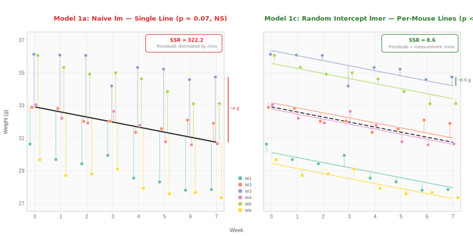
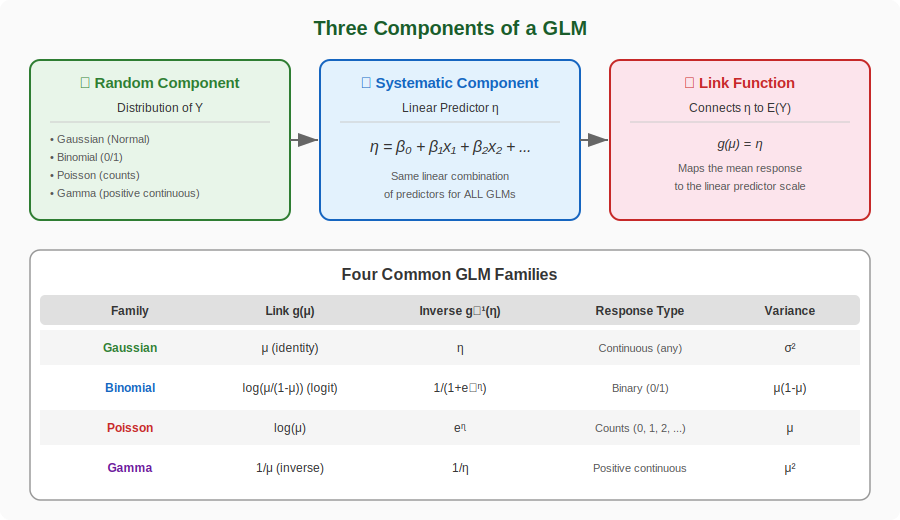
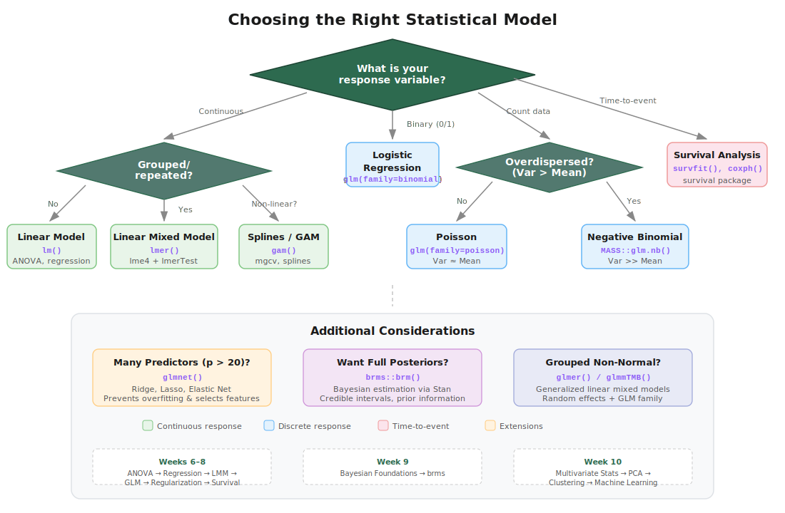
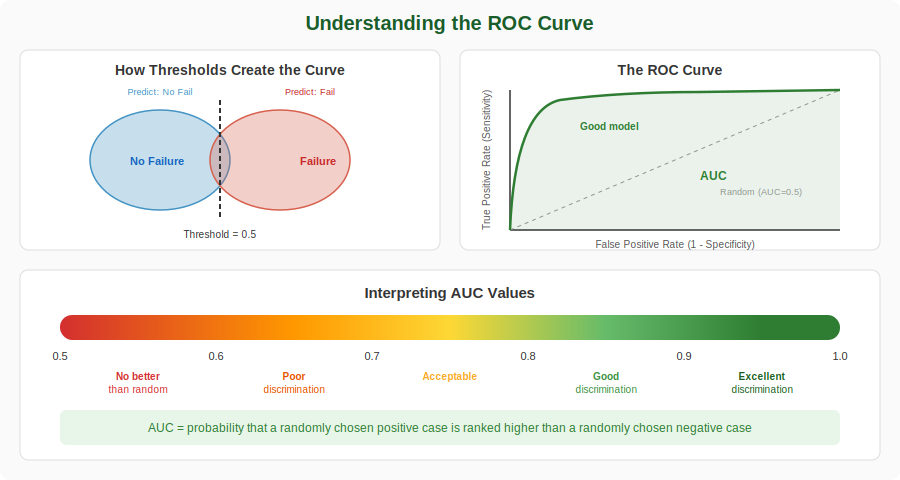
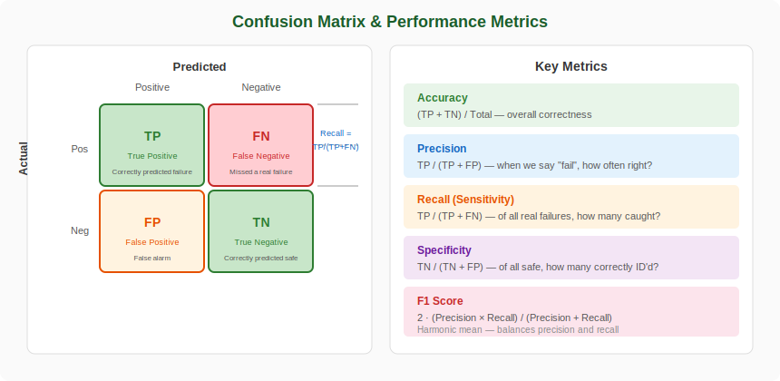
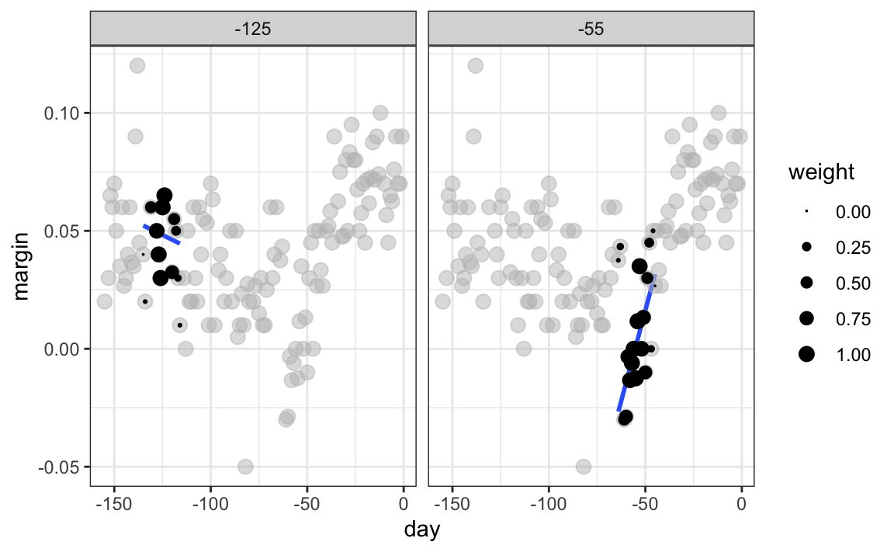

```{r}
#| label: setup
#| include: false

# Core data manipulation and visualization
library(tidyverse)
library(knitr)
library(readxl)

# Mixed models
library(lme4)
library(lmerTest)
library(emmeans)
library(broom.mixed)
library(performance)
library(patchwork)

# Statistical analysis packages
library(MASS)        # LDA, robust regression
library(pwr)         # Power analysis
library(boot)        # Bootstrap methods
library(car)         # Companion to Applied Regression
library(survival)    # Survival analysis
library(broom)       # Tidy model output
library(splines)     # Natural splines
library(DHARMa)      # Simulation-based GLM diagnostics
library(mgcv)        # Generalized additive models

# Set consistent theme for all plots
theme_set(theme_minimal(base_size = 14))

# Set seed for reproducibility
set.seed(2026)
```

# Week 8: GLMs, Regularization, and Survival Analysis {background-color="#d4edda"}

## Week 8 Topics

::: incremental
-   Finish Linear Mixed Models
-   Generalized Linear Models (Logistic and Poisson regression)
-   LOESS smoothing and Splines
-   Regularization methods (Ridge, Lasso, Elastic Net)
-   Survival analysis
:::

::: callout-note
**Readings:** Chapter 29

**HW4 Due next week**
:::

## Packages for This Week

::: panel-tabset
### Install

```{r}
#| eval: false
#| echo: true

# Install new packages (run once)
install.packages(c("lme4", "lmerTest", "emmeans", "broom.mixed",
                    "performance", "patchwork", "survival", 
                    "glmnet", "mgcv", "splines", "DHARMa", "pROC"))
```

### Load

```{r}
#| eval: false
#| echo: true

# Mixed models (replacing nlme with lme4 ecosystem)
library(lme4)         # lmer() — fits linear mixed models
library(lmerTest)     # Adds p-values via Satterthwaite df
library(emmeans)      # Estimated marginal means & contrasts
library(broom.mixed)  # Tidy output for mixed models
library(performance)  # check_model() diagnostics

# Other analysis packages
library(survival)     # Survival analysis (Kaplan-Meier, Cox)
library(glmnet)       # Regularized regression (LASSO, ridge)
library(mgcv)         # Generalized additive models (GAMs)
library(splines)      # Spline basis functions
library(DHARMa)       # Simulation-based GLM diagnostics
library(pROC)         # ROC curves and AUC
```
:::

**Datasets for This Week:**

-   `glp1_simple.csv`
-   `glp1_diet.csv`
-   `scaffold_degradation_data.csv`

**Additional datasets from packages**:

-   `lung` (survival package)

# Finish Linear Mixed Models {background-color="#d4edda"}

## Where We Left Off

Last week we introduced the concept of linear mixed models — models that partition variability into

-   **fixed effects** (treatments you manipulate) and
-   **random effects** (nuisance grouping variables like subjects, batches, or labs).

Today we'll build intuition for *why* mixed models work by starting with a simple example and progressively adding complexity.

::: callout-tip
### Key Insight

The core idea: subjects (mice, batches, patients) differ from each other in systematic ways. If we ignore this, we either

-   waste degrees of freedom (treating each subject as a fixed effect) or
-   inflate Type I error (ignoring the grouping entirely).

Mixed models solve both problems.
:::

## Fixed vs. Random Effects — A Quick Review

::::: columns
::: {.column width="48%"}
**Fixed Effects**

-   Specific, repeatable levels
-   You care about *these* levels
-   Treatment conditions, drug doses, scaffold coatings
-   Estimated as regression coefficients (β)
:::

::: {.column width="48%"}
**Random Effects**

-   Levels are a *sample* from a larger population
-   You care about the *variability*, not specific levels
-   Batches, labs, technicians, patients
-   Estimated as variance components (σ²)
:::
:::::

::: callout-tip
### Rule of Thumb

Ask: "If I repeated this experiment, would I use *these exact same* levels?" If yes → fixed. If you'd get a new random sample → random.
:::

## The Mixed Model Equation

$$\mathbf{y} = \mathbf{X}\boldsymbol{\beta} + \mathbf{Z}\mathbf{u} + \boldsymbol{\varepsilon}$$

Where:

::: incremental
-   $\mathbf{y}$ — vector of observed responses (degradation rates)
-   $\mathbf{X}\boldsymbol{\beta}$ — fixed effects (treatment, temperature, their interaction)
-   $\mathbf{Z}\mathbf{u}$ — random effects, where $\mathbf{u} \sim N(\mathbf{0}, \mathbf{G})$
-   $\boldsymbol{\varepsilon}$ — residual error, where $\boldsymbol{\varepsilon} \sim N(\mathbf{0}, \mathbf{R})$
-   Random effects **shrink** estimates toward the grand mean — partial pooling
:::

# Starting simple - putting mice on a diet drug

## GLP-1 Weight Loss Study in Mice

We'll work through two versions of a GLP-1 receptor agonist weight loss experiment.

-   **Simple version:**

    -   6 mice, all on GLP-1
    -   weighed weekly for 7 weeks
    -   introduces random intercepts

-   **Extended version:**

    -   12 mice on GLP-1
    -   half on high-protein diet and half on low-protein diet
    -   weighed weekly for 7 weeks
    -   introduces random slopes and treatment interactions

For each, we'll fit three models of increasing sophistication and compare how well they capture the data structure.

## The Experiment - random intercepts

-   Six mice are placed on a GLP-1 receptor agonist (semaglutide).
-   Each mouse is weighed weekly for 7 weeks.
-   All mice lose weight over time, but they start at different baseline weights and lose weight at slightly different rates.

**The statistical question:** Is there a significant decline in weight over the 7-week treatment period?

**The complication:** Repeated measurements on the same mouse are not independent — each mouse has its own baseline weight, creating within-subject correlation.

## Read in the Dataset

::: panel-tabset
### Output

```{r}
#| label: glp1-data-output
#| echo: false

glp1_simple <- read.csv("data/glp1_simple.csv")
glp1_simple$mouse_id <- factor(glp1_simple$mouse_id)

cat("Dimensions:", nrow(glp1_simple), "rows ×", ncol(glp1_simple), "columns\n\n")
head(glp1_simple, 12) %>% kable(digits = 1)
```

### Code

```{r}
#| label: glp1-data-code
#| echo: true
#| eval: false

# Read the GLP-1 simple dataset
glp1_simple <- read.csv("data/glp1_simple.csv")
glp1_simple$mouse_id <- factor(glp1_simple$mouse_id)

str(glp1_simple)
head(glp1_simple)
```

### Explanation

-   6 mice (M1–M6), each weighed weekly for 7 weeks (weeks 0–7), yielding 48 observations
-   Each mouse starts at a different baseline weight (\~29–37 g)
-   All mice lose weight at approximately 0.31 g/week, with small individual variation
-   Residual measurement noise is roughly 0.5 g
-   This creates the classic repeated-measures structure: observations nested within subjects, with both between-subject and within-subject variability
:::

## Visualize the Data

::: panel-tabset
### Output

```{r}
#| label: glp1-viz-output
#| echo: false
#| fig-width: 9
#| fig-height: 5

ggplot(glp1_simple, aes(x = week, y = weight, color = mouse_id, group = mouse_id)) +
  geom_line(alpha = 0.6, linewidth = 0.8) +
  geom_point(size = 2, alpha = 0.7) +
  scale_color_brewer(palette = "Set2") +
  labs(
    title = "GLP-1 Weight Loss Study: 6 Mice Over 7 Weeks",
    subtitle = "Each line represents one mouse — note different starting weights",
    x = "Week", y = "Weight (g)", color = "Mouse"
  )
```

### Code

```{r}
#| label: glp1-viz-code
#| echo: true
#| eval: false

ggplot(glp1_simple, aes(x = week, y = weight, 
                         color = mouse_id, group = mouse_id)) +
  geom_line(alpha = 0.6, linewidth = 0.8) +
  geom_point(size = 2, alpha = 0.7) +
  scale_color_brewer(palette = "Set2") +
  labs(title = "GLP-1 Weight Loss Study: 6 Mice Over 7 Weeks",
       x = "Week", y = "Weight (g)", color = "Mouse")
```

### Explanation

-   All mice show a clear downward trend — the GLP-1 drug is working
-   But the lines are separated vertically — mice start at different weights (M1 may be heavier than M6)
-   The lines are roughly parallel, suggesting similar rates of weight loss
-   A standard `lm()` that ignores mouse identity would treat all 48 points as independent, which they clearly aren't
:::

## Model 1a: Ignoring the Mouse Effect (Naive linear model)

::: panel-tabset
### Output

```{r}
#| label: glp1-naive-output
#| echo: false

mod_naive <- lm(weight ~ week, data = glp1_simple)
summary(mod_naive)
```

### Code

```{r}
#| label: glp1-naive-code
#| echo: true
#| eval: false

# Naive approach: ignore that mice are different
mod_naive <- lm(weight ~ week, data = glp1_simple)
summary(mod_naive)
```

### Explanation

-   This model treats all 48 observations as independent — it ignores the mouse grouping entirely
-   The slope estimate for `week` captures the average weight loss, but the residual variance is inflated because it includes **both** measurement noise **and** between-mouse variability
-   The $R^2$ is lower than it should be because the model can't explain why some points are consistently high (heavy mice) and others consistently low (light mice)
-   The standard error for the slope is so inflated that the effect of week is **not statistically significant** (p ≈ 0.07) — even though the drug is clearly working when you look at the plot!
:::

## Model 1b: Mouse as a Fixed Effect (naive factorial)

::: panel-tabset
### Output

```{r}
#| label: glp1-fixed-output
#| echo: false

mod_fixed <- lm(weight ~ week + mouse_id, data = glp1_simple)
summary(mod_fixed)
```

### Code

```{r}
#| label: glp1-fixed-code
#| echo: true
#| eval: false

# Fixed effect for each mouse — separate intercept per mouse
mod_fixed <- lm(weight ~ week + mouse_id, data = glp1_simple)
summary(mod_fixed)
```

### Explanation

-   Adding `mouse_id` as a fixed effect gives each mouse its own intercept — this is the "parallel slopes" model
-   The $R^2$ jumps dramatically because we can now explain the between-mouse differences
-   The residual standard error drops because we've removed the between-mouse variance from the residuals
-   **The problem:** this uses 5 extra degrees of freedom (one per additional mouse) just for a nuisance variable. With 6 mice this is manageable, but imagine 100 subjects — you'd burn 99 df on intercepts you don't care about. And you can't generalize: these specific intercepts only apply to *these* 6 mice.
:::

## Model 1c: Random Intercept Model Using `lmer`

::: panel-tabset
### Output

```{r}
#| label: glp1-lmer-output
#| echo: false

mod_ri <- lmer(weight ~ week + (1 | mouse_id), data = glp1_simple)
summary(mod_ri)
```

### Code

```{r}
#| label: glp1-lmer-code
#| echo: true
#| eval: false

# Random intercept model — mouse as random effect
mod_ri <- lmer(weight ~ week + (1 | mouse_id), data = glp1_simple)
summary(mod_ri)
```

### Explanation

-   `(1 | mouse_id)` tells the model that each mouse has its own random baseline, drawn from a normal distribution
-   Instead of estimating 6 separate intercepts, we estimate **one variance parameter** ($\sigma^2_{mouse}$) — far more efficient
-   The fixed effect of `week` is the population-average slope — it applies to any mouse from this population, not just these 6
-   The random effects table shows how much variance is attributable to between-mouse differences vs. within-mouse residual noise
-   The **Intraclass Correlation (ICC)** = $\frac{\sigma^2_{mouse}}{\sigma^2_{mouse} + \sigma^2_{resid}}$ tells you what proportion of the total variance is between mice
:::

## The Core Insight: Where Do the Residuals Come From?

::: panel-tabset
### Residual comparison

{fig-align="center" width="95%"}

::: {.aside}
Source: Lecture material
:::

### Interpretation

-   On the left, the naive model fits **one line** so the residuals are larger.
-   On the right, the mixed model gives **each mouse its own line** and the residuals shrink to tiny measurement noise.
-   The naive model's residuals are dominated by **between-mouse differences**.
-   The mixed model removes this systematic component, leaving only random measurement noise.
-   That 37-fold reduction in SSR is what transforms the standard error from 0.17 to 0.03 and flips the p-value from **0.07 (NS) to \< 0.001**.
:::

## Comparing Residuals Across the Three Models

::: panel-tabset
### Output

```{r}
#| label: glp1-resid-compare-output
#| echo: false
#| fig-width: 10
#| fig-height: 7

# Compute residuals for each model
glp1_simple$resid_naive <- resid(mod_naive)
glp1_simple$resid_fixed <- resid(mod_fixed)
glp1_simple$resid_lmer  <- resid(mod_ri)

# Compute SSR for each
ssr_naive <- sum(glp1_simple$resid_naive^2)
ssr_fixed <- sum(glp1_simple$resid_fixed^2)
ssr_lmer  <- sum(glp1_simple$resid_lmer^2)

p1 <- ggplot(glp1_simple, aes(x = week, y = resid_naive, color = mouse_id)) +
  geom_point(size = 2) + geom_hline(yintercept = 0, lty = 2) +
  scale_color_brewer(palette = "Set2") +
  labs(title = paste0("Naive lm — SSR = ", round(ssr_naive, 1)),
       x = "Week", y = "Residual") +
  theme(legend.position = "none") +
  ylim(-8, 8)

p2 <- ggplot(glp1_simple, aes(x = week, y = resid_fixed, color = mouse_id)) +
  geom_point(size = 2) + geom_hline(yintercept = 0, lty = 2) +
  scale_color_brewer(palette = "Set2") +
  labs(title = paste0("Fixed Mouse Effect — SSR = ", round(ssr_fixed, 1)),
       x = "Week", y = "Residual") +
  theme(legend.position = "none") +
  ylim(-8, 8)

p3 <- ggplot(glp1_simple, aes(x = week, y = resid_lmer, color = mouse_id)) +
  geom_point(size = 2) + geom_hline(yintercept = 0, lty = 2) +
  scale_color_brewer(palette = "Set2") +
  labs(title = paste0("Random Intercept (lmer) — SSR = ", round(ssr_lmer, 1)),
       x = "Week", y = "Residual") +
  theme(legend.position = "none") +
  ylim(-8, 8)

p1 / p2 / p3
```

### Code

```{r}
#| label: glp1-resid-compare-code
#| echo: true
#| eval: false

# Compute residuals
glp1_simple$resid_naive <- resid(mod_naive)
glp1_simple$resid_fixed <- resid(mod_fixed)
glp1_simple$resid_lmer  <- resid(mod_ri)

# Sum of squared residuals
cat("SSR (naive):", sum(glp1_simple$resid_naive^2), "\n")
cat("SSR (fixed):", sum(glp1_simple$resid_fixed^2), "\n")
cat("SSR (lmer): ", sum(glp1_simple$resid_lmer^2), "\n")
```

### Explanation

-   **Top panel (naive):** Residuals are large and show clear color clustering — heavy mice have positive residuals, light mice have negative. The model is confusing between-mouse variation with treatment effects.
-   **Middle panel (fixed):** Adding mouse as a fixed effect removes the clustering. Residuals are now centered around zero for each mouse. SSR drops dramatically.
-   **Bottom panel (lmer):** The random intercept model achieves nearly identical residuals to the fixed-effect model, but uses far fewer parameters. The SSR values are very similar because both approaches account for the between-mouse variation.
-   The key insight: the random intercept model is just as good at explaining the data, but it's more **parsimonious** and allows **generalization** to new mice.
:::

## Summary: Example 1 Model Comparison

::: panel-tabset
### Output

```{r}
#| label: glp1-summary-output
#| echo: false

# Extract key statistics
naive_coefs <- summary(mod_naive)$coefficients
fixed_coefs <- summary(mod_fixed)$coefficients
lmer_coefs  <- summary(mod_ri)$coefficients

# Build comparison table
comparison_df <- data.frame(
  Model = c("Naive lm", "Fixed Mouse Effect", "Random Intercept (lmer)"),
  Week_Estimate = c(naive_coefs["week", "Estimate"],
                     fixed_coefs["week", "Estimate"],
                     lmer_coefs["week", "Estimate"]),
  Week_SE = c(naive_coefs["week", "Std. Error"],
               fixed_coefs["week", "Std. Error"],
               lmer_coefs["week", "Std. Error"]),
  Week_p = c(naive_coefs["week", "Pr(>|t|)"],
              fixed_coefs["week", "Pr(>|t|)"],
              lmer_coefs["week", "Pr(>|t|)"]),
  Residual_df = c(mod_naive$df.residual,
                   mod_fixed$df.residual,
                   NA),
  SSR = c(sum(resid(mod_naive)^2),
          sum(resid(mod_fixed)^2),
          sum(resid(mod_ri)^2))
)

comparison_df %>%
  mutate(across(c(Week_Estimate, Week_SE, SSR), ~round(., 2)),
         Week_p = format.pval(Week_p, digits = 3)) %>%
  kable(col.names = c("Model", "β(week)", "SE", "p-value", "Resid. df", "SSR"))
```

### Explanation

-   All three models agree on the direction and approximate magnitude of the weekly weight loss
-   The **naive model** has a dramatically inflated SE because between-mouse variance is lumped into the residual — this makes the slope *non-significant* (p ≈ 0.07) even though the drug is clearly working
-   The **fixed mouse model** removes between-mouse variance, producing a much smaller SE and a significant result — but it burns df on nuisance parameters and can't generalize
-   The **lmer model** achieves the same SE reduction more efficiently: by modeling mouse as a random effect it partitions out the between-mouse variance, correctly identifies the significant weight loss trend, and generalizes to the population of mice
-   **This is the key lesson:** when between-subject variance is large relative to the treatment effect, ignoring the grouping structure can cause you to *miss* a real effect. The mixed model recovers the power you lose by properly accounting for the data structure.
:::

# Example 2: GLP-1 with Two Diet Groups {background-color="#d4edda"}

## Extending the Design

Now suppose we have

-   12 mice, all on GLP-1
-   but randomized into two diet groups:
    -   6 on a **high-protein diet**
    -   6 on a **low-protein diet**
-   We measure weight weekly for 7 weeks

**The statistical question:** Does diet type affect the rate of GLP-1-induced weight loss?

**Why this matters:** Each mouse has its own starting weight (random intercept) and may respond differently to the diet (random slope). We need to account for both sources of individual variation to correctly test the diet effect.

## Generate the Two-Diet Dataset

::: panel-tabset
### Output

```{r}
#| label: glp1-diet-data-output
#| echo: false

glp1_diet <- read.csv("data/glp1_diet.csv")
glp1_diet$mouse_id <- factor(glp1_diet$mouse_id)
glp1_diet$diet <- factor(glp1_diet$diet)

cat("Dimensions:", nrow(glp1_diet), "rows ×", ncol(glp1_diet), "columns\n\n")
head(glp1_diet, 12) %>% kable(digits = 1)
```

### Code

```{r}
#| label: glp1-diet-data-code
#| echo: true
#| eval: false

# Read the GLP-1 diet dataset
glp1_diet <- read.csv("data/glp1_diet.csv")
glp1_diet$mouse_id <- factor(glp1_diet$mouse_id)
glp1_diet$diet <- factor(glp1_diet$diet)

str(glp1_diet)
head(glp1_diet)
```

### Explanation

-   12 mice total: 6 per diet group, each weighed weekly for 7 weeks (96 observations)
-   High-protein mice lose \~0.30 g/week; low-protein mice lose \~0.55 g/week
-   Individual mice vary around their group mean slope — this is the random slope variability
-   Starting weights vary between mice — the random intercept
-   Both individual intercept and slope variation need to be modeled to get correct inference about the diet effect
:::

## Visualize the Two-Diet Data

::: panel-tabset
### Output

```{r}
#| label: glp1-diet-viz-output
#| echo: false
#| fig-width: 10
#| fig-height: 5

ggplot(glp1_diet, aes(x = week, y = weight, color = mouse_id, 
                       linetype = diet, group = mouse_id)) +
  geom_line(alpha = 0.6, linewidth = 0.8) +
  geom_point(size = 1.5, alpha = 0.7) +
  facet_wrap(~diet) +
  labs(
    title = "GLP-1 + Diet Study: 12 Mice Over 7 Weeks",
    subtitle = "Low-protein mice show steeper weight loss trajectories",
    x = "Week", y = "Weight (g)", color = "Mouse"
  ) +
  theme(legend.position = "none")
```

### Code

```{r}
#| label: glp1-diet-viz-code
#| echo: true
#| eval: false

ggplot(glp1_diet, aes(x = week, y = weight, color = mouse_id,
                       group = mouse_id)) +
  geom_line(alpha = 0.6, linewidth = 0.8) +
  geom_point(size = 1.5, alpha = 0.7) +
  facet_wrap(~diet) +
  labs(title = "GLP-1 + Diet Study",
       x = "Week", y = "Weight (g)")
```

### Explanation

-   Both groups lose weight, but the **low-protein group** shows steeper decline
-   Within each group, mice start at different weights (random intercepts) and the lines aren't perfectly parallel (random slopes)
-   The difference in slopes between groups is the **diet × week interaction** — the key scientific question
:::

## Model 2a: Naive lm (Ignoring Mice)

::: panel-tabset
### Output

```{r}
#| label: diet-naive-output
#| echo: false

mod2_naive <- lm(weight ~ week * diet, data = glp1_diet)
summary(mod2_naive)
```

### Code

```{r}
#| label: diet-naive-code
#| echo: true
#| eval: false

mod2_naive <- lm(weight ~ week * diet, data = glp1_diet)
summary(mod2_naive)
```

### Explanation

-   The `week:diet` interaction tests whether the slopes differ between diet groups
-   But this model treats all 96 observations as independent — it doesn't know that the 8 measurements on mouse M1 are correlated
-   This inflates the effective sample size and can produce **spuriously significant** results
-   The standard error for the interaction term is artificially small
:::

## Model 2b: Parallel Slopes with Mouse as Fixed Effect

::: panel-tabset
### Output

```{r}
#| label: diet-fixed-output
#| echo: false

mod2_fixed <- lm(weight ~ week * diet + mouse_id, data = glp1_diet)
summary(mod2_fixed)
```

### Code

```{r}
#| label: diet-fixed-code
#| echo: true
#| eval: false

# Fixed intercept per mouse + diet interaction with week
mod2_fixed <- lm(weight ~ week * diet + mouse_id, data = glp1_diet)
summary(mod2_fixed)
```

### Explanation

-   Each mouse gets its own intercept, accounting for different starting weights
-   The `week:diet` interaction still tests slope differences between diets
-   **Problem 1:** We use 11 extra df for mouse intercepts — a nuisance variable
-   **Problem 2:** This model assumes all mice within a diet group have the *same* slope. If mice actually differ in their response rate, this model underestimates uncertainty
-   **Problem 3:** We can't generalize — these intercepts apply only to these 12 mice
:::

## Model 2c: Random Intercept and Random Slope

::: panel-tabset
### Output

```{r}
#| label: diet-lmer-output
#| echo: false

mod2_ri  <- lmer(weight ~ week * diet + (1 | mouse_id), data = glp1_diet)
mod2_ris <- lmer(weight ~ week * diet + (1 + week | mouse_id), data = glp1_diet)
summary(mod2_ris)
```

### Code

```{r}
#| label: diet-lmer-code
#| echo: true
#| eval: false

# Random intercept only
mod2_ri  <- lmer(weight ~ week * diet + (1 | mouse_id), 
                  data = glp1_diet)

# Random intercept AND random slope for week
mod2_ris <- lmer(weight ~ week * diet + (1 + week | mouse_id), 
                  data = glp1_diet)
summary(mod2_ris)
```

### Explanation

-   `(1 + week | mouse_id)` gives each mouse its own intercept *and* its own rate of weight change
-   The model estimates the variance of the random intercepts, the variance of the random slopes, and their correlation
-   A negative intercept-slope correlation would mean heavier mice lose weight faster — this is a biologically interpretable parameter
-   The fixed effect `week:dietLow_Protein` tests the population-level diet difference in slopes, properly accounting for individual variation
-   This is the **most appropriate model** because it respects the full data structure
:::

## Comparing Residuals: Two-Diet Models

::: panel-tabset
### Output

```{r}
#| label: diet-resid-compare-output
#| echo: false
#| fig-width: 10
#| fig-height: 7

glp1_diet$resid_naive <- resid(mod2_naive)
glp1_diet$resid_fixed <- resid(mod2_fixed)
glp1_diet$resid_lmer  <- resid(mod2_ris)

ssr2_naive <- sum(glp1_diet$resid_naive^2)
ssr2_fixed <- sum(glp1_diet$resid_fixed^2)
ssr2_lmer  <- sum(glp1_diet$resid_lmer^2)

p1 <- ggplot(glp1_diet, aes(x = week, y = resid_naive, color = diet)) +
  geom_point(size = 1.5, alpha = 0.6) + geom_hline(yintercept = 0, lty = 2) +
  scale_color_manual(values = c("High_Protein" = "#4393c3", "Low_Protein" = "#d6604d")) +
  labs(title = paste0("Naive lm — SSR = ", round(ssr2_naive, 1)),
       x = "Week", y = "Residual") +
  theme(legend.position = "none") + ylim(-8, 8)

p2 <- ggplot(glp1_diet, aes(x = week, y = resid_fixed, color = diet)) +
  geom_point(size = 1.5, alpha = 0.6) + geom_hline(yintercept = 0, lty = 2) +
  scale_color_manual(values = c("High_Protein" = "#4393c3", "Low_Protein" = "#d6604d")) +
  labs(title = paste0("Fixed Mouse Effect — SSR = ", round(ssr2_fixed, 1)),
       x = "Week", y = "Residual") +
  theme(legend.position = "none") + ylim(-8, 8)

p3 <- ggplot(glp1_diet, aes(x = week, y = resid_lmer, color = diet)) +
  geom_point(size = 1.5, alpha = 0.6) + geom_hline(yintercept = 0, lty = 2) +
  scale_color_manual(values = c("High_Protein" = "#4393c3", "Low_Protein" = "#d6604d")) +
  labs(title = paste0("Random Intercept + Slope (lmer) — SSR = ", round(ssr2_lmer, 1)),
       x = "Week", y = "Residual") +
  theme(legend.position = "none") + ylim(-8, 8)

p1 / p2 / p3
```

### Explanation

-   **Naive model:** Residuals are large because between-mouse variation is treated as noise
-   **Fixed mouse model:** Residuals shrink but still show some patterning because the parallel-slopes assumption forces all mice within a group to share one slope
-   **Random slope model (lmer):** The smallest residuals — each mouse gets its own trajectory, and the model properly separates individual variation from the diet effect
-   The progressive SSR reduction shows that each model captures more of the systematic variation in the data
:::

## Summary: Example 2 Model Comparison

::: panel-tabset
### Output

```{r}
#| label: diet-summary-output
#| echo: false

# Extract interaction coefficients
naive_int  <- summary(mod2_naive)$coefficients
fixed_int  <- summary(mod2_fixed)$coefficients
lmer_int   <- summary(mod2_ris)$coefficients

# Diet × week interaction row
comp2 <- data.frame(
  Model = c("Naive lm", "Fixed Mouse", "Random Int+Slope (lmer)"),
  Interaction_Est = c(
    naive_int["week:dietLow_Protein", "Estimate"],
    fixed_int["week:dietLow_Protein", "Estimate"],
    lmer_int["week:dietLow_Protein", "Estimate"]
  ),
  Interaction_SE = c(
    naive_int["week:dietLow_Protein", "Std. Error"],
    fixed_int["week:dietLow_Protein", "Std. Error"],
    lmer_int["week:dietLow_Protein", "Std. Error"]
  ),
  Interaction_p = c(
    naive_int["week:dietLow_Protein", "Pr(>|t|)"],
    fixed_int["week:dietLow_Protein", "Pr(>|t|)"],
    lmer_int["week:dietLow_Protein", "Pr(>|t|)"]
  ),
  SSR = c(
    sum(resid(mod2_naive)^2),
    sum(resid(mod2_fixed)^2),
    sum(resid(mod2_ris)^2)
  )
)

comp2 %>%
  mutate(across(c(Interaction_Est, Interaction_SE, SSR), ~round(., 2)),
         Interaction_p = format.pval(Interaction_p, digits = 3)) %>%
  kable(col.names = c("Model", "β(week×diet)", "SE", "p-value", "SSR"))
```

### Explanation

-   All models estimate a similar interaction effect (the difference in slopes between diets)
-   The **naive model** has the smallest SE — but this is misleadingly small because it treats all 96 observations as independent
-   The **lmer model** has a larger (and more honest) SE that accounts for within-mouse correlation
-   The lmer p-value is the one you should report — it properly accounts for the fact that you have 12 independent experimental units (mice), not 96
-   If the naive model gives p \< 0.001 and the lmer gives p = 0.04, both are "significant," but the naive model gives you false confidence in the precision of the estimate
:::

## The Big Picture: Why Mixed Models Matter

::: callout-important
### Three Models, Three Philosophies

1.  **Naive `lm()`**: Pretend all observations are independent. Fast, simple, wrong. Can inflate Type I error *or* reduce power depending on the design — as we saw, the simple GLP-1 model *missed* a real effect because between-mouse variance swamped the signal.
2.  **Fixed effects `lm()` + subject**: Give each subject its own intercept. Correct residuals, but wastes df and can't generalize.
3.  **Mixed model `lmer()`**: Treat subjects as random draws from a population. Efficient, generalizable, and honest about uncertainty.

The mixed model is the right tool whenever your data has a grouping structure — which in bioengineering, it almost always does.
:::

## Post-Hoc: Comparing Diet Slopes with emmeans

::: panel-tabset
### Output

```{r}
#| label: glp1-diet-emmeans-output
#| echo: false
#| fig-width: 9
#| fig-height: 5

library(emmeans)

# Compare the weekly weight-loss slopes between diet groups
diet_trends <- emtrends(mod2_ris, pairwise ~ diet, var = "week")

cat("=== Estimated Slopes by Diet ===\n")
summary(diet_trends$emtrends)

cat("\n=== Pairwise Comparison of Slopes ===\n")
summary(diet_trends$contrasts)

# Plot
trend_df <- as.data.frame(diet_trends$emtrends)
ggplot(trend_df, aes(x = diet, y = week.trend, color = diet)) +
  geom_point(size = 4) +
  geom_errorbar(aes(ymin = lower.CL, ymax = upper.CL),
                width = 0.15, linewidth = 1) +
  geom_hline(yintercept = 0, lty = 2, color = "gray50") +
  scale_color_manual(values = c("High_Protein" = "#4393c3", "Low_Protein" = "#d6604d")) +
  labs(title = "Weight Loss Rate by Diet Group",
       subtitle = "Estimated slope (g/week) from mixed model with 95% CI",
       x = "Diet Group", y = "Weight Change (g/week)") +
  theme(legend.position = "none")
```

### Code

```{r}
#| label: glp1-diet-emmeans-code
#| echo: true
#| eval: false

library(emmeans)

# Compare the weekly weight-loss slopes between diet groups
diet_trends <- emtrends(mod2_ris, pairwise ~ diet, var = "week")

# View slopes
diet_trends$emtrends

# Pairwise comparison
diet_trends$contrasts
```

### Explanation

-   `emtrends()` estimates the slope (rate of weight change per week) for each diet group from the mixed model
-   The pairwise contrast tests whether the slopes differ significantly between high-protein and low-protein groups
-   Both slopes are negative (weight loss), but low-protein mice have a steeper decline
-   The confidence intervals come from the mixed model, so they properly account for within-mouse correlation
-   This is the mixed-model equivalent of testing the `week × diet` interaction, but expressed as a comparison of estimated rates
:::

# Applying lme4 to a Complex Bioengineering Design {background-color="#d4edda"}

## From Simple to Complex

The mouse GLP-1 examples had one random grouping factor (mouse). Real bioengineering experiments often have **multiple** sources of random variation:

-   **Batches** of manufactured scaffolds
-   **Labs** where experiments are conducted\
-   **Technicians** nested within labs

We'll now work through a realistic scaffold degradation experiment that demonstrates nested and crossed random effects, model comparison, and the full lme4/lmerTest workflow.

## The Scaffold Degradation Dataset {background-color="#d4edda"}

## Study Design

**Research Question:** How do scaffold coating type and incubation temperature affect scaffold degradation rate (percent mass loss over 28 days)?

| Factor | Type | Levels |
|----|----|----|
| `treatment` | Fixed | A_collagen, B_fibronectin, C_uncoated |
| `temperature` | Fixed | 37°C, 42°C |
| `batch` | Random | 6 manufacturing batches (crossed with lab) |
| `lab` | Random | 4 testing laboratories |
| `technician` | Random (nested in lab) | 10 technicians (2–3 per lab) |

**Replication:** 3 scaffolds per treatment × temperature × technician × batch = **1,080 observations**

## Load and Inspect the Data

::: panel-tabset
### Output

```{r}
#| label: load-data-output
#| echo: false

scaffold_data <- read.csv("data/scaffold_degradation_data.csv")
scaffold_data <- scaffold_data %>%
  mutate(
    treatment   = factor(treatment),
    temperature = factor(temperature),
    batch       = factor(batch),
    lab         = factor(lab),
    technician  = factor(technician)
  )

str(scaffold_data)
```

### Code

```{r}
#| label: load-data-code
#| echo: true
#| eval: false
#| code-line-numbers: "|1-2|4-11|13"

# Read the CSV
scaffold_data <- read.csv("data/scaffold_degradation_data.csv")

# Convert grouping variables to factors
scaffold_data <- scaffold_data %>%
  mutate(
    treatment   = factor(treatment),
    temperature = factor(temperature),
    batch       = factor(batch),
    lab         = factor(lab),
    technician  = factor(technician)
  )

str(scaffold_data)
```

### Explanation

-   All grouping variables must be converted to **factors** for `lmer()` to recognize them as categorical
-   `treatment` and `temperature` are fixed factors with specific, meaningful levels
-   `batch`, `lab`, and `technician` are random grouping factors
-   The `str()` output confirms 1,080 observations and proper factor encoding
:::

## Summary Statistics by Treatment and Temperature

::: panel-tabset
### Output

```{r}
#| label: summary-stats-output
#| echo: false

scaffold_data %>%
  group_by(treatment, temperature) %>%
  summarise(
    n    = n(),
    mean = round(mean(degradation), 1),
    sd   = round(sd(degradation), 1),
    .groups = "drop"
  ) %>%
  kable()
```

### Code

```{r}
#| label: summary-stats-code
#| echo: true
#| eval: false

scaffold_data %>%
  group_by(treatment, temperature) %>%
  summarise(
    n    = n(),
    mean = round(mean(degradation), 1),
    sd   = round(sd(degradation), 1),
    .groups = "drop"
  ) %>%
  kable()
```

### Explanation

-   Uncoated scaffolds at 42°C show the highest degradation — consistent with expectations
-   Collagen-coated scaffolds at 37°C show the lowest degradation
-   The standard deviations include **both** residual and random effect variability
-   We need mixed models to separate these variance sources
:::

## Visualize the Data

::: panel-tabset
### Output

```{r}
#| label: data-viz-output
#| echo: false

ggplot(scaffold_data, aes(x = treatment, y = degradation, fill = temperature)) +
  geom_boxplot(alpha = 0.7, outlier.size = 1) +
  scale_fill_manual(values = c("37C" = "#4393c3", "42C" = "#d6604d")) +
  labs(
    x = "Scaffold Coating",
    y = "Degradation (% mass loss)",
    fill = "Temperature",
    title = "Scaffold Degradation by Treatment and Temperature"
  ) +
  theme(axis.text.x = element_text(angle = 15, hjust = 1))
```

### Code

```{r}
#| label: data-viz-code
#| echo: true
#| eval: false
#| code-line-numbers: "|1|2|3|4-9"

ggplot(scaffold_data, aes(x = treatment, y = degradation, fill = temperature)) +
  geom_boxplot(alpha = 0.7, outlier.size = 1) +
  scale_fill_manual(values = c("37C" = "#4393c3", "42C" = "#d6604d")) +
  labs(
    x = "Scaffold Coating",
    y = "Degradation (% mass loss)",
    fill = "Temperature",
    title = "Scaffold Degradation by Treatment and Temperature"
  ) +
  theme(axis.text.x = element_text(angle = 15, hjust = 1))
```

### Explanation

-   The boxplots show a clear **treatment × temperature interaction** pattern
-   Uncoated scaffolds show a much larger temperature effect than collagen-coated
-   Notice the spread within each group — some of this is batch-to-batch and lab-to-lab variability
-   The mixed model will help us separate true treatment effects from random variation
:::

## Variability Across Random Groups

::: panel-tabset
### Output

```{r}
#| label: random-viz-output
#| echo: false

p1 <- ggplot(scaffold_data, aes(x = batch, y = degradation)) +
  geom_boxplot(fill = "#a6dba0", alpha = 0.7) +
  labs(x = "Batch", y = "Degradation", title = "Batch-to-Batch Variability") +
  theme(axis.text.x = element_text(angle = 45, hjust = 1))

p2 <- ggplot(scaffold_data, aes(x = lab, y = degradation)) +
  geom_boxplot(fill = "#c2a5cf", alpha = 0.7) +
  labs(x = "Lab", y = "Degradation", title = "Lab-to-Lab Variability")

p3 <- ggplot(scaffold_data, aes(x = technician, y = degradation)) +
  geom_boxplot(fill = "#fdcdac", alpha = 0.7) +
  labs(x = "Technician", y = "Degradation", title = "Technician Variability") +
  theme(axis.text.x = element_text(angle = 45, hjust = 1))

p1 + p2 + p3
```

### Code

```{r}
#| label: random-viz-code
#| echo: true
#| eval: false

p1 <- ggplot(scaffold_data, aes(x = batch, y = degradation)) +
  geom_boxplot(fill = "#a6dba0", alpha = 0.7) +
  labs(x = "Batch", y = "Degradation", title = "Batch-to-Batch Variability") +
  theme(axis.text.x = element_text(angle = 45, hjust = 1))

p2 <- ggplot(scaffold_data, aes(x = lab, y = degradation)) +
  geom_boxplot(fill = "#c2a5cf", alpha = 0.7) +
  labs(x = "Lab", y = "Degradation", title = "Lab-to-Lab Variability")

p3 <- ggplot(scaffold_data, aes(x = technician, y = degradation)) +
  geom_boxplot(fill = "#fdcdac", alpha = 0.7) +
  labs(x = "Technician", y = "Degradation", title = "Technician Variability") +
  theme(axis.text.x = element_text(angle = 45, hjust = 1))

p1 + p2 + p3  # patchwork combines plots
```

### Explanation

-   **Batch:** systematic shifts in degradation across manufacturing runs
-   **Lab:** some labs produce consistently higher or lower readings
-   **Technician:** individual variation within labs
-   These are exactly the sources of non-independence that mixed models capture
-   Using `lm()` would lump all this variability into the residual, inflating the error term and potentially missing real treatment effects
:::

# Model 1: Random Intercept Model {background-color="#d4edda"}

## Random Intercept — Accounting for Batch Variability

::: panel-tabset
### Output

```{r}
#| label: mod-ri-output
#| echo: false

mod_ri <- lmer(degradation ~ treatment * temperature + (1 | batch),
               data = scaffold_data)
summary(mod_ri)
```

### Code

```{r}
#| label: mod-ri-code
#| echo: true
#| eval: false

mod_ri <- lmer(degradation ~ treatment * temperature + (1 | batch),
               data = scaffold_data)
summary(mod_ri)
```

### Explanation

-   `degradation ~ treatment * temperature` — the fixed effects: main effects + interaction
-   `(1 | batch)` — a **random intercept** for batch
-   Each batch gets its own baseline offset from the grand mean
-   These offsets are assumed to follow $N(0, \sigma^2_{batch})$
-   The `Random effects` table shows the estimated $\sigma_{batch}$ and $\sigma_{residual}$
-   **Intraclass Correlation (ICC):** $\frac{\sigma^2_{batch}}{\sigma^2_{batch} + \sigma^2_{resid}}$ tells you what proportion of total variance is attributable to batch
:::

## Interpreting the Random Effects Table

::: panel-tabset
### Output

```{r}
#| label: ri-varcomp-output
#| echo: false

VarCorr(mod_ri)
```

### Code

```{r}
#| label: ri-varcomp-code
#| echo: true
#| eval: false

VarCorr(mod_ri)
```

### Explanation

-   `VarCorr()` extracts the variance component estimates
-   **Batch variance** ($\sigma^2_{batch}$): how much the average degradation shifts from batch to batch
-   **Residual variance** ($\sigma^2_{resid}$): leftover variability after accounting for fixed effects and batch
-   If batch variance is large relative to residual, batch is an important source of non-independence
-   These are REML (Restricted Maximum Likelihood) estimates — the default and usually preferred
:::

## ANOVA Table for Fixed Effects

::: panel-tabset
### Output

```{r}
#| label: ri-anova-output
#| echo: false

anova(mod_ri, type = 3)
```

### Code

```{r}
#| label: ri-anova-code
#| echo: true
#| eval: false

anova(mod_ri, type = 3)
```

### Explanation

-   `lmerTest` automatically provides F-tests with **Satterthwaite** degrees of freedom
-   Satterthwaite approximation adjusts the denominator df to account for the random effects structure
-   The `treatment:temperature` row tests the interaction — whether the temperature effect differs across coating types
-   Type 3 SS tests each effect adjusted for all others, appropriate when you have an interaction
-   Compare these p-values to what you would get from a standard `lm()` — the mixed model often has different (usually more conservative) conclusions
:::

# Model 2: Random Intercept and Random Slope {background-color="#d4edda"}

## Does the Temperature Effect Vary Across Batches?

::: panel-tabset
### Output

```{r}
#| label: mod-ris-output
#| echo: false

mod_ris <- lmer(degradation ~ treatment * temperature + 
                  (1 + temperature | batch),
                data = scaffold_data)
summary(mod_ris)
```

### Code

```{r}
#| label: mod-ris-code
#| echo: true
#| eval: false

mod_ris <- lmer(degradation ~ treatment * temperature + 
                  (1 + temperature | batch),
                data = scaffold_data)
summary(mod_ris)
```

### Explanation

-   `(1 + temperature | batch)` — **random intercept AND random slope** for temperature, grouped by batch
-   Each batch now gets its own baseline *and* its own temperature effect
-   The model estimates three variance parameters: $\sigma^2_{intercept}$, $\sigma^2_{slope}$, and the **correlation** between them
-   A positive correlation would mean batches with higher baseline degradation also show a bigger temperature effect
-   This is a more complex model — check whether it improves fit before adopting it
:::

## Removing the Intercept-Slope Correlation

::: panel-tabset
### Output

```{r}
#| label: mod-ris-nocorr-output
#| echo: false

mod_ris_nocorr <- lmer(degradation ~ treatment * temperature + 
                         (1 + temperature || batch),
                       data = scaffold_data)
VarCorr(mod_ris_nocorr)
```

### Code

```{r}
#| label: mod-ris-nocorr-code
#| echo: true
#| eval: false

# Use || instead of | to remove the correlation
mod_ris_nocorr <- lmer(degradation ~ treatment * temperature + 
                         (1 + temperature || batch),
                       data = scaffold_data)
VarCorr(mod_ris_nocorr)
```

### Explanation

-   `||` (double pipe) forces the random intercept and slope to be **uncorrelated**
-   This estimates a diagonal covariance matrix instead of a full matrix
-   Use this when you have few groups and the correlation is poorly estimated, or when the correlated model fails to converge
-   Compare AIC/BIC of the correlated vs. uncorrelated models to decide
:::

## Comparing Random Intercept vs. Random Slope Models

::: panel-tabset
### Output

```{r}
#| label: ri-vs-ris-output
#| echo: false

anova(mod_ri, mod_ris, refit = FALSE)
```

### Code

```{r}
#| label: ri-vs-ris-code
#| echo: true
#| eval: false

anova(mod_ri, mod_ris, refit = FALSE)
```

### Explanation

-   `anova()` on two `lmer` models performs a **likelihood ratio test** comparing nested models
-   `refit = FALSE` keeps the REML estimates — use this when comparing models that differ only in random effects
-   A significant p-value means the random slope significantly improves fit — the temperature effect truly varies across batches
-   Also compare **AIC** and **BIC**: lower values = better model (BIC penalizes complexity more)
-   If the random slope model fails to converge or has a near-zero slope variance, stick with the simpler random intercept model
:::

# Model 3: Nested Random Effects {background-color="#d4edda"}

## Technicians Nested Within Labs

::: panel-tabset
### Output

```{r}
#| label: mod-nested-output
#| echo: false

mod_nested <- lmer(degradation ~ treatment * temperature + 
                     (1 | lab) + (1 | lab:technician),
                   data = scaffold_data)
summary(mod_nested)
```

### Code

```{r}
#| label: mod-nested-code
#| echo: true
#| eval: false

mod_nested <- lmer(degradation ~ treatment * temperature + 
                     (1 | lab) + (1 | lab:technician),
                   data = scaffold_data)
summary(mod_nested)
```

### Explanation

-   `(1 | lab)` — random intercept for lab
-   `(1 | lab:technician)` — random intercept for technician **nested within** lab
-   The `lab:technician` interaction creates unique IDs: "Lab_1:Tech_1A" is distinct from "Lab_2:Tech_2A"
-   This is essential when technician IDs repeat across labs (Tech_1A in Lab 1 ≠ Tech_1A in Lab 2)
-   The random effects table will show three variance components: lab, technician-within-lab, and residual
:::

## Understanding Nesting Syntax

In `lme4`, nesting is specified via two terms:

$$\texttt{(1 | lab) + (1 | lab:technician)}$$

::: callout-important
### Common Mistake

If technician IDs are unique across labs (e.g., "Tech_1A", "Tech_2A"), then `(1 | lab) + (1 | technician)` works. But if technician is just coded as "1", "2", "3" in each lab, you **must** use `lab:technician` or the model treats all "Technician 1" entries as the same person!
:::

**Always check your data coding.** A safe practice is to always use `lab:technician` for nested designs, regardless of how the variable is coded.

# Model 4: Crossed Random Effects {background-color="#d4edda"}

## Batches Crossed with Labs

::: panel-tabset
### Output

```{r}
#| label: mod-crossed-output
#| echo: false

mod_crossed <- lmer(degradation ~ treatment * temperature + 
                      (1 | batch) + (1 | lab),
                    data = scaffold_data)
summary(mod_crossed)
```

### Code

```{r}
#| label: mod-crossed-code
#| echo: true
#| eval: false

mod_crossed <- lmer(degradation ~ treatment * temperature + 
                      (1 | batch) + (1 | lab),
                    data = scaffold_data)
summary(mod_crossed)
```

### Explanation

-   `(1 | batch) + (1 | lab)` — two **separate** random intercepts with no nesting relationship
-   This means every batch was tested in every lab (fully crossed)
-   `lme4` handles crossed random effects natively and efficiently
-   The model estimates independent variance components for batch and lab
-   **Crossed vs. Nested:** if every combination of batch × lab exists in your data, the design is crossed. If batches only appear within specific labs, it's nested.
:::

## Crossed vs. Nested — Visualizing the Difference

::::: columns
::: {.column width="48%"}
**Crossed Design**

|         | Lab 1 | Lab 2 | Lab 3 |
|---------|-------|-------|-------|
| Batch 1 | ✓     | ✓     | ✓     |
| Batch 2 | ✓     | ✓     | ✓     |
| Batch 3 | ✓     | ✓     | ✓     |

Every batch appears in every lab.

`(1 | batch) + (1 | lab)`
:::

::: {.column width="48%"}
**Nested Design**

|        | Lab 1 | Lab 2 | Lab 3 |
|--------|-------|-------|-------|
| Tech A | ✓     |       |       |
| Tech B | ✓     |       |       |
| Tech C |       | ✓     |       |
| Tech D |       | ✓     |       |
| Tech E |       |       | ✓     |

Each technician belongs to exactly one lab.

`(1 | lab) + (1 | lab:technician)`
:::
:::::

# Model 5: Full Mixed Model {background-color="#d4edda"}

## Combining Crossed and Nested Random Effects

::: panel-tabset
### Output

```{r}
#| label: mod-full-output
#| echo: false

mod_full <- lmer(degradation ~ treatment * temperature + 
                   (1 | batch) + 
                   (1 | lab) + 
                   (1 | lab:technician),
                 data = scaffold_data)
summary(mod_full)
```

### Code

```{r}
#| label: mod-full-code
#| echo: true
#| eval: false
#| code-line-numbers: "|1|2|3|4"

mod_full <- lmer(degradation ~ treatment * temperature + 
                   (1 | batch) +         # crossed with lab
                   (1 | lab) +           # lab-level variability
                   (1 | lab:technician), # technician nested in lab
                 data = scaffold_data)
summary(mod_full)
```

### Explanation

-   This is the **most appropriate model** for our experimental design
-   Three random variance components are estimated simultaneously: batch, lab, and technician-within-lab
-   Batch is **crossed** with lab (every batch tested in every lab)
-   Technician is **nested** within lab (each tech works in only one lab)
-   The fixed effects (treatment, temperature, interaction) are now tested against the correct error structure
:::

## Variance Components of the Full Model

::: panel-tabset
### Output

```{r}
#| label: full-varcomp-output
#| echo: false

vc <- as.data.frame(VarCorr(mod_full))

# Build clean table using base R (avoids MASS::select masking dplyr::select)
vc_clean <- data.frame(
  Group    = vc$grp,
  Variance = round(vc$vcov, 2),
  SD       = round(vc$sdcor, 2)
)
vc_clean$`% of Total` <- round(100 * vc_clean$Variance / sum(vc_clean$Variance), 1)
kable(vc_clean)
```

### Code

```{r}
#| label: full-varcomp-code
#| echo: true
#| eval: false

vc <- as.data.frame(VarCorr(mod_full))

# Build a clean variance component table
vc_clean <- data.frame(
  Group    = vc$grp,
  Variance = round(vc$vcov, 2),
  SD       = round(vc$sdcor, 2)
)
vc_clean$`% of Total` <- round(100 * vc_clean$Variance / 
                                  sum(vc_clean$Variance), 1)
kable(vc_clean)
```

### Explanation

-   The `% of Total` column shows each source's share of the total random variability
-   Large lab variance → substantial differences in how labs measure degradation
-   Moderate batch variance → manufacturing consistency matters
-   Small technician variance → good reproducibility within labs
-   The residual captures scaffold-to-scaffold variability after all grouping is accounted for
:::

## Fixed Effects — ANOVA Table

::: panel-tabset
### Output

```{r}
#| label: full-anova-output
#| echo: false

anova(mod_full, type = 3)
```

### Code

```{r}
#| label: full-anova-code
#| echo: true
#| eval: false

anova(mod_full, type = 3)
```

### Explanation

-   Satterthwaite degrees of freedom account for the complex random effects structure
-   Note the denominator df are often **non-integer** — this is expected and correct for mixed models
-   The treatment × temperature interaction tells us whether coating effectiveness depends on incubation temperature
-   Compare these results to the simpler models — the conclusions about fixed effects may change when the random structure is properly specified
:::

# Post-Hoc Analysis with emmeans {background-color="#d4edda"}

## Estimated Marginal Means

::: panel-tabset
### Output

```{r}
#| label: emmeans-output
#| echo: false

emm <- emmeans(mod_full, ~ treatment | temperature)
emm
```

### Code

```{r}
#| label: emmeans-code
#| echo: true
#| eval: false

emm <- emmeans(mod_full, ~ treatment | temperature)
emm
```

### Explanation

-   `emmeans()` computes **estimated marginal means** — the predicted mean for each treatment at each temperature, averaged over the random effects
-   `~ treatment | temperature` reads as "treatment means, separately at each temperature"
-   The standard errors account for the full random effects structure
-   These are more appropriate than raw group means for inference because they properly weight the data given the variance structure
:::

## Pairwise Comparisons

::: panel-tabset
### Output

```{r}
#| label: pairwise-output
#| echo: false

pairs(emm, adjust = "tukey")
```

### Code

```{r}
#| label: pairwise-code
#| echo: true
#| eval: false

pairs(emm, adjust = "tukey")
```

### Explanation

-   `pairs()` performs **pairwise contrasts** between treatments at each temperature level
-   Tukey adjustment controls the family-wise error rate across all comparisons
-   The `estimate` column shows the mean difference between coatings
-   A significant difference at 42°C but not 37°C would confirm the interaction — coating type matters more under heat stress
-   These contrasts use the Satterthwaite degrees of freedom from `lmerTest`
:::

## Visualizing Estimated Marginal Means

::: panel-tabset
### Output

```{r}
#| label: emmeans-plot-output
#| echo: false

emm_df <- as.data.frame(emm)

ggplot(emm_df, aes(x = treatment, y = emmean, color = temperature, group = temperature)) +
  geom_point(size = 3, position = position_dodge(width = 0.3)) +
  geom_errorbar(aes(ymin = lower.CL, ymax = upper.CL), 
                width = 0.15, position = position_dodge(width = 0.3)) +
  scale_color_manual(values = c("37C" = "#4393c3", "42C" = "#d6604d")) +
  labs(
    x = "Scaffold Coating",
    y = "Estimated Marginal Mean Degradation",
    color = "Temperature",
    title = "Treatment Effects with 95% Confidence Intervals"
  ) +
  theme(axis.text.x = element_text(angle = 15, hjust = 1))
```

### Code

```{r}
#| label: emmeans-plot-code
#| echo: true
#| eval: false

emm_df <- as.data.frame(emm)

ggplot(emm_df, aes(x = treatment, y = emmean, color = temperature, 
                    group = temperature)) +
  geom_point(size = 3, position = position_dodge(width = 0.3)) +
  geom_errorbar(aes(ymin = lower.CL, ymax = upper.CL), 
                width = 0.15, position = position_dodge(width = 0.3)) +
  scale_color_manual(values = c("37C" = "#4393c3", "42C" = "#d6604d")) +
  labs(
    x = "Scaffold Coating",
    y = "Estimated Marginal Mean Degradation",
    color = "Temperature",
    title = "Treatment Effects with 95% Confidence Intervals"
  )
```

### Explanation

-   Non-overlapping confidence intervals suggest significant differences
-   The gap between temperatures for uncoated scaffolds is visibly larger than for collagen-coated — that's the interaction
-   These intervals are based on the mixed model, so they account for the clustering in the data
-   This is the most informative plot for communicating your results
:::

# Model Diagnostics {background-color="#d4edda"}

## Residual Diagnostics

::: panel-tabset
### Output

```{r}
#| label: diagnostics-output
#| echo: false

par(mfrow = c(2, 2))

# Residuals vs fitted
plot(fitted(mod_full), resid(mod_full), 
     xlab = "Fitted Values", ylab = "Residuals",
     main = "Residuals vs Fitted", pch = 16, col = "#00000040")
abline(h = 0, col = "red", lty = 2)

# QQ plot of residuals
qqnorm(resid(mod_full), main = "Normal Q-Q: Residuals", pch = 16, col = "#00000040")
qqline(resid(mod_full), col = "red")

# QQ plot of random effects - batch
re_batch <- ranef(mod_full)$batch[,1]
qqnorm(re_batch, main = "Normal Q-Q: Batch RE", pch = 16, col = "#5ab4ac")
qqline(re_batch, col = "red")

# QQ plot of random effects - lab
re_lab <- ranef(mod_full)$lab[,1]
qqnorm(re_lab, main = "Normal Q-Q: Lab RE", pch = 16, col = "#af8dc3")
qqline(re_lab, col = "red")

par(mfrow = c(1, 1))
```

### Code

```{r}
#| label: diagnostics-code
#| echo: true
#| eval: false
#| code-line-numbers: "|1|3-6|8-10|12-14|16-18"

par(mfrow = c(2, 2))

# Residuals vs fitted
plot(fitted(mod_full), resid(mod_full), 
     xlab = "Fitted Values", ylab = "Residuals",
     main = "Residuals vs Fitted", pch = 16, col = "#00000040")
abline(h = 0, col = "red", lty = 2)

# QQ plot of residuals
qqnorm(resid(mod_full), main = "Normal Q-Q: Residuals", pch = 16, col = "#00000040")
qqline(resid(mod_full), col = "red")

# QQ plot of random effects - batch
re_batch <- ranef(mod_full)$batch[,1]
qqnorm(re_batch, main = "Normal Q-Q: Batch RE", pch = 16, col = "#5ab4ac")
qqline(re_batch, col = "red")

# QQ plot of random effects - lab
re_lab <- ranef(mod_full)$lab[,1]
qqnorm(re_lab, main = "Normal Q-Q: Lab RE", pch = 16, col = "#af8dc3")
qqline(re_lab, col = "red")

par(mfrow = c(1, 1))
```

### Explanation

-   **Residuals vs Fitted:** check for homoscedasticity (constant spread) and no systematic pattern
-   **QQ of Residuals:** check that residuals are approximately normally distributed
-   **QQ of Random Effects:** the random effects should also be normally distributed — with few groups (6 batches, 4 labs), some deviation is expected
-   These diagnostics are analogous to what you do for `lm()`, with the addition of checking random effect distributions
:::

## Random Effects Estimates (BLUPs)

::: panel-tabset
### Output

```{r}
#| label: ranef-output
#| echo: false

lattice::dotplot(ranef(mod_full, condVar = TRUE))
```

### Code

```{r}
#| label: ranef-code
#| echo: true
#| eval: false

# Caterpillar plots of random effects (BLUPs)
lattice::dotplot(ranef(mod_full, condVar = TRUE))
```

### Explanation

-   `ranef()` extracts the **Best Linear Unbiased Predictors** (BLUPs) for each random effect level
-   `condVar = TRUE` adds conditional variances, displayed as confidence intervals
-   `dotplot()` from `lattice` (loaded by lme4) produces caterpillar plots
-   Intervals that don't overlap zero indicate groups that are notably above or below the grand mean
-   These are **shrunken** estimates — pulled toward zero more when group sample sizes are small or group variance is small relative to residual variance
:::

# Model Selection and Comparison {background-color="#d4edda"}

## REML vs. ML: Why It Matters for Model Comparison

When fitting mixed models, `lmer()` uses **REML** (Restricted Maximum Likelihood) by default. Understanding the difference between REML and ML is critical for model comparison:

::::: columns
::: {.column width="48%"}
**REML (default)**

-   Adjusts for the number of fixed effects when estimating variance components
-   Produces **unbiased** estimates of variance — analogous to dividing by $n-1$ instead of $n$
-   The "restricted" likelihood is calculated after projecting out the fixed effects
:::

::: {.column width="48%"}
**ML** (`REML = FALSE`)

-   Estimates everything jointly — fixed effects and variance components together
-   Variance estimates are slightly biased downward (like dividing by $n$)
-   But the likelihood is a **true** likelihood that can be compared across models with different fixed effects
:::
:::::

## When to Use Which

::: callout-important
### The Comparison Rule

Because REML projects out the fixed effects before computing the likelihood, two models with **different fixed effects** have projected away *different things*. Their REML likelihoods are on different scales and **cannot be meaningfully compared**.

-   **Same fixed effects, different random** → compare with **REML** (default) — the projection is the same, so the likelihoods are comparable
-   **Different fixed effects, same random** → compare with **ML** (`REML = FALSE`) — you need a true likelihood
-   For final parameter estimates after model selection, refit the chosen model with **REML** for unbiased variance estimates
:::

::: panel-tabset
### Code

```{r}
#| eval: false
#| echo: true

# Comparing random structures (REML is fine — same fixed effects)
mod_a <- lmer(y ~ treatment * time + (1 | subject), data = d)
mod_b <- lmer(y ~ treatment * time + (1 + time | subject), data = d)
anova(mod_a, mod_b, refit = FALSE)  # keeps REML

# Comparing fixed structures (must use ML)
mod_c <- lmer(y ~ treatment * time + (1 | subject), data = d, REML = FALSE)
mod_d <- lmer(y ~ treatment + time + (1 | subject), data = d, REML = FALSE)
anova(mod_d, mod_c)  # ML likelihoods are comparable
```

### Interpretation

-   When comparing models with the same fixed effects but different random structures, REML likelihoods are comparable — use `refit = FALSE` to keep REML estimation
-   When comparing models with different fixed effects, you must use ML (`REML = FALSE`) because REML likelihoods are not comparable across different fixed-effect structures
-   After selecting the best model via ML comparison, refit the chosen model with REML for unbiased variance component estimates
-   The `anova()` function performs a likelihood ratio test between nested models — the p-value tests whether the more complex model fits significantly better
:::

## Comparing Models with Different Random Structures

::: panel-tabset
### Output

```{r}
#| label: model-compare-output
#| echo: false

mod_batch_only <- lmer(degradation ~ treatment * temperature + (1 | batch),
                       data = scaffold_data)
mod_lab_only   <- lmer(degradation ~ treatment * temperature + (1 | lab),
                       data = scaffold_data)
mod_both       <- lmer(degradation ~ treatment * temperature + (1 | batch) + (1 | lab),
                       data = scaffold_data)

AIC(mod_batch_only, mod_lab_only, mod_both, mod_full)
```

### Code

```{r}
#| label: model-compare-code
#| echo: true
#| eval: false

mod_batch_only <- lmer(degradation ~ treatment * temperature + (1 | batch),
                       data = scaffold_data)
mod_lab_only   <- lmer(degradation ~ treatment * temperature + (1 | lab),
                       data = scaffold_data)
mod_both       <- lmer(degradation ~ treatment * temperature + 
                         (1 | batch) + (1 | lab),
                       data = scaffold_data)

AIC(mod_batch_only, mod_lab_only, mod_both, mod_full)
```

### Explanation

-   **AIC** (Akaike Information Criterion) balances fit and complexity — lower is better
-   Comparing models with different random structures helps you determine which variance sources matter
-   The full model includes all three random terms; simpler models omit some
-   Large AIC differences (\> 10) indicate strong evidence for the better model
-   Use `refit = FALSE` with `anova()` for formal tests when models are nested in their random effects
:::

## Model Selection: Fixed Effects

::: panel-tabset
### Output

```{r}
#| label: fixed-compare-output
#| echo: false

mod_full_ml     <- lmer(degradation ~ treatment * temperature + 
                          (1 | batch) + (1 | lab) + (1 | lab:technician),
                        data = scaffold_data, REML = FALSE)
mod_noint_ml    <- lmer(degradation ~ treatment + temperature + 
                          (1 | batch) + (1 | lab) + (1 | lab:technician),
                        data = scaffold_data, REML = FALSE)

anova(mod_noint_ml, mod_full_ml)
```

### Code

```{r}
#| label: fixed-compare-code
#| echo: true
#| eval: false

# Refit with ML (not REML) for comparing fixed effects
mod_full_ml  <- lmer(degradation ~ treatment * temperature + 
                       (1 | batch) + (1 | lab) + (1 | lab:technician),
                     data = scaffold_data, REML = FALSE)
mod_noint_ml <- lmer(degradation ~ treatment + temperature + 
                       (1 | batch) + (1 | lab) + (1 | lab:technician),
                     data = scaffold_data, REML = FALSE)

anova(mod_noint_ml, mod_full_ml)
```

### Explanation

-   **Critical:** When comparing models with different **fixed** effects, you must use **ML** not REML (`REML = FALSE`)
-   REML estimates depend on the fixed effects, so REML likelihoods are not comparable across models with different fixed structures
-   When comparing models with different **random** effects but the same fixed effects, use REML (the default)
-   This test asks: does the treatment × temperature interaction significantly improve the model?
:::

# Summary and Key Takeaways {background-color="#d4edda"}

## lme4 Formula Syntax Quick Reference

| Random Effect | Syntax | Meaning |
|------------------------|------------------------|------------------------|
| Random intercept | `(1 | group)` | Each group has its own baseline |
| Random slope | `(1 + x | group)` | Each group has its own baseline AND slope for x |
| No correlation | `(1 + x || group)` | Independent random intercept and slope |
| Nested | `(1 | A) + (1 | A:B)` | B nested within A |
| Crossed | `(1 | A) + (1 | B)` | A and B fully crossed |

::: callout-tip
### The Comparison Rule

-   Different **random** effects, same fixed → compare with **REML** (default)
-   Different **fixed** effects, same random → compare with **ML** (`REML = FALSE`)
:::

## Workflow for Mixed Model Analysis

::: incremental
1.  **Visualize** your data — look for grouping structure and treatment patterns
2.  **Start simple** — random intercept for the most obvious grouping variable
3.  **Build up** — add random effects that match your experimental design
4.  **Compare models** — use AIC/BIC and likelihood ratio tests
5.  **Check diagnostics** — residual plots AND random effect normality
6.  **Interpret fixed effects** — use `anova()` with Satterthwaite df from `lmerTest`
7.  **Post-hoc comparisons** — use `emmeans()` for pairwise contrasts with proper error structure
8.  **Report** — variance components, fixed effect tests, and estimated marginal means
:::

## Common Convergence Issues

::: callout-warning
### When lmer() Won't Converge

-   **Singular fit warning:** a variance component is estimated at or near zero — consider removing that random effect
-   **Failed to converge:** try a different optimizer with `control = lmerControl(optimizer = "bobyqa")`
-   **Random slope won't converge:** remove the intercept-slope correlation with `||` or drop the random slope entirely
-   **Too many random effects for the data:** you need enough groups (≥ 5–6) to estimate each variance component
:::

When in doubt, start with the simplest defensible random structure and build up only if supported by the data and your design.

------------------------------------------------------------------------

------------------------------------------------------------------------

# Generalized Linear Models {background-color="#d4edda"}

## What is a GLM?

**Generalized Linear Models** extend the familiar linear model to handle response variables that are *not* normally distributed. They are the workhorse of applied statistics whenever your outcome is binary, a count, or positive-continuous.

A standard linear model assumes:

$$y_i = \beta_0 + \beta_1 x_{i1} + \ldots + \beta_p x_{ip} + \varepsilon_i, \quad \varepsilon_i \sim N(0, \sigma^2)$$

This breaks down when the response is binary (0/1), a count (0, 1, 2, ...), or strictly positive. GLMs generalize by allowing the response distribution and the relationship between predictors and response to vary.

## The Three Components of a GLM

Every GLM is defined by exactly three components:

{fig-align="center" width="95%"}

::: {.aside}
Source: Lecture material
:::

## Component 1: The Random Component

The **random component** specifies the probability distribution of the response variable $Y$:

::: panel-tabset
### Equations

$$\text{Gaussian:} \quad Y_i \sim N(\mu_i, \sigma^2)$$

$$\text{Binomial:} \quad Y_i \sim \text{Binomial}(n_i, p_i)$$

$$\text{Poisson:} \quad Y_i \sim \text{Poisson}(\lambda_i)$$

$$\text{Gamma:} \quad Y_i \sim \text{Gamma}(\alpha, \beta_i)$$

### LaTeX

``` text
Y_i \sim N(\mu_i, \sigma^2)
Y_i \sim \text{Binomial}(n_i, p_i)
Y_i \sim \text{Poisson}(\lambda_i)
Y_i \sim \text{Gamma}(\alpha, \beta_i)
```

### Interpretation

-   The random component specifies the probability distribution of the response variable — this is the first and most important modeling decision in a GLM
-   Each distribution implies a specific variance function: Gaussian has constant variance, Poisson has variance equal to the mean, and Gamma has variance proportional to the mean squared
-   Choosing the wrong distribution leads to incorrect standard errors and confidence intervals even if point estimates are reasonable
-   In bioengineering, count data (colony counts, defect counts) call for Poisson; binary outcomes (pass/fail, biocompatible/not) call for Binomial; positive continuous data (times, concentrations) may call for Gamma
:::

Each distribution implies a specific **variance function** — how the variance of $Y$ relates to its mean. This is a crucial difference from linear models where variance is assumed constant.

## Component 2: The Systematic Component (Linear Predictor)

The **systematic component** is always the same linear combination of predictors — this is what makes it a *generalized linear* model:

$$\eta_i = \beta_0 + \beta_1 x_{i1} + \beta_2 x_{i2} + \ldots + \beta_p x_{ip}$$

This is identical to the right-hand side of a standard linear model. The "generalized" part comes from how $\eta$ connects to the mean of $Y$.

## Component 3: The Link Function

The **link function** $g(\cdot)$ maps the expected value of the response $\mu_i = E(Y_i)$ to the linear predictor:

$$g(\mu_i) = \eta_i$$

::: panel-tabset
### Identity Link (Gaussian)

$$g(\mu) = \mu \quad \Rightarrow \quad \mu = \eta$$

The mean **is** the linear predictor — standard linear regression. The response can be any real number.

### Logit Link (Binomial)

$$g(\mu) = \log\left(\frac{\mu}{1-\mu}\right) \quad \Rightarrow \quad \mu = \frac{1}{1 + e^{-\eta}}$$

Maps probability (0–1) to the entire real line via the log-odds. The S-shaped inverse (logistic function) ensures predictions stay between 0 and 1.

### Log Link (Poisson)

$$g(\mu) = \log(\mu) \quad \Rightarrow \quad \mu = e^{\eta}$$

Maps positive counts to the real line. The exponential inverse ensures predicted counts are always positive.

### Inverse Link (Gamma)

$$g(\mu) = \frac{1}{\mu} \quad \Rightarrow \quad \mu = \frac{1}{\eta}$$

Used for positive continuous data where variance increases with the square of the mean (e.g., reaction times, costs).

### Interpretation

-   The link function is the mathematical bridge between the linear predictor ($\eta = X\beta$) and the mean of the response — it ensures predictions respect the natural constraints of the response variable
-   Each GLM family has a "canonical" link function that simplifies the math, but alternative links can be used when they better match the scientific context
-   The identity link (Gaussian) means coefficients directly represent changes in the mean; the logit link (Binomial) gives log-odds; the log link (Poisson) gives log-rates
-   Choosing the right link function is as important as choosing the right distribution — the link determines how predictors combine to affect the response
:::

## Visualizing GLM Families

::: panel-tabset
### Output

```{r}
#| label: glm-families-viz
#| echo: false
#| eval: true
#| fig-width: 10
#| fig-height: 8

set.seed(2026)
par(mfrow = c(2, 2), mar = c(4, 4, 3, 1))

# 1. Gaussian (identity link)
x1 <- seq(0, 10, length.out = 100)
y1 <- 2 + 1.5 * x1 + rnorm(100, 0, 2)
plot(x1, y1, pch = 16, cex = 0.7, col = "#00000060",
     xlab = "Predictor", ylab = "Response",
     main = "Gaussian (Identity Link)")
abline(lm(y1 ~ x1), col = "#2e7d32", lwd = 2.5)
legend("topleft", "E(Y) = β₀ + β₁x", col = "#2e7d32", lwd = 2, cex = 0.8, bty = "n")

# 2. Binomial (logit link)
x2 <- seq(-4, 4, length.out = 200)
p2 <- 1 / (1 + exp(-(0.5 + 1.2 * x2)))
y2 <- rbinom(200, 1, p2)
plot(x2, y2, pch = 16, cex = 0.7, col = "#00000030",
     xlab = "Predictor", ylab = "P(Y = 1)",
     main = "Binomial (Logit Link)")
lines(sort(x2), p2[order(x2)], col = "#1565c0", lwd = 2.5)
abline(h = 0.5, lty = 2, col = "gray60")
legend("topleft", "Logistic curve", col = "#1565c0", lwd = 2, cex = 0.8, bty = "n")

# 3. Poisson (log link)
x3 <- seq(0, 5, length.out = 150)
lambda3 <- exp(0.5 + 0.4 * x3)
y3 <- rpois(150, lambda3)
plot(x3, y3, pch = 16, cex = 0.7, col = "#00000050",
     xlab = "Predictor", ylab = "Count",
     main = "Poisson (Log Link)")
lines(sort(x3), exp(0.5 + 0.4 * sort(x3)), col = "#c62828", lwd = 2.5)
legend("topleft", "E(Y) = exp(β₀ + β₁x)", col = "#c62828", lwd = 2, cex = 0.8, bty = "n")

# 4. Gamma (inverse link)
x4 <- seq(0.5, 5, length.out = 120)
mu4 <- 1 / (0.1 + 0.15 * x4)
y4 <- rgamma(120, shape = 5, rate = 5 / mu4)
plot(x4, y4, pch = 16, cex = 0.7, col = "#00000050",
     xlab = "Predictor", ylab = "Response (positive)",
     main = "Gamma (Inverse Link)")
lines(sort(x4), 1 / (0.1 + 0.15 * sort(x4)), col = "#6a1b9a", lwd = 2.5)
legend("topright", "E(Y) = 1/(β₀ + β₁x)", col = "#6a1b9a", lwd = 2, cex = 0.8, bty = "n")
```

### Code

```{r}
#| label: glm-families-code
#| echo: true
#| eval: false

par(mfrow = c(2, 2))

# Gaussian — identity link: E(Y) = β₀ + β₁x
x <- seq(0, 10, length.out = 100)
y <- 2 + 1.5 * x + rnorm(100, 0, 2)
plot(x, y, pch = 16, col = "#00000060", main = "Gaussian (Identity)")
abline(lm(y ~ x), col = "#2e7d32", lwd = 2.5)

# Binomial — logit link: P(Y=1) = 1/(1+exp(-η))
x <- seq(-4, 4, length.out = 200)
p <- 1 / (1 + exp(-(0.5 + 1.2 * x)))
y <- rbinom(200, 1, p)
plot(x, y, pch = 16, col = "#00000030", main = "Binomial (Logit)")
lines(sort(x), p[order(x)], col = "#1565c0", lwd = 2.5)

# Poisson — log link: E(Y) = exp(β₀ + β₁x)
x <- seq(0, 5, length.out = 150)
y <- rpois(150, exp(0.5 + 0.4 * x))
plot(x, y, pch = 16, col = "#00000050", main = "Poisson (Log)")
lines(sort(x), exp(0.5 + 0.4 * sort(x)), col = "#c62828", lwd = 2.5)

# Gamma — inverse link: E(Y) = 1/(β₀ + β₁x)
x <- seq(0.5, 5, length.out = 120)
mu <- 1 / (0.1 + 0.15 * x)
y <- rgamma(120, shape = 5, rate = 5 / mu)
plot(x, y, pch = 16, col = "#00000050", main = "Gamma (Inverse)")
lines(sort(x), 1 / (0.1 + 0.15 * sort(x)), col = "#6a1b9a", lwd = 2.5)
```

### Explanation

-   **Gaussian/Identity**: The classic linear model — straight line, normally distributed residuals. Response can be any real number.
-   **Binomial/Logit**: The S-shaped logistic curve maps the linear predictor to a probability between 0 and 1. Data points cluster at 0 and 1.
-   **Poisson/Log**: The exponential relationship ensures predicted counts are always positive. Notice the variance increases with the mean — a hallmark of count data.
-   **Gamma/Inverse**: For positive continuous data with increasing variance. Common in bioengineering for reaction times and degradation measurements.
:::

## GLM Assumptions

GLMs have fewer but different assumptions compared to standard linear models:

-   **Independence** of observations (same as linear models)
-   **Correct distribution family** — the response follows (approximately) the specified distribution
-   **Correct link function** — the relationship between predictors and the transformed mean is linear
-   **Appropriate dispersion** — the variance follows the assumed mean-variance relationship
-   **No overly influential observations** — a few extreme points shouldn't drive the fit

::: callout-important
### Key Difference from Linear Models

GLMs do **not** assume normality of residuals or constant variance. Instead, the variance is a *function of the mean* determined by the chosen family. For Poisson: Var(Y) = μ. For Binomial: Var(Y) = μ(1-μ).
:::

## Choosing the Right Statistical Model

{fig-align="center" width="90%"}

::: {.aside}
Source: Lecture material
:::

## The `glm()` Function in R

The `glm()` function in base R fits generalized linear models. It works almost identically to `lm()`, with the addition of a `family` argument that specifies the distribution and link function:

::: panel-tabset
### Code

```{r}
#| eval: false
#| echo: true

# General syntax
glm(formula, family, data)

# The family argument specifies both distribution and link
# Common families and their default links:
#   gaussian(link = "identity")   — standard linear model
#   binomial(link = "logit")      — logistic regression
#   poisson(link = "log")         — Poisson regression
#   Gamma(link = "inverse")       — Gamma regression
```

### Interpretation

-   The `glm()` function extends `lm()` to handle non-normal response distributions by specifying the `family` argument — the formula syntax remains identical
-   Each family has a default (canonical) link function, but you can override it (e.g., `binomial(link = "probit")`) when a different link is more appropriate for your data
-   Use `type = "response"` with `predict()` to get predictions on the original scale (probabilities for logistic, counts for Poisson), and `type = "link"` for the linear predictor scale
-   The deviance in GLM output plays the same role as RSS in linear models — it measures lack of fit, and differences in deviance between nested models follow a chi-squared distribution
:::

Key functions for working with GLM output:

-   `summary()` — coefficients, standard errors, z-values, deviance
-   `confint()` — profile likelihood confidence intervals
-   `predict(model, type = "response")` — predictions on the original scale
-   `predict(model, type = "link")` — predictions on the link scale
-   `anova(model, test = "Chisq")` — analysis of deviance table

## GLM in R — Abstract Syntax

::: panel-tabset
### Code

```{r}
#| eval: false
#| echo: true

# Gaussian (identical to lm())
glm(y ~ x1 + x2, family = gaussian(link = "identity"), data = mydata)

# Binomial for binary outcomes
glm(y ~ x1 + x2, family = binomial(link = "logit"), data = mydata)

# Poisson for count data
glm(count ~ x1 + x2, family = poisson(link = "log"), data = mydata)

# Gamma for positive continuous data
glm(time ~ x1 + x2, family = Gamma(link = "inverse"), data = mydata)
```

### Explanation

-   The formula syntax (`y ~ x1 + x2`) is identical to `lm()`
-   The `family` argument is the key difference — it specifies both the distribution and the link function
-   You can omit the `link` argument to use the default link for each family
-   `glm()` uses **iteratively reweighted least squares** (IRLS) to find the maximum likelihood estimates
-   Output includes **deviance** instead of R² — we'll explain deviance next
:::

## Quick Binomial GLM Example: Plant Survival

::: panel-tabset
### Output

```{r}
#| label: plant-glm-output
#| echo: false
#| eval: true
#| fig-width: 9
#| fig-height: 5

set.seed(2026)
n <- 100
plant_data <- data.frame(
  temperature = runif(n, 20, 50)
)
plant_data$survived <- rbinom(n, 1, 
  plogis(5 - 0.15 * plant_data$temperature))

plant_glm <- glm(survived ~ temperature, family = binomial, data = plant_data)

cat("=== Plant Survival Model ===\n")
summary(plant_glm)

# Plot
plot(plant_data$temperature, plant_data$survived, 
     pch = 16, col = "#00000040", cex = 1.2,
     xlab = "Greenhouse Temperature (°C)", ylab = "Survival (0 = dead, 1 = alive)",
     main = "Logistic Regression: Plant Survival vs. Temperature")
temp_seq <- seq(20, 50, length.out = 200)
pred_probs <- predict(plant_glm, newdata = data.frame(temperature = temp_seq), type = "response")
lines(temp_seq, pred_probs, col = "#2e7d32", lwd = 3)
abline(h = 0.5, lty = 2, col = "gray50")
```

### Code

```{r}
#| label: plant-glm-code
#| echo: true
#| eval: false

# Simulate: plants in a greenhouse with increasing temperature
set.seed(2026)
n <- 100
plant_data <- data.frame(temperature = runif(n, 20, 50))
plant_data$survived <- rbinom(n, 1, 
  plogis(5 - 0.15 * plant_data$temperature))

# Fit logistic regression
plant_glm <- glm(survived ~ temperature, family = binomial, data = plant_data)
summary(plant_glm)

# Predict and plot
temp_seq <- seq(20, 50, length.out = 200)
pred_probs <- predict(plant_glm, newdata = data.frame(temperature = temp_seq), 
                       type = "response")
plot(plant_data$temperature, plant_data$survived, pch = 16, col = "#00000040")
lines(temp_seq, pred_probs, col = "#2e7d32", lwd = 3)
```

### Explanation

-   Plants are exposed to a range of greenhouse temperatures (20–50°C)
-   The response is binary: survived (1) or died (0)
-   The logistic curve shows the estimated probability of survival decreases with temperature
-   The negative coefficient for temperature means higher temperatures reduce survival odds
-   The curve's midpoint (50% survival probability) is the **LD50** — a key quantity in toxicology and stress testing
:::

## Quick Poisson GLM Example: Bacterial Colonies

::: panel-tabset
### Output

```{r}
#| label: bacteria-glm-output
#| echo: false
#| eval: true
#| fig-width: 9
#| fig-height: 5

set.seed(2026)
n <- 80
bacteria_data <- data.frame(
  antibiotic_conc = rep(seq(0, 10, length.out = 20), each = 4)
)
bacteria_data$colonies <- rpois(n, exp(4.5 - 0.35 * bacteria_data$antibiotic_conc))

bact_glm <- glm(colonies ~ antibiotic_conc, family = poisson, data = bacteria_data)

cat("=== Bacterial Colony Count Model ===\n")
summary(bact_glm)

# Plot
plot(bacteria_data$antibiotic_conc, bacteria_data$colonies,
     pch = 16, col = "#00000050", cex = 1.2,
     xlab = "Antibiotic Concentration (μg/mL)", ylab = "Colony Count",
     main = "Poisson Regression: Colony Counts vs. Antibiotic")
conc_seq <- seq(0, 10, length.out = 200)
pred_counts <- predict(bact_glm, newdata = data.frame(antibiotic_conc = conc_seq), type = "response")
lines(conc_seq, pred_counts, col = "#c62828", lwd = 3)
```

### Code

```{r}
#| label: bacteria-glm-code
#| echo: true
#| eval: false

# Simulate: bacterial colonies on plates with increasing antibiotic
set.seed(2026)
n <- 80
bacteria_data <- data.frame(
  antibiotic_conc = rep(seq(0, 10, length.out = 20), each = 4)
)
bacteria_data$colonies <- rpois(n, exp(4.5 - 0.35 * bacteria_data$antibiotic_conc))

# Fit Poisson regression
bact_glm <- glm(colonies ~ antibiotic_conc, family = poisson, data = bacteria_data)
summary(bact_glm)

# Predict and plot
conc_seq <- seq(0, 10, length.out = 200)
pred_counts <- predict(bact_glm, newdata = data.frame(antibiotic_conc = conc_seq), 
                        type = "response")
plot(bacteria_data$antibiotic_conc, bacteria_data$colonies, pch = 16)
lines(conc_seq, pred_counts, col = "#c62828", lwd = 3)
```

### Explanation

-   Bacterial colonies are counted on agar plates with increasing antibiotic concentration
-   The response is a **count** — naturally non-negative and often right-skewed
-   The Poisson model fits an exponential decay curve — colony counts decrease as antibiotic increases
-   The negative coefficient on the log scale means each 1 μg/mL increase *multiplies* the expected count by $e^{\beta}$
-   Notice the variance in colony counts is larger at low antibiotic concentrations where the mean is higher — this is the Poisson mean-variance relationship
:::

## Understanding Deviance

Deviance is the GLM equivalent of the residual sum of squares (RSS) in linear regression. It measures how well the model fits the data:

$$D = -2 \left[ \log L(\hat{\mu}) - \log L(y) \right]$$

where $\log L(\hat{\mu})$ is the log-likelihood of the fitted model and $\log L(y)$ is the log-likelihood of the "saturated" model (one parameter per observation — perfect fit).

::: panel-tabset
### Key Concepts

| Term | Meaning | Analogy |
|:-----------------|:--------------------------|:--------------------------|
| **Null Deviance** | Deviance of the intercept-only model | Total SS in ANOVA |
| **Residual Deviance** | Deviance of the fitted model | Residual SS in ANOVA |
| **Drop in Deviance** | Null − Residual | Explained SS |

### Interpretation

-   A **large drop** from null to residual deviance means the predictors explain substantial variation
-   The residual deviance divided by the residual degrees of freedom gives the **dispersion parameter** — if this is much larger than 1 for Poisson models, you have **overdispersion**
-   Deviance differences between nested models follow an approximate $\chi^2$ distribution, enabling formal model comparison via `anova(model, test = "Chisq")`
-   Unlike $R^2$, deviance is on the log-likelihood scale, so comparing raw deviance across different families is not meaningful

### LaTeX

``` text
D = -2 \left[ \log L(\hat{\mu}) - \log L(y) \right]
```
:::

## GLM Diagnostics: Standard Approach — Binomial Example

Using the plant survival model we just fit, let's examine standard diagnostic plots for a binomial GLM:

::: panel-tabset
### Output

```{r}
#| label: glm-diag-binom-output
#| echo: false
#| eval: true
#| fig-width: 10
#| fig-height: 5

# Recreate the plant data and model
set.seed(2026)
n <- 100
plant_data <- data.frame(temperature = runif(n, 20, 50))
plant_data$survived <- rbinom(n, 1, plogis(5 - 0.15 * plant_data$temperature))
plant_glm <- glm(survived ~ temperature, family = binomial, data = plant_data)

par(mfrow = c(1, 2), mar = c(4, 4, 3, 1))

# Deviance residuals vs. linear predictor
plot(predict(plant_glm, type = "link"), residuals(plant_glm, type = "deviance"),
     pch = 16, cex = 0.8, col = "#00000060",
     xlab = "Linear Predictor (η)", ylab = "Deviance Residuals",
     main = "Plant Survival — Deviance Residuals")
abline(h = 0, col = "red", lty = 2, lwd = 1.5)
lines(lowess(predict(plant_glm, type = "link"), residuals(plant_glm, type = "deviance")),
      col = "steelblue", lwd = 2)

# Cook's distance
plot(cooks.distance(plant_glm), type = "h", col = "#00000080",
     main = "Plant Survival — Cook's Distance",
     ylab = "Cook's Distance", xlab = "Observation Index")
abline(h = 4 / nrow(plant_data), col = "red", lty = 2, lwd = 1.5)
```

### Code

```{r}
#| label: glm-diag-binom-code
#| echo: true
#| eval: false

par(mfrow = c(1, 2))

# Deviance residuals vs. linear predictor
plot(predict(plant_glm, type = "link"), 
     residuals(plant_glm, type = "deviance"),
     pch = 16, col = "#00000060",
     xlab = "Linear Predictor (η)", ylab = "Deviance Residuals",
     main = "Deviance Residuals — Plant Survival")
abline(h = 0, col = "red", lty = 2)
lines(lowess(predict(plant_glm, type = "link"), 
             residuals(plant_glm, type = "deviance")),
      col = "steelblue", lwd = 2)

# Cook's distance — influential observations
plot(cooks.distance(plant_glm), type = "h",
     main = "Cook's Distance", ylab = "Cook's Distance")
abline(h = 4 / nrow(plant_data), col = "red", lty = 2)
```

### Explanation

-   **Left (Deviance residuals)**: For binomial data, residuals naturally form two "bands" (one for Y=0, one for Y=1). The LOESS smoother (blue) should be roughly flat near zero — a strong curve suggests a missing predictor or wrong link.
-   **Right (Cook's Distance)**: Points above the red threshold (4/n) are influential. Investigate these — they may be data errors or genuinely unusual observations.
-   Notice the band structure makes these plots **harder to interpret** than linear model residuals — this is why DHARMa is so valuable for GLMs.
:::

## GLM Diagnostics: Standard Approach — Poisson Example

Now the same diagnostics for the bacterial colony Poisson model:

::: panel-tabset
### Output

```{r}
#| label: glm-diag-pois-output
#| echo: false
#| eval: true
#| fig-width: 10
#| fig-height: 5

# Recreate the bacteria data and model
set.seed(2026)
n <- 80
bacteria_data <- data.frame(
  antibiotic_conc = rep(seq(0, 10, length.out = 20), each = 4)
)
bacteria_data$colonies <- rpois(n, exp(4.5 - 0.35 * bacteria_data$antibiotic_conc))
bact_glm <- glm(colonies ~ antibiotic_conc, family = poisson, data = bacteria_data)

par(mfrow = c(1, 2), mar = c(4, 4, 3, 1))

# Deviance residuals vs. linear predictor
plot(predict(bact_glm, type = "link"), residuals(bact_glm, type = "deviance"),
     pch = 16, cex = 0.8, col = "#00000060",
     xlab = "Linear Predictor (η)", ylab = "Deviance Residuals",
     main = "Colony Counts — Deviance Residuals")
abline(h = 0, col = "red", lty = 2, lwd = 1.5)
lines(lowess(predict(bact_glm, type = "link"), residuals(bact_glm, type = "deviance")),
      col = "steelblue", lwd = 2)

# Cook's distance
plot(cooks.distance(bact_glm), type = "h", col = "#00000080",
     main = "Colony Counts — Cook's Distance",
     ylab = "Cook's Distance", xlab = "Observation Index")
abline(h = 4 / nrow(bacteria_data), col = "red", lty = 2, lwd = 1.5)
```

### Code

```{r}
#| label: glm-diag-pois-code
#| echo: true
#| eval: false

par(mfrow = c(1, 2))

# Deviance residuals vs. linear predictor
plot(predict(bact_glm, type = "link"), 
     residuals(bact_glm, type = "deviance"),
     pch = 16, col = "#00000060",
     xlab = "Linear Predictor (η)", ylab = "Deviance Residuals",
     main = "Deviance Residuals — Colony Counts")
abline(h = 0, col = "red", lty = 2)
lines(lowess(predict(bact_glm, type = "link"), 
             residuals(bact_glm, type = "deviance")),
      col = "steelblue", lwd = 2)

# Cook's distance
plot(cooks.distance(bact_glm), type = "h",
     main = "Cook's Distance", ylab = "Cook's Distance")
abline(h = 4 / nrow(bacteria_data), col = "red", lty = 2)
```

### Explanation

-   **Left (Deviance residuals)**: For Poisson data, the residual spread should be roughly constant across the range of the linear predictor. An increasing fan shape would suggest overdispersion. The LOESS smoother should be approximately flat.
-   **Right (Cook's Distance)**: Same interpretation — look for unusually influential observations above the 4/n threshold.
-   Poisson residual plots are more interpretable than binomial ones because counts have more granularity. However, DHARMa's simulation-based approach still provides cleaner, more reliable diagnostics — we'll use it for the full examples later.
-   **Key takeaway**: Standard diagnostics give a first look, but for non-Gaussian GLMs, always follow up with DHARMa for definitive assessment.
:::

------------------------------------------------------------------------

# Logistic Regression {background-color="#d4edda"}

## What is Logistic Regression?

Logistic regression is the most widely used GLM for **binary outcomes** (0/1, yes/no, survived/died, failed/intact). It uses the logit link function to map the linear predictor to a probability:

::: panel-tabset
### Equation

$$P(Y = 1 \mid X) = \frac{1}{1 + e^{-(\beta_0 + \beta_1 x_1 + \ldots + \beta_p x_p)}}$$

Equivalently, the **log-odds** (logit) is a linear function of the predictors:

$$\log\left(\frac{P}{1 - P}\right) = \beta_0 + \beta_1 x_1 + \ldots + \beta_p x_p$$

### LaTeX

``` text
P(Y = 1 \mid X) = \frac{1}{1 + e^{-(\beta_0 + \beta_1 x_1 + \ldots + \beta_p x_p)}}

\log\left(\frac{P}{1 - P}\right) = \beta_0 + \beta_1 x_1 + \ldots + \beta_p x_p
```

### Interpretation

-   Logistic regression models the probability of a binary outcome (e.g., failure/success, malignant/benign) as a function of predictors through the logistic (sigmoid) function
-   The logit link transforms the bounded probability to an unbounded linear predictor, making the regression machinery applicable to binary data
-   Coefficients are on the log-odds scale: a one-unit increase in $x_1$ changes the log-odds of the event by $\beta_1$ — exponentiate to get the odds ratio
-   Unlike linear probability models, logistic regression guarantees predicted probabilities stay within (0, 1)
:::

## The Logistic Function

::: panel-tabset
### Output

```{r}
#| label: logistic-function-output
#| echo: false
#| eval: true
#| fig-width: 9
#| fig-height: 5

par(mar = c(4, 4, 3, 1))
x_vals <- seq(-6, 6, length.out = 300)
plot(x_vals, 1 / (1 + exp(-x_vals)), type = "l", col = "#1565c0", lwd = 3,
     ylab = "P(Y = 1)", xlab = "Linear Predictor (η = β₀ + β₁x)",
     main = "The Logistic (Sigmoid) Function", ylim = c(0, 1))
abline(h = c(0, 0.5, 1), lty = 2, col = c("gray80", "red", "gray80"))
abline(v = 0, lty = 3, col = "gray60")
text(3.5, 0.53, "Decision boundary\nat P = 0.5", col = "red", cex = 0.9)
text(-4, 0.1, "Low probability\nregion", col = "gray50", cex = 0.8)
text(4, 0.9, "High probability\nregion", col = "gray50", cex = 0.8)
```

### Code

```{r}
#| label: logistic-function-code
#| echo: true
#| eval: false

x <- seq(-6, 6, length.out = 300)
plot(x, 1 / (1 + exp(-x)), type = "l", col = "#1565c0", lwd = 3,
     ylab = "P(Y = 1)", xlab = "Linear Predictor (η = β₀ + β₁x)",
     main = "The Logistic (Sigmoid) Function")
abline(h = 0.5, lty = 2, col = "red")
```

### Explanation

-   The logistic function maps any real-valued input to the range (0, 1) — perfect for probabilities
-   It is symmetric around the inflection point where P = 0.5
-   Near the extremes, large changes in the predictor produce small changes in probability — the curve "saturates"
-   In the middle region, the curve is approximately linear — small changes in the predictor have the largest effect on probability
-   The **decision boundary** (P = 0.5) corresponds to the point where η = 0, i.e., $\beta_0 + \beta_1 x = 0$
:::

## Odds and Log-Odds

Understanding odds is essential for interpreting logistic regression:

::: panel-tabset
### Equations

**Probability:** $P$ = the chance an event occurs (0 to 1)

**Odds:** $\frac{P}{1 - P}$ = ratio of success to failure (0 to ∞)

**Log-odds (logit):** $\log\left(\frac{P}{1-P}\right)$ = the logit transform (−∞ to +∞)

**The model:** $\log\left(\frac{P(Y=1)}{1 - P(Y=1)}\right) = \beta_0 + \beta_1 x$

**Interpreting β₁:** A one-unit increase in $x$ adds $\beta_1$ to the log-odds, which *multiplies* the odds by $e^{\beta_1}$

### Example

| Probability | Odds       | Log-odds |
|:------------|:-----------|:---------|
| 0.10        | 0.11 (1:9) | −2.20    |
| 0.25        | 0.33 (1:3) | −1.10    |
| 0.50        | 1.00 (1:1) | 0.00     |
| 0.75        | 3.00 (3:1) | 1.10     |
| 0.90        | 9.00 (9:1) | 2.20     |

### LaTeX

``` text
\text{Odds} = \frac{P}{1 - P}

\log\left(\frac{P}{1 - P}\right) = \beta_0 + \beta_1 x

\text{Odds Ratio} = e^{\beta_1}
```

### Interpretation

-   Odds express the ratio of success to failure probability — odds of 3 mean the event is 3 times more likely to occur than not occur
-   The log-odds (logit) transformation maps probability from the bounded (0, 1) scale to the unbounded ($-\infty$, $+\infty$) scale, making linear modeling appropriate
-   The odds ratio $e^{\beta_1}$ is the multiplicative change in odds for a one-unit increase in the predictor — an OR of 1.5 means 50% higher odds per unit increase
-   Odds ratios are symmetric: OR = 2 for the event is equivalent to OR = 0.5 for the non-event, making them a natural measure for binary outcomes
:::

## Implant Failure Dataset — Data Dictionary

We'll use a simulated dataset of orthopedic implant failures to walk through logistic regression step by step. This dataset mirrors real implant quality testing scenarios.

| Variable | Type | Units | Description |
|:----------------|:----------------|:----------------|:---------------------|
| `surface_roughness` | Continuous | μm | Average surface roughness of the implant (Ra) |
| `coating_thickness` | Continuous | nm | Thickness of the hydroxyapatite coating |
| `load_cycles` | Continuous | millions | Number of mechanical load cycles applied |
| `failure` | Binary (0/1) | — | 0 = intact, 1 = structural failure detected |

::: callout-note
**Study context:** 200 titanium hip implants are tested in a simulated body environment. Each implant has different manufacturing parameters (surface roughness, coating thickness) and is subjected to cyclic loading. The outcome is whether structural failure occurred during testing.
:::

## Generate and Explore the Implant Data

::: panel-tabset
### Output

```{r}
#| label: implant-data-output
#| echo: false
#| eval: true

set.seed(2026)
n <- 200
implant_data <- data.frame(
  surface_roughness = rnorm(n, 1.5, 0.5),
  coating_thickness = rnorm(n, 50, 15),
  load_cycles       = rnorm(n, 5, 1)
)
implant_data$failure <- rbinom(n, 1,
  plogis(-3 + 1.5 * implant_data$surface_roughness -
         0.03 * implant_data$coating_thickness +
         0.3 * implant_data$load_cycles))

cat("Dimensions:", nrow(implant_data), "rows ×", ncol(implant_data), "columns\n\n")

cat("Structure:\n")
str(implant_data)

cat("\nFailure rate:", round(mean(implant_data$failure) * 100, 1), "%\n")

cat("\nSummary statistics:\n")
summary(implant_data)
```

### Code

```{r}
#| label: implant-data-code
#| echo: true
#| eval: false

# Generate simulated implant failure data
set.seed(2026)
n <- 200
implant_data <- data.frame(
  surface_roughness = rnorm(n, 1.5, 0.5),     # μm
  coating_thickness = rnorm(n, 50, 15),         # nm
  load_cycles       = rnorm(n, 5, 1)           # millions of cycles
)

# True relationship: rougher surfaces and more cycles increase failure;
# thicker coatings are protective
implant_data$failure <- rbinom(n, 1,
  plogis(-3 + 1.5 * implant_data$surface_roughness -
         0.03 * implant_data$coating_thickness +
         0.3 * implant_data$load_cycles))

str(implant_data)
summary(implant_data)
table(implant_data$failure)
```

### Explanation

-   200 implants with known manufacturing parameters
-   **Surface roughness** varies around 1.5 μm — rougher surfaces create stress concentrations
-   **Coating thickness** varies around 50 nm — thicker coatings protect the underlying material
-   **Load cycles** vary around 5 million — more cycles increase fatigue failure risk
-   The failure rate should be roughly 30–50% — this gives us a balanced dataset for fitting
:::

## Visualize the Implant Data

::: panel-tabset
### Output

```{r}
#| label: implant-viz-output
#| echo: false
#| eval: true
#| fig-width: 10
#| fig-height: 4

implant_data$failure_label <- factor(implant_data$failure, labels = c("Intact", "Failed"))

p1 <- ggplot(implant_data, aes(x = surface_roughness, y = failure, color = failure_label)) +
  geom_jitter(height = 0.05, alpha = 0.5, size = 1.5) +
  geom_smooth(method = "glm", method.args = list(family = "binomial"), 
              se = TRUE, color = "#333", linewidth = 1) +
  scale_color_manual(values = c("Intact" = "#4393c3", "Failed" = "#d6604d")) +
  labs(x = "Surface Roughness (μm)", y = "P(Failure)", color = "Outcome") +
  theme(legend.position = "none")

p2 <- ggplot(implant_data, aes(x = coating_thickness, y = failure, color = failure_label)) +
  geom_jitter(height = 0.05, alpha = 0.5, size = 1.5) +
  geom_smooth(method = "glm", method.args = list(family = "binomial"),
              se = TRUE, color = "#333", linewidth = 1) +
  scale_color_manual(values = c("Intact" = "#4393c3", "Failed" = "#d6604d")) +
  labs(x = "Coating Thickness (nm)", y = "P(Failure)", color = "Outcome") +
  theme(legend.position = "none")

p3 <- ggplot(implant_data, aes(x = load_cycles, y = failure, color = failure_label)) +
  geom_jitter(height = 0.05, alpha = 0.5, size = 1.5) +
  geom_smooth(method = "glm", method.args = list(family = "binomial"),
              se = TRUE, color = "#333", linewidth = 1) +
  scale_color_manual(values = c("Intact" = "#4393c3", "Failed" = "#d6604d")) +
  labs(x = "Load Cycles (millions)", y = "P(Failure)", color = "Outcome") +
  theme(legend.position = "bottom")

p1 + p2 + p3
```

### Code

```{r}
#| label: implant-viz-code
#| echo: true
#| eval: false

library(patchwork)

p1 <- ggplot(implant_data, aes(x = surface_roughness, y = failure)) +
  geom_jitter(height = 0.05, alpha = 0.5) +
  geom_smooth(method = "glm", method.args = list(family = "binomial")) +
  labs(x = "Surface Roughness (μm)", y = "P(Failure)")

p2 <- ggplot(implant_data, aes(x = coating_thickness, y = failure)) +
  geom_jitter(height = 0.05, alpha = 0.5) +
  geom_smooth(method = "glm", method.args = list(family = "binomial")) +
  labs(x = "Coating Thickness (nm)", y = "P(Failure)")

p3 <- ggplot(implant_data, aes(x = load_cycles, y = failure)) +
  geom_jitter(height = 0.05, alpha = 0.5) +
  geom_smooth(method = "glm", method.args = list(family = "binomial")) +
  labs(x = "Load Cycles (millions)", y = "P(Failure)")

p1 + p2 + p3
```

### Explanation

-   Each panel shows one predictor vs. the binary outcome with a fitted logistic curve
-   **Surface roughness**: Clear positive trend — rougher implants fail more
-   **Coating thickness**: Protective effect — thicker coatings reduce failure probability
-   **Load cycles**: Positive trend — more loading cycles increase failure risk
-   `geom_jitter()` adds small vertical noise so overlapping 0/1 points are visible
-   The gray ribbons show 95% confidence intervals for the fitted probability curve
:::

## Fit the Logistic Regression Model

::: panel-tabset
### Output

```{r}
#| label: implant-fit-output
#| echo: false
#| eval: true

implant_glm <- glm(failure ~ surface_roughness + coating_thickness + load_cycles,
                    family = binomial, data = implant_data)
summary(implant_glm)
```

### Code

```{r}
#| label: implant-fit-code
#| echo: true
#| eval: false

# Fit logistic regression
implant_glm <- glm(failure ~ surface_roughness + coating_thickness + load_cycles,
                    family = binomial, data = implant_data)
summary(implant_glm)
```

### Explanation

-   **Coefficients** are on the log-odds scale — positive means increases log-odds of failure
-   **z value** and **Pr(\>\|z\|)** test whether each coefficient differs from zero (Wald test)
-   **Null deviance** = deviance with only an intercept; **Residual deviance** = deviance with predictors
-   The drop from null to residual deviance indicates how much the predictors improve the model
-   **AIC** (Akaike Information Criterion) can be used to compare non-nested models — lower is better
:::

## Interpreting Coefficients: Odds Ratios

Coefficients in logistic regression are in log-odds. Exponentiate them to get **odds ratios** — the most interpretable quantity:

::: panel-tabset
### Output

```{r}
#| label: implant-or-output
#| echo: false
#| eval: true

or_table <- exp(cbind(OR = coef(implant_glm), confint(implant_glm)))
cat("=== Odds Ratios with 95% CI ===\n")
round(or_table, 3)
```

### Code

```{r}
#| label: implant-or-code
#| echo: true
#| eval: false

# Exponentiate coefficients to get odds ratios
exp(coef(implant_glm))

# With confidence intervals
exp(cbind(OR = coef(implant_glm), confint(implant_glm)))
```

### Explanation

-   **Surface roughness** OR \> 1: Each 1 μm increase in roughness multiplies the odds of failure. An OR of 3.5 means the odds of failure are 3.5× higher.
-   **Coating thickness** OR \< 1: Each 1 nm increase in coating thickness reduces failure odds. An OR of 0.97 means odds decrease by \~3% per nm.
-   **Load cycles** OR \> 1: Each additional million cycles increases failure odds.
-   **Confidence intervals** that exclude 1 indicate statistically significant effects.
-   Always report ORs with 95% CIs, not just p-values — the CI width conveys precision.
:::

::: callout-tip
### Interpreting Odds Ratios

-   OR = 1 → no effect
-   OR \> 1 → higher odds of the outcome
-   OR \< 1 → lower odds of the outcome
-   An OR of 2.0 means the odds double; an OR of 0.5 means the odds halve
:::

## GLM Diagnostics with DHARMa

The **DHARMa** package provides simulation-based diagnostics that work for any GLM family. It solves a fundamental problem: raw residuals from binomial and Poisson models don't have nice distributions, making standard residual plots hard to interpret.

**How DHARMa works:**

1.  Simulate many datasets from the fitted model
2.  For each observation, compute its percentile rank among the simulated values
3.  If the model is correct, these "quantile residuals" should be **uniformly distributed** on (0, 1)
4.  Standard uniform residuals can be tested with familiar QQ plots and residual-vs-predicted plots

::: panel-tabset
### Output

```{r}
#| label: dharma-implant-output
#| echo: false
#| eval: true
#| fig-width: 10
#| fig-height: 5

library(DHARMa)
sim_res <- simulateResiduals(fittedModel = implant_glm, n = 1000)
plot(sim_res)
```

### Code

```{r}
#| label: dharma-implant-code
#| echo: true
#| eval: false

library(DHARMa)

# Simulate residuals from the fitted model
sim_res <- simulateResiduals(fittedModel = implant_glm, n = 1000)

# The default plot shows QQ plot + residual vs. predicted
plot(sim_res)

# Additional targeted tests
testDispersion(sim_res)     # overdispersion?
testZeroInflation(sim_res)  # excess zeros?
testOutliers(sim_res)       # outlier detection
```

### Explanation

-   **Left panel (QQ plot)**: Points should follow the diagonal. The KS, dispersion, and outlier tests provide formal checks — non-significant p-values mean the model fits well.
-   **Right panel (Residual vs. predicted)**: The three horizontal lines should be flat at 0.25, 0.50, and 0.75. Deviations indicate misspecification — a curve suggests a missing predictor or wrong link, a fan suggests overdispersion.
-   DHARMa works for `glm`, `glmer`, `glmmTMB`, `gam`, and more — it's the universal diagnostic tool for GLMs.
-   If diagnostics fail, consider: adding missing predictors, trying a different link function, or switching to a more flexible distribution family.
:::

## ROC Curve: What It Is

The **Receiver Operating Characteristic (ROC) curve** is the standard tool for evaluating how well a binary classifier discriminates between positive and negative cases.

{fig-align="center" width="95%"}

::: {.aside}
Source: Lecture material
:::

## How the ROC Curve Is Constructed

The ROC curve is created by sweeping a **decision threshold** from 0 to 1:

1.  At each threshold $t$, classify observations with predicted probability ≥ $t$ as positive
2.  Calculate the **True Positive Rate (TPR)** = TP / (TP + FN) = Sensitivity
3.  Calculate the **False Positive Rate (FPR)** = FP / (FP + TN) = 1 − Specificity
4.  Plot TPR vs. FPR

::: callout-tip
### Key Intuition

-   A **perfect model** hugs the upper-left corner (TPR = 1, FPR = 0 at some threshold)
-   A **random model** follows the diagonal line (AUC = 0.5)
-   A model's curve will be somewhere in between — the further from the diagonal, the better
-   **AUC** (Area Under the Curve) summarizes the entire curve in a single number
:::

## Confusion Matrix and Performance Metrics

The confusion matrix is the foundation for evaluating classification models. It cross-tabulates predicted vs. actual outcomes:

{fig-align="center" width="95%"}

::: {.aside}
Source: Lecture material
:::

## Confusion Matrix for Implant Failure Model

::: panel-tabset
### Output

```{r}
#| label: confusion-implant-output
#| echo: false
#| eval: true

# Use 0.5 as default threshold
pred_class_50 <- ifelse(pred_probs >= 0.5, 1, 0)
conf_50 <- table(Predicted = pred_class_50, Actual = implant_data$failure)

cat("=== Confusion Matrix (threshold = 0.5) ===\n")
print(conf_50)

# Compute metrics
tp <- conf_50["1", "1"]
tn <- conf_50["0", "0"]
fp <- conf_50["1", "0"]
fn <- conf_50["0", "1"]

cat("\n=== Performance Metrics ===\n")
cat("Accuracy: ", round((tp + tn) / (tp + tn + fp + fn), 3), "\n")
cat("Precision:", round(tp / (tp + fp), 3), "\n")
cat("Recall:   ", round(tp / (tp + fn), 3), "\n")
f1 <- 2 * (tp / (tp + fp)) * (tp / (tp + fn)) / ((tp / (tp + fp)) + (tp / (tp + fn)))
cat("F1 Score: ", round(f1, 3), "\n")
cat("Specificity:", round(tn / (tn + fp), 3), "\n")
```

### Code

```{r}
#| label: confusion-implant-code
#| echo: true
#| eval: false

# Predicted probabilities
pred_probs <- predict(implant_glm, type = "response")

# Classify at threshold = 0.5
pred_class <- ifelse(pred_probs >= 0.5, 1, 0)

# Confusion matrix
conf_mat <- table(Predicted = pred_class, Actual = implant_data$failure)
print(conf_mat)

# Extract cells
tp <- conf_mat["1", "1"]   # True Positives
tn <- conf_mat["0", "0"]   # True Negatives
fp <- conf_mat["1", "0"]   # False Positives
fn <- conf_mat["0", "1"]   # False Negatives

# Calculate metrics
accuracy  <- (tp + tn) / sum(conf_mat)
precision <- tp / (tp + fp)
recall    <- tp / (tp + fn)
f1_score  <- 2 * precision * recall / (precision + recall)
specificity <- tn / (tn + fp)

cat("Accuracy:", accuracy, "\nPrecision:", precision,
    "\nRecall:", recall, "\nF1:", f1_score,
    "\nSpecificity:", specificity, "\n")
```

### Explanation

-   **Accuracy** tells you overall correctness but can be misleading with imbalanced classes
-   **Precision** answers "when we predict failure, how often are we right?" — important when false alarms are costly
-   **Recall (Sensitivity)** answers "of all actual failures, how many did we catch?" — critical for medical devices where missing a failure is dangerous
-   **F1 Score** balances precision and recall — useful when both types of errors matter
-   **Specificity** answers "of all intact implants, how many did we correctly identify?" — the complement of the false positive rate
-   In implant testing, **recall is usually more important** than precision — we'd rather investigate a false alarm than miss a real failure
:::

## Effect of Threshold on Classification

::: panel-tabset
### Output

```{r}
#| label: threshold-effect-output
#| echo: false
#| eval: true
#| fig-width: 10
#| fig-height: 5

thresholds_demo <- c(0.3, 0.5, 0.7)
metrics_df <- data.frame()

for (t in thresholds_demo) {
  pc <- ifelse(pred_probs >= t, 1, 0)
  cm <- table(factor(pc, levels = c(0, 1)), factor(implant_data$failure, levels = c(0, 1)))
  tp_t <- cm["1", "1"]; tn_t <- cm["0", "0"]
  fp_t <- cm["1", "0"]; fn_t <- cm["0", "1"]
  prec <- ifelse((tp_t + fp_t) > 0, tp_t / (tp_t + fp_t), 0)
  rec <- ifelse((tp_t + fn_t) > 0, tp_t / (tp_t + fn_t), 0)
  f1_t <- ifelse((prec + rec) > 0, 2 * prec * rec / (prec + rec), 0)
  metrics_df <- rbind(metrics_df, data.frame(
    Threshold = t,
    Accuracy = (tp_t + tn_t) / sum(cm),
    Precision = prec,
    Recall = rec,
    F1 = f1_t,
    Specificity = tn_t / (tn_t + fp_t)
  ))
}

kable(metrics_df, digits = 3, 
      caption = "Effect of Decision Threshold on Classification Metrics")
```

### Explanation

-   **Lower threshold** (0.3): More liberal — catches more failures (higher recall) but more false alarms (lower precision)
-   **Standard threshold** (0.5): Default balanced point — reasonable for roughly balanced data
-   **Higher threshold** (0.7): More conservative — fewer false alarms but misses more real failures (lower recall)
-   For medical device testing, a threshold of 0.3 is often preferred to maximize recall
-   The "right" threshold depends on the **cost of errors** in your application — use the ROC curve to choose
:::

## ROC Curve for Implant Failure Model

::: panel-tabset
### Output

```{r}
#| label: roc-implant-output
#| echo: false
#| eval: true
#| fig-width: 9
#| fig-height: 6

# Compute ROC curve manually for pedagogical clarity
pred_probs <- predict(implant_glm, type = "response")
thresholds <- seq(0, 1, by = 0.01)

roc_data <- data.frame(
  threshold = thresholds,
  tpr = sapply(thresholds, function(t) {
    pred_class <- ifelse(pred_probs >= t, 1, 0)
    sum(pred_class == 1 & implant_data$failure == 1) / max(sum(implant_data$failure == 1), 1)
  }),
  fpr = sapply(thresholds, function(t) {
    pred_class <- ifelse(pred_probs >= t, 1, 0)
    sum(pred_class == 1 & implant_data$failure == 0) / max(sum(implant_data$failure == 0), 1)
  })
)

# AUC via trapezoidal rule
auc_val <- abs(sum(diff(roc_data$fpr) * (roc_data$tpr[-1] + roc_data$tpr[-nrow(roc_data)])/2))

# Find optimal threshold (Youden's J)
roc_data$youden <- roc_data$tpr - roc_data$fpr
optimal_idx <- which.max(roc_data$youden)
optimal_thresh <- roc_data$threshold[optimal_idx]

ggplot(roc_data, aes(x = fpr, y = tpr)) +
  geom_ribbon(aes(ymin = 0, ymax = tpr), fill = "#2e7d32", alpha = 0.1) +
  geom_line(color = "#1565c0", linewidth = 1.5) +
  geom_abline(slope = 1, intercept = 0, linetype = "dashed", color = "gray50") +
  geom_point(data = roc_data[optimal_idx, ], aes(x = fpr, y = tpr),
             color = "red", size = 4) +
  annotate("text", x = roc_data$fpr[optimal_idx] + 0.08, 
           y = roc_data$tpr[optimal_idx] - 0.05,
           label = paste0("Optimal threshold = ", round(optimal_thresh, 2)),
           color = "red", size = 3.5) +
  annotate("text", x = 0.7, y = 0.2, 
           label = paste0("AUC = ", round(auc_val, 3)),
           size = 5, fontface = "bold", color = "#2e7d32") +
  labs(x = "False Positive Rate (1 − Specificity)",
       y = "True Positive Rate (Sensitivity)",
       title = "ROC Curve — Implant Failure Model") +
  coord_equal()
```

### Code

```{r}
#| label: roc-implant-code
#| echo: true
#| eval: false

# Get predicted probabilities
pred_probs <- predict(implant_glm, type = "response")

# Using pROC package (more convenient)
library(pROC)
roc_obj <- roc(implant_data$failure, pred_probs)

# Plot and get AUC
plot(roc_obj, col = "steelblue", lwd = 2,
     main = "ROC Curve — Implant Failure Model")
cat("AUC:", auc(roc_obj), "\n")

# Optimal threshold (Youden's J statistic)
coords(roc_obj, "best", ret = c("threshold", "sensitivity", "specificity"))
```

### Explanation

-   The blue curve shows our model's trade-off between sensitivity and specificity at every threshold
-   **AUC** near 0.5 = no better than random; AUC near 1.0 = perfect discrimination
-   The **red dot** marks the optimal threshold (Youden's J) — the point maximizing the distance from the diagonal
-   At this threshold, we achieve the best balance between catching real failures (sensitivity) and avoiding false alarms (specificity)
-   For medical devices, you might choose a **lower threshold** to maximize sensitivity (catch all failures), accepting more false positives
:::

------------------------------------------------------------------------

# Poisson Regression {background-color="#d4edda"}

## What is Poisson Regression?

Poisson regression models **count data** — responses that are non-negative integers representing the number of times an event occurs:

::: panel-tabset
### Equation

$$\log(\lambda_i) = \beta_0 + \beta_1 x_{i1} + \ldots + \beta_p x_{ip}$$

Where $\lambda_i = E(Y_i)$ is the expected count. Exponentiating gives:

$$\lambda_i = e^{\beta_0 + \beta_1 x_{i1} + \ldots + \beta_p x_{ip}}$$

### Key Assumption

The Poisson distribution has a strong assumption: **Mean = Variance = λ**

$$E(Y_i) = \text{Var}(Y_i) = \lambda_i$$

When the observed variance exceeds the mean, we have **overdispersion** — and the standard Poisson model's standard errors will be too small (overly confident).

### LaTeX

``` text
\log(\lambda_i) = \beta_0 + \beta_1 x_{i1} + \ldots + \beta_p x_{ip}

E(Y_i) = \text{Var}(Y_i) = \lambda_i
```

### Interpretation

-   Poisson regression models count data using the log link, ensuring predicted counts are always non-negative regardless of predictor values
-   The mean-variance equality ($E(Y) = Var(Y)$) is a strong assumption — if observed variance exceeds the mean (overdispersion), use quasipoisson or negative binomial models instead
-   Coefficients on the log scale represent log rate ratios: $e^{\beta_1}$ gives the multiplicative change in the expected count for a one-unit increase in $x_1$
-   Poisson regression is appropriate for counts of events (e.g., colony counts, defect counts) where the response is a non-negative integer
:::

## Interpreting Poisson Coefficients: Rate Ratios

In Poisson regression, coefficients are on the **log scale**. Exponentiate to get **rate ratios**:

$$e^{\beta_j} = \text{Rate Ratio for a 1-unit increase in } x_j$$

-   $e^{\beta} = 1$ → no effect on the rate
-   $e^{\beta} > 1$ → the rate increases (e.g., 1.5 means a 50% increase)
-   $e^{\beta} < 1$ → the rate decreases (e.g., 0.7 means a 30% decrease)

Rate ratios are **multiplicative**: a rate ratio of 2 means the expected count doubles for a 1-unit increase in the predictor.

## Bacterial Colony Dataset — Data Dictionary

We'll model bacterial colony counts on agar plates with different surface coatings and cell seeding densities.

| Variable | Type | Units | Description |
|:----------------|:----------------|:----------------|:---------------------|
| `coating` | Categorical (3 levels) | — | Surface coating: None, Fibronectin, Collagen |
| `seeding` | Continuous | cells/mL | Initial cell seeding density (1,000–5,000) |
| `colonies` | Count (integer) | — | Number of bacterial colonies counted on the plate |

::: callout-note
**Study context:** 120 tissue culture plates (40 per coating type) are seeded with varying cell densities. After incubation, colony counts are performed. We want to know which coating promotes the most colony formation and how seeding density affects the count.
:::

## Generate and Explore the Colony Data

::: panel-tabset
### Output

```{r}
#| label: colony-data-output
#| echo: false
#| eval: true

set.seed(2026)
n <- 120
colony_data <- data.frame(
  coating = factor(rep(c("None", "Fibronectin", "Collagen"), each = 40)),
  seeding = rep(seq(1000, 5000, length.out = 40), 3)
)
colony_data$colonies <- rpois(n, exp(
  1.5 + 0.6 * (colony_data$coating == "Fibronectin") +
  0.9 * (colony_data$coating == "Collagen") +
  0.0003 * colony_data$seeding))

cat("Dimensions:", nrow(colony_data), "rows ×", ncol(colony_data), "columns\n\n")
str(colony_data)

cat("\nSummary by coating:\n")
colony_data %>%
  group_by(coating) %>%
  summarise(
    n    = n(),
    mean = round(mean(colonies), 1),
    var  = round(var(colonies), 1),
    min  = min(colonies),
    max  = max(colonies),
    .groups = "drop"
  ) %>% kable()
```

### Code

```{r}
#| label: colony-data-code
#| echo: true
#| eval: false

set.seed(2026)
n <- 120
colony_data <- data.frame(
  coating = factor(rep(c("None", "Fibronectin", "Collagen"), each = 40)),
  seeding = rep(seq(1000, 5000, length.out = 40), 3)
)
colony_data$colonies <- rpois(n, exp(
  1.5 + 0.6 * (colony_data$coating == "Fibronectin") +
  0.9 * (colony_data$coating == "Collagen") +
  0.0003 * colony_data$seeding))

str(colony_data)
colony_data %>% group_by(coating) %>%
  summarise(mean = mean(colonies), var = var(colonies))
```

### Explanation

-   120 plates total: 40 per coating type, spanning a range of seeding densities
-   Colony counts are non-negative integers — a natural fit for the Poisson distribution
-   Compare the **mean and variance** columns — if they're similar, the Poisson assumption is reasonable
-   Collagen-coated plates should show the highest colony counts, uncoated the lowest
:::

## Visualize the Colony Data

::: panel-tabset
### Output

```{r}
#| label: colony-viz-output
#| echo: false
#| eval: true
#| fig-width: 10
#| fig-height: 5

p1 <- ggplot(colony_data, aes(x = coating, y = colonies, fill = coating)) +
  geom_boxplot(alpha = 0.7, outlier.size = 1.5) +
  scale_fill_manual(values = c("None" = "gray80", "Fibronectin" = "#4393c3", "Collagen" = "#d6604d")) +
  labs(x = "Coating", y = "Colony Count", title = "Colony Counts by Coating") +
  theme(legend.position = "none")

p2 <- ggplot(colony_data, aes(x = seeding, y = colonies, color = coating)) +
  geom_point(alpha = 0.6, size = 2) +
  scale_color_manual(values = c("None" = "gray50", "Fibronectin" = "#4393c3", "Collagen" = "#d6604d")) +
  labs(x = "Seeding Density (cells/mL)", y = "Colony Count", 
       title = "Colonies vs. Seeding Density", color = "Coating")

p1 + p2
```

### Code

```{r}
#| label: colony-viz-code
#| echo: true
#| eval: false

p1 <- ggplot(colony_data, aes(x = coating, y = colonies, fill = coating)) +
  geom_boxplot(alpha = 0.7) +
  labs(x = "Coating", y = "Colony Count", title = "Colony Counts by Coating")

p2 <- ggplot(colony_data, aes(x = seeding, y = colonies, color = coating)) +
  geom_point(alpha = 0.6, size = 2) +
  labs(x = "Seeding Density", y = "Colony Count", color = "Coating")

p1 + p2
```

### Explanation

-   **Left**: Boxplots show clear coating effect — collagen plates yield the most colonies
-   **Right**: Colony counts increase with seeding density for all coatings, but the relationship is not linear on the original scale — it's exponential, which is exactly what the log link models
-   Notice the variance (spread of points) increases with the mean — consistent with the Poisson mean-variance relationship
:::

## Fit the Poisson Model

::: panel-tabset
### Output

```{r}
#| label: colony-fit-output
#| echo: false
#| eval: true

pois_model <- glm(colonies ~ coating + seeding, family = poisson, data = colony_data)
summary(pois_model)
```

### Code

```{r}
#| label: colony-fit-code
#| echo: true
#| eval: false

# Fit Poisson GLM
pois_model <- glm(colonies ~ coating + seeding, family = poisson, data = colony_data)
summary(pois_model)
```

### Explanation

-   Coefficients are on the **log scale** — positive values mean higher expected counts
-   The intercept (log scale) gives the expected log-count for the reference level (None coating, seeding = 0)
-   `coatingFibronectin` and `coatingCollagen` show the log rate ratios relative to no coating
-   `seeding` shows the log rate ratio per 1-unit increase in seeding density
-   The **residual deviance / df** ratio tells us about dispersion — close to 1 means the Poisson assumption is reasonable
:::

## Rate Ratios and Confidence Intervals

::: panel-tabset
### Output

```{r}
#| label: colony-rr-output
#| echo: false
#| eval: true

rr_table <- exp(cbind(RR = coef(pois_model), confint(pois_model)))
cat("=== Rate Ratios with 95% CI ===\n")
round(rr_table, 4)
```

### Code

```{r}
#| label: colony-rr-code
#| echo: true
#| eval: false

# Exponentiate for rate ratios
exp(cbind(RR = coef(pois_model), confint(pois_model)))
```

### Explanation

-   **Fibronectin** rate ratio: the expected colony count on fibronectin plates is this many times the count on uncoated plates (holding seeding constant)
-   **Collagen** rate ratio: collagen produces even more colonies relative to uncoated
-   **Seeding**: each 1 cells/mL increase multiplies the expected count by this rate ratio — small per unit, but meaningful across the range of 1,000–5,000
-   Confidence intervals excluding 1 indicate statistically significant effects
:::

## Check Overdispersion

::: panel-tabset
### Output

```{r}
#| label: colony-disp-output
#| echo: false
#| eval: true

disp_stat <- sum(residuals(pois_model, type = "pearson")^2) / pois_model$df.residual
cat("Dispersion parameter:", round(disp_stat, 3), "\n\n")

if (disp_stat > 1.5) {
  cat("⚠ Overdispersion detected (dispersion >> 1)\n")
  cat("Consider quasi-Poisson or negative binomial\n")
} else {
  cat("✓ Dispersion is close to 1 — Poisson assumption is reasonable\n")
}
```

### Code

```{r}
#| label: colony-disp-code
#| echo: true
#| eval: false

# Pearson dispersion statistic
disp <- sum(residuals(pois_model, type = "pearson")^2) / pois_model$df.residual
cat("Dispersion:", round(disp, 3), "\n")

# If >> 1, switch to quasi-Poisson or negative binomial
# Quasi-Poisson: same coefficients, adjusted SEs
qp_model <- glm(colonies ~ coating + seeding, family = quasipoisson, data = colony_data)

# Negative Binomial: different model, extra dispersion parameter
library(MASS)
nb_model <- glm.nb(colonies ~ coating + seeding, data = colony_data)
```

### Explanation

-   The **Pearson dispersion** statistic should be approximately 1 if the Poisson assumption holds
-   Values \> 1.5 suggest **overdispersion** — the data are more variable than the Poisson model expects
-   **Quasi-Poisson** keeps the same coefficient estimates but inflates standard errors to account for extra variability
-   **Negative Binomial** adds an extra parameter to model the overdispersion explicitly — better for severe cases
-   Always check dispersion before reporting Poisson results — overdispersed models give falsely significant p-values
:::

## DHARMa Diagnostics for Poisson Model

::: panel-tabset
### Output

```{r}
#| label: dharma-colony-output
#| echo: false
#| eval: true
#| fig-width: 10
#| fig-height: 5

library(DHARMa)
sim_res_pois <- simulateResiduals(fittedModel = pois_model, n = 1000)
plot(sim_res_pois)
```

### Code

```{r}
#| label: dharma-colony-code
#| echo: true
#| eval: false

library(DHARMa)
sim_res <- simulateResiduals(fittedModel = pois_model, n = 1000)
plot(sim_res)

# Specific tests
testDispersion(sim_res)     # formal overdispersion test
testZeroInflation(sim_res)  # are there too many zeros?
```

### Explanation

-   Same interpretation as for the logistic model — QQ plot on the left, residual vs. predicted on the right
-   For Poisson models, pay special attention to the **dispersion test** — significant p-values confirm overdispersion
-   If you see a pattern in the right panel (e.g., increasing spread), the variance function is wrong
-   **Zero inflation** means more zeros than the Poisson distribution predicts — consider a zero-inflated Poisson model if detected
:::

## Poisson vs. Quasi-Poisson vs. Negative Binomial

| Model | Dispersion | Use When | R Function |
|:----------------|:------------------|:----------------|:------------------|
| **Poisson** | φ ≈ 1 | Variance ≈ mean | `glm(..., family = poisson)` |
| **Quasi-Poisson** | φ \> 1 | Mild overdispersion | `glm(..., family = quasipoisson)` |
| **Neg. Binomial** | φ \>\> 1 | Severe overdispersion | `MASS::glm.nb()` |

::: callout-tip
Always check overdispersion first. If the dispersion parameter is close to 1, standard Poisson is fine. If it exceeds \~1.5, consider quasi-Poisson (same coefficients, wider CIs) or negative binomial (different model entirely).
:::

## Poisson Model Evaluation: Fitted vs. Observed

::: panel-tabset
### Output

```{r}
#| label: colony-eval-output
#| echo: false
#| eval: true
#| fig-width: 10
#| fig-height: 5

colony_data$predicted <- predict(pois_model, type = "response")

p1 <- ggplot(colony_data, aes(x = predicted, y = colonies)) +
  geom_point(alpha = 0.5, size = 2, color = "#333") +
  geom_abline(slope = 1, intercept = 0, color = "red", linetype = "dashed", linewidth = 1) +
  labs(x = "Predicted Count", y = "Observed Count",
       title = "Predicted vs. Observed Colony Counts") +
  coord_equal()

p2 <- ggplot(colony_data, aes(x = seeding, y = colonies, color = coating)) +
  geom_point(alpha = 0.5, size = 2) +
  geom_line(aes(y = predicted), linewidth = 1) +
  scale_color_manual(values = c("None" = "gray50", "Fibronectin" = "#4393c3", "Collagen" = "#d6604d")) +
  labs(x = "Seeding Density", y = "Colony Count",
       title = "Model Fit by Coating", color = "Coating")

p1 + p2
```

### Code

```{r}
#| label: colony-eval-code
#| echo: true
#| eval: false

# Get fitted values
colony_data$predicted <- predict(pois_model, type = "response")

# Predicted vs. observed
ggplot(colony_data, aes(x = predicted, y = colonies)) +
  geom_point(alpha = 0.5) +
  geom_abline(slope = 1, intercept = 0, color = "red", lty = 2) +
  labs(x = "Predicted", y = "Observed", title = "Predicted vs. Observed")

# Analysis of deviance
anova(pois_model, test = "Chisq")
```

### Explanation

-   **Left**: Points near the red diagonal line indicate good predictions. Systematic deviations suggest model misspecification.
-   **Right**: The fitted curves (solid lines) overlay the raw data (points) — showing how the model captures the coating and seeding density effects.
-   For Poisson models, there's no single "R²" — instead use the **pseudo-R²** = 1 − (residual deviance / null deviance) as a rough measure of explained variation.
-   The **analysis of deviance** (`anova()` with `test = "Chisq"`) provides formal tests for each predictor's contribution.
:::

# LOESS: Exploratory Smoothing {background-color="#d4edda"}

## When Linear Isn't Enough

-   Before fitting formal non-linear models, you often need to **explore** whether a non-linear relationship exists.

-   LOESS (Locally Estimated Scatterplot Smoothing) is the go-to tool for this

-   It's built into `ggplot2` as `geom_smooth()` and requires no assumptions about functional form.

-   LOESS answers the question: "Is there a trend in these data, and what does it look like?"

-   It's exploratory, not inferential — use it to guide model selection, not to report final results.

## LOESS and Splines: Choosing the Right Tool

{fig-align="center" width="95%"}

::: {.aside}
Source: Lecture material
:::

## LOESS: How It Works

LOESS fits local polynomial regressions at each point, weighting nearby observations more heavily:

{fig-align="center" width="80%"}

::: {.aside}
Source: Lecture material
:::

**The algorithm:**

1.  Choose a focal point $x_0$
2.  Find the nearest neighbors (controlled by the **span** parameter)
3.  Weight nearby points using a tri-cube kernel: $w_i = (1 - |d_i|^3)^3$
4.  Fit a weighted polynomial regression (degree 1 or 2)
5.  Record the fitted value at $x_0$
6.  Move to the next point and repeat

## LOESS Concept — Local Weighted Regression

::: panel-tabset
### Output

```{r}
#| echo: false
#| eval: true
#| fig-width: 10
#| fig-height: 5

# Simulated data with non-linear trend
set.seed(42)
n <- 150
day <- runif(n, -155, 0)
margin <- 0.05 * sin(day / 25) + 0.02 + rnorm(n, 0, 0.025)

par(mfrow = c(1, 2), mar = c(5, 5, 3, 2))

# Two focal points
focal_pts <- c(-125, -55)

for (x0 in focal_pts) {
  # Compute tri-cube weights
  span <- 0.3
  dists <- abs(day - x0)
  h <- sort(dists)[ceiling(span * n)]
  u <- dists / h
  w <- ifelse(u < 1, (1 - u^3)^3, 0)
  w <- w / max(w)

  # Plot with weighted points
  plot(day, margin, pch = 16, cex = 0.6 + 1.5 * w,
       col = rgb(0, 0, 0, 0.15 + 0.85 * w),
       xlab = "day", ylab = "margin",
       main = paste("Focal point:", x0),
       cex.lab = 1.3, cex.main = 1.3, cex.axis = 1.1,
       xlim = c(-155, 0))

  # Local weighted regression
  local_fit <- lm(margin ~ day, weights = w)
  x_range <- seq(x0 - h * 0.5, x0 + h * 0.5, length.out = 50)
  x_range <- x_range[x_range >= min(day) & x_range <= max(day)]
  lines(x_range, predict(local_fit, newdata = data.frame(day = x_range)),
        col = "blue", lwd = 3)
}
```

### Code

```{r}
#| echo: true
#| eval: false

# Demonstrate LOESS local weighting at two focal points
set.seed(42)
n <- 150
day <- runif(n, -155, 0)
margin <- 0.05 * sin(day / 25) + 0.02 + rnorm(n, 0, 0.025)

par(mfrow = c(1, 2))
for (x0 in c(-125, -55)) {
  span <- 0.3
  dists <- abs(day - x0)
  h <- sort(dists)[ceiling(span * n)]
  u <- dists / h
  w <- ifelse(u < 1, (1 - u^3)^3, 0)  # Tri-cube kernel

  plot(day, margin, pch = 16, cex = 0.6 + 1.5 * w/max(w),
       col = rgb(0, 0, 0, 0.15 + 0.85 * w/max(w)),
       main = paste("Focal point:", x0))
  local_fit <- lm(margin ~ day, weights = w)
  x_range <- seq(x0 - h*0.5, x0 + h*0.5, length.out = 50)
  lines(x_range, predict(local_fit, newdata = data.frame(day = x_range)),
        col = "blue", lwd = 3)
}
```

### Interpretation

-   LOESS fits a separate weighted regression at each focal point — nearby data points receive high weight (large, dark), while distant points receive near-zero weight (small, faint)
-   The tri-cube kernel $w(u) = (1 - u^3)^3$ smoothly tapers weights to zero at the edge of the local neighborhood, avoiding abrupt cutoffs
-   The blue regression line at each focal point captures the local trend — the slope differs between focal points, reflecting the non-linear underlying relationship
-   The span parameter (0.3 here) controls what fraction of data is included in each local fit — smaller spans produce more flexible but noisier curves
:::

## LOESS Animation

{fig-align="center" width="80%"}

## LOESS Animation — How It's Built {.smaller}

::: panel-tabset
### Approach

The animation sweeps a **focal point** across the x-axis. At each position:

1. Tri-cube kernel weights are computed — nearby points get high weight (large, dark), distant points get near-zero weight (small, faint)
2. A **weighted local regression** is fit using only the neighborhood
3. The blue line shows the local fit at that focal point

The result: you can *watch* LOESS building its smooth curve one local fit at a time.

### Data Generation

```python
# Simulated non-linear trend (matches Week 9 R code)
np.random.seed(42)
n = 150
day = np.random.uniform(-155, 0, n)
margin = 0.05 * np.sin(day / 25) + 0.02 + np.random.normal(0, 0.025, n)
```

### Tri-cube Weights

```python
def tricube_weights(x_data, focal, span_frac, n):
    """Compute tri-cube kernel weights for LOESS."""
    dists = np.abs(x_data - focal)
    h = np.sort(dists)[int(np.ceil(span_frac * n)) - 1]
    u = dists / h
    w = np.where(u < 1, (1 - u**3)**3, 0.0)
    return w / w.max(), h
```

### Local Regression

```python
def local_regression(x_data, y_data, weights, focal, h):
    """Fit weighted linear regression via WLS."""
    W = np.diag(weights)
    X = np.column_stack([np.ones_like(x_data), x_data])
    beta = np.linalg.solve(X.T @ W @ X, X.T @ W @ y_data)

    x_range = np.linspace(focal - h * 0.5, focal + h * 0.5, 50)
    x_range = x_range[(x_range >= x_data.min()) & (x_range <= x_data.max())]
    y_pred = beta[0] + beta[1] * x_range
    return x_range, y_pred
```

### Regenerate

To regenerate this GIF from the repository root:

```bash
python3 scripts/loess_animation.py
```

This produces both `week_08_S121_loess_animation.gif` and `week_08_S122_loess_multi_span_animation.gif` in `Lecture_Folder/images/`.

:::

## LOESS with Different Spans

The span parameter controls the smoothness — smaller values create more flexible fits:

{fig-align="center" width="80%"}

## Comparing Spans — How It's Built {.smaller}

::: panel-tabset
### Approach

The same focal-point sweep runs **simultaneously** across four panels with different span values:

| Span | Neighborhood | Behavior |
|------|-------------|----------|
| 0.10 | 10% of data | Very local — captures fine detail, noisy |
| 0.15 | 15% of data | Slightly wider — still quite flexible |
| 0.25 | 25% of data | Moderate — good balance |
| 0.66 | 66% of data | Wide neighborhood — very smooth |

Watch how wider spans recruit more weighted points (larger dark circles) and produce smoother, less variable local fits.

### Key Code

```python
SPANS = [0.1, 0.15, 0.25, 0.66]

fig, axes = plt.subplots(2, 2, sharex=True, sharey=True)
for ax, span in zip(axes.flat, SPANS):
    w, h = tricube_weights(day, x0, span, N_POINTS)

    # Point size and darkness encode weight
    sizes = 8 + 80 * w
    alphas = 0.15 + 0.85 * w

    ax.scatter(day, margin, s=sizes, c=colors, edgecolors='none')

    # Local weighted regression at this focal point
    x_line, y_line = local_regression(day, margin, w, x0, h)
    ax.plot(x_line, y_line, color='blue', linewidth=2.5)
    ax.set_title(f'{span}')
```

### Interpretation

-   **Small spans (0.1, 0.15)**: Only a few nearby points are weighted — the local fit is highly responsive to local fluctuations but may overfit noise
-   **Large spans (0.25, 0.66)**: Many points contribute — the fit is smoother and more stable but may miss sharp local features
-   The animation makes the bias-variance tradeoff visible: watch how the blue regression line wiggles more in the top panels than the bottom
:::

## The Span Parameter

::: callout-important
### Controlling Smoothness

-   **Span = 0.2**: Very flexible, follows local fluctuations — risk of overfitting
-   **Span = 0.5**: Moderate smoothing — often a good default
-   **Span = 0.75**: Smooth, captures broad trends — ggplot2 default
-   **Span = 1.0**: Very smooth — approaches global polynomial fit

The span controls the fraction of data used in each local regression. Smaller span = more local = more wiggly.
:::

::: panel-tabset
### Code

```{r}
#| eval: false
#| echo: true

# ggplot2 LOESS with different spans
ggplot(data, aes(x, y)) +
  geom_point() +
  geom_smooth(method = "loess", span = 0.3, color = "red") +
  geom_smooth(method = "loess", span = 0.75, color = "blue")
```

### Interpretation

-   Overlaying LOESS curves with different span values lets you visually assess how much smoothing is appropriate for your data
-   A small span (0.3) follows local fluctuations closely and may overfit noise; a larger span (0.75) captures the broad trend and is the `ggplot2` default
-   The `geom_smooth(method = "loess")` function also displays a confidence band by default, helping assess uncertainty in the smooth
:::

# Splines for Model Building {background-color="#d4edda"}

## From Exploration to Inference

Once LOESS reveals a non-linear relationship, you need formal tools to model it. Splines are **piecewise polynomials** that create smooth curves by fitting different segments between data points (knots).

**Types of Spline Fitting:**

-   **Regression Splines** (`ns()`): Fit using least squares with specified knots — you choose the complexity
-   **Smoothing Splines** (`smooth.spline()`): Balance data fidelity and smoothness automatically via cross-validation
-   **GAMs** (`gam()` from mgcv): Generalized Additive Models — splines embedded in a regression framework, with automatic smoothness selection
-   **Thin Plate Splines**: Extend to multiple dimensions for spatial data (e.g., scaffold thickness maps)

## Splines in R

::: panel-tabset
### Code

```{r}
#| eval: false
#| echo: true

# Natural splines — you choose degrees of freedom
library(splines)
model_ns <- lm(y ~ ns(x, df = 4), data = mydata)

# Smoothing splines — CV selects smoothness
smooth_fit <- smooth.spline(x, y, cv = TRUE)

# GAMs — automatic smoothness selection
library(mgcv)
gam_model <- gam(y ~ s(x), data = mydata)

# Thin plate spline for 2D spatial data
model_tp <- gam(z ~ s(x, y, bs = "tp"), data = spatial_data)
```

### Explanation

-   **Natural splines** constrain the tails to be linear — prevents dangerous extrapolation
-   **GAMs** use `s()` with automatic smoothness selection via generalized cross-validation
-   The **degrees of freedom** (df) control flexibility: df = 1 is linear, higher df = more wiggly
-   For bioengineering dose-response curves, natural splines with 3–5 df are a good starting point
:::

## Scaffold Porosity Dataset for LOESS/Splines

Let's explore a non-linear relationship between scaffold porosity and cell proliferation:

::: panel-tabset
### Output

```{r}
#| label: porosity-data-output
#| echo: false
#| eval: true
#| fig-width: 9
#| fig-height: 5

set.seed(2026)
n <- 120
porosity_data <- data.frame(
  porosity = runif(n, 20, 90)
)
# Non-linear relationship: cell growth peaks at ~60% porosity
porosity_data$proliferation <- with(porosity_data, {
  -0.003 * (porosity - 58)^2 + 8 + rnorm(n, 0, 0.8)
})

ggplot(porosity_data, aes(x = porosity, y = proliferation)) +
  geom_point(alpha = 0.5, size = 2) +
  geom_smooth(method = "loess", span = 0.5, color = "#2e7d32", linewidth = 1.2, se = TRUE) +
  geom_smooth(method = "lm", color = "red", linewidth = 1, linetype = "dashed", se = FALSE) +
  labs(x = "Scaffold Porosity (%)", y = "Cell Proliferation Index",
       title = "Scaffold Porosity vs. Cell Proliferation",
       subtitle = "Red dashed = linear fit (poor); green = LOESS (captures non-linearity)")
```

### Code

```{r}
#| label: porosity-data-code
#| echo: true
#| eval: false

set.seed(2026)
n <- 120
porosity_data <- data.frame(porosity = runif(n, 20, 90))
porosity_data$proliferation <- with(porosity_data, {
  -0.003 * (porosity - 58)^2 + 8 + rnorm(n, 0, 0.8)
})

# Overlay linear and LOESS fits
ggplot(porosity_data, aes(x = porosity, y = proliferation)) +
  geom_point(alpha = 0.5) +
  geom_smooth(method = "loess", span = 0.5, color = "green4") +
  geom_smooth(method = "lm", color = "red", linetype = "dashed", se = FALSE) +
  labs(x = "Porosity (%)", y = "Proliferation Index")
```

### Explanation

-   This is a classic **U-shaped** (inverted) relationship — proliferation peaks at intermediate porosity
-   The linear model (red dashed) completely misses this — it sees essentially zero correlation
-   LOESS (green) captures the peak and the decline at both extremes
-   This is exactly the situation where splines shine for formal inference
:::

## Comparing Fitting Approaches

::: panel-tabset
### Output

```{r}
#| label: spline-comparison-output
#| echo: false
#| eval: true
#| fig-width: 10
#| fig-height: 8

library(splines)
library(mgcv)

par(mfrow = c(2, 2), mar = c(4, 4, 3, 1))

x <- porosity_data$porosity
y <- porosity_data$proliferation

# Linear
plot(x, y, pch = 16, cex = 0.6, col = "gray60", main = "Linear Regression",
     xlab = "Porosity (%)", ylab = "Proliferation")
m1 <- lm(y ~ x)
lines(sort(x), predict(m1, newdata = data.frame(x = sort(x))), col = "steelblue", lwd = 2)

# Polynomial (degree 4)
plot(x, y, pch = 16, cex = 0.6, col = "gray60", main = "Polynomial (degree 4)",
     xlab = "Porosity (%)", ylab = "Proliferation")
m2 <- lm(y ~ poly(x, 4))
x_seq <- seq(min(x), max(x), length.out = 200)
lines(x_seq, predict(m2, newdata = data.frame(x = x_seq)), col = "coral", lwd = 2)

# Natural splines (df = 4)
plot(x, y, pch = 16, cex = 0.6, col = "gray60", main = "Natural Splines (df = 4)",
     xlab = "Porosity (%)", ylab = "Proliferation")
m3 <- lm(y ~ ns(x, df = 4))
lines(x_seq, predict(m3, newdata = data.frame(x = x_seq)), col = "forestgreen", lwd = 2)

# GAM with smoothing spline
plot(x, y, pch = 16, cex = 0.6, col = "gray60", main = "GAM (Smoothing Spline)",
     xlab = "Porosity (%)", ylab = "Proliferation")
m4 <- gam(y ~ s(x))
lines(x_seq, predict(m4, newdata = data.frame(x = x_seq)), col = "purple", lwd = 2)
```

### Code

```{r}
#| label: spline-comparison-code
#| echo: true
#| eval: false

library(splines)
library(mgcv)

# Linear — misses the curvature
m1 <- lm(proliferation ~ porosity, data = porosity_data)

# Polynomial (degree 4) — captures curvature, dangerous at edges
m2 <- lm(proliferation ~ poly(porosity, 4), data = porosity_data)

# Natural splines (df = 4) — captures curvature, safe at edges
m3 <- lm(proliferation ~ ns(porosity, df = 4), data = porosity_data)

# GAM — automatic smoothness selection
m4 <- gam(proliferation ~ s(porosity), data = porosity_data)

# Compare with AIC
AIC(m1, m2, m3)
summary(m4)  # includes significance test for smooth term
```

### Tradeoffs

| Method          | Flexibility | Extrapolation | Interpretability | Inference |
|:----------------|:------------|:--------------|:-----------------|:----------|
| Linear          | Low         | Reasonable    | High             | Yes       |
| Polynomial      | Medium      | Dangerous     | Medium           | Yes       |
| Natural splines | High        | Linear tails  | Medium           | Yes       |
| GAM             | High        | Auto-tuned    | Lower            | Yes (edf) |

### Interpretation

-   Linear models are the simplest and most interpretable but miss non-linear relationships; polynomial models add flexibility but extrapolate dangerously beyond the data range
-   Natural splines provide high flexibility with well-behaved linear tails, making them a strong default choice for non-linear modeling with inference
-   GAMs automatically select smoothness via cross-validation, reducing the analyst's burden of choosing degrees of freedom — the effective degrees of freedom (edf) quantify the complexity
-   The choice between methods depends on the goal: if prediction within the data range is paramount, GAMs excel; if extrapolation or simplicity matters, simpler models are preferred
:::

------------------------------------------------------------------------

# Regularization Methods {background-color="#d4edda"}

## Why Regularization?

Standard linear regression struggles when:

-   **Multicollinearity**: Correlated predictors lead to unstable coefficient estimates
-   **High dimensionality**: More predictors than observations (p \> n)
-   **Overfitting**: Model fits training data too closely, poor generalization

**Solution**: Add a penalty term that **shrinks coefficients toward zero**, trading a small amount of bias for a large reduction in variance.

## Comparing Regularization Methods

| Method | Penalty | Variable Selection | Handles Correlation | R Parameter |
|:--------------|:--------------|:--------------|:--------------|:--------------|
| **Ridge (L2)** | $\lambda \sum \beta_j^2$ | No (shrinks all) | Yes | `alpha = 0` |
| **Lasso (L1)** | $\lambda \sum |\beta_j|$ | Yes (zeros some) | Picks one of group | `alpha = 1` |
| **Elastic Net** | Both L1 + L2 | Yes | Yes | `0 < alpha < 1` |

## Ridge Regression (L2 Penalty)

::: panel-tabset
### Equation

$$\hat{\beta}_{ridge} = \arg\min_{\beta} \left[ \sum_{i=1}^{n} (y_i - x_i^T\beta)^2 + \lambda \sum_{j=1}^{p} \beta_j^2 \right]$$

### LaTeX

``` text
\hat{\beta}_{ridge} = \arg\min_{\beta} \left[ \sum_{i=1}^{n} (y_i - x_i^T\beta)^2 + \lambda \sum_{j=1}^{p} \beta_j^2 \right]
```

### Properties

-   Penalty: $\sum \beta_j^2$ (L2 norm — sum of squared coefficients)
-   Shrinks coefficients toward zero but **never exactly zero**
-   Handles multicollinearity well
-   Closed-form solution: $\hat{\beta}_{ridge} = (X^TX + \lambda I)^{-1}X^Ty$
-   As λ → 0: approaches OLS; as λ → ∞: coefficients → 0
-   Ridge is ideal when you have correlated biomaterial properties and believe all predictors contribute

### Interpretation

-   Ridge regression adds a penalty proportional to the squared magnitude of coefficients, preventing any single coefficient from becoming unreasonably large
-   Unlike Lasso, Ridge never sets coefficients exactly to zero — all predictors remain in the model, just with reduced influence
-   The penalty parameter $\lambda$ controls the bias-variance tradeoff: larger $\lambda$ increases bias but decreases variance, reducing overfitting
-   Ridge is particularly effective when predictors are correlated (multicollinearity), as it stabilizes the matrix inversion by adding $\lambda I$ to $X^TX$
:::

## Lasso Regression (L1 Penalty)

::: panel-tabset
### Equation

$$\hat{\beta}_{lasso} = \arg\min_{\beta} \left[ \sum_{i=1}^{n} (y_i - x_i^T\beta)^2 + \lambda \sum_{j=1}^{p} |\beta_j| \right]$$

### LaTeX

``` text
\hat{\beta}_{lasso} = \arg\min_{\beta} \left[ \sum_{i=1}^{n} (y_i - x_i^T\beta)^2 + \lambda \sum_{j=1}^{p} |\beta_j| \right]
```

### Properties

-   Penalty: $\sum |\beta_j|$ (L1 norm — sum of absolute values)
-   Can set coefficients **exactly to zero** → performs variable selection
-   No closed-form solution (requires optimization)
-   Produces **sparse models** — useful when many predictors are irrelevant
-   **Caution**: Among a group of correlated predictors, Lasso arbitrarily selects one and zeroes out the others

### Interpretation

-   Lasso's key advantage over Ridge is automatic variable selection — coefficients for unimportant predictors are set exactly to zero, producing simpler, more interpretable models
-   The L1 penalty creates a diamond-shaped constraint region; the OLS solution is more likely to hit a corner where one or more coefficients are exactly zero
-   Lasso is ideal when you suspect many predictors are irrelevant and want the model to identify the important ones automatically
-   The arbitrary selection among correlated predictors is a practical limitation — if predictor A and B are highly correlated, Lasso may keep either one depending on small data perturbations
:::

## Elastic Net

Combines Ridge and Lasso penalties:

::: panel-tabset
### Equation

$$\hat{\beta}_{elastic} = \arg\min_{\beta} \left[ RSS + \lambda \left( \alpha \sum |\beta_j| + (1-\alpha) \sum \beta_j^2 \right) \right]$$

### LaTeX

``` text
\hat{\beta}_{elastic} = \arg\min_{\beta} \left[ RSS + \lambda \left( \alpha \sum |\beta_j| + (1-\alpha) \sum \beta_j^2 \right) \right]
```

### Interpretation

-   Elastic Net combines the strengths of both Ridge and Lasso by using a weighted mix of L1 and L2 penalties, controlled by the $\alpha$ parameter
-   When correlated predictors exist, Lasso arbitrarily selects one and drops the rest; Elastic Net tends to keep or drop them as a group, which is more scientifically interpretable
-   The method is often the best default choice when you are unsure whether Ridge or Lasso is more appropriate for your data
:::

-   α = 0: pure Ridge; α = 1: pure Lasso
-   Variable selection like Lasso + handles correlated features like Ridge
-   Often the best default choice

::: callout-tip
### Practical Guidance

In bioengineering high-dimensional data (proteomics, material characterization, gene expression), start with **Elastic Net (α = 0.5)** as a safe default. If you need a minimal predictor set, increase α toward 1 (Lasso). If prediction accuracy matters more than variable selection, decrease α toward 0 (Ridge). Use `cv.glmnet()` to optimize both α and λ simultaneously.
:::

## Regularization in R

::: panel-tabset
### Code

```{r}
#| eval: false
#| echo: true

library(glmnet)

# Ridge regression (alpha = 0)
ridge_cv <- cv.glmnet(X_train, y_train, alpha = 0, nfolds = 10)
ridge_model <- glmnet(X_train, y_train, alpha = 0, lambda = ridge_cv$lambda.min)

# Lasso regression (alpha = 1)
lasso_cv <- cv.glmnet(X_train, y_train, alpha = 1, nfolds = 10)
lasso_model <- glmnet(X_train, y_train, alpha = 1, lambda = lasso_cv$lambda.min)

# Elastic net (alpha between 0 and 1)
elastic_cv <- cv.glmnet(X_train, y_train, alpha = 0.5, nfolds = 10)
```

### When to Use

| Method          | Use When                                                |
|:---------------------|:-------------------------------------------------|
| **Ridge**       | Many predictors, most relevant; multicollinearity       |
| **Lasso**       | Feature selection important; many irrelevant predictors |
| **Elastic Net** | Groups of correlated predictors; best of both worlds    |

### Interpretation

-   The `glmnet` package uses cross-validation (`cv.glmnet`) to select the optimal penalty strength $\lambda$, avoiding manual tuning
-   Setting `alpha = 0` gives Ridge, `alpha = 1` gives Lasso, and values in between give Elastic Net — the `alpha` parameter controls the mix of L1 and L2 penalties
-   The `lambda.min` value minimizes cross-validated error, while `lambda.1se` gives a simpler model within one standard error of the minimum — the latter is often preferred for parsimony
-   Regularization is especially valuable in bioengineering when you have many correlated material properties (e.g., porosity, stiffness, roughness) and limited samples
:::

## Geometric Interpretation

-   **Ridge** constraint region: circle/sphere (smooth boundary) → coefficients shrink continuously
-   **Lasso** constraint region: diamond/polytope (corners at axes) → coefficients can be exactly zero at the corners
-   The intersection of the elliptical RSS contours with the constraint region determines the solution

## Visualizing Regularization Paths

::: panel-tabset
### Code

```{r}
#| eval: false
#| echo: true

# Fit models across range of lambda values
ridge_path <- glmnet(X_train, y_train, alpha = 0)
lasso_path <- glmnet(X_train, y_train, alpha = 1)

# Plot coefficient paths
par(mfrow = c(1, 2))
plot(ridge_path, xvar = "lambda", main = "Ridge Regression Path")
plot(lasso_path, xvar = "lambda", main = "Lasso Regression Path")
```

### Interpretation

-   Each line represents one coefficient as λ changes
-   Ridge: all coefficients shrink together toward zero
-   Lasso: coefficients drop to exactly zero at different λ values
-   Cross-validation selects the optimal λ
:::

## Regularization Worked Example: Biomaterial Properties

::: panel-tabset
### Output

```{r}
#| label: reg-worked-output
#| echo: false
#| eval: true
#| fig-width: 10
#| fig-height: 5

library(glmnet)

# Simulated biomaterial data: 15 material properties predicting biocompatibility
set.seed(42)
n <- 100; p <- 15
X <- matrix(rnorm(n * p), n, p)
colnames(X) <- paste0("property_", 1:p)
y <- 3 * X[,1] - 2 * X[,3] + 1.5 * X[,7] + 0.8 * X[,12] + rnorm(n, 0, 2)

set.seed(42)
train_idx <- sample(n, 0.7 * n)
X_train <- X[train_idx, ]; y_train <- y[train_idx]
X_test  <- X[-train_idx, ]; y_test  <- y[-train_idx]

lasso_cv <- cv.glmnet(X_train, y_train, alpha = 1, nfolds = 10)
ridge_cv <- cv.glmnet(X_train, y_train, alpha = 0, nfolds = 10)

# Coefficients
cat("=== Lasso Selected Coefficients (non-zero) ===\n")
lasso_coefs <- coef(lasso_cv, s = "lambda.min")
lasso_nz <- lasso_coefs[lasso_coefs[,1] != 0, , drop = FALSE]
print(round(lasso_nz, 3))

# Test RMSE comparison
lasso_pred <- predict(lasso_cv, X_test, s = "lambda.min")
ridge_pred <- predict(ridge_cv, X_test, s = "lambda.min")
ols_model  <- lm(y_train ~ X_train)
ols_pred   <- cbind(1, X_test) %*% coef(ols_model)

cat("\n=== Test Set RMSE ===\n")
cat("Lasso:", round(sqrt(mean((y_test - lasso_pred)^2)), 3), "\n")
cat("Ridge:", round(sqrt(mean((y_test - ridge_pred)^2)), 3), "\n")
cat("OLS:  ", round(sqrt(mean((y_test - ols_pred)^2)), 3), "\n")
```

### Visualization

```{r}
#| label: reg-worked-viz
#| echo: false
#| eval: true
#| fig-width: 10
#| fig-height: 4

par(mfrow = c(1, 3), mar = c(4, 4, 3, 1))
plot(lasso_cv, main = "Lasso CV")
plot(ridge_cv, main = "Ridge CV")
plot(glmnet(X_train, y_train, alpha = 1), xvar = "lambda",
     main = "Lasso Coefficient Path")
abline(v = log(lasso_cv$lambda.min), lty = 2, col = "red")
legend("topright", "lambda.min", lty = 2, col = "red", cex = 0.8)
```

### Code

```{r}
#| label: reg-worked-code
#| echo: true
#| eval: false

library(glmnet)

# Simulated: 15 material properties, only 4 truly matter
set.seed(42)
n <- 100; p <- 15
X <- matrix(rnorm(n * p), n, p)
colnames(X) <- paste0("property_", 1:p)
y <- 3 * X[,1] - 2 * X[,3] + 1.5 * X[,7] + 0.8 * X[,12] + rnorm(n, 0, 2)

# Train/test split
train_idx <- sample(n, 0.7 * n)
X_train <- X[train_idx, ]; y_train <- y[train_idx]
X_test  <- X[-train_idx, ]; y_test  <- y[-train_idx]

# Cross-validated Lasso and Ridge
lasso_cv <- cv.glmnet(X_train, y_train, alpha = 1, nfolds = 10)
ridge_cv <- cv.glmnet(X_train, y_train, alpha = 0, nfolds = 10)

# Extract Lasso coefficients — which properties survived?
coef(lasso_cv, s = "lambda.min")
```

### Interpretation

-   **Lasso selects the correct predictors** — properties 1, 3, 7, and 12 have non-zero coefficients, matching the true data-generating process. The remaining 11 are zeroed out.
-   **Ridge keeps all 15 predictors** — none are exactly zero, but the irrelevant ones are shrunk close to zero.
-   **Test RMSE**: Lasso and Ridge both outperform OLS on new data because regularization prevents overfitting.
-   **The CV curves** show MSE vs. log(λ). The vertical dashed lines mark lambda.min (best prediction) and lambda.1se (most regularized model within 1 SE — more conservative).
:::

------------------------------------------------------------------------

# Survival Analysis {background-color="#d4edda"}

## What is Survival Analysis?

Survival analysis is a family of statistical methods for analyzing **time-to-event** data — the time elapsed until a specific event occurs. Unlike standard regression, survival analysis handles a unique feature of biomedical and engineering data: **censoring**.

{fig-align="center" width="95%"}

::: {.aside}
Source: Lecture material
:::

## Why Can't We Just Use Standard Regression?

If we could observe every subject until the event occurred, we could simply model time as a continuous outcome with `lm()`. But in practice:

-   Patients drop out of clinical trials
-   The study ends before all devices have failed
-   Some subjects are lost to follow-up

**Censored observations** contain partial information — we know the event *hadn't occurred yet* at the last observation time. Ignoring them wastes data; treating them as events creates bias. Survival analysis is specifically designed to handle this.

::: callout-important
### The Core Problem Survival Analysis Solves

If an implant has survived 500 days when the study ends, we know its true failure time is *at least* 500 days. This is valuable information that standard regression can't incorporate — survival analysis can.
:::

## The Survival Function: S(t)

The survival function is the probability of surviving (not experiencing the event) beyond time $t$:

$$S(t) = P(T > t)$$

::: panel-tabset
### Properties

-   $S(0) = 1$ — everyone starts alive/intact
-   $S(t)$ is monotonically **non-increasing** — you can't "un-fail"
-   $S(\infty) \to 0$ — eventually everyone experiences the event
-   The **median survival time** is the time $t$ where $S(t) = 0.5$

### Bioengineering Examples

| Application          | Event              | Time Scale  | Typical S(t) shape    |
|:------------------|:----------------|:----------------|:-------------------|
| Implant testing      | Structural failure | Days/Months | Gradual decline       |
| Drug delivery        | Drug depletion     | Hours/Days  | Steep initial decline |
| Cell culture         | Cell death         | Hours       | Varies by condition   |
| Scaffold degradation | 50% mass loss      | Weeks       | Depends on coating    |

### Interpretation

-   The survival function $S(t)$ gives the probability that an event has not yet occurred by time $t$ — it is the fundamental quantity in survival analysis
-   The monotonically decreasing property reflects that failures are irreversible; the Kaplan-Meier estimator enforces this constraint non-parametrically
-   In bioengineering, the shape of $S(t)$ reveals whether failures occur early (steep initial drop), at a constant rate (exponential decay), or cluster at later times
-   Comparing survival curves across groups (e.g., materials, coatings) is the primary way to assess treatment or design effects on time-to-event outcomes
:::

## The Hazard Function: h(t)

The hazard function is the **instantaneous rate** of the event, given survival to time $t$:

$$h(t) = \lim_{\Delta t \to 0} \frac{P(t \leq T < t + \Delta t \mid T \geq t)}{\Delta t}$$

::: panel-tabset
### Intuition

-   Think of it as the "risk per unit time" at any given moment
-   It is **not a probability** — it can exceed 1 (it's a rate)
-   It's conditional: given you've survived to time $t$, what's your instantaneous risk?
-   The relationship: $h(t) = -\frac{d}{dt}\log S(t)$, so $S(t) = \exp\left(-\int_0^t h(u)\,du\right)$

### Common Hazard Shapes

-   **Constant**: Exponential distribution (random failure, like radioactive decay)
-   **Increasing**: Aging/wear (devices that degrade over time)
-   **Decreasing**: Early failures (burn-in period for electronics)
-   **Bathtub**: Early failures + stable period + wear-out (classic engineering)
-   **Unimodal**: Peak risk at a specific time (some diseases)

### LaTeX

``` text
h(t) = \lim_{\Delta t \to 0} \frac{P(t \leq T < t + \Delta t \mid T \geq t)}{\Delta t}

S(t) = \exp\left(-\int_0^t h(u)\,du\right)
```

### Interpretation

-   The hazard function describes the instantaneous failure rate at time $t$ for subjects who have survived to that point — it answers "how risky is this moment?"
-   Unlike probability, the hazard is a rate and can exceed 1, making it suitable for modeling events that can happen at any continuous time point
-   The shape of the hazard function reveals the failure mechanism: increasing hazard suggests wear-out, decreasing suggests early failures, and the bathtub curve combines both
-   The survival and hazard functions are linked through $S(t) = \exp(-\int_0^t h(u)\,du)$, so knowing one determines the other
:::

## Understanding Censoring

::: panel-tabset
### Output

```{r}
#| label: censoring-output
#| echo: false
#| eval: true
#| fig-width: 9
#| fig-height: 3.5

par(mar = c(4, 8, 2, 1))
plot(NULL, xlim = c(0, 14), ylim = c(0.5, 6.5), xlab = "Time (months)",
     ylab = "", main = "Survival Data with Right Censoring", yaxt = "n")
axis(2, at = 1:6, labels = rev(c("Implant A", "Implant B", "Implant C", 
                                   "Implant D", "Implant E", "Implant F")), las = 1, cex.axis = 0.9)

# Study end line
abline(v = 12, lty = 2, col = "gray70", lwd = 1.5)
text(12.5, 6.3, "Study ends", col = "gray50", cex = 0.8)

# Subject timelines (ordered from top to bottom)
segments(0, 6, 4, 6, lwd = 4, col = "#4393c3")
points(4, 6, pch = 4, cex = 2.5, col = "#c62828", lwd = 3)   # Event
text(4.8, 6, "Failed\n(t=4)", cex = 0.7, col = "#c62828")

segments(0, 5, 7, 5, lwd = 4, col = "#4393c3")
points(7, 5, pch = 4, cex = 2.5, col = "#c62828", lwd = 3)   # Event
text(7.8, 5, "Failed\n(t=7)", cex = 0.7, col = "#c62828")

segments(0, 4, 9, 4, lwd = 4, col = "#4393c3")
points(9, 4, pch = 1, cex = 2.5, col = "#2e7d32", lwd = 3)   # Lost to follow-up
text(9.8, 4, "Lost\n(t=9+)", cex = 0.7, col = "#2e7d32")

segments(0, 3, 10, 3, lwd = 4, col = "#4393c3")
points(10, 3, pch = 4, cex = 2.5, col = "#c62828", lwd = 3)  # Event
text(10.8, 3, "Failed\n(t=10)", cex = 0.7, col = "#c62828")

segments(0, 2, 12, 2, lwd = 4, col = "#4393c3")
points(12, 2, pch = 1, cex = 2.5, col = "#2e7d32", lwd = 3)  # Censored at end
text(12.8, 2, "Intact\n(t=12+)", cex = 0.7, col = "#2e7d32")

segments(0, 1, 12, 1, lwd = 4, col = "#4393c3")
points(12, 1, pch = 1, cex = 2.5, col = "#2e7d32", lwd = 3)  # Censored at end
text(12.8, 1, "Intact\n(t=12+)", cex = 0.7, col = "#2e7d32")

legend("bottomleft", c("Event (X) — failure observed", "Censored (O) — still intact or lost"),
       pch = c(4, 1), col = c("#c62828", "#2e7d32"), pt.lwd = 3, pt.cex = 1.5, cex = 0.8)
```

### Explanation

-   **Events** (red X): We observe the exact failure time — Implants A, B, and D
-   **Right-censored** (green O): We know the implant survived *at least* this long, but not the actual failure time
    -   Implant C was lost to follow-up at month 9
    -   Implants E and F were still intact when the study ended at month 12
-   Survival analysis uses *all six* observations — censored data is not discarded, it contributes information about survival probabilities at earlier time points
:::

## The Lung Cancer Dataset — Data Dictionary

We'll use the `lung` dataset from the `survival` package — a classic clinical dataset often used to teach survival analysis.

| Variable | Type | Description |
|:-----------------------|:-----------------|:-----------------------------|
| `time` | Continuous (integer) | Survival time in days |
| `status` | Binary (1/2) | 1 = censored, 2 = dead |
| `age` | Continuous | Age in years |
| `sex` | Binary (1/2) | 1 = male, 2 = female |
| `ph.ecog` | Ordinal (0–4) | ECOG performance score (0 = fully active, 4 = bedridden) |
| `ph.karno` | Continuous (0–100) | Karnofsky performance score (physician-rated) |
| `pat.karno` | Continuous (0–100) | Karnofsky performance score (patient-rated) |
| `meal.cal` | Continuous | Calories consumed at meals |
| `wt.loss` | Continuous | Weight loss in last 6 months (lbs) |

::: callout-note
**Study context:** 228 patients with advanced lung cancer from the North Central Cancer Treatment Group. The primary outcome is survival time. Censoring (status = 1) occurs when patients were still alive at last follow-up.
:::

## Load and Inspect the Data

::: panel-tabset
### Output

```{r}
#| label: lung-inspect-output
#| echo: false
#| eval: true

library(survival)
data(lung)

cat("Dimensions:", nrow(lung), "rows ×", ncol(lung), "columns\n\n")
cat("Censoring:\n")
table(Status = lung$status) # 1 = censored, 2 = dead
cat("\n\nFirst 10 rows:\n")
head(lung, 10) %>% kable()
```

### Code

```{r}
#| label: lung-inspect-code
#| echo: true
#| eval: false

library(survival)
data(lung)

dim(lung)
str(lung)
table(lung$status)  # 1 = censored, 2 = dead
head(lung)
```

### Explanation

-   **228 patients**, with a mix of censored (survived to end of follow-up) and uncensored (died during study) observations
-   The `Surv()` function combines `time` and `status` into a survival object that R's survival functions understand
-   `status = 2` means the event (death) was observed; `status = 1` means the patient was still alive at last follow-up
-   Note some missing values in covariates — survival analysis can handle these if they occur in predictors, not in the outcome
:::

## Kaplan-Meier Estimator

The **product-limit estimator** for the survival function — the most common non-parametric approach:

$$\hat{S}(t) = \prod_{t_i \leq t} \left(1 - \frac{d_i}{n_i}\right)$$

Where $d_i$ = events at time $t_i$ and $n_i$ = number at risk just before $t_i$.

::: callout-tip
### How It Works Step by Step

1.  At each observed event time, count how many subjects are still "at risk" ($n_i$) and how many experience the event ($d_i$)
2.  Calculate the conditional survival probability at that time: $1 - d_i/n_i$
3.  Multiply all these conditional probabilities together up to time $t$
4.  Censored subjects contribute to $n_i$ until they drop out, but they don't count as events
:::

## Kaplan-Meier Survival Curve

::: panel-tabset
### Output

```{r}
#| label: km-curves-output
#| echo: false
#| eval: true
#| fig-width: 9
#| fig-height: 5

km_fit <- survfit(Surv(time, status) ~ 1, data = lung)

km_df <- data.frame(
  time = km_fit$time,
  surv = km_fit$surv,
  upper = km_fit$upper,
  lower = km_fit$lower
)

ggplot(km_df, aes(x = time, y = surv)) +
  geom_step(color = "steelblue", linewidth = 1.2) +
  geom_ribbon(aes(ymin = lower, ymax = upper), 
              alpha = 0.2, fill = "steelblue") +
  geom_hline(yintercept = 0.5, lty = 2, color = "red", alpha = 0.6) +
  labs(x = "Time (days)", y = "Survival Probability",
       title = "Kaplan-Meier Survival Curve — Lung Cancer",
       subtitle = "Shaded region = 95% confidence interval") +
  scale_y_continuous(limits = c(0, 1)) +
  annotate("text", x = max(km_df$time) * 0.7, y = 0.53, 
           label = "Median survival", color = "red", size = 3.5)
```

### Code

```{r}
#| label: km-curves-code
#| echo: true
#| eval: false

library(survival)
data(lung)

km_fit <- survfit(Surv(time, status) ~ 1, data = lung)

km_df <- data.frame(
  time = km_fit$time, surv = km_fit$surv,
  upper = km_fit$upper, lower = km_fit$lower
)

ggplot(km_df, aes(x = time, y = surv)) +
  geom_step(color = "steelblue", linewidth = 1.2) +
  geom_ribbon(aes(ymin = lower, ymax = upper),
              alpha = 0.2, fill = "steelblue") +
  geom_hline(yintercept = 0.5, lty = 2, color = "red") +
  labs(x = "Time (days)", y = "Survival Probability",
       title = "Kaplan-Meier Survival Curve")
```

### Explanation

-   The **step function** drops at each observed event time — between events, S(t) is flat
-   The **shaded ribbon** is the 95% CI — wider at later times when fewer subjects remain at risk
-   The **red dashed line** at 0.5 intersects the curve at the **median survival time**
-   Small tick marks on the curve (if shown) indicate censored observations — patients still alive at those times
-   The curve's shape tells you about the hazard: a steep initial drop means high early mortality; a gradual decline means steady risk
:::

## Comparing Survival Curves by Group

::: panel-tabset
### Output

```{r}
#| label: survival-comparison-output
#| echo: false
#| eval: true
#| fig-width: 9
#| fig-height: 5

km_sex <- survfit(Surv(time, status) ~ sex, data = lung)

km_sex_df <- data.frame(
  time  = rep(km_sex$time, 1),
  surv  = km_sex$surv,
  upper = km_sex$upper,
  lower = km_sex$lower,
  group = rep(c("Male", "Female"), km_sex$strata)
)

ggplot(km_sex_df, aes(x = time, y = surv, color = group, fill = group)) +
  geom_step(linewidth = 1.2) +
  geom_ribbon(aes(ymin = lower, ymax = upper), alpha = 0.15) +
  scale_color_manual(values = c("Male" = "steelblue", "Female" = "coral")) +
  scale_fill_manual(values = c("Male" = "steelblue", "Female" = "coral")) +
  labs(x = "Time (days)", y = "Survival Probability",
       title = "Survival by Sex — Lung Cancer",
       color = "Sex", fill = "Sex") +
  scale_y_continuous(limits = c(0, 1))
```

### Code

```{r}
#| label: survival-comparison-code
#| echo: true
#| eval: false

km_sex <- survfit(Surv(time, status) ~ sex, data = lung)

km_sex_df <- data.frame(
  time  = km_sex$time,
  surv  = km_sex$surv,
  upper = km_sex$upper,
  lower = km_sex$lower,
  group = rep(c("Male", "Female"), km_sex$strata)
)

ggplot(km_sex_df, aes(x = time, y = surv, color = group, fill = group)) +
  geom_step(linewidth = 1.2) +
  geom_ribbon(aes(ymin = lower, ymax = upper), alpha = 0.15) +
  scale_color_manual(values = c("Male" = "steelblue", "Female" = "coral")) +
  scale_fill_manual(values = c("Male" = "steelblue", "Female" = "coral")) +
  labs(x = "Time (days)", y = "Survival Probability",
       title = "Survival by Sex")
```

### Explanation

-   Females show consistently higher survival probabilities — the coral curve stays above the blue curve
-   The separation between curves suggests a sex effect, but we need a formal test (log-rank) to confirm
-   Overlapping confidence ribbons in the early time period suggest the difference may not emerge immediately
:::

## Log-Rank Test

The **log-rank test** is the standard non-parametric test for comparing survival curves between two or more groups. It tests whether the survival distributions are the same across groups.

::: panel-tabset
### Output

```{r}
#| echo: false
#| eval: true

survdiff(Surv(time, status) ~ sex, data = lung)
```

### Code

```{r}
#| echo: true
#| eval: false

# Log-rank test comparing survival by sex
survdiff(Surv(time, status) ~ sex, data = lung)
```

### Explanation

-   The log-rank test compares the **observed** number of events in each group to the **expected** number under the null hypothesis (equal survival)
-   A significant p-value means the survival curves differ between groups
-   The test is most powerful when the hazard ratio is constant over time (proportional hazards)
-   For more than 2 groups, the test provides an overall χ² statistic — follow up with pairwise comparisons if significant
:::

## Cox Proportional Hazards Model

The **Cox model** is the most widely used regression approach for survival data. It relates covariates to the hazard function:

$$h(t \mid X) = h_0(t) \cdot \exp(\beta_1 X_1 + \beta_2 X_2 + \ldots)$$

::: panel-tabset
### Key Features

-   **Semi-parametric**: The baseline hazard $h_0(t)$ is left unspecified — no distributional assumption
-   **Proportional hazards**: The ratio of hazards between any two subjects is constant over time
-   **Hazard ratios**: $\exp(\beta_j)$ gives the multiplicative change in hazard for a 1-unit increase in $X_j$
-   Handles continuous and categorical predictors, and multiple covariates simultaneously

### Output

```{r}
#| echo: false
#| eval: true

cox_model <- coxph(Surv(time, status) ~ age + sex + ph.ecog, data = lung)
summary(cox_model)
```

### Code

```{r}
#| echo: true
#| eval: false

cox_model <- coxph(Surv(time, status) ~ age + sex + ph.ecog, data = lung)
summary(cox_model)
```

### Interpretation

-   The Cox model estimates hazard ratios without assuming a specific baseline hazard shape — it is "semi-parametric" because only the proportional hazards assumption is required
-   Coefficients are on the log-hazard scale: a positive coefficient means higher hazard (faster event occurrence), and $e^{\beta}$ gives the hazard ratio for a one-unit increase in the predictor
-   The proportional hazards assumption means the ratio of hazards between any two groups remains constant over time — this should always be tested with `cox.zph()`
-   The model handles censored observations naturally through the partial likelihood, using only the ordering of event times
:::

## Interpreting Hazard Ratios

::: panel-tabset
### Output

```{r}
#| echo: false
#| eval: true

exp(cbind(HR = coef(cox_model), confint(cox_model)))
```

### Code

```{r}
#| echo: true
#| eval: false

# Extract hazard ratios with confidence intervals
exp(cbind(HR = coef(cox_model), confint(cox_model)))
```

### Explanation

-   **HR = 1**: No effect on survival
-   **HR \> 1**: Increased hazard (worse survival) — each unit increase in the predictor raises the event rate
-   **HR \< 1**: Decreased hazard (better survival) — the predictor is protective
-   **Age HR** ≈ 1.01–1.02: Each additional year of age increases the hazard by \~1–2%
-   **Sex HR** ≈ 0.59: Females have \~41% lower hazard than males (coded as sex = 2)
-   **ph.ecog HR** \> 1: Worse performance status increases hazard — each step up in ECOG score substantially increases risk
-   Always check that CIs don't include 1 to confirm statistical significance
:::

## Checking the Proportional Hazards Assumption

The proportional hazards assumption is the key assumption of the Cox model — the hazard ratio between any two groups should be constant over time.

::: panel-tabset
### Output

```{r}
#| label: ph-assumption-output
#| echo: false
#| eval: true
#| fig-width: 9
#| fig-height: 5

ph_test <- cox.zph(cox_model)
print(ph_test)

# ggplot2 version of Schoenfeld residuals
ph_df <- data.frame(
  time = ph_test$time,
  beta = ph_test$y[, "sex"]
)

ggplot(ph_df, aes(x = time, y = beta)) +
  geom_point(alpha = 0.4, size = 1.5, color = "gray40") +
  geom_smooth(method = "loess", se = TRUE, color = "steelblue", linewidth = 1) +
  geom_hline(yintercept = 0, lty = 2, color = "red") +
  labs(x = "Time (days)", y = "Beta(t) for Sex",
       title = "Schoenfeld Residuals — Sex",
       subtitle = "A flat LOESS line suggests the proportional hazards assumption holds")
```

### Code

```{r}
#| label: ph-assumption-code
#| echo: true
#| eval: false

# Test proportional hazards assumption
ph_test <- cox.zph(cox_model)
print(ph_test)  # p > 0.05 = assumption holds

# ggplot2 visualization of Schoenfeld residuals
ph_df <- data.frame(time = ph_test$time, beta = ph_test$y[, "sex"])
ggplot(ph_df, aes(x = time, y = beta)) +
  geom_point(alpha = 0.4) +
  geom_smooth(method = "loess", se = TRUE, color = "steelblue") +
  geom_hline(yintercept = 0, lty = 2, color = "red") +
  labs(x = "Time", y = "Beta(t) for Sex",
       title = "Schoenfeld Residuals — PH Check")
```

### Explanation

-   The **Schoenfeld residual test** checks whether each covariate's effect changes over time
-   A non-significant p-value (\> 0.05) means the proportional hazards assumption is reasonable
-   In the plot, the LOESS smooth should be approximately flat and centered on zero — a trend indicates the hazard ratio changes over time
-   If violated, consider: stratified Cox model, time-varying coefficients, or a different model entirely
:::

## Bioengineering Example: Scaffold Degradation Survival

This example connects back to the scaffold degradation data from our mixed models analysis. Earlier we modeled degradation *rate* as a continuous outcome. Here we treat it as a time-to-event question: **how long until each scaffold loses 50% of its structural integrity?**

::: panel-tabset
### Output

```{r}
#| label: scaffold-survival-output
#| echo: false
#| eval: true
#| fig-width: 9
#| fig-height: 5

library(survival)
set.seed(2026)

# Scaffold degradation as time-to-event
scaffold_surv <- data.frame(
  treatment = factor(rep(c("A_collagen", "B_fibronectin", "C_uncoated"), each = 60)),
  temperature = factor(rep(rep(c("37C", "42C"), each = 30), 3))
)

scaffold_surv$time_to_50 <- with(scaffold_surv, {
  base_time <- ifelse(treatment == "A_collagen", 24,
               ifelse(treatment == "B_fibronectin", 18, 12))
  temp_effect <- ifelse(temperature == "42C", -4, 0)
  interaction <- ifelse(treatment == "C_uncoated" & temperature == "42C", -3, 0)
  pmax(rweibull(180, 3, base_time + temp_effect + interaction), 1)
})

scaffold_surv$event <- rbinom(180, 1, 0.85)

km_scaffold <- survfit(Surv(time_to_50, event) ~ treatment, data = scaffold_surv)

km_scaf_df <- data.frame(
  time  = km_scaffold$time,
  surv  = km_scaffold$surv,
  upper = km_scaffold$upper,
  lower = km_scaffold$lower,
  group = rep(c("A_collagen", "B_fibronectin", "C_uncoated"), km_scaffold$strata)
)

ggplot(km_scaf_df, aes(x = time, y = surv, color = group, fill = group)) +
  geom_step(linewidth = 1.2) +
  geom_ribbon(aes(ymin = lower, ymax = upper), alpha = 0.12) +
  scale_color_brewer(palette = "Set1") +
  scale_fill_brewer(palette = "Set1") +
  labs(x = "Time to 50% Mass Loss (days)", y = "Proportion Still Intact",
       title = "Scaffold Degradation Survival by Coating Type",
       subtitle = "Same experimental design as our mixed model analysis",
       color = "Coating", fill = "Coating") +
  scale_y_continuous(limits = c(0, 1))
```

### Code

```{r}
#| label: scaffold-survival-code
#| echo: true
#| eval: false

# Kaplan-Meier by treatment
km_scaffold <- survfit(Surv(time_to_50, event) ~ treatment, 
                        data = scaffold_surv)

# Log-rank test: do coatings differ in degradation time?
survdiff(Surv(time_to_50, event) ~ treatment, data = scaffold_surv)

# Cox model: hazard ratios for coating types
cox_scaffold <- coxph(Surv(time_to_50, event) ~ treatment + temperature,
                       data = scaffold_surv)
summary(cox_scaffold)
exp(cbind(HR = coef(cox_scaffold), confint(cox_scaffold)))
```

### Interpretation

-   **Same experiment, different perspective**: The LMM modeled continuous degradation rate; survival analysis models the *time* until a critical threshold is crossed
-   **Collagen** scaffolds survive longest (curve stays highest) — consistent with lower degradation rates from the LMM
-   **Uncoated** scaffolds degrade fastest, especially at 42°C
-   The **hazard ratio** from the Cox model tells you how much faster one coating degrades relative to the reference — e.g., HR = 2.0 means twice the rate of reaching 50% mass loss
-   **Censored scaffolds** (still intact at study end) are properly handled — survival analysis doesn't treat them as missing data
:::

## R Exercise: Logistic Regression

::: callout-tip
## Exercise

A medical researcher wants to predict diabetes using blood glucose and BMI:

```{r}
#| eval: false
#| echo: true

# Simulated diabetes data
set.seed(123)
n <- 200
glucose <- rnorm(n, 100, 20)
bmi <- rnorm(n, 27, 5)
prob <- 1 / (1 + exp(-(-8 + 0.05 * glucose + 0.1 * bmi)))
diabetes <- rbinom(n, 1, prob)
diabetes_data <- data.frame(diabetes, glucose, bmi)
```

Tasks:

1.  Fit logistic regression: `diabetes ~ glucose + bmi`
2.  Interpret the odds ratios (exponentiated coefficients)
3.  Predict probability of diabetes for glucose = 120, BMI = 30
4.  Create a confusion matrix and calculate accuracy
5.  What glucose level gives 50% probability (at mean BMI)?
:::

------------------------------------------------------------------------
