```{r}
#| label: setup
#| include: false

# Core data manipulation and visualization
library(tidyverse)
library(knitr)
library(readxl)

# Smoothing and splines
library(splines)
library(mgcv)

# Statistical analysis packages
library(MASS)         # LDA, robust regression
library(boot)         # Bootstrap methods
library(car)          # Companion to Applied Regression
library(broom)        # Tidy model output
library(emmeans)      # Estimated marginal means
library(survival)     # Survival analysis
library(rpart)        # Decision trees
library(rpart.plot)   # Tree visualization
library(randomForest) # Random forests
library(brms)         # Bayesian regression models

# Set consistent theme for all plots
theme_set(theme_minimal(base_size = 14))

# Set seed for reproducibility
set.seed(2026)
```

# Week 9: From Modeling to Machine Learning {background-color="#2c3e50"}

## Week 9 Topics

::: incremental
-   LOESS and splines for non-linear smoothing
-   Survival analysis for time-to-event data
-   Introduction to statistical learning
-   The bias-variance tradeoff and cross-validation
-   Decision trees (CART) and random forests
-   Odds, log odds, and odds ratios
-   Introduction to Bayesian statistics
:::

::: callout-note
**Readings:** Chapters 30--35

**HW4 Assigned**
:::

## Packages for This Week

::: panel-tabset
### Install

```{r}
#| eval: false
#| echo: true

# Install new packages (run once)
install.packages(c("splines", "mgcv", "survival", "survminer",
                    "rpart", "rpart.plot", "randomForest", "brms"))
```

### Load

```{r}
#| eval: false
#| echo: true

library(tidyverse)    # Data manipulation & visualization
library(splines)      # Natural and B-splines
library(mgcv)         # GAMs with automatic smoothness
library(survival)     # Survival analysis
library(survminer)    # Survival curve visualization
library(boot)         # Bootstrap and cross-validation
library(rpart)        # Decision trees (CART)
library(rpart.plot)   # Tree visualization
library(randomForest) # Random forest ensemble
library(brms)         # Bayesian regression with Stan
```
:::

------------------------------------------------------------------------

# Non-Linear Smoothing: LOESS and Splines {background-color="#d4edda"}

## When Linear Isn't Enough

-   In bioengineering and biology, many relationships are fundamentally non-linear

    -   cell proliferation peaks at an optimal scaffold porosity,
    -   drug release follows saturation kinetics, and
    -   tissue mechanical properties change non-monotonically with composition.

-   We need tools that can both **explore** and **model** these curved relationships.

-   This section covers two complementary approaches: **LOESS** for flexible exploration and **splines** for formal inference. Together they form a powerful toolkit for non-linear modeling.

## LOESS and Splines: Choosing the Right Tool

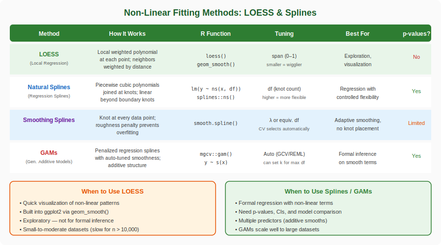{fig-align="center" width="95%"}

::: {.aside}
Source: Lecture material
:::

## LOESS: How It Works

-   LOESS (Locally Estimated Scatterplot Smoothing) fits local polynomial regressions at each point, weighting nearby observations more heavily.
-   It is exploratory — use it to discover the shape of a relationship before fitting a formal model.

**The algorithm:**

1.  Choose a focal point $x_0$
2.  Find the nearest neighbors (controlled by the **span** parameter)
3.  Weight nearby points using a tri-cube kernel: $w_i = (1 - |d_i|^3)^3$
4.  Fit a weighted polynomial regression (degree 1 or 2)
5.  Record the fitted value at $x_0$
6.  Move to the next point and repeat

## LOESS Concept — Local Weighted Regression

::: panel-tabset
### Output

```{r}
#| echo: false
#| eval: true
#| fig-width: 10
#| fig-height: 5

# Simulated data with non-linear trend
set.seed(42)
n <- 150
day <- runif(n, -155, 0)
margin <- 0.05 * sin(day / 25) + 0.02 + rnorm(n, 0, 0.025)

par(mfrow = c(1, 2), mar = c(5, 5, 3, 2))

# Two focal points
focal_pts <- c(-125, -55)

for (x0 in focal_pts) {
  # Compute tri-cube weights
  span <- 0.3
  dists <- abs(day - x0)
  h <- sort(dists)[ceiling(span * n)]
  u <- dists / h
  w <- ifelse(u < 1, (1 - u^3)^3, 0)
  w <- w / max(w)

  # Plot with weighted points
  plot(day, margin, pch = 16, cex = 0.6 + 1.5 * w,
       col = rgb(0, 0, 0, 0.15 + 0.85 * w),
       xlab = "day", ylab = "margin",
       main = paste("Focal point:", x0),
       cex.lab = 1.3, cex.main = 1.3, cex.axis = 1.1,
       xlim = c(-155, 0))

  # Local weighted regression
  local_fit <- lm(margin ~ day, weights = w)
  x_range <- seq(x0 - h * 0.5, x0 + h * 0.5, length.out = 50)
  x_range <- x_range[x_range >= min(day) & x_range <= max(day)]
  lines(x_range, predict(local_fit, newdata = data.frame(day = x_range)),
        col = "blue", lwd = 3)
}
```

### Code

```{r}
#| echo: true
#| eval: false

# Demonstrate LOESS local weighting at two focal points
set.seed(42)
n <- 150
day <- runif(n, -155, 0)
margin <- 0.05 * sin(day / 25) + 0.02 + rnorm(n, 0, 0.025)

par(mfrow = c(1, 2))
for (x0 in c(-125, -55)) {
  span <- 0.3
  dists <- abs(day - x0)
  h <- sort(dists)[ceiling(span * n)]
  u <- dists / h
  w <- ifelse(u < 1, (1 - u^3)^3, 0)  # Tri-cube kernel

  plot(day, margin, pch = 16, cex = 0.6 + 1.5 * w/max(w),
       col = rgb(0, 0, 0, 0.15 + 0.85 * w/max(w)),
       main = paste("Focal point:", x0))
  local_fit <- lm(margin ~ day, weights = w)
  x_range <- seq(x0 - h*0.5, x0 + h*0.5, length.out = 50)
  lines(x_range, predict(local_fit, newdata = data.frame(day = x_range)),
        col = "blue", lwd = 3)
}
```

### Interpretation

-   LOESS fits a separate weighted regression at each focal point — nearby data points receive high weight (large, dark), while distant points receive near-zero weight (small, faint)
-   The tri-cube kernel $w(u) = (1 - u^3)^3$ smoothly tapers weights to zero at the edge of the local neighborhood, avoiding abrupt cutoffs
-   The blue regression line at each focal point captures the local trend — notice how the slope differs between the two focal points, reflecting the non-linear underlying relationship
-   The span parameter (0.3 here) controls what fraction of data is included in each local fit — smaller spans produce more flexible but noisier curves
:::

## LOESS Animation

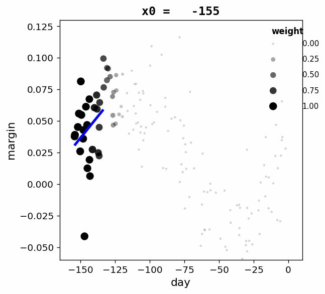{fig-align="center" width="80%"}

## LOESS Animation — How It's Built {.smaller}

::: panel-tabset
### Approach

The animation sweeps a **focal point** across the x-axis. At each position:

1. Tri-cube kernel weights are computed — nearby points get high weight (large, dark), distant points get near-zero weight (small, faint)
2. A **weighted local regression** is fit using only the neighborhood
3. The blue line shows the local fit at that focal point

The result: you can *watch* LOESS building its smooth curve one local fit at a time.

### Data Generation

```python
# Simulated non-linear trend (matches Week 9 R code)
np.random.seed(42)
n = 150
day = np.random.uniform(-155, 0, n)
margin = 0.05 * np.sin(day / 25) + 0.02 + np.random.normal(0, 0.025, n)
```

### Tri-cube Weights

```python
def tricube_weights(x_data, focal, span_frac, n):
    """Compute tri-cube kernel weights for LOESS."""
    dists = np.abs(x_data - focal)
    h = np.sort(dists)[int(np.ceil(span_frac * n)) - 1]
    u = dists / h
    w = np.where(u < 1, (1 - u**3)**3, 0.0)
    return w / w.max(), h
```

### Local Regression

```python
def local_regression(x_data, y_data, weights, focal, h):
    """Fit weighted linear regression via WLS."""
    W = np.diag(weights)
    X = np.column_stack([np.ones_like(x_data), x_data])
    beta = np.linalg.solve(X.T @ W @ X, X.T @ W @ y_data)

    x_range = np.linspace(focal - h * 0.5, focal + h * 0.5, 50)
    x_range = x_range[(x_range >= x_data.min()) & (x_range <= x_data.max())]
    y_pred = beta[0] + beta[1] * x_range
    return x_range, y_pred
```

### Regenerate

To regenerate this GIF from the repository root:

```bash
python3 scripts/loess_animation.py
```

This produces both `week_08_S121_loess_animation.gif` and `week_08_S122_loess_multi_span_animation.gif` in `Lecture_Folder/images/`.

:::

## LOESS with Different Spans

The span parameter controls the smoothness — smaller values create more flexible fits:

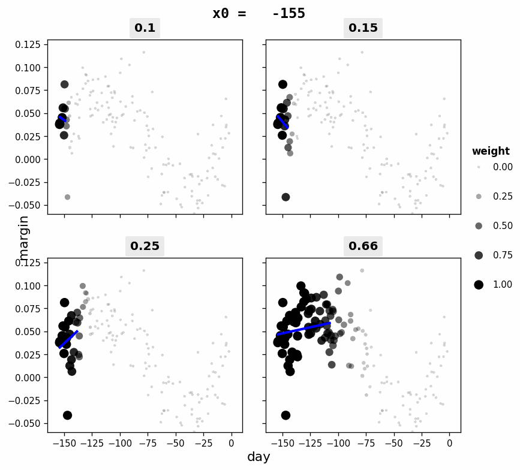{fig-align="center" width="80%"}

## Comparing Spans — How It's Built {.smaller}

::: panel-tabset
### Approach

The same focal-point sweep runs **simultaneously** across four panels with different span values:

| Span | Neighborhood | Behavior |
|------|-------------|----------|
| 0.10 | 10% of data | Very local — captures fine detail, noisy |
| 0.15 | 15% of data | Slightly wider — still quite flexible |
| 0.25 | 25% of data | Moderate — good balance |
| 0.66 | 66% of data | Wide neighborhood — very smooth |

Watch how wider spans recruit more weighted points (larger dark circles) and produce smoother, less variable local fits.

### Key Code

```python
SPANS = [0.1, 0.15, 0.25, 0.66]

fig, axes = plt.subplots(2, 2, sharex=True, sharey=True)
for ax, span in zip(axes.flat, SPANS):
    w, h = tricube_weights(day, x0, span, N_POINTS)

    # Point size and darkness encode weight
    sizes = 8 + 80 * w
    alphas = 0.15 + 0.85 * w

    ax.scatter(day, margin, s=sizes, c=colors, edgecolors='none')

    # Local weighted regression at this focal point
    x_line, y_line = local_regression(day, margin, w, x0, h)
    ax.plot(x_line, y_line, color='blue', linewidth=2.5)
    ax.set_title(f'{span}')
```

### Interpretation

-   **Small spans (0.1, 0.15)**: Only a few nearby points are weighted — the local fit is highly responsive to local fluctuations but may overfit noise
-   **Large spans (0.25, 0.66)**: Many points contribute — the fit is smoother and more stable but may miss sharp local features
-   The animation makes the bias-variance tradeoff visible: watch how the blue regression line wiggles more in the top panels than the bottom
:::


## The Span Parameter

::: callout-important
### Controlling Smoothness

-   **Span = 0.2**: Very flexible, follows local fluctuations — risk of overfitting
-   **Span = 0.5**: Moderate smoothing — often a good default
-   **Span = 0.75**: Smooth, captures broad trends — ggplot2 default
-   **Span = 1.0**: Very smooth — approaches global polynomial fit

The span controls the fraction of data used in each local regression. Smaller span = more local = more wiggly.
:::

::: panel-tabset
### Code

```{r}
#| eval: false
#| echo: true

# ggplot2 LOESS with different spans
ggplot(data, aes(x, y)) +
  geom_point() +
  geom_smooth(method = "loess", span = 0.3, color = "red") +
  geom_smooth(method = "loess", span = 0.75, color = "blue")
```

### Interpretation

-   Overlaying LOESS curves with different span values on the same plot lets you visually assess how much smoothing is appropriate for your data
-   A small span (0.3) follows local fluctuations closely and may overfit noise; a larger span (0.75) captures the broad trend and is the `ggplot2` default
-   The `geom_smooth(method = "loess")` function in ggplot2 also displays a confidence band by default, helping assess uncertainty in the smooth
:::

## From Exploration to Inference: Splines

-   Once LOESS reveals a non-linear relationship, you need formal tools to model it.
-   **Splines** are piecewise polynomials that create smooth curves by fitting different segments between data points (knots).
-   Unlike LOESS, splines produce models you can use for inference — coefficients, p-values, and predictions.

**Types of Spline Fitting:**

-   **Regression Splines** (`ns()`): Fit using least squares with specified knots — you choose the complexity
-   **Smoothing Splines** (`smooth.spline()`): Balance data fidelity and smoothness automatically via cross-validation
-   **GAMs** (`gam()` from mgcv): Generalized Additive Models — splines in a regression framework, with automatic smoothness selection
-   **Thin Plate Splines**: Extend to multiple dimensions for spatial data (e.g., scaffold thickness maps)

## Splines in R

::: panel-tabset
### Code

```{r}
#| eval: false
#| echo: true

# Natural splines — you choose degrees of freedom
library(splines)
model_ns <- lm(y ~ ns(x, df = 4), data = mydata)

# Smoothing splines — CV selects smoothness
smooth_fit <- smooth.spline(x, y, cv = TRUE)

# GAMs — automatic smoothness selection
library(mgcv)
gam_model <- gam(y ~ s(x), data = mydata)

# Thin plate spline for 2D spatial data
model_tp <- gam(z ~ s(x, y, bs = "tp"), data = spatial_data)
```

### Explanation

-   **Natural splines** constrain the tails to be linear — prevents dangerous extrapolation
-   **GAMs** use `s()` with automatic smoothness selection via generalized cross-validation
-   The **degrees of freedom** (df) control flexibility: df = 1 is linear, higher df = more wiggly
-   For bioengineering dose-response curves, natural splines with 3–5 df are a good starting point
:::

## Scaffold Porosity Dataset

::: callout-note
### Study Description

A tissue engineering lab manufactured 120 PLGA scaffolds with varying porosity levels (20--90%) using salt leaching. After seeding with mesenchymal stem cells (MSCs), they measured a cell proliferation index at 7 days to determine the optimal porosity range for bone tissue engineering.
:::

| Variable        | Type       | Description                       | Units |
|:----------------|:-----------|:----------------------------------|:------|
| `porosity`      | Continuous | Scaffold porosity percentage      | \%    |
| `proliferation` | Continuous | Cell proliferation index at day 7 | AU    |

::: panel-tabset
### Code

```{r}
#| label: porosity-load
#| eval: false
#| echo: true

# Load the scaffold porosity dataset
porosity_data <- read_csv("data/scaffold_porosity.csv")
glimpse(porosity_data)
```

### Interpretation

-   The `glimpse()` function provides a compact overview of variable types and sample values — always inspect your data structure before fitting models
-   This dataset contains two continuous variables (porosity and proliferation), making it ideal for exploring non-linear smoothing techniques like LOESS and splines
:::

## Exploring the Data: Porosity and Proliferation

Let's explore a non-linear relationship between scaffold porosity and cell proliferation:

::: panel-tabset
### Output

```{r}
#| label: porosity-data-output
#| echo: false
#| eval: true
#| fig-width: 9
#| fig-height: 5

set.seed(2026)
n <- 120
porosity_data <- data.frame(
  porosity = runif(n, 20, 90)
)
# Non-linear relationship: cell growth peaks at ~60% porosity
porosity_data$proliferation <- with(porosity_data, {
  -0.003 * (porosity - 58)^2 + 8 + rnorm(n, 0, 0.8)
})

ggplot(porosity_data, aes(x = porosity, y = proliferation)) +
  geom_point(alpha = 0.5, size = 2) +
  geom_smooth(method = "loess", span = 0.5, color = "#2e7d32", linewidth = 1.2, se = TRUE) +
  geom_smooth(method = "lm", color = "red", linewidth = 1, linetype = "dashed", se = FALSE) +
  labs(x = "Scaffold Porosity (%)", y = "Cell Proliferation Index",
       title = "Scaffold Porosity vs. Cell Proliferation",
       subtitle = "Red dashed = linear fit (poor); green = LOESS (captures non-linearity)")
```

### Code

```{r}
#| label: porosity-data-code
#| echo: true
#| eval: false

# Load from CSV
porosity_data <- read_csv("data/scaffold_porosity.csv")

# Overlay linear and LOESS fits
ggplot(porosity_data, aes(x = porosity, y = proliferation)) +
  geom_point(alpha = 0.5) +
  geom_smooth(method = "loess", span = 0.5, color = "green4") +
  geom_smooth(method = "lm", color = "red", linetype = "dashed", se = FALSE) +
  labs(x = "Porosity (%)", y = "Proliferation Index")
```

### Explanation

-   This is a classic **inverted-U** relationship — proliferation peaks at intermediate porosity (\~58%)
-   The linear model (red dashed) completely misses this — it sees essentially zero correlation
-   LOESS (green) captures the peak and the decline at both extremes
-   This is exactly the situation where splines shine for formal inference
:::

## Comparing Fitting Approaches

::: panel-tabset
### Output

```{r}
#| label: spline-comparison-output
#| echo: false
#| eval: true
#| fig-width: 10
#| fig-height: 8

library(splines)
library(mgcv)

par(mfrow = c(2, 2), mar = c(4, 4, 3, 1))

x <- porosity_data$porosity
y <- porosity_data$proliferation

# Linear
plot(x, y, pch = 16, cex = 0.6, col = "gray60", main = "Linear Regression",
     xlab = "Porosity (%)", ylab = "Proliferation")
m1 <- lm(y ~ x)
lines(sort(x), predict(m1, newdata = data.frame(x = sort(x))), col = "steelblue", lwd = 2)

# Polynomial (degree 4)
plot(x, y, pch = 16, cex = 0.6, col = "gray60", main = "Polynomial (degree 4)",
     xlab = "Porosity (%)", ylab = "Proliferation")
m2 <- lm(y ~ poly(x, 4))
x_seq <- seq(min(x), max(x), length.out = 200)
lines(x_seq, predict(m2, newdata = data.frame(x = x_seq)), col = "coral", lwd = 2)

# Natural splines (df = 4)
plot(x, y, pch = 16, cex = 0.6, col = "gray60", main = "Natural Splines (df = 4)",
     xlab = "Porosity (%)", ylab = "Proliferation")
m3 <- lm(y ~ ns(x, df = 4))
lines(x_seq, predict(m3, newdata = data.frame(x = x_seq)), col = "forestgreen", lwd = 2)

# GAM with smoothing spline
plot(x, y, pch = 16, cex = 0.6, col = "gray60", main = "GAM (Smoothing Spline)",
     xlab = "Porosity (%)", ylab = "Proliferation")
m4 <- gam(y ~ s(x))
lines(x_seq, predict(m4, newdata = data.frame(x = x_seq)), col = "purple", lwd = 2)
```

### Code

```{r}
#| label: spline-comparison-code
#| echo: true
#| eval: false

library(splines)
library(mgcv)

# Linear — misses the curvature
m1 <- lm(proliferation ~ porosity, data = porosity_data)

# Polynomial (degree 4) — captures curvature, dangerous at edges
m2 <- lm(proliferation ~ poly(porosity, 4), data = porosity_data)

# Natural splines (df = 4) — captures curvature, safe at edges
m3 <- lm(proliferation ~ ns(porosity, df = 4), data = porosity_data)

# GAM — automatic smoothness selection
m4 <- gam(proliferation ~ s(porosity), data = porosity_data)

# Compare with AIC
AIC(m1, m2, m3)
summary(m4)  # includes significance test for smooth term
```

### Tradeoffs

| Method          | Flexibility | Extrapolation | Interpretability | Inference |
|:----------------|:------------|:--------------|:-----------------|:----------|
| Linear          | Low         | Reasonable    | High             | Yes       |
| Polynomial      | Medium      | Dangerous     | Medium           | Yes       |
| Natural splines | High        | Linear tails  | Medium           | Yes       |
| GAM             | High        | Auto-tuned    | Lower            | Yes (edf) |

### Interpretation

-   **Linear regression** completely misses the curvature -- it reports near-zero correlation for what is clearly a strong non-linear relationship
-   **Polynomial (degree 4)** captures the curvature well in the interior but can produce wild extrapolation at the edges
-   **Natural splines (df = 4)** capture the curvature while constraining the tails to be linear -- the safest choice for inference and extrapolation
-   **GAM** automatically selects smoothness via cross-validation and produces results very similar to natural splines -- ideal when you want the data to determine the complexity
-   Compare models using AIC: the best model balances fit and complexity. For this inverted-U relationship, all non-linear methods dramatically outperform the linear model
:::

## R Exercise: Scaffold Porosity Smoothing

::: callout-tip
## Exercise

Load the scaffold porosity dataset (`data/scaffold_porosity.csv`) and explore different smoothing approaches:

```{r}
#| eval: false
#| echo: true

# Starter code
porosity_data <- read_csv("data/scaffold_porosity.csv")
```

Tasks:

1.  Plot the raw data and overlay a LOESS smooth with `span = 0.3`, `0.5`, and `0.75`. Which captures the trend best without overfitting?
2.  Fit a natural spline model with `df = 3, 4, 5, 6` and compare using AIC. Which df is optimal?
3.  Fit a GAM with `gam(proliferation ~ s(porosity))`. How many effective degrees of freedom does it choose?
4.  Compare predictions from your best spline model and the GAM — how similar are they?
5.  Based on your best model, what porosity level maximizes cell proliferation? Use `predict()` on a fine grid of porosity values.
:::

# Survival Analysis {background-color="#d4edda"}

## From Curves to Time: What Comes Next?

-   We have seen how **LOESS and splines** let us model non-linear relationships between a predictor and a continuous outcome.
-   But what happens when our outcome is not a number --- it is an **event that may or may not happen**, and **when** it happens matters?

In bioengineering, we frequently ask:

-   How long until a scaffold degrades past a critical threshold?
-   When does an implant fail?
-   How long do drug-eluting coatings maintain therapeutic levels?

**Survival analysis** gives us the statistical framework for these time-to-event questions --- including the challenge of **censoring**, where some subjects have not experienced the event yet.

## What is Survival Analysis?

-   Survival analysis is a family of statistical methods for analyzing **time-to-event** data — the time elapsed until a specific event occurs.
-   Unlike standard regression, survival analysis handles a unique feature of biomedical and engineering data: **censoring**.

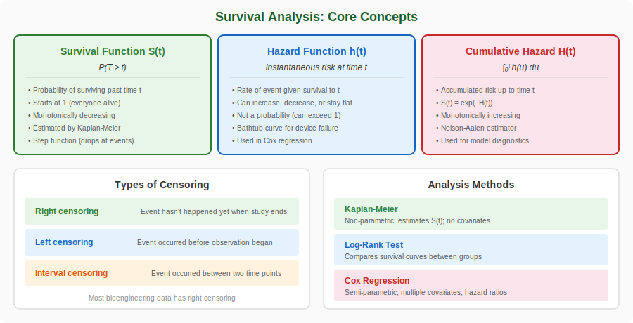{fig-align="center" width="95%"}

::: {.aside}
Source: Lecture material
:::

## Why Can't We Just Use Standard Regression?

If we could observe every subject until the event occurred, we could simply model time as a continuous outcome with `lm()`. But in practice:

-   Patients drop out of clinical trials
-   The study ends before all devices have failed
-   Some subjects are lost to follow-up

**Censored observations** contain partial information — we know the event *hadn't occurred yet* at the last observation time. Ignoring them wastes data; treating them as events creates bias. Survival analysis is specifically designed to handle this.

::: callout-important
### The Core Problem Survival Analysis Solves

If an implant has survived 500 days when the study ends, we know its true failure time is *at least* 500 days. This is valuable information that standard regression can't incorporate — survival analysis can.
:::

## The Survival Function: S(t)

The survival function is the probability of surviving (not experiencing the event) beyond time $t$:

$$S(t) = P(T > t)$$

::: panel-tabset
### Properties

-   $S(0) = 1$ — everyone starts alive/intact
-   $S(t)$ is monotonically **non-increasing** — you can't "un-fail"
-   $S(\infty) \to 0$ — eventually everyone experiences the event
-   The **median survival time** is the time $t$ where $S(t) = 0.5$

### Bioengineering Examples

| Application          | Event              | Time Scale  | Typical S(t) shape    |
|:-----------------|:-----------------|:-----------------|:------------------|
| Implant testing      | Structural failure | Days/Months | Gradual decline       |
| Drug delivery        | Drug depletion     | Hours/Days  | Steep initial decline |
| Cell culture         | Cell death         | Hours       | Varies by condition   |
| Scaffold degradation | 50% mass loss      | Weeks       | Depends on coating    |

### Interpretation

-   The survival function $S(t)$ gives the probability that an event has not yet occurred by time $t$ — it is the fundamental quantity in survival analysis
-   The monotonically decreasing property reflects that failures are irreversible; the Kaplan-Meier estimator enforces this constraint non-parametrically
-   In bioengineering, the shape of $S(t)$ reveals whether failures occur early (steep initial drop), at a constant rate (exponential decay), or cluster at later times (delayed drop)
-   Comparing survival curves across groups (e.g., materials, coatings) is the primary way to assess treatment or design effects on time-to-event outcomes
:::

## The Hazard Function: h(t)

The hazard function is the **instantaneous rate** of the event, given survival to time $t$:

$$h(t) = \lim_{\Delta t \to 0} \frac{P(t \leq T < t + \Delta t \mid T \geq t)}{\Delta t}$$

::: panel-tabset
### Intuition

-   Think of it as the "risk per unit time" at any given moment
-   It is **not a probability** — it can exceed 1 (it's a rate)
-   It's conditional: given you've survived to time $t$, what's your instantaneous risk?
-   The relationship: $h(t) = -\frac{d}{dt}\log S(t)$, so $S(t) = \exp\left(-\int_0^t h(u)\,du\right)$

### Common Hazard Shapes

-   **Constant**: Exponential distribution (random failure, like radioactive decay)
-   **Increasing**: Aging/wear (devices that degrade over time)
-   **Decreasing**: Early failures (burn-in period for electronics)
-   **Bathtub**: Early failures + stable period + wear-out (classic engineering)
-   **Unimodal**: Peak risk at a specific time (some diseases)

### LaTeX

``` text
h(t) = \lim_{\Delta t \to 0} \frac{P(t \leq T < t + \Delta t \mid T \geq t)}{\Delta t}

S(t) = \exp\left(-\int_0^t h(u)\,du\right)
```

### Interpretation

-   The hazard function describes the instantaneous failure rate at time $t$ for subjects who have survived to that point — it answers "how risky is this moment?"
-   Unlike probability, the hazard is a rate and can exceed 1, making it suitable for modeling events that can happen at any continuous time point
-   The shape of the hazard function reveals the failure mechanism: increasing hazard suggests wear-out, decreasing suggests early failures, and the bathtub curve combines both
-   The survival and hazard functions are mathematically linked through $S(t) = \exp(-\int_0^t h(u)\,du)$, so knowing one determines the other
:::

## Understanding Censoring

::: panel-tabset
### Output

```{r}
#| label: censoring-output
#| echo: false
#| eval: true
#| fig-width: 9
#| fig-height: 3.5

par(mar = c(4, 8, 2, 1))
plot(NULL, xlim = c(0, 14), ylim = c(0.5, 6.5), xlab = "Time (months)",
     ylab = "", main = "Survival Data with Right Censoring", yaxt = "n")
axis(2, at = 1:6, labels = rev(c("Implant A", "Implant B", "Implant C", 
                                   "Implant D", "Implant E", "Implant F")), las = 1, cex.axis = 0.9)

# Study end line
abline(v = 12, lty = 2, col = "gray70", lwd = 1.5)
text(12.5, 6.3, "Study ends", col = "gray50", cex = 0.8)

# Subject timelines
segments(0, 6, 4, 6, lwd = 4, col = "#4393c3")
points(4, 6, pch = 4, cex = 2.5, col = "#c62828", lwd = 3)
text(4.8, 6, "Failed\n(t=4)", cex = 0.7, col = "#c62828")

segments(0, 5, 7, 5, lwd = 4, col = "#4393c3")
points(7, 5, pch = 4, cex = 2.5, col = "#c62828", lwd = 3)
text(7.8, 5, "Failed\n(t=7)", cex = 0.7, col = "#c62828")

segments(0, 4, 9, 4, lwd = 4, col = "#4393c3")
points(9, 4, pch = 1, cex = 2.5, col = "#2e7d32", lwd = 3)
text(9.8, 4, "Lost\n(t=9+)", cex = 0.7, col = "#2e7d32")

segments(0, 3, 10, 3, lwd = 4, col = "#4393c3")
points(10, 3, pch = 4, cex = 2.5, col = "#c62828", lwd = 3)
text(10.8, 3, "Failed\n(t=10)", cex = 0.7, col = "#c62828")

segments(0, 2, 12, 2, lwd = 4, col = "#4393c3")
points(12, 2, pch = 1, cex = 2.5, col = "#2e7d32", lwd = 3)
text(12.8, 2, "Intact\n(t=12+)", cex = 0.7, col = "#2e7d32")

segments(0, 1, 12, 1, lwd = 4, col = "#4393c3")
points(12, 1, pch = 1, cex = 2.5, col = "#2e7d32", lwd = 3)
text(12.8, 1, "Intact\n(t=12+)", cex = 0.7, col = "#2e7d32")

legend("bottomleft", c("Event (X) — failure observed", "Censored (O) — still intact or lost"),
       pch = c(4, 1), col = c("#c62828", "#2e7d32"), pt.lwd = 3, pt.cex = 1.5, cex = 0.8)
```

### Explanation

-   **Events** (red X): We observe the exact failure time — Implants A, B, and D
-   **Right-censored** (green O): We know the implant survived *at least* this long, but not the actual failure time
    -   Implant C was lost to follow-up at month 9
    -   Implants E and F were still intact when the study ended at month 12
-   Survival analysis uses *all six* observations — censored data is not discarded, it contributes information about survival probabilities at earlier time points
:::

## Orthopedic Implant Failure Dataset

::: callout-note
### Study Description

A multicenter orthopedic registry tracked 200 joint replacement implants over a 10-year period. Each implant was characterized by material type (titanium, cobalt-chrome, or PEEK), surface coating (hydroxyapatite or none), and patient factors (age, activity level, BMI). The primary outcome is time to implant failure (revision surgery required). Some implants were still functioning at study end (**right-censored**) or patients were lost to follow-up.
:::

| Variable | Type | Description | Units / Levels |
|:-----------------|:-----------------|:-----------------|:-----------------|
| `implant_id` | Character | Unique implant identifier | --- |
| `time_years` | Continuous | Time to failure or censoring | years |
| `event` | Binary | Event indicator | 1 = failure, 0 = censored |
| `material` | Categorical | Implant material | titanium, cobalt_chrome, PEEK |
| `coating` | Categorical | Surface coating | hydroxyapatite, none |
| `patient_age` | Continuous | Patient age at implantation | years |
| `activity_level` | Continuous | Patient activity score | 1 (sedentary) -- 10 (very active) |
| `bmi` | Continuous | Body mass index | kg/m² |

::: panel-tabset
### Code

```{r}
#| label: implant-load
#| eval: false
#| echo: true

# Load the implant failure dataset
implant <- read_csv("data/implant_failure.csv")
implant$material <- factor(implant$material)
implant$coating <- factor(implant$coating)
glimpse(implant)
```

### Interpretation

-   Converting `material` and `coating` to factors ensures they are treated as categorical predictors in survival models
-   The dataset includes both the event indicator (`failed`) and the time variable (`time_years`), which together define the survival outcome
-   Censored observations (implants that have not yet failed at follow-up) are as informative as failures — they tell us the implant survived at least that long
:::

## Load and Inspect the Data

::: panel-tabset
### Output

```{r}
#| label: implant-inspect-output
#| echo: false
#| eval: true

library(survival)
set.seed(2026)

# Simulate the implant data for rendering
materials <- rep(c("titanium", "cobalt_chrome", "PEEK"), c(70, 65, 65))
coatings <- sample(c("hydroxyapatite", "none"), 200, replace = TRUE)
patient_age <- pmax(30, pmin(90, round(rnorm(200, 62, 12))))
activity_level <- round(runif(200, 1, 10), 1)
bmi <- pmax(18, pmin(45, round(rnorm(200, 28, 5), 1)))

base_time <- ifelse(materials == "titanium", 8,
             ifelse(materials == "cobalt_chrome", 6, 5))
coat_eff <- ifelse(coatings == "hydroxyapatite", 2, 0)
scale_param <- pmax(2, base_time + coat_eff - 0.03*(patient_age-60) - 
                    0.15*activity_level - 0.05*(bmi-25))
time_years <- pmax(0.1, rweibull(200, 2.5, scale_param))

event <- rep(1, 200)
censor_idx <- which(time_years > 10)
time_years[censor_idx] <- runif(length(censor_idx), 5, 10)
event[censor_idx] <- 0
random_censor <- sample(which(event == 1), size = round(0.15 * sum(event == 1)))
time_years[random_censor] <- time_years[random_censor] * runif(length(random_censor), 0.3, 0.9)
event[random_censor] <- 0
time_years <- round(time_years, 1)

implant <- data.frame(
  implant_id = paste0("IMP_", sprintf("%03d", 1:200)),
  time_years = time_years,
  event = event,
  material = factor(materials),
  coating = factor(coatings),
  patient_age = patient_age,
  activity_level = activity_level,
  bmi = bmi
)

cat("Dimensions:", nrow(implant), "rows x", ncol(implant), "columns\n\n")
cat("Event status:\n")
table(Event = implant$event)
cat("\n\nMaterial distribution:\n")
table(Material = implant$material)
cat("\n\nFirst 8 rows:\n")
head(implant, 8) |> knitr::kable()
```

### Code

```{r}
#| label: implant-inspect-code
#| echo: true
#| eval: false

# Load and inspect
implant <- read_csv("data/implant_failure.csv")
implant$material <- factor(implant$material)
implant$coating <- factor(implant$coating)

dim(implant)
str(implant)
table(implant$event)     # 0 = censored, 1 = failure
table(implant$material)  # material distribution
head(implant)
```

### Explanation

-   **200 implants** tracked over 10 years, with a mix of failures (event = 1) and censored observations (event = 0)
-   The `Surv()` function combines `time_years` and `event` into a survival object
-   **Censoring** occurs when implants were still functioning at study end or patients were lost to follow-up
-   Three implant materials and two coating types allow us to compare survival across groups
:::

## Kaplan-Meier Estimator

The **product-limit estimator** for the survival function — the most common non-parametric approach:

$$\hat{S}(t) = \prod_{t_i \leq t} \left(1 - \frac{d_i}{n_i}\right)$$

Where $d_i$ = events at time $t_i$ and $n_i$ = number at risk just before $t_i$.

::: callout-tip
### How It Works Step by Step

1.  At each observed event time, count how many subjects are still "at risk" ($n_i$) and how many experience the event ($d_i$)
2.  Calculate the conditional survival probability at that time: $1 - d_i/n_i$
3.  Multiply all these conditional probabilities together up to time $t$
4.  Censored subjects contribute to $n_i$ until they drop out, but they don't count as events
:::

## Kaplan-Meier Survival Curve

::: panel-tabset
### Output

```{r}
#| label: km-curve-output
#| echo: false
#| eval: true
#| fig-width: 9
#| fig-height: 5

km_fit <- survfit(Surv(time_years, event) ~ 1, data = implant)

km_df <- data.frame(
  time = km_fit$time,
  surv = km_fit$surv,
  upper = km_fit$upper,
  lower = km_fit$lower,
  n.event = km_fit$n.event,
  n.censor = km_fit$n.censor
)

ggplot(km_df, aes(x = time, y = surv)) +
  geom_step(linewidth = 1.2, color = "#2c3e50") +
  geom_ribbon(aes(ymin = lower, ymax = upper), alpha = 0.15, fill = "#2c3e50") +
  geom_point(data = km_df[km_df$n.censor > 0, ], aes(x = time, y = surv),
             shape = 3, size = 2, color = "red") +
  labs(x = "Time (years)", y = "Survival Probability",
       title = "Kaplan-Meier Curve: Overall Implant Survival",
       subtitle = "Shaded band = 95% CI; red crosses = censored observations") +
  scale_y_continuous(limits = c(0, 1)) +
  scale_x_continuous(breaks = 0:10)
```

### Code

```{r}
#| label: km-curve-code
#| echo: true
#| eval: false

library(survival)

# Create survival object and fit KM curve
surv_obj <- Surv(time = implant$time_years, event = implant$event)
km_fit <- survfit(surv_obj ~ 1)  # Overall survival (no grouping)

# Summary at specific time points
summary(km_fit, times = c(1, 2, 5, 8, 10))

# Plot with ggplot
km_df <- data.frame(
  time = km_fit$time,
  surv = km_fit$surv,
  upper = km_fit$upper,
  lower = km_fit$lower
)

ggplot(km_df, aes(x = time, y = surv)) +
  geom_step(linewidth = 1.2, color = "#2c3e50") +
  geom_ribbon(aes(ymin = lower, ymax = upper), alpha = 0.15) +
  labs(x = "Time (years)", y = "Survival Probability",
       title = "Kaplan-Meier Curve: Overall Implant Survival")
```

### Interpretation

-   The **step-down** pattern shows the decreasing proportion of implants still functioning over time
-   The **95% confidence band** widens as fewer implants remain at risk
-   **Red crosses** mark censored observations --- implants still functioning when last observed
-   The **median survival time** is where the curve crosses 0.5 on the y-axis
:::

## Comparing Survival Curves by Group

::: panel-tabset
### Output

```{r}
#| label: km-group-output
#| echo: false
#| eval: true
#| fig-width: 10
#| fig-height: 5

km_material <- survfit(Surv(time_years, event) ~ material, data = implant)

km_mat_df <- data.frame(
  time = km_material$time,
  surv = km_material$surv,
  upper = km_material$upper,
  lower = km_material$lower,
  group = rep(names(km_material$strata), km_material$strata)
)
km_mat_df$group <- gsub("material=", "", km_mat_df$group)

ggplot(km_mat_df, aes(x = time, y = surv, color = group, fill = group)) +
  geom_step(linewidth = 1.2) +
  geom_ribbon(aes(ymin = lower, ymax = upper), alpha = 0.1, linetype = 0) +
  scale_color_brewer(palette = "Set1") +
  scale_fill_brewer(palette = "Set1") +
  labs(x = "Time (years)", y = "Survival Probability",
       title = "Implant Survival by Material Type",
       color = "Material", fill = "Material") +
  scale_y_continuous(limits = c(0, 1)) +
  scale_x_continuous(breaks = 0:10)
```

### Code

```{r}
#| label: km-group-code
#| echo: true
#| eval: false

# KM curves stratified by material
km_material <- survfit(Surv(time_years, event) ~ material, data = implant)
summary(km_material)

# Quick plot with base R
plot(km_material, col = 1:3, lwd = 2,
     xlab = "Time (years)", ylab = "Survival Probability",
     main = "Implant Survival by Material")
legend("bottomleft", levels(implant$material), col = 1:3, lwd = 2)
```

### Interpretation

-   **Titanium** implants show the best survival (curve stays highest)
-   **PEEK** implants show the earliest failures
-   The separation between curves suggests material choice significantly affects implant longevity
-   Overlapping confidence bands indicate where differences may not be statistically significant
:::

## The Log-Rank Test: Comparing Survival Curves

The **log-rank test** is the standard non-parametric test for comparing survival distributions between two or more groups. It is analogous to a chi-squared test applied to survival data.

**How the log-rank test works:**

At each event time, the test compares the **observed** number of events in each group to the **expected** number (what you'd expect if there were no group difference). The test statistic sums these observed-minus-expected differences across all event times:

$$\chi^2 = \frac{\left(\sum_i (O_{1i} - E_{1i})\right)^2}{\sum_i V_i}$$

Where $O_{1i}$ and $E_{1i}$ are the observed and expected events in group 1 at time $t_i$, and $V_i$ is the variance at that time point. The test has $k - 1$ degrees of freedom for $k$ groups.

::: callout-note
The log-rank test gives **equal weight to all time points**. If you expect differences mainly at early or late times, the Wilcoxon (Gehan-Breslow) test may be more appropriate.
:::

## Log-Rank Test: Implant Materials

::: panel-tabset
### Output

```{r}
#| label: logrank-output
#| echo: false
#| eval: true

# Log-rank test: are the survival curves different?
lr_test <- survdiff(Surv(time_years, event) ~ material, data = implant)
print(lr_test)
```

### Code

```{r}
#| label: logrank-code
#| echo: true
#| eval: false

# Log-rank test: are the survival curves significantly different?
survdiff(Surv(time_years, event) ~ material, data = implant)

# Pairwise log-rank tests (if >2 groups)
pairwise_survdiff(Surv(time_years, event) ~ material,
                  data = implant, p.adjust.method = "BH")
```

### Interpretation

-   The **log-rank test** tests $H_0$: all groups have the same survival function
-   A significant p-value means at least one material has a different failure pattern
-   Pairwise comparisons with Benjamini-Hochberg correction identify which specific materials differ
-   The "Observed" vs "Expected" columns show whether each group had more or fewer events than expected under the null
:::

## The Cox Proportional Hazards Model

-   The **Cox proportional hazards model** is the workhorse of survival regression.
-   It models how covariates affect the hazard rate **without specifying the baseline hazard shape** — a semi-parametric approach that provides remarkable flexibility.

The model assumes:

$$h(t \mid X) = h_0(t) \cdot \exp(\beta_1 X_1 + \beta_2 X_2 + \cdots + \beta_p X_p)$$

-   Where $h_0(t)$ is an unspecified baseline hazard and $\exp(\beta_j)$ is the **hazard ratio** for a one-unit increase in $X_j$.

-   **The key assumption** is **proportional hazards**: the ratio of hazards between any two groups remains constant over time.

-   If PEEK implants fail at 1.5× the rate of titanium implants at 1 year, they should also fail at 1.5× the rate at 5 years.

## Cox Model: Implant Failure Risk Factors

::: panel-tabset
### Output

```{r}
#| label: cox-output
#| echo: false
#| eval: true

cox_model <- coxph(Surv(time_years, event) ~ material + coating + 
                     patient_age + activity_level + bmi, data = implant)
summary(cox_model)
```

### Code

```{r}
#| label: cox-code
#| echo: true
#| eval: false

# Cox proportional hazards model
cox_model <- coxph(Surv(time_years, event) ~ material + coating +
                     patient_age + activity_level + bmi,
                   data = implant)
summary(cox_model)

# Hazard ratios with 95% CI
exp(cbind(HR = coef(cox_model), confint(cox_model)))
```

### Interpretation

-   **Hazard Ratio (HR)**: the ratio of failure rates between groups
    -   HR \> 1: higher failure risk (worse survival)
    -   HR \< 1: lower failure risk (better survival)
    -   HR = 1: no difference
-   **Example**: HR = 1.5 for PEEK vs. titanium means PEEK implants fail at 1.5x the rate of titanium
-   **Patient factors**: older age, higher activity, and higher BMI may increase failure risk
-   The Cox model adjusts for all covariates simultaneously --- important when patient characteristics differ across material groups
:::

## Interpreting Hazard Ratios

::: panel-tabset
### Visual

```{r}
#| label: hr-forest-output
#| echo: false
#| eval: true
#| fig-width: 9
#| fig-height: 5

hr_df <- data.frame(
  term = names(coef(cox_model)),
  hr = exp(coef(cox_model)),
  lower = exp(confint(cox_model)[, 1]),
  upper = exp(confint(cox_model)[, 2])
)

ggplot(hr_df, aes(x = hr, y = reorder(term, hr))) +
  geom_point(size = 3) +
  geom_errorbarh(aes(xmin = lower, xmax = upper), height = 0.2) +
  geom_vline(xintercept = 1, linetype = "dashed", color = "red") +
  labs(x = "Hazard Ratio (95% CI)", y = "",
       title = "Forest Plot: Implant Failure Risk Factors",
       subtitle = "HR > 1 = higher failure risk; dashed line = no effect") +
  scale_x_log10()
```

### Code

```{r}
#| label: hr-forest-code
#| echo: true
#| eval: false

# Extract hazard ratios and CIs
hr_df <- data.frame(
  term = names(coef(cox_model)),
  hr = exp(coef(cox_model)),
  lower = exp(confint(cox_model)[, 1]),
  upper = exp(confint(cox_model)[, 2])
)

# Forest plot
ggplot(hr_df, aes(x = hr, y = reorder(term, hr))) +
  geom_point(size = 3) +
  geom_errorbarh(aes(xmin = lower, xmax = upper), height = 0.2) +
  geom_vline(xintercept = 1, linetype = "dashed", color = "red") +
  labs(x = "Hazard Ratio (95% CI)", y = "") +
  scale_x_log10()
```

### Key Points

-   Points **left of the dashed line** (HR \< 1) indicate protective factors
-   Points **right of the dashed line** (HR \> 1) indicate risk factors
-   **Confidence intervals crossing 1** indicate non-significant effects
-   This is the standard visualization for reporting Cox model results in biomedical literature

### Interpretation

-   The **forest plot** is the standard visualization for reporting Cox model results in biomedical literature -- it shows each covariate's hazard ratio with its 95% confidence interval
-   Points to the **right of the dashed line** (HR > 1) indicate factors that increase failure risk; points to the **left** (HR < 1) indicate protective factors
-   Confidence intervals that **cross the dashed line at HR = 1** indicate non-significant effects -- the data are compatible with no effect
-   The relative position of the points allows quick comparison of which factors have the largest impact on implant survival
:::

## Checking the Proportional Hazards Assumption

::: panel-tabset
### Output

```{r}
#| label: ph-check-output
#| echo: false
#| eval: true
#| fig-width: 10
#| fig-height: 6

ph_test <- cox.zph(cox_model)
print(ph_test)
par(mfrow = c(2, 3), mar = c(4, 4, 3, 1))
plot(ph_test)
```

### Code

```{r}
#| label: ph-check-code
#| echo: true
#| eval: false

# Test proportional hazards assumption
ph_test <- cox.zph(cox_model)
print(ph_test)  # p > 0.05 = assumption OK

# Visual check: Schoenfeld residuals vs time
plot(ph_test)
# Horizontal lines = assumption met; trends = violation
```

### Interpretation

-   The **proportional hazards assumption** means the hazard ratio between groups stays constant over time
-   The **Schoenfeld residual test** checks this: p \> 0.05 suggests the assumption holds
-   **Visual check**: residual plots should show a roughly horizontal trend
-   If violated: consider stratified Cox models, time-varying coefficients, or parametric alternatives
:::

## Bioengineering Example: Scaffold Degradation Survival

This example connects back to the scaffold degradation data from our mixed models analysis. Earlier we modeled degradation *rate* as a continuous outcome. Here we treat it as a time-to-event question: **how long until each scaffold loses 50% of its structural integrity?**

::: panel-tabset
### Output

```{r}
#| label: scaffold-survival-output
#| echo: false
#| eval: true
#| fig-width: 9
#| fig-height: 5

library(survival)
set.seed(2026)

scaffold_surv <- data.frame(
  treatment = factor(rep(c("A_collagen", "B_fibronectin", "C_uncoated"), each = 60)),
  temperature = factor(rep(rep(c("37C", "42C"), each = 30), 3))
)

scaffold_surv$time_to_50 <- with(scaffold_surv, {
  base_time <- ifelse(treatment == "A_collagen", 24,
               ifelse(treatment == "B_fibronectin", 18, 12))
  temp_effect <- ifelse(temperature == "42C", -4, 0)
  interaction <- ifelse(treatment == "C_uncoated" & temperature == "42C", -3, 0)
  pmax(rweibull(180, 3, base_time + temp_effect + interaction), 1)
})

scaffold_surv$event <- rbinom(180, 1, 0.85)

km_scaffold <- survfit(Surv(time_to_50, event) ~ treatment, data = scaffold_surv)

km_scaf_df <- data.frame(
  time  = km_scaffold$time,
  surv  = km_scaffold$surv,
  upper = km_scaffold$upper,
  lower = km_scaffold$lower,
  group = rep(c("A_collagen", "B_fibronectin", "C_uncoated"), km_scaffold$strata)
)

ggplot(km_scaf_df, aes(x = time, y = surv, color = group, fill = group)) +
  geom_step(linewidth = 1.2) +
  geom_ribbon(aes(ymin = lower, ymax = upper), alpha = 0.12) +
  scale_color_brewer(palette = "Set1") +
  scale_fill_brewer(palette = "Set1") +
  labs(x = "Time to 50% Mass Loss (days)", y = "Proportion Still Intact",
       title = "Scaffold Degradation Survival by Coating Type",
       subtitle = "Same experimental design as our mixed model analysis",
       color = "Coating", fill = "Coating") +
  scale_y_continuous(limits = c(0, 1))
```

### Code

```{r}
#| label: scaffold-survival-code
#| echo: true
#| eval: false

# Kaplan-Meier by treatment
km_scaffold <- survfit(Surv(time_to_50, event) ~ treatment, 
                        data = scaffold_surv)

# Log-rank test: do coatings differ in degradation time?
survdiff(Surv(time_to_50, event) ~ treatment, data = scaffold_surv)

# Cox model: hazard ratios for coating types
cox_scaffold <- coxph(Surv(time_to_50, event) ~ treatment + temperature,
                       data = scaffold_surv)
summary(cox_scaffold)
exp(cbind(HR = coef(cox_scaffold), confint(cox_scaffold)))
```

### Interpretation

-   **Same experiment, different perspective**: The LMM modeled continuous degradation rate; survival analysis models the *time* until a critical threshold is crossed
-   **Collagen** scaffolds survive longest (curve stays highest) — consistent with lower degradation rates from the LMM
-   **Uncoated** scaffolds degrade fastest, especially at 42°C
-   The **hazard ratio** from the Cox model tells you how much faster one coating degrades relative to the reference
-   **Censored scaffolds** (still intact at study end) are properly handled
:::

------------------------------------------------------------------------

# Introduction to Statistical Learning {background-color="#2c3e50"}

## Transitioning to Statistical Learning

-   So far in this course, we have focused on **inference** --- estimating parameters, testing hypotheses, and building models grounded in probability theory. Now we shift toward **prediction** and **pattern recognition**.

-   **Statistical learning** (also called machine learning) asks a different question: given data, can we build a model that **accurately predicts** outcomes for new, unseen observations?

-   This shift requires new concepts ---

    -   **overfitting**
    -   **bias-variance tradeoff**
    -   **cross-validation**

-   before we dive into specific algorithms.

## What is Statistical Learning?

-   A set of tools for **understanding data** through models
-   **Supervised learning**: predict an outcome from predictors (requires labeled data)
-   **Unsupervised learning**: find patterns without a predefined outcome variable

| Type         | Goal                | Examples                   |
|:-------------|:--------------------|:---------------------------|
| Supervised   | Predict Y from X    | Regression, classification |
| Unsupervised | Find structure in X | Clustering, PCA            |

## Overview of Machine Learning Methods

::::::: columns
:::: {.column width="50%"}
::: callout-note
### Classical ML Methods

-   **Linear/Logistic Regression** — interpretable, parametric baseline
-   **Decision Trees (CART)** — non-parametric, interpretable rules
-   **Random Forests** — ensemble of trees, excellent accuracy
-   **Support Vector Machines** — optimal separating boundaries
-   **K-Nearest Neighbors** — instance-based, no training phase
-   **Regularized Regression** — Lasso/Ridge for high-dimensional data
:::
::::

:::: {.column width="50%"}
::: callout-tip
### Deep Learning Methods

-   **Neural Networks** — flexible function approximators
-   **Convolutional NNs (CNNs)** — image recognition, microscopy
-   **Recurrent NNs (RNNs/LSTMs)** — sequential/time-series data
-   **Transformers** — attention-based, NLP and protein structure
-   **Autoencoders** — dimensionality reduction, anomaly detection
-   **GANs** — synthetic data generation, image augmentation
:::
::::
:::::::

## General Steps for Machine Learning

{fig-align="center" width="90%"}

::: {.aside}
Source: Lecture material
:::

## General Steps for Machine Learning (SVG)

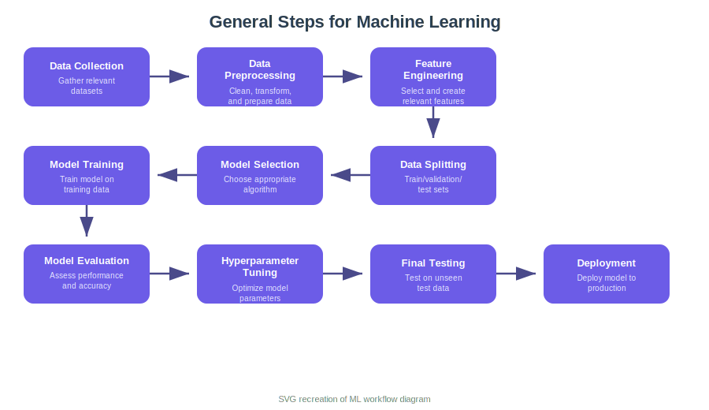{fig-align="center" width="90%"}

::: {.aside}
Source: Lecture material (SVG recreation)
:::

## What's Coming: Bias-Variance and Cross-Validation

-   Before we dive into specific ML algorithms, we need two foundational concepts that apply to **every** predictive model:

-   **Bias-Variance Tradeoff** — Every model makes two types of errors.

    -   **Bias** comes from oversimplifying (e.g., fitting a line to curved data).
    -   **Variance** comes from being too sensitive to the particular training sample (e.g., a very wiggly fit that changes dramatically with different data).

-   Finding the sweet spot between these is the central challenge of machine learning.

-   **Cross-Validation** — How do we know if our model will work on new data? We can't just test on the training data (that rewards memorization). Cross-validation provides honest estimates of predictive performance by systematically holding out portions of the data for testing.

These tools will guide every modeling decision we make from here forward.

## Overfitting vs. Underfitting

::::::: columns
:::: {.column width="50%"}
::: callout-caution
## Underfitting

-   Model too simple
-   High bias
-   Misses important patterns
-   Poor performance everywhere
:::
::::

:::: {.column width="50%"}
::: callout-warning
## Overfitting

-   Model too complex
-   High variance
-   Memorizes noise
-   Great on training, poor on testing
:::
::::
:::::::

## What Are Bias and Variance?

Understanding these two sources of error is fundamental to all machine learning:

-   **Bias** is the error from incorrect assumptions in the model.
    -   A model with high bias "underfits" — it misses relevant relationships.
    -   Think of fitting a straight line through clearly curved data.
    -   No matter how much data you collect, the line will always be wrong because the model structure itself is too simple.
-   **Variance** is the error from sensitivity to fluctuations in the training data.
    -   A model with high variance "overfits" — it captures noise as if it were signal.
    -   Think of fitting a 20th-degree polynomial to 25 data points.
    -   It hits every point perfectly, but a different random sample would produce a completely different wiggly curve.

The **irreducible error** (noise) represents the fundamental randomness in the data that no model can capture — biological variability, measurement error, unmeasured confounders.

## Bias-Variance Tradeoff

::: panel-tabset
### Equation

$$\text{Test Error} = \text{Bias}^2 + \text{Variance} + \text{Irreducible Error}$$

### LaTeX

``` text
\text{Test Error} = \text{Bias}^2 + \text{Variance} + \text{Irreducible Error}
```

### Interpretation

-   The total prediction error on new data has three irreducible components: squared bias, variance, and irreducible noise
-   **Bias** decreases as model complexity increases -- more flexible models can capture the true relationship more accurately
-   **Variance** increases as model complexity increases -- more flexible models are more sensitive to the particular training sample
-   The **optimal model** sits at the sweet spot where the sum of bias-squared and variance is minimized
-   **Irreducible error** represents fundamental randomness (biological variability, measurement noise) that no model can eliminate
:::

-   **Bias**: error from incorrect model assumptions (too simple)
-   **Variance**: error from sensitivity to training data (too complex)
-   Goal: balance flexibility with stability

## Bias-Variance Tradeoff — Visualized

::: panel-tabset
### Output

```{r}
#| echo: false
#| eval: true
#| fig-width: 9
#| fig-height: 6

par(mar = c(5, 5, 3, 2))

# Model complexity axis
x <- seq(0.5, 10, length.out = 200)

# Bias decreases with complexity
bias <- 3 * exp(-0.5 * x) + 0.1

# Variance increases with complexity
variance <- 0.05 * x^2

# Total error = bias^2 + variance + irreducible
irreducible <- 0.3
total <- bias^2 + variance + irreducible

# Scale for visualization
bias_plot <- bias * 1.5
var_plot <- variance * 0.8
total_plot <- (bias_plot + var_plot) * 0.7

plot(x, total_plot, type = "l", lwd = 3, col = "gray30",
     xlab = "Model Complexity", ylab = "Error",
     main = "Bias-Variance Tradeoff",
     ylim = c(0, max(total_plot) * 1.1),
     xaxt = "n", yaxt = "n",
     cex.lab = 1.4, cex.main = 1.5)

lines(x, bias_plot, lwd = 3, col = "darkred")
lines(x, var_plot, lwd = 3, col = "steelblue")

# Find optimal
opt_idx <- which.min(total_plot)
abline(v = x[opt_idx], lty = 3, col = "gray50", lwd = 1.5)

# Labels
text(1.5, max(bias_plot) * 0.85, "Bias", col = "darkred", cex = 1.4, font = 2)
text(8.5, max(var_plot) * 0.85, "Variance", col = "steelblue", cex = 1.4, font = 2)
text(8, max(total_plot) * 0.95, "Total Error", col = "gray30", cex = 1.4, font = 2)
text(x[opt_idx], -max(total_plot) * 0.02, "Optimal\nComplexity",
     cex = 1.0, srt = 0, adj = 0.5)

# Arrows for underfitting / overfitting
mtext("← Underfitting", side = 1, line = 2, adj = 0.1, cex = 1.1)
mtext("Overfitting →", side = 1, line = 2, adj = 0.9, cex = 1.1)
```

### Code

```{r}
#| echo: true
#| eval: false

# Simulate bias-variance tradeoff curves
x <- seq(0.5, 10, length.out = 200)
bias <- 3 * exp(-0.5 * x) + 0.1      # Bias decreases with complexity
variance <- 0.05 * x^2                # Variance increases with complexity
total <- (bias * 1.5 + variance * 0.8) * 0.7  # Total error = bias + variance

plot(x, total, type = "l", lwd = 3, col = "gray30",
     xlab = "Model Complexity", ylab = "Error",
     main = "Bias-Variance Tradeoff")
lines(x, bias * 1.5, lwd = 3, col = "darkred")
lines(x, variance * 0.8, lwd = 3, col = "steelblue")
abline(v = x[which.min(total)], lty = 3, col = "gray50")
```

### Interpretation

-   Bias decreases as model complexity increases — more flexible models can capture the true data-generating process more accurately
-   Variance increases with complexity — highly flexible models fit training noise and change dramatically across different training sets
-   Total error has a U-shape with a minimum at the optimal complexity — this sweet spot balances underfitting (too simple) and overfitting (too complex)
-   Cross-validation is the practical tool for finding this optimal complexity, since we cannot compute bias and variance directly from a single dataset
:::

## In-Class Demo: Overfitting in Action

::: panel-tabset
### Output

```{r}
#| label: overfit-demo-output
#| echo: false
#| eval: true
#| fig-width: 10
#| fig-height: 4

set.seed(1)
x_pop <- runif(1000, 0, 10)
y_pop <- 6 - 0.5 * x_pop + rnorm(1000, sd = 2)

set.seed(0)
idx <- sample(1000, 25)
x_samp <- x_pop[idx]; y_samp <- y_pop[idx]

par(mfrow = c(1, 2))

plot(x_pop, y_pop, col = "lightblue", pch = 19, cex = 0.5,
     main = "Linear Model (Appropriate)", xlab = "x", ylab = "y")
points(x_samp, y_samp, col = "black", pch = 19)
abline(lm(y_samp ~ x_samp), col = "red", lwd = 2)
abline(a = 6, b = -0.5, col = "blue", lwd = 2, lty = 2)
legend("topright", c("True line", "Sample fit"), col = c("blue", "red"), lty = c(2, 1), lwd = 2)

plot(x_pop, y_pop, col = "lightblue", pch = 19, cex = 0.5,
     main = "LOESS Model (Overfit)", xlab = "x", ylab = "y")
points(x_samp, y_samp, col = "black", pch = 19)
lines(sort(x_samp), predict(loess(y_samp ~ x_samp))[order(x_samp)], col = "red", lwd = 2)
abline(a = 6, b = -0.5, col = "blue", lwd = 2, lty = 2)
```

### Code

```{r}
#| label: overfit-demo-code
#| echo: true
#| eval: false

set.seed(1)
x_pop <- runif(1000, 0, 10)
y_pop <- 6 - 0.5 * x_pop + rnorm(1000, sd = 2)

set.seed(0)
idx <- sample(1000, 25)
x_samp <- x_pop[idx]; y_samp <- y_pop[idx]

par(mfrow = c(1, 2))

# Linear model: appropriate fit
plot(x_pop, y_pop, col = "lightblue", pch = 19, cex = 0.5,
     main = "Linear Model (Appropriate)")
points(x_samp, y_samp, col = "black", pch = 19)
abline(lm(y_samp ~ x_samp), col = "red", lwd = 2)

# LOESS: overfitting the sample noise
plot(x_pop, y_pop, col = "lightblue", pch = 19, cex = 0.5,
     main = "LOESS Model (Overfit)")
points(x_samp, y_samp, col = "black", pch = 19)
lines(sort(x_samp), predict(loess(y_samp ~ x_samp))[order(x_samp)],
      col = "red", lwd = 2)
```

### Interpretation

-   The **left panel** shows a linear model fit to 25 sampled points (black dots) from a true linear population (light blue) -- the sample fit (red) closely approximates the true line (blue dashed), demonstrating good generalization
-   The **right panel** shows a LOESS fit to the same 25 points -- it chases the noise in the sample, creating wiggles that do not exist in the true population
-   The LOESS model has lower training error (it passes closer to each sample point) but would perform worse on new data from the population -- this is the hallmark of **overfitting**
-   This demonstrates why cross-validation is essential: training error alone rewards memorization, not generalization
:::

# Cross-Validation {background-color="#2c3e50"}

## What is Cross-Validation?

-   Cross-validation is our primary tool for estimating how well a model will perform on **new, unseen data**.
-   The core idea is simple: repeatedly split your data into training and testing portions, fit the model on the training portion, and evaluate on the testing portion.

{fig-align="center" width="70%"}

::: {.aside}
Source: Lecture material
:::

## What is Cross-Validation? (SVG)

-   Cross-validation is our primary tool for estimating how well a model will perform on **new, unseen data**.
-   The core idea is simple: repeatedly split your data into training and testing portions, fit the model on the training portion, and evaluate on the testing portion.

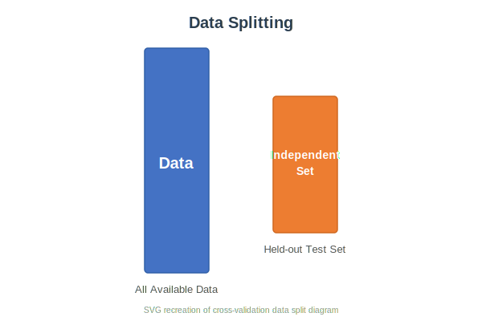{fig-align="center" width="70%"}

::: {.aside}
Source: Lecture material (SVG recreation)
:::

**Why we need it:**

-   Training error (how well the model fits its own data) is always optimistic — it rewards memorization.
-   Test error (how well it predicts new data) is what actually matters.
-   Cross-validation gives an honest estimate of test error without requiring a separate dataset.

## K-Fold Cross-Validation

The most common approach splits data into **K equally-sized folds** and cycles through them:

{fig-align="center" width="80%"}

::: {.aside}
Source: Lecture material
:::

**Process:**

1.  Split data into K folds (typically K = 5 or 10)
2.  For each fold: train on the other K − 1 folds, test on the held-out fold
3.  Record the test error for each fold
4.  Average across all K folds to get the **CV error estimate**

This ensures every observation gets used for both training and testing exactly once.

## K-Fold Cross-Validation (SVG)

The most common approach splits data into **K equally-sized folds** and cycles through them:

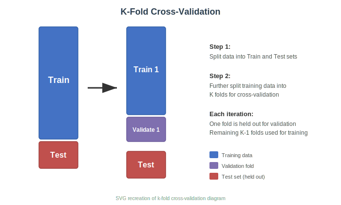{fig-align="center" width="80%"}

::: {.aside}
Source: Lecture material (SVG recreation)
:::

**Process:**

1.  Split data into K folds (typically K = 5 or 10)
2.  For each fold: train on the other K − 1 folds, test on the held-out fold
3.  Record the test error for each fold
4.  Average across all K folds to get the **CV error estimate**

This ensures every observation gets used for both training and testing exactly once.

## Using CV to Select Models

Cross-validation is most powerful when used to **compare models** of different complexity. The model with the lowest CV error achieves the best bias-variance tradeoff.

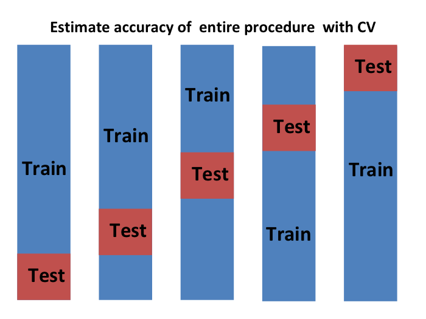{fig-align="center" width="80%"}

::: {.aside}
Source: Lecture material
:::

| K      | Description           | Properties                       |
|:-------|:----------------------|:---------------------------------|
| K = 5  | 5-fold CV             | Good balance, common choice      |
| K = 10 | 10-fold CV            | Most popular default             |
| K = n  | Leave-one-out (LOOCV) | Maximum training data, expensive |

## Using CV to Select Models (SVG)

Cross-validation is most powerful when used to **compare models** of different complexity. The model with the lowest CV error achieves the best bias-variance tradeoff.

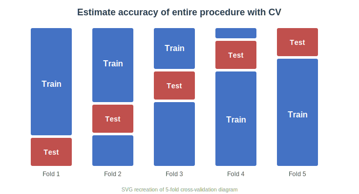{fig-align="center" width="80%"}

::: {.aside}
Source: Lecture material (SVG recreation)
:::

| K      | Description           | Properties                       |
|:-------|:----------------------|:---------------------------------|
| K = 5  | 5-fold CV             | Good balance, common choice      |
| K = 10 | 10-fold CV            | Most popular default             |
| K = n  | Leave-one-out (LOOCV) | Maximum training data, expensive |

## CV for Polynomial Degree Selection

::: panel-tabset
### Output

```{r}
#| label: cv-poly-output
#| echo: false
#| eval: true
#| fig-width: 9
#| fig-height: 5

set.seed(42)
n <- 80
x <- runif(n, 0, 6)
y <- 2 + 3*x - 0.5*x^2 + rnorm(n, 0, 1.5)
df <- data.frame(x, y)

cv_errors <- numeric(10)
for (d in 1:10) {
  cv_err <- 0
  for (i in 1:n) {
    fit <- lm(y ~ poly(x, d), data = df[-i, ])
    pred <- predict(fit, df[i, , drop = FALSE])
    cv_err <- cv_err + (df$y[i] - pred)^2
  }
  cv_errors[d] <- cv_err / n
}

plot(1:10, cv_errors, type = "b", pch = 19, col = "steelblue", lwd = 2,
     xlab = "Polynomial Degree", ylab = "LOOCV Error (MSE)",
     main = "Cross-Validation for Model Selection")
abline(v = which.min(cv_errors), lty = 2, col = "red")
legend("topright", paste("Optimal degree =", which.min(cv_errors)),
       col = "red", lty = 2, bty = "n")
```

### Code

```{r}
#| label: cv-poly-code
#| echo: true
#| eval: false

# LOOCV to select optimal polynomial degree
set.seed(42)
n <- 80
x <- runif(n, 0, 6)
y <- 2 + 3*x - 0.5*x^2 + rnorm(n, 0, 1.5)
df <- data.frame(x, y)

cv_errors <- numeric(10)
for (d in 1:10) {
  cv_err <- 0
  for (i in 1:n) {
    fit <- lm(y ~ poly(x, d), data = df[-i, ])
    pred <- predict(fit, df[i, , drop = FALSE])
    cv_err <- cv_err + (df$y[i] - pred)^2
  }
  cv_errors[d] <- cv_err / n
}

# The "elbow" shows where adding complexity stops helping
plot(1:10, cv_errors, type = "b", pch = 19, col = "steelblue",
     xlab = "Polynomial Degree", ylab = "LOOCV MSE",
     main = "Cross-Validation for Model Selection")
abline(v = which.min(cv_errors), lty = 2, col = "red")
```

### Key Insight

-   CV error initially decreases as the model becomes more flexible
-   After the optimal point, overfitting causes CV error to **increase**
-   This "elbow" identifies the best bias-variance tradeoff
-   Connects directly to model selection from Week 7

### Interpretation

-   The **LOOCV error curve** initially decreases as polynomial degree increases -- adding flexibility reduces bias
-   After the optimal degree (marked by the red dashed line), CV error begins to **increase** -- the model is now overfitting, capturing noise rather than signal
-   The optimal degree (typically 2 for this quadratic data) achieves the best **bias-variance tradeoff** -- complex enough to capture the true curvature but not so complex that it memorizes noise
-   This procedure directly connects to the model selection criteria (AIC, BIC) from Week 7 -- CV provides a direct, honest estimate of out-of-sample prediction error
:::

# Decision Trees - ClAssification and Regression Trees (CART) {background-color="#2c3e50"}

## Tree-Based Methods

-   Now that we understand **overfitting**, **bias-variance tradeoff**, and **cross-validation**, we can apply these concepts to our first machine learning algorithms.

-   **Decision trees** are an excellent starting point because they are intuitive, visually interpretable, and directly applicable to bioengineering classification and regression problems.

-   They also serve as building blocks for powerful ensemble methods like **random forests**.

-   We will use two bioengineering datasets:

    -   one for classification tree (biomaterial screening) and
    -   one for regression tree (scaffold cell growth).

## What are Decision Trees?

Decision trees are **supervised learning** models that recursively partition the feature space using simple if-then rules. They are among the most interpretable machine learning methods available and are widely used in biomedical and engineering applications.

**Key properties:**

-   Handle both **classification** (predicting a category) and **regression** (predicting a continuous value) — often called CART (Classification And Regression Trees)
-   Make **no assumptions** about the distribution of the data — no normality, no linearity required
-   Naturally capture **interactions** between predictors without specifying them explicitly
-   Produce predictions in the form of a **tree of if-then rules** that any collaborator, clinician, or regulator can follow
-   Are **robust to scale** — no need to standardize predictors

::: callout-note
### CART = Classification And Regression Trees

The most common algorithm is CART (Breiman et al., 1984), which uses **greedy binary splitting** — at each step, it finds the single best split that minimizes impurity (classification) or residual error (regression). This simplicity makes trees extremely fast to fit and easy to explain.
:::

## **How classification and regression trees differ:**

| Feature | Classification Tree | Regression Tree |
|:----------------|:-----------------------------|:------------------------|
| Outcome | Categorical (class label) | Continuous (numeric) |
| Splitting criterion | Gini impurity or entropy | Residual sum of squares (RSS) |
| Leaf prediction | Majority class | Mean of responses in leaf |
| Evaluation | Accuracy, AUC | RMSE, R² |

## How CART Works

::: panel-tabset
### Algorithm

1.  Start with all observations at the **root node**
2.  For each feature, evaluate all possible split points
3.  Choose the split that maximizes **purity** in the resulting child nodes
4.  Repeat recursively until a stopping criterion is met
5.  Assign predictions: majority class (classification) or mean (regression)

### Splitting Criteria

**Classification — Gini Impurity:** $$G = 1 - \sum_{k=1}^{K} p_k^2$$

**Classification — Entropy (Information Gain):** $$H = -\sum_{k=1}^{K} p_k \log_2(p_k)$$

**Regression — Mean Squared Error:** $$MSE = \frac{1}{n} \sum_{i=1}^{n} (y_i - \bar{y})^2$$

where $p_k$ is the proportion of class $k$ in the node.

### LaTeX

``` text
G = 1 - \sum_{k=1}^{K} p_k^2

H = -\sum_{k=1}^{K} p_k \log_2(p_k)

MSE = \frac{1}{n} \sum_{i=1}^{n} (y_i - \bar{y})^2
```

### Interpretation

-   CART greedily searches all features and all thresholds at each node, selecting the split that maximally reduces impurity — this makes it computationally intensive but thorough
-   Gini impurity and entropy both measure node "purity" and usually select the same splits; Gini is the default in most implementations because it avoids the logarithm computation
-   For regression trees, the splitting criterion is MSE reduction — equivalent to finding the split that maximizes the between-group variance
-   The recursive partitioning continues until a stopping rule (minimum node size, maximum depth, or minimum impurity reduction) prevents further splits
:::

# Classification

## Splitting Criterion: Gini Impurity

Gini impurity measures how "mixed" a node is — a value of 0 means the node is perfectly pure (all one class), and higher values indicate more mixing.

::: panel-tabset
### Equation

$$G = 1 - \sum_{k=1}^{K} p_k^2$$

where $p_k$ is the proportion of observations in class $k$ in the node.

**Weighted Gini after a split:**

$$G_{split} = \frac{n_L}{n} G_L + \frac{n_R}{n} G_R$$

The best split is the one that produces the **largest reduction** in weighted Gini:

$$\Delta G = G_{parent} - G_{split}$$

### LaTeX

``` text
G = 1 - \sum_{k=1}^{K} p_k^2

G_{split} = \frac{n_L}{n} G_L + \frac{n_R}{n} G_R

\Delta G = G_{parent} - G_{split}
```

### Worked Example

**Before split:** 100 observations, 50 biocompatible / 50 incompatible

$$G_{parent} = 1 - (0.5^2 + 0.5^2) = 1 - 0.5 = 0.50$$

**After splitting on coating = RGD:**

-   Left child (RGD, n=40): 35 biocompatible, 5 incompatible → $G_L = 1 - (0.875^2 + 0.125^2) = 0.219$
-   Right child (no RGD, n=60): 15 biocompatible, 45 incompatible → $G_R = 1 - (0.25^2 + 0.75^2) = 0.375$

$$G_{split} = \frac{40}{100}(0.219) + \frac{60}{100}(0.375) = 0.088 + 0.225 = 0.313$$

$$\Delta G = 0.50 - 0.313 = 0.187 \quad \text{(substantial improvement!)}$$

### Interpretation

-   **G = 0**: Node is perfectly pure (all one class) — leaf reached
-   **G = 0.5**: Maximum impurity for two-class problems (50/50 split)
-   **G close to 0**: Strong class separation — good split
-   Gini is fast to compute and the default in `rpart`
-   It is **not** the same as the Gini coefficient from economics
-   For $K = 2$ classes: $G = 2 p_1 (1 - p_1)$, which peaks at $p_1 = 0.5$
:::

## Splitting Criterion: Entropy and Information Gain

Entropy measures the amount of **disorder or uncertainty** in a node. It is borrowed from information theory (Shannon entropy) and is an alternative to Gini impurity.

::: panel-tabset
### Equation

$$H = -\sum_{k=1}^{K} p_k \log_2(p_k)$$

**Information Gain** — the reduction in entropy after a split:

$$IG = H_{parent} - \left( \frac{n_L}{n} H_L + \frac{n_R}{n} H_R \right)$$

CART maximizes information gain, equivalently minimizing the weighted entropy of child nodes.

### LaTeX

``` text
H = -\sum_{k=1}^{K} p_k \log_2(p_k)

IG = H_{parent} - \left( \frac{n_L}{n} H_L + \frac{n_R}{n} H_R \right)
```

### Gini vs. Entropy

| Property | Gini Impurity | Entropy |
|:---------------------|:-----------------------------|:-------------------|
| **Range** | 0 to 0.5 (binary) | 0 to 1 bit (binary) |
| **Computation** | Faster (no log) | Slightly slower |
| **Sensitivity** | Less sensitive to class imbalance | More sensitive |
| **Shape** | Slightly flatter curve | Sharper at extremes |
| **In practice** | Default in `rpart`, scikit-learn | Often gives very similar splits |

In the vast majority of real datasets, Gini and entropy produce **nearly identical trees**. The choice rarely matters — but Gini is preferred for speed.

### Worked Example

Same 100 observations, 50 biocompatible / 50 incompatible:

$$H_{parent} = -(0.5 \log_2 0.5 + 0.5 \log_2 0.5) = -(-0.5 - 0.5) = 1.0 \text{ bit}$$

After the same RGD coating split:

-   Left (n=40): $H_L = -(0.875 \log_2 0.875 + 0.125 \log_2 0.125) = 0.544$
-   Right (n=60): $H_R = -(0.25 \log_2 0.25 + 0.75 \log_2 0.75) = 0.811$

$$IG = 1.0 - \left(\frac{40}{100}(0.544) + \frac{60}{100}(0.811)\right) = 1.0 - 0.704 = 0.296 \text{ bits}$$

### Interpretation

-   **Entropy** measures uncertainty in bits -- a pure node (all one class) has 0 bits of entropy, while a maximally mixed node has 1 bit (for binary classification)
-   **Information gain** quantifies how much a split reduces uncertainty -- larger gains mean the split creates more homogeneous child nodes
-   In practice, **Gini and entropy produce nearly identical trees** for most datasets -- Gini is slightly faster to compute and is the default in most implementations
-   The worked example shows that the RGD coating split achieves an information gain of 0.296 bits, confirming it is a strong predictor of biocompatibility
:::

## Biomaterial Screening Dataset

::: callout-note
### Study Description

A biomaterials research group screened 200 scaffold formulations for biocompatibility. Each scaffold varied in porosity, mechanical stiffness, surface coating (none, collagen, or RGD peptide), and surface roughness. After 14 days of cell culture, each scaffold was classified as biocompatible or incompatible based on cell viability thresholds.
:::

| Variable | Type | Description | Units / Levels |
|:-----------------|:-----------------|:-----------------|:-----------------|
| `porosity` | Continuous | Scaffold porosity | \% (20--85) |
| `stiffness` | Continuous | Compressive modulus | kPa |
| `coating` | Categorical | Surface coating type | none, collagen, RGD |
| `roughness` | Continuous | Average surface roughness (Ra) | μm |
| `compat_score` | Binary | Biocompatibility classification | biocompatible / incompatible |

::: panel-tabset
### Code

```{r}
#| label: biocompat-load
#| eval: false
#| echo: true

# Load the biomaterial screening dataset
biomat <- read_csv("data/biomaterial_screening.csv")
biomat$coating <- factor(biomat$coating)
biomat$compat_score <- factor(biomat$compat_score)
glimpse(biomat)
```

### Interpretation

-   Converting `coating` and `compat_score` to factors ensures R treats them as categorical variables for tree-based models
-   The `glimpse()` function provides a quick overview of variable types and sample values — always inspect your data before modeling
-   This dataset has a binary outcome (`biocompatible` vs. `incompatible`), making it suitable for classification trees and random forests
:::

## CART Classification: The Algorithm

::: panel-tabset
### Algorithm Steps

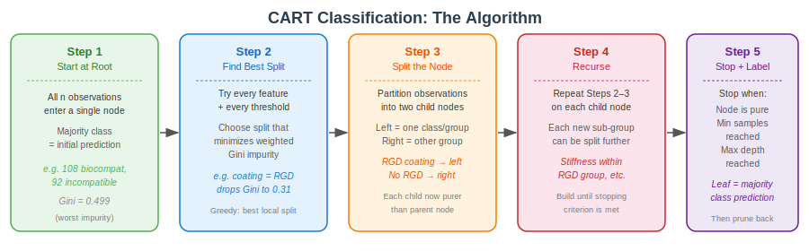{fig-align="center" width="95%"}

::: {.aside}
Source: Lecture material
:::

### How to Read This Diagram

Each step occurs at every node during tree construction:

1.  **Start at Root** — all training observations enter the tree as a single node; the majority class becomes the initial prediction
2.  **Find Best Split** — exhaustively try every feature and every possible threshold; select the one that maximally reduces Gini impurity
3.  **Split the Node** — partition the observations into two child nodes based on the winning feature + threshold
4.  **Recurse** — repeat Steps 2–3 independently within each child node
5.  **Stop + Label** — stop when a termination criterion is met (minimum node size, maximum depth, or CP threshold); label each leaf with its majority class

This is a **greedy top-down algorithm**: each split is locally optimal, not globally optimal. A different first split might produce a better tree overall, but the search space is too large to evaluate exhaustively.

### Interpretation

-   The CART classification algorithm builds a decision tree by recursively finding the split (feature + threshold) that most reduces impurity, measured by Gini or entropy
-   At each leaf node, the predicted class is the majority class among the training observations that fall into that region
-   The greedy nature of the algorithm means it may not find the globally optimal tree, but it is computationally efficient and produces interpretable results
-   Stopping rules (minimum node size, maximum depth, cp threshold) prevent the tree from growing too deep and overfitting the training data
:::

## Decision Tree: Biomaterial Biocompatibility

::: panel-tabset
### Output

```{r}
#| label: cart-biocompat-output
#| echo: false
#| eval: true
#| fig-width: 10
#| fig-height: 6

library(rpart)
library(rpart.plot)

# Simulate biomaterial screening data
set.seed(2026)
n <- 200
biomat <- data.frame(
  porosity = runif(n, 20, 85),
  stiffness = rnorm(n, 50, 15),
  coating = sample(c("none", "collagen", "RGD"), n, replace = TRUE),
  roughness = runif(n, 0.5, 5)
)

biomat$compat_score <- with(biomat, {
  base <- -0.002 * (porosity - 55)^2 + 0.01 * stiffness +
    ifelse(coating == "RGD", 1.5, ifelse(coating == "collagen", 0.8, 0)) +
    0.2 * roughness + rnorm(n, 0, 1)
  factor(ifelse(base > 1.5, "biocompatible", "incompatible"))
})

# Fit classification tree
tree_model <- rpart(compat_score ~ porosity + stiffness + coating + roughness,
                    data = biomat, method = "class",
                    control = rpart.control(cp = 0.02, maxdepth = 4))

rpart.plot(tree_model, type = 4, extra = 104,
           box.palette = c("#e74c3c", "#27ae60"),
           main = "Biomaterial Biocompatibility Classification Tree",
           cex = 0.85)
```

### Code

```{r}
#| label: cart-biocompat-code
#| echo: true
#| eval: false

library(rpart)
library(rpart.plot)

# Fit classification tree
tree_model <- rpart(compat_score ~ porosity + stiffness + coating + roughness,
                    data = biomat, method = "class",
                    control = rpart.control(cp = 0.02, maxdepth = 4))

rpart.plot(tree_model, type = 4, extra = 104,
           box.palette = c("#e74c3c", "#27ae60"),
           main = "Biomaterial Biocompatibility Classification Tree")
```

### Interpretation

-   The tree **automatically discovers** which material properties matter most for biocompatibility
-   Each **leaf node** shows the predicted class and the proportion of training samples
-   The tree captures that RGD coating dramatically improves biocompatibility
-   Stiffness and porosity interact — the tree finds non-linear thresholds automatically
-   This is interpretable enough to share directly with materials science collaborators
:::


## Overfitting and Pruning

A fully grown tree memorizes the training data. **Pruning** removes branches that don't improve generalization.

::: panel-tabset
### Output

```{r}
#| label: cart-pruning-output
#| echo: false
#| eval: true
#| fig-width: 10
#| fig-height: 5

# Grow a complex tree
big_tree <- rpart(compat_score ~ porosity + stiffness + coating + roughness,
                  data = biomat, method = "class",
                  control = rpart.control(cp = 0.001, minsplit = 5))

# Plot CP table
par(mfrow = c(1, 2))
plotcp(big_tree, main = "Cross-Validation Error vs. Complexity")

# Prune to optimal cp (1-SE rule)
optimal_cp <- big_tree$cptable[which.min(big_tree$cptable[, "xerror"]), "CP"]
pruned_tree <- prune(big_tree, cp = optimal_cp)
rpart.plot(pruned_tree, type = 4, extra = 104,
           box.palette = c("#e74c3c", "#27ae60"),
           main = "Pruned Tree (Optimal CP)", cex = 0.8)
```

### Code

```{r}
#| label: cart-pruning-code
#| echo: true
#| eval: false

# Step 1: Grow a complex tree (low cp allows many splits)
big_tree <- rpart(compat_score ~ porosity + stiffness + coating + roughness,
                  data = biomat, method = "class",
                  control = rpart.control(cp = 0.001, minsplit = 5))

# Step 2: Examine the CP table (cross-validated error)
printcp(big_tree)
plotcp(big_tree)

# Step 3: Find optimal cp using 1-SE rule
optimal_cp <- big_tree$cptable[which.min(big_tree$cptable[, "xerror"]), "CP"]

# Step 4: Prune to optimal complexity
pruned_tree <- prune(big_tree, cp = optimal_cp)

# Step 5: Visualize the pruned tree
rpart.plot(pruned_tree, type = 4, extra = 104)
```

### Interpretation

-   The **CP plot** shows cross-validated error at each tree size
-   The **1-SE rule**: choose the simplest tree within 1 standard error of the minimum — more conservative, better generalization
-   Pruning reduces overfitting while keeping the important splits
-   A simpler tree is easier to interpret and often predicts better on new data
:::

## Cost-Complexity Pruning: The Full Procedure

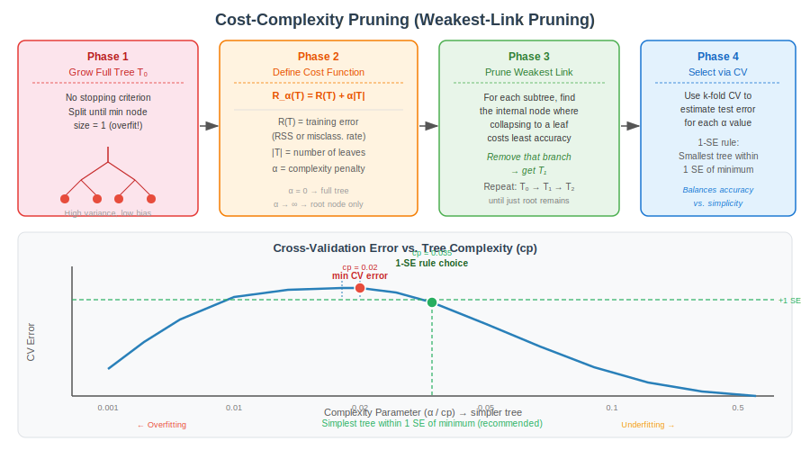{fig-align="center" width="95%"}

::: {.aside}
Source: Lecture material
:::

::: callout-important
### The 1-SE Rule (Recommended)

Rather than choosing the tree with **minimum** CV error, the 1-SE rule selects the **simplest tree** whose CV error is within one standard error of the minimum. This gives a parsimonious tree that is nearly as accurate as the best model — a good trade-off between interpretability and fit.

In R: `cp = tree$cptable[which.min(tree$cptable[,"xerror"]),"CP"]` finds the minimum, then find the smallest tree within `+1*xstd` of that minimum.
:::

# Regression Trees
## The Logic Behind Regression Trees

Decision trees also work for **continuous outcomes**. Instead of Gini impurity, the splitting criterion is **Residual Sum of Squares (RSS)**:

::: panel-tabset
### Equation

At each node, the algorithm finds the split that minimizes the combined within-group variance of the two child nodes:

$$\text{RSS}_{split} = \sum_{i \in \text{Left}} (y_i - \bar{y}_L)^2 + \sum_{i \in \text{Right}} (y_i - \bar{y}_R)^2$$

The best split minimizes $\text{RSS}_{split}$. Equivalently, it **maximizes the reduction in RSS**:

$$\Delta \text{RSS} = \text{RSS}_{parent} - \text{RSS}_{split}$$

### LaTeX

``` text
\text{RSS}_{split} = \sum_{i \in \text{Left}} (y_i - \bar{y}_L)^2 + \sum_{i \in \text{Right}} (y_i - \bar{y}_R)^2

\Delta \text{RSS} = \text{RSS}_{parent} - \text{RSS}_{split}
```

### Key Differences from Classification

| Feature | Classification Tree | Regression Tree |
|:----------------|:-----------------------------|:------------------------|
| Splitting criterion | Gini impurity / Entropy | Residual Sum of Squares |
| Leaf prediction | Majority class vote | Mean of leaf responses (ȳ) |
| Prediction type | Discrete class label | Continuous constant (step function) |
| Performance metric | Accuracy, AUC | RMSE, R² |
| Pruning objective | Misclassification rate | RSS / MSE |

### Intuition

The algorithm is searching for the feature and threshold that **divide the data into groups that are as homogeneous in y as possible**. Within each group, the prediction is simply the group mean. This creates a **piecewise constant (step-function) prediction surface** — a key limitation that random forests substantially overcome.

### Interpretation

-   Regression trees split the data to **minimize within-group variance** -- each split creates two groups whose members are as similar in response as possible
-   Unlike classification trees that predict a class label, regression tree leaves predict the **mean response** of all observations in that region
-   The prediction surface is a **step function** -- discontinuous jumps at split boundaries. This is both a strength (captures non-linearity) and a limitation (no smooth transitions)
-   Random forests overcome the step-function limitation by averaging many trees, producing much smoother prediction surfaces
:::

## Regression Tree: Step-by-Step

::: panel-tabset
### Algorithm Flow

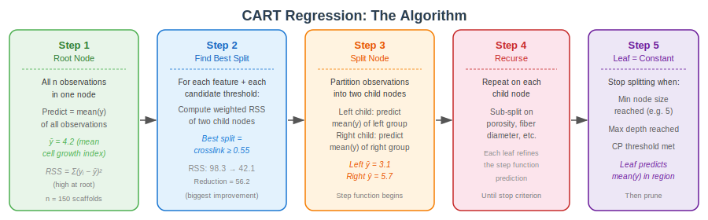{fig-align="center" width="95%"}

::: {.aside}
Source: Lecture material
:::

### Notes

The regression CART algorithm is structurally identical to classification CART — the only difference is the objective function at each split:


After fitting, each **leaf node** covers a region of predictor space and predicts the **mean response** of all training observations in that region. This step-function structure means regression trees can approximate non-linear relationships but produce discontinuous predictions.

**Practical considerations:**

-   More splits → lower training RSS, but higher test error (overfitting)
-   Cost-complexity pruning (same α / cp mechanism as classification) controls complexity
-   With strong predictors, trees can capture non-linear relationships and interactions without specifying them

### Interpretation

-   Regression trees predict a continuous outcome by partitioning the predictor space into rectangular regions and assigning the mean response within each region
-   The splitting criterion is RSS reduction — each split finds the variable and threshold that most reduces the sum of squared residuals
-   Pruning via cost-complexity (cp) is essential to prevent overfitting — an unpruned tree will perfectly fit the training data but generalize poorly
-   Regression trees naturally capture non-linear relationships and interactions without specifying them in the model formula
:::

## Scaffold Cell Growth Dataset

::: callout-note
### Study Description

Researchers fabricated 150 electrospun scaffolds with varying porosity, fiber diameter, and crosslink density. After 7 days of culture with osteoblasts, they measured a cell growth index to determine which scaffold properties most influence cell proliferation.
:::

| Variable            | Type       | Description                | Units           |
|:----------------|:----------------|:---------------------|:----------------|
| `porosity`          | Continuous | Scaffold porosity          | \% (20--85)     |
| `fiber_diameter`    | Continuous | Average fiber diameter     | nm              |
| `crosslink_density` | Continuous | Degree of crosslinking     | fraction (0--1) |
| `cell_growth`       | Continuous | Cell growth index at day 7 | AU              |


## Regression Tree: Scaffold Cell Growth

::: panel-tabset
### Output

```{r}
#| label: cart-regression-output
#| echo: false
#| eval: true
#| fig-width: 10
#| fig-height: 5

# Regression tree: predict cell growth from scaffold properties
set.seed(42)
scaffold_reg <- data.frame(
  porosity = runif(150, 20, 85),
  fiber_diameter = rnorm(150, 500, 100),
  crosslink_density = runif(150, 0.1, 0.9)
)
scaffold_reg$cell_growth <- with(scaffold_reg, {
  2 + 0.05 * porosity - 0.002 * (porosity - 55)^2 +
    0.003 * fiber_diameter + 1.5 * crosslink_density +
    rnorm(150, 0, 0.5)
})

reg_tree <- rpart(cell_growth ~ porosity + fiber_diameter + crosslink_density,
                  data = scaffold_reg, method = "anova",
                  control = rpart.control(cp = 0.02))

par(mfrow = c(1, 2))
rpart.plot(reg_tree, type = 4, digits = 3,
           main = "Regression Tree: Cell Growth", cex = 0.8)

# Predicted vs actual
pred_vals <- predict(reg_tree, scaffold_reg)
plot(scaffold_reg$cell_growth, pred_vals, pch = 16, col = "#3498db80",
     xlab = "Actual Cell Growth", ylab = "Predicted",
     main = "Predicted vs. Actual")
abline(0, 1, col = "red", lwd = 2, lty = 2)
```

### Code

```{r}
#| label: cart-regression-code
#| echo: true
#| eval: false

# Regression tree uses method = "anova"
reg_tree <- rpart(cell_growth ~ porosity + fiber_diameter + crosslink_density,
                  data = scaffold_reg, method = "anova",
                  control = rpart.control(cp = 0.02))

# Visualize
rpart.plot(reg_tree, type = 4, digits = 3)

# Check predictions
pred_vals <- predict(reg_tree, scaffold_reg)
cor(scaffold_reg$cell_growth, pred_vals)^2  # R-squared
```

### Interpretation

-   Regression trees predict the **mean** of training observations in each leaf node
-   The step-function nature of predictions is a limitation — predictions are discrete, not smooth
-   Useful for discovering non-linear thresholds (e.g., "porosity above 60% is the key cutoff")
-   R² for a single tree is often modest — this motivates **ensemble methods** like Random Forests
:::

## Handling Missing Data in CART

Decision trees have a built-in mechanism for missing data called **surrogate splits** — a major practical advantage over most regression-based methods.

**How surrogate splits work for both classification and regression:**

1.  At each node, CART first identifies the **primary split** — the feature and threshold that best reduces impurity/RSS
2.  It then ranks all **other predictors** by how well they *mimic* that primary split (i.e., assign the same observations to left/right child)
3.  When a test observation has a missing value for the primary split variable, CART substitutes the **best available surrogate**
4.  If all surrogates are also missing, the observation is sent to the **majority child node** (classification) or the **larger child node** (regression)

**Example:** In the scaffold dataset, the primary split might be `crosslink_density ≥ 0.55`. If crosslink density is missing for a new scaffold, CART checks whether `porosity` or `fiber_diameter` makes a similar split — e.g., `porosity ≥ 60%` agrees 78% of the time, making it a good surrogate.


## Handling Missing Data in CART


**Classification vs. Regression with missing data**

-   **Classification surrogates:** evaluated by their agreement rate — what fraction of observations go to the same child as the primary split
-   **Regression surrogates:** evaluated by the RSS reduction — does the surrogate produce a similar reduction in variance as the primary split?
-   In both cases, the surrogate ordering is pre-computed at training time, so prediction with missing values is fast
-   `rpart` in R automatically computes and stores surrogate splits; the default `maxsurrogate = 5` stores the top 5 alternatives per node


::: panel-tabset
### Code

```{r}
#| echo: true
#| eval: false

# Inspect surrogate splits
summary(tree_model)  # Prints primary + surrogate splits at each node

# rpart handles missing values automatically during prediction
predict(tree_model, newdata = test_data_with_NAs)  # No error needed
```

### Interpretation

-   The `summary()` function on an rpart model reveals surrogate splits at each node — alternative variables that produce similar partitions when the primary variable is missing
-   Surrogate splits are ranked by their agreement rate with the primary split, and the top 5 are stored by default (`maxsurrogate = 5`)
-   This built-in missing data handling is a major practical advantage of decision trees over methods that require complete cases or imputation
-   During prediction, if a variable used for a split is missing, rpart automatically uses the best available surrogate — no preprocessing needed
:::

## CART Summary: Strengths and Weaknesses

::: callout-important
### Strengths

-   **Highly interpretable** — easy to explain to non-statisticians and collaborators
-   **No assumptions** about data distribution, linearity, or homoscedasticity
-   **Automatic feature selection** — unimportant variables are simply not used for splits
-   **Handles interactions** naturally without specifying them in advance
-   **Built-in missing data handling** via surrogate splits
-   Works for both classification and regression
:::

::: callout-warning
### Weaknesses

-   **High variance** — small changes in data can produce very different trees
-   **Prone to overfitting** — fully grown trees memorize noise (pruning helps, but doesn't fully solve this)
-   **Greedy algorithm** — each split is locally optimal, not globally optimal
-   **Step-function predictions** — regression trees produce discontinuous predictions
-   **Biased toward variables with many levels** — categorical variables with many categories get more split opportunities

These weaknesses — especially the high variance and overfitting tendency — are precisely what **random forests** were designed to address.
:::


------------------------------------------------------------------------

# Random Forests {background-color="#2c3e50"}

## Why Do We Need Random Forests?

- We just saw that single decision trees are **interpretable but fragile**. 

- Small changes in the training data can produce very different trees. 

- This is the **high variance** problem: the model is fitting noise, not signal.

::: callout-warning
### The Core Problem with Single Trees

-   **Greedy splitting** — each split is locally optimal, not globally optimal; a different first split might give a better overall tree
-   **High variance** — bootstrap a new sample from the same population and you often get a completely different tree structure
-   **Instability** — variable importance estimates from a single tree are unreliable
-   **Step-function predictions** — regression trees produce discontinuous predictions with sharp boundaries

A single tree's training accuracy can be high while its test accuracy is poor — classic overfitting.
:::

## The solution: combine many trees

- If we can build many diverse, somewhat accurate trees and combine their predictions, the errors will tend to **cancel out**. 
- This is the principle of **ensemble learning**, and random forests are its most successful implementation for decision trees.

| Problem | Random Forest Solution |
|:------------------------|:--------------------------------------------------|
| High variance per tree | Average 500+ trees — variance drops by \~B |
| Trees correlated | Random feature selection at each split — decorrelates trees |
| No free validation set | Out-of-Bag (OOB) estimation — free internal cross-validation |
| Unstable variable importance | Permutation-based importance over all 500 trees |

## Bootstrap Aggregating (Bagging)

- Before diving into random forests, we need to understand the two key ideas they build on: 
    - **bagging** and 
    - **out-of-bag (OOB) estimation**.

## Bootstrap Aggregating (Bagging)

**Bagging** (Bootstrap AGGregatING):

1.  Draw $B$ bootstrap samples from the training data (sample **with replacement**, same size $n$)
2.  Each bootstrap sample contains \~63% unique observations; the remaining \~37% are **not sampled** (out-of-bag)
3.  Fit one decision tree on each bootstrap sample — all $B$ trees are independent
4.  **Aggregate predictions:**
    -   Classification: majority vote across all $B$ trees
    -   Regression: average of all $B$ predicted values


**Why does this help?** If we have $B$ independent trees each with variance $\sigma^2$, the variance of their average is $\sigma^2 / B$. In practice trees are correlated (not independent), so the reduction is smaller, but still substantial.

## Bootstrap Aggregating (Bagging)

**Out-of-Bag (OOB) Estimation:**

- The \~37% of observations not used to train each tree serve as a **natural held-out test set** for that tree. 

- For each observation, we average predictions from all trees that did *not* train on it. 

- This gives a nearly unbiased estimate of generalization error — **no separate validation set needed**.


## The Random Forest Algorithm

- A single decision tree is interpretable but often has high variance — small changes in data can produce very different trees. 
- **Random Forests** solve this by averaging many decorrelated trees.

**The Random Forest algorithm:**

1.  Draw a **bootstrap sample** (sample with replacement) from the training data (\~63% unique observations)
2.  Grow a decision tree, but at each split, consider only a **random subset** of features ($m \approx \sqrt{p}$ for classification, $m \approx p/3$ for regression)
3.  Repeat steps 1-2 for $B$ trees (typically 500+)
4.  **Aggregate** predictions: majority vote (classification) or average (regression)

::: callout-note
### Why randomize features?

If one predictor is very strong, every tree in a simple bagging ensemble would split on it first, making the trees correlated. Random feature selection **decorrelates** the trees, reducing variance of the ensemble. This is the key innovation of random forests over basic bagging.
:::
## Bagging and OOB: Workflow

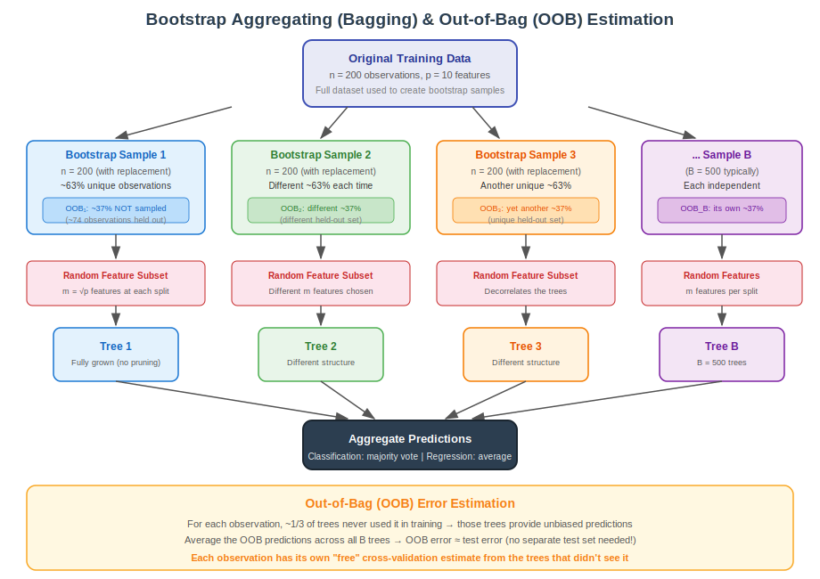{fig-align="center" width="95%"}

::: {.aside}
Source: Lecture material (SVG recreation)
:::


## Random Forest: Classification — OOB Error Convergence

- We return to the **biomaterial screening dataset** (200 scaffolds, 4 properties, biocompatible/incompatible). 
- Earlier, a single CART tree identified coating type and stiffness as important predictors. 
- Now we fit a forest of 500 trees. 
- Each tree sees a different bootstrap sample and considers only 2 random features at each split.

::: panel-tabset
### OOB Error Plot

```{r}
#| label: rf-oob-output
#| echo: false
#| eval: true
#| fig-width: 8
#| fig-height: 5

library(randomForest)

set.seed(2026)
rf_model <- randomForest(compat_score ~ porosity + stiffness + coating + roughness,
                         data = biomat, ntree = 500, mtry = 2, importance = TRUE)

# OOB error convergence
plot(rf_model, main = "OOB Error vs. Number of Trees",
     col = c("black", "#e74c3c", "#2980b9"), lwd = 2)
legend("topright", colnames(rf_model$err.rate),
       col = c("black", "#e74c3c", "#2980b9"), lty = 1:3, lwd = 2, cex = 0.9)
```

### Code

```{r}
#| label: rf-oob-code
#| echo: true
#| eval: false

library(randomForest)

set.seed(2026)
rf_model <- randomForest(compat_score ~ porosity + stiffness + coating + roughness,
                         data = biomat, ntree = 500, mtry = 2, importance = TRUE)

# OOB error by number of trees — use to choose ntree
plot(rf_model, main = "OOB Error vs. Number of Trees")
legend("topright", colnames(rf_model$err.rate), col = 1:3, lty = 1:3)

# Summary includes OOB confusion matrix and error rate
print(rf_model)
```

### Interpretation

-   The OOB error converges as more trees are added — typically \~200 trees suffices
-   The **overall OOB error** (black line) is a free, near-unbiased estimate of test error — no separate validation set needed
-   Per-class error rates (colored lines) reveal if one class is harder to classify — important in imbalanced datasets
-   If error is still decreasing at 500 trees, increase `ntree`
:::

## Random Forest: Classification — Variable Importance

::: panel-tabset
### Variable Importance Plots

```{r}
#| label: rf-varimp-output
#| echo: false
#| eval: true
#| fig-width: 9
#| fig-height: 5

varImpPlot(rf_model, main = "Variable Importance — Biomaterial Biocompatibility",
           pch = 19, col = "#2c3e50", cex = 1.2)
```

### Code

```{r}
#| label: rf-varimp-code
#| echo: true
#| eval: false

# Variable importance — two measures
varImpPlot(rf_model, main = "Variable Importance", pch = 19)

# Numeric values
importance(rf_model)

# OOB confusion matrix
rf_model$confusion
```

### Interpreting the Two Measures

**Mean Decrease Accuracy (left panel):** How much does the OOB accuracy drop when we randomly permute this variable's values? A large drop means the variable is important — shuffling it badly hurts predictions.

**Mean Decrease Gini (right panel):** Total reduction in node impurity across all trees from splits on this variable. Faster to compute but slightly biased toward continuous variables with many possible thresholds.


### Interpretation

-   **Mean Decrease Accuracy** (permutation importance) measures how much prediction accuracy drops when a variable's values are randomly shuffled -- larger drops indicate more important variables
-   **Mean Decrease Gini** measures the total reduction in node impurity across all trees when splitting on that variable -- variables that produce purer nodes are more important
-   Variables that rank highly on both measures are the most reliably important predictors in the model
-   Variable importance does not imply causation -- it reflects predictive utility within the random forest model, which may include correlated surrogates
:::

## Random Forest: Regression — Setup

- We return to the **scaffold cell growth dataset** (150 electrospun scaffolds, 3 properties). The single regression tree achieved R² ≈ 0.71, but its step-function predictions were coarse — a plateau over the crosslink density × porosity space.

- **The random forest hypothesis:** By averaging 500 trees, each trained on a slightly different bootstrap sample with random feature selection, we can: 1. Smooth out the staircase prediction surface 2. Reduce variance without meaningfully increasing bias 3. Get reliable variable importance estimates across all three scaffold properties 4. Use OOB predictions as honest out-of-sample estimates (no test set needed)

- **Key parameters:**
    - `ntree = 500` — 500 bootstrap samples + trees
    - `mtry = 1` — at each split, consider only 1 of 3 predictors (≈ p/3 for regression)
    - `importance = TRUE` — compute permutation-based variable importance

## Random Forest: Regression — Results

::: panel-tabset
### Output

```{r}
#| label: rf-reg-output
#| echo: false
#| eval: true
#| fig-width: 10
#| fig-height: 5

set.seed(42)
rf_reg <- randomForest(cell_growth ~ porosity + fiber_diameter + crosslink_density,
                       data = scaffold_reg, ntree = 500, mtry = 1, importance = TRUE)

par(mfrow = c(1, 2))
# Predicted vs actual
rf_pred <- predict(rf_reg, scaffold_reg)
plot(scaffold_reg$cell_growth, rf_pred, pch = 16, col = "#3498db80",
     xlab = "Actual Cell Growth", ylab = "RF Predicted",
     main = sprintf("Random Forest  (R² = %.3f)", cor(scaffold_reg$cell_growth, rf_pred)^2),
     cex.main = 1.0)
abline(0, 1, col = "red", lwd = 2, lty = 2)
legend("topleft", "Ideal", col = "red", lty = 2, lwd = 2, cex = 0.8)

# Compare with single tree
tree_pred <- predict(reg_tree, scaffold_reg)
plot(scaffold_reg$cell_growth, tree_pred, pch = 16, col = "#e67e2280",
     xlab = "Actual Cell Growth", ylab = "Single Tree Predicted",
     main = sprintf("Single Tree  (R² = %.3f)", cor(scaffold_reg$cell_growth, tree_pred)^2),
     cex.main = 1.0)
abline(0, 1, col = "red", lwd = 2, lty = 2)
```

### Code

```{r}
#| label: rf-reg-code
#| echo: true
#| eval: false

# Random forest regression — p/3 features per split is default for regression
rf_reg <- randomForest(cell_growth ~ porosity + fiber_diameter + crosslink_density,
                       data = scaffold_reg, ntree = 500, mtry = 1, importance = TRUE)

# Compare performance metrics
cat("Single Tree R²:", cor(predict(reg_tree, scaffold_reg), scaffold_reg$cell_growth)^2, "\n")
cat("Random Forest R²:", cor(predict(rf_reg, scaffold_reg), scaffold_reg$cell_growth)^2, "\n")
cat("Random Forest OOB MSE:", rf_reg$mse[500], "\n")  # Honest estimate

# Variable importance
varImpPlot(rf_reg, main = "Variable Importance — Cell Growth")
importance(rf_reg)
```

### Interpretation

-   The random forest **dramatically outperforms** the single tree — the scatterplot points hug the diagonal far more tightly
-   Averaging 500 trees eliminates the step-function artifact; predictions are now a smooth surface over the predictor space
-   The **OOB R²** (stored in `rf_reg$rsq[500]`) is the honest out-of-sample estimate — typically lower than training R²
-   **Variable importance:** crosslink density dominates; porosity is secondary; fiber diameter contributes less — consistent with the regression tree but more reliable due to averaging across 500 trees
:::

## Decision Trees vs. Random Forests

| Feature | Decision Tree | Random Forest |
|:-----------------------|:-----------------------|:-----------------------|
| **Interpretability** | High (visualize the tree) | Lower (500 trees) |
| **Variance** | High (unstable) | Low (averaging) |
| **Bias** | Low (flexible) | Slightly higher |
| **Overfitting risk** | High | Low (OOB validation) |
| **Variable importance** | Implicit (top splits) | Explicit (permutation-based) |
| **Speed** | Fast | Slower (but parallelizable) |

::: callout-tip
### Practical Guidance

Use **decision trees** when interpretability is paramount (explaining results to clinicians, regulators). Use **random forests** when prediction accuracy matters most. You can always fit both — the single tree tells you *what matters*, the forest tells you *how well you can predict*.
:::

# Understanding Odds, Log Odds, and Odds Ratios {background-color="#d4edda"}

## From Predictions to Effect Sizes

- Our random forest classifiers produce **predictions** — for each scaffold, a probability of being biocompatible. 

- We can threshold those probabilities to get a confusion matrix, and we can summarize performance across all thresholds with a **ROC curve and AUC**. 

- But predictions alone don't answer a different question: **by how much does a specific factor (like coating type) change the probability of an outcome?**

For that, we need the language of **odds and odds ratios** — and we need to understand why we can't just compare probabilities directly.


## From Predictions to Effect Sizes

Let's use the confusion matrix from our biomaterial random forest to motivate the ROC curve, then move to odds and log odds to quantify effects.

::: panel-tabset
### Output

```{r}
#| echo: false
#| eval: true

cat("=== Random Forest OOB Confusion Matrix ===\n")
print(rf_model$confusion)
cat("\nSensitivity (biocompatible correctly identified):",
    round(rf_model$confusion["biocompatible","biocompatible"] /
          sum(rf_model$confusion["biocompatible",1:2]), 3), "\n")
cat("Specificity (incompatible correctly identified):  ",
    round(rf_model$confusion["incompatible","incompatible"] /
          sum(rf_model$confusion["incompatible",1:2]), 3), "\n")
```

### Code

```{r}
#| echo: true
#| eval: false

# Print the OOB confusion matrix from randomForest
print(rf_model$confusion)

# Calculate sensitivity and specificity
sensitivity <- rf_model$confusion["biocompatible","biocompatible"] /
               sum(rf_model$confusion["biocompatible",1:2])
specificity <- rf_model$confusion["incompatible","incompatible"] /
               sum(rf_model$confusion["incompatible",1:2])
cat("Sensitivity:", round(sensitivity, 3), "\n")
cat("Specificity:", round(specificity, 3), "\n")
```

### Interpretation

-   The confusion matrix summarizes classification performance by showing correct and incorrect predictions for each class
-   Sensitivity (true positive rate) measures how well the model identifies biocompatible materials — critical when false negatives are costly
-   Specificity (true negative rate) measures how well the model identifies incompatible materials — important for safety screening
-   The trade-off between sensitivity and specificity depends on the application: in biomaterial screening, high sensitivity ensures promising materials are not missed
:::

## ROC Curves and AUC

When a classifier outputs a **probability** (rather than just a class), we can vary the classification threshold and measure performance at each point. The **ROC curve** visualizes this trade-off.

::: panel-tabset
### Concept

**At any threshold** $t$, classify observation as positive if $\hat{p} \geq t$:

$$\text{Sensitivity (TPR)} = \frac{\text{True Positives}}{\text{True Positives + False Negatives}}$$

$$\text{1 - Specificity (FPR)} = \frac{\text{False Positives}}{\text{False Positives + True Negatives}}$$

The ROC curve plots **TPR vs. FPR** as the threshold varies from 1 → 0. A perfect classifier hugs the top-left corner; a random classifier follows the diagonal.

**AUC (Area Under Curve)** summarizes the ROC curve with a single number:

| AUC       | Interpretation                              |
|:----------|:--------------------------------------------|
| 0.50      | Random guessing — no predictive information |
| 0.70–0.80 | Fair — useful but imperfect                 |
| 0.80–0.90 | Good — solid predictive performance         |
| 0.90–0.95 | Excellent                                   |
| \> 0.95   | Outstanding — check for data leakage!       |

### Visualization

```{r}
#| label: roc-output
#| echo: false
#| eval: true
#| fig-width: 8
#| fig-height: 5

# Get OOB probability predictions from random forest
set.seed(2026)
rf_probs <- predict(rf_model, type = "prob")[, "biocompatible"]
actual_bin <- as.integer(biomat$compat_score == "biocompatible")

# Manual ROC calculation
thresholds <- seq(0, 1, by = 0.01)
tpr <- sapply(thresholds, function(t) {
  pred <- as.integer(rf_probs >= t)
  sum(pred == 1 & actual_bin == 1) / sum(actual_bin == 1)
})
fpr <- sapply(thresholds, function(t) {
  pred <- as.integer(rf_probs >= t)
  sum(pred == 1 & actual_bin == 0) / sum(actual_bin == 0)
})

# AUC via trapezoidal rule
auc_val <- abs(sum(diff(fpr[order(fpr)]) * (tpr[order(fpr)][-1] + tpr[order(fpr)][-length(tpr)])/2))

plot(fpr, tpr, type = "l", lwd = 3, col = "#2980b9",
     xlab = "False Positive Rate (1 - Specificity)",
     ylab = "True Positive Rate (Sensitivity)",
     main = sprintf("ROC Curve — Biomaterial RF Classifier  (AUC = %.3f)", auc_val),
     cex.main = 1.0)
abline(0, 1, lty = 2, col = "gray50")
# Mark optimal threshold (Youden's J)
j_stat <- tpr - fpr
opt_idx <- which.max(j_stat)
points(fpr[opt_idx], tpr[opt_idx], pch = 19, col = "#e74c3c", cex = 1.5)
text(fpr[opt_idx] + 0.06, tpr[opt_idx] - 0.03,
     sprintf("Optimal threshold\n(J = %.2f)", j_stat[opt_idx]),
     col = "#e74c3c", cex = 0.8)
legend("bottomright", c("RF Classifier", "Random (AUC = 0.5)", "Optimal threshold"),
       col = c("#2980b9", "gray50", "#e74c3c"), lty = c(1,2,NA), pch = c(NA,NA,19),
       lwd = c(3,1,NA), cex = 0.8)
```

### Code

```{r}
#| label: roc-code
#| echo: true
#| eval: false

# Get probability predictions from random forest
rf_probs <- predict(rf_model, type = "prob")[, "biocompatible"]
actual_bin <- as.integer(biomat$compat_score == "biocompatible")

# Using pROC package (recommended)
library(pROC)
roc_obj <- roc(actual_bin, rf_probs)
plot(roc_obj, col = "#2980b9", lwd = 2,
     main = sprintf("ROC Curve (AUC = %.3f)", auc(roc_obj)))
abline(0, 1, lty = 2, col = "gray")

# Optimal threshold (Youden's J = sensitivity + specificity - 1)
coords(roc_obj, "best", ret = c("threshold", "sensitivity", "specificity"))
```

### Choosing a Threshold

The ROC curve shows you the **trade-off landscape** — you choose the threshold based on your clinical/engineering context:

-   **High sensitivity needed** (e.g., cancer screening): move threshold lower → catch more positives, accept more false alarms
-   **High specificity needed** (e.g., regulatory approval): move threshold higher → fewer false positives, risk missing some
-   **Balanced** (Youden's J = TPR − FPR): choose the point on the ROC curve closest to the top-left corner
-   AUC is useful for **comparing classifiers** independent of any specific threshold

### Interpretation

-   **Odds** express the ratio of the probability of an event to the probability of non-event -- odds of 3 mean the event is 3 times more likely than non-event
-   **Log odds** (logit) transform probabilities from the bounded [0,1] range to the entire real line, making them suitable for linear modeling in logistic regression
-   The **threshold** for classifying predictions (default 0.5) can be adjusted based on the relative costs of false positives vs. false negatives -- in medical applications, a lower threshold may be preferred to avoid missing true cases
-   Understanding the odds scale is essential for interpreting logistic regression coefficients: each unit increase in a predictor multiplies the odds by exp(beta)
:::

## Why Do We Need Odds?

- In bioengineering, we often work with **binary outcomes**: implant success/failure, cell adhesion yes/no, biocompatible/incompatible. W
- While probabilities (0 to 1) are intuitive, they have mathematical limitations for modeling.

**The conversion:**

| Probability | Odds       | Log Odds | Interpretation |
|:------------|:-----------|:---------|:---------------|
| 0.10        | 0.11 (1:9) | −2.20    | Very unlikely  |
| 0.25        | 0.33 (1:3) | −1.10    | Unlikely       |
| 0.50        | 1.00 (1:1) | 0.00     | Even chance    |
| 0.75        | 3.00 (3:1) | +1.10    | Likely         |
| 0.90        | 9.00 (9:1) | +2.20    | Very likely    |

$$\text{Odds} = \frac{p}{1-p} \qquad \text{Log Odds} = \ln\left(\frac{p}{1-p}\right)$$

## The Asymmetry Problem

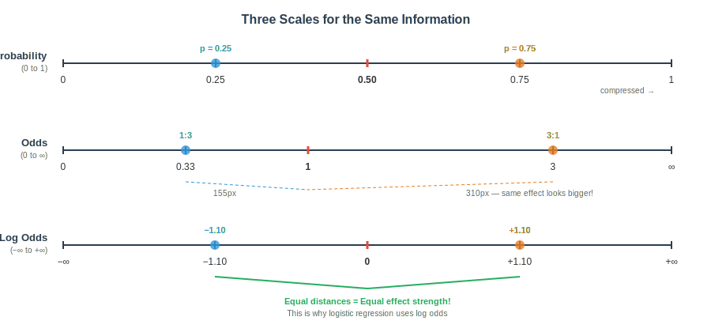{fig-align="center" width="95%"}

::: {.aside}
Source: Lecture material (SVG recreation)
:::

- On the **probability scale**, 0.25 and 0.75 are equally far from 0.50 — symmetric around the midpoint.

- On the **odds scale**, 0.33 and 3.0 are *not* equally far from 1.0 — the scale is asymmetric: compressed between 0 and 1, and unbounded above 1. A treatment that doubles the odds looks larger than one that halves them.

- The **log transformation** restores symmetry: log(0.33) = −1.10 and log(3.0) = +1.10 are equidistant from zero. This is why logistic regression models **log odds**, not raw probabilities or odds.


## Odds Ratios: Why They're Symmetric

{fig-align="center" width="95%"}

::: {.aside}
Source: Lecture material (SVG recreation)
:::

An **odds ratio (OR)** compares the odds of an outcome between two groups:

$$OR = \frac{\text{Odds}_{\text{treated}}}{\text{Odds}_{\text{control}}} = \frac{p_T / (1-p_T)}{p_C / (1-p_C)}$$

- OR = 0.25 and OR = 4.0 represent **equally strong but opposite effects**, yet on the odds ratio scale they appear at very different distances from the null (OR = 1). 

- On the **log odds ratio scale** (bottom), log(0.25) = −1.39 and log(4.0) = +1.39 are perfectly symmetric around zero — this is why we interpret and model log odds ratios.

**Key rules for odds ratios:**

-   OR = 1: no association between group and outcome
-   OR \> 1: group has higher odds of outcome
-   OR \< 1: group has lower odds (protective)
-   OR and 1/OR represent the same magnitude of effect — just in opposite directions

## Visualizing the Odds and Log Odds Ratio

::: panel-tabset
### Output

```{r}
#| label: odds-curves-output
#| echo: false
#| eval: true
#| fig-width: 10
#| fig-height: 5

par(mfrow = c(1, 2), mar = c(5, 5, 3, 2))

p <- seq(0.01, 0.99, by = 0.01)
odds <- p / (1 - p)
log_odds <- log(odds)

# Probability vs Odds
plot(p, odds, type = "l", lwd = 2, col = "#2980b9",
     xlab = "Probability", ylab = "Odds",
     main = "Odds grow exponentially near p = 1",
     cex.lab = 1.2, cex.main = 1.1)
abline(h = 1, lty = 2, col = "gray50")
abline(v = 0.5, lty = 2, col = "gray50")
text(0.3, 15, "Compressed\nbelow 1", col = "#e74c3c", cex = 0.9)
text(0.8, 60, "Explodes\nto infinity", col = "#e74c3c", cex = 0.9)

# Probability vs Log Odds
plot(p, log_odds, type = "l", lwd = 2, col = "#27ae60",
     xlab = "Probability", ylab = "Log Odds (logit)",
     main = "Log odds: symmetric S-curve",
     cex.lab = 1.2, cex.main = 1.1)
abline(h = 0, lty = 2, col = "gray50")
abline(v = 0.5, lty = 2, col = "gray50")
points(c(0.25, 0.75), log(c(0.25, 0.75) / c(0.75, 0.25)),
       pch = 19, col = c("#3498db", "#e67e22"), cex = 1.5)
text(0.25, -2.5, "−1.10", col = "#3498db", font = 2, cex = 0.9)
text(0.75, 2.5, "+1.10", col = "#e67e22", font = 2, cex = 0.9)
```

### Code

```{r}
#| label: odds-curves-code
#| echo: true
#| eval: false

p <- seq(0.01, 0.99, by = 0.01)
odds <- p / (1 - p)
log_odds <- log(odds)

par(mfrow = c(1, 2))

# Probability vs Odds — asymmetric!
plot(p, odds, type = "l", lwd = 2, col = "#2980b9",
     xlab = "Probability", ylab = "Odds",
     main = "Odds grow exponentially")
abline(h = 1, v = 0.5, lty = 2, col = "gray50")

# Probability vs Log Odds — symmetric!
plot(p, log_odds, type = "l", lwd = 2, col = "#27ae60",
     xlab = "Probability", ylab = "Log Odds (logit)",
     main = "Log odds are symmetric")
abline(h = 0, v = 0.5, lty = 2, col = "gray50")
```

### Interpretation

-   The **odds** curve shows why raw odds are problematic: values below 1 are compressed (0 to 1), while values above 1 explode toward infinity
-   The **log odds** (logit) transformation creates a symmetric, unbounded scale — this is why logistic regression models log odds, not probabilities
-   Equal changes in log odds correspond to equal changes in effect strength, regardless of the baseline probability
:::

## Odds Ratio: Bioengineering Example

- **Research question:** Does RGD peptide surface coating increase the odds of cell adhesion to a scaffold?

- We ran a controlled experiment: 200 scaffolds randomly assigned to receive either standard coating (uncoated) or RGD peptide coating. 

- After 24 hours of cell seeding, each scaffold was scored as having achieved adequate cell adhesion (yes/no). 

- This gives us a classic 2×2 contingency table.

## Odds Ratio: Bioengineering Example

::: panel-tabset
### Output

```{r}
#| label: odds-ratio-output
#| echo: false
#| eval: true

# Scaffold coating experiment
set.seed(2026)
coating_data <- data.frame(
  coating = rep(c("uncoated", "RGD-coated"), each = 100),
  adhesion = c(
    rbinom(100, 1, 0.35),  # 35% adhesion rate without coating
    rbinom(100, 1, 0.70)   # 70% adhesion rate with coating
  )
)

# 2x2 table
tab <- table(coating_data$coating, coating_data$adhesion)
colnames(tab) <- c("No Adhesion", "Adhesion")
cat("=== Scaffold Coating vs. Cell Adhesion ===\n")
print(tab)

# Calculate odds ratio
odds_uncoated <- tab["uncoated", "Adhesion"] / tab["uncoated", "No Adhesion"]
odds_coated   <- tab["RGD-coated", "Adhesion"] / tab["RGD-coated", "No Adhesion"]
OR <- odds_coated / odds_uncoated

cat("\nOdds (uncoated):", round(odds_uncoated, 3))
cat("\nOdds (RGD-coated):", round(odds_coated, 3))
cat("\nOdds Ratio:", round(OR, 3))
cat("\nLog Odds Ratio:", round(log(OR), 3))
cat("\n\nInterpretation: RGD coating increases the odds of")
cat("\ncell adhesion by", round(OR, 1), "times compared to uncoated scaffolds")
```

### Code

```{r}
#| label: odds-ratio-code
#| echo: true
#| eval: false

# 2x2 contingency table
tab <- table(coating_data$coating, coating_data$adhesion)

# Manual odds ratio calculation
odds_uncoated <- tab["uncoated", "Adhesion"] / tab["uncoated", "No Adhesion"]
odds_coated   <- tab["RGD-coated", "Adhesion"] / tab["RGD-coated", "No Adhesion"]
OR <- odds_coated / odds_uncoated

cat("Odds Ratio:", OR)
cat("Log Odds Ratio:", log(OR))

# Or use Fisher's exact test
fisher.test(tab)  # gives OR with confidence interval
```

### Interpretation

-   **Odds ratio \> 1**: The treatment group has higher odds of the outcome
-   **Odds ratio \< 1**: The treatment group has lower odds
-   **Odds ratio = 1**: No difference between groups
-   The **log odds ratio** is symmetric: log(OR) and log(1/OR) are equidistant from zero
-   Fisher's exact test provides a confidence interval for the odds ratio
:::

## Connection to Logistic Regression

::: callout-important
### The Key Link

In logistic regression, the coefficients **are** log odds ratios!

$$\ln\left(\frac{p}{1-p}\right) = \beta_0 + \beta_1 x_1 + \beta_2 x_2 + \cdots$$

-   $e^{\beta_1}$ = odds ratio for a one-unit increase in $x_1$
-   This is why logistic regression is the natural extension of what we've been doing with odds
-   The logit link function transforms the bounded probability (0,1) to the unbounded log-odds scale (−∞, +∞), making linear modeling appropriate
:::


## Wisconsin Breast Cancer Dataset — Data Dictionary

::: callout-note
**Why include this dataset?** The Wisconsin Breast Cancer dataset (`mlbench::BreastCancer`) is one of the most widely-cited classification benchmarks in machine learning. Including it in our course gives you a connection to 30+ years of published ML literature and a way to benchmark your results against the field.
:::

**Study context:** Fine-needle aspirate (FNA) biopsies were taken from 699 breast masses at the University of Wisconsin Hospital (Dr. William H. Wolberg, 1989–1991). Features are computed from digitized images of the FNA — describing the nuclei of cells present in the image. The outcome is a pathological diagnosis: benign or malignant.

## Wisconsin Breast Cancer Dataset — Data Dictionary

| Variable | Type | Description |
|:-----------------------|:----------------|:------------------------------|
| `Cl.thickness` | Ordinal (1–10) | Clump thickness — benign cells tend to be grouped in monolayers |
| `Cell.size` | Ordinal (1–10) | Uniformity of cell size — cancerous cells vary more |
| `Cell.shape` | Ordinal (1–10) | Uniformity of cell shape |
| `Marg.adhesion` | Ordinal (1–10) | Marginal adhesion — single cells tend to be cancerous |
| `Epith.c.size` | Ordinal (1–10) | Single epithelial cell size |
| `Bare.nuclei` | Ordinal (1–10) | Bare nuclei — more common in cancerous cells |
| `Bl.cromatin` | Ordinal (1–10) | Bland chromatin texture |
| `Normal.nucleoli` | Ordinal (1–10) | Normal nucleoli |
| `Mitoses` | Ordinal (1–10) | Mitosis rate — measure of cell division |
| `Class` | Binary | **Outcome:** benign (458) vs. malignant (241) |

**Clinical importance:** Sensitivity (correctly identifying malignant cases) is far more important than specificity — a false negative means a cancer goes undetected.

## R Exercise: Wisconsin Breast Cancer Classification

::: callout-tip
## Exercise: Classic Benchmark Dataset

The Wisconsin Breast Cancer dataset is one of the most widely-used classification benchmarks in machine learning. It contains 699 observations of fine-needle aspirate (FNA) measurements from breast masses, classified as malignant or benign.

1.  Load the data with `data(BreastCancer, package = "mlbench")`
2.  Explore the class distribution --- how balanced are the classes?
3.  Train and compare a **Random Forest** (500 trees; examine variable importance)
4.  Create a confusion matrix and calculate odds and log odds?
5.  Why is sensitivity particularly important in cancer diagnosis (note - this is a seque into Bayesian analysis)?

:::


------------------------------------------------------------------------

# Introduction to Bayesian Statistics {background-color="#2c3e50"}

## An Alternative Framework: Bayesian Statistics

- So far we have used **frequentist** methods — parameters are fixed unknowns, and we use data to estimate them with confidence intervals and p-values. 

- There is an elegant alternative: **Bayesian statistics**, where parameters have **probability distributions** that are updated as we observe data.

- This approach naturally incorporates prior knowledge and provides intuitive probability statements about parameters — "there is a 95% probability the effect is between 0.3 and 1.2" rather than the frequentist version which refers to hypothetical repeated samples.

## Frequentist vs. Bayesian

**Frequentist (what we've learned so far):**

-   Parameters are fixed, unknown constants
-   Probability = long-run frequency of events
-   Confidence intervals: "95% of such intervals contain the true parameter"
-   Focus on p-values and hypothesis tests

**Bayesian:**

-   Parameters have **probability distributions**
-   Probability = degree of belief
-   Credible intervals: "95% probability the parameter is in this range"
-   Focus on **posterior distributions**

## Bayes' Theorem Review

::: panel-tabset
### Equation

$$P(\theta \mid data) = \frac{P(data \mid \theta) \cdot P(\theta)}{P(data)}$$

Or more simply: $$\text{Posterior} \propto \text{Likelihood} \times \text{Prior}$$

### LaTeX

``` text
P(\theta \mid data) = \frac{P(data \mid \theta) \cdot P(\theta)}{P(data)}
```

### Components

-   **Prior** $P(\theta)$: What we believe before seeing data
-   **Likelihood** $P(data \mid \theta)$: How probable the data is given a parameter value
-   **Posterior** $P(\theta \mid data)$: Updated belief after seeing data
-   The posterior is a compromise between the prior and the data

### Interpretation

-   Bayes' theorem provides a principled mechanism for updating beliefs: the posterior combines prior knowledge with observed data through the likelihood
-   The denominator $P(data)$ serves as a normalizing constant ensuring the posterior integrates to 1 — in practice it is often computed implicitly rather than directly
-   The proportionality form (Posterior $\propto$ Likelihood $\times$ Prior) highlights that the posterior shape is determined entirely by the product of prior and likelihood
-   When the prior is "flat" (uninformative), the posterior is proportional to the likelihood alone, and Bayesian estimates converge to maximum likelihood estimates
:::

## The Logic of Bayesian Inference

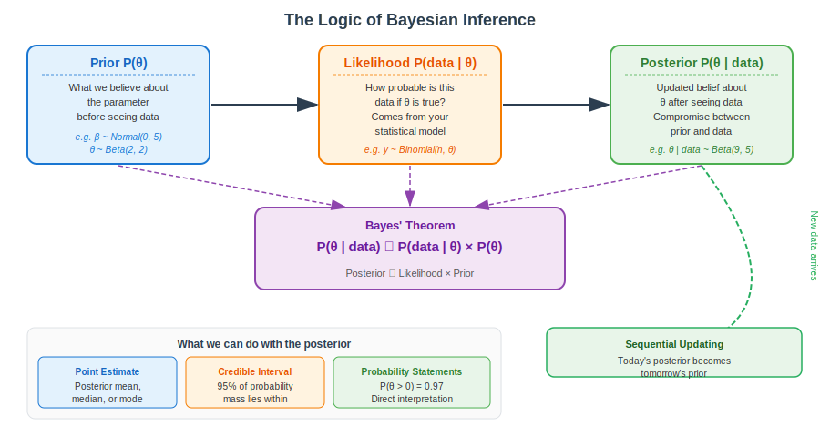{fig-align="center" width="95%"}

::: {.aside}
Source: Lecture material (SVG recreation)
:::

## Bayesian Estimation: The Coin Flip

**Setup:** We have a possibly biased coin. We want to estimate $\theta$ = probability of heads. We observe flips and update our belief about $\theta$ after each batch of data.

**Why the Beta distribution?** We need a prior over a probability (0 to 1). The Beta distribution is the natural choice — it is the **conjugate prior** for the Binomial likelihood, meaning the posterior is also a Beta distribution (see next slides).

$$\theta \sim \text{Beta}(\alpha, \beta) \qquad \text{Prior belief about } \theta$$

$$\text{Data: } X \sim \text{Binomial}(n, \theta) \qquad \text{n flips, X heads}$$

$$\theta | X \sim \text{Beta}(\alpha + X, \;\beta + n - X) \qquad \text{Posterior}$$

The parameters $\alpha$ and $\beta$ can be thought of as **pseudo-counts** of prior "successes" and "failures" — they represent how many imaginary heads/tails we've already seen before collecting data.

## Bayesian Estimation: Coin Flip Example

Starting with a weakly informative prior Beta(2,2) — slight belief the coin is fair — we observe 7 heads in 10 flips:

::: panel-tabset
### Output

```{r}
#| label: bayes-coin-output
#| echo: false
#| eval: true
#| fig-width: 10
#| fig-height: 4

par(mfrow = c(1, 3))
theta <- seq(0, 1, length.out = 200)

plot(theta, dbeta(theta, 2, 2), type = "l", lwd = 2.5, col = "#2980b9",
     main = "Prior: Beta(2, 2)", xlab = expression(theta~"(prob of heads)"), ylab = "Density",
     cex.main = 1.1)
abline(v = 0.5, lty = 2, col = "gray50")
mtext("Weak belief coin is fair", side = 3, cex = 0.75, col = "#2980b9")

plot(theta, dbinom(7, 10, theta), type = "l", lwd = 2.5, col = "#e74c3c",
     main = "Likelihood: 7 heads / 10 flips", xlab = expression(theta), ylab = "L(θ | data)",
     cex.main = 1.1)
abline(v = 0.7, lty = 2, col = "gray50")
mtext("Data alone favors θ ≈ 0.70", side = 3, cex = 0.75, col = "#e74c3c")

plot(theta, dbeta(theta, 9, 5), type = "l", lwd = 2.5, col = "#27ae60",
     main = "Posterior: Beta(9, 5)", xlab = expression(theta), ylab = "Density",
     cex.main = 1.1)
abline(v = qbeta(c(0.025, 0.975), 9, 5), lty = 2, col = "#e74c3c", lwd = 1.5)
abline(v = 9/(9+5), lty = 1, col = "#27ae60", lwd = 1.5)
mtext("Posterior mean = 0.643", side = 3, cex = 0.75, col = "#27ae60")
```

### Code

```{r}
#| label: bayes-coin-code
#| echo: true
#| eval: false

theta <- seq(0, 1, length.out = 200)

# Prior: Beta(2, 2) — represents ~2 imaginary heads and 2 imaginary tails
prior <- dbeta(theta, 2, 2)

# Likelihood: 7 heads out of 10 flips
likelihood <- dbinom(7, 10, theta)

# Posterior: Beta(alpha + X, beta + n - X) = Beta(2+7, 2+3) = Beta(9, 5)
posterior <- dbeta(theta, 9, 5)

# Posterior summary
posterior_mean <- 9 / (9 + 5)
credible_interval <- qbeta(c(0.025, 0.975), 9, 5)
cat("Posterior mean:", round(posterior_mean, 3))
cat("95% Credible Interval:", round(credible_interval, 3))
```

### Interpretation

-   The posterior mean (0.643) is a compromise between the prior mean (0.50 from Beta(2,2)) and the data proportion (0.70 = 7/10), pulled toward the prior because n=10 is small
-   The 95% credible interval gives a direct probability statement: there is a 95% probability the true coin bias lies within this range, given the data and prior
-   The Beta-Binomial conjugacy makes updating trivial: just add observed heads to $\alpha$ and observed tails to $\beta$ — no numerical integration required
-   With only 10 flips, the prior contributes meaningfully; with hundreds of flips, the posterior would be almost entirely determined by the data
:::

## Bayesian Updating: Effect of Sample Size

As we collect more data, the posterior becomes increasingly dominated by the likelihood — **data overwhelms the prior**.

::: panel-tabset
### Sequential Updating

```{r}
#| label: bayes-sequential-output
#| echo: false
#| eval: true
#| fig-width: 10
#| fig-height: 5

# True theta = 0.65 (biased coin)
set.seed(42)
true_theta <- 0.65
flip_counts <- c(5, 15, 50, 200)
alpha_prior <- 2; beta_prior <- 2

theta_seq <- seq(0, 1, length.out = 300)
cols <- c("#e74c3c", "#e67e22", "#2980b9", "#27ae60")

par(mfrow = c(1, 4))
for (i in seq_along(flip_counts)) {
  n <- flip_counts[i]
  x <- rbinom(1, n, true_theta)  # Heads observed
  alpha_post <- alpha_prior + x
  beta_post  <- beta_prior + (n - x)
  
  post_mean <- alpha_post / (alpha_post + beta_post)
  ci <- qbeta(c(0.025, 0.975), alpha_post, beta_post)
  
  plot(theta_seq, dbeta(theta_seq, alpha_prior, beta_prior),
       type = "l", lwd = 1.5, col = "lightblue", lty = 2,
       xlab = expression(theta), ylab = "Density",
       main = sprintf("n = %d flips
%d heads", n, x),
       ylim = c(0, max(dbeta(theta_seq, alpha_post, beta_post)) * 1.15),
       cex.main = 1.0)
  lines(theta_seq, dbeta(theta_seq, alpha_post, beta_post),
        lwd = 2.5, col = cols[i])
  abline(v = true_theta, lty = 3, col = "gray40")
  abline(v = ci, lty = 2, col = cols[i], lwd = 1.2)
  text(true_theta + 0.02, par("usr")[4] * 0.9, expression(theta["true"]),
       col = "gray40", cex = 0.8)
  mtext(sprintf("95%% CI: [%.2f, %.2f]", ci[1], ci[2]),
        side = 3, cex = 0.65, col = cols[i])
}
```

### Code

```{r}
#| label: bayes-sequential-code
#| echo: true
#| eval: false

alpha_prior <- 2; beta_prior <- 2  # Prior: Beta(2, 2)
flip_counts <- c(5, 15, 50, 200)

for (n in flip_counts) {
  x <- sum(rbinom(n, 1, true_theta))  # Simulate flips
  alpha_post <- alpha_prior + x
  beta_post  <- beta_prior + (n - x)
  
  post_mean <- alpha_post / (alpha_post + beta_post)
  ci <- qbeta(c(0.025, 0.975), alpha_post, beta_post)
  cat(sprintf("n=%3d: %d heads, posterior mean=%.3f, 95%%CI=[%.3f, %.3f]\n",
              n, x, post_mean, ci[1], ci[2]))
}
```

### Key Takeaway

-   With few flips (n=5), the posterior is strongly influenced by the prior — wide and uncertain
-   As n increases, the posterior **narrows and converges toward the true θ = 0.65**
-   The dashed blue line (prior) becomes increasingly irrelevant — data dominates
-   With n=200, the 95% credible interval barely spans 0.10 units
-   **Practical implication:** With informative priors and small samples, Bayesian analysis provides regularization; with large samples, Bayesian and frequentist results converge

### Interpretation

-   Bayesian sequential updating demonstrates a core strength of the framework: each new batch of data refines the posterior, which becomes the prior for the next update
-   With small samples (n=5), the prior has substantial influence — the posterior is wide and pulled toward the prior mean, providing regularization against noisy estimates
-   As sample size grows (n=200), the posterior concentrates tightly around the true parameter value and the prior becomes effectively irrelevant
-   This convergence of Bayesian and frequentist results with large samples is a reassuring property: with enough data, reasonable priors do not bias conclusions
:::

## Credible Intervals vs. Confidence Intervals

::: panel-tabset
### Credible Interval

A **95% Bayesian credible interval** $[a, b]$ means:

$$P(a \leq \theta \leq b \mid \text{data}) = 0.95$$

There is a **95% probability that the true parameter lies in this interval**, given the observed data and our prior. This is the direct, intuitive interpretation most people want.

**For our coin flip example (posterior Beta(9,5)):**

```{r}
#| echo: false
#| eval: true

posterior_mean <- 9 / (9 + 5)
credible_interval <- qbeta(c(0.025, 0.975), 9, 5)
cat("Posterior mean:", round(posterior_mean, 3), "
")
cat("95% Credible Interval: [", round(credible_interval[1], 3),
    ",", round(credible_interval[2], 3), "]
")
cat("
Interpretation: There is a 95% probability that the true
")
cat("probability of heads is between",
    round(credible_interval[1], 2), "and",
    round(credible_interval[2], 2), "given our data and prior.
")
```

### Confidence Interval (Comparison)

A **95% frequentist confidence interval** $[a, b]$ means:

> If we repeated this experiment many times and computed a 95% CI each time, 95% of those intervals would contain the true parameter $\theta$.

**It does NOT mean:** "There is a 95% probability that $\theta$ is in $[a, b]$."

The parameter $\theta$ is fixed (but unknown) in the frequentist framework — it either is or isn't in any given interval. The probability refers to the *procedure*, not the *parameter*.

| Property | Credible Interval | Confidence Interval |
|:----------------|:------------------------|:-----------------------------|
| **Framework** | Bayesian | Frequentist |
| **θ treated as** | Random variable (has distribution) | Fixed unknown constant |
| **Statement** | P(θ ∈ \[a,b\] \| data) = 0.95 | 95% of such intervals cover θ |
| **Direct probability on θ?** | ✓ Yes | ✗ No |
| **Depends on prior?** | ✓ Yes | ✗ No |
| **Numeric values** | Often very similar (large n) | Often very similar (large n) |

### Highest Density Interval (HDI)

A **Highest Density Interval** (HDI) is a special type of credible interval containing the most probable values:

-   The HDI is the **shortest** interval containing 95% of the posterior probability
-   For symmetric posteriors, the HDI equals the equal-tailed CI
-   For skewed posteriors, the HDI is preferred — it always contains the mode

```{r}
#| echo: false
#| eval: true
#| fig-width: 7
#| fig-height: 3.5

theta_seq <- seq(0, 1, length.out = 300)
dens <- dbeta(theta_seq, 9, 5)
ci <- qbeta(c(0.025, 0.975), 9, 5)

plot(theta_seq, dens, type = "l", lwd = 2.5, col = "#27ae60",
     xlab = expression(theta), ylab = "Posterior density",
     main = "Posterior Beta(9,5) with 95% Credible Interval")
polygon(c(ci[1], theta_seq[theta_seq >= ci[1] & theta_seq <= ci[2]], ci[2]),
        c(0, dens[theta_seq >= ci[1] & theta_seq <= ci[2]], 0),
        col = rgb(39/255, 174/255, 96/255, 0.25), border = NA)
abline(v = ci, lty = 2, col = "#e74c3c", lwd = 2)
abline(v = 9/(9+5), lty = 1, col = "#27ae60", lwd = 2)
legend("topleft", c("Posterior", "Mean", "95% CI"),
       col = c("#27ae60", "#27ae60", "#e74c3c"),
       lty = c(1, 1, 2), lwd = c(2.5, 2, 2), cex = 0.85)
```

### Interpretation

-   Bayesian credible intervals provide direct probability statements about parameters ("95% probability theta is in this range"), while frequentist confidence intervals describe the procedure's long-run coverage
-   For large samples, credible and confidence intervals typically give nearly identical numerical results — the distinction matters most conceptually and with small samples
-   The Highest Density Interval (HDI) is preferred for skewed posteriors because it always contains the mode and is the shortest interval covering 95% of the posterior mass
-   The ability to make direct probability statements about parameters is one of the primary practical advantages of the Bayesian framework for applied researchers
:::

## Conjugate Prior Distributions

A **conjugate prior** is a prior distribution that, when combined with a specific likelihood, produces a posterior in the **same family** as the prior. This makes Bayesian updating analytically tractable — no numerical integration needed.

::: panel-tabset
### Beta-Binomial (Proportion)

**Setting:** Estimating a proportion $\theta$ (e.g., probability of biocompatibility)

$$\text{Prior:} \quad \theta \sim \text{Beta}(\alpha, \beta)$$ $$\text{Likelihood:} \quad X \mid \theta \sim \text{Binomial}(n, \theta)$$ $$\text{Posterior:} \quad \theta \mid X \sim \text{Beta}(\alpha + X, \;\beta + n - X)$$

**Interpretation of hyperparameters:** - $\alpha$ = prior successes (e.g., $\alpha=2$ imaginary prior "biocompatible" observations) - $\beta$ = prior failures - Posterior mean = $\frac{\alpha + X}{\alpha + \beta + n}$ — a weighted average of prior and observed proportions

```{r}
#| echo: true
#| eval: false

# Prior: Beta(2, 2) — weak belief in fairness
# Data: 7 biocompatible out of 10 scaffolds
alpha_post <- 2 + 7   # = 9
beta_post  <- 2 + 3   # = 5
cat("Posterior mean:", alpha_post / (alpha_post + beta_post))
cat("95% CI:", qbeta(c(0.025, 0.975), alpha_post, beta_post))
```

### Normal-Normal (Mean)

**Setting:** Estimating a mean $\mu$ (e.g., mean cell growth, mean scaffold porosity)

$$\text{Prior:} \quad \mu \sim \mathcal{N}(\mu_0, \tau_0^2)$$ $$\text{Likelihood:} \quad y_i \mid \mu \sim \mathcal{N}(\mu, \sigma^2) \quad (\sigma^2 \text{ known})$$ $$\text{Posterior:} \quad \mu \mid \mathbf{y} \sim \mathcal{N}\!\left(\frac{\frac{\mu_0}{\tau_0^2} + \frac{n\bar{y}}{\sigma^2}}{\frac{1}{\tau_0^2} + \frac{n}{\sigma^2}},\; \left(\frac{1}{\tau_0^2} + \frac{n}{\sigma^2}\right)^{-1}\right)$$

The posterior mean is a **precision-weighted average** of the prior mean and the observed sample mean — larger $n$ gives more weight to the data.

### Gamma-Poisson (Count Rate)

**Setting:** Estimating a rate $\lambda$ (e.g., bacterial colony count rate)

$$\text{Prior:} \quad \lambda \sim \text{Gamma}(a, b)$$ $$\text{Likelihood:} \quad X \mid \lambda \sim \text{Poisson}(\lambda)$$ $$\text{Posterior:} \quad \lambda \mid X_1{,}\ldots{,}X_n \sim \text{Gamma}\!\left(a + \sum X_i,\; b + n\right)$$

The posterior mean $= (a + \sum X_i)/(b + n)$ — a shrinkage estimator that pulls the observed rate toward the prior.

### Why Conjugacy Matters

| Benefit | Description |
|:-----------------------------|:-----------------------------------------|
| **Analytic solution** | No MCMC sampling needed — exact posterior in closed form |
| **Interpretable updates** | Clear "prior counts + data counts" structure |
| **Fast computation** | Instant updates as new data arrives (sequential Bayesian) |
| **Good for teaching** | Makes Bayesian mechanics transparent |

**Limitation:** Conjugate families are limited. Real-world models with multiple parameters, non-linear effects, or hierarchical structure require MCMC samplers like Stan (used by brms).

### Interpretation

-   Conjugate priors produce closed-form posteriors, avoiding the need for computationally expensive MCMC sampling
-   The Beta-Binomial conjugate pair is the most intuitive: prior hyperparameters $\alpha$ and $\beta$ act as pseudo-counts of prior successes and failures, and simply add to the observed counts
-   In the Normal-Normal case, the posterior mean is a precision-weighted average — when sample size is large, data dominate; when small, the prior stabilizes the estimate
-   Conjugacy is elegant but limited to simple models; complex real-world analyses (hierarchical models, non-linear effects) require MCMC samplers like Stan
:::

## Bayesian Linear Regression: Concept and Equations

In frequentist linear regression, we estimate $\beta$ by minimizing RSS. In the Bayesian framework, **every parameter has a prior distribution**, and we update it to a **posterior distribution** after observing data.

::: panel-tabset
### The Model

**Simple linear regression** (one predictor, one response):

$$y_i = \beta_0 + \beta_1 x_i + \epsilon_i, \quad \epsilon_i \sim \mathcal{N}(0, \sigma^2)$$

**Bayesian formulation — specify priors:**

$$\beta_0 \sim \mathcal{N}(\mu_{\beta_0},\; \sigma_{\beta_0}^2), \qquad \beta_1 \sim \mathcal{N}(\mu_{\beta_1},\; \sigma_{\beta_1}^2), \qquad \sigma \sim \text{HalfCauchy}(0, \tau)$$

**Posterior (Bayes' theorem):**

$$P(\beta_0, \beta_1, \sigma \mid \mathbf{y}, \mathbf{x}) \propto \underbrace{P(\mathbf{y} \mid \beta_0, \beta_1, \sigma, \mathbf{x})}_{\text{Likelihood}} \times \underbrace{P(\beta_0)P(\beta_1)P(\sigma)}_{\text{Priors}}$$

The posterior is a **joint distribution over all three parameters** — we can summarize it with marginal posteriors for each.

### LaTeX

``` text
y_i = \beta_0 + \beta_1 x_i + \epsilon_i, \quad \epsilon_i \sim \mathcal{N}(0, \sigma^2)

\beta_j \sim \mathcal{N}(\mu_j, \sigma_j^2)

P(\boldsymbol{\beta}, \sigma \mid \mathbf{y}) \propto 
  P(\mathbf{y} \mid \boldsymbol{\beta}, \sigma) \times P(\boldsymbol{\beta}) P(\sigma)
```

### Prior Choices

**Weakly informative priors (default in brms):**

| Parameter | Prior | Rationale |
|:-------------------------|:-----------------|:---------------------------|
| $\beta_0$ (intercept) | $\mathcal{N}(0, 10)$ | Centered at 0, wide — minimal constraint |
| $\beta_j$ (slopes) | $\mathcal{N}(0, 5)$ | Weakly regularizing — shrinks large slopes |
| $\sigma$ | HalfCauchy(0, 2) | Heavy-tailed — allows large residual SD |

Weakly informative priors are **not flat (uninformative)** — they encode the belief that extreme values are unlikely, providing mild regularization without strong influence on the posterior when data are abundant.

### Output

```{r}
#| label: bayes-lm-output
#| echo: false
#| eval: true
#| fig-width: 9
#| fig-height: 4

set.seed(42)
beta0_samples <- rnorm(5000, mean = 1.5, sd = 0.6)
beta1_samples <- rnorm(5000, mean = 2.3, sd = 0.4)

par(mfrow = c(1, 2))
hist(beta0_samples, breaks = 50, col = "#bbdefb", border = "white",
     main = expression("Posterior: " * beta[0] * " (Intercept)"),
     xlab = expression(beta[0]), probability = TRUE, cex.main = 1.0)
abline(v = quantile(beta0_samples, c(0.025, 0.975)), col = "red", lwd = 2, lty = 2)
abline(v = mean(beta0_samples), col = "darkblue", lwd = 2)

hist(beta1_samples, breaks = 50, col = "lightblue", border = "white",
     main = expression("Posterior: " * beta[1] * " (Slope)"),
     xlab = expression(beta[1]), probability = TRUE, cex.main = 1.0)
abline(v = quantile(beta1_samples, c(0.025, 0.975)), col = "red", lwd = 2, lty = 2)
abline(v = mean(beta1_samples), col = "darkblue", lwd = 2)
legend("topright", c("Posterior mean", "95% CI"),
       col = c("darkblue", "red"), lwd = 2, lty = c(1, 2), cex = 0.8)
```

### Interpretation

-   In Bayesian linear regression, each parameter gets a full posterior distribution rather than a single point estimate, capturing the complete uncertainty about that parameter
-   The posterior is proportional to the likelihood times the prior — with sufficient data, the likelihood dominates and results converge to the frequentist estimates
-   Weakly informative priors (e.g., $\mathcal{N}(0, 5)$ for slopes) provide mild regularization without strongly influencing results, preventing extreme estimates while letting data speak
-   The 95% credible intervals from the posterior histograms are directly interpretable: "there is a 95% probability the true parameter lies in this range"
:::

## When to Use Bayesian Methods

::: callout-tip
## Consider Bayesian When:

1.  **Prior information exists** — previous studies, expert knowledge
2.  **Small sample sizes** — priors stabilize estimates
3.  **Complex models** — hierarchical models, missing data
4.  **Direct probability statements** — "90% chance effect is positive"
5.  **Sequential updating** — accumulating evidence over time
:::

**R Packages for Bayesian Analysis:**

-   **brms**: Flexible Bayesian models with formula syntax similar to lm/glm (recommended)
-   **rstanarm**: Easy Bayesian regression with Stan backend
-   **BayesFactor**: Bayesian hypothesis testing

## Bayesian Regression with brms: Setup

We return to the **scaffold cell growth dataset** (150 scaffolds with porosity, fiber diameter, and crosslink density). We previously fit this with a regression tree and a random forest. Now we fit the same model within the Bayesian framework using `brms`.

**Why brms for this dataset?** - We have **prior domain knowledge**: cell growth should increase with crosslink density (positive slope expected) - We can express this as a weakly informative prior: $\beta_{\text{crosslink}} \sim \mathcal{N}(2, 2)$ — centered positive but uncertain - We get **probability statements**: "What is P(porosity effect \> 0)?" — not possible in frequentist framework - We get **full posterior predictive distributions** for new scaffolds — not just point predictions

**Key differences from frequentist (integrated):**

| Feature | Frequentist (lm) | Bayesian (brms) |
|:-----------------|:--------------------------|:--------------------------|
| **Parameter estimates** | Point estimates | Full posterior distributions |
| **Uncertainty** | Confidence intervals | Credible intervals |
| **Interpretation** | "95% of such CIs cover true value" | "95% probability θ is in this range" |
| **Prior knowledge** | Not used | Explicitly encoded as priors |
| **Model complexity** | AIC/BIC for comparison | WAIC, LOO-CV |
| **Predictions** | Point ± SE | Full predictive distribution |
| **First-run speed** | Fast | Slow (Stan compiles); subsequent: fast |

## Bayesian Regression with brms: Fitting and Interpretation

::: panel-tabset
### Code

```{r}
#| echo: true
#| eval: false

library(brms)

# Frequentist reference model
freq_model <- lm(cell_growth ~ porosity + fiber_diameter + crosslink_density,
                 data = scaffold_reg)
summary(freq_model)

# Bayesian model — nearly identical formula syntax
bayes_model <- brm(
  cell_growth ~ porosity + fiber_diameter + crosslink_density,
  data    = scaffold_reg,
  family  = gaussian(),
  prior   = c(
    prior(normal(0, 5),   class = "b"),           # Weakly informative slopes
    prior(normal(2, 2),   class = "b",            # Positive prior for crosslink
          coef = "crosslink_density"),
    prior(normal(5, 10),  class = "Intercept"),   # Wide intercept prior
    prior(cauchy(0, 2),   class = "sigma")        # Half-Cauchy for residual SD
  ),
  chains = 4, iter = 2000, warmup = 1000,
  seed = 42, cores = 4
)

summary(bayes_model)         # Posterior means, SDs, credible intervals
```

### Posterior Visualization

```{r}
#| echo: true
#| eval: false

# Plot posterior distributions of all parameters
plot(bayes_model)

# Posterior predictive check — does model generate realistic data?
pp_check(bayes_model, ndraws = 50)

# Extract posterior draws
draws <- as_draws_df(bayes_model)

# Probability that porosity effect is positive
cat("P(porosity effect > 0) =", mean(draws$b_porosity > 0))

# Probability that crosslink density is strongest predictor
cat("P(|crosslink| > |porosity|) =",
    mean(abs(draws$b_crosslink_density) > abs(draws$b_porosity)))

# 95% Credible intervals for all coefficients
posterior_summary(bayes_model)
```

### Interpreting the Output

The `summary(bayes_model)` output gives for each parameter:

-   **Estimate**: Posterior mean — analogous to the frequentist point estimate
-   **Est.Error**: Posterior standard deviation — analogous to the standard error
-   **l-95% CI, u-95% CI**: 95% credible interval — directly interpretable as probability statement
-   **Rhat**: Convergence diagnostic — values close to 1.00 indicate MCMC chains converged
-   **Bulk ESS / Tail ESS**: Effective sample size — should be \> 400 for reliable inference

With weak priors and n=150, the Bayesian and frequentist estimates will be very similar. The advantage of brms shows when: (1) the sample is small, (2) we have meaningful prior information, or (3) we need probability statements about parameters.

### Interpretation

-   The `brms` package lets you specify Bayesian regression models with the same formula syntax as `lm()`, making the transition from frequentist to Bayesian straightforward
-   Posterior credible intervals give **direct probability statements** about parameters (e.g., "95% probability the slope is between 1.2 and 3.4"), unlike frequentist confidence intervals
-   Specifying an informative prior for crosslink density ($\mathcal{N}(2, 2)$) encodes domain knowledge that the effect should be positive, providing regularization especially with small samples
-   Convergence diagnostics (Rhat near 1.00, ESS > 400) must be checked before interpreting results — poor convergence means the posterior samples are unreliable
:::
