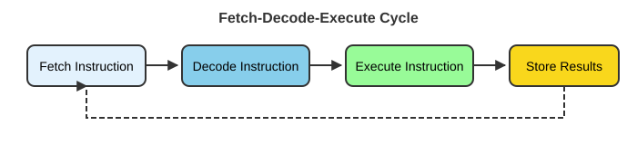

Single-cell RNA-seq analysis pushes against the limits of a laptop almost immediately: datasets are large, the software stack is deep, and many steps run faster (or only run at all) on shared research computing infrastructure. This chapter builds the mental model you need before you touch any of that — how a computer actually executes work, how an operating system manages resources, what a high-performance computing (HPC) cluster is and when to reach for one, how to get onto and work productively on the University of Oregon's Talapas cluster, and how to make your compute environment reproducible so your results survive the trip from your laptop to the cluster and back.

::: {.callout-tip title="P1 reading"}
This is the reading for **P1 — Computer System Fundamentals**, the first hour of the optional two-hour Tuesday refresher. It pairs with the Module 1 lecture slides. Nothing here is single-cell-specific yet; it is the computing foundation that the rest of the workshop assumes. If you are already comfortable with HPC and SSH, skim to the [Reproducible compute environments](#reproducible-compute-environments) section.
:::

# How computers and operating systems work


::: callout-tip
**Keep a cheat sheet open.** The [Cheat Sheets](../Cheat_Sheets.html) tab collects one-page SLURM, Unix, and Git references that pair with this module; you'll lean on the SLURM sheet again in the Friday Talapas track ([Modules 09–10](../Materials.html)).
:::

## What is a computer system?

A computer system is the combination of four things working together:

-   **Hardware**: the physical components (CPU, memory, storage, I/O devices)
-   **Software**: the programs and instructions that run on the hardware
-   **Firmware**: low-level software embedded in hardware
-   **Data**: the information being processed

{fig-align="center" width="60%"}

### The fetch-decode-execute cycle

Every operation a computer performs reduces to a small cycle repeated billions of times per second:

{fig-align="center" width="80%"}

1.  **Fetch**: retrieve an instruction from memory
2.  **Decode**: interpret what the instruction means
3.  **Execute**: perform the operation
4.  **Store**: save results to memory or a register

## Hardware components

### Central Processing Unit (CPU)

::::: columns
::: {.column width="50%"}
**Core components**

-   **Control Unit (CU)**: directs operations
-   **Arithmetic Logic Unit (ALU)**: performs calculations
-   **Registers**: ultra-fast temporary storage
-   **Cache**: high-speed memory buffer
:::

::: {.column width="50%"}
**Key concepts**

-   **Clock speed**: cycles per second (GHz)
-   **Cores**: independent processing units
-   **Threads**: virtual cores for parallel processing
-   **Instruction set**: the CPU's language (x86, ARM)
:::
:::::

### Graphics Processing Unit (GPU)

::::: columns
::: {.column width="50%"}
**Core components**

-   **Streaming Multiprocessors (SMs)**: processing clusters
-   **CUDA cores / stream processors**: parallel compute units
-   **Video Memory (VRAM)**: dedicated high-bandwidth memory
-   **Memory controller**: manages data flow to/from VRAM
:::

::: {.column width="50%"}
**Key concepts**

-   **Parallel architecture**: thousands of cores for simultaneous tasks
-   **Memory bandwidth**: data throughput (GB/s)
-   **Compute units**: groups of processing cores
-   **APIs**: programming interfaces (CUDA, OpenCL, Vulkan)
:::
:::::

### CPU vs GPU

::::: columns
::: {.column width="50%"}
**CPU characteristics**

-   **Design focus**: sequential processing & complex tasks
-   **Core count**: 4--64 powerful cores
-   **Architecture**: optimized for single-thread performance
-   **Best for**: operating systems & general computing, complex branching logic, serial tasks
:::

::: {.column width="50%"}
**GPU characteristics**

-   **Design focus**: parallel processing & high throughput
-   **Core count**: thousands of smaller cores
-   **Architecture**: optimized for massive parallelism
-   **Best for**: graphics rendering, machine learning/AI, scientific simulations, parallel computations
:::
:::::

### Memory and storage

::::: columns
::: {.column width="50%"}
**Random Access Memory (RAM)**

-   **DRAM**: main system memory; needs constant refresh; cheaper, higher density (DDR4, DDR5)
-   **SRAM**: used in CPU cache; no refresh needed; faster but expensive
-   **Volatile**: data is lost when power is off
-   **Random access**: any location is equally fast
:::

::: {.column width="50%"}
**Persistent storage**

-   **HDD**: mechanical spinning platters; large capacity, low cost; ~100--200 MB/s; higher latency (~10 ms)
-   **SSD**: no moving parts (NAND flash); faster access (~0.1 ms); 500--7000 MB/s; more expensive per GB
:::
:::::

Input/output (I/O) systems connect the computer to the outside world: keyboards, mice, touchscreens, cameras and sensors on the input side; monitors, printers, speakers and actuators on the output side; and network interfaces in both directions.

## Operating systems

An operating system (OS) is system software that manages hardware and software resources and provides common services for programs.

::::: columns
::: {.column width="40%"}
**Key roles**

-   Resource manager
-   Extended machine
-   User interface provider
-   Security enforcer
:::

::: {.column width="60%"}
**Common operating systems**

-   **Desktop**: Windows, macOS, Unix, Linux
-   **Mobile**: Android, iOS
-   **Server**: Unix, Linux, Windows Server
-   **Specialized**: supercomputers, IoT

Talapas, like nearly all HPC clusters, runs **Linux** — which is why the workshop spends time on the Unix command line.
:::
:::::

{fig-align="center" width="70%"}

### Core OS functions

::::: columns
::: {.column width="50%"}
**Process management**

-   Process creation & termination
-   Process scheduling: CPU time allocation
-   Inter-process communication (IPC)
-   Synchronization & deadlock handling

**File system management**

-   File operations: create, read, write, delete
-   Directory structure
-   Access control & permissions
:::

::: {.column width="50%"}
**Memory management**

-   Memory allocation/deallocation
-   Virtual memory, paging & segmentation
-   Memory protection
-   Swap space management

**Device management**

-   Device drivers: hardware abstraction
-   I/O scheduling, buffering & caching
-   Interrupt handling
:::
:::::

The OS also decides which process runs next on a CPU (scheduling algorithms such as First-Come-First-Served, Shortest Job First, Round Robin, and Priority scheduling) and enforces security through access control lists, user/group permissions, memory protection, user-vs-kernel CPU modes, and sandboxing. The guiding principle:

> "Every program and user should operate using the least amount of privilege necessary."

This same scheduling-and-fairness problem reappears at cluster scale — that is exactly what SLURM solves on Talapas.

## Coding and scripting

Why work at the command line and in code rather than point-and-click GUIs?

-   It is fast and powerful, particularly for repeated actions — thousands of "clicks" in a single command.
-   It can analyze datasets far too large for Excel or other GUIs.
-   It gives access to thousands of free programs made for and by scientists.
-   Commands work almost identically across platforms.
-   It is the *only* practical way to use a computer cluster like Talapas.

There is a loose distinction between **coding** (compiled languages such as C++, Fortran — faster but less flexible) and **scripting** (interpreted languages such as Unix shell, Python, R, Julia — flexible but slower). The line has blurred, and most modern analytical pipelines mix both.

# What is an HPC cluster, and when do you use one?

Before reaching for a cluster, it helps to see the landscape of where computation can happen.

::: {.callout-note title="The computing landscape"}
- **Local computing** — resources physically present and directly controlled by you (laptop, workstation, on-prem server).
- **Cluster computing** — many interconnected computers working together as one system (this is what Talapas is).
- **Cloud computing** — on-demand resources delivered over the internet with pay-as-you-go pricing (AWS, Azure, Google Cloud).
:::

## Local computing

::::: columns
::: {.column width="50%"}
**Advantages**

-   **Low latency**: no network overhead
-   **Data control & privacy**: data never leaves the premises
-   **Predictable costs**: one-time investment
-   **Offline capability** and full customization
:::

::: {.column width="50%"}
**Disadvantages**

-   **Limited scale**: hardware constraints
-   **Maintenance** is the user's responsibility
-   **High upfront costs** and manual disaster recovery
-   **Resource waste**: idle during off-hours
:::
:::::

A laptop is fine for learning and for small single-cell datasets, but it runs out of memory and time quickly once you scale to full experiments.

## Cluster computing

A cluster is a collection of interconnected computers working together as a single system.

{fig-align="center" width="70%"}

**Key components**

-   **Head/login node**: where you connect, edit files, and submit jobs
-   **Compute nodes**: the worker machines that actually run your work
-   **Interconnect**: a high-speed network (InfiniBand, 10GbE+)
-   **Shared storage**: parallel file systems (Lustre, GPFS)

A **resource manager** schedules jobs onto the compute nodes:

| System     | Use case        | Key features                          |
|------------|-----------------|---------------------------------------|
| SLURM      | HPC             | Advanced scheduling, power management |
| PBS/Torque | Traditional HPC | Mature, stable, wide support          |
| SGE/UGE    | Mixed workloads | Flexible policies                     |
| Kubernetes | Containers      | Microservices, auto-scaling           |

::: {.callout-important title="What we use"}
We use **SLURM** on **Talapas** at the University of Oregon for scheduling compute jobs. The rest of this chapter covers Talapas in detail.
:::

::::: columns
::: {.column width="50%"}
**Advantages**

-   **Scalability**: add nodes as needed
-   **Performance**: parallel processing power
-   **Fault tolerance**: node redundancy
-   **Resource sharing** across users/projects
-   **Specialized hardware**: GPUs, high-memory nodes
:::

::: {.column width="50%"}
**Disadvantages**

-   **Complexity**: requires expertise
-   **Infrastructure**: space, power, cooling
-   **Network dependency**: interconnect bottlenecks
-   **Maintenance** and complex initial setup
:::
:::::

## Cloud computing

For completeness: the cloud delivers computing on demand over the internet.

::::: columns
::: {.column width="50%"}
**Advantages**

-   **Elastic scaling**: instant resource adjustment
-   **Pay-per-use**: no idle resource costs
-   **Managed services** and built-in disaster recovery
:::

::: {.column width="50%"}
**Disadvantages**

-   **Ongoing costs** that can exceed on-prem
-   **Vendor lock-in** and internet dependency
-   **Data transfer (egress) costs** and compliance complexity
:::
:::::

**When to use which?** Learn and prototype locally; run real single-cell workloads on Talapas (free to UO researchers, GPUs available, large memory nodes); consider the cloud only when you need elasticity or services Talapas does not provide.

# UO's Talapas cluster

## What is Talapas?

-   **Talapas** is UO's flagship high-performance computing (HPC) cluster.
-   Named from the Chinook word for *coyote* — the educator and keeper of knowledge.
-   Managed by **Research Advanced Computing Services (RACS)** and located in the Allen Hall Data Center.
-   It combines centrally funded open-use resources with researcher-funded ("condo") resources.
-   Documentation: [Talapas Knowledge Base](https://uoracs.github.io/talapas2-knowledge-base/).

**Key resources:** over **14,500 CPU cores**, **129 TB of memory**, roughly **89 GPUs** (NVIDIA A40 through H100), and about **3 petabytes of storage**. CPU generations span AMD Milan and Intel Broadwell/Cascadelake/Icelake/Sapphire Rapids; node memory ranges from 128 GB to 6 TB.

{fig-align="center" width="80%"}

## Getting an account (Duck ID + PIRG)

To work on Talapas you need a UO Duck ID and a Talapas account tied to a research group called a **PIRG** (Principal Investigator Research Group).

::: panel-tabset
### Step 1: Join a PIRG

-   A **PIRG** = Principal Investigator Research Group.
-   Contact your PI to be added to their PIRG, or contact RACS to create a new one.

### Step 2: Request access

-   Request an account at [racs.uoregon.edu/request-access](https://racs.uoregon.edu/request-access).
-   Your **username** is your Duck ID (the part of your UO email before `@uoregon.edu`).
-   Your **password** is your University-wide UO password, managed via UO's password reset page.
:::

## Logging in (SSH + Duo)

The Talapas login host is `login.talapas.uoregon.edu`.

::: panel-tabset
### Command line (SSH)

``` bash
# Basic SSH connection
ssh yourduckid@login.talapas.uoregon.edu

# Or a specific login node (login1 ... login4)
ssh yourduckid@login1.talapas.uoregon.edu
```

-   For security, **no characters appear while you type your password**.
-   SSH logins use **Duo two-factor authentication**: when prompted, type `1` and press Enter to receive a Duo push (`2` sends a text, `3` calls you).
-   **Off campus?** Connect to the UO VPN first, then SSH as normal. The VPN also lets you reach the direct login nodes.
-   Mac and Linux users can set up an **ED25519 SSH key** to avoid typing a password every session (Duo will still prompt when required by policy).
-   **From Windows:** use PuTTY, MobaXterm, or Windows Terminal.

### Web browser (Open OnDemand)

RACS provides a web portal at [ondemand.talapas.uoregon.edu](https://ondemand.talapas.uoregon.edu/) (Chrome or Firefox recommended):

-   No command line or SSH client needed.
-   File browser for uploads/downloads.
-   Interactive applications: JupyterLab, RStudio, MATLAB, and a remote X11 desktop via VNC.
-   The easiest way to run RStudio or Jupyter sessions on Talapas, and great for beginners.
:::

### Login nodes vs compute nodes

::: panel-tabset
### Login nodes

-   Where you land when you SSH into Talapas.
-   For **light tasks only**: file management, editing, job submission.
-   Shared by all users — be considerate. Heavy processes will be killed.

### Compute nodes

-   Where your actual work runs.
-   Accessed through the SLURM scheduler (see below).
-   Different types for different needs: standard CPU, GPU, and high-memory ("fat") nodes.
:::

| Node type      | Cores   | Memory      | Purpose                |
|----------------|---------|-------------|------------------------|
| Standard CPU   | 28--128 | 128--512 GB | General computation    |
| Large memory   | 56+     | up to 4 TB  | Memory-intensive work  |
| GPU (A40–H100) | 28--128 | 256 GB–1 TB | Machine learning, CUDA |
| Interactive    | Various | Various     | Testing, development   |

::: {.callout-important title="The golden rule"}
**Do not run heavy computation on the login nodes.** Anything that takes more than a few seconds belongs in an interactive session (`srun --pty bash`) or a batch job (`sbatch my_script.sh`).
:::

## File systems and storage

Every Talapas user has access to several directories on the ~3 PB IBM Elastic Storage System (GPFS).

{fig-align="center" width="90%"}

| Location                | Quota                 | Purpose                                                                   |
|-------------------------|-----------------------|---------------------------------------------------------------------------|
| `/home/<duckid>`        | 250 GB                | Personal files, scripts, dotfiles; small software installs                |
| `/projects/<PIRG>`      | Shared (2 TB default) | Large shared project data and analysis for your research group            |
| `/scratch/<PIRG>`       | 20 TB                 | High-throughput working space; **files untouched for 90 days are purged** |
| `/tmp`                  | Local to node         | Temporary scratch space                                                   |

``` bash
# Check your storage usage
df -h ~
du -sh /projects/myPIRG/myusername
```

::: {.callout-warning}
**You are responsible for backing up your data — RACS does NOT back up Talapas file systems.** Some snapshotting exists for home and project directories, but it is not a substitute for your own backups. Use `/projects` for large files and clean up when done.
:::

**File transfer options:**

-   `scp` / `sftp` from the terminal.
-   [FileZilla](https://filezilla-project.org/) — cross-platform GUI for SCP/SFTP.
-   [**Globus**](https://www.globus.org/) — RACS's recommended tool for large transfers, especially to/from the Large-Scale Research Storage (LSRS) system.

## Software modules (Lmod)

Talapas uses [Lmod](https://lmod.readthedocs.io/) to manage centrally installed software. Modules are loaded **per shell** — you must `module load` again in every new session (or in every SLURM job script).

::: panel-tabset
### Commands

``` bash
module spider blast        # search for software by name
module spider R            # find available versions
module avail               # list modules loadable right now
module load R/4.3.3        # load a specific version
module load samtools       # load a module (default version)
module list                # show currently loaded modules
module unload samtools     # unload a module
module purge               # unload everything; reset to defaults
```

### Best practices

::: {.callout-note title="Module tips"}
-   In batch scripts, always load modules **after** the `#SBATCH` directives.
-   Use `module spider` to find available versions.
-   `module purge` resets your environment to defaults.
-   Specify version numbers for reproducibility (e.g., `R/4.3.3`, not just `R`).
:::
:::

## Partitions and the SLURM scheduler

Talapas uses [SLURM](https://slurm.schedmd.com/) (**S**imple **L**inux **U**tility for **R**esource **M**anagement) [@yoo2003slurm] to allocate resources fairly among users and keep the cluster busy. It is the same scheduler used on most academic and national-lab clusters, so these skills transfer directly. The full mechanics are covered in [Chapter 9](Chapter_09_SLURM_Basics.html).

{fig-align="center" width="90%"}

**Key concepts:** *jobs* are units of work you submit; *partitions* are queues with different properties; *accounts* (your PIRG) are used for resource tracking and charging.

### Partitions (queues)

These are the current Talapas partitions — always confirm against `sinfo` and the [Talapas Knowledge Base](https://uoracs.github.io/talapas2-knowledge-base/):

| Partition                        | Typical use                                | Max wall time |
|----------------------------------|--------------------------------------------|---------------|
| `compute`                        | Standard CPU jobs                          | 1 day         |
| `computelong`                    | Long CPU jobs                              | 14 days       |
| `gpu` / `gpulong`                | GPU jobs (short / long)                    | 1 day / 14 d  |
| `memory` / `memorylong`          | High-memory CPU jobs (up to 4 TB RAM)      | 1 day / 14 d  |
| `interactive` / `interactivegpu` | Short interactive sessions                 | 12 h / 8 h    |
| `preempt`                        | Access to all nodes; jobs may be preempted | Variable      |

All SLURM jobs **must specify an account** (your PIRG) for correct service charging. Pass `--account=<myPIRG>` on every command, or export it once in your `~/.bash_profile`:

``` bash
export SLURM_ACCOUNT=<myPIRG>
export SBATCH_ACCOUNT=<myPIRG>
```

### Essential SLURM commands

::: panel-tabset
### Submit & monitor

``` bash
sbatch myscript.sh           # submit a batch job
squeue -u $USER              # check your jobs in the queue
squeue -p compute            # check all jobs on a partition
scancel JOBID                # cancel a job
scontrol show job JOBID      # detailed job info
```

### After completion

``` bash
# Check job history and resource usage
sacct -j JOBID --format=JobID,Elapsed,MaxRSS

# View partition information
sinfo -p compute
```

### Status codes

| Code | Meaning           |
|------|-------------------|
| PD   | Pending (waiting) |
| R    | Running           |
| CG   | Completing        |
| CD   | Completed         |
| F    | Failed            |
:::

### Interactive jobs

``` bash
# Start an interactive session on a compute node
srun --pty --partition=compute --account=myPIRG \
     --time=2:00:00 --cpus-per-task=4 --mem=8G /bin/bash
```

Use interactive jobs for testing a workflow before batch submission, debugging, quick data exploration, or GUI applications. Your prompt will change from `login1` to something like `n049`.

### Batch script template

``` bash
#!/bin/bash
#SBATCH --job-name=my_analysis      # Job name
#SBATCH --partition=compute         # Partition (queue)
#SBATCH --account=myPIRG            # Your PIRG name
#SBATCH --output=output_%j.log      # Standard output (%j = job ID)
#SBATCH --error=error_%j.log        # Standard error
#SBATCH --time=04:00:00             # Time limit (HH:MM:SS)
#SBATCH --nodes=1                   # Number of nodes
#SBATCH --ntasks-per-node=1         # Tasks per node
#SBATCH --cpus-per-task=4           # CPUs per task
#SBATCH --mem=16G                   # Memory per node

# Load required modules (after the SBATCH directives)
module load R/4.3.3

# Run your program
Rscript my_analysis.R
```

| Directive         | Description         | Example                                    |
|-------------------|---------------------|--------------------------------------------|
| `--partition`     | Queue to use        | `compute`, `computelong`, `gpu`, `memory`  |
| `--account`       | PIRG for accounting | `nereus`                                   |
| `--time`          | Max runtime         | `1-12:00:00` (1 day, 12 hrs)               |
| `--nodes`         | Number of nodes     | `1`                                        |
| `--cpus-per-task` | Cores per task      | `8`                                        |
| `--mem`           | Memory per node     | `32G`                                      |
| `--gres`          | Generic resources   | `gpu:1`                                     |

Lines starting with `#SBATCH` are directives for the scheduler; `%j` in filenames is replaced by the job ID. **Request only what you need — smaller jobs run sooner.**

### GPU jobs

``` bash
#!/bin/bash
#SBATCH --job-name=gpu_job
#SBATCH --partition=gpu             # GPU partition
#SBATCH --account=myPIRG
#SBATCH --time=1-00:00:00           # 1 day
#SBATCH --nodes=1
#SBATCH --ntasks-per-node=1
#SBATCH --gres=gpu:1                # Request 1 GPU
#SBATCH --mem=32G

# Load CUDA and your software
module load cuda/12.4
module load miniconda3/20240410

# Activate your conda environment, then run
conda activate my_ml_env
python train_model.py
```

``` bash
# See available GPUs
/packages/racs/bin/slurm-show-gpus
```

::: {.callout-note title="Going deeper on SLURM"}
The hands-on [SLURM Basics tutorial](../Exercise_Folder/Tutorial_09_SLURM_Basics.html) walks through submitting and monitoring batch and interactive jobs step by step.
:::

# Connecting and working interactively

Once you have an account, the most productive way to work day to day is from an editor that connects directly to Talapas. We recommend **VS Code with Remote-SSH**, but Open OnDemand is an excellent browser-based alternative.

## VS Code + Remote-SSH

**What is VS Code?** Visual Studio Code is a free, cross-platform editor from Microsoft that lets you browse file systems and edit text, including on remote servers such as Talapas. Its built-in terminal lets you run commands without leaving the editor, which is ideal during the workshop.

Install it from <https://code.visualstudio.com/download>. On first launch, allow any requested permissions; from the main interface you can browse and open folders on your local computer.

{fig-align="center" width="100%"}

### Step 1 — Install remote extensions

In the left sidebar, click the **Extensions** tab, search for `ssh`, and install:

-   **Remote — SSH**
-   **Remote Explorer**
-   **Remote — SSH: Editing Configuration Files** (optional but recommended)

Also handy: the **Quarto** extension (for editing and previewing `.qmd` files like the workshop chapters), an **R** extension, and a **PDF viewer** / **CSV viewer**, so you can open plots and tables your jobs produce without leaving VS Code.

### Step 2 — Add the Talapas SSH host

Open **Remote Explorer** from the left sidebar, click the **+** icon next to **SSH**, and enter the following, replacing `[yourduckid]` with your Duck ID:

``` bash
ssh [yourduckid]@login.talapas.uoregon.edu
```

Press **Enter**, then **Enter** again to save to the default config file.

### Step 3 — Connect to Talapas

In the **Remote Explorer** dropdown, expand **SSH**; you should see `login.talapas.uoregon.edu`. Click the **→** arrow to connect, then:

1.  Enter your Duck ID password when prompted (characters will not appear as you type).
2.  When asked for Duo confirmation, type `1` and press **Enter** for a Duo push (`2` sends a text, `3` calls you).
3.  Once connected, a green banner reading **SSH: login.talapas.uoregon.edu** appears in the bottom-left corner.

Click **Open Folder** to browse directories on Talapas — it helps to open the base directory of your current project. You may also want a second window pointed at your home or project directory, e.g.:

```
/home/[yourduckid]/nereus
```

### Editor tips

-   Use the integrated terminal (**Terminal → New Terminal**) to run scripts directly on Talapas without leaving VS Code.
-   You can have multiple VS Code windows open — one per server or project.
-   The file explorer on the left updates in real time, making complex directory structures easy to navigate.
-   **View outputs in place.** With the PDF/CSV viewer extensions, double-click a `.pdf` plot, `.csv` summary, or `.out`/`.err` log your job wrote and it opens right in the editor.
-   **Comment / uncomment** selected lines: `Ctrl + /` (macOS `Cmd + /`).
-   Add more terminal tabs with the **+** at the top-right of the terminal pane.
-   Split-pane editing and search-across-files make it easy to work on a script and its log side by side.

## Open OnDemand (browser-based)

If you would rather not install anything, the [Open OnDemand portal](https://ondemand.talapas.uoregon.edu/) gives you a file browser, an in-browser shell, and one-click interactive apps (JupyterLab, RStudio, MATLAB, remote desktop). See [Logging in](#logging-in-ssh-duo) above for details.

# Reproducible compute environments

Getting onto Talapas is only half the battle; you also want your analysis to produce the *same* results next month and on a co-author's machine. The workshop ships reproducible environments so you can skip the install dance (Docker / Apptainer), pin exact package versions (`renv`), or use Talapas's centrally installed software (`module load`).

::: {.callout-note title="Why bother?"}
A pinned environment lets you reproduce a tutorial output exactly six months from now, get the same Seurat version a co-author was running, and avoid two days of `BiocManager::install()` debugging on Talapas.
:::

## Layer 1 — `renv` lockfile (R level)

`renv` records the exact version of every R package used in a project. The workshop ships an `renv.lock` at the repository root.

**First-time setup** in a fresh clone:

``` r
install.packages("renv")
renv::restore()       # reads renv.lock and installs the pinned versions
```

Subsequent R sessions in the project will use the pinned library automatically.

**Updating the lockfile (instructors)** after upgrading a package:

``` r
renv::snapshot()      # rewrite renv.lock from the currently loaded versions
```

Commit `renv.lock` (and only the lockfile, not the entire `renv/library/` cache).

## Layer 2 — Docker / Apptainer image

For a fully self-contained environment (R + Bioconductor + system dependencies + the dataset paths), use the workshop image. Containers package the *entire* software stack into one portable, versioned artifact: **Docker** [@merkel2014docker] is the standard on laptops and in the cloud, while **Singularity/Apptainer** [@kurtzer2017singularity] is its HPC-safe cousin (it runs without root, which is why clusters allow it). Combined with per-tool environments from **Bioconda** [@gruning2018bioconda], a container is the strongest reproducibility guarantee available.

**Docker (laptop):**

``` bash
# pull the workshop image
docker pull ghcr.io/wcresko/scrnaseq_tutorial:latest

# run RStudio Server, mounting your data folder
docker run --rm -p 8787:8787 \
  -e PASSWORD=workshop \
  -v "$PWD/data:/home/rstudio/data" \
  -v "$PWD:/home/rstudio/scrnaseq_workshop" \
  ghcr.io/wcresko/scrnaseq_tutorial:latest
```

Then open <http://localhost:8787> and log in as `rstudio` / `workshop`.

**Apptainer (Talapas):** Talapas does not run Docker, but it does run [Apptainer](https://apptainer.org/) (formerly Singularity). Convert and run the same image:

``` bash
# on a login node, request an interactive node first
srun --account=<myPIRG> --partition=interactive --time=2:00:00 \
     --mem=16G --pty bash

# pull the image (one-time)
module load apptainer
apptainer pull docker://ghcr.io/wcresko/scrnaseq_tutorial:latest

# run an interactive R session inside the container
apptainer exec scrnaseq_tutorial_latest.sif R
```

For batch jobs, the relevant `sbatch` line becomes:

``` bash
apptainer exec /path/to/scrnaseq_tutorial_latest.sif Rscript scripts/01_qc_preprocessing.R
```

::: callout-note
The image is rebuilt nightly from the project's `Dockerfile` against the latest Bioconductor release; check the [GitHub releases](https://github.com/wcresko/scrnaseq_tutorial/releases) page for the SHA of the version used in a given workshop session.
:::

## Layer 3 — Talapas modules (no container)

If you would rather use Talapas's centrally installed software, the modules used by the workshop are:

``` bash
module purge
module load R/4.4.1            # matches the workshop's renv.lock R version
module load gcc/13.2.0         # for source builds
module load hdf5/1.14.2        # for HDF5 files (used by some Bioconductor pkgs)
module load apptainer          # only if you'll use the container layer
```

Add these to your `~/.bash_profile` or load them in every job script. For a per-user R library that survives upgrades:

``` bash
mkdir -p $HOME/Rlibs
echo 'R_LIBS_USER=$HOME/Rlibs' >> $HOME/.Renviron
```

Then `install.packages()` and `BiocManager::install()` will write into `$HOME/Rlibs` instead of the system library.

## Which layer should I use?

| Goal                                    | Use                                                                  |
|-----------------------------------------|----------------------------------------------------------------------|
| "Match the slides exactly on my laptop" | `renv::restore()` (Layer 1)                                          |
| "Skip installing anything"              | Docker image (Layer 2)                                              |
| "Run the tutorials on Talapas"          | Apptainer + `renv::restore()` (Layers 2 + 1), or `module load` (Layer 3) |

Files in the repository that support this: `renv.lock` (Layer 1), `Dockerfile` (Layer 2), and `.github/workflows/build-image.yml` (the CI that rebuilds the image on a schedule). For the data these environments are built around, see [Datasets](../Datasets.html).

# Best practices and getting help

## Talapas best practices

::::: columns
::: {.column width="50%"}
**Do**

-   Request only the resources you need.
-   Test with small datasets first.
-   Use `--time` conservatively.
-   Clean up old files regularly.
-   Use `/projects` for large data.
:::

::: {.column width="50%"}
**Don't**

-   Run heavy computation on login nodes.
-   Leave jobs running indefinitely.
-   Store sensitive data without encryption.
-   Forget to acknowledge RACS in publications.
:::
:::::

## Getting help

-   **Knowledge Base**: [uoracs.github.io/talapas2-knowledge-base](https://uoracs.github.io/talapas2-knowledge-base/) — searchable docs and how-to articles.
-   **RACS website**: [racs.uoregon.edu](https://racs.uoregon.edu/) — overview of services.
-   **Service Desk**: [hpcrcf.atlassian.net/servicedesk](https://hpcrcf.atlassian.net/servicedesk/customer/portal/1) — submit a ticket (include job IDs, scripts, and error messages).
-   **Email**: racs\@uoregon.edu
-   **Office Hours**: in-person help from RACS — check the Knowledge Base homepage for the current term's schedule and location.

### Acknowledgment text

> "The authors acknowledge Research Advanced Computing Services (RACS) at the University of Oregon for providing computing resources that have contributed to the research results reported within this publication."

::: {.callout-tip title="Where to go next"}
This chapter is the computing foundation for the workshop. The Unix command line, Git/GitHub, and the hands-on SLURM tutorial build directly on it; the analysis chapters assume you can get onto Talapas and load a reproducible environment.
:::

## References

::: {#refs}
:::
