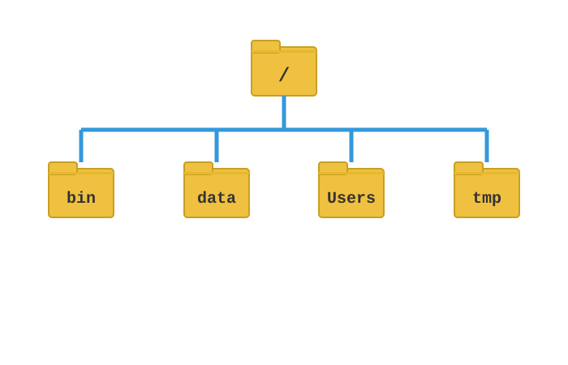
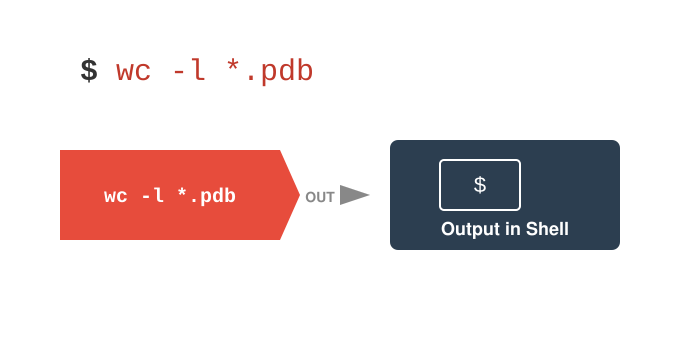

Single-cell RNA-seq analysis lives at the intersection of two tools: the **Unix command line**, which you use to move and inspect data files, download references, and run pipelines; and the **R language**, which you use for the statistical analysis and visualization that make up most of this workshop. This chapter is a self-contained refresher on both. We start with the command line, because it is the gateway — it is how you navigate the filesystem, manage files, and stream large genomic data through small composable tools — and then move to R, covering the interpreter, RStudio, data structures, functions, and the tidyverse.

::: {.callout-tip title="P2 reading"}
This is the reading for **P2 — R & the Command Line**, the second hour of the optional 2-hour Tuesday refresher. It pairs with the Module 2 lecture slides. If you are new to the toolchain, read this before Day 1 so the hands-on tutorials assume a common foundation. Everything here is display-only — open a terminal and an R session and try the examples yourself.
:::

# The Command Line


::: callout-tip
**Keep a cheat sheet open.** The [Cheat Sheets](../Cheat_Sheets.html) tab collects one-page Base-R, dplyr/tidyverse, ggplot2, and Unix references that pair with this module. You'll put all of this to work starting in [Module 01](../Materials.html).
:::

## Accessing the Shell

### What is Unix?

-   An operating system developed in 1969, released in 1973
-   Serves as the base language for many programs and computers
-   Runs both locally on your computer and on large clusters like Talapas
-   Linux is an open-source version of the same language

### What is a Shell?

-   The 'shell' is a program that runs UNIX and takes in commands and gives them to the operating system
-   **`Bash`** acts as the shell in Macs, Linux, and now Windows
-   You can access the shell via a **`terminal window`**

### Mac and Linux

-   Mac users: open the "Terminal" app, or use another app like 'iTerm2'
-   Linux users: open one of several "Terminal" apps

### Windows

::: {.callout-caution title="Windows users have a little more work to do"}
Windows users need the Windows Subsystem for Linux (WSL) before any of the commands below will work.
:::

-   Guide: `https://ubuntu.com/tutorials/install-ubuntu-on-wsl2-on-windows-10`
-   Run Windows PowerShell as administrator
-   Install WSL2 by typing `wsl --install`
-   Restart your computer
-   Search for and install Ubuntu from Microsoft store app
-   ***OR*** type `wsl --install -d ubuntu` on PowerShell to do both at once

To set up WSL:

-   Open Ubuntu and set up a username and password
-   Does not have to match your login info for Windows
-   Run `sudo apt update` then `sudo apt upgrade` to ensure everything is up to date
-   Will need to create folders and files within your Ubuntu folder on your computer

### Anatomy of a Shell Command

-   **Prompt**: notation used to indicate your computer is ready to accept a new command
-   **Command**: the building blocks of programming, tell computer to do a specific task
-   **Options**: change the behavior of a command
-   **Argument**: what the command should operate on

{fig-align="center" width="90%"}

## Navigating the File System

### How is a Computer Organized?

-   System of directories (folders) and files
-   `/` = the root directory, which holds all other directories
-   Most of your files will be located under `/Users` in a directory of your username
-   The `~` is shorthand for your home folder
-   Navigation in the shell consists of jumping up and down between directories
-   The "path" refers to the location a file is in (e.g., `/Users/wcresko/Documents`)

{fig-align="center" width="80%"}

{fig-align="center" width="90%"}

### Relative vs. Absolute Paths

-   **Absolute path**: Full path from root `/` (e.g., `/Users/wcresko/Documents`)
-   **Relative path**: Path from current location (e.g., `../Documents`)
-   `.` refers to the current directory
-   `..` refers to the parent directory

```bash
# Absolute path
cd /Users/wcresko/Documents

# Relative paths
cd ..           # Go up one directory
cd ./data       # Go into data directory (same as cd data)
cd ../scripts   # Go up one, then into scripts
cd ~            # Go to home directory
cd -            # Go to previous directory
```

### Common Navigation Commands

-   **`pwd`** = "print working directory" --- shows where you are
-   **`ls`** = "list" --- list all directories and files in current position
    -   `ls -F` = denote which results are directories, files, etc.
    -   `ls -l` = "long format" --- lists total file sizes
    -   `ls -r` = "reverse" --- lists the results in reverse order
    -   `ls -S` = "size" --- sort results by size
    -   `ls -t` = "time" --- sort results by time created
-   **`cd`** = "change directory"
    -   `cd ..` = go up one directory
    -   `cd -` = go to last directory
    -   `cd ~` = go to home directory

Try navigating around your computer using `cd` and `ls`:

```bash
# Where am I?
pwd

# What's in my home directory?
cd ~
ls -la

# Move into Documents
cd Documents
ls

# Go back up
cd ..
pwd
```

## Working with Files

### File Operations

-   Make new folders: `mkdir`
-   Make new files: `nano`, `touch`
-   Rename files: `mv`
-   Move files: `mv`
-   Copy files: `cp`
-   Delete files: `rm`
-   Delete directories: `rmdir`
-   Examining file length: `wc`
-   Reading files: `cat`
-   Looking at beginning or end: `head` or `tail`

A few important notes:

-   The shell trusts you
    -   It will delete files you say to delete
    -   It will override files if you name 2 things the same
-   Naming conventions
    -   Avoid spaces
    -   Don't start with a `–`
    -   Stick to letters, numbers, `.`, `-`, and `_`
-   Use appropriate file extensions in file names
    -   Some software expect files with certain extensions (`.fasta`, `.txt`, etc.)

::: {.callout-tip title="Hands-On Exercise: File Operations"}
1.  Make a new directory called whatever you'd like
2.  Add a file named `Practice.txt` to the directory and add some text
3.  Read the contents of the file and get its length
4.  Rename the file to `Super_practice.txt`
5.  Move the file to a new folder named `Testing`
6.  Make a copy named `Super_practice_copy.txt`
7.  Delete the original `Super_practice.txt`
:::

### Reading Files

-   **`cat`** = concatenate and display files (good for small files)
-   **`less`** = view file page by page (`space` forward, `b` back, `q` quit, `/pattern` search)
-   **`more`** = similar to `less` but simpler
-   **`head`** = display first 10 lines (default); `head -n 20 file.txt` for first 20
-   **`tail`** = display last 10 lines (default); `tail -f file.txt` follows a growing file

```bash
# View entire small file
cat small_file.txt

# Page through a large file
less large_file.txt

# First and last lines
head -n 5 data.txt
tail -n 5 data.txt

# Follow a log file in real time
tail -f logfile.txt
```

## Input and Output Redirection

### Input Redirection

-   **`<`** = redirect input from a file (`command < input.txt`)
-   **`<<`** = here document (multi-line input)
-   Example uses:
    -   `wc -l < data.txt` counts lines in data.txt
    -   `sort < names.txt` sorts contents of names.txt
    -   Many commands can read from files directly OR from `stdin`

```bash
# Count lines using redirection
wc -l < data.txt

# Sort file contents
sort < names.txt

# Word count
wc -w < report.txt
```

### Output Redirection

-   **`>`** = redirect output to a file (overwrites!)
-   **`>>`** = append output to a file
-   **`2>`** = redirect error messages
-   **`&>`** = redirect both output and errors

```bash
# Save file listing to a file (overwrites)
ls -l > filelist.txt

# Append to existing file
echo "new line" >> existing.txt

# Capture errors separately
command 2> errors.txt

# Capture everything
command &> all_output.txt
```

### The Three Standard Streams

-   **stdin (0)** = Standard Input (default: keyboard)
-   **stdout (1)** = Standard Output (default: terminal screen)
-   **stderr (2)** = Standard Error (default: terminal screen)

```text
         ┌──────────────┐
stdin ───>│              │───> stdout
    (0)  │   Program    │      (1)
         │              │───> stderr
         └──────────────┘      (2)
```

-   File descriptor numbers: 0, 1, 2
-   Can redirect each stream independently
-   Programs don't know if streams are redirected
-   This abstraction is key to Unix philosophy

```bash
# Redirect stdout to file (equivalent ways)
ls -l > files.txt
ls -l 1> files.txt

# Redirect stderr to file
ls /nonexistent 2> errors.txt

# Redirect both to same file
ls -l /nonexistent &> all_output.txt
```

## Pipes

### What are Pipes?

-   **`|`** = the pipe operator
    -   Takes output from one command as input to another
    -   Chains commands together
    -   No intermediate files needed!
-   Basic syntax: `command1 | command2 | command3`
-   Power of Unix philosophy:
    -   Small tools that do one thing well
    -   Combine them to do complex tasks

{fig-align="center" width="90%"}

### Common Pipe Patterns

-   **Counting patterns:** `grep "pattern" file.txt | wc -l`
-   **Sorting and uniqueness:** `cat file.txt | sort | uniq`
-   **Finding top/bottom items:** `sort data.txt | head -5`
-   **Filtering and processing:** `ls -l | grep ".txt" | awk '{print $5, $9}'`

```bash
# Extract column 2, count unique values, sort by frequency
cat data.csv | cut -d',' -f2 | sort | uniq -c | sort -rn

# Find all txt files and sort by line count
find . -name "*.txt" | xargs wc -l | sort -n

# Watch log file for errors in real-time
tail -f logfile.txt | grep ERROR
```

A full pipeline reads top to bottom:

```bash
# Read a file, process it, save results, and display
cat data.txt | \
  grep -v "^#" | \       # Remove comment lines
  cut -f1,3 | \          # Extract columns 1 and 3
  sort -k2 -n | \        # Sort by column 2 numerically
  tee results.txt | \    # Save to file AND pass along
  head -10               # Show top 10
```

### A Bioinformatics Pipeline Example

```bash
# FASTQ processing pipeline with error handling
zcat reads.fastq.gz 2> unzip_errors.log |
fastqc stdin 2> qc_errors.log |
trimmomatic 2> trim_errors.log |
bowtie2 -x genome - 2> alignment_stats.txt |
samtools sort 2> sort_errors.log |
samtools index - 2> index_errors.log

# Check all error logs at once
cat *_errors.log | grep -E "ERROR|WARNING"
```

Tips for building pipelines:

-   Test pipes step by step --- build complex pipes incrementally
-   Check output at each stage
-   Use `less` for large files instead of `cat`
-   Remember: `>` overwrites, `>>` appends
-   Filter early in the pipeline to reduce data passed between commands
-   Save intermediate results when debugging complex pipes

::: {.callout-tip title="Hands-On Exercise: Files and Pipes"}
1.  Create a file with a list of numbers (one per line)
2.  Use pipes to sort them numerically
3.  Save the sorted list to a new file using redirection
4.  Use `tee` to display and save the top 5 numbers
5.  Count how many unique numbers you have using pipes
6.  Append the count to your results file
:::

## Working with Large Genomic Data Files

-   Genomic data files can be massive (human genome \~6 billion base pairs)
-   FASTA format is standard for sequence data
-   Perfect use case for Unix pipes and redirection
-   Let's work with human genome assembly version 38 (\~3.1 GB)

### Downloading Genomic Data

```bash
# Using wget to download human genome
wget https://ftp.ncbi.nlm.nih.gov/genomes/all/GCF/000/001/405/\
GCF_000001405.40_GRCh38.p14/GCF_000001405.40_GRCh38.p14_genomic.fna.gz

# Using curl and save with specific name
curl -o human_genome.fa.gz https://ftp.ncbi.nlm.nih.gov/genomes/all/GCF/000/001/405/\
GCF_000001405.40_GRCh38.p14/GCF_000001405.40_GRCh38.p14_genomic.fna.gz
```

-   `wget` and `curl` are both tools for downloading files
-   The backslash (`\`) allows long URLs to span multiple lines
-   `.gz` extension means the file is compressed

### Examining Large Files Efficiently

```bash
# Decompress and look at first 10 lines
gunzip -c human_genome.fa.gz | head -10

# Check file size before and after decompression
ls -lh human_genome.fa.gz
gunzip human_genome.fa.gz
ls -lh human_genome.fa

# Count sequences in FASTA file (lines starting with >)
grep "^>" human_genome.fa | wc -l

# View sequence headers only
grep "^>" human_genome.fa | less
```

::: {.callout-important title="Don't use cat on huge files!"}
Use `head`, `tail`, `less`, or streaming tools instead. Loading a 3 GB file into memory with `cat` will slow down or crash your session.
:::

### Processing FASTA Files with Pipes

```bash
# Extract just the sequence (no headers) and count bases
grep -v "^>" human_genome.fa | tr -d '\n' | wc -c

# Count each type of nucleotide
grep -v "^>" human_genome.fa | \
  tr -d '\n' | \
  fold -w1 | \
  sort | \
  uniq -c
```

```bash
# Download, decompress, and process in one pipeline
curl -s https://url/to/genome.fa.gz | \
  gunzip -c | \
  grep -v "^>" | \
  tr -d '\n' | \
  cut -c1-1000000 > first_megabase.txt
```

### Working with Compressed Files

```bash
# View compressed files without extracting
zcat file.gz | head
zless file.gz
zgrep "pattern" file.gz
```

```bash
# Compress and decompress
gzip file.txt          # Creates file.txt.gz
gunzip file.txt.gz     # Restores file.txt
gzip -k file.txt       # Keep original file

# Concatenate compressed files
zcat file1.gz file2.gz | gzip > combined.gz
```

::: {.callout-note title="Unix Best Practices for Large Data"}
-   Real bioinformatics often involves gigabytes of data --- these Unix tools scale beautifully
-   **Never load entire genome files into memory** --- use streaming
-   **Combine tools** --- each does one thing well
-   **Test on subsets first** --- extract small portions for development
-   **Document your pipelines** --- save commands in scripts
-   **Use compression** --- work with `.gz` files directly when possible
-   **Think in streams** --- data flows through pipes without intermediate files
:::

## Getting Help at the Command Line

-   Manual pages!
    -   The shell has manuals for all basic commands
    -   Type `man [command_name]` to access the manual for a specific command
    -   Type `q` to exit
-   Also... the internet!
-   Also... Generative AI (ChatGPT, Claude, etc.)

# The R Language

## Why R?

-   Good general scripting tool for statistics and mathematics
-   Powerful, flexible, and free
-   Runs on all computer platforms
-   New enhancements coming out all the time
-   Superb data management & graphics capabilities
-   Reproducibility --- keep your scripts to see exactly what was done
-   You can write your own functions
-   Lots of online help available
-   Can use a nice GUI front end such as `RStudio`
-   Can embed your `R` analyses in dynamic, polished files using `Quarto Markdown`

### R Scripts and Quarto Markdown

-   Often we want to write scripts that can just be run --- `R scripts`
-   We can also embed code in Quarto Markdown files for more annotations
-   This improves interpretability and reproducibility
-   You can insert `R code chunks` into `Quarto Markdown` documents
-   A series of R commands that will be executed
-   Can add comments using hashtags `#`
-   Can have pipes (`|>`) to connect one step to the next

## R Basics

### Basic Math in R

```r
4 * 4
(4 + 3 * 2^2)
```

-   Commands can be submitted through the terminal, console, or scripts
-   R follows the normal priority of mathematical evaluation (PEMDAS)
-   Parentheses control order of operations just as in algebra

### Assigning Variables

```r
x <- 2
x * 3
y <- x * 3
y - 2
```

-   Variables are assigned values using the `<-` operator
-   Variable names must begin with a letter
-   R is case sensitive (`x` and `X` are different)
-   The result of calculations can be assigned to new variables
-   Names like `3y <- 3` or `3*y <- 3` will not work

### Arithmetic Operations and Functions

```r
# Common math functions
x + 2
x^2
log(x)    # natural log (built-in function)
sqrt(x)

# Assigning results
y <- 67
print(y)
x <- 124
z <- (x * y)^2
print(z)
```

-   `log` is a built-in function --- the object goes in parentheses
-   Functions can take arguments that modify behavior (e.g., `log(x, base = 10)`)
-   The outcome of calculations can be assigned to new variables
-   Use `print()` to display values explicitly

### Getting Help in R

```r
help(mean)           # Open help page
?mean                # Same as help()
example(mean)        # Show examples
help.search("mean")  # Search help pages
apropos("mean")      # Find functions with "mean" in name
args(mean)           # Show function arguments
```

-   Help pages exist for all functions explaining parameters and usage
-   Function calls have a simple structure: function name + parentheses + parameters
-   The `example()` function is especially useful for seeing how functions work
-   When in doubt, check the help page!

## Data Types and Structures

### Strings

```r
x <- "I Love"
print(x)
y <- "Bioengineering"
print(y)
z <- c(x, y)    # c stands for concatenate
print(z)
```

-   Characters need to be set off by quotation marks
-   The `c()` function stands for `concatenate`
-   Reusing variable names overwrites previous assignments
-   Good practice: use descriptive, unique names for each variable

### Vectors

```r
# Create a vector with c()
x <- c(2, 3, 4, 2, 1, 2, 4, 5, 10, 8, 9)
print(x)

# Operations work element-wise
y <- x^2
print(y)

# Plot vectors
plot(x, y)
```

-   R thinks in terms of **vectors** (a list of values)
-   Vectors can be assigned directly using the `c()` function
-   Mathematical operations on vectors work element-wise
-   Writing programs with vectors in mind will simplify most things

#### Types of Vectors

| Type   | Description                              | Example                    |
|--------|------------------------------------------|----------------------------|
| `int`  | Integers                                 | `1L, 2L, 3L`              |
| `dbl`  | Doubles (real numbers)                   | `3.14, 2.718`              |
| `chr`  | Character strings                        | `"hello", "DNA"`           |
| `lgl`  | Logical (TRUE/FALSE)                     | `TRUE, FALSE, NA`          |
| `fctr` | Factors (categorical variables)          | `factor(c("a","b","a"))`   |
| `dttm` | Date-times                               | `Sys.time()`               |
| `date` | Dates                                    | `Sys.Date()`               |

Special values:

-   Logical vectors can take: `FALSE`, `TRUE`, or `NA` (not available)
-   Doubles have four special values: `NA`, `NaN` (not a number), `Inf`, `-Inf`
-   Integer and double vectors are collectively known as **numeric** vectors
-   In R, numbers are doubles by default

### Basic Statistics on Vectors

```r
mean(x)
median(x)
var(x)
sd(x)        # standard deviation
log(x)
sqrt(x)
sum(x)
length(x)
sample(x, replace = TRUE)  # random sample with replacement
```

-   Many built-in functions operate on vectors
-   `sample()` has an argument `replace = T` --- arguments modify function behavior
-   There are many arguments for each function, some of which are defaults
-   Use `?function_name` to see the help page for any function

### Creating Vectors with Sequences

```r
# Ascending sequence
seq_1 <- seq(0.0, 10.0, by = 0.1)
print(seq_1)

# Descending sequence
seq_2 <- seq(10.0, 0.0, by = -0.1)
print(seq_2)

# Element-wise operations
seq_square <- (seq_2)^2
print(seq_square)
```

-   `seq()` creates sequences with a specified start, end, and step size
-   The three arguments in the parentheses are: start, end, and step
-   Operations on sequences work element-wise, just like simple vectors

## Sampling from Distributions

### Drawing Random Samples

```r
# Draw from normal distribution
x <- rnorm(10000, 0, 10)
hist(x)

# Draw uniform random integers
y <- sample(1:10000, 10000, replace = TRUE)

# Combine and plot
xy <- cbind(x, y)
plot(x, y)
```

-   `rnorm(n, mean, sd)` draws `n` random values from a normal distribution
-   `sample()` draws random values with equal probability
-   `cbind()` binds columns together into a matrix
-   These tools are fundamental for simulation and statistical analysis

### Overlaying Density Curves

```r
x <- rnorm(1000, 0, 100)
hist(x, xlim = c(-500, 500), probability = TRUE)
curve(dnorm(x, 0, 100), xlim = c(-500, 500), add = TRUE, col = 'red', lwd = 2)
```

-   `dnorm()` generates the probability density function
-   `curve()` plots a function --- `add = TRUE` overlays on existing plot
-   The red curve shows the theoretical distribution we sampled from
-   Histograms with density overlays help verify sampling behavior

## Data Frames

### Creating Data Frames

```r
# Set up vectors as columns
hydrogel_concentration <- factor(c("low", "high", "high", "high",
                                    "medium", "medium", "medium", "low"))
compression <- c(3.4, 3.4, 8.4, 3, 5.6, 8.1, 8.3, 4.5)
conductivity <- c(0, 9.2, 3.8, 5, 5.6, 4.1, 7.1, 5.3)

# Create data frame
mydata <- data.frame(hydrogel_concentration, compression, conductivity)
row.names(mydata) <- c("Sample_1", "Sample_2", "Sample_3", "Sample_4",
                        "Sample_5", "Sample_6", "Sample_7", "Sample_8")
print(mydata)
```

-   Data frames are the primary data structure for tabular data in R
-   Vectors become columns when combined with `data.frame()`
-   `factor()` creates categorical variables with fixed levels
-   `row.names()` assigns labels to each row

### Reading and Writing Data

```r
# Comma-separated files
YourFile <- read.table('yourfile.csv', header = TRUE, row.names = 1, sep = ',')
# OR use the convenience function:
YourFile <- read.csv('yourfile.csv')

# Tab-separated files
YourFile <- read.table('yourfile.txt', header = TRUE, row.names = 1, sep = '\t')

# Tidyverse versions (return tibbles)
YourFile <- read_csv('yourfile.csv')
YourFile <- read_tsv('yourfile.txt')

# Excel files
library(readxl)
YourFile <- read_excel('yourfile.xlsx')
```

```r
# Write to CSV
write.table(YourFile, "yourfile.csv", quote = FALSE, row.names = TRUE, sep = ",")
# OR:
write.csv(YourFile, "yourfile.csv")

# Write to TSV
write.table(YourFile, "yourfile.txt", quote = FALSE, row.names = TRUE, sep = "\t")

# Tidyverse version
write_csv(YourFile, "yourfile.csv")
```

-   `header = TRUE` indicates the first row contains column names
-   `row.names = 1` indicates the first column contains row names
-   `sep` specifies the delimiter (`,` for CSV, `\t` for TSV)
-   The tidyverse `read_csv()` and `read_tsv()` functions return tibbles (enhanced data frames)

### Indexing Data Frames

```r
# Access by column number
print(mydata[, 2])

# Access by column name (preferred)
print(mydata$compression)

# Access by row number
print(mydata[2, ])

# Access specific cell
print(mydata[2, 3])

# Subset based on condition
print(mydata$compression > 5)

# Plot two columns
plot(mydata$compression, mydata$conductivity)
```

-   `[row, column]` notation accesses specific elements
-   `$` notation accesses columns by name (preferred --- more readable)
-   Leaving a dimension empty selects all (e.g., `[, 2]` = all rows, column 2)
-   Logical conditions return TRUE/FALSE vectors for subsetting

## Base R Visualization

### Basic Plotting

```r
seq_1 <- seq(0.0, 10.0, by = 0.1)
plot(seq_1,
     xlab = "space",
     ylab = "function of space",
     type = "p",        # "p" = points, "l" = lines, "b" = both
     col = "red",
     main = "Basic R Plot")
```

-   `plot()` is the main high-level plotting function in base R
-   Arguments like `xlab`, `ylab`, `col`, and `type` control appearance
-   `type` options: `"p"` (points), `"l"` (lines), `"b"` (both), `"h"` (histogram-like)
-   Most people use `ggplot2` for publication-quality graphics (see below)

### Multi-Panel Figures

```r
par(mfrow = c(2, 2))  # 2 rows, 2 columns
plot(seq_1, xlab = "time", ylab = "p in pop 1", type = "p", col = 'red')
plot(seq_2, xlab = "time", ylab = "p in pop 2", type = "p", col = 'green')
plot(seq_square, xlab = "time", ylab = "p2 in pop 2", type = "p", col = 'blue')
plot(seq_1^2, xlab = "time", ylab = "p in pop 1", type = "l", col = 'orange')
```

-   `par(mfrow = c(rows, cols))` sets up a multi-panel layout
-   Subsequent `plot()` calls fill panels left-to-right, top-to-bottom
-   This is useful for comparing related visualizations side by side

### Summary Statistics and Figures

```r
# Summary statistics
summary(mydata$compression)

# Histogram
hist(mydata$compression)

# Boxplot by group
boxplot(compression ~ hydrogel_concentration, data = mydata,
        col = "steelblue",
        ylab = "Compression",
        xlab = "Hydrogel Concentration",
        main = "Compression by Hydrogel Concentration")
```

-   `summary()` provides min, max, quartiles, mean, and median
-   The formula notation `y ~ x` means "y grouped by x"
-   Boxplots show median, IQR, and potential outliers
-   These are quick exploratory tools --- use `ggplot2` for publication graphics

## Tidy Data Principles

::: {.callout-note title="Rules of Thumb for Data Organization"}
-   Store data in nonproprietary formats (plain ASCII text / flat files)
-   Leave an uncorrected original file when doing analyses
-   Use descriptive names for your data files and variables
-   Include a header line with descriptive variable names
-   Maintain effective metadata about the data (data dictionary)
-   When you add observations, add rows
-   When you add variables, add columns
-   A column of data should contain only one data type
:::

### Types of Data

|            |           |               |              |
|:----------:|:---------:|:-------------:|:------------:|
| Categorical|           | Quantitative  |              |
| Ordinal    | Nominal   | Ratio         | Interval     |
| small, medium, large | apples, oranges | kilograms, dollars | temperature, calendar year |
| ordered character | character | numeric | integer |

`Factor` is a special type of character variable that R uses to represent categorical variables with fixed possible values.

## Other R Data Structures

The earlier sections cover **vectors** and **data frames**, which carry most of the workflow. Three other structures show up regularly in scRNA-seq code; you should recognize them on sight.

### Lists — the "pocket that holds anything"

A **list** is the most flexible R container: each slot can hold a different kind of thing. A vector of numbers, a string, another list, a data frame, a function — all in one object. Seurat objects, `SingleCellExperiment` objects, and most output of `lapply()` / `purrr::map()` are technically lists under the hood.

```r
experiment <- list(
  sample_id = "donor_01_CTRL",
  age       = 42,
  cell_types = c("B cell", "CD4 T", "Monocyte", "NK"),
  qc_metrics = data.frame(
    metric = c("nCount_RNA", "nFeature_RNA", "percent.mt"),
    median = c(8500, 2300, 4.2)
  )
)

# Access by name with $:
experiment$sample_id
experiment$cell_types
experiment$qc_metrics$median

# Or by [[index]]:
experiment[[3]]              # third element (cell_types)
```

::: callout-note
**`[]` vs `[[]]` on a list.** `experiment[1]` returns a length-1 list (a sub-list); `experiment[[1]]` returns the **content** of the first slot. The double-bracket form is what you usually want.
:::

### Matrices — like data frames, but one type only

A **matrix** is a 2-D structure where every cell is the same type — typically all numeric. Faster than a data frame for math, more limited because you can't mix text and numbers. Most scRNA-seq counts matrices are matrices (specifically *sparse* matrices, class `dgCMatrix` from the `Matrix` package — a memory-efficient matrix that only stores non-zero values).

```r
m <- matrix(1:12, nrow = 3, ncol = 4)
m
#      [,1] [,2] [,3] [,4]
# [1,]    1    4    7   10
# [2,]    2    5    8   11
# [3,]    3    6    9   12

# Indexing — same [row, col] notation as data frames
m[2, 3]              # 8
m[, 2]               # column 2 as a vector
m[1, ]               # row 1 as a vector

# A 10x counts matrix is a (sparse) matrix:
# library(Seurat)
# counts <- Read10X("data/filtered_feature_bc_matrix/")
# class(counts)        # "dgCMatrix"
# dim(counts)          # 33538 features × 1222 cells, mostly zero
```

::: {.callout-tip title="Why scRNA-seq uses sparse matrices"}
A typical 10x dataset is \~95% zeros. A dense matrix of 30,000 genes × 14,000 cells in `double` precision would be \~3.4 GB. The same counts as a `dgCMatrix` (which only stores non-zero entries + their coordinates) is \~150 MB. Every Seurat / Scanpy / Bioconductor workflow uses sparse matrices internally for this reason.
:::

### Factors — categorical variables with fixed levels

A **factor** is R's way of representing categorical data: a character vector with a defined, ordered set of allowed values ("levels"). Crucial for correct statistical models — without it, R treats "treatment" / "control" as arbitrary text rather than a designed comparison.

```r
# Plain character vector
condition_chars <- c("CTRL", "STIM", "CTRL", "STIM", "STIM")

# As a factor — explicit levels
condition <- factor(condition_chars, levels = c("CTRL", "STIM"))
condition
# [1] CTRL STIM CTRL STIM STIM
# Levels: CTRL STIM

# Why levels matter: in a regression, the FIRST level is the
# reference. ~ condition will compare STIM vs CTRL (CTRL = reference).
# If you'd typed factor(condition_chars, levels = c("STIM","CTRL")),
# the comparison would flip.

table(condition)
levels(condition)
nlevels(condition)
```

In Seurat objects, `Idents()` is a factor; `meta.data$stim` is a factor; cluster assignments (`seurat_clusters`) are factors. Knowing how to manipulate them — `relevel()` to change the reference, `droplevels()` to remove unused levels, `factor(..., ordered = TRUE)` for ordinal data — is fundamental for downstream analysis.

## Functions in Depth

You've already used many R functions (`mean()`, `c()`, `read.csv()`, ...). Two practical points worth knowing.

### Named vs positional arguments

```r
# Positional — values are assigned to arguments in declaration order
round(3.14159, 2)            # 3.14
round(2, 3.14159)            # 2 — argument order matters!

# Named — explicit, order-independent, far more readable
round(x = 3.14159, digits = 2)
round(digits = 2, x = 3.14159)   # same thing

# Recommended in real code: positional for the first one or two
# obvious args, named for the rest
seq(from = 1, to = 10, by = 0.5)

# In Seurat / scRNA-seq code, almost everything uses named args
# because the function signatures are long:
# CreateSeuratObject(counts = mat, project = "study1",
#                    min.cells = 3, min.features = 200)
```

The rule: **use named arguments whenever there's any ambiguity**. They're self-documenting, survive package version bumps better, and are easier for someone (including future-you) to read.

### Defining your own functions

```r
# A function that computes the coefficient of variation of a numeric vector
cv <- function(x, na.rm = TRUE) {
  if (na.rm) x <- x[!is.na(x)]
  sd(x) / mean(x)
}

cv(c(1, 2, 3, 4, 5))         # 0.527
cv(c(1, 2, NA, 4, 5))        # 0.612 (after dropping NA)
```

You'll write helper functions all the time in scRNA-seq pipelines — typically as 5–15-line wrappers around Seurat / Bioconductor calls. Tutorial 06 (Pseudobulk DE) defines a `run_de(ct)` function exactly this way.

## The tidyverse — `dplyr` Data Manipulation

Most modern R for biology is written in **tidyverse** style. Six functions cover \~80% of what you'll do with data frames:

| Verb | What it does |
|---|---|
| `filter()` | Keep rows that match a condition |
| `select()` | Keep / drop / reorder columns |
| `mutate()` | Add or modify columns |
| `arrange()` | Sort rows |
| `summarise()` | Collapse to one row per group (paired with `group_by()`) |
| `group_by()` | Set the grouping for downstream summarise / mutate |

The **pipe** `|>` (or the older `%>%` from `magrittr`) chains these into pipelines that read top-to-bottom:

```r
library(tidyverse)

# Suppose `meta` is per-cell metadata: barcode, sample, cluster, nCount_RNA, nFeature_RNA
top10_clusters_per_sample <- meta |>
  filter(nFeature_RNA > 200, nFeature_RNA < 2500) |>     # QC filter
  group_by(sample, cluster) |>
  summarise(
    n_cells     = n(),
    median_umi  = median(nCount_RNA),
    .groups     = "drop"
  ) |>
  arrange(sample, desc(n_cells)) |>
  group_by(sample) |>
  slice_head(n = 10)
```

Read top-to-bottom: "take `meta`, filter by QC, group by sample × cluster, summarise to one row per group, sort, take top 10 per sample". This style — `tidyverse` verbs chained with `|>` — appears all over the workshop tutorials. If it's new to you, [R for Data Science (2e)](https://r4ds.hadley.nz/) is the canonical free reference.

## Visualization with `ggplot2`

The Base R `plot()` examples earlier work but are limited. **`ggplot2`** is the standard for publication-quality figures and is what you'll see throughout the workshop. The key insight is the **grammar of graphics**: a plot is built from layered components.

| Component | What it is | Examples |
|---|---|---|
| **Data** | The data frame | `mpg`, `seu@meta.data`, ... |
| **Aesthetics** (`aes()`) | Mappings: which column to which visual property | `aes(x = pc1, y = pc2, color = celltype)` |
| **Geoms** | The visual mark | `geom_point()`, `geom_bar()`, `geom_violin()`, `geom_tile()` |
| **Stats** | Pre-plot transformations | `stat_smooth()`, `stat_summary()` |
| **Scales** | Color, axis, size scales | `scale_color_brewer()`, `scale_x_log10()` |
| **Facets** | Sub-plots by group | `facet_wrap(~sample)`, `facet_grid(condition ~ celltype)` |
| **Themes** | Non-data display | `theme_minimal()`, `theme(legend.position = "bottom")` |

A minimum-viable `ggplot`:

```r
library(ggplot2)

# A scatter — one point per cell, colored by cell type
ggplot(seu@meta.data, aes(x = nCount_RNA, y = nFeature_RNA, color = celltype)) +
  geom_point(alpha = 0.5, size = 0.6) +
  scale_x_log10() +
  scale_y_log10() +
  labs(title = "QC: counts vs features",
       x = "Total UMI per cell (log)",
       y = "Detected genes per cell (log)") +
  theme_minimal()
```

Build up by **adding layers with `+`**:

```r
# Add a smoothed regression line and facet by sample
ggplot(seu@meta.data, aes(x = nCount_RNA, y = nFeature_RNA)) +
  geom_point(alpha = 0.4, size = 0.6, color = "#34495e") +
  geom_smooth(method = "lm", color = "#c0392b") +
  facet_wrap(~ stim) +
  scale_x_log10() +
  scale_y_log10() +
  labs(title = "Counts × features per sample") +
  theme_bw(base_size = 12)
```

::: {.callout-tip title="Five geoms that cover most scRNA-seq plotting"}
-   `geom_point()` — UMAP / PCA scatter, QC scatter
-   `geom_violin()` + `geom_jitter()` — `VlnPlot()` is built on these
-   `geom_tile()` — heatmaps, e.g. cell-type × marker-gene dot plots
-   `geom_bar(stat = "identity")` / `geom_col()` — proportion bar plots
-   `geom_smooth()` — adding regression lines to QC scatters
:::

For the canonical free reference: [`ggplot2`: Elegant Graphics for Data Analysis (Wickham et al.)](https://ggplot2-book.org/). The Cheat Sheet on the [RStudio cheatsheet collection](https://rstudio.github.io/cheatsheets/) is also gold.

::: callout-note
**Parallel reading.** [scNotebooks Module 02 — Introduction to R + ggplot2](https://integrativebioinformatics.github.io/scNotebooks/modules/en/module02/module02.html) covers this same material as a runnable Jupyter notebook (with R kernel) on Google Colab. Open it alongside this chapter if you want a runnable companion.
:::

## Further reading

- [R for Data Science (2e) — Wickham, Çetinkaya-Rundel & Grolemund](https://r4ds.hadley.nz/) — the standard free book for the tidyverse workflow.
- [Advanced R — Wickham](https://adv-r.hadley.nz/) — how R really works (environments, S3/S4, functionals), for when you're ready to go deeper.
- [Software Carpentry — the Unix Shell](https://swcarpentry.github.io/shell-novice/) and [Programming with R](https://swcarpentry.github.io/r-novice-inflammation/) — gentle, hands-on lessons.
- **Quick reference:** the [Cheat Sheets](../Cheat_Sheets.html) (R language & command line); [Appendix C — grep/regex/shell](Appendix_C_GREP_Regex_Shell.html).
